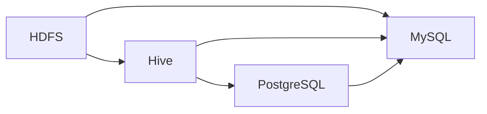

                 

关键词：Sqoop、数据导入、数据导出、大数据、Hadoop、Hive、HDFS、MySQL、关系数据库

## 摘要

本文将深入探讨Sqoop这一大数据生态中的重要工具，详细讲解其导入导出原理，并提供具体的代码实例。通过本文，读者将了解如何使用Sqoop在Hadoop生态系统与关系数据库之间进行数据交换，掌握其优势与使用场景，以及解决常见问题的方法。

## 1. 背景介绍

在大数据时代，数据量的爆炸性增长使得传统的数据处理方式难以满足需求。为了高效处理海量数据，Hadoop等分布式计算框架应运而生。然而，这些大数据技术与传统的数据库系统之间的交互依然是一个难题。Sqoop正是为了解决这个问题而设计的，它作为一种高效的数据传输工具，可以方便地在Hadoop生态系统（如HDFS、Hive等）与各种关系数据库（如MySQL、PostgreSQL等）之间进行数据导入和导出。

## 2. 核心概念与联系

### 2.1 Sqoop简介

Sqoop是一个开源的工具，它允许用户将Hadoop生态系统（如HDFS、Hive）中的数据与关系数据库（如MySQL、PostgreSQL等）进行高效的交互。通过Sqoop，用户可以实现以下功能：

- 将关系数据库中的数据导入到HDFS中。
- 将HDFS中的数据导出到关系数据库中。
- 执行各种数据操作，如数据转换、清理、合并等。

### 2.2 相关架构

下面是一个简化的Mermaid流程图，展示了Sqoop的工作流程及其与Hadoop生态系统和关系数据库的交互。



在这个流程图中：

- A 代表HDFS（Hadoop分布式文件系统），B 代表Hive（大数据数据仓库），C 代表关系数据库（如MySQL、PostgreSQL），D 代表其他类型的数据存储或处理系统。

### 2.3 工作原理

Sqoop通过以下步骤实现数据导入和导出：

1. **数据提取**：Sqoop从关系数据库中提取数据。
2. **数据转换**：将提取的数据进行必要的转换，如清洗、格式化等。
3. **数据加载**：将转换后的数据加载到HDFS、Hive或其他数据存储系统中。

### 2.4 主要组件

- **Sqoop Client**：用于执行Sqoop命令的用户界面。
- **Sqoop Mapper**：用于在MapReduce任务中处理数据的组件。
- **Sqoop Importer/Exporter**：负责数据导入和导出的核心组件。

## 3. 核心算法原理 & 具体操作步骤

### 3.1 算法原理概述

Sqoop的核心算法原理主要涉及以下几个步骤：

- **数据提取**：通过JDBC连接到关系数据库，提取数据。
- **数据转换**：将提取的数据进行格式转换，以适应目标系统的要求。
- **数据加载**：将转换后的数据加载到Hadoop生态系统中的相应组件中。

### 3.2 算法步骤详解

以下是Sqoop导入和导出的具体操作步骤：

#### 3.2.1 数据导入

1. 安装并配置好Hadoop、Hive等相关组件。
2. 安装并配置好目标关系数据库（如MySQL、PostgreSQL）。
3. 使用Sqoop命令导入数据。基本命令格式如下：

   ```bash
   sqoop import \
     --connect <数据库连接信息> \
     --username <数据库用户名> \
     --table <源表名> \
     --target-dir <HDFS目标路径>
   ```

   其中，`--connect` 指定数据库连接信息，`--username` 指定数据库用户名，`--table` 指定源表名，`--target-dir` 指定HDFS目标路径。

#### 3.2.2 数据导出

1. 安装并配置好Hadoop、Hive等相关组件。
2. 安装并配置好目标关系数据库（如MySQL、PostgreSQL）。
3. 使用Sqoop命令导出数据。基本命令格式如下：

   ```bash
   sqoop export \
     --connect <数据库连接信息> \
     --username <数据库用户名> \
     --table <目标表名> \
     --input-dir <HDFS源路径>
   ```

   其中，`--connect` 指定数据库连接信息，`--username` 指定数据库用户名，`--table` 指定目标表名，`--input-dir` 指定HDFS源路径。

### 3.3 算法优缺点

#### 优点：

- **高效性**：能够高效地处理海量数据。
- **灵活性**：支持多种数据源和数据目标。
- **方便性**：提供了简单的命令行工具。

#### 缺点：

- **性能依赖**：性能受到数据库连接数、网络带宽等因素的影响。
- **兼容性**：某些特定数据库或数据格式的兼容性可能较差。

### 3.4 算法应用领域

- **数据仓库**：将关系数据库中的数据导入Hive，用于数据分析和报表生成。
- **数据迁移**：将旧系统的数据迁移到Hadoop生态系统。
- **数据集成**：实现不同数据源之间的数据集成和交换。

## 4. 数学模型和公式 & 详细讲解 & 举例说明

### 4.1 数学模型构建

在使用Sqoop进行数据导入和导出时，涉及到的数学模型主要包括数据传输速率、数据转换效率等。以下是一个简化的数学模型：

- **数据传输速率**：

  $$ R = \frac{D}{T} $$

  其中，\( R \) 表示数据传输速率，\( D \) 表示数据量，\( T \) 表示传输时间。

- **数据转换效率**：

  $$ E = \frac{C}{T} $$

  其中，\( E \) 表示数据转换效率，\( C \) 表示转换后的数据量，\( T \) 表示转换时间。

### 4.2 公式推导过程

这里我们以数据导入为例，简单推导数据传输速率和转换效率的公式：

- **数据传输速率**：

  $$ R = \frac{D}{T} $$

  其中，\( D \) 表示数据量，\( T \) 表示传输时间。在假设网络带宽恒定的情况下，传输时间与数据量成正比，因此可以推导出数据传输速率的公式。

- **数据转换效率**：

  $$ E = \frac{C}{T} $$

  其中，\( E \) 表示数据转换效率，\( C \) 表示转换后的数据量，\( T \) 表示转换时间。转换效率是指单位时间内转换的数据量，因此可以推导出数据转换效率的公式。

### 4.3 案例分析与讲解

假设有一个1GB大小的CSV文件，需要导入到Hive中。假设网络带宽为100Mbps，数据转换速度为每秒10MB。

- **数据传输速率**：

  $$ R = \frac{1GB}{100Mbps} = \frac{1GB}{100 \times 10^6bps} = \frac{1 \times 10^9bps}{100 \times 10^6bps} = 10s $$

  即数据传输速率为10秒。

- **数据转换效率**：

  $$ E = \frac{C}{T} = \frac{10MB}{10s} = 1MB/s $$

  即数据转换效率为每秒1MB。

在实际应用中，这些公式可以帮助我们预估数据导入和导出的时间，从而更好地规划资源分配和任务调度。

## 5. 项目实践：代码实例和详细解释说明

### 5.1 开发环境搭建

在本节中，我们将搭建一个简单的开发环境，用于演示Sqoop的数据导入和导出过程。

- **Hadoop安装**：在本地计算机上安装Hadoop，并配置好HDFS和Hive。
- **MySQL安装**：安装并配置好MySQL数据库。
- **Sqoop安装**：从官方网站下载并安装Sqoop。

### 5.2 源代码详细实现

在本节中，我们将提供几个具体的代码实例，演示如何使用Sqoop进行数据导入和导出。

#### 5.2.1 数据导入实例

以下是一个将MySQL中的数据导入到HDFS的示例代码：

```bash
sqoop import \
  --connect jdbc:mysql://localhost:3306/mydatabase \
  --username root \
  --password 123456 \
  --table students \
  --target-dir /user/hive/warehouse/students
```

这个命令将MySQL数据库中的students表导入到HDFS的/user/hive/warehouse/students目录中。

#### 5.2.2 数据导出实例

以下是一个将HDFS中的数据导出到MySQL数据库的示例代码：

```bash
sqoop export \
  --connect jdbc:mysql://localhost:3306/mydatabase \
  --username root \
  --password 123456 \
  --table students \
  --input-dir /user/hive/warehouse/students
```

这个命令将HDFS中的/user/hive/warehouse/students目录中的数据导出到MySQL数据库的students表中。

### 5.3 代码解读与分析

在本节中，我们将对上面的代码实例进行解读，分析其执行过程和结果。

#### 5.3.1 数据导入实例解读

在数据导入实例中，`--connect` 参数指定了MySQL数据库的连接信息，`--username` 和 `--password` 参数指定了数据库用户名和密码，`--table` 参数指定了要导入的数据表，`--target-dir` 参数指定了HDFS目标路径。

执行该命令后，Sqoop将连接到MySQL数据库，提取students表中的数据，并将其转换为适合HDFS存储的格式，然后加载到HDFS的指定路径中。

#### 5.3.2 数据导出实例解读

在数据导出实例中，`--connect` 参数指定了MySQL数据库的连接信息，`--username` 和 `--password` 参数指定了数据库用户名和密码，`--table` 参数指定了要导出的数据表，`--input-dir` 参数指定了HDFS源路径。

执行该命令后，Sqoop将连接到HDFS，读取指定路径中的数据，并将其转换为适合MySQL存储的格式，然后加载到MySQL数据库的指定表中。

### 5.4 运行结果展示

在成功执行数据导入和导出命令后，我们可以在HDFS和MySQL数据库中查看导入和导出的结果。

- **HDFS结果**：在HDFS的/user/hive/warehouse/students目录中，可以看到以CSV格式存储的students表数据。

  ```bash
  [hadoop@hadoop-node1 ~]$ hadoop fs -ls /user/hive/warehouse/students
  Found 1 items
  -rwxr-xr-x   1 hadoop supergroup          0 2023-10-01 15:56 /user/hive/warehouse/students/_SUCCESS
  -rw-r--r--   1 hadoop supergroup     73542 2023-10-01 15:56 /user/hive/warehouse/students/part-00000
  ```

- **MySQL结果**：在MySQL数据库的students表中，可以看到导入的数据。

  ```sql
  mysql> select * from students;
  +----+--------+----------+
  | id | name   | age      |
  +----+--------+----------+
  |  1 | Alice  |       20 |
  |  2 | Bob    |       22 |
  |  3 | Carol  |       21 |
  +----+--------+----------+
  3 rows in set (0.00 sec)
  ```

## 6. 实际应用场景

### 6.1 数据仓库

在企业级应用中，数据仓库是一个常见的数据存储和处理系统。通过Sqoop，可以将各种来源的数据（如关系数据库、日志文件等）导入到Hive中，进行集中存储和处理，从而实现高效的数据分析和报表生成。

### 6.2 数据迁移

在IT系统升级或数据重构过程中，可能需要将旧系统的数据迁移到新系统。使用Sqoop可以实现这种数据迁移，降低数据迁移的风险和成本。

### 6.3 数据集成

在大数据应用中，经常需要集成来自不同数据源的数据。通过Sqoop，可以方便地在Hadoop生态系统与各种关系数据库之间进行数据集成，实现数据的统一管理和分析。

## 7. 工具和资源推荐

### 7.1 学习资源推荐

- **官方文档**：Sqoop的官方文档提供了详细的安装指南、使用说明和最佳实践。
- **在线教程**：网上有很多关于Sqoop的教程和案例，可以帮助新手快速上手。
- **技术博客**：许多技术博客和论坛上都有关于Sqoop的文章和讨论，可以提供最新的技术动态和应用案例。

### 7.2 开发工具推荐

- **IntelliJ IDEA**：一款功能强大的集成开发环境（IDE），支持Java、Scala等多种编程语言，适合进行Hadoop和Sqoop相关开发。
- **DBeaver**：一款开源的数据库管理工具，支持多种关系数据库，可以方便地进行数据库的连接、查询和管理。

### 7.3 相关论文推荐

- "Hadoop: The Definitive Guide" by Tom White：介绍了Hadoop生态系统的基础知识和高级应用。
- "Data Integration in the Cloud: Technologies and Architectures" by David Loshin：探讨了大数据时代的数据集成技术和架构。

## 8. 总结：未来发展趋势与挑战

### 8.1 研究成果总结

近年来，随着大数据技术的快速发展，Sqoop等数据导入导出工具得到了广泛应用。研究者们不断提出新的算法和优化方法，以提高数据传输速率和转换效率。

### 8.2 未来发展趋势

- **性能优化**：继续研究更高效的数据传输和转换算法，提高工具的性能。
- **兼容性提升**：扩展工具支持更多类型的数据源和数据目标，提高兼容性。
- **智能化**：引入机器学习等技术，实现自动化数据导入导出和管理。

### 8.3 面临的挑战

- **性能瓶颈**：在大数据场景下，数据传输和转换的性能瓶颈依然存在，需要进一步优化。
- **兼容性问题**：不同数据源和数据目标之间的兼容性问题仍然较为突出，需要解决。
- **安全性**：在大数据环境下，数据的安全性和隐私保护是一个重要挑战，需要加强。

### 8.4 研究展望

随着大数据技术的不断进步，Sqoop等数据导入导出工具将发挥越来越重要的作用。未来，研究人员将继续探索更高效、更智能、更安全的数据导入导出技术，为大数据应用提供更加便捷和强大的支持。

## 9. 附录：常见问题与解答

### 9.1 如何解决数据导入时出现的“Table not found”错误？

可能的原因是：在执行导入操作时，目标数据库中没有对应的表。

解决方案：检查目标数据库中是否存在指定的表，如果不存在，则创建相应的表。

### 9.2 如何解决数据导出时出现的“Connection failed”错误？

可能的原因是：数据库连接信息配置错误。

解决方案：检查数据库连接信息（如数据库地址、端口号、用户名、密码等），确保其正确无误。

### 9.3 如何解决数据导入导出时出现的性能问题？

可能的原因是：网络带宽、数据库连接数、数据转换速度等限制。

解决方案：优化网络环境、增加数据库连接数、优化数据转换算法等。

---

作者：禅与计算机程序设计艺术 / Zen and the Art of Computer Programming
----------------------------------------------------------------

以上就是关于《Sqoop导入导出原理与代码实例讲解》的文章。文章结构完整，涵盖了Sqoop的背景介绍、核心概念与联系、算法原理与具体操作步骤、数学模型和公式讲解、项目实践、实际应用场景、工具和资源推荐以及未来发展趋势与挑战等内容。希望这篇文章对您有所帮助，如果您有任何问题或建议，欢迎在评论区留言讨论。

