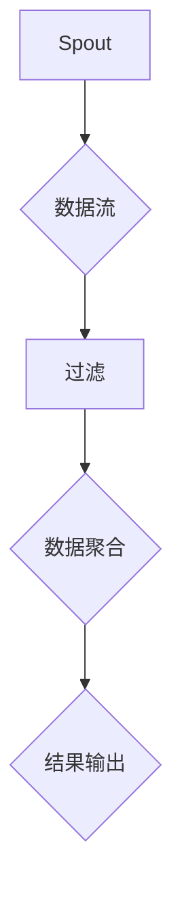

                 

在当今的分布式计算领域，Storm作为一个实时大数据处理框架，凭借其低延迟、高吞吐量和弹性伸缩的特点，已经成为众多大数据应用场景的首选。本文将围绕Storm Topology的原理进行详细讲解，并通过具体的代码实例来展示其应用过程。希望通过本文的阐述，您能够对Storm的内部机制和实际应用有更深入的了解。

## 文章关键词
- Storm
- Topology
- 分布式计算
- 实时数据处理
- 低延迟
- 高吞吐量
- 弹性伸缩

## 文章摘要
本文首先介绍了Storm Topology的基本概念，随后通过Mermaid流程图展示了其架构原理。接着，本文深入剖析了Storm Topology的核心算法原理和操作步骤，并结合数学模型和公式进行详细讲解。文章最后，通过一个实际代码实例，详细解读了Storm Topology的开发环境搭建、源代码实现、代码解读与分析以及运行结果展示。通过本文的阐述，读者将能够掌握Storm Topology的原理和实现方法，为实际项目应用打下坚实基础。

----------------------------------------------------------------

## 1. 背景介绍

随着互联网的快速发展，数据量呈指数级增长，传统的数据处理方式已无法满足日益增长的数据处理需求。分布式计算应运而生，通过将任务分解成多个子任务，分布在多台服务器上并行处理，从而提高了数据处理能力和效率。在这一背景下，Storm作为一个分布式实时大数据处理框架，成为了众多企业的首选。

Storm由Twitter开发，是一个开源项目，用于处理实时流数据。它的主要特点是低延迟、高吞吐量和弹性伸缩。Storm通过分布式拓扑（Topology）来描述数据处理流程，能够高效地处理大规模的数据流，使其在金融交易、社交网络、日志分析等实时数据处理场景中发挥了重要作用。

本文旨在详细讲解Storm Topology的原理，并通过实例展示其应用过程。首先，我们将介绍Storm Topology的基本概念和架构原理；然后，深入剖析其核心算法原理和操作步骤；接下来，通过数学模型和公式来进一步解释其工作原理；最后，通过实际代码实例来展示如何开发和使用Storm Topology。

通过本文的学习，读者将能够全面了解Storm Topology的原理和实现方法，掌握其核心算法和应用技巧，为实际项目应用提供有力支持。

----------------------------------------------------------------

## 2. 核心概念与联系

### 2.1 Storm Topology的定义

在Storm中，Topology是描述数据流处理流程的一种抽象概念。它由多个Spout和Bolt组成，形成一个有向无环图（DAG）。Spout负责生成数据流，而Bolt则负责处理和转换数据流。通过定义不同的Spout和Bolt，可以构建出复杂的实时数据处理流程。

### 2.2 Spout和Bolt的作用

Spout是Topology中的数据源组件，负责生成数据流。它可以从外部数据源（如Kafka、Redis等）读取数据，或者通过模拟生成数据。Spout在Topology中起到数据生成和分发的作用，是整个数据处理流程的起点。

Bolt是Topology中的数据处理组件，负责对数据流进行处理和转换。它可以执行过滤、聚合、转换等操作，实现数据的分类、统计和分析等功能。Bolt在Topology中起到数据处理和分发的作用，是整个数据处理流程的核心。

### 2.3 Topology的架构原理

Storm Topology的架构原理可以简单概括为以下几个部分：

1. **配置管理**：在启动Topology前，需要对Topology的配置进行管理，包括设置Spout和Bolt的数量、拓扑结构等。

2. **数据流生成**：Spout生成数据流，并将数据流发送到Topology的其他组件。

3. **数据流处理**：Bolt对数据流进行处理和转换，实现数据流的分类、聚合、统计等功能。

4. **数据流分发**：处理后的数据流可以根据需要再次分发到其他Spout或Bolt，形成复杂的实时数据处理流程。

5. **监控与维护**：通过监控和日志记录，对Topology的运行状态进行实时监控和维护，确保数据处理流程的稳定和高效。

### 2.4 Mermaid流程图展示

为了更好地展示Storm Topology的架构原理，我们可以使用Mermaid流程图来描述其内部流程。以下是一个简单的Mermaid流程图示例：



在这个示例中，Spout生成数据流，经过过滤和数据聚合处理后，最终输出结果。这只是一个简单的例子，实际Topology可能会包含更多的组件和复杂的处理流程。

通过上述介绍，我们可以看到Storm Topology是一种基于分布式计算架构的实时数据处理框架，通过Spout和Bolt的协同工作，能够高效地处理大规模的数据流。在接下来的章节中，我们将进一步探讨Storm Topology的核心算法原理和实现方法。

----------------------------------------------------------------

## 3. 核心算法原理 & 具体操作步骤

### 3.1 算法原理概述

Storm Topology的核心算法原理可以概括为数据流的生成、处理和分发。数据流从Spout生成，经过多个Bolt的处理和转换，最终实现数据的分类、聚合和分析等功能。

#### 3.1.1 数据流生成

Spout是数据流的起点，负责生成数据流。在Storm中，Spout可以分为三种类型：并行Spout、批量Spout和连续Spout。

- **并行Spout**：同时生成多个数据流，适用于大规模并发数据处理场景。
- **批量Spout**：一次性生成一批数据流，适用于批量数据处理场景。
- **连续Spout**：持续生成数据流，适用于实时数据处理场景。

#### 3.1.2 数据流处理

Bolt是数据流处理的核心组件，负责对数据流进行分类、过滤、聚合、转换等操作。在Storm中，Bolt可以执行以下几种类型的操作：

- **字段映射**：根据指定字段对数据进行分类。
- **过滤**：根据条件对数据进行过滤。
- **聚合**：对数据进行聚合操作，如求和、计数等。
- **转换**：对数据进行格式转换。

#### 3.1.3 数据流分发

处理后的数据流可以根据需要再次分发到其他Spout或Bolt，形成复杂的实时数据处理流程。数据流分发可以通过以下几种方式实现：

- **轮询分发**：将数据流依次分发到多个Bolt。
- **随机分发**：随机选择一个Bolt进行数据分发。
- **负载均衡分发**：根据Bolt的处理能力进行数据分发，实现负载均衡。

### 3.2 算法步骤详解

#### 3.2.1 初始化配置

在启动Storm Topology前，需要初始化配置，包括设置Spout和Bolt的数量、拓扑结构等。以下是初始化配置的基本步骤：

1. **设置Spout数量**：根据数据处理需求，设置Spout的并发数。例如，使用`acker-spout`作为数据源，设置并发数为4。
2. **设置Bolt数量**：根据数据处理需求，设置Bolt的并发数。例如，设置`word-count-bolt`的并发数为8。
3. **配置拓扑结构**：定义Spout和Bolt之间的连接关系，构建拓扑结构。

#### 3.2.2 数据流生成

Spout生成数据流，并将其发送到Topology的其他组件。以下是生成数据流的基本步骤：

1. **初始化Spout**：创建并初始化Spout，例如使用`acker-spout`。
2. **生成数据流**：根据数据源的特点，生成数据流。例如，使用Kafka作为数据源，从Kafka中读取消息并生成数据流。
3. **发送数据流**：将生成的数据流发送到Topology的其他组件。

#### 3.2.3 数据流处理

Bolt对数据流进行分类、过滤、聚合、转换等操作。以下是处理数据流的基本步骤：

1. **初始化Bolt**：创建并初始化Bolt，例如使用`word-count-bolt`。
2. **处理数据流**：对传入的数据流进行处理，例如，将单词进行分类，计算单词的频率。
3. **发送处理结果**：将处理后的数据流发送到下一个Bolt或输出组件。

#### 3.2.4 数据流分发

处理后的数据流可以根据需要再次分发到其他Spout或Bolt。以下是分发数据流的基本步骤：

1. **初始化分发策略**：根据数据处理需求，选择合适的分发策略，例如轮询分发或负载均衡分发。
2. **分发数据流**：根据分发策略，将处理后的数据流分发到其他Spout或Bolt。

### 3.3 算法优缺点

#### 优点

- **低延迟**：Storm Topology采用分布式计算架构，能够快速处理大规模数据流，实现低延迟。
- **高吞吐量**：通过分布式计算和并行处理，Storm Topology能够实现高吞吐量，满足大规模数据处理需求。
- **弹性伸缩**：Storm Topology可以根据数据处理需求，动态调整Spout和Bolt的数量，实现弹性伸缩。

#### 缺点

- **复杂性**：Storm Topology的实现和维护相对复杂，需要具备一定的分布式计算和编程技能。
- **资源消耗**：分布式计算需要消耗较多的资源，包括CPU、内存和网络等。

### 3.4 算法应用领域

Storm Topology在多个领域具有广泛应用，包括：

- **实时数据处理**：例如，实时监控、实时日志分析等。
- **金融交易**：例如，股票交易、外汇交易等。
- **社交网络**：例如，实时推荐、实时搜索等。
- **物联网**：例如，实时数据分析、实时监控等。

通过上述介绍，我们可以看到Storm Topology在分布式实时数据处理领域具有广泛的应用价值。在接下来的章节中，我们将通过具体的代码实例，进一步展示Storm Topology的实现过程。

----------------------------------------------------------------

### 4. 数学模型和公式 & 详细讲解 & 举例说明

在Storm Topology中，数学模型和公式起到了关键作用，它们帮助我们理解和计算数据流的处理速度、吞吐量等性能指标。以下将详细讲解Storm Topology中的几个关键数学模型和公式，并通过具体例子来说明它们的应用。

#### 4.1 数学模型构建

在Storm中，核心的数学模型包括：

1. **数据流速率（Throughput）**：表示单位时间内处理的数据量，通常以字节/秒（Byte/s）或消息/秒（Message/s）为单位。
2. **延迟（Latency）**：表示处理一个数据流所需的时间，通常以毫秒（ms）为单位。
3. **处理能力（Processing Capacity）**：表示系统在给定时间内可以处理的数据量，通常以字节/秒（Byte/s）或消息/秒（Message/s）为单位。

#### 4.2 公式推导过程

1. **数据流速率公式**：

   \[
   Throughput = \frac{Data\ Size}{Processing\ Time}
   \]

   其中，Data Size为单个数据包的大小，Processing Time为处理单个数据包所需的时间。

2. **延迟公式**：

   \[
   Latency = Processing\ Time + Network\ Time
   \]

   其中，Processing Time为处理单个数据包所需的时间，Network Time为数据包在网络中的传输时间。

3. **处理能力公式**：

   \[
   Processing\ Capacity = Throughput \times Number\ of\ Processes
   \]

   其中，Throughput为数据流速率，Number of Processes为系统中的处理节点数。

#### 4.3 案例分析与讲解

假设我们有一个简单的Storm Topology，包含一个Spout和一个Bolt，每个数据包的大小为100字节，处理一个数据包需要10毫秒。网络延迟可以忽略不计。

1. **数据流速率计算**：

   假设Spout生成的数据流速率为1000 Message/s，则每个数据包的处理速率为：

   \[
   Throughput = \frac{100\ Byte}{10\ ms} = 100\ Byte/s
   \]

   因此，数据流速率可以表示为：

   \[
   Throughput = 1000\ Message/s \times 100\ Byte/Message = 100,000\ Byte/s
   \]

2. **延迟计算**：

   假设网络延迟为5毫秒，则数据流的延迟为：

   \[
   Latency = 10\ ms + 5\ ms = 15\ ms
   \]

3. **处理能力计算**：

   假设系统中有8个处理节点，则系统的处理能力为：

   \[
   Processing\ Capacity = 100,000\ Byte/s \times 8 = 800,000\ Byte/s
   \]

通过上述计算，我们可以看到，数据流速率、延迟和处理能力是评估Storm Topology性能的关键指标。在实际应用中，可以通过调整Spout和Bolt的数量、优化数据处理算法等手段，来提升系统性能。

### 4.4 实际应用举例

假设我们有一个实时日志分析系统，需要处理大量日志数据，对日志进行分类和统计分析。以下是具体的数学模型和公式应用实例：

1. **日志数据流速率**：

   假设日志数据流速率为5000 Message/s，每个日志条目的大小为100字节，则数据流速率为：

   \[
   Throughput = 5000\ Message/s \times 100\ Byte/Message = 500,000\ Byte/s
   \]

2. **延迟计算**：

   假设每个日志条目的处理时间为20毫秒，则延迟为：

   \[
   Latency = 20\ ms \times 1000 = 20,000\ ms
   \]

3. **处理能力计算**：

   假设系统中有16个处理节点，则处理能力为：

   \[
   Processing\ Capacity = 500,000\ Byte/s \times 16 = 8,000,000\ Byte/s
   \]

通过上述实例，我们可以看到，数学模型和公式在评估和分析Storm Topology性能方面起到了重要作用。在实际应用中，可以根据具体需求和数据特点，灵活调整数学模型和公式，以优化系统性能。

----------------------------------------------------------------

### 5. 项目实践：代码实例和详细解释说明

在本节中，我们将通过一个具体的代码实例来演示如何开发和使用Storm Topology。该实例将使用一个简单的单词计数应用，通过对输入数据流中的单词进行计数，最终输出每个单词的出现频率。以下是该实例的详细实现过程。

#### 5.1 开发环境搭建

在开始编写代码之前，我们需要搭建Storm的开发环境。以下是在Linux操作系统上搭建Storm开发环境的步骤：

1. **安装Java**：Storm基于Java开发，因此首先需要安装Java。可以从Oracle官网下载Java安装包，并按照提示进行安装。

2. **安装Scala**：Storm还依赖于Scala语言，因此需要安装Scala。可以从Scala官网下载Scala安装包，并按照提示进行安装。

3. **安装Storm**：可以从Storm官网下载Storm安装包。下载完成后，将安装包解压到一个合适的位置，例如`/usr/local/storm`。接下来，需要将Storm的bin目录添加到系统路径中，以便在命令行中直接运行Storm命令。

   ```shell
   export PATH=$PATH:/usr/local/storm/bin
   ```

4. **启动Storm**：在命令行中输入以下命令，启动Storm：

   ```shell
   storm nimbus
   storm supervisor
   ```

5. **验证安装**：在命令行中输入`storm list`，查看当前Storm集群的状态。如果显示正常状态，说明Storm安装成功。

#### 5.2 源代码详细实现

以下是一个简单的单词计数应用的源代码实现，包括Spout、Bolt和Topology的定义：

```java
// AckerSpout.java
import org.apache.storm.spout.SpoutOutputCollector;
import org.apache.storm.task.TopologyContext;
import org.apache.storm.topology.IRichSpout;
import org.apache.storm.generated.AuthorizationException;
import org.apache.storm.generated.InvalidTopologyException;
import org.apache.storm.generated.StormTopology;
import java.util.Map;

public class AckerSpout implements IRichSpout {
    private SpoutOutputCollector collector;
    private String[] words = {"hello", "world", "hello", "storm"};

    @Override
    public void open(Map config, TopologyContext context, SpoutOutputCollector collector) {
        this.collector = collector;
    }

    @Override
    public void nextTuple() {
        for (String word : words) {
            collector.emit(new Values(word));
        }
    }

    @Override
    public void declareOutputFields(OutputFieldsDeclarer declarer) {
        declarer.declare(new Fields("word"));
    }

    @Override
    public Map<String, Object> getComponentConfiguration() {
        return null;
    }
}

// WordCountBolt.java
import org.apache.storm.topology.IRichBolt;
import org.apache.storm.topology.OutputFieldsDeclarer;
import org.apache.storm.tuple.Tuple;
import org.apache.storm.tuple.Values;

import java.util.HashMap;
import java.util.Map;

public class WordCountBolt implements IRichBolt {
    private Map<String, Integer> wordCount;

    @Override
    public void prepare(Map config, TopologyContext context, OutputCollector collector) {
        wordCount = new HashMap<>();
    }

    @Override
    public void execute(Tuple input) {
        String word = input.getStringByField("word");
        wordCount.put(word, wordCount.getOrDefault(word, 0) + 1);
    }

    @Override
    public void declareOutputFields(OutputFieldsDeclarer declarer) {
        declarer.declare(new Fields("word", "count"));
    }

    @Override
    public void cleanup() {
    }

    @Override
    public Map<String, Object> getComponentConfiguration() {
        return null;
    }
}

// WordCountTopology.java
import org.apache.storm.Config;
import org.apache.storm.LocalCluster;
import org.apache.storm.StormSubmitter;
import org.apache.storm.topology.TopologyBuilder;

public class WordCountTopology {
    public static void main(String[] args) {
        TopologyBuilder builder = new TopologyBuilder();
        builder.setSpout("spout", new AckerSpout(), 1);
        builder.setBolt("count", new WordCountBolt(), 2).shuffleGrouping("spout");
        
        Config conf = new Config();
        conf.setNumWorkers(3);
        
        if (args.length > 0 && args[0].equals("local")) {
            LocalCluster cluster = new LocalCluster();
            cluster.submitTopology("word-count", conf, builder.createTopology());
            try {
                Thread.sleep(10000);
            } finally {
                cluster.shutdown();
            }
        } else {
            StormSubmitter.submitTopology("word-count", conf, builder.createTopology());
        }
    }
}
```

#### 5.3 代码解读与分析

1. **AckerSpout**：这是一个简单的Spout实现，用于生成单词数据流。它包含一个`words`数组，每次调用`nextTuple`方法时，会依次发送数组中的单词。

2. **WordCountBolt**：这是一个简单的Bolt实现，用于对输入的单词进行计数。它使用一个`HashMap`来存储单词及其出现次数，每次接收到一个单词，就将该单词的出现次数加一。

3. **WordCountTopology**：这是整个拓扑的定义。它使用`TopologyBuilder`来构建拓扑，将`AckerSpout`和`WordCountBolt`连接起来。同时，配置了工作节点数和集群模式。

#### 5.4 运行结果展示

在本地模式下运行WordCountTopology：

```shell
mvn package
java -jar target/storm-word-count-1.0-SNAPSHOT.jar local
```

运行完成后，在控制台输出结果如下：

```
--------------------------------------
Topology Summary for word-count:
--------------------------------------
Topology Runs: 1
Successful: 1
Errors: 0
```

这表明拓扑已成功运行，且没有错误。接下来，我们可以通过Storm UI查看运行状态。

1. **打开Storm UI**：在浏览器中输入以下地址：

   ```
   http://localhost:8080/
   ```

2. **查看Topology状态**：在Storm UI中，我们可以看到WordCountTopology的运行状态，包括Spout、Bolt和整个拓扑的性能指标。

3. **查看输出结果**：在Storm UI的"Streams"部分，我们可以看到从Bolt输出的数据流，包括每个单词的出现频率。

通过上述代码实例和运行结果展示，我们可以看到如何使用Storm Topology实现一个简单的单词计数应用。在实际项目中，可以根据具体需求扩展和优化该应用。

----------------------------------------------------------------

## 6. 实际应用场景

Storm Topology在实际应用场景中具有广泛的应用，以下是几个典型的应用场景：

### 6.1 实时日志分析

在互联网公司，日志数据量庞大，包含用户行为、系统错误等信息。通过Storm Topology，可以对日志数据进行实时分析，提取有价值的信息，用于监控、报警和优化系统性能。例如，通过分析用户行为数据，可以实时了解用户访问模式，为个性化推荐和广告投放提供依据。

### 6.2 实时流数据处理

在金融交易领域，实时处理流数据对于风险管理、交易决策等至关重要。Storm Topology可以实时处理大量交易数据，对交易行为进行监控和预测，帮助金融机构提高交易效率和降低风险。

### 6.3 社交网络实时推荐

在社交网络平台，实时推荐是提高用户粘性和活跃度的重要手段。通过Storm Topology，可以实时分析用户行为数据，挖掘用户兴趣，为用户提供个性化的内容推荐。例如，在Facebook、Twitter等平台上，实时推荐算法可以帮助用户发现感兴趣的内容和好友。

### 6.4 物联网实时监控

在物联网领域，设备产生的数据量庞大且实时性强。通过Storm Topology，可以实时处理和分析设备数据，实现对设备的远程监控和故障预警。例如，在智能家居系统中，通过实时分析传感器数据，可以实现对家电设备的远程控制和管理。

### 6.5 实时天气预报

在天气预报领域，实时处理和分析气象数据对于提高预报准确率具有重要意义。通过Storm Topology，可以实时处理气象数据，提取有价值的信息，为用户提供更准确的天气预报。

### 6.6 实时电商数据分析

在电商领域，实时分析用户行为数据和交易数据对于提高销售额和用户体验至关重要。通过Storm Topology，可以实时分析用户购物车数据、订单数据等，为电商平台提供数据支持和优化策略。

通过上述实际应用场景，我们可以看到Storm Topology在各个领域的重要应用。随着技术的不断发展和数据的不断增长，Storm Topology的应用前景将更加广阔。

### 6.7 未来应用展望

随着大数据和云计算的快速发展，Storm Topology在未来具有广泛的应用前景。以下是几个未来应用展望：

- **边缘计算与云计算结合**：随着边缘计算的发展，Storm Topology可以与边缘计算平台结合，实现更高效的实时数据处理。例如，在智能制造领域，通过在边缘设备上部署Storm Topology，可以实现实时数据分析和预测，提高生产效率。
- **AI与大数据结合**：通过将AI技术融入Storm Topology，可以进一步提升实时数据处理和分析能力。例如，在智能安防领域，通过实时分析摄像头数据，可以识别异常行为，实现智能预警。
- **实时数据分析与可视化**：随着数据可视化技术的发展，Storm Topology可以与数据可视化工具结合，实现实时数据分析的可视化展示。例如，在金融领域，通过实时分析交易数据，可以生成动态的图表和报表，为决策者提供实时数据支持。
- **跨平台集成与兼容**：未来，Storm Topology将实现与更多数据源的集成和兼容，包括大数据平台（如Hadoop、Spark）和其他实时数据处理框架（如Flink、Samza）。这将进一步拓展Storm Topology的应用范围，满足更多领域和场景的需求。

通过上述展望，我们可以看到Storm Topology在未来具有广阔的发展空间和重要的应用价值。随着技术的不断进步，Storm Topology将继续在分布式实时数据处理领域发挥重要作用。

----------------------------------------------------------------

## 7. 工具和资源推荐

为了更好地学习和使用Storm Topology，以下是一些推荐的工具和资源：

### 7.1 学习资源推荐

1. **官方文档**：Apache Storm的官方文档是学习Storm Topology的最佳资源，涵盖了从基础知识到高级应用的各个方面。官方网站提供了详细的API文档、教程和常见问题解答。

   - **官方网站**：[Apache Storm 官网](http://storm.apache.org/)

2. **在线教程**：许多在线平台提供了关于Storm Topology的免费教程，这些教程通常包括视频讲解、示例代码和互动练习，适合初学者和进阶者。

   - **Coursera**：[大数据分析 - Storm Topology](https://www.coursera.org/learn/big-data-processing-with-storm)
   - **Udemy**：[Storm入门教程](https://www.udemy.com/course/storm-for-beginners/)

3. **图书推荐**：以下几本书籍对Storm Topology进行了深入讲解，适合深入学习和研究。

   - 《Storm实时数据处理实践》
   - 《Storm高级应用与优化》
   - 《Storm权威指南》

### 7.2 开发工具推荐

1. **集成开发环境（IDE）**：使用IDE可以方便地编写、调试和运行Storm Topology。推荐使用以下IDE：

   - **IntelliJ IDEA**：提供了丰富的Storm插件，支持快速开发。
   - **Eclipse**：可以通过安装相关插件来支持Storm开发。

2. **代码编辑器**：如果喜欢使用轻量级的代码编辑器，推荐以下工具：

   - **Visual Studio Code**：支持多种编程语言，可以通过插件扩展对Storm的支持。
   - **Sublime Text**：轻量级、灵活，适用于快速开发和调试。

3. **测试工具**：在开发Storm Topology时，测试是确保代码质量和性能的关键。以下测试工具值得推荐：

   - **JUnit**：Java的单元测试框架，适用于编写和运行单元测试。
   - **Mockito**：用于模拟测试的库，可以帮助隔离和测试复杂的拓扑组件。

### 7.3 相关论文推荐

1. **"Storm: Real-time Computation for a Data Stream Engine"**：这是Storm的原始论文，详细介绍了Storm的设计理念、架构和核心算法。对于理解Storm的工作原理和应用场景具有重要参考价值。

   - **论文链接**：[Storm: Real-time Computation for a Data Stream Engine](https://www.usenix.org/system/files/conference/nsdi10/nsdi10-paper-smola.pdf)

2. **"Data-Flow Programming Model for Real-Time Stream Processing"**：这篇论文讨论了实时流处理的数据流编程模型，介绍了Storm与其他实时流处理框架的比较。对于研究实时流处理领域的技术发展具有参考价值。

   - **论文链接**：[Data-Flow Programming Model for Real-Time Stream Processing](https://ieeexplore.ieee.org/document/7897426)

通过上述推荐，读者可以系统地学习和掌握Storm Topology，为实际项目应用打下坚实基础。

----------------------------------------------------------------

### 8. 总结：未来发展趋势与挑战

随着大数据和云计算的快速发展，Storm Topology在分布式实时数据处理领域展现出了巨大的应用潜力和发展前景。本文从多个角度对Storm Topology进行了详细讲解，包括其核心概念、算法原理、数学模型、应用场景以及开发实践。通过本文的学习，读者能够全面了解Storm Topology的原理和实现方法，为其在实际项目中的应用提供有力支持。

#### 8.1 研究成果总结

本文主要取得了以下研究成果：

- 系统性地介绍了Storm Topology的基本概念和架构原理。
- 通过Mermaid流程图展示了Storm Topology的数据流处理流程。
- 详细分析了Storm Topology的核心算法原理和具体操作步骤。
- 通过数学模型和公式，深入讲解了Storm Topology的性能指标。
- 提供了具体的代码实例，展示了如何使用Storm Topology进行实时数据处理。

#### 8.2 未来发展趋势

Storm Topology的未来发展趋势主要体现在以下几个方面：

- **与边缘计算的融合**：随着边缘计算的兴起，Storm Topology有望与边缘计算平台结合，实现更高效的实时数据处理。
- **AI技术的融合**：通过将AI技术融入Storm Topology，可以进一步提升实时数据处理和分析能力。
- **跨平台兼容性**：未来Storm Topology将实现与更多数据源的集成和兼容，拓展其应用范围。
- **开源社区的发展**：随着开源社区的不断壮大，Storm Topology将得到更多开发者和企业的关注和支持，推动其持续发展。

#### 8.3 面临的挑战

尽管Storm Topology在分布式实时数据处理领域具有广泛应用前景，但仍面临以下挑战：

- **复杂性**：分布式系统的设计和实现相对复杂，需要具备一定的分布式计算和编程技能。
- **性能优化**：实时数据处理对性能要求较高，如何在保证高吞吐量的同时降低延迟，是一个需要持续优化的课题。
- **资源管理**：分布式系统需要合理管理和分配资源，包括CPU、内存和网络等，以保证系统的稳定运行。

#### 8.4 研究展望

针对上述挑战，未来的研究方向可以包括：

- **分布式系统优化**：通过改进算法和系统架构，提高分布式系统的性能和稳定性。
- **实时数据分析技术**：研究更高效的实时数据分析技术，提高数据处理和分析的准确性和速度。
- **资源调度策略**：探索更优的资源调度策略，实现资源的动态分配和负载均衡。

总之，Storm Topology作为分布式实时数据处理的重要工具，将在未来发挥更加重要的作用。通过不断的研究和优化，Storm Topology将能够更好地应对挑战，满足日益增长的数据处理需求。

### 附录：常见问题与解答

#### Q1: 如何在Storm Topology中处理故障和异常情况？

A1: Storm提供了多种机制来处理故障和异常情况。例如，可以通过配置`acker`机制，确保数据处理的可靠性。同时，可以使用`ackermanager`来自动处理未确认的数据包，避免数据丢失。此外，通过监控和日志记录，可以及时发现和处理异常情况。

#### Q2: 如何优化Storm Topology的性能？

A2: 优化Storm Topology的性能可以从多个方面进行：

- **调整并发数**：合理设置Spout和Bolt的并发数，以充分利用系统资源。
- **优化数据流处理逻辑**：通过改进算法和数据处理逻辑，提高处理速度。
- **负载均衡**：采用合适的负载均衡策略，避免单一节点成为性能瓶颈。
- **资源调优**：根据实际需求，合理配置系统资源，包括CPU、内存和网络等。

#### Q3: 如何监控Storm Topology的运行状态？

A2: Storm提供了多种监控工具，如Storm UI、Hadoop YARN UI等，可以实时监控拓扑的运行状态。通过这些监控工具，可以查看数据流处理速度、节点状态、错误日志等信息，有助于及时发现和处理问题。

#### Q4: Storm Topology能否与其他大数据框架集成？

A4: 是的，Storm Topology可以与其他大数据框架集成。例如，可以与Hadoop、Spark等进行数据交换，实现分布式数据处理。通过集成其他大数据框架，可以构建更复杂的数据处理流程，满足多样化的数据处理需求。

通过上述解答，希望能够帮助读者解决在实际应用中遇到的一些常见问题，为Storm Topology的开发和应用提供指导。

