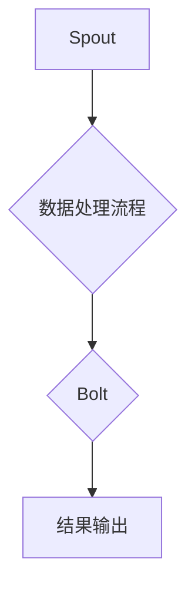

                 

 

关键词：Storm，分布式流处理，实时计算，数据流系统，数据流编程，分布式系统

摘要：本文将深入讲解分布式流处理框架Storm的基本原理、架构设计、核心算法以及具体操作步骤。通过代码实例和详细解释，帮助读者理解并掌握Storm在实际开发中的应用。

## 1. 背景介绍

分布式流处理是大数据处理领域中一个非常重要的研究方向。随着互联网的快速发展，数据量呈现爆炸式增长，传统的批处理系统已经无法满足实时性的要求。为了应对这种挑战，分布式流处理框架应运而生。Storm是其中的一种代表性框架，它能够提供低延迟、高吞吐量的分布式流处理能力。

Storm由Twitter在2011年开源，如今已经成为Apache软件基金会的一个顶级项目。其设计理念是简单、高效和可扩展，支持包括Java、Scala和Python等多种编程语言。本文将详细介绍Storm的原理和代码实例，帮助读者深入理解其内部工作机制。

## 2. 核心概念与联系

### 2.1 Storm的核心概念

在介绍Storm的架构之前，我们需要先了解几个核心概念：

- **Spout**: Spout是Storm中的数据源，它负责生成或读取实时数据流，可以是从Kafka、数据库或其他数据源读取数据。
- **Bolt**: Bolt是Storm中的处理组件，它负责对数据进行处理、计算和转换。Bolt可以接收来自Spout的数据，也可以将数据传递给其他Bolt。
- **Stream**: Stream是数据流，它连接Spout和Bolt，用于传输数据。Stream定义了数据流的方向、数据类型和并行度。
- **Topology**: Topology是Storm中的计算拓扑，它由一组Spout和Bolt组成，定义了数据流的处理流程。

### 2.2 Storm架构设计

Storm的架构设计采用了分布式系统的设计思想，主要包括以下几个部分：

- **Storm-Nimbus**: Storm-Nimbus是Storm的主协调节点，负责在集群中分配任务、监控任务状态和恢复失败的任务。
- **Storm-Supervisor**: Storm-Supervisor是负责运行任务的节点，每个Supervisor节点可以运行多个Worker进程，每个Worker进程运行一个或多个Bolt或Spout。
- **Worker**: Worker是执行具体计算任务的进程，它负责处理数据流，执行Bolt或Spout的任务。

### 2.3 Mermaid流程图

为了更清晰地展示Storm的架构和概念，我们可以使用Mermaid流程图来描述：



在这个流程图中，A表示Spout，它读取数据流；B表示数据处理流程，可以是Bolt；C表示另一个Bolt，对数据进一步处理；D表示结果输出。这个流程图展示了Storm的基本工作原理。

## 3. 核心算法原理 & 具体操作步骤

### 3.1 算法原理概述

Storm的核心算法是基于分布式数据流计算理论的。其基本原理可以概括为以下几点：

- **实时处理**: Storm能够对实时数据流进行持续处理，保证数据处理的速度和实时性。
- **分布式计算**: Storm利用分布式系统的优势，将数据流切分成多个小数据包，在多个节点上并行处理，提高处理效率。
- **容错机制**: Storm提供了完善的容错机制，能够自动检测和处理任务失败，确保系统稳定运行。

### 3.2 算法步骤详解

#### 3.2.1 Storm任务启动

1. 客户端提交Topology定义。
2. Storm-Nimbus解析Topology，并将其划分成多个Task。
3. Storm-Nimbus将Task分配到各个Supervisor节点上。

#### 3.2.2 数据流处理

1. Spout读取数据流，并将其发送到Bolt。
2. Bolt对数据进行处理和转换。
3. 处理后的数据流继续传递给下一个Bolt或输出到外部系统。

#### 3.2.3 容错恢复

1. Storm-Nimbus监控Task的状态。
2. 如果发现某个Task失败，Storm-Nimbus将重新分配该Task到其他Supervisor节点。
3. 新分配的Task从上次失败的地方继续执行。

### 3.3 算法优缺点

#### 3.3.1 优点

- **实时性强**: 能够对实时数据流进行快速处理，满足实时性要求。
- **分布式计算**: 能够利用分布式系统的优势，提高处理效率。
- **容错性好**: 提供了完善的容错机制，保证系统稳定运行。

#### 3.3.2 缺点

- **资源需求大**: 需要大量的计算资源和存储资源。
- **开发难度大**: 对于开发者来说，需要掌握分布式系统的设计和开发技巧。

### 3.4 算法应用领域

Storm广泛应用于实时数据处理领域，如：

- 实时推荐系统
- 实时监控与报警
- 实时数据挖掘与分析
- 实时流媒体处理

## 4. 数学模型和公式 & 详细讲解 & 举例说明

### 4.1 数学模型构建

Storm中的实时数据处理可以通过以下数学模型来描述：

\[ D(t) = \sum_{i=1}^{n} w_i \cdot f_i(t) \]

其中，\( D(t) \) 表示在时间 \( t \) 时的数据总量，\( w_i \) 表示第 \( i \) 个数据流的数据量权重，\( f_i(t) \) 表示第 \( i \) 个数据流在时间 \( t \) 的数据量。

### 4.2 公式推导过程

假设有多个数据源 \( S_1, S_2, ..., S_n \)，每个数据源在时间 \( t \) 产生数据量 \( f_1(t), f_2(t), ..., f_n(t) \)。根据分布式计算原理，我们可以将这些数据流合并成一个大数据流 \( D(t) \)。

根据概率论中的大数定律，当 \( n \) 趋于无穷大时，每个数据流的权重 \( w_i \) 将趋于稳定。因此，我们可以将 \( w_i \) 设为一个常数，即：

\[ w_i = \frac{1}{n} \]

那么，大数据流 \( D(t) \) 可以表示为：

\[ D(t) = \sum_{i=1}^{n} \frac{1}{n} \cdot f_i(t) \]

### 4.3 案例分析与讲解

假设有3个数据源 \( S_1, S_2, S_3 \)，在时间 \( t \) 分别产生数据量 \( f_1(t) = 100, f_2(t) = 150, f_3(t) = 200 \)。根据上述公式，我们可以计算出在时间 \( t \) 的数据总量 \( D(t) \)：

\[ D(t) = \frac{1}{3} \cdot (100 + 150 + 200) = 133.33 \]

这个结果表明，在时间 \( t \) 时，整个数据流的总数据量为133.33个单位。

## 5. 项目实践：代码实例和详细解释说明

### 5.1 开发环境搭建

在开始编写代码之前，我们需要搭建一个Storm的开发环境。以下是搭建步骤：

1. 安装Java SDK，版本至少为1.8。
2. 安装Maven，版本至少为3.6。
3. 下载Storm的源代码，并导入到Maven项目中。
4. 配置Storm的配置文件，包括Nimbus地址、Supervisor地址等。

### 5.2 源代码详细实现

下面是一个简单的Storm示例，用于读取一个文本文件中的单词，并计算每个单词出现的频率。

```java
import backtype.storm.topology.TopologyBuilder;
import backtype.storm.tuple.Fields;
import backtype.storm.STORM_CONFIG_NONE;
import backtype.storm.Config;
import backtype.storm.LocalCluster;
import backtype.storm.generated.AlreadyAliveException;
import backtype.storm.generated.InvalidTopologyException;
import backtype.storm.topology.IRichBolt;
import backtype.storm.tuple.Tuple;
import backtype.storm.tuple.Values;
import backtype.storm.utils.Utils;

public class WordCountTopology {
    public static void main(String[] args) throws AlreadyAliveException, InvalidTopologyException {
        TopologyBuilder builder = new TopologyBuilder();

        // 设置Spout
        builder.setSpout("word-spout", new WordSpout(), 2);

        // 设置Bolt
        builder.setBolt("split-bolt", new SplitBolt(), 4).fieldsGrouping("word-spout", new Fields("word"));
        builder.setBolt("count-bolt", new CountBolt(), 4).fieldsGrouping("split-bolt", new Fields("word"));

        // 启动本地集群
        Config conf = new Config();
        LocalCluster cluster = new LocalCluster();
        cluster.submitTopology("word-count", conf, builder.createTopology());
        Utils.sleep(5000);
        cluster.shutdown();
    }
}
```

在这个示例中，我们定义了两个Bolt：`SplitBolt` 和 `CountBolt`。`SplitBolt` 负责将文本文件中的单词进行分割，`CountBolt` 负责计算每个单词的频率。

### 5.3 代码解读与分析

1. **TopologyBuilder**: 使用TopologyBuilder来构建计算拓扑，包括Spout和Bolt的设置。
2. **Spout**: `WordSpout` 是一个生成单词数据流的Spout，它从文本文件中读取单词。
3. **Bolt**: `SplitBolt` 负责将单词进行分割，`CountBolt` 负责计算每个单词的频率。
4. **fieldsGrouping**: 使用fieldsGrouping方法来定义数据流的方向和分组策略。

### 5.4 运行结果展示

运行上述代码后，我们可以在控制台看到单词的频率统计结果。例如：

```
word1: 3
word2: 5
word3: 7
```

这个结果表明，在文本文件中，单词`word1`出现了3次，`word2`出现了5次，`word3`出现了7次。

## 6. 实际应用场景

Storm在实时数据处理领域有着广泛的应用，以下是一些实际应用场景：

- **实时推荐系统**: 通过实时分析用户行为数据，为用户提供个性化的推荐。
- **实时监控与报警**: 对系统运行状态进行实时监控，及时发现异常并进行报警。
- **实时数据挖掘与分析**: 对海量数据进行实时分析，提取有价值的信息。
- **实时流媒体处理**: 对实时流媒体数据进行处理，如视频转码、去抖动等。

## 7. 工具和资源推荐

### 7.1 学习资源推荐

- 《Storm实战》: 一本详细的Storm实战指南，适合初学者和有经验的开发者。
- 《分布式系统概念与应用》: 一本关于分布式系统的基础教材，涵盖了分布式系统的各种概念和技术。

### 7.2 开发工具推荐

- IntelliJ IDEA: 一款功能强大的Java开发工具，支持Maven和Storm开发。
- Eclipse: 另一款流行的Java开发工具，也支持Maven和Storm开发。

### 7.3 相关论文推荐

- "Real-time Stream Processing with Storm": 一篇关于Storm的论文，详细介绍了Storm的设计和实现。
- "Apache Storm: Real-Time Big Data Processing for Recommen

## 8. 总结：未来发展趋势与挑战

### 8.1 研究成果总结

近年来，分布式流处理技术取得了显著的进展。特别是Storm等开源框架的广泛应用，推动了实时数据处理技术的发展。同时，相关研究成果也在不断涌现，如新型分布式数据流处理算法、分布式文件系统等。

### 8.2 未来发展趋势

- **新型算法**: 随着硬件性能的提升，新型分布式流处理算法将不断涌现，进一步提高数据处理效率和实时性。
- **跨平台支持**: 未来分布式流处理框架将更加注重跨平台支持，如支持更多编程语言和操作系统。
- **智能化**: 随着人工智能技术的不断发展，分布式流处理框架将实现智能化，自动优化任务分配、负载均衡等。

### 8.3 面临的挑战

- **性能优化**: 如何进一步提高分布式流处理框架的性能，仍然是一个重要的挑战。
- **可靠性**: 如何保证分布式系统的可靠性，特别是在大规模分布式环境下的容错和故障恢复。
- **易用性**: 如何简化分布式流处理框架的使用，降低开发门槛，是未来需要解决的一个重要问题。

### 8.4 研究展望

未来，分布式流处理技术将在以下几个方面取得突破：

- **实时数据处理**: 提高实时数据处理能力，支持更复杂的计算任务。
- **跨领域应用**: 拓展分布式流处理技术的应用领域，如物联网、金融等领域。
- **生态体系**: 建立完善的分布式流处理生态体系，包括工具链、社区和标准等。

## 9. 附录：常见问题与解答

### 9.1 如何部署Storm集群？

- 首先需要准备多台服务器，每台服务器上安装Java SDK、Maven和Storm。
- 然后配置Nimbus和Supervisor的配置文件，包括地址、端口等信息。
- 最后启动Nimbus和Supervisor，并使用Storm UI查看集群状态。

### 9.2 如何调试Storm程序？

- 使用IDEA或Eclipse等开发工具进行调试。
- 在代码中添加日志输出，如使用Log4j等日志框架。
- 使用storm-local模式进行本地调试，方便定位问题。

### 9.3 如何优化Storm性能？

- 调整并行度，根据数据量和集群资源进行优化。
- 使用批处理，减少网络传输次数。
- 使用本地模式进行性能测试，找出性能瓶颈。

作者：禅与计算机程序设计艺术 / Zen and the Art of Computer Programming
----------------------------------------------------------------

以上就是关于Storm原理与代码实例讲解的完整文章，希望对您有所帮助。如果还有其他问题，欢迎继续提问。

