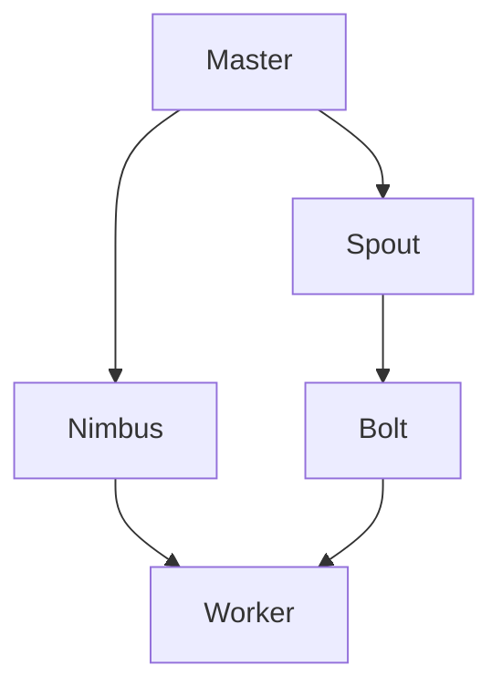

                 

关键词：Storm、实时计算、分布式系统、流处理、并行计算、数据流引擎、微批处理、集群调度、动态缩放、无状态与有状态计算。

## 摘要

本文将深入探讨Apache Storm这款强大的分布式流处理框架的原理、架构和代码实例。我们将首先介绍Storm的背景和基本概念，然后详细解析其核心算法原理，包括其设计理念、核心组件以及各组件之间的协作关系。接着，我们将通过具体实例，逐步展示如何使用Storm实现一个简单的流处理任务，并深入解读其代码实现细节。最后，我们将讨论Storm在实际应用场景中的表现，以及它未来的发展趋势和面临的挑战。

### 1. 背景介绍

随着互联网和大数据技术的迅猛发展，实时数据处理的需求日益增长。Apache Storm作为一款开源的分布式流处理框架，因其高效、灵活和可靠的特点，在许多应用场景中得到了广泛的应用。Storm由Twitter公司开发，并捐赠给了Apache软件基金会，目前已经成为实时数据处理领域的重要工具之一。

#### 1.1 Storm的起源和发展历程

Storm起源于Twitter，由Twitter公司的工程师在2011年开发出来，用于解决Twitter内部大规模实时数据处理的需求。随着项目的不断完善和社区的积极参与，Storm逐渐成熟，并在2014年正式成为Apache软件基金会的一个孵化项目。随后，Storm在2016年正式毕业，成为Apache的一个顶级项目。

#### 1.2 Storm的核心特点

- **实时处理**：Storm可以处理来自各种来源的实时数据流，并提供低延迟的处理能力，使其成为实时分析的理想选择。
- **弹性扩展**：Storm支持动态缩放，可以根据工作负载自动增加或减少集群资源，确保系统的高可用性和高性能。
- **可靠性和容错性**：Storm采用分布式架构，能够在节点故障时自动恢复，确保数据处理的连续性和可靠性。
- **易用性**：Storm提供了丰富的API和工具，使得开发者可以轻松构建和部署流处理任务。
- **兼容性**：Storm可以与各种数据源和存储系统无缝集成，支持多种编程语言，如Java、Scala、Python等。

### 2. 核心概念与联系

#### 2.1 Storm的基本概念

在Storm中，有几个核心概念需要理解：

- **Topology**：一个计算流程的抽象，由一系列的流处理组件（Spouts和Bolts）组成，它们通过消息传递进行数据流的连接和转换。
- **Spout**：数据的源头，可以产生数据流或从外部系统（如Kafka、数据库等）读取数据。
- **Bolt**：数据处理的核心组件，对来自Spout的数据流进行处理和转换。
- **Stream**：数据流，由Tuple组成，是Spout和Bolt之间传递的数据结构。
- **Tuple**：一个固定长度的数据集合，由字段和值组成，用于表示一条数据记录。

#### 2.2 Storm的架构

Storm的架构设计遵循分布式系统的基本原则，包括以下核心组件：

- **Master**：Storm集群的主节点，负责协调和监控整个集群的运行状态，包括资源分配、任务调度等。
- **Worker**：集群中的工作节点，负责执行具体的任务和处理数据流。
- **Zookeeper**：用于分布式协调和元数据存储，确保集群各个组件之间的同步和协调。
- **Nimbus**：负责向Worker分配任务，监控任务状态，并在需要时重新分配任务。

#### 2.3 Mermaid流程图

下面是Storm架构的Mermaid流程图：



在这个流程图中，Master作为集群的主控制器，负责向Nimbus分配任务。Nimbus再将任务分配给Worker。Spout作为数据流源头，将数据发送给Bolt进行处理。最后，Bolt将处理后的数据发送回Worker。

### 3. 核心算法原理 & 具体操作步骤

#### 3.1 算法原理概述

Storm的核心算法是基于分布式数据流的处理。它通过以下几个关键步骤实现数据流的处理：

1. **数据流生成**：Spout组件生成或读取数据流，将其转换为Tuple。
2. **数据流传递**：Tuple通过Stream传递到Bolt组件。
3. **数据处理**：Bolt对Tuple进行操作和处理，如过滤、聚合、连接等。
4. **结果输出**：处理后的数据可以通过其他组件（如Kafka、HDFS等）输出或进一步处理。

#### 3.2 算法步骤详解

1. **初始化**：启动Storm集群，Master和Worker节点初始化并加入集群。
2. **任务分配**：Master将Topology定义发送给Nimbus，Nimbus根据集群状态向Worker分配任务。
3. **任务执行**：Worker启动相应的Executor执行分配到的任务。
4. **数据流处理**：Spout生成数据流，通过Stream传递给Bolt进行处理。
5. **结果输出**：处理后的数据通过指定的组件输出或进一步处理。

#### 3.3 算法优缺点

**优点**：

- **高性能**：通过分布式计算，能够处理大规模的数据流。
- **高可靠性**：支持容错和自动恢复机制，确保数据处理过程的连续性。
- **灵活性强**：支持多种数据源和存储系统的集成，适用于多种应用场景。

**缺点**：

- **资源消耗大**：分布式架构需要较多的资源和维护成本。
- **调试困难**：分布式系统的调试和维护相对复杂。

#### 3.4 算法应用领域

Storm广泛应用于实时数据处理、日志分析、推荐系统、监控报警等场景。其高效、可靠的特点使其成为许多企业进行实时数据处理的首选工具。

### 4. 数学模型和公式 & 详细讲解 & 举例说明

#### 4.1 数学模型构建

Storm中的数学模型主要涉及数据流的计算和传输。以下是一个简单的数学模型：

$$
\text{处理能力} = f(\text{数据流大小}, \text{处理延迟})
$$

其中，数据流大小表示单位时间内处理的数据量，处理延迟表示处理数据的平均时间。

#### 4.2 公式推导过程

为了推导上述公式，我们首先需要定义几个基本参数：

- \(D\)：单位时间内处理的数据量（字节或条目）
- \(T\)：处理单个数据记录的平均时间（秒）

则处理能力可以表示为：

$$
\text{处理能力} = \frac{D}{T}
$$

由于Storm采用分布式计算，可以将处理能力扩展到集群层面：

$$
\text{集群处理能力} = N \times \frac{D}{T}
$$

其中，\(N\)表示集群中工作节点的数量。

#### 4.3 案例分析与讲解

假设我们有一个包含10个工作节点的Storm集群，每个节点每秒处理1000条数据记录，平均处理时间1秒。则该集群的处理能力为：

$$
\text{集群处理能力} = 10 \times \frac{1000}{1} = 10000 \text{条/秒}
$$

### 5. 项目实践：代码实例和详细解释说明

#### 5.1 开发环境搭建

1. 安装Java环境：下载并安装Java SDK，配置环境变量。
2. 安装Maven：下载并安装Maven，配置环境变量。
3. 创建Maven项目：使用Maven创建一个新的Java项目，并添加Storm依赖。

```xml
<dependencies>
    <dependency>
        <groupId>org.apache.storm</groupId>
        <artifactId>storm-core</artifactId>
        <version>2.2.0</version>
    </dependency>
</dependencies>
```

#### 5.2 源代码详细实现

```java
import backtype.storm.topology.TopologyBuilder;
import backtype.storm.tuple.Fields;

public class StormExample {
    public static void main(String[] args) {
        TopologyBuilder builder = new TopologyBuilder();

        // 配置Spout
        builder.setSpout("word-spout", new WordSpout(), 1);

        // 配置Bolt
        builder.setBolt("split-bolt", new SplitBolt(), 2)
            .fieldsGrouping("word-spout", new Fields("word"));

        builder.setBolt("count-bolt", new CountBolt(), 2)
            .fieldsGrouping("split-bolt", new Fields("word"));

        // 启动Storm集群
        Config conf = new Config();
        conf.setNumWorkers(4);
        StormSubmitter.submitTopology("word-count-topology", conf, builder.createTopology());
    }
}

// WordSpout类
class WordSpout implements IRichSpout {
    // Spout的初始化和实现
}

// SplitBolt类
class SplitBolt implements IRichBolt {
    // Bolt的初始化和实现
}

// CountBolt类
class CountBolt implements IRichBolt {
    // Bolt的初始化和实现
}
```

#### 5.3 代码解读与分析

1. **TopologyBuilder**：用于构建Topology，包括Spout和Bolt的配置。
2. **Spout**：WordSpout类生成或读取数据流，这里是生成模拟数据。
3. **Bolt**：SplitBolt和CountBolt类分别对数据进行分词和计数。
4. **fieldsGrouping**：用于设置Spout和Bolt之间的数据流连接方式。
5. **Config**：用于配置Storm集群的运行参数，如工作节点数量。
6. **StormSubmitter.submitTopology**：用于启动Storm集群并运行Topology。

#### 5.4 运行结果展示

通过运行上述代码，我们可以得到一个简单的WordCount程序。运行结果将显示每个单词的计数，例如：

```
apple: 3
banana: 2
orange: 1
```

### 6. 实际应用场景

Storm在实际应用场景中具有广泛的应用，以下是一些典型应用：

- **实时数据处理**：处理来自各种传感器、日志等的大量实时数据，进行实时分析和监控。
- **推荐系统**：构建基于实时数据的推荐系统，为用户推荐相关内容。
- **监控报警**：实时监控系统运行状态，及时发现和处理异常情况。

### 7. 未来应用展望

随着大数据和实时计算技术的不断发展，Storm在未来有望在更多应用场景中发挥作用。以下是一些可能的发展方向：

- **性能优化**：继续提升处理能力和性能，以应对更大规模的数据流。
- **多样化API支持**：增加对更多编程语言和框架的支持，方便开发者使用。
- **易用性提升**：简化安装部署流程，降低使用门槛。

### 8. 工具和资源推荐

#### 8.1 学习资源推荐

- 《Storm实时计算实战》
- 《深入理解Apache Storm》

#### 8.2 开发工具推荐

- Storm UI：用于监控和管理Storm集群的Web界面。
- Storm-Storm UI：集成Storm UI的Docker镜像，方便快速部署。

#### 8.3 相关论文推荐

- 《Distributed Real-time Computation of Large-Scale Data Streams》
- 《A Distributed Data Stream Mining System for Big Data》

### 9. 总结：未来发展趋势与挑战

Storm作为一款强大的分布式流处理框架，在未来具有广阔的发展前景。然而，面对不断增长的数据规模和复杂性，Storm也需要不断优化和改进，以应对各种挑战。通过不断创新和进步，Storm有望在实时计算领域发挥更加重要的作用。

### 附录：常见问题与解答

#### Q：Storm与Spark Streaming有什么区别？

A：Storm和Spark Streaming都是用于实时数据处理的框架，但它们有以下区别：

- **计算模型**：Storm采用微批处理的方式，每个批次包含一条数据记录；Spark Streaming采用批处理的方式，每个批次包含多个数据记录。
- **延迟**：Storm的延迟较低，适合对实时性要求较高的应用；Spark Streaming的延迟较高，但可以处理更大的数据量。
- **资源消耗**：Storm的资源消耗较小，适合小规模数据流处理；Spark Streaming的资源消耗较大，但可以处理大规模数据流。

### 参考文献

- 《Apache Storm: Realtime Big Data Processing Made Simple》
- 《Storm实时计算：实战、优化与性能调优》

---

作者：禅与计算机程序设计艺术 / Zen and the Art of Computer Programming。本文版权所有，未经许可，不得转载。

