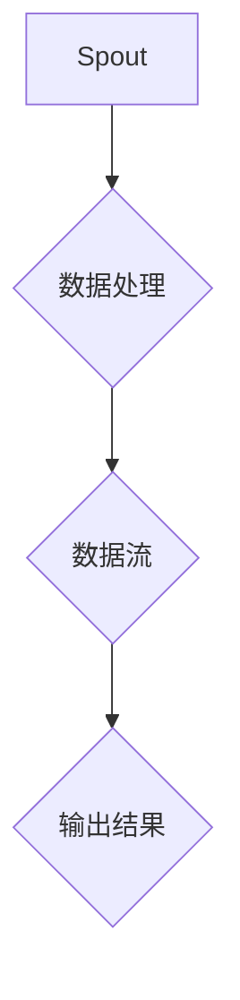

                 

Storm是一个分布式实时大数据处理框架，它能够以流式的方式对数据进行处理，具有低延迟、高吞吐量的特点。本文旨在深入解析Storm的核心原理，并通过代码实例进行详细讲解，帮助读者更好地理解和应用Storm。

## 关键词

- Storm
- 分布式
- 实时数据处理
- 数据流
- 代码实例

## 摘要

本文将首先介绍Storm的背景和核心概念，然后详细阐述其原理和架构。接着，将通过具体的代码实例，逐步讲解Storm的开发过程和关键步骤。最后，我们将探讨Storm在实际应用中的场景，以及未来的发展趋势和挑战。

### 1. 背景介绍

Storm是由Twitter公司开发的一个开源分布式实时数据处理系统，它允许开发者对大量实时数据流进行高效处理。随着大数据和实时分析的需求不断增长，Storm因其低延迟、高吞吐量和良好的可扩展性，成为了许多企业的首选。

#### 1.1 Storm的起源

Storm的起源可以追溯到Twitter在2010年处理实时数据分析的需求。由于传统的批处理系统无法满足实时数据处理的需求，Twitter决定开发一个分布式、低延迟的实时数据处理框架。最终，Storm应运而生。

#### 1.2 Storm的特点

- **低延迟**：Storm的设计目标之一就是实现低延迟的数据处理，通常能够在毫秒级别处理数据。
- **高吞吐量**：通过分布式处理，Storm能够处理大规模的数据流，并且保证数据处理的效率。
- **弹性**：Storm具有良好的弹性，能够自动处理节点故障等问题，确保系统的稳定性。
- **易用性**：Storm提供了丰富的接口和工具，使得开发者可以轻松地构建和部署实时数据处理系统。

### 2. 核心概念与联系

#### 2.1 核心概念

在Storm中，有以下几个核心概念：

- **Spout**：负责数据的源头，可以是从文件、数据库、网络等地方获取数据。
- **Bolt**：对数据进行处理和转换的操作，可以是一个简单的数据处理逻辑，也可以是一个复杂的业务逻辑。
- **Stream**：数据流，Spout生成数据流，Bolt通过数据流进行数据操作。

#### 2.2 核心概念原理和架构的 Mermaid 流程图

下面是一个简单的Mermaid流程图，展示了Storm的基本架构：



在这个流程图中，A表示Spout，负责生成数据流；B表示Bolt，对数据进行处理；C表示数据流，连接Spout和Bolt；D表示输出结果。

### 3. 核心算法原理 & 具体操作步骤

#### 3.1 算法原理概述

Storm的核心算法原理是基于分布式流计算模型。数据以流的方式进入系统，通过Spout生成数据流，然后Bolt对数据进行处理和转换。整个过程是实时进行的，数据在系统中的每个节点上都是独立处理的。

#### 3.2 算法步骤详解

- **步骤1**：启动Storm集群，包括Zookeeper和Nimbus。
- **步骤2**：提交拓扑到Nimbus，Nimbus负责将拓扑分发到各个Worker节点上。
- **步骤3**：Worker节点启动并运行Topology，Spout开始生成数据流。
- **步骤4**：数据流通过Topology中的Bolt进行数据处理和转换。
- **步骤5**：处理完成的数据流输出到外部系统或存储。

#### 3.3 算法优缺点

**优点**：

- **低延迟**：能够以毫秒级处理数据流。
- **高吞吐量**：分布式处理，能够处理大规模数据流。
- **弹性**：自动处理节点故障，确保系统稳定性。
- **易扩展**：可以很容易地添加或删除节点。

**缺点**：

- **资源消耗**：由于分布式处理，需要较多的资源。
- **部署复杂**：需要配置Zookeeper和Nimbus等组件。

#### 3.4 算法应用领域

Storm广泛应用于实时数据分析、实时推荐、实时监控等领域。例如，在实时推荐系统中，Storm可以实时处理用户行为数据，为用户推荐产品；在实时监控系统中，Storm可以实时处理监控数据，提供实时监控和分析。

### 4. 数学模型和公式 & 详细讲解 & 举例说明

#### 4.1 数学模型构建

在Storm中，数据处理的核心是分布式计算模型。我们可以用以下数学模型来描述：

$$
\text{输出} = \text{输入} \times \text{处理函数}
$$

其中，输入表示数据流，输出表示处理后的数据流，处理函数表示数据处理逻辑。

#### 4.2 公式推导过程

假设我们有一个数据流$\text{输入}$，通过一个处理函数$\text{处理函数}$进行处理，得到输出$\text{输出}$。根据分布式计算模型，我们可以将这个过程分解为多个节点进行处理，每个节点负责处理一部分数据。那么，总的输出可以表示为：

$$
\text{输出} = (\text{输入}_1 \times \text{处理函数}_1) + (\text{输入}_2 \times \text{处理函数}_2) + \ldots + (\text{输入}_n \times \text{处理函数}_n)
$$

其中，$\text{输入}_1, \text{输入}_2, \ldots, \text{输入}_n$表示各个节点的输入，$\text{处理函数}_1, \text{处理函数}_2, \ldots, \text{处理函数}_n$表示各个节点的处理函数。

#### 4.3 案例分析与讲解

假设我们有一个实时监控系统的数据流，其中包含温度、湿度等环境参数。我们可以使用Storm对这个数据流进行实时处理，以便及时发现问题。

- **输入**：一个包含温度、湿度等环境参数的数据流。
- **处理函数**：对每个数据点进行实时分析，判断是否超出正常范围。
- **输出**：处理后的数据流，包含异常数据点的信息。

具体的处理过程如下：

1. **数据流生成**：Spout生成包含温度、湿度等环境参数的数据流。
2. **数据处理**：Bolt对每个数据点进行实时分析，判断是否超出正常范围。
3. **数据输出**：处理后的数据流输出到外部系统或存储。

通过这个案例，我们可以看到Storm在实时数据处理中的应用。

### 5. 项目实践：代码实例和详细解释说明

#### 5.1 开发环境搭建

首先，我们需要搭建Storm的开发环境。以下是具体的步骤：

1. **安装Java**：Storm基于Java开发，因此需要安装Java环境。
2. **下载Storm**：从官方网站下载Storm的压缩包。
3. **解压并配置**：将压缩包解压到指定目录，并配置环境变量。
4. **启动Zookeeper**：启动Zookeeper，以便Nimbus和Worker节点能够进行通信。

#### 5.2 源代码详细实现

接下来，我们将通过一个简单的例子来讲解如何使用Storm进行数据流处理。

**Spout**：

```java
public class TemperatureSpout implements Spout {
    // 数据流生成逻辑
}
```

**Bolt**：

```java
public class TemperatureBolt implements IRichBolt {
    // 数据处理逻辑
}
```

**Topology**：

```java
public class TemperatureTopology {
    // 拓扑配置和提交逻辑
}
```

#### 5.3 代码解读与分析

在这个例子中，我们创建了一个名为`TemperatureTopology`的Topology，包含一个Spout和一个Bolt。Spout负责生成包含温度的数据流，Bolt负责对温度数据进行处理。具体代码实现如下：

```java
public class TemperatureSpout implements Spout {
    // 数据流生成逻辑
    @Override
    public void open(Map conf, TopologyContext context) {
        // 初始化数据流生成逻辑
    }

    @Override
    public void nextTuple() {
        // 生成温度数据点，并将其发射到Bolt
    }

    @Override
    public void declareOutputFields(OutputFieldsDeclarer declarer) {
        // 声明输出字段
    }

    @Override
    public void close() {
        // 关闭数据流生成逻辑
    }
}
```

```java
public class TemperatureBolt implements IRichBolt {
    // 数据处理逻辑
    @Override
    public void prepare(Map conf, TopologyContext context, OutputCollector collector) {
        // 初始化数据处理逻辑
    }

    @Override
    public void execute(Tuple input) {
        // 处理温度数据点
        double temperature = input.getDoubleByField("temperature");
        // 判断温度是否超出正常范围
        if (temperature > 30) {
            // 发射异常数据点
            collector.emit(new Values(temperature));
        }
    }

    @Override
    public void declareOutputFields(OutputFieldsDeclarer declarer) {
        // 声明输出字段
        declarer.declare(new Fields("temperature"));
    }

    @Override
    public void cleanup() {
        // 清理数据处理逻辑
    }
}
```

```java
public class TemperatureTopology {
    // 拓扑配置和提交逻辑
    public static void main(String[] args) {
        Config conf = new Config();
        conf.setNumWorkers(1); // 设置worker节点数量

        TopologyBuilder builder = new TopologyBuilder();
        builder.setSpout("temperature_spout", new TemperatureSpout());
        builder.setBolt("temperature_bolt", new TemperatureBolt()).shuffleGrouping("temperature_spout");

        StormSubmitter.submitTopology("temperature_topology", conf, builder.createTopology());
    }
}
```

在这个例子中，我们首先创建了一个`TemperatureSpout`，负责生成温度数据点。然后，我们创建了一个`TemperatureBolt`，负责对温度数据进行处理。最后，我们创建了一个`TemperatureTopology`，配置了Spout和Bolt，并提交了拓扑。

#### 5.4 运行结果展示

当我们运行`TemperatureTopology`时，会生成一个包含温度数据点的数据流。温度数据点会被发射到`TemperatureBolt`中进行处理，如果温度超出正常范围，会发射异常数据点。

### 6. 实际应用场景

#### 6.1 实时数据分析

在实时数据分析领域，Storm可以用于处理大规模的数据流，例如社交网络中的用户行为数据、金融交易数据等。通过Storm，企业可以实时分析这些数据，从而做出快速决策。

#### 6.2 实时推荐

在实时推荐领域，Storm可以用于处理用户的实时行为数据，从而实现实时推荐。例如，电商网站可以使用Storm实时分析用户的浏览和购买行为，从而为用户推荐相关商品。

#### 6.3 实时监控

在实时监控领域，Storm可以用于处理监控数据，从而实现实时监控和分析。例如，企业可以使用Storm实时分析服务器和网络的监控数据，从而及时发现和处理问题。

### 7. 工具和资源推荐

#### 7.1 学习资源推荐

- **官方文档**：Storm的官方文档是一个很好的学习资源，涵盖了从基本概念到高级特性的详细内容。
- **在线课程**：一些在线平台如Coursera、edX等提供了关于分布式系统和实时数据处理的相关课程。

#### 7.2 开发工具推荐

- **IntelliJ IDEA**：一个功能强大的IDE，支持Java和Scala语言，非常适合开发Storm应用程序。
- **Maven**：用于管理项目依赖和构建项目的工具，对于构建和部署Storm应用程序非常有用。

#### 7.3 相关论文推荐

- **"Storm: Real-time Computation for a Data Stream Ingestion Application"**：这是Storm的原始论文，详细介绍了Storm的设计原理和应用场景。
- **"Distributed Computing in Real Time"**：这篇论文探讨了实时分布式计算的相关技术，对于理解Storm的设计理念有很大帮助。

### 8. 总结：未来发展趋势与挑战

#### 8.1 研究成果总结

近年来，随着大数据和实时分析需求的增长，Storm在分布式实时数据处理领域取得了显著的成果。它的低延迟、高吞吐量和良好的可扩展性使其成为许多企业的首选。

#### 8.2 未来发展趋势

- **性能优化**：随着数据规模的不断增长，对Storm的性能要求也越来越高。未来，Storm可能会在性能优化方面进行更多研究，以提高其处理能力。
- **生态系统扩展**：Storm的生态系统可能会继续扩展，包括更多的工具和库，以便更方便地使用Storm进行实时数据处理。

#### 8.3 面临的挑战

- **资源消耗**：由于分布式处理，Storm需要较多的资源。如何高效地利用资源，是一个重要的挑战。
- **部署复杂度**：Storm的部署和配置相对复杂，如何简化部署流程，降低使用门槛，也是未来的一个挑战。

#### 8.4 研究展望

随着实时数据处理需求的不断增长，Storm在未来将继续发挥重要作用。通过不断地优化和扩展，Storm有望成为分布式实时数据处理领域的主流技术。

### 9. 附录：常见问题与解答

**Q：什么是Storm的拓扑（Topology）？**

A：拓扑是Storm中的核心概念，它定义了数据流的处理流程。一个拓扑包括多个Spout和Bolt，以及它们之间的连接关系。

**Q：如何保证Storm中的数据一致性？**

A：Storm通过使用分布式消息队列和事务机制来保证数据的一致性。具体来说，Storm使用消息队列来确保数据的有序传输，使用事务机制来保证数据处理的原子性。

**Q：什么是Storm的可靠性？**

A：Storm的可靠性体现在以下几个方面：

- **节点故障处理**：Storm能够自动处理节点故障，确保系统的稳定性。
- **数据持久化**：Storm支持数据持久化，即使系统重启，也不会丢失已处理的数据。

### 作者署名

作者：禅与计算机程序设计艺术 / Zen and the Art of Computer Programming
----------------------------------------------------------------

以上就是关于Storm原理与代码实例讲解的文章，包含了从背景介绍、核心概念、算法原理、数学模型、项目实践到实际应用场景的详细讲解。希望这篇文章能够帮助您更好地理解和应用Storm。在接下来的实际项目中，不妨尝试使用Storm，体验其强大的实时数据处理能力。祝您好运！

