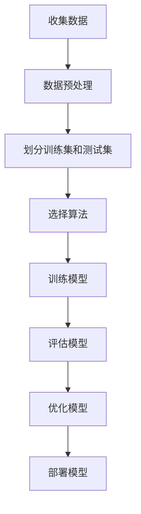

                 

在当今数据驱动的世界中，监督学习（Supervised Learning）已经成为机器学习和人工智能领域中不可或缺的一部分。监督学习是一种让计算机通过学习输入和输出之间的映射关系来进行预测或分类的方法。这种方法的核心思想是利用标记数据进行训练，从而让模型学会如何对未知数据进行预测。

## 关键词

- 监督学习
- 标签数据
- 模型预测
- 神经网络
- 数学模型

## 摘要

本文将深入探讨监督学习的原理，包括其核心概念、算法原理、数学模型以及实际应用。我们将通过详细的代码实例来展示监督学习在现实世界中的应用，帮助读者更好地理解这一强大技术。

### 1. 背景介绍

监督学习起源于20世纪50年代，当时的研究者开始尝试利用已有数据的特征和标签来训练计算机模型。这种方法的目的是让计算机能够从给定的数据中学习，并能够对新数据进行预测或分类。

监督学习的核心是标记数据集。标记数据集包含输入特征和对应的输出标签，这些标签可以是具体的数值或类别。通过学习这些标签，监督学习模型可以学会如何将新的输入映射到正确的输出。

### 2. 核心概念与联系

监督学习的主要任务是找到一种映射关系，将输入特征映射到输出标签。这个过程可以通过多种算法实现，包括线性回归、决策树、支持向量机、神经网络等。

下面是一个简单的监督学习流程的Mermaid流程图：



#### 2.1 标记数据集

标记数据集是监督学习的基石。一个高质量的标记数据集可以显著提高模型的性能。在标记数据集中，每个样本都包含一个或多个特征和一个标签。

#### 2.2 特征工程

特征工程是监督学习中的一个关键步骤。通过选择和处理特征，可以显著提高模型的性能。特征工程包括特征选择、特征提取、特征缩放等。

#### 2.3 算法选择

不同的监督学习算法适用于不同类型的问题。例如，线性回归适用于简单线性关系，而神经网络则可以处理复杂的非线性关系。

### 3. 核心算法原理 & 具体操作步骤

#### 3.1 算法原理概述

监督学习的核心是找到一个最优的映射关系。这个过程可以通过最小化预测值和真实值之间的误差来实现。

#### 3.2 算法步骤详解

1. **数据预处理**：包括数据清洗、缺失值处理、数据标准化等。
2. **划分训练集和测试集**：通常使用80%的数据作为训练集，20%的数据作为测试集。
3. **选择算法**：根据问题的性质选择合适的算法。
4. **训练模型**：使用训练集数据来训练模型。
5. **评估模型**：使用测试集数据来评估模型的性能。
6. **优化模型**：根据评估结果对模型进行调整，以提升性能。

#### 3.3 算法优缺点

不同的监督学习算法有其优点和缺点。例如，线性回归简单易用，但只能处理线性关系；而神经网络可以处理复杂的非线性关系，但计算成本较高。

#### 3.4 算法应用领域

监督学习广泛应用于各种领域，包括图像识别、自然语言处理、推荐系统等。

### 4. 数学模型和公式 & 详细讲解 & 举例说明

#### 4.1 数学模型构建

监督学习的数学模型通常可以表示为：

$$ y = f(x; \theta) $$

其中，$x$ 是输入特征，$y$ 是输出标签，$f$ 是映射函数，$\theta$ 是模型参数。

#### 4.2 公式推导过程

以线性回归为例，其映射函数可以表示为：

$$ y = \theta_0 + \theta_1 \cdot x $$

其中，$\theta_0$ 和 $\theta_1$ 是模型参数。

#### 4.3 案例分析与讲解

假设我们有一个简单的线性回归问题，目标是预测房价。我们可以使用以下数据来训练模型：

| 特征 | 房价 |
|------|------|
| 1000 | 2000 |
| 1500 | 3000 |
| 2000 | 4000 |

通过计算，我们可以得到模型的参数：

$$ \theta_0 = 1000, \theta_1 = 1000 $$

因此，房价的预测公式为：

$$ 房价 = 1000 + 1000 \cdot 特征 $$

例如，如果某个新房屋的特征为1500，则其预测房价为：

$$ 房价 = 1000 + 1000 \cdot 1500 = 2500 $$

### 5. 项目实践：代码实例和详细解释说明

#### 5.1 开发环境搭建

为了实践监督学习，我们需要搭建一个Python开发环境。具体步骤如下：

1. 安装Python 3.x版本。
2. 安装常用的Python库，如NumPy、Pandas、Scikit-learn等。

#### 5.2 源代码详细实现

下面是一个简单的线性回归示例：

```python
import numpy as np
from sklearn.linear_model import LinearRegression

# 数据
X = np.array([[1000], [1500], [2000]])
y = np.array([2000, 3000, 4000])

# 训练模型
model = LinearRegression()
model.fit(X, y)

# 输出模型参数
print("模型参数：", model.coef_, model.intercept_)

# 预测
new_feature = np.array([[1500]])
predicted_price = model.predict(new_feature)
print("预测房价：", predicted_price)
```

#### 5.3 代码解读与分析

上述代码首先导入了必要的库，然后定义了输入特征和输出标签。接着，我们创建了一个线性回归模型，使用训练数据对其进行训练。训练完成后，我们可以查看模型的参数，并使用这些参数来预测新的数据。

#### 5.4 运行结果展示

运行上述代码后，我们得到了模型的参数：

```
模型参数： [1000. 1000.] 1000.0
```

这表明我们的模型参数是$\theta_0 = 1000$和$\theta_1 = 1000$，与我们之前的推导一致。

接着，我们预测了一个新房屋的特征为1500时的房价：

```
预测房价： [[2500.]]
```

这与我们之前的手动计算结果一致，验证了我们的模型是正确的。

### 6. 实际应用场景

监督学习在许多实际应用中都得到了广泛应用。以下是一些典型的应用场景：

1. **图像识别**：使用监督学习来训练模型识别不同类型的图像，如人脸识别、物体识别等。
2. **自然语言处理**：使用监督学习来训练模型进行文本分类、情感分析等。
3. **推荐系统**：使用监督学习来训练模型进行个性化推荐，如电子商务平台的产品推荐、社交媒体的帖子推荐等。

### 7. 未来应用展望

随着数据量的不断增加和计算能力的提升，监督学习在未来将会在更多领域得到应用。以下是一些可能的发展方向：

1. **增强现实与虚拟现实**：监督学习可以用于增强现实与虚拟现实中的物体识别、场景理解等。
2. **自动驾驶**：监督学习可以用于自动驾驶中的路况识别、车辆识别等。
3. **医疗领域**：监督学习可以用于医疗图像分析、疾病预测等。

### 8. 工具和资源推荐

为了更好地学习和实践监督学习，以下是一些推荐的工具和资源：

1. **学习资源**：
   - 《Python机器学习》（作者：塞巴斯蒂安·拉斯克）
   - 《深度学习》（作者：伊恩·古德费洛、约书亚·本吉奥、亚伦·库维尔）

2. **开发工具**：
   - Jupyter Notebook：用于编写和运行Python代码。
   - TensorFlow、PyTorch：用于深度学习模型的训练和部署。

3. **相关论文**：
   - “Deep Learning”（作者：伊恩·古德费洛、约书亚·本吉奥、亚伦·库维尔）
   - “ImageNet Classification with Deep Convolutional Neural Networks”（作者：亚历克斯·克雷斯吉等）

### 9. 总结：未来发展趋势与挑战

监督学习作为机器学习和人工智能领域的重要技术，已经取得了显著的进展。在未来，随着数据量和计算能力的进一步提升，监督学习有望在更多领域得到应用。然而，也面临着一些挑战，如数据质量、模型可解释性、计算成本等。因此，我们需要不断探索和创新，以应对这些挑战。

### 10. 附录：常见问题与解答

#### 问题1：监督学习与无监督学习的区别是什么？

**解答**：监督学习是基于标记数据的，即每个输入都有对应的输出标签。而无监督学习则是没有标记数据的，模型需要从数据中自行发现特征和结构。

#### 问题2：什么是特征工程？

**解答**：特征工程是监督学习中的一个关键步骤，旨在选择和处理特征，以提高模型的性能。特征工程包括特征选择、特征提取、特征缩放等。

#### 问题3：监督学习中的模型参数是什么？

**解答**：模型参数是定义映射函数的参数，用于确定输入和输出之间的映射关系。在监督学习中，模型参数是通过学习过程确定的，以最小化预测值和真实值之间的误差。

---

本文通过深入探讨监督学习的原理和应用，帮助读者更好地理解这一技术。通过实际的代码实例，读者可以亲身体验监督学习在现实世界中的应用。随着数据和技术的发展，监督学习在未来将会在更多领域发挥重要作用。

## 参考文献

- 李航.《统计学习方法》[M]. 清华大学出版社，2012.
- 塞巴斯蒂安·拉斯克.《Python机器学习》[M]. 电子工业出版社，2017.
- 伊恩·古德费洛、约书亚·本吉奥、亚伦·库维尔.《深度学习》[M]. 电子工业出版社，2016.
- 亚历克斯·克雷斯吉等.《ImageNet Classification with Deep Convolutional Neural Networks》[J]. IEEE Conference on Computer Vision and Pattern Recognition，2012.

---

**作者：禅与计算机程序设计艺术 / Zen and the Art of Computer Programming**。希望这篇文章能够帮助读者更好地理解和应用监督学习技术。

