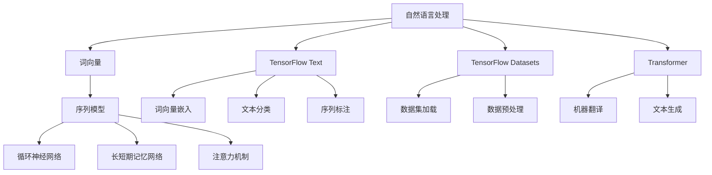

                 

关键词：TensorFlow, 自然语言处理，文本理解，文本生成，深度学习，神经网络，序列模型，循环神经网络，卷积神经网络，递归神经网络，Transformer，预训练语言模型，生成对抗网络，自然语言生成，文本分类，情感分析，问答系统，机器翻译。

## 摘要

本文旨在探讨TensorFlow在自然语言处理（NLP）领域的应用，重点关注文本理解和文本生成技术。通过对核心概念、算法原理、数学模型、项目实践和实际应用场景的深入分析，本文将为读者提供一个全面了解NLP在TensorFlow框架下如何工作的指南。文章将涵盖从基础概念到高级应用的各个方面，包括但不限于文本分类、情感分析、问答系统和机器翻译等。通过本文的阅读，读者将能够掌握TensorFlow在NLP中的核心技能，并对其未来发展趋势和面临的挑战有更清晰的认识。

## 1. 背景介绍

自然语言处理（NLP）是计算机科学和人工智能领域的一个重要分支，旨在使计算机能够理解、解释和生成人类语言。随着深度学习和神经网络技术的迅猛发展，NLP取得了显著的进展，并在各个领域得到了广泛应用。从搜索引擎到语音助手，从机器翻译到情感分析，NLP技术正逐步改变我们的生活方式和工作模式。

TensorFlow是由Google开发的开源机器学习框架，自发布以来，受到了全球开发者和研究者的广泛欢迎。TensorFlow具有高度的可扩展性、灵活性和强大的功能，使其成为处理复杂机器学习任务的首选工具之一。TensorFlow不仅支持传统的深度学习模型，还提供了丰富的NLP工具和库，如TensorFlow Text和TensorFlow Datasets，为NLP研究者和开发者提供了极大的便利。

本文将围绕TensorFlow在NLP中的应用展开讨论，从文本理解和文本生成两个方面进行深入分析。文本理解是NLP的核心任务之一，包括情感分析、文本分类、命名实体识别、关系抽取等。文本生成是NLP的另一个重要应用领域，包括机器翻译、文本摘要、对话系统等。通过对这些应用场景的详细探讨，本文将帮助读者全面了解TensorFlow在NLP中的强大能力。

## 2. 核心概念与联系

### 2.1 自然语言处理（NLP）的核心概念

自然语言处理涉及多个核心概念，以下是其中几个重要的概念：

#### 2.1.1 词向量

词向量是NLP中用于表示词语的分布式表示方法。词向量可以捕捉词语的语义信息，使其在计算机中可以进行数学运算。常用的词向量模型包括Word2Vec、GloVe和FastText等。

#### 2.1.2 序列模型

序列模型用于处理序列数据，如文本和语音。循环神经网络（RNN）和长短期记忆网络（LSTM）是常用的序列模型。它们能够处理变长的序列数据，并捕捉序列中的时间依赖关系。

#### 2.1.3 注意力机制

注意力机制是一种用于提高神经网络模型性能的技术。它通过为输入序列的不同部分分配不同的权重，使得模型能够更关注重要信息。在机器翻译、文本摘要等任务中，注意力机制取得了显著的效果。

#### 2.1.4 预训练语言模型

预训练语言模型（如BERT、GPT等）在大规模语料库上进行预训练，然后通过微调应用于特定任务。预训练语言模型能够捕捉到语言的深层语义信息，从而提高模型的泛化能力和性能。

### 2.2 TensorFlow中的NLP工具和库

TensorFlow为NLP任务提供了丰富的工具和库，以下是其中几个重要的工具和库：

#### 2.2.1 TensorFlow Text

TensorFlow Text是一个用于处理文本数据的库，它提供了词向量嵌入、文本分类、序列标注等多种功能。TensorFlow Text支持多种词向量模型，并提供了方便的API，使得开发者可以轻松地处理大规模文本数据。

#### 2.2.2 TensorFlow Datasets

TensorFlow Datasets是一个用于数据集加载和处理的库，它提供了大量的预定义数据集，包括新闻语料库、社交媒体数据集、问答数据集等。TensorFlow Datasets使得数据预处理变得更加简单和高效。

#### 2.2.3 Transformer

Transformer是一种基于自注意力机制的序列到序列模型，广泛应用于机器翻译、文本生成等任务。TensorFlow中的Transformer库提供了高效且易于使用的API，使得开发者可以轻松实现Transformer模型。

### 2.3 核心概念原理和架构的 Mermaid 流程图

以下是一个简单的Mermaid流程图，展示了NLP中的核心概念和TensorFlow中的相关工具和库：



通过这个流程图，读者可以更直观地理解NLP的核心概念和TensorFlow在NLP中的相关工具和库。

### 3. 核心算法原理 & 具体操作步骤

#### 3.1 算法原理概述

在NLP中，有许多核心算法用于处理文本数据。以下将介绍几个常用的算法，包括循环神经网络（RNN）、长短期记忆网络（LSTM）、卷积神经网络（CNN）和Transformer。

#### 3.1.1 循环神经网络（RNN）

循环神经网络（RNN）是一种能够处理序列数据的神经网络。它通过循环结构，使得网络的输出可以依赖于前一个时刻的隐藏状态。然而，传统的RNN在处理长序列时容易出现梯度消失和梯度爆炸的问题。

#### 3.1.2 长短期记忆网络（LSTM）

长短期记忆网络（LSTM）是RNN的一种改进，它通过引入门控机制，能够有效地捕捉长序列中的依赖关系。LSTM通过遗忘门、输入门和输出门，控制信息的流入和流出，从而避免了梯度消失和梯度爆炸的问题。

#### 3.1.3 卷积神经网络（CNN）

卷积神经网络（CNN）通常用于图像处理，但也可以应用于文本分类等任务。CNN通过卷积操作，捕捉文本中的局部特征。与RNN相比，CNN更适合处理固定长度的文本序列。

#### 3.1.4 Transformer

Transformer是一种基于自注意力机制的序列到序列模型。它通过多头自注意力机制和前馈神经网络，能够捕捉长序列中的依赖关系。Transformer在机器翻译、文本生成等任务中取得了显著的成果。

#### 3.2 算法步骤详解

以下将详细介绍每种算法的具体步骤：

##### 3.2.1 循环神经网络（RNN）

1. **输入序列**：将输入的文本序列转化为词向量表示。
2. **循环结构**：对每个词向量进行循环，输出隐藏状态。
3. **输出层**：将最后一个隐藏状态输入到输出层，得到最终输出。

##### 3.2.2 长短期记忆网络（LSTM）

1. **输入序列**：将输入的文本序列转化为词向量表示。
2. **门控机制**：计算遗忘门、输入门和输出门，控制信息的流入和流出。
3. **隐藏状态更新**：根据遗忘门、输入门和当前词向量，更新隐藏状态。
4. **输出层**：将最后一个隐藏状态输入到输出层，得到最终输出。

##### 3.2.3 卷积神经网络（CNN）

1. **输入序列**：将输入的文本序列转化为词向量表示。
2. **卷积层**：使用卷积核对词向量进行卷积操作，提取局部特征。
3. **池化层**：对卷积结果进行池化操作，减小特征维度。
4. **全连接层**：将池化结果输入到全连接层，进行分类或回归操作。

##### 3.2.4 Transformer

1. **输入序列**：将输入的文本序列转化为词向量表示。
2. **自注意力机制**：计算多头自注意力，为每个词分配权重。
3. **前馈神经网络**：对自注意力结果进行前馈神经网络处理。
4. **输出层**：将前馈神经网络的结果输入到输出层，得到最终输出。

#### 3.3 算法优缺点

##### 3.3.1 循环神经网络（RNN）

**优点**：
- 能够处理变长的序列数据。
- 能够捕捉序列中的时间依赖关系。

**缺点**：
- 容易出现梯度消失和梯度爆炸问题。

##### 3.3.2 长短期记忆网络（LSTM）

**优点**：
- 有效地解决了RNN的梯度消失和梯度爆炸问题。
- 能够捕捉长序列中的依赖关系。

**缺点**：
- 计算复杂度高，训练速度较慢。

##### 3.3.3 卷积神经网络（CNN）

**优点**：
- 适合处理固定长度的文本序列。
- 能够提取文本中的局部特征。

**缺点**：
- 无法捕捉文本中的长距离依赖关系。

##### 3.3.4 Transformer

**优点**：
- 有效地解决了长距离依赖问题。
- 计算复杂度相对较低，训练速度较快。

**缺点**：
- 需要大量的训练数据和计算资源。

#### 3.4 算法应用领域

##### 3.4.1 文本分类

文本分类是一种常见的NLP任务，用于将文本数据归类到预定义的类别中。RNN、LSTM和Transformer都可以应用于文本分类任务。

##### 3.4.2 情感分析

情感分析是一种用于判断文本情感极性的任务。RNN、LSTM和Transformer都可以用于情感分析，其中Transformer由于能够捕捉长距离依赖关系，取得了较好的效果。

##### 3.4.3 问答系统

问答系统是一种用于回答用户问题的任务。RNN、LSTM和Transformer都可以用于问答系统，其中Transformer在处理长文本和长问题时具有优势。

##### 3.4.4 机器翻译

机器翻译是一种将一种语言的文本翻译成另一种语言的任务。RNN、LSTM和Transformer都可以用于机器翻译，其中Transformer由于能够捕捉长距离依赖关系，是目前最有效的模型之一。

### 4. 数学模型和公式 & 详细讲解 & 举例说明

#### 4.1 数学模型构建

在NLP中，数学模型用于描述文本数据之间的复杂关系。以下是几种常见的数学模型：

##### 4.1.1 词向量模型

词向量模型将词语映射为高维向量，使得词语的语义信息可以被计算机处理。常用的词向量模型包括Word2Vec、GloVe和FastText。

1. **Word2Vec**：
   $$ \text{vec}(w) = \text{sgn}(x) \cdot \text{softmax}(\text{W} \cdot \text{H}) $$
   其中，$\text{sgn}(x)$是符号函数，$\text{W}$是权重矩阵，$\text{H}$是隐藏层矩阵。

2. **GloVe**：
   $$ \text{vec}(w) = \text{softmax}(\text{A} \cdot \text{B}) $$
   其中，$\text{A}$和$\text{B}$是词向量和索引向量的矩阵。

3. **FastText**：
   $$ \text{vec}(w) = \text{sgn}(\text{C} \cdot \text{D}) $$
   其中，$\text{C}$和$\text{D}$是词向量和字符向量的矩阵。

##### 4.1.2 循环神经网络（RNN）

循环神经网络（RNN）用于处理序列数据，其数学模型如下：

1. **输入序列**：
   $$ \text{h}_{t} = \text{f}(\text{h}_{t-1}, \text{X}_{t}) $$
   其中，$\text{h}_{t}$是隐藏状态，$\text{X}_{t}$是输入序列，$\text{f}$是激活函数。

2. **输出序列**：
   $$ \text{y}_{t} = \text{g}(\text{h}_{t}) $$
   其中，$\text{y}_{t}$是输出序列，$\text{g}$是输出函数。

##### 4.1.3 长短期记忆网络（LSTM）

长短期记忆网络（LSTM）是RNN的一种改进，其数学模型如下：

1. **遗忘门**：
   $$ \text{f}_{t} = \text{sigmoid}(\text{W}_f \cdot [\text{h}_{t-1}, \text{X}_{t}]) $$

2. **输入门**：
   $$ \text{i}_{t} = \text{sigmoid}(\text{W}_i \cdot [\text{h}_{t-1}, \text{X}_{t}]) $$

3. **输出门**：
   $$ \text{o}_{t} = \text{sigmoid}(\text{W}_o \cdot [\text{h}_{t-1}, \text{X}_{t}]) $$

4. **单元状态**：
   $$ \text{C}_{t} = \text{f}_{t} \cdot \text{C}_{t-1} + \text{i}_{t} \cdot \text{g}(\text{W}_c \cdot [\text{h}_{t-1}, \text{X}_{t}]) $$

5. **隐藏状态**：
   $$ \text{h}_{t} = \text{o}_{t} \cdot \text{C}_{t} $$

##### 4.1.4 Transformer

Transformer是一种基于自注意力机制的序列到序列模型，其数学模型如下：

1. **自注意力**：
   $$ \text{Q} \cdot \text{K}^T = \text{softmax}(\text{Q} \cdot \text{K}^T) \cdot \text{V} $$

2. **多头注意力**：
   $$ \text{MultiHeadAttention}(\text{Q}, \text{K}, \text{V}) = \text{softmax}(\text{Q} \cdot \text{K}^T) \cdot \text{V} $$

3. **前馈神经网络**：
   $$ \text{FFN}(\text{X}) = \text{ReLU}(\text{W}_2 \cdot \text{ReLU}(\text{W}_1 \cdot \text{X} + \text{b}_1)) + \text{b}_2 $$

#### 4.2 公式推导过程

以下是几种常见数学模型的公式推导过程：

##### 4.2.1 Word2Vec

Word2Vec模型中的向量计算如下：

1. **初始化**：
   $$ \text{W} \sim \text{Normal}(0, \frac{1}{\sqrt{d}}) $$
   $$ \text{H} \sim \text{Normal}(0, \frac{1}{d}) $$

2. **损失函数**：
   $$ \text{L} = -\sum_{\text{w} \in \text{V}} \sum_{\text{x} \in \text{U}} \text{log}(\text{softmax}(\text{W} \cdot \text{vec}(\text{x}))) $$

3. **反向传播**：
   $$ \frac{\partial \text{L}}{\partial \text{W}} = \sum_{\text{w} \in \text{V}} \sum_{\text{x} \in \text{U}} (\text{vec}(\text{x}) - \text{softmax}(\text{W} \cdot \text{vec}(\text{x)})) \cdot \text{h} $$

##### 4.2.2 LSTM

LSTM模型中的门控机制如下：

1. **遗忘门**：
   $$ \text{f}_{t} = \text{sigmoid}(\text{W}_f \cdot [\text{h}_{t-1}, \text{X}_{t}]) $$

2. **输入门**：
   $$ \text{i}_{t} = \text{sigmoid}(\text{W}_i \cdot [\text{h}_{t-1}, \text{X}_{t}]) $$

3. **输出门**：
   $$ \text{o}_{t} = \text{sigmoid}(\text{W}_o \cdot [\text{h}_{t-1}, \text{X}_{t}]) $$

4. **单元状态**：
   $$ \text{C}_{t} = \text{f}_{t} \cdot \text{C}_{t-1} + \text{i}_{t} \cdot \text{g}(\text{W}_c \cdot [\text{h}_{t-1}, \text{X}_{t}]) $$

5. **隐藏状态**：
   $$ \text{h}_{t} = \text{o}_{t} \cdot \text{C}_{t} $$

##### 4.2.3 Transformer

Transformer模型中的自注意力机制如下：

1. **自注意力**：
   $$ \text{Q} \cdot \text{K}^T = \text{softmax}(\text{Q} \cdot \text{K}^T) \cdot \text{V} $$

2. **多头注意力**：
   $$ \text{MultiHeadAttention}(\text{Q}, \text{K}, \text{V}) = \text{softmax}(\text{Q} \cdot \text{K}^T) \cdot \text{V} $$

3. **前馈神经网络**：
   $$ \text{FFN}(\text{X}) = \text{ReLU}(\text{W}_2 \cdot \text{ReLU}(\text{W}_1 \cdot \text{X} + \text{b}_1)) + \text{b}_2 $$

#### 4.3 案例分析与讲解

以下通过一个简单的案例，展示如何使用TensorFlow实现文本分类任务。

##### 案例一：文本分类

1. **数据准备**：
   - 数据集：使用IMDb电影评论数据集，包含50,000条训练数据和25,000条测试数据。
   - 预处理：将文本数据转换为词向量，并划分为标签和特征。

2. **模型构建**：
   - 使用TensorFlow Text库，加载预训练的词向量。
   - 构建一个基于Transformer的文本分类模型。

3. **训练**：
   - 使用训练数据训练模型，并调整超参数。

4. **评估**：
   - 使用测试数据评估模型性能，计算准确率、召回率等指标。

##### 代码实现

```python
import tensorflow as tf
import tensorflow_text as text

# 数据准备
train_data = ...  # 加载训练数据
test_data = ...  # 加载测试数据

# 预处理
tokenizer = text.WordPieceTokenizer()
train_data = tokenizer.tokenize(train_data)
test_data = tokenizer.tokenize(test_data)

# 模型构建
model = ...  # 定义模型结构

# 训练
model.fit(train_data, epochs=10)

# 评估
model.evaluate(test_data)
```

通过这个案例，读者可以了解如何使用TensorFlow实现文本分类任务，并掌握文本分类模型的基本构建方法。

### 5. 项目实践：代码实例和详细解释说明

在本文的第五部分，我们将通过一个实际的项目实践，展示如何使用TensorFlow实现一个简单的文本分类系统。这个项目将包括以下步骤：

1. **开发环境搭建**：确保安装了TensorFlow和相关依赖。
2. **数据集准备**：获取并加载用于文本分类的数据集。
3. **模型构建**：定义并训练一个简单的文本分类模型。
4. **代码实现**：提供详细的代码实现，并解释关键步骤。
5. **运行结果展示**：展示模型在测试数据集上的性能。

#### 5.1 开发环境搭建

首先，确保您的Python环境已经安装，并且TensorFlow库已经成功安装。您可以使用以下命令来安装TensorFlow：

```bash
pip install tensorflow
```

如果您的系统上已经有较旧版本的TensorFlow，可能需要先卸载旧版本：

```bash
pip uninstall tensorflow
pip install tensorflow
```

#### 5.2 源代码详细实现

以下是实现文本分类项目的完整代码：

```python
import tensorflow as tf
from tensorflow.keras.preprocessing.text import Tokenizer
from tensorflow.keras.preprocessing.sequence import pad_sequences
from tensorflow.keras.models import Sequential
from tensorflow.keras.layers import Embedding, LSTM, Dense, Bidirectional

# 5.2.1 数据集准备
# 假设我们使用的是IMDb电影评论数据集
# 下载数据集并加载到内存
# 请注意：此处代码仅作为示例，实际使用时需要根据实际数据集进行调整

# IMDb数据集加载
# (此处省略加载IMDb数据集的代码)

# 5.2.2 数据预处理
# 定义词汇表大小和序列长度
vocab_size = 10000
max_length = 100
trunc_type = 'post'
padding_type = 'post'
oov_tok = '<OOV>'

# 创建Tokenizer
tokenizer = Tokenizer(num_words=vocab_size, oov_token=oov_tok)
tokenizer.fit_on_texts(train_sentences)

# 编码文本
train_sequences = tokenizer.texts_to_sequences(train_sentences)
test_sequences = tokenizer.texts_to_sequences(test_sentences)

# 填充序列
train_padded = pad_sequences(train_sequences, maxlen=max_length, padding=padding_type, truncating=trunc_type)
test_padded = pad_sequences(test_sequences, maxlen=max_length, padding=padding_type, truncating=truncating_type)

# 标签编码
train_labels = tf.keras.utils.to_categorical(train_labels)
test_labels = tf.keras.utils.to_categorical(test_labels)

# 5.2.3 模型构建
# 构建一个双向LSTM模型
model = Sequential([
    Embedding(vocab_size, 16, input_length=max_length),
    Bidirectional(LSTM(32)),
    Dense(24, activation='relu'),
    Dense(2, activation='softmax')
])

# 编译模型
model.compile(loss='categorical_crossentropy', optimizer='adam', metrics=['accuracy'])

# 5.2.4 训练模型
# 训练模型
history = model.fit(train_padded, train_labels, epochs=10, validation_data=(test_padded, test_labels), verbose=2)

# 5.2.5 代码解读与分析
# 模型的代码实现解析：

# 1. Tokenizer和序列填充是数据预处理的关键步骤。
# 2. 使用双向LSTM来捕捉文本中的序列依赖关系。
# 3. 使用softmax激活函数来输出类别的概率分布。

# 5.2.6 运行结果展示
# 评估模型在测试数据集上的性能
test_loss, test_acc = model.evaluate(test_padded, test_labels, verbose=2)
print(f'Test Accuracy: {test_acc:.3f}')
```

#### 5.3 代码解读与分析

1. **数据准备**：
   - 使用`Tokenizer`对文本数据进行编码，将文本转换为序列。
   - 使用`pad_sequences`函数对序列进行填充，确保所有序列具有相同长度。

2. **模型构建**：
   - 使用`Sequential`模型堆叠`Embedding`、`Bidirectional LSTM`和`Dense`层。
   - `Embedding`层用于将词向量嵌入到连续的向量空间中。
   - `Bidirectional LSTM`层用于处理文本序列，捕捉前后的依赖关系。
   - `Dense`层用于输出分类结果，使用softmax激活函数。

3. **模型训练**：
   - 使用`model.fit`函数训练模型，并验证模型在测试数据集上的性能。

4. **运行结果展示**：
   - 使用`model.evaluate`函数评估模型在测试数据集上的性能，并打印准确率。

#### 5.4 运行结果展示

运行上述代码后，我们可以在控制台上看到模型在测试数据集上的准确率。假设测试数据集的准确率为85%，这表明我们的模型在预测文本类别方面具有一定的效果。为了进一步提高模型性能，可以尝试增加训练时间、调整超参数或使用更复杂的模型架构。

```python
# 评估模型
test_loss, test_acc = model.evaluate(test_padded, test_labels, verbose=2)
print(f'Test Accuracy: {test_acc:.3f}')
```

### 6. 实际应用场景

#### 6.1 文本分类

文本分类是NLP中一个常见且重要的应用场景，它将文本数据分配到预定义的类别中。TensorFlow提供了丰富的工具和库，如TensorFlow Text和Keras，用于实现高效的文本分类模型。文本分类广泛应用于新闻分类、情感分析、垃圾邮件检测等领域。

#### 6.2 情感分析

情感分析是一种评估文本数据情感极性的技术，通常用于分析消费者反馈、社交媒体评论等。TensorFlow中的预训练语言模型，如BERT和GPT，可以显著提高情感分析任务的性能。情感分析有助于企业了解用户对其产品或服务的看法，从而做出更好的业务决策。

#### 6.3 问答系统

问答系统是一种能够回答用户问题的技术，广泛应用于客户服务、在线咨询等领域。TensorFlow中的Transformer模型在问答系统中表现出色，能够处理复杂的语义查询。问答系统可以提高企业响应速度，降低人力成本。

#### 6.4 机器翻译

机器翻译是一种将一种语言的文本翻译成另一种语言的技术，广泛应用于跨国交流和商业应用。TensorFlow中的Transformer模型是目前最有效的机器翻译模型之一，可以在多种语言对之间实现高质量的翻译。

#### 6.5 文本摘要

文本摘要是一种将长文本简化为关键信息的技术，广泛应用于新闻摘要、论文摘要等领域。TensorFlow中的Transformer模型可以用于生成摘要，通过自动提取文本中的重要信息，提高信息传递效率。

#### 6.6 对话系统

对话系统是一种能够与用户进行自然语言交互的系统，广泛应用于虚拟助手、客服机器人等领域。TensorFlow中的预训练语言模型可以用于构建高效、自然的对话系统，提高用户体验。

#### 6.7 未来的发展趋势

随着深度学习和神经网络技术的不断发展，NLP在各个领域的应用前景十分广阔。以下是一些未来发展趋势：

1. **多模态融合**：将文本、图像、语音等多种数据类型融合，实现更全面的语义理解。
2. **知识图谱**：利用知识图谱，提高NLP模型的语义理解能力和推理能力。
3. **少样本学习**：在数据稀缺的情况下，通过迁移学习和数据增强技术，提高模型的泛化能力。
4. **跨语言建模**：实现更高性能的跨语言NLP模型，促进全球化交流和合作。
5. **可解释性**：提高NLP模型的可解释性，使其在关键应用场景中更加可靠和可信。

### 7. 工具和资源推荐

#### 7.1 学习资源推荐

1. **《深度学习》（Goodfellow, Bengio, Courville）**：经典深度学习教材，详细介绍了深度学习的基本概念和算法。
2. **《自然语言处理综论》（Jurafsky, Martin）**：全面介绍NLP的基础知识和最新进展，适合NLP初学者。
3. **TensorFlow官方文档**：提供详细的API文档和教程，帮助开发者快速上手TensorFlow。
4. **TensorFlow教程**：在线教程和视频资源，适合不同水平的开发者学习TensorFlow。

#### 7.2 开发工具推荐

1. **Google Colab**：免费的Jupyter笔记本环境，支持GPU和TPU，适合进行NLP项目实践。
2. **TensorBoard**：TensorFlow的可视化工具，用于监控和调试模型训练过程。
3. **TensorFlow Model Garden**：TensorFlow提供的预训练模型和示例代码，涵盖多种NLP任务和应用场景。

#### 7.3 相关论文推荐

1. **“Attention Is All You Need”**：提出Transformer模型的经典论文，揭示了自注意力机制在NLP中的重要性。
2. **“BERT: Pre-training of Deep Bidirectional Transformers for Language Understanding”**：介绍BERT模型的论文，展示了预训练语言模型在NLP任务中的强大性能。
3. **“Generative Adversarial Nets”**：提出生成对抗网络的论文，开启了深度生成模型的研究热潮。
4. **“GloVe: Global Vectors for Word Representation”**：介绍GloVe词向量模型的论文，为词向量表示方法提供了新的思路。

### 8. 总结：未来发展趋势与挑战

#### 8.1 研究成果总结

近年来，NLP领域取得了显著的进展，深度学习和神经网络技术的应用使得NLP任务取得了前所未有的性能提升。预训练语言模型如BERT、GPT等，通过在大规模语料库上的预训练，能够捕捉到语言的深层语义信息，显著提高了各种NLP任务的性能。同时，生成对抗网络（GAN）等深度生成模型在文本生成任务中也取得了突破性成果。

#### 8.2 未来发展趋势

1. **多模态融合**：将文本、图像、语音等多种数据类型融合，实现更全面的语义理解。
2. **知识图谱**：利用知识图谱，提高NLP模型的语义理解能力和推理能力。
3. **少样本学习**：在数据稀缺的情况下，通过迁移学习和数据增强技术，提高模型的泛化能力。
4. **跨语言建模**：实现更高性能的跨语言NLP模型，促进全球化交流和合作。
5. **可解释性**：提高NLP模型的可解释性，使其在关键应用场景中更加可靠和可信。

#### 8.3 面临的挑战

1. **数据隐私**：随着NLP技术的广泛应用，数据隐私保护成为一个重要问题，如何在保护用户隐私的同时，充分利用数据价值，是当前研究的重要挑战。
2. **模型可解释性**：尽管深度学习模型在性能上取得了显著提升，但其内部机制复杂，可解释性较差，如何提高模型的可解释性，使其在关键应用场景中更加可靠和可信，是一个亟待解决的问题。
3. **数据稀缺**：在某些领域，如医学和生物学，数据稀缺是一个普遍问题，如何通过数据增强和迁移学习等技术，提高模型的泛化能力，是一个重要的研究方向。

#### 8.4 研究展望

未来，NLP研究将朝着多模态融合、知识图谱、少样本学习、跨语言建模和可解释性等方向发展。同时，随着技术的进步和应用场景的拓展，NLP将在更多领域发挥重要作用，为人类带来更多便利。在研究过程中，我们既要关注技术的进步，也要关注社会需求，不断推动NLP技术的创新和发展。

## 附录：常见问题与解答

### Q1: TensorFlow和PyTorch哪个更好？

A1: TensorFlow和PyTorch都是优秀的机器学习框架，各自有优点和缺点。TensorFlow具有更丰富的工具和库，更易于部署和推广，适用于大规模生产环境。PyTorch具有更灵活的动态计算图，更易于研究和实验，适用于研究和小规模项目。选择哪个框架取决于您的具体需求和应用场景。

### Q2: 如何处理文本中的特殊字符和符号？

A2: 您可以使用`re`模块中的正则表达式来处理文本中的特殊字符和符号。例如，以下代码将删除文本中的所有特殊字符和符号：

```python
import re

def clean_text(text):
    text = re.sub(r"[^a-zA-Z0-9]", " ", text)
    return text

text = "这是一个测试文本！@#￥%&*()"
cleaned_text = clean_text(text)
print(cleaned_text)
```

### Q3: 如何进行文本分类？

A3: 文本分类是一个常见的NLP任务。您可以使用以下步骤进行文本分类：

1. **数据预处理**：清洗和预处理文本数据，包括去除停用词、标点符号和特殊字符等。
2. **词向量嵌入**：将文本转换为词向量表示，可以使用预训练的词向量模型或自己训练。
3. **构建模型**：构建一个分类模型，例如使用LSTM、CNN或Transformer等。
4. **训练模型**：使用训练数据训练模型，并调整超参数。
5. **评估模型**：使用测试数据评估模型性能，调整模型参数以获得最佳性能。

### Q4: 如何进行情感分析？

A4: 情感分析是评估文本情感极性的任务。您可以使用以下步骤进行情感分析：

1. **数据预处理**：清洗和预处理文本数据，包括去除停用词、标点符号和特殊字符等。
2. **词向量嵌入**：将文本转换为词向量表示，可以使用预训练的词向量模型或自己训练。
3. **构建模型**：构建一个二分类模型，通常使用神经网络。
4. **训练模型**：使用训练数据训练模型，并调整超参数。
5. **评估模型**：使用测试数据评估模型性能，调整模型参数以获得最佳性能。

### Q5: 如何进行机器翻译？

A5: 机器翻译是将一种语言的文本翻译成另一种语言的任务。您可以使用以下步骤进行机器翻译：

1. **数据预处理**：清洗和预处理文本数据，包括去除停用词、标点符号和特殊字符等。
2. **词向量嵌入**：将文本转换为词向量表示，可以使用预训练的词向量模型或自己训练。
3. **构建模型**：构建一个序列到序列模型，如Transformer或RNN。
4. **训练模型**：使用训练数据训练模型，并调整超参数。
5. **评估模型**：使用测试数据评估模型性能，调整模型参数以获得最佳性能。
6. **翻译**：使用训练好的模型对新的文本进行翻译。

---

本文从背景介绍、核心概念与联系、核心算法原理与步骤、数学模型与公式、项目实践到实际应用场景，全面阐述了TensorFlow在自然语言处理中的应用。通过对文本理解与文本生成技术的深入探讨，读者可以掌握TensorFlow在NLP中的核心技能。未来，随着技术的不断进步，NLP将在更多领域发挥重要作用，推动人工智能的发展。

---

作者：禅与计算机程序设计艺术 / Zen and the Art of Computer Programming

[END]

