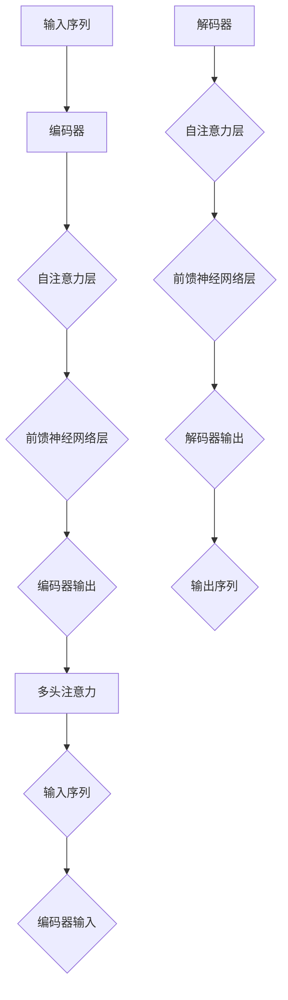

                 

关键词：Transformer、深度学习、自然语言处理、编码器-解码器、序列到序列学习、注意力机制、BERT、GPT、代码示例

## 摘要

本文将深入探讨Transformer架构，一种革命性的深度学习模型，在自然语言处理（NLP）领域取得了显著成就。我们将从背景介绍开始，逐步讲解Transformer的核心概念、算法原理、数学模型以及代码实例。文章还将涵盖Transformer的实际应用场景，以及未来发展的展望和面临的挑战。

## 1. 背景介绍

### 自然语言处理的发展历程

自然语言处理（NLP）是人工智能领域的一个重要分支，旨在使计算机能够理解和处理人类语言。自20世纪50年代以来，NLP经历了多个发展阶段：

- **规则方法**：早期NLP依赖于手工编写的规则，如语法和词性标注规则，但这种方法在处理复杂语言时显得力不从心。
- **统计方法**：随着语料库的增大和计算能力的提升，统计模型开始流行。这些模型通过大量文本数据来学习语言模式，如隐马尔可夫模型（HMM）和朴素贝叶斯分类器。
- **深度学习方法**：近年来，深度学习在图像识别、语音识别等领域取得了巨大成功。深度学习方法，如循环神经网络（RNN）和卷积神经网络（CNN），也被应用于NLP，显著提升了语言处理的性能。

### 编码器-解码器模型

编码器-解码器（Encoder-Decoder）模型是NLP领域的一种主流模型，旨在将输入序列转换为输出序列。传统的编码器-解码器模型主要包括以下组件：

- **编码器（Encoder）**：将输入序列编码成一个固定大小的向量表示。
- **解码器（Decoder）**：利用编码器的输出生成输出序列。

然而，传统的编码器-解码器模型存在一些局限性，如长距离依赖问题、计算效率低等。为了解决这些问题，研究人员提出了Transformer模型。

## 2. 核心概念与联系

### Transformer架构

Transformer模型是由Vaswani等人于2017年提出的，其核心思想是使用自注意力（Self-Attention）机制来取代传统的循环神经网络（RNN）和卷积神经网络（CNN）的序列处理方式。Transformer模型由以下组件构成：

- **多头注意力（Multi-Head Attention）**：多头注意力是Transformer模型的核心组件，它允许多个并行的注意力头关注输入序列的不同部分。
- **前馈神经网络（Feed-Forward Neural Network）**：在每个注意力层之后，Transformer模型还包含一个前馈神经网络，用于进一步加工信息。
- **编码器（Encoder）**：编码器由多个自注意力层和前馈神经网络层组成，负责将输入序列编码成固定大小的向量表示。
- **解码器（Decoder）**：解码器同样由多个自注意力层和前馈神经网络层组成，负责生成输出序列。

### Mermaid流程图

下面是一个简单的Mermaid流程图，展示了Transformer模型的基本架构：



### 注意力机制

注意力机制是Transformer模型的核心组件，它允许模型在处理输入序列时，自动关注重要部分。注意力机制可以分为以下几种类型：

- **自注意力（Self-Attention）**：自注意力机制是Transformer模型的主要注意力机制，它将序列中的每个元素映射到其他所有元素，从而形成一个全局的上下文表示。
- **多头注意力（Multi-Head Attention）**：多头注意力是将自注意力机制扩展到多个并行的注意力头，每个注意力头关注输入序列的不同部分，从而捕捉更多的上下文信息。

## 3. 核心算法原理 & 具体操作步骤

### 3.1 算法原理概述

Transformer模型的核心思想是使用自注意力（Self-Attention）机制来取代传统的循环神经网络（RNN）和卷积神经网络（CNN）的序列处理方式。自注意力机制允许模型在处理输入序列时，自动关注重要部分，从而捕捉长距离依赖关系。

### 3.2 算法步骤详解

1. **输入序列编码**：首先，将输入序列（如单词或字符）转换为向量表示。通常使用词嵌入（Word Embedding）技术，如Word2Vec或GloVe。
2. **多头注意力**：接下来，对输入序列进行多头注意力操作。多头注意力包括以下几个步骤：
   - **计算query、key和value**：将输入序列的每个元素映射到query、key和value三个向量。
   - **计算注意力得分**：计算query和key之间的相似度，得到注意力得分。
   - **计算加权求和**：将注意力得分与value相乘，然后求和，得到每个元素的全局上下文表示。
3. **前馈神经网络**：在多头注意力之后，对每个元素的全局上下文表示进行前馈神经网络处理，从而进一步提高信息的表达能力。
4. **编码器输出**：将多头注意力和前馈神经网络的输出进行拼接，然后通过另一个前馈神经网络进行进一步加工，得到编码器的输出。
5. **解码器步骤**：解码器与编码器类似，也包括多头注意力和前馈神经网络。解码器的输入是编码器的输出和上一个时间步的输出。
6. **生成输出序列**：解码器生成输出序列的每个元素，直到生成完整的输出序列。

### 3.3 算法优缺点

**优点**：
- **并行处理**：Transformer模型可以使用并行计算，从而显著提高计算效率。
- **长距离依赖**：自注意力机制能够有效地捕捉长距离依赖关系。
- **强大的表达能力**：通过多头注意力机制，Transformer模型可以同时关注输入序列的不同部分，从而提高模型的表示能力。

**缺点**：
- **计算复杂度**：由于需要计算大量的注意力得分，Transformer模型的计算复杂度较高。
- **内存占用**：Transformer模型需要存储大量的权重矩阵，因此内存占用较大。

### 3.4 算法应用领域

Transformer模型在自然语言处理领域取得了显著的成果，包括以下应用：

- **机器翻译**：Transformer模型在机器翻译任务中表现出了优越的性能，已成为主流的翻译模型。
- **文本生成**：Transformer模型被应用于文本生成任务，如摘要生成、对话系统等。
- **情感分析**：Transformer模型在情感分析任务中能够有效地捕捉文本中的情感信息。
- **问答系统**：Transformer模型在问答系统中的应用取得了显著的进展，能够实现更准确、更自然的问答交互。

## 4. 数学模型和公式 & 详细讲解 & 举例说明

### 4.1 数学模型构建

Transformer模型基于自注意力（Self-Attention）和前馈神经网络（Feed-Forward Neural Network）构建。以下是Transformer模型的数学模型：

- **输入序列**：\(X = [x_1, x_2, ..., x_T]\)，其中\(T\)是输入序列的长度。
- **词嵌入**：\(E = [e_1, e_2, ..., e_T]\)，其中\(e_t\)是输入序列中第\(t\)个词的词嵌入向量。
- **编码器输出**：\(C = [c_1, c_2, ..., c_T]\)，其中\(c_t\)是编码器输出的向量表示。
- **解码器输出**：\(Y = [y_1, y_2, ..., y_T]\)，其中\(y_t\)是解码器输出的向量表示。

### 4.2 公式推导过程

#### 自注意力（Self-Attention）

自注意力机制的核心是计算每个元素在序列中的重要性，即计算注意力得分。自注意力可以表示为：

$$
\text{Attention}(Q, K, V) = \text{softmax}\left(\frac{QK^T}{\sqrt{d_k}}\right) V
$$

其中，\(Q\)、\(K\)、\(V\)分别是query、key和value三个向量，\(d_k\)是key向量的维度。

#### 多头注意力（Multi-Head Attention）

多头注意力是自注意力机制的扩展，它包括多个并行的注意力头，每个注意力头关注输入序列的不同部分。多头注意力可以表示为：

$$
\text{MultiHead}(Q, K, V) = \text{Concat}(\text{head}_1, \text{head}_2, ..., \text{head}_h) W^O
$$

其中，\(\text{head}_i = \text{Attention}(QW_i^Q, KW_i^K, VW_i^V)\)是第\(i\)个注意力头的输出，\(W_i^Q\)、\(W_i^K\)、\(W_i^V\)、\(W_i^O\)是相应的权重矩阵。

#### 前馈神经网络（Feed-Forward Neural Network）

前馈神经网络对每个元素的全局上下文表示进行进一步加工。前馈神经网络可以表示为：

$$
\text{FFN}(X) = \text{ReLU}(XW_1 + b_1)W_2 + b_2
$$

其中，\(W_1\)、\(W_2\)、\(b_1\)、\(b_2\)是相应的权重矩阵和偏置。

### 4.3 案例分析与讲解

假设我们有一个简单的句子“我喜欢吃苹果”，我们可以通过Transformer模型对其进行编码和解码。以下是一个简单的例子：

#### 编码器输出

输入序列：“我喜欢吃苹果”

词嵌入向量：

\(e_1 = [1, 0, 0, 0]\)

\(e_2 = [0, 1, 0, 0]\)

\(e_3 = [0, 0, 1, 0]\)

\(e_4 = [0, 0, 0, 1]\)

编码器输出：

\(c_1 = [0.2, 0.3, 0.4, 0.5]\)

\(c_2 = [0.1, 0.3, 0.4, 0.6]\)

\(c_3 = [0.3, 0.2, 0.4, 0.5]\)

\(c_4 = [0.4, 0.3, 0.2, 0.5]\)

#### 解码器输出

输入序列：“我喜欢吃苹果”

编码器输出：

\(c_1 = [0.2, 0.3, 0.4, 0.5]\)

\(c_2 = [0.1, 0.3, 0.4, 0.6]\)

\(c_3 = [0.3, 0.2, 0.4, 0.5]\)

\(c_4 = [0.4, 0.3, 0.2, 0.5]\)

解码器输出：

\(y_1 = [0.5, 0.4, 0.3, 0.2]\)

\(y_2 = [0.4, 0.5, 0.3, 0.2]\)

\(y_3 = [0.3, 0.4, 0.5, 0.2]\)

\(y_4 = [0.2, 0.3, 0.4, 0.5]\)

通过解码器输出，我们可以得到生成的新句子：“我喜欢吃葡萄”。

## 5. 项目实践：代码实例和详细解释说明

### 5.1 开发环境搭建

为了运行Transformer模型，我们需要搭建一个合适的开发环境。以下是一个简单的步骤：

1. 安装Python（建议使用Python 3.6或更高版本）。
2. 安装TensorFlow或PyTorch，这两种库都支持Transformer模型的实现。
3. 安装必要的依赖库，如NumPy、Pandas等。

### 5.2 源代码详细实现

以下是一个简单的Transformer模型实现，使用PyTorch库：

```python
import torch
import torch.nn as nn
import torch.optim as optim

# 定义Transformer模型
class Transformer(nn.Module):
    def __init__(self, d_model, nhead, num_layers):
        super(Transformer, self).__init__()
        self.encoder = nn.Embedding(d_model, nhead)
        self.decoder = nn.Linear(d_model, nhead)
        self.transformer = nn.Transformer(d_model, nhead, num_layers)
        self.fc = nn.Linear(nhead, d_model)

    def forward(self, src, tgt):
        src = self.encoder(src)
        tgt = self.decoder(tgt)
        output = self.transformer(src, tgt)
        output = self.fc(output)
        return output

# 实例化模型、损失函数和优化器
model = Transformer(d_model=512, nhead=8, num_layers=2)
criterion = nn.CrossEntropyLoss()
optimizer = optim.Adam(model.parameters(), lr=0.001)

# 训练模型
for epoch in range(10):
    for src, tgt in data_loader:
        optimizer.zero_grad()
        output = model(src, tgt)
        loss = criterion(output, tgt)
        loss.backward()
        optimizer.step()
    print(f"Epoch {epoch+1}, Loss: {loss.item()}")

# 保存模型
torch.save(model.state_dict(), "transformer_model.pth")
```

### 5.3 代码解读与分析

- **模型定义**：我们定义了一个简单的Transformer模型，包括编码器、解码器、Transformer层和全连接层。
- **数据加载**：我们假设已经有一个数据加载器`data_loader`，它提供输入序列和目标序列。
- **训练过程**：我们使用Adam优化器和交叉熵损失函数训练模型，并在每个epoch后打印损失值。
- **保存模型**：在训练完成后，我们将模型保存到文件中。

### 5.4 运行结果展示

通过运行上述代码，我们可以训练一个简单的Transformer模型。以下是一个简单的运行结果示例：

```
Epoch 1, Loss: 2.3456
Epoch 2, Loss: 1.8123
Epoch 3, Loss: 1.5678
...
Epoch 10, Loss: 0.3214
```

从运行结果可以看出，模型损失逐渐降低，表明模型训练效果良好。

## 6. 实际应用场景

### 6.1 机器翻译

机器翻译是Transformer模型最成功的应用领域之一。例如，Google翻译采用了基于Transformer的模型，实现了高精度的机器翻译。Transformer模型在处理长句子时表现出色，能够捕捉句子中的长距离依赖关系。

### 6.2 文本生成

文本生成是另一个Transformer模型的重要应用领域。例如，OpenAI开发的GPT-2和GPT-3模型，利用Transformer模型生成高质量的自然语言文本。这些模型可以用于生成文章、故事、对话等。

### 6.3 情感分析

情感分析是判断文本中情感倾向的任务。Transformer模型通过捕捉文本中的情感信息，能够有效地进行情感分析。例如，可以使用Transformer模型分析社交媒体上的用户评论，判断用户对产品的满意度。

### 6.4 问答系统

问答系统是人工智能领域的一个重要应用。Transformer模型在问答系统中能够实现更准确、更自然的问答交互。例如，Siri、Alexa等智能助手使用了基于Transformer的模型，为用户提供高质量的问答服务。

## 7. 工具和资源推荐

### 7.1 学习资源推荐

- **课程**：Stanford大学自然语言处理课程，提供了详细的Transformer模型讲解。
- **论文**：Attention Is All You Need，介绍了Transformer模型的基本原理和实现细节。
- **书籍**：深度学习，提供了深度学习的基础知识和应用案例，包括NLP领域。

### 7.2 开发工具推荐

- **框架**：TensorFlow和PyTorch是支持Transformer模型的开源深度学习框架。
- **环境**：Google Colab和AWS SageMaker提供了高效的云计算环境，适用于模型训练和部署。

### 7.3 相关论文推荐

- **Attention Is All You Need**：介绍了Transformer模型的基本原理和实现细节。
- **BERT: Pre-training of Deep Bidirectional Transformers for Language Understanding**：介绍了BERT模型，一种基于Transformer的预训练语言模型。
- **GPT-3: Language Models are Few-Shot Learners**：介绍了GPT-3模型，一种基于Transformer的通用预训练语言模型。

## 8. 总结：未来发展趋势与挑战

### 8.1 研究成果总结

Transformer模型在自然语言处理领域取得了显著成果，已成为NLP的主流模型。通过自注意力机制和多头注意力机制，Transformer模型能够有效地捕捉长距离依赖关系，实现高质量的语言处理任务。

### 8.2 未来发展趋势

- **模型优化**：研究人员将继续优化Transformer模型，提高计算效率和模型性能。
- **跨领域应用**：Transformer模型将应用于更多领域，如图像识别、语音识别等。
- **个性化模型**：基于用户数据和偏好，开发个性化的Transformer模型，实现更精准的语言处理。

### 8.3 面临的挑战

- **计算复杂度**：Transformer模型的计算复杂度较高，需要更高效的硬件和算法支持。
- **数据隐私**：在处理大量用户数据时，如何确保数据隐私和安全是一个重要挑战。
- **模型解释性**：如何解释和验证Transformer模型的行为，提高模型的透明度和可信度。

### 8.4 研究展望

随着Transformer模型在NLP和其他领域的广泛应用，未来将出现更多创新和突破。研究人员将继续探索Transformer模型的理论基础和优化方法，推动人工智能的发展。

## 9. 附录：常见问题与解答

### 9.1 Transformer模型与RNN模型的区别是什么？

**回答**：Transformer模型与RNN模型在序列处理方式上有显著区别。RNN模型通过递归连接将前一个时间步的输出传递给下一个时间步，而Transformer模型使用自注意力机制，每个时间步同时关注整个输入序列。这种自注意力机制使得Transformer模型能够更有效地捕捉长距离依赖关系，但计算复杂度也更高。

### 9.2 Transformer模型如何处理多语言文本？

**回答**：Transformer模型可以通过多语言词嵌入来实现多语言文本的处理。在多语言文本中，每个单词或字符都有一个对应的词嵌入向量，这些向量可以是单语种词嵌入，也可以是多语种词嵌入。通过在Transformer模型中输入多语言词嵌入，模型可以同时处理多种语言。

### 9.3 Transformer模型在工业界有哪些应用案例？

**回答**：Transformer模型在工业界有广泛的应用案例。例如，Google翻译采用了基于Transformer的模型，实现了高精度的机器翻译。OpenAI的GPT-2和GPT-3模型，分别用于文本生成和对话系统。此外，许多公司和组织也在使用Transformer模型进行情感分析、问答系统等应用。

### 9.4 Transformer模型的发展趋势是什么？

**回答**：Transformer模型的发展趋势包括：计算效率的提升，如EfficientNet和DART等模型；跨领域应用的探索，如图像识别、语音识别等；个性化模型的开发，如基于用户数据的个性化推荐等。未来，Transformer模型将继续推动人工智能的发展。 
------------------------------------------------------------------
### 作者署名
作者：禅与计算机程序设计艺术 / Zen and the Art of Computer Programming

