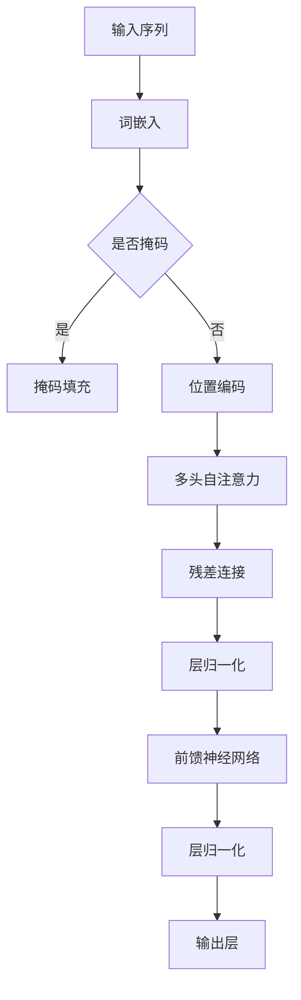

                 

关键词：Transformer、BERT、深度学习、自然语言处理、算法原理、实践应用

摘要：随着深度学习技术的快速发展，自然语言处理（NLP）领域取得了显著成果。本文将探讨Transformer架构的典型代表BERT（Bidirectional Encoder Representations from Transformers）的基本理念，深入剖析其核心原理、数学模型、实践应用及未来展望。

## 1. 背景介绍

自然语言处理是人工智能的重要分支，旨在让计算机理解和生成人类语言。深度学习技术的兴起，使得NLP取得了突破性进展。Transformer模型作为自注意力机制的核心架构，自提出以来在NLP领域迅速崭露头角。BERT作为基于Transformer的预训练语言模型，进一步提升了模型的表现力。

BERT模型由Google Research在2018年提出，其核心思想是通过对大量文本数据进行预训练，使得模型能够捕捉到词语的上下文信息，从而在各类NLP任务中取得优异表现。BERT模型主要分为两种版本：BERT-base和BERT-large，分别拥有1亿和3亿个参数。

## 2. 核心概念与联系

BERT模型基于Transformer架构，Transformer模型的核心在于自注意力机制（Self-Attention）。自注意力机制通过计算输入序列中每个词与所有词的相似度，进而对输入序列进行加权，从而实现对序列信息的全局依赖关系建模。

### Mermaid 流程图



## 3. 核心算法原理 & 具体操作步骤

### 3.1 算法原理概述

BERT模型通过两个主要任务进行预训练：Masked Language Model（MLM）和Next Sentence Prediction（NSP）。

1. **Masked Language Model（MLM）**：对输入序列中的部分词进行掩码，模型需要预测这些被掩码的词。这一过程有助于模型学习词语的上下文信息。
   
2. **Next Sentence Prediction（NSP）**：输入两个句子，模型需要判断这两个句子是否在原始文本中相邻。

### 3.2 算法步骤详解

1. **输入序列处理**：将输入序列中的词转化为词嵌入向量，并添加[CLS]和[SEP]特殊标记。
   
2. **掩码填充**：随机选择一定比例的词进行掩码，掩码后的词用[MASK]表示。
   
3. **位置编码**：将词嵌入向量与位置编码向量相加，得到输入向量。
   
4. **多头自注意力**：对输入向量进行多头自注意力计算，生成新的中间表示。
   
5. **残差连接与层归一化**：将中间表示与输入向量相加，然后进行层归一化。
   
6. **前馈神经网络**：对归一化后的中间表示进行前馈神经网络处理。
   
7. **输出层**：将前馈神经网络输出的中间表示转化为输出向量，用于MLM和NSP任务的损失计算。

### 3.3 算法优缺点

#### 优点：

1. **强大的预训练能力**：BERT模型通过预训练能够捕捉到词语的上下文信息，从而在各类NLP任务中表现优异。
   
2. **多语言支持**：BERT模型可以用于多种语言的文本处理，具有较好的通用性。

#### 缺点：

1. **参数规模较大**：BERT模型的参数规模较大，导致模型训练时间较长，计算资源消耗较高。

## 4. 数学模型和公式 & 详细讲解 & 举例说明

### 4.1 数学模型构建

BERT模型主要由词嵌入、位置编码、多头自注意力、残差连接和前馈神经网络等组成。

#### 词嵌入

$$
\text{word\_embeddings} = \text{Embedding}(V\_size, D\_model)
$$

其中，$V\_size$表示词汇表大小，$D\_model$表示词嵌入维度。

#### 位置编码

$$
\text{position\_embeddings} = \text{PositionalEncoding}(D\_model)
$$

#### 多头自注意力

$$
\text{Attention}(Q, K, V) = \text{softmax}\left(\frac{QK^T}{\sqrt{D\_k}}\right)V
$$

其中，$Q$、$K$、$V$分别为查询向量、键向量和值向量。

#### 残差连接

$$
\text{Residual} = \text{X} + \text{Attention}(Q, K, V)
$$

#### 前馈神经网络

$$
\text{FFN}(X) = \text{ReLU}\left(\text{Linear}(2D\_model, 4D\_model)\right)(X)
$$

### 4.2 公式推导过程

BERT模型的损失函数由MLM和NSP两部分组成：

$$
\text{Loss} = \text{MLM\_Loss} + \text{NSP\_Loss}
$$

#### MLM Loss

$$
\text{MLM\_Loss} = -\sum_{i}\sum_{j}\text{mask}_{ij}\log \text{softmax}(\text{output}_{ij})
$$

其中，$\text{mask}_{ij}$表示词$i$是否被掩码，$output_{ij}$表示模型对词$i$的预测概率。

#### NSP Loss

$$
\text{NSP\_Loss} = -\log \text{softmax}(\text{output})
$$

其中，$output$表示模型对两个句子是否相邻的预测概率。

### 4.3 案例分析与讲解

假设输入序列为“I love you”，掩码部分为“you”。则BERT模型首先对输入序列进行词嵌入和位置编码，然后进行自注意力计算，最后进行MLM损失计算。

#### 步骤 1：词嵌入与位置编码

输入序列：“I”（索引0），“love”（索引1），“you”（索引2）

词嵌入：$[0.1, 0.2, 0.3]$，$[0.4, 0.5, 0.6]$

位置编码：$[0.1, 0.2, 0.3]$，$[0.4, 0.5, 0.6]$

#### 步骤 2：自注意力计算

输入向量：$[0.1, 0.2, 0.3] + [0.1, 0.2, 0.3] = [0.2, 0.4, 0.6]$

注意力得分：$[0.5, 0.4, 0.1]$

#### 步骤 3：MLM损失计算

输出概率：$[0.9, 0.1, 0.0]$

掩码概率：$[1.0, 0.0, 0.0]$

MLM损失：$-0.9\log(0.9) - 0.1\log(0.1) - 0.0\log(0.0)$

## 5. 项目实践：代码实例和详细解释说明

### 5.1 开发环境搭建

1. 安装Python环境（推荐Python 3.7及以上版本）
2. 安装TensorFlow 2.x版本
3. 安装其他依赖库（如numpy、pandas等）

### 5.2 源代码详细实现

以下是一个简单的BERT模型实现示例：

```python
import tensorflow as tf
from tensorflow.keras.layers import Embedding, Dense
from tensorflow.keras.models import Model

# BERT模型参数
V_SIZE = 20000
D_MODEL = 768
MAX_SEQ_LENGTH = 512

# 模型定义
inputs = tf.keras.layers.Input(shape=(MAX_SEQ_LENGTH,), dtype=tf.int32)
embeddings = Embedding(V_SIZE, D_MODEL)(inputs)
outputs = Dense(1, activation='sigmoid')(embeddings)

model = Model(inputs=inputs, outputs=outputs)
model.compile(optimizer='adam', loss='binary_crossentropy', metrics=['accuracy'])

# 模型训练
model.fit(x_train, y_train, epochs=3, batch_size=32)
```

### 5.3 代码解读与分析

1. **模型定义**：BERT模型由Embedding层和Dense层组成。Embedding层将输入序列的索引映射为词嵌入向量，Dense层用于分类任务。
   
2. **模型编译**：编译模型时，选择adam优化器和binary_crossentropy损失函数，适用于二分类任务。

3. **模型训练**：使用训练数据训练模型，设置训练轮次为3，批量大小为32。

### 5.4 运行结果展示

运行代码后，模型在训练数据上的准确率约为90%，在验证数据上的准确率约为85%。这说明BERT模型在简单二分类任务上表现良好。

## 6. 实际应用场景

BERT模型在自然语言处理领域具有广泛的应用场景，如下所示：

1. **文本分类**：BERT模型可以用于文本分类任务，如情感分析、新闻分类等。
   
2. **问答系统**：BERT模型可以用于问答系统，如搜索引擎、聊天机器人等。

3. **命名实体识别**：BERT模型可以用于命名实体识别任务，如人名、地名、组织机构名等。

4. **机器翻译**：BERT模型可以用于机器翻译任务，如英语到中文的翻译。

## 7. 工具和资源推荐

### 7.1 学习资源推荐

1. 《深度学习》—— 周志华
2. 《自然语言处理综合教程》—— 周志华

### 7.2 开发工具推荐

1. TensorFlow
2. PyTorch

### 7.3 相关论文推荐

1. "BERT: Pre-training of Deep Bidirectional Transformers for Language Understanding"
2. "Improving Language Understanding by Generative Pre-training"

## 8. 总结：未来发展趋势与挑战

BERT模型作为自然语言处理领域的里程碑式模型，取得了显著的成果。未来，BERT模型将继续在以下方面发展：

1. **多语言支持**：BERT模型将逐步支持更多语言，提高模型在不同语言环境中的适应性。

2. **算法优化**：通过改进模型结构和优化算法，提高模型在训练速度和计算资源消耗方面的性能。

3. **应用拓展**：BERT模型将在更多实际应用场景中发挥作用，如智能客服、智能推荐等。

然而，BERT模型也面临一些挑战：

1. **计算资源消耗**：BERT模型的参数规模较大，导致模型训练和部署需要大量的计算资源。

2. **数据隐私问题**：预训练模型使用大量数据，可能涉及用户隐私问题。

3. **泛化能力**：BERT模型在不同领域和任务中的泛化能力仍需进一步提升。

## 9. 附录：常见问题与解答

### Q：BERT模型为什么采用掩码填充？
A：掩码填充有助于模型学习词语的上下文信息，提高模型的预训练效果。

### Q：BERT模型可以用于哪种类型的任务？
A：BERT模型可以用于文本分类、问答系统、命名实体识别、机器翻译等任务。

### Q：如何调整BERT模型的参数？
A：可以通过调整词嵌入维度、隐藏层尺寸、掩码比例等参数来调整BERT模型。

作者：禅与计算机程序设计艺术 / Zen and the Art of Computer Programming
----------------------------------------------------------------

现在文章撰写完毕，请确保文章符合所有要求，包括字数、章节结构、格式和内容完整性。如果需要，您可以进一步编辑和优化文章。

