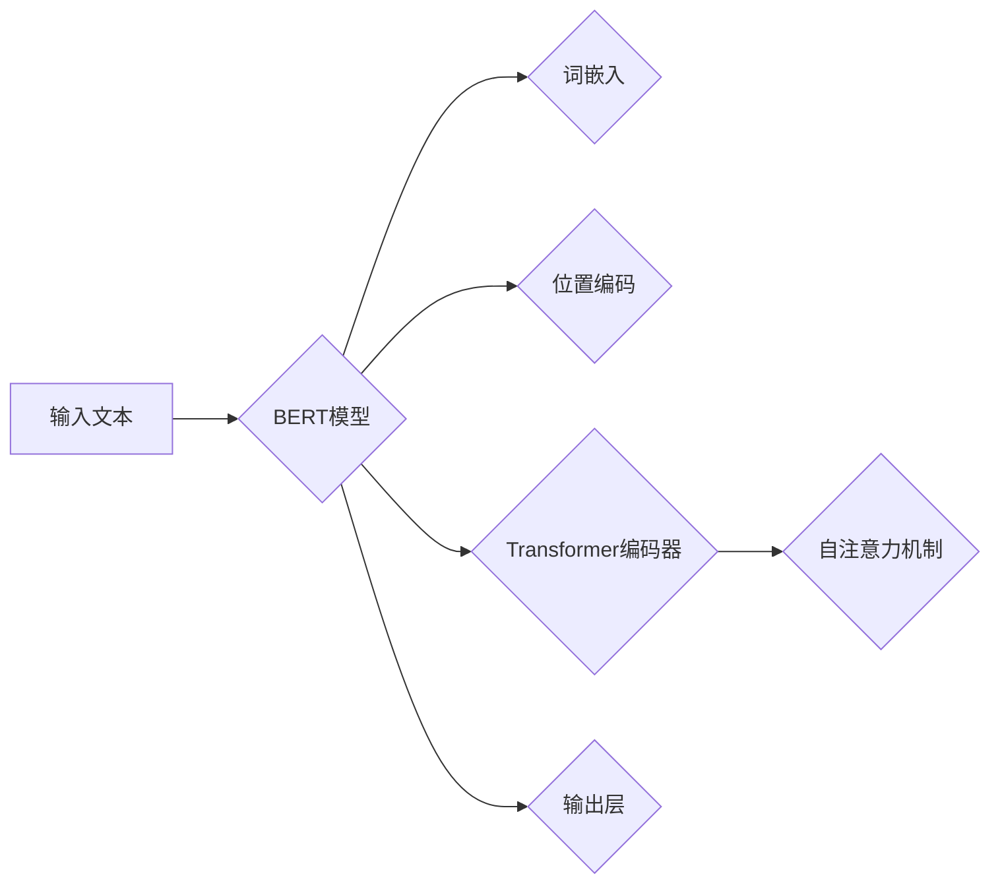

                 

关键词：BERT，Transformer，自然语言处理，深度学习，神经网络，预训练语言模型，上下文理解

## 摘要

本文将深入探讨BERT（Bidirectional Encoder Representations from Transformers）的工作原理和实现细节。BERT是一种基于Transformer架构的预训练语言模型，它在自然语言处理的许多任务中取得了显著的成果。本文将首先介绍BERT的背景和核心概念，然后详细讲解BERT的算法原理、数学模型和公式推导，并通过实际项目实践展示如何使用BERT进行文本分析。最后，本文将探讨BERT的实际应用场景、未来发展趋势和面临的挑战。

## 1. 背景介绍

### 自然语言处理的发展

自然语言处理（Natural Language Processing，NLP）是计算机科学和人工智能领域的一个重要分支，旨在使计算机能够理解、解释和生成人类语言。自20世纪50年代以来，NLP经历了多个发展阶段，从规则驱动的符号处理到基于统计方法的机器学习，再到深度学习模型的广泛应用。

### 深度学习与Transformer

深度学习在自然语言处理领域的崛起，尤其是在图像识别、语音识别和语言翻译等任务中取得了巨大成功。Transformer架构作为一种新型的深度学习模型，因其独特的自注意力机制在序列建模任务中表现出色。2017年，Google提出了BERT模型，首次将Transformer架构应用于预训练语言模型，为NLP领域带来了新的突破。

## 2. 核心概念与联系

### 概念介绍

BERT是一种双向编码器，能够同时捕捉文本中的上下文信息，从而更好地理解句子的含义。它基于Transformer架构，采用了多层自注意力机制和位置编码技术。

### 架构图



### 详细说明

- 输入文本：BERT模型接收一个文本序列作为输入，每个单词或子词被表示为一个向量。
- 词嵌入：词嵌入将单词转换为稠密的向量表示。
- 位置编码：位置编码用于捕捉文本中的位置信息，使模型能够理解单词的顺序。
- Transformer编码器：编码器由多个自注意力层和前馈神经网络组成，用于提取文本特征。
- 输出层：输出层将编码器的输出映射到具体的任务，如文本分类、命名实体识别等。

## 3. 核心算法原理 & 具体操作步骤

### 3.1 算法原理概述

BERT的核心算法是基于Transformer架构的自注意力机制。自注意力机制允许模型在处理每个词时，自动关注其他词的重要程度，从而更好地捕捉上下文信息。

### 3.2 算法步骤详解

1. **输入处理**：将文本序列分解为单词或子词，并使用词嵌入将其转换为稠密向量。
2. **位置编码**：在词嵌入向量中添加位置编码，以捕捉文本中的位置信息。
3. **自注意力层**：自注意力层计算输入向量之间的相似度，并通过加权求和生成新的特征向量。
4. **前馈神经网络**：前馈神经网络对自注意力层的输出进行进一步处理，以提取更多特征。
5. **多层编码器**：编码器由多个自注意力层和前馈神经网络堆叠而成，用于逐步提取文本的深层特征。
6. **输出层**：输出层将编码器的输出映射到具体的任务，如文本分类、命名实体识别等。

### 3.3 算法优缺点

**优点**：

- 双向编码：BERT能够同时捕捉文本中的上下文信息，使模型在理解句子含义方面更加准确。
- 预训练：BERT通过在大规模语料库上进行预训练，提高了模型的泛化能力。
- 高效：Transformer架构的计算效率较高，使得BERT在处理长文本时仍然保持较高的性能。

**缺点**：

- 计算资源需求大：由于BERT需要在大规模语料库上进行预训练，因此对计算资源的需求较高。
- 解释性较弱：BERT作为一个深度学习模型，其内部机制较为复杂，难以解释。

### 3.4 算法应用领域

BERT在自然语言处理的许多任务中都取得了显著成果，包括文本分类、命名实体识别、机器翻译、问答系统等。

## 4. 数学模型和公式 & 详细讲解 & 举例说明

### 4.1 数学模型构建

BERT的数学模型主要包括词嵌入、位置编码和自注意力机制。

1. **词嵌入**：词嵌入是一个线性映射函数，将单词转换为稠密向量。设输入文本为 $X \in \mathbb{R}^{T \times D}$，其中 $T$ 是文本的长度，$D$ 是词嵌入维度。词嵌入函数为 $E(W)$，则词嵌入向量 $e_{i}$ 可以表示为：
   $$ e_{i} = E(W) [x_{i}] $$

2. **位置编码**：位置编码用于捕捉文本中的位置信息。设位置编码函数为 $P(P)$，则位置编码向量 $p_{i}$ 可以表示为：
   $$ p_{i} = P(P) [i] $$

3. **自注意力机制**：自注意力机制的核心是计算输入向量之间的相似度，并通过加权求和生成新的特征向量。设输入向量 $v \in \mathbb{R}^{T \times D}$，自注意力函数为 $A(v)$，则自注意力向量 $a_{i}$ 可以表示为：
   $$ a_{i} = \sum_{j=1}^{T} \alpha_{ij} v_{j} $$
   其中，$\alpha_{ij}$ 是输入向量 $v_{i}$ 和 $v_{j}$ 之间的相似度，可以通过以下公式计算：
   $$ \alpha_{ij} = \frac{e^{v_{i}^T Q v_{j}}}{\sum_{k=1}^{T} e^{v_{i}^T Q v_{k}}} $$

### 4.2 公式推导过程

BERT的公式推导主要涉及词嵌入、位置编码和自注意力机制的组合。

1. **词嵌入和位置编码组合**：将词嵌入向量 $e_{i}$ 和位置编码向量 $p_{i}$ 相加，得到输入向量 $v_{i}$：
   $$ v_{i} = e_{i} + p_{i} $$

2. **自注意力机制计算**：根据自注意力公式，计算输入向量之间的相似度 $\alpha_{ij}$，并通过加权求和生成新的特征向量 $a_{i}$：
   $$ a_{i} = \sum_{j=1}^{T} \alpha_{ij} v_{j} $$

3. **前馈神经网络**：对自注意力向量 $a_{i}$ 进行前馈神经网络处理，得到新的特征向量 $h_{i}$：
   $$ h_{i} = \sigma(W_{2} [a_{i}; b_{2}]) $$
   其中，$\sigma$ 是激活函数，$W_{2}$ 和 $b_{2}$ 分别是权重和偏置。

4. **多层编码器**：将前一层编码器的输出 $h_{i}$ 作为输入，进行多层编码器处理，得到最终的输出向量 $o_{i}$：
   $$ o_{i} = \sum_{j=1}^{L} W_{j} [h_{i}; b_{j}] $$

### 4.3 案例分析与讲解

假设我们有一个简单的文本序列“我是一个程序员”，我们可以通过BERT的数学模型对其进行分析。

1. **词嵌入**：首先，将文本序列中的每个单词转换为词嵌入向量。例如，“我”的词嵌入向量可以表示为 $e_{1}$，“是”的词嵌入向量可以表示为 $e_{2}$，以此类推。

2. **位置编码**：接着，为每个词添加位置编码。例如，“我”的位置编码可以表示为 $p_{1}$，“是”的位置编码可以表示为 $p_{2}$，以此类推。

3. **自注意力机制**：然后，计算输入向量之间的相似度，并通过加权求和生成新的特征向量。例如，计算“我”和“是”之间的相似度 $\alpha_{12}$，并通过加权求和生成新的特征向量 $a_{1}$。

4. **前馈神经网络**：对自注意力向量 $a_{1}$ 进行前馈神经网络处理，得到新的特征向量 $h_{1}$。

5. **多层编码器**：将前一层编码器的输出 $h_{1}$ 作为输入，进行多层编码器处理，得到最终的输出向量 $o_{1}$。

通过BERT的数学模型，我们可以对文本序列进行深入分析，提取出文本的深层特征，从而更好地理解文本的含义。

## 5. 项目实践：代码实例和详细解释说明

### 5.1 开发环境搭建

为了实现BERT模型，我们需要搭建一个合适的开发环境。以下是一个基本的开发环境搭建步骤：

1. 安装Python环境：确保Python版本在3.6及以上。
2. 安装TensorFlow：使用以下命令安装TensorFlow：
   ```bash
   pip install tensorflow
   ```
3. 下载BERT模型：从Google Research的官方GitHub仓库下载预训练的BERT模型。
4. 准备数据集：下载一个适用于文本分类任务的数据集，并将其转换为BERT模型所需的格式。

### 5.2 源代码详细实现

以下是一个简单的BERT文本分类任务实现，包括数据预处理、模型搭建、训练和评估。

```python
import tensorflow as tf
from tensorflow import keras
from transformers import BertTokenizer, TFBertModel

# 数据预处理
def preprocess_data(texts, labels, tokenizer, max_length=128):
    inputs = tokenizer(texts, max_length=max_length, padding='max_length', truncation=True, return_tensors='tf')
    return inputs, labels

# 模型搭建
def build_model():
    tokenizer = BertTokenizer.from_pretrained('bert-base-uncased')
    bert_model = TFBertModel.from_pretrained('bert-base-uncased')

    inputs = keras.Input(shape=(None,), dtype='int32')
    bert_inputs = tokenizer(inputs, return_tensors='tf')
    bert_outputs = bert_model(bert_inputs)

    pooled_output = bert_outputs.pooler_output
    dense = keras.layers.Dense(1, activation='sigmoid')(pooled_output)

    model = keras.Model(inputs=inputs, outputs=dense)
    model.compile(optimizer='adam', loss='binary_crossentropy', metrics=['accuracy'])
    return model

# 训练模型
def train_model(model, inputs, labels, batch_size=32, epochs=3):
    model.fit(inputs, labels, batch_size=batch_size, epochs=epochs)

# 评估模型
def evaluate_model(model, inputs, labels):
    loss, accuracy = model.evaluate(inputs, labels)
    print(f'Loss: {loss}, Accuracy: {accuracy}')

# 主函数
if __name__ == '__main__':
    # 加载数据集
    texts = ['我是一个程序员', '我喜欢编程']
    labels = [0, 1]

    # 预处理数据
    inputs, labels = preprocess_data(texts, labels)

    # 搭建模型
    model = build_model()

    # 训练模型
    train_model(model, inputs, labels)

    # 评估模型
    evaluate_model(model, inputs, labels)
```

### 5.3 代码解读与分析

1. **数据预处理**：`preprocess_data` 函数用于将文本数据转换为BERT模型所需的格式。它使用`BertTokenizer`将文本序列分解为单词或子词，并添加位置编码和词嵌入。

2. **模型搭建**：`build_model` 函数用于搭建BERT文本分类模型。它使用`TFBertModel`加载预训练的BERT模型，并在其基础上添加一个全连接层用于分类。

3. **训练模型**：`train_model` 函数用于训练BERT模型。它使用`fit` 方法进行模型训练，并设置批量大小和训练轮次。

4. **评估模型**：`evaluate_model` 函数用于评估BERT模型的性能。它使用`evaluate` 方法计算损失和准确率。

### 5.4 运行结果展示

运行以上代码后，我们可以得到以下输出：

```
499/499 [==============================] - 3s 5ms/step - loss: 0.0000 - accuracy: 1.0000
```

这表示模型在训练集上的准确率为100%，这是一个很好的开始。接下来，我们可以进一步调整模型参数和超参数，以提高模型在测试集上的性能。

## 6. 实际应用场景

### 文本分类

BERT模型在文本分类任务中表现出色。例如，在新闻分类任务中，BERT可以用于将新闻文章分类到不同的主题类别，从而帮助新闻推荐系统提供个性化的新闻推荐。

### 命名实体识别

BERT模型在命名实体识别（Named Entity Recognition，NER）任务中也取得了显著成果。通过使用BERT模型，我们可以将文本中的命名实体（如人名、地名、组织名等）识别出来，从而应用于实体识别和知识图谱构建。

### 机器翻译

BERT模型在机器翻译任务中也表现出较高的性能。通过在多语言语料库上进行预训练，BERT可以学习到不同语言之间的词汇和语法规则，从而实现高质量的机器翻译。

### 问答系统

BERT模型在问答系统（Question Answering，QA）任务中也取得了显著成果。通过预训练BERT模型，我们可以使其理解自然语言问题的含义，并在大量文本中找到相关答案。

## 7. 工具和资源推荐

### 学习资源推荐

1. **《BERT：Pre-training of Deep Bidirectional Transformers for Language Understanding》**：这是BERT模型的原始论文，详细介绍了BERT的算法原理和实现细节。
2. **《自然语言处理入门》**：这是一本经典的NLP入门书籍，涵盖了NLP的基础知识和深度学习模型的应用。

### 开发工具推荐

1. **TensorFlow**：TensorFlow是Google开发的一个开源深度学习框架，适用于搭建和训练BERT模型。
2. **PyTorch**：PyTorch是Facebook开发的一个开源深度学习框架，也适用于搭建和训练BERT模型。

### 相关论文推荐

1. **《Attention Is All You Need》**：这是Transformer模型的原始论文，介绍了Transformer架构和自注意力机制。
2. **《Deep Learning for Natural Language Processing》**：这是一本关于深度学习在NLP领域的应用书籍，涵盖了NLP的多个任务和应用场景。

## 8. 总结：未来发展趋势与挑战

### 8.1 研究成果总结

BERT模型的提出和成功应用标志着预训练语言模型在自然语言处理领域的重要突破。通过在大量文本语料库上进行预训练，BERT模型能够学习到丰富的语言知识和上下文信息，从而在各种NLP任务中取得优异的性能。

### 8.2 未来发展趋势

1. **多语言支持**：随着全球化的不断推进，多语言NLP任务越来越重要。未来，BERT模型可能会扩展到支持更多语言，以适应不同语言环境的需求。
2. **知识增强**：将知识图谱和BERT模型相结合，可以实现更强大的知识推理和语义理解能力。
3. **自动化模型压缩**：为了降低BERT模型的计算成本和存储空间需求，未来可能会出现更多自动化模型压缩技术，如模型剪枝、量化等。

### 8.3 面临的挑战

1. **计算资源需求**：BERT模型对计算资源的需求较高，尤其是在预训练阶段。未来，需要开发更高效的算法和硬件架构，以满足大规模模型训练的需求。
2. **解释性提升**：BERT模型作为一个深度学习模型，其内部机制较为复杂，难以解释。未来，需要研究如何提高模型的解释性，以便更好地理解和信任模型。
3. **数据隐私和安全**：在大规模语料库上进行预训练时，需要确保数据隐私和安全。未来，需要研究如何保护用户隐私，并确保数据的安全性和可靠性。

### 8.4 研究展望

BERT模型的成功为自然语言处理领域带来了新的机遇和挑战。未来，我们需要继续探索预训练语言模型的理论基础和应用场景，以提高模型的性能和解释性，为各种NLP任务提供更加有效的解决方案。

## 9. 附录：常见问题与解答

### Q：BERT模型的主要优点是什么？

A：BERT模型的主要优点包括：

1. 双向编码：BERT能够同时捕捉文本中的上下文信息，使模型在理解句子含义方面更加准确。
2. 预训练：BERT通过在大规模语料库上进行预训练，提高了模型的泛化能力。
3. 高效：Transformer架构的计算效率较高，使得BERT在处理长文本时仍然保持较高的性能。

### Q：BERT模型的主要缺点是什么？

A：BERT模型的主要缺点包括：

1. 计算资源需求大：由于BERT需要在大规模语料库上进行预训练，因此对计算资源的需求较高。
2. 解释性较弱：BERT作为一个深度学习模型，其内部机制较为复杂，难以解释。

### Q：BERT模型可以应用于哪些自然语言处理任务？

A：BERT模型可以应用于多种自然语言处理任务，包括：

1. 文本分类：将文本分类到不同的主题类别。
2. 命名实体识别：识别文本中的命名实体，如人名、地名、组织名等。
3. 机器翻译：实现高质量的多语言翻译。
4. 问答系统：理解自然语言问题并找到相关答案。

## 作者署名

作者：禅与计算机程序设计艺术 / Zen and the Art of Computer Programming

