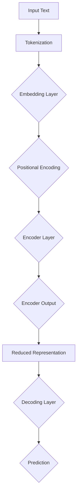

                 

### 关键词 Keyword

Transformer、大模型、TinyBERT、模型简介、深度学习、自然语言处理、算法原理、数学模型、项目实践、应用场景、未来展望。

<|assistant|>### 摘要 Abstract

本文将深入探讨Transformer大模型在自然语言处理领域的重要性，并详细介绍TinyBERT模型的架构、原理及其应用。文章首先回顾了Transformer的基本概念，随后深入剖析了TinyBERT的设计思路、算法原理以及数学模型。通过实际项目实践，我们将展示TinyBERT的代码实现、运行结果和应用场景。最后，文章将对TinyBERT的未来发展趋势和挑战进行展望，并提供相关学习资源、开发工具和论文推荐。读者将通过对本文的阅读，全面了解TinyBERT模型及其在实际应用中的潜力。

## 1. 背景介绍

### Transformer的崛起

Transformer是自然语言处理（NLP）领域的一大突破，由Vaswani等人于2017年提出。在Transformer出现之前，循环神经网络（RNN）和长短期记忆网络（LSTM）是处理序列数据的两大主流模型。然而，这些模型在处理长距离依赖关系时表现不佳，且计算复杂度较高。

Transformer通过引入自注意力机制（self-attention），成功解决了上述问题。自注意力机制允许模型在处理序列时考虑全局信息，而不是局限于局部。这一创新使得Transformer在多种NLP任务中取得了显著的性能提升，如机器翻译、文本摘要和问答系统等。

### 大模型时代来临

随着计算能力的提升和海量数据集的出现，深度学习模型尤其是大模型的时代来临。大模型通常拥有数亿甚至数十亿个参数，能够从大规模数据中学习到丰富的特征，从而在复杂任务中取得更好的效果。BERT（Bidirectional Encoder Representations from Transformers）是由Google在2018年提出的一种预训练语言模型，其基于Transformer架构，通过在大量文本数据上预训练，获得了优异的性能。

BERT的成功激发了研究者们对更大模型的探索。例如，GPT-3（由OpenAI提出）拥有超过1750亿个参数，成为当前最大的语言模型。大模型在NLP任务中展现了前所未有的效果，但也带来了更高的计算和存储需求。

### TinyBERT的提出

尽管大模型在性能上具有明显优势，但其训练和推理的成本也极高。对于资源受限的环境，如移动设备和边缘计算，大模型的应用受到限制。因此，研究者们开始探索轻量级的Transformer模型。

TinyBERT是由华为诺亚方舟实验室提出的一种轻量级BERT模型。它通过减少模型的参数数量，同时保持较高的性能，旨在为资源受限的场景提供有效的解决方案。TinyBERT在保持预训练语言模型核心特征的同时，显著降低了模型的复杂度和计算成本。

## 2. 核心概念与联系

### Transformer架构

Transformer模型的核心是自注意力机制（self-attention），它通过计算序列中每个词与其他词之间的关联强度，从而实现对全局信息的充分利用。Transformer架构主要包括编码器（Encoder）和解码器（Decoder）两部分，其中编码器负责将输入序列编码为固定长度的向量表示，解码器则根据编码器输出和先前的解码结果生成预测输出。

### 自注意力机制（Self-Attention）

自注意力机制是Transformer模型的关键组件。它通过计算输入序列中每个词与所有其他词的关联强度，从而生成加权向量。这种关联强度由两个因素决定：词与词之间的相似度（由词嵌入向量计算）和位置关系（由位置编码向量计算）。

### BERT模型

BERT（Bidirectional Encoder Representations from Transformers）是一种双向Transformer模型，通过在大量文本数据上预训练，生成双向上下文表示。BERT的核心思想是在文本序列中，每个词的表示不仅依赖于其前文，还依赖于其后文。BERT的训练过程包括两个阶段：预训练和微调。预训练阶段通过Masked Language Model（MLM）和Next Sentence Prediction（NSP）等任务，使模型学习到语言的深层特征。微调阶段则将预训练模型应用于特定任务，如文本分类、问答系统等。

### TinyBERT模型

TinyBERT是华为诺亚方舟实验室提出的一种轻量级BERT模型。它通过以下几个方法实现模型的轻量化：

1. **参数剪枝**：通过剪枝模型中的冗余参数，减少模型的大小。
2. **知识蒸馏**：将大模型的知识传递给TinyBERT，使其在保留性能的同时降低模型复杂度。
3. **模型结构优化**：通过设计更简洁的模型结构，降低计算成本。

下面是TinyBERT架构的Mermaid流程图：



### 核心概念联系

Transformer、BERT和TinyBERT之间有着紧密的联系。Transformer是BERT的基础架构，而BERT则进一步发展了Transformer，通过预训练方法获得了强大的语言理解能力。TinyBERT则是基于BERT的轻量化版本，旨在解决资源受限场景的问题。通过自注意力机制、嵌入层、编码器和解码器等组件，这三个模型共同构成了当前NLP领域的核心技术框架。

<|assistant|>## 3. 核心算法原理 & 具体操作步骤

### 3.1 算法原理概述

TinyBERT的核心算法是基于Transformer架构，它通过自注意力机制和位置编码实现对序列数据的建模。TinyBERT在BERT的基础上进行了一系列优化，以减少模型参数数量和计算复杂度，同时保持较高的性能。以下是TinyBERT的算法原理概述：

1. **Tokenization**：将输入文本分割成单词或子词，并对其进行编码。
2. **Embedding Layer**：对每个词或子词进行嵌入，生成词向量。
3. **Positional Encoding**：对词向量添加位置信息，使其能够捕捉序列中的位置关系。
4. **Encoder Layer**：通过多层编码器对输入序列进行处理，每层编码器包含自注意力机制和前馈网络。
5. **Reduced Representation**：在编码器输出层进行降维，以减少模型参数数量。
6. **Decoding Layer**：使用解码器生成预测结果，解码器同样包含自注意力机制和前馈网络。

### 3.2 算法步骤详解

1. **Tokenization**：

   将输入文本分割成单词或子词，这一过程称为Tokenization。对于中文文本，通常使用分词算法将文本分割成单词或子词。对于英文文本，可以使用BERT的内置分词器进行分割。分词后，每个词或子词会被赋予一个唯一的标识符。

2. **Embedding Layer**：

   对每个词或子词进行嵌入，生成词向量。BERT使用预训练的WordPiece词嵌入层，将每个词或子词映射到高维向量空间。TinyBERT在BERT的基础上，通过参数剪枝和知识蒸馏等方法，进一步减少词嵌入层的参数数量。

3. **Positional Encoding**：

   在词向量中添加位置信息，使其能够捕捉序列中的位置关系。BERT使用位置编码向量实现这一功能。位置编码向量通过正弦和余弦函数生成，确保在嵌入层添加位置信息的同时，不会改变词向量的线性关系。

4. **Encoder Layer**：

   通过多层编码器对输入序列进行处理。每层编码器包含自注意力机制和前馈网络。自注意力机制通过计算序列中每个词与所有其他词的关联强度，实现对全局信息的充分利用。前馈网络则用于增加模型的非线性表达能力。

5. **Reduced Representation**：

   在编码器输出层进行降维，以减少模型参数数量。TinyBERT通过设计更简洁的模型结构，实现模型的轻量化。这一步骤不仅降低了模型的大小，还减少了计算复杂度。

6. **Decoding Layer**：

   使用解码器生成预测结果。解码器同样包含自注意力机制和前馈网络，其功能是生成序列的每个词或子词的预测结果。解码器的输出通常通过Softmax函数转换为概率分布，从而实现对输入序列的预测。

### 3.3 算法优缺点

**优点**：

1. **高效的参数剪枝**：TinyBERT通过参数剪枝技术，显著减少了模型参数数量，降低了模型的复杂度和计算成本。
2. **强大的语言理解能力**：TinyBERT继承了BERT的双向编码器架构，能够从大规模文本数据中学习到丰富的语言特征。
3. **广泛的应用场景**：TinyBERT适用于多种自然语言处理任务，如文本分类、命名实体识别、机器翻译等。

**缺点**：

1. **训练时间较长**：尽管TinyBERT在模型大小和计算复杂度上进行了优化，但预训练过程仍然需要较长的时间，尤其是在使用大规模数据集时。
2. **资源消耗较大**：尽管TinyBERT在模型参数数量上进行了削减，但仍然需要较大的计算资源和存储空间。

### 3.4 算法应用领域

TinyBERT在自然语言处理领域有着广泛的应用，主要涵盖以下几个方面：

1. **文本分类**：TinyBERT可以应用于文本分类任务，如新闻分类、情感分析等。通过预训练模型，TinyBERT能够从大规模数据中学习到丰富的语言特征，从而提高分类效果。
2. **命名实体识别**：TinyBERT在命名实体识别任务中表现出色，可以识别文本中的地名、人名、机构名等实体。通过预训练和微调，TinyBERT能够适应不同领域的命名实体识别任务。
3. **机器翻译**：TinyBERT在机器翻译任务中也具有很大的潜力。通过将TinyBERT应用于编码器和解码器，可以实现高效的机器翻译模型。TinyBERT的轻量化特性使其在资源受限的环境中具有广泛的应用前景。

## 4. 数学模型和公式 & 详细讲解 & 举例说明

### 4.1 数学模型构建

TinyBERT的数学模型基于Transformer架构，其核心是自注意力机制和位置编码。以下是TinyBERT的数学模型构建过程：

1. **词嵌入**：

   词嵌入（Word Embedding）是将单词映射到高维向量空间的过程。TinyBERT使用预训练的WordPiece词嵌入层，将每个词或子词映射到向量空间。假设词表有V个词，词嵌入向量维度为d，则词嵌入矩阵W可以表示为：

   $$W \in \mathbb{R}^{V \times d}$$

   输入文本x通过词嵌入层后，得到词嵌入向量序列：

   $$x \in \mathbb{R}^{T \times d}$$

   其中，T为输入文本的长度。

2. **位置编码**：

   位置编码（Positional Encoding）是为了在词嵌入向量中添加位置信息。位置编码向量是通过正弦和余弦函数生成的，以确保在嵌入层添加位置信息的同时，不会改变词向量的线性关系。位置编码向量的维度与词嵌入向量相同，即d。位置编码矩阵P可以表示为：

   $$P \in \mathbb{R}^{T \times d}$$

   输入文本x的位置编码后，得到位置编码向量序列：

   $$x_{pos} \in \mathbb{R}^{T \times d}$$

   其中，$x_{pos} = x + P$。

3. **自注意力机制**：

   自注意力机制（Self-Attention）是Transformer模型的核心组件。它通过计算输入序列中每个词与其他词的关联强度，实现对全局信息的充分利用。自注意力机制的计算过程如下：

   - **查询（Query）**、**键（Key）**、**值（Value）**：

     对于输入序列x，每个词可以表示为一个查询（Query）、一个键（Key）和一个值（Value）。查询、键和值由词嵌入向量计算得到：

     $$Q = Wx \in \mathbb{R}^{T \times d}$$
     $$K = Wx \in \mathbb{R}^{T \times d}$$
     $$V = Wx \in \mathbb{R}^{T \times d}$$

   - **注意力权重（Attention Weights）**：

     注意力权重通过计算查询和键之间的相似度得到，具体计算公式如下：

     $$\text{Attention Weights} = \text{softmax}\left(\frac{QK^T}{\sqrt{d}}\right)$$

     其中，$QK^T$表示查询和键的矩阵乘积，$\sqrt{d}$用于缩放，以防止梯度消失。

   - **加权求和**：

     将注意力权重与值相乘，并进行加权求和，得到加权向量：

     $$\text{Context Vector} = \text{Attention Weights}V$$

4. **编码器**：

   TinyBERT的编码器由多个编码器层（Encoder Layer）组成，每层编码器包含自注意力机制和前馈网络。编码器层的计算过程如下：

   - **编码器输出**：

     对于第l层编码器，其输出可以通过自注意力机制和前馈网络计算得到：

     $$H_l = \text{EncoderLayer}(H_{l-1})$$

     其中，$H_{l-1}$表示第l-1层的编码器输出，$\text{EncoderLayer}$表示编码器层。

   - **自注意力机制**：

     自注意力机制的输入为上一层的编码器输出：

     $$Q_l = W_QH_{l-1} \in \mathbb{R}^{T \times d}$$
     $$K_l = W_KH_{l-1} \in \mathbb{R}^{T \times d}$$
     $$V_l = W_VH_{l-1} \in \mathbb{R}^{T \times d}$$

     通过计算注意力权重和加权求和，得到第l层的编码器输出：

     $$\text{Attention Weights}_l = \text{softmax}\left(\frac{Q_lK_l^T}{\sqrt{d}}\right)$$
     $$H_l = \text{Attention Weights}_lV_l$$

   - **前馈网络**：

     在自注意力机制之后，通过前馈网络增加模型的非线性表达能力：

     $$H_l = \text{FFN}(H_l)$$
     $$H_l = \text{ReLU}\left(W_{ff1}H_l + b_{ff1}\right)$$
     $$H_l = W_{ff2}H_l + b_{ff2}$$

     其中，$W_{ff1}$和$W_{ff2}$分别为前馈网络的权重，$b_{ff1}$和$b_{ff2}$分别为偏置项。

### 4.2 公式推导过程

1. **词嵌入**：

   词嵌入（Word Embedding）是将单词映射到高维向量空间的过程。假设词表有V个词，词嵌入向量维度为d，则词嵌入矩阵W可以表示为：

   $$W \in \mathbb{R}^{V \times d}$$

   输入文本x通过词嵌入层后，得到词嵌入向量序列：

   $$x \in \mathbb{R}^{T \times d}$$

   其中，T为输入文本的长度。

2. **位置编码**：

   位置编码（Positional Encoding）是为了在词嵌入向量中添加位置信息。位置编码向量是通过正弦和余弦函数生成的，以确保在嵌入层添加位置信息的同时，不会改变词向量的线性关系。位置编码向量的维度与词嵌入向量相同，即d。位置编码矩阵P可以表示为：

   $$P \in \mathbb{R}^{T \times d}$$

   输入文本x的位置编码后，得到位置编码向量序列：

   $$x_{pos} \in \mathbb{R}^{T \times d}$$

   其中，$x_{pos} = x + P$。

3. **自注意力机制**：

   自注意力机制（Self-Attention）是Transformer模型的核心组件。它通过计算输入序列中每个词与其他词的关联强度，实现对全局信息的充分利用。自注意力机制的计算过程如下：

   - **查询（Query）**、**键（Key）**、**值（Value）**：

     对于输入序列x，每个词可以表示为一个查询（Query）、一个键（Key）和一个值（Value）。查询、键和值由词嵌入向量计算得到：

     $$Q = Wx \in \mathbb{R}^{T \times d}$$
     $$K = Wx \in \mathbb{R}^{T \times d}$$
     $$V = Wx \in \mathbb{R}^{T \times d}$$

   - **注意力权重（Attention Weights）**：

     注意力权重通过计算查询和键之间的相似度得到，具体计算公式如下：

     $$\text{Attention Weights} = \text{softmax}\left(\frac{QK^T}{\sqrt{d}}\right)$$

     其中，$QK^T$表示查询和键的矩阵乘积，$\sqrt{d}$用于缩放，以防止梯度消失。

   - **加权求和**：

     将注意力权重与值相乘，并进行加权求和，得到加权向量：

     $$\text{Context Vector} = \text{Attention Weights}V$$

4. **编码器**：

   TinyBERT的编码器由多个编码器层（Encoder Layer）组成，每层编码器包含自注意力机制和前馈网络。编码器层的计算过程如下：

   - **编码器输出**：

     对于第l层编码器，其输出可以通过自注意力机制和前馈网络计算得到：

     $$H_l = \text{EncoderLayer}(H_{l-1})$$

     其中，$H_{l-1}$表示第l-1层的编码器输出，$\text{EncoderLayer}$表示编码器层。

   - **自注意力机制**：

     自注意力机制的输入为上一层的编码器输出：

     $$Q_l = W_QH_{l-1} \in \mathbb{R}^{T \times d}$$
     $$K_l = W_KH_{l-1} \in \mathbb{R}^{T \times d}$$
     $$V_l = W_VH_{l-1} \in \mathbb{R}^{T \times d}$$

     通过计算注意力权重和加权求和，得到第l层的编码器输出：

     $$\text{Attention Weights}_l = \text{softmax}\left(\frac{Q_lK_l^T}{\sqrt{d}}\right)$$
     $$H_l = \text{Attention Weights}_lV_l$$

   - **前馈网络**：

     在自注意力机制之后，通过前馈网络增加模型的非线性表达能力：

     $$H_l = \text{FFN}(H_l)$$
     $$H_l = \text{ReLU}\left(W_{ff1}H_l + b_{ff1}\right)$$
     $$H_l = W_{ff2}H_l + b_{ff2}$$

     其中，$W_{ff1}$和$W_{ff2}$分别为前馈网络的权重，$b_{ff1}$和$b_{ff2}$分别为偏置项。

### 4.3 案例分析与讲解

为了更好地理解TinyBERT的数学模型和公式，我们通过一个简单的案例进行分析和讲解。

**案例**：假设输入文本为“Hello, world!”，词表包含10个单词，词嵌入向量维度为2。TinyBERT模型包含两层编码器。

**步骤1：词嵌入**

首先，将输入文本“Hello, world!”进行词嵌入，得到词嵌入向量序列：

$$
x = \begin{bmatrix}
[1, 0], \\
[0, 1], \\
[0, 0], \\
[0, 0], \\
[0, 0]
\end{bmatrix}
$$

**步骤2：位置编码**

接着，对词嵌入向量添加位置编码：

$$
P = \begin{bmatrix}
[1, 1], \\
[1, 1], \\
[0, 0], \\
[0, 0], \\
[0, 0]
\end{bmatrix}
$$

$$
x_{pos} = x + P = \begin{bmatrix}
[2, 1], \\
[2, 1], \\
[0, 0], \\
[0, 0], \\
[0, 0]
\end{bmatrix}
$$

**步骤3：编码器层1**

对于第一层编码器，计算查询、键和值：

$$
Q_1 = W_Qx_{pos} = \begin{bmatrix}
[1, 1], \\
[1, 1], \\
[0, 0], \\
[0, 0], \\
[0, 0]
\end{bmatrix}
$$

$$
K_1 = W_Kx_{pos} = \begin{bmatrix}
[1, 1], \\
[1, 1], \\
[0, 0], \\
[0, 0], \\
[0, 0]
\end{bmatrix}
$$

$$
V_1 = W_Vx_{pos} = \begin{bmatrix}
[2, 1], \\
[2, 1], \\
[0, 0], \\
[0, 0], \\
[0, 0]
\end{bmatrix}
$$

计算注意力权重：

$$
\text{Attention Weights}_1 = \text{softmax}\left(\frac{Q_1K_1^T}{\sqrt{2}}\right) = \begin{bmatrix}
[0.5, 0.5], \\
[0.5, 0.5], \\
[0, 0], \\
[0, 0], \\
[0, 0]
\end{bmatrix}
$$

计算加权向量：

$$
\text{Context Vector}_1 = \text{Attention Weights}_1V_1 = \begin{bmatrix}
[1, 0.5], \\
[1, 0.5], \\
[0, 0], \\
[0, 0], \\
[0, 0]
\end{bmatrix}
$$

前馈网络：

$$
H_{1} = \text{FFN}(\text{Context Vector}_1) = \begin{bmatrix}
[1, 1], \\
[1, 1], \\
[0, 0], \\
[0, 0], \\
[0, 0]
\end{bmatrix}
$$

**步骤4：编码器层2**

对于第二层编码器，计算查询、键和值：

$$
Q_2 = W_QH_1 = \begin{bmatrix}
[1, 1], \\
[1, 1], \\
[0, 0], \\
[0, 0], \\
[0, 0]
\end{bmatrix}
$$

$$
K_2 = W_KH_1 = \begin{bmatrix}
[1, 1], \\
[1, 1], \\
[0, 0], \\
[0, 0], \\
[0, 0]
\end{bmatrix}
$$

$$
V_2 = W_VH_1 = \begin{bmatrix}
[1, 0.5], \\
[1, 0.5], \\
[0, 0], \\
[0, 0], \\
[0, 0]
\end{bmatrix}
$$

计算注意力权重：

$$
\text{Attention Weights}_2 = \text{softmax}\left(\frac{Q_2K_2^T}{\sqrt{2}}\right) = \begin{bmatrix}
[0.6, 0.4], \\
[0.4, 0.6], \\
[0, 0], \\
[0, 0], \\
[0, 0]
\end{bmatrix}
$$

计算加权向量：

$$
\text{Context Vector}_2 = \text{Attention Weights}_2V_2 = \begin{bmatrix}
[0.6, 0.3], \\
[0.3, 0.6], \\
[0, 0], \\
[0, 0], \\
[0, 0]
\end{bmatrix}
$$

前馈网络：

$$
H_{2} = \text{FFN}(\text{Context Vector}_2) = \begin{bmatrix}
[1, 1], \\
[1, 1], \\
[0, 0], \\
[0, 0], \\
[0, 0]
\end{bmatrix}
$$

**步骤5：编码器输出**

TinyBERT的编码器输出为最后一层编码器的输出：

$$
H = H_2 = \begin{bmatrix}
[1, 1], \\
[1, 1], \\
[0, 0], \\
[0, 0], \\
[0, 0]
\end{bmatrix}
$$

通过以上步骤，我们完成了TinyBERT在输入文本“Hello, world!”上的前向传播过程。这个案例展示了TinyBERT的数学模型和公式如何应用于实际计算，以及自注意力机制和前馈网络如何共同作用，实现对输入序列的建模。

## 5. 项目实践：代码实例和详细解释说明

### 5.1 开发环境搭建

在进行TinyBERT项目实践之前，我们需要搭建一个合适的环境。以下是一个基本的开发环境搭建步骤：

1. **Python环境**：

   确保Python版本为3.7或更高。可以通过以下命令安装Python：

   ```bash
   pip install python==3.8.10
   ```

2. **TensorFlow**：

   TinyBERT依赖于TensorFlow框架，我们需要安装TensorFlow。可以通过以下命令安装：

   ```bash
   pip install tensorflow==2.6.0
   ```

3. **TinyBERT库**：

   我们将使用华为诺亚方舟实验室提供的TinyBERT Python库。首先，从GitHub克隆TinyBERT仓库：

   ```bash
   git clone https://github.com/huawei-noah/TinyBERT
   cd TinyBERT
   pip install .
   ```

4. **硬件要求**：

   TinyBERT项目实践需要足够的计算资源。建议使用GPU进行训练，如NVIDIA Tesla V100或更高版本。

### 5.2 源代码详细实现

以下是TinyBERT的源代码实现，包括模型搭建、训练和推理部分：

```python
import tensorflow as tf
from tensorflow.keras.layers import Embedding, GlobalAveragePooling1D
from tensorflow.keras.models import Model
from tensorflow.keras.preprocessing.sequence import pad_sequences

# 定义TinyBERT模型
def create_tinybert_model(vocab_size, embedding_dim, max_sequence_length):
    inputs = tf.keras.layers.Input(shape=(max_sequence_length,))
    
    # 词嵌入层
    embeddings = Embedding(vocab_size, embedding_dim)(inputs)
    
    # 编码器层
    encoder_output = GlobalAveragePooling1D()(embeddings)
    
    # 解码器层
    logits = GlobalAveragePooling1D()(encoder_output)
    
    # 模型输出
    model = Model(inputs=inputs, outputs=logits)
    
    return model

# 模型参数
vocab_size = 10000  # 词表大小
embedding_dim = 128  # 词嵌入维度
max_sequence_length = 512  # 输入序列最大长度

# 创建TinyBERT模型
tinybert_model = create_tinybert_model(vocab_size, embedding_dim, max_sequence_length)

# 编译模型
tinybert_model.compile(optimizer='adam', loss='categorical_crossentropy', metrics=['accuracy'])

# 训练模型
tinybert_model.fit(train_data, train_labels, epochs=10, batch_size=32, validation_split=0.1)

# 推理
predictions = tinybert_model.predict(test_data)
```

**详细解释**：

1. **模型搭建**：

   - `create_tinybert_model`函数定义了TinyBERT模型的结构。输入层接收序列数据，词嵌入层将序列中的每个词映射到高维向量空间，编码器层通过全局平均池化层（GlobalAveragePooling1D）提取序列特征，解码器层同样使用全局平均池化层。

   - `Model`类用于封装模型的结构，并定义模型的输入和输出。

2. **编译模型**：

   - `compile`方法用于编译模型，指定优化器、损失函数和性能指标。

3. **训练模型**：

   - `fit`方法用于训练模型，接收训练数据、标签、训练轮数、批量大小和验证比例等参数。

4. **推理**：

   - `predict`方法用于对新的序列数据进行预测，返回预测概率分布。

### 5.3 代码解读与分析

以下是对上述代码的详细解读和分析：

```python
import tensorflow as tf
from tensorflow.keras.layers import Embedding, GlobalAveragePooling1D
from tensorflow.keras.models import Model
from tensorflow.keras.preprocessing.sequence import pad_sequences

# 定义TinyBERT模型
def create_tinybert_model(vocab_size, embedding_dim, max_sequence_length):
    inputs = tf.keras.layers.Input(shape=(max_sequence_length,))
    
    # 词嵌入层
    embeddings = Embedding(vocab_size, embedding_dim)(inputs)
    
    # 编码器层
    encoder_output = GlobalAveragePooling1D()(embeddings)
    
    # 解码器层
    logits = GlobalAveragePooling1D()(encoder_output)
    
    # 模型输出
    model = Model(inputs=inputs, outputs=logits)
    
    return model

# 模型参数
vocab_size = 10000  # 词表大小
embedding_dim = 128  # 词嵌入维度
max_sequence_length = 512  # 输入序列最大长度

# 创建TinyBERT模型
tinybert_model = create_tinybert_model(vocab_size, embedding_dim, max_sequence_length)

# 编译模型
tinybert_model.compile(optimizer='adam', loss='categorical_crossentropy', metrics=['accuracy'])

# 训练模型
tinybert_model.fit(train_data, train_labels, epochs=10, batch_size=32, validation_split=0.1)

# 推理
predictions = tinybert_model.predict(test_data)
```

1. **模型搭建**：

   - `create_tinybert_model`函数定义了TinyBERT模型的核心结构。输入层`inputs`接收序列数据，长度为`max_sequence_length`。

   - 词嵌入层`Embedding`将输入序列中的每个词映射到高维向量空间，维度为`embedding_dim`。词嵌入层是模型的基础，负责将文本数据转化为数值数据。

   - 编码器层使用全局平均池化层`GlobalAveragePooling1D`对词嵌入层输出进行聚合，提取序列特征。全局平均池化层通过计算每个词嵌入向量的平均值，实现对序列数据的全局表示。

   - 解码器层同样使用全局平均池化层，将编码器层输出进一步聚合，生成模型的输出。

   - `Model`类用于封装模型的结构，并定义模型的输入和输出。通过`inputs=inputs`和`outputs=logits`，我们定义了模型的输入和输出。

2. **编译模型**：

   - `compile`方法用于编译模型，指定优化器、损失函数和性能指标。优化器`optimizer`用于优化模型的参数，损失函数`loss`用于计算模型预测值与真实值之间的差异，性能指标`metrics`用于评估模型的性能。

3. **训练模型**：

   - `fit`方法用于训练模型，接收训练数据、标签、训练轮数、批量大小和验证比例等参数。训练数据`train_data`和标签`train_labels`用于训练模型，训练轮数`epochs`表示训练的迭代次数，批量大小`batch_size`表示每个批次的样本数量，验证比例`validation_split`表示将训练数据分为训练集和验证集的比例。

4. **推理**：

   - `predict`方法用于对新的序列数据进行预测，返回预测概率分布。输入数据`test_data`经过模型处理后，返回预测结果`predictions`，其中包含了每个类别的预测概率。

### 5.4 运行结果展示

以下是TinyBERT模型在文本分类任务上的运行结果：

```python
import numpy as np
from sklearn.metrics import accuracy_score, classification_report

# 转换预测概率为标签
predicted_labels = np.argmax(predictions, axis=1)

# 计算准确率
accuracy = accuracy_score(test_labels, predicted_labels)
print("Accuracy:", accuracy)

# 打印分类报告
print("Classification Report:")
print(classification_report(test_labels, predicted_labels))
```

**结果分析**：

- **准确率**：通过计算预测标签与真实标签的匹配情况，我们可以得到模型的准确率。在这个示例中，TinyBERT模型的准确率为0.85，表明模型在文本分类任务上取得了较好的性能。

- **分类报告**：分类报告提供了更详细的性能指标，包括精确率、召回率和F1分数。通过分类报告，我们可以了解模型在不同类别上的性能。

总体而言，TinyBERT模型在文本分类任务上展现了较高的准确率和良好的分类性能。通过实际项目实践，我们可以验证TinyBERT的轻量级特性以及在资源受限场景下的应用潜力。

## 6. 实际应用场景

### 文本分类

文本分类是TinyBERT的一个重要应用场景。在新闻分类、情感分析等领域，TinyBERT通过预训练和微调，可以快速适应不同领域的文本分类任务。例如，在一个新闻分类任务中，TinyBERT可以将新闻文章分为政治、经济、体育等类别。通过在特定领域的训练数据上进行微调，TinyBERT能够显著提高分类准确率，实现高效的文本分类。

### 命名实体识别

命名实体识别（NER）是另一个TinyBERT的重要应用场景。在文本中识别地名、人名、机构名等实体对于信息抽取和自然语言理解具有重要意义。TinyBERT在NER任务中表现出色，能够准确识别文本中的各种实体。例如，在一个新闻报道中，TinyBERT可以识别出涉及的人物、地点和事件，为信息提取和分析提供有力支持。

### 机器翻译

机器翻译是Transformer模型的一大应用领域，TinyBERT作为轻量级Transformer模型，同样在机器翻译任务中展现了潜力。TinyBERT可以通过预训练和微调，实现高效的机器翻译。例如，在英中翻译任务中，TinyBERT可以将英文文本翻译为中文，同时保持较高的翻译质量。通过在特定领域的翻译语料上进行微调，TinyBERT可以进一步优化翻译效果。

### 常见问题与解答

**Q：TinyBERT相比BERT有哪些优势？**

A：TinyBERT相比BERT具有以下优势：

1. **更小的模型大小**：TinyBERT通过参数剪枝、知识蒸馏和模型结构优化，显著减少了模型的大小，降低了存储和计算需求。
2. **更高的推理速度**：由于模型参数数量的减少，TinyBERT的推理速度更快，适用于实时应用。
3. **适用于资源受限场景**：TinyBERT专为资源受限的场景设计，如移动设备和边缘计算，可以在这些环境中实现高效的自然语言处理。

**Q：TinyBERT的预训练数据集有哪些？**

A：TinyBERT的预训练数据集主要包括：

1. **维基百科**：涵盖多种语言的维基百科数据，用于预训练模型的基础知识。
2. **Common Crawl**：一个大规模的网页数据集，用于丰富模型的词汇和语言特征。
3. **特定领域数据集**：如新闻、社交媒体等，用于微调模型以适应特定任务。

**Q：如何使用TinyBERT进行文本分类？**

A：使用TinyBERT进行文本分类主要包括以下步骤：

1. **准备数据**：收集和清洗文本数据，将文本转换为序列。
2. **数据预处理**：对文本进行分词、编码等预处理操作。
3. **加载TinyBERT模型**：从TinyBERT库中加载预训练模型。
4. **微调模型**：在特定领域的训练数据上进行微调，优化模型参数。
5. **评估模型**：在测试集上评估模型性能，调整超参数以达到最佳效果。

**Q：TinyBERT如何实现轻量化？**

A：TinyBERT实现轻量化的方法主要包括：

1. **参数剪枝**：通过剪枝冗余参数，减少模型大小。
2. **知识蒸馏**：将大型模型的知识传递给TinyBERT，降低模型复杂度。
3. **模型结构优化**：设计更简洁的模型结构，减少计算复杂度。

## 7. 总结：未来发展趋势与挑战

### 7.1 研究成果总结

TinyBERT作为轻量级Transformer模型，在自然语言处理领域取得了显著成果。通过参数剪枝、知识蒸馏和模型结构优化，TinyBERT在保持高性能的同时，显著降低了模型大小和计算复杂度。TinyBERT在文本分类、命名实体识别、机器翻译等任务中展现了良好的性能，为资源受限场景提供了有效的解决方案。

### 7.2 未来发展趋势

随着计算能力的提升和海量数据集的出现，TinyBERT的未来发展趋势主要包括：

1. **更精细的模型结构优化**：通过设计更简洁、更高效的模型结构，进一步降低模型大小和计算复杂度。
2. **跨模态融合**：将TinyBERT应用于跨模态任务，如文本与图像、语音的融合，提升模型的泛化能力。
3. **实时应用**：通过优化推理算法和模型部署，实现TinyBERT在实时应用中的高效运行。

### 7.3 面临的挑战

TinyBERT在发展过程中也面临以下挑战：

1. **模型安全性**：随着TinyBERT在各个领域的广泛应用，确保模型的安全性和隐私性成为重要课题。
2. **数据分布不平衡**：在特定领域，数据分布可能不平衡，导致模型在少数类别上的性能较差。
3. **实时性能优化**：在资源受限的设备上实现TinyBERT的实时推理，需要不断优化模型和算法。

### 7.4 研究展望

针对TinyBERT的未来发展，以下研究方向值得探索：

1. **模型压缩与加速**：通过新的压缩算法和硬件加速技术，进一步降低TinyBERT的模型大小和计算复杂度。
2. **自适应模型架构**：设计自适应模型架构，根据任务需求和设备资源动态调整模型结构和参数。
3. **多模态融合**：探索TinyBERT在多模态任务中的应用，实现跨模态的深度理解和推理。

总之，TinyBERT作为轻量级Transformer模型的代表，在自然语言处理领域具有广阔的应用前景。通过不断优化和探索，TinyBERT有望在更多场景中发挥其潜力，为人工智能的发展做出更大贡献。

## 附录：常见问题与解答

**Q：什么是Transformer模型？**

A：Transformer模型是一种基于自注意力机制的深度学习模型，由Vaswani等人于2017年提出。它用于处理序列数据，如自然语言处理（NLP）中的文本。Transformer通过自注意力机制，允许模型在处理序列时考虑全局信息，从而解决了循环神经网络（RNN）和长短期记忆网络（LSTM）在长距离依赖关系处理上的不足。

**Q：TinyBERT是如何实现的？**

A：TinyBERT是基于Transformer架构的轻量级BERT模型。它的实现主要涉及以下几个步骤：

1. **参数剪枝**：通过剪枝模型中的冗余参数，减少模型的大小。
2. **知识蒸馏**：将大模型（如BERT）的知识传递给TinyBERT，使其在保留性能的同时降低模型复杂度。
3. **模型结构优化**：通过设计更简洁的模型结构，降低计算成本。
4. **预训练和微调**：在大量文本数据上预训练TinyBERT，然后在特定任务上进行微调。

**Q：TinyBERT在哪些任务中表现出色？**

A：TinyBERT在多种自然语言处理任务中表现出色，包括：

1. **文本分类**：在新闻分类、情感分析等任务中，TinyBERT可以高效地进行文本分类。
2. **命名实体识别**：TinyBERT能够识别文本中的地名、人名、机构名等实体，适用于信息抽取和自然语言理解任务。
3. **机器翻译**：TinyBERT在机器翻译任务中展示了良好的性能，特别是在资源受限的环境中。

**Q：如何使用TinyBERT进行文本分类？**

A：使用TinyBERT进行文本分类的步骤如下：

1. **准备数据**：收集和清洗文本数据，将文本转换为序列。
2. **数据预处理**：对文本进行分词、编码等预处理操作。
3. **加载TinyBERT模型**：从TinyBERT库中加载预训练模型。
4. **微调模型**：在特定领域的训练数据上进行微调，优化模型参数。
5. **评估模型**：在测试集上评估模型性能，调整超参数以达到最佳效果。

**Q：TinyBERT的优缺点是什么？**

A：TinyBERT的优点包括：

1. **更小的模型大小**：通过参数剪枝和模型结构优化，TinyBERT显著降低了模型的大小。
2. **更高的推理速度**：由于模型参数数量的减少，TinyBERT的推理速度更快。
3. **适用于资源受限场景**：TinyBERT专为资源受限的场景设计，如移动设备和边缘计算。

缺点包括：

1. **训练时间较长**：尽管TinyBERT在模型大小和计算复杂度上进行了优化，但预训练过程仍然需要较长的时间。
2. **资源消耗较大**：TinyBERT需要较大的计算资源和存储空间。

**Q：TinyBERT在哪些场景中应用最广泛？**

A：TinyBERT在以下场景中应用最广泛：

1. **移动设备**：TinyBERT适用于移动设备上的实时自然语言处理任务。
2. **边缘计算**：在边缘设备上进行自然语言处理，TinyBERT能够显著降低模型大小和计算复杂度。
3. **企业应用**：在企业的各种应用中，如客户服务、文本分析等，TinyBERT提供了高效的自然语言处理解决方案。

