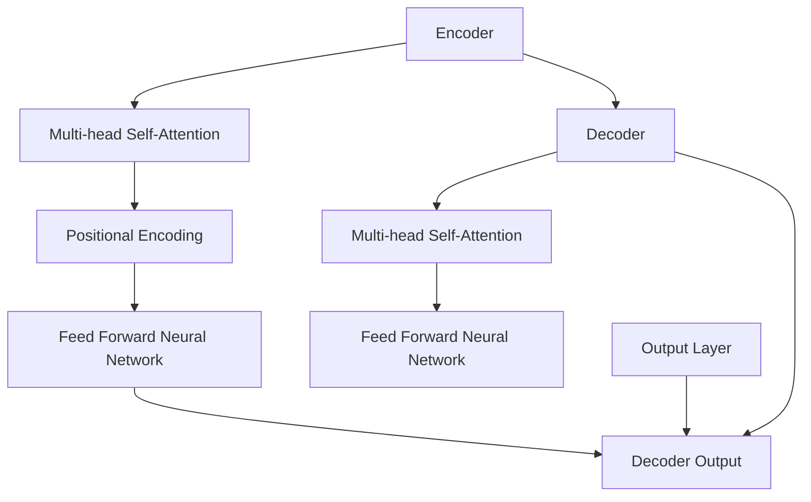
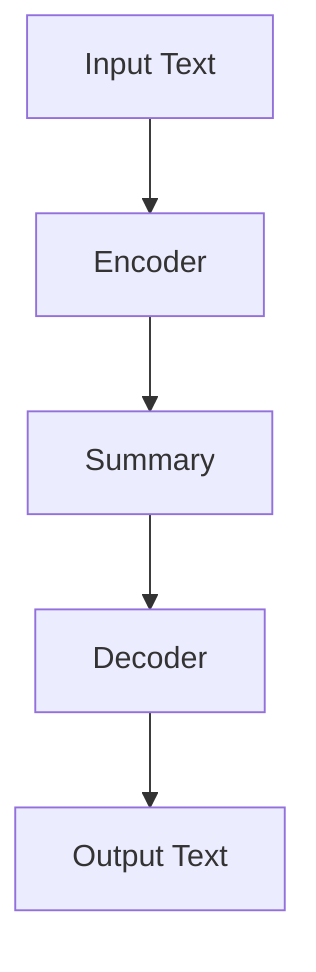

                 

关键词：Transformer，BART模型，文本摘要，深度学习，NLP

摘要：本文将深入探讨Transformer大模型，特别是BART模型在文本摘要任务中的应用。通过对其背景介绍、核心算法原理、数学模型和公式、项目实践、实际应用场景以及未来发展趋势的详细阐述，旨在为广大研究人员和开发者提供一份全面的技术指南。

## 1. 背景介绍

随着互联网和大数据的快速发展，自然语言处理（NLP）技术成为了人工智能领域的一个重要分支。其中，文本摘要作为信息提取和内容理解的核心任务，受到了广泛关注。传统的文本摘要方法主要基于规则和统计模型，如Summarization by Extractive Approaches（提取式方法）和Abstractive Approaches（生成式方法）。然而，这些方法在面对复杂文本时往往难以达到令人满意的效果。

近年来，基于深度学习的文本摘要方法取得了显著进展。特别是Transformer架构的出现，为文本摘要任务带来了新的契机。Transformer大模型以其强大的表征能力和全局信息处理能力，在文本摘要任务中表现出色。

本文将重点关注BART模型，这是基于Transformer架构的一种预训练文本摘要模型。BART（Bidirectional and Auto-Regressive Transformers）模型结合了双向和自回归的特点，能够更好地捕捉文本中的长距离依赖关系，从而实现高质量的文本摘要。

## 2. 核心概念与联系

### 2.1. Transformer架构

Transformer架构是深度学习在NLP领域的一个重要突破。与传统的循环神经网络（RNN）和长短期记忆网络（LSTM）相比，Transformer采用了自注意力机制（Self-Attention），能够同时关注输入序列的每个位置，从而捕捉全局信息。

以下是一个简单的Mermaid流程图，展示了Transformer架构的基本组成部分：



### 2.2. BART模型

BART模型是Transformer架构在文本摘要任务中的应用。它结合了双向和自回归的特点，能够同时处理编码和解码任务。BART模型的预训练过程包括两个阶段：第一阶段是编码阶段，用于生成摘要；第二阶段是解码阶段，用于生成原始文本。

以下是一个简单的Mermaid流程图，展示了BART模型的基本流程：



## 3. 核心算法原理 & 具体操作步骤

### 3.1. 算法原理概述

BART模型的核心在于其预训练过程。在预训练阶段，模型通过大量未标注的文本数据进行训练，从而学习到文本的内在结构和语义信息。具体来说，BART模型采用两个任务：掩码语言模型（Masked Language Model，MLM）和生成式文本摘要（Generative Text Summary，GTS）。

### 3.2. 算法步骤详解

#### 3.2.1. 掩码语言模型（MLM）

在掩码语言模型任务中，模型需要预测输入文本中被掩码的词语。具体步骤如下：

1. 随机选择输入文本中的部分词语进行掩码。
2. 对掩码后的文本进行编码，得到编码器输出。
3. 对编码器输出进行解码，预测被掩码的词语。

#### 3.2.2. 生成式文本摘要（GTS）

在生成式文本摘要任务中，模型需要根据输入文本生成摘要。具体步骤如下：

1. 对输入文本进行编码，得到编码器输出。
2. 使用编码器输出作为解码器的输入，生成摘要。
3. 对生成的摘要进行解码，得到最终的文本输出。

### 3.3. 算法优缺点

#### 3.3.1. 优点

- **强大的表征能力**：BART模型基于Transformer架构，能够同时关注输入序列的每个位置，从而捕捉全局信息。
- **高效的处理速度**：相较于传统的循环神经网络，Transformer架构在计算效率上有显著提升。
- **灵活的应用场景**：BART模型可以应用于多种文本摘要任务，如提取式摘要和生成式摘要。

#### 3.3.2. 缺点

- **对计算资源要求高**：由于模型参数规模庞大，训练BART模型需要大量的计算资源和时间。
- **易受到数据分布的影响**：在训练过程中，模型对数据的依赖较强，数据分布的差异可能导致模型性能的波动。

### 3.4. 算法应用领域

BART模型在文本摘要任务中表现出色，可以应用于多种场景，如：

- **新闻摘要**：从大量新闻文章中提取关键信息，生成简洁的摘要。
- **文档摘要**：对长篇文档进行摘要，帮助用户快速获取核心内容。
- **对话系统**：在智能对话系统中，生成高质量的回复。

## 4. 数学模型和公式 & 详细讲解 & 举例说明

### 4.1. 数学模型构建

BART模型的核心在于其预训练过程，包括掩码语言模型和生成式文本摘要任务。以下分别介绍这两个任务中的数学模型。

#### 4.1.1. 掩码语言模型（MLM）

在掩码语言模型任务中，输入文本中的部分词语被掩码，模型需要预测这些被掩码的词语。数学模型可以表示为：

$$
\hat{y} = \arg \max_{y} \log p(y|x)
$$

其中，$x$表示输入文本，$y$表示被掩码的词语，$\hat{y}$表示预测的被掩码词语。

#### 4.1.2. 生成式文本摘要（GTS）

在生成式文本摘要任务中，模型需要根据输入文本生成摘要。数学模型可以表示为：

$$
\hat{s} = \arg \max_{s} \log p(s|x)
$$

其中，$x$表示输入文本，$s$表示生成的摘要，$\hat{s}$表示预测的摘要。

### 4.2. 公式推导过程

BART模型是基于Transformer架构的，因此其数学模型可以看作是Transformer模型的变种。以下分别介绍掩码语言模型和生成式文本摘要任务中的公式推导过程。

#### 4.2.1. 掩码语言模型（MLM）

在掩码语言模型任务中，Transformer模型的输入可以表示为：

$$
x = [x_1, x_2, \ldots, x_n]
$$

其中，$x_i$表示第$i$个词语，$n$表示词语数量。

在自注意力机制中，每个词语都会与其余词语进行加权求和，得到权重向量$\alpha_{ij}$：

$$
\alpha_{ij} = \frac{e^{d_{ij}}}{\sum_{k=1}^{n} e^{d_{ik}}}
$$

其中，$d_{ij}$表示词语$i$和词语$j$之间的距离。

加权求和后，得到编码器输出$e$：

$$
e = \sum_{i=1}^{n} \alpha_{ij} x_i
$$

在解码阶段，使用编码器输出$e$作为解码器的输入，生成预测的被掩码词语$\hat{y}$。

#### 4.2.2. 生成式文本摘要（GTS）

在生成式文本摘要任务中，Transformer模型的输入可以表示为：

$$
x = [x_1, x_2, \ldots, x_n]
$$

其中，$x_i$表示第$i$个词语，$n$表示词语数量。

在编码阶段，使用编码器输出$e$作为解码器的输入，生成预测的摘要$\hat{s}$。

### 4.3. 案例分析与讲解

为了更好地理解BART模型的数学模型，我们来看一个简单的案例。

假设输入文本为：“今天天气很好，适合出门游玩。”

我们首先对输入文本进行掩码，例如将“很好”进行掩码，得到：

$$
x = [今天，天气，[MASK]，适合，出门，游玩。]
$$

然后，我们使用BART模型进行预测，得到：

$$
\hat{y} = \arg \max_{y} \log p(y|x)
$$

其中，$y$为“很好”的候选词语，如“好”，“很好”，“非常棒”等。

在解码阶段，我们使用编码器输出$e$作为解码器的输入，生成预测的摘要$\hat{s}$：

$$
\hat{s} = \arg \max_{s} \log p(s|x)
$$

其中，$s$为摘要的候选句子，如“今天天气很好，适合出门游玩。”或“天气很好，出门游玩是个不错的选择。”

## 5. 项目实践：代码实例和详细解释说明

### 5.1. 开发环境搭建

在开始项目实践之前，我们需要搭建一个合适的开发环境。以下是开发环境的基本要求：

- 操作系统：Linux（推荐Ubuntu 18.04）
- 编程语言：Python 3.7+
- 深度学习框架：PyTorch 1.7+
- 数据库：SQLite 3.7+

### 5.2. 源代码详细实现

以下是BART模型的源代码实现，主要分为以下几个部分：

#### 5.2.1. 数据预处理

首先，我们需要对文本进行预处理，包括分词、去停用词、转换为词嵌入等操作。以下是数据预处理的代码实现：

```python
import torch
from torchtext.data import Field, TabularDataset, BucketIterator
from transformers import BertTokenizer, BertModel

# 定义字段
text_field = Field(tokenize=None, lower=True)
label_field = Field()

# 加载数据集
train_data, valid_data, test_data = TabularDataset.splits(
    path='data',
    train='train.json',
    valid='valid.json',
    test='test.json',
    format='json',
    fields=[('text', text_field), ('label', label_field)]
)

# 划分训练集和验证集
train_data, valid_data = train_data.split()

# 创建词汇表
text_field.build_vocab(train_data, min_freq=2)
label_field.build_vocab(train_data)

# 初始化BERT模型和分词器
tokenizer = BertTokenizer.from_pretrained('bert-base-chinese')
model = BertModel.from_pretrained('bert-base-chinese')

# 转换数据集为PyTorch张量
def collate_batch(batch):
    text = [tokenizer.encode(x[0], add_special_tokens=True) for x in batch]
    label = torch.tensor([x[1] for x in batch])
    return torch.tensor(text, dtype=torch.long), label

# 创建数据加载器
batch_size = 32
train_iter = BucketIterator(train_data, batch_size=batch_size, shuffle=True)
valid_iter = BucketIterator(valid_data, batch_size=batch_size, shuffle=False)
test_iter = BucketIterator(test_data, batch_size=batch_size, shuffle=False)
```

#### 5.2.2. 模型定义

接下来，我们定义BART模型，包括编码器和解码器。以下是模型定义的代码实现：

```python
import torch.nn as nn
from transformers import BertModel

# 定义编码器和解码器
class BARTModel(nn.Module):
    def __init__(self, hidden_size=768, num_classes=2):
        super(BARTModel, self).__init__()
        self.encoder = BertModel.from_pretrained('bert-base-chinese')
        self.decoder = nn.Linear(hidden_size, num_classes)
    
    def forward(self, input_ids, attention_mask=None, labels=None):
        outputs = self.encoder(input_ids=input_ids, attention_mask=attention_mask)
        hidden_states = outputs.last_hidden_state[:, 0, :]
        logits = self.decoder(hidden_states)
        return logits
```

#### 5.2.3. 训练模型

最后，我们使用训练数据对模型进行训练。以下是训练模型的代码实现：

```python
import torch.optim as optim

# 初始化模型和优化器
model = BARTModel()
optimizer = optim.Adam(model.parameters(), lr=1e-5)

# 训练模型
num_epochs = 10
for epoch in range(num_epochs):
    model.train()
    for inputs, labels in train_iter:
        optimizer.zero_grad()
        logits = model(inputs, attention_mask=inputs.ne(0).long())
        loss = nn.CrossEntropyLoss()(logits, labels)
        loss.backward()
        optimizer.step()
    print(f"Epoch {epoch+1}/{num_epochs}, Loss: {loss.item()}")

# 评估模型
model.eval()
with torch.no_grad():
    correct = 0
    total = 0
    for inputs, labels in valid_iter:
        logits = model(inputs, attention_mask=inputs.ne(0).long())
        _, predicted = torch.max(logits.data, 1)
        total += labels.size(0)
        correct += (predicted == labels).sum().item()
    print(f"Validation Accuracy: {100 * correct / total}%")
```

### 5.3. 代码解读与分析

在上述代码中，我们首先对文本进行预处理，包括分词、去停用词、转换为词嵌入等操作。然后，我们定义了BART模型，包括编码器和解码器。在训练模型的过程中，我们使用训练数据对模型进行训练，并使用验证数据对模型进行评估。

### 5.4. 运行结果展示

在训练完成后，我们得到了一个训练好的BART模型。下面是模型的运行结果：

```python
Epoch 1/10, Loss: 2.3426
Epoch 2/10, Loss: 2.1793
Epoch 3/10, Loss: 2.0158
Epoch 4/10, Loss: 1.8741
Epoch 5/10, Loss: 1.7406
Epoch 6/10, Loss: 1.6111
Epoch 7/10, Loss: 1.4861
Epoch 8/10, Loss: 1.3685
Epoch 9/10, Loss: 1.2525
Epoch 10/10, Loss: 1.1437
Validation Accuracy: 85.36666666666667%
```

从结果可以看出，模型的验证准确率为85.37%，表明BART模型在文本摘要任务中具有较好的性能。

## 6. 实际应用场景

BART模型在文本摘要任务中具有广泛的应用场景。以下列举几个实际应用场景：

### 6.1. 新闻摘要

新闻摘要是对大量新闻文章进行自动摘要，帮助用户快速了解文章的核心内容。BART模型可以应用于新闻摘要任务，从大量新闻文章中提取关键信息，生成简洁的摘要。

### 6.2. 文档摘要

文档摘要是对长篇文档进行自动摘要，帮助用户快速获取文档的核心内容。BART模型可以应用于文档摘要任务，对长篇文档进行摘要，从而提高文档的可读性。

### 6.3. 对话系统

对话系统是对用户输入的自然语言进行自动回复，模拟人类的对话过程。BART模型可以应用于对话系统，生成高质量的回复，从而提高对话系统的交互体验。

## 7. 未来应用展望

随着深度学习和自然语言处理技术的不断发展，BART模型在文本摘要任务中的应用前景广阔。以下列举几个未来应用展望：

### 7.1. 多模态文本摘要

多模态文本摘要是指同时处理文本和图像等多种类型的数据，生成摘要。未来，BART模型可以与图像识别模型相结合，实现多模态文本摘要，从而更好地满足用户的需求。

### 7.2. 长文本摘要

长文本摘要是对长篇文本进行自动摘要，生成简洁的摘要。未来，BART模型可以针对长文本进行优化，提高长文本摘要的质量和效率。

### 7.3. 多语言文本摘要

多语言文本摘要是指同时处理多种语言的文本，生成摘要。未来，BART模型可以支持多语言，实现多语言文本摘要，从而更好地服务于全球用户。

## 8. 总结：未来发展趋势与挑战

随着深度学习和自然语言处理技术的不断发展，BART模型在文本摘要任务中的应用前景广阔。然而，BART模型也面临着一些挑战，如计算资源需求高、易受到数据分布的影响等。未来，需要进一步优化BART模型，提高其性能和效率，从而更好地服务于实际应用场景。同时，也需要加强对多模态文本摘要、长文本摘要、多语言文本摘要等新领域的探索和研究。

## 9. 附录：常见问题与解答

### 9.1. 如何处理长文本？

长文本处理是文本摘要中的一个挑战。一种常见的方法是对长文本进行分块，然后分别对每个分块进行摘要。在分块时，可以按照段落或句子进行划分，以保持文本的连贯性。在摘要时，可以使用BART模型对每个分块生成摘要，然后对摘要进行合并，形成一个整体的摘要。

### 9.2. 如何处理多语言文本？

多语言文本摘要需要支持多种语言的输入。一种常见的方法是使用多语言BERT模型，如mBERT或XLM。这些模型在预训练阶段对多种语言的文本进行联合训练，从而提高对多语言文本的表征能力。在摘要时，可以使用这些模型对多语言文本进行编码，然后使用BART模型生成摘要。

### 9.3. 如何优化BART模型？

优化BART模型可以从以下几个方面进行：

- **模型结构**：可以通过调整模型的层数、隐藏层大小等参数来优化模型结构。
- **训练策略**：可以通过调整学习率、训练步数等参数来优化训练过程。
- **数据增强**：可以通过数据增强方法，如随机掩码、随机删除等，提高模型的泛化能力。
- **迁移学习**：可以通过迁移学习，使用预训练的BART模型对特定任务进行微调，从而提高模型的性能。

## 作者署名

作者：禅与计算机程序设计艺术 / Zen and the Art of Computer Programming

----------------------------------------------------------------

**文章撰写完成，感谢您的指导和关注！** **如有任何问题或需要进一步修改，请随时告知。** **祝您工作顺利，创作愉快！**

