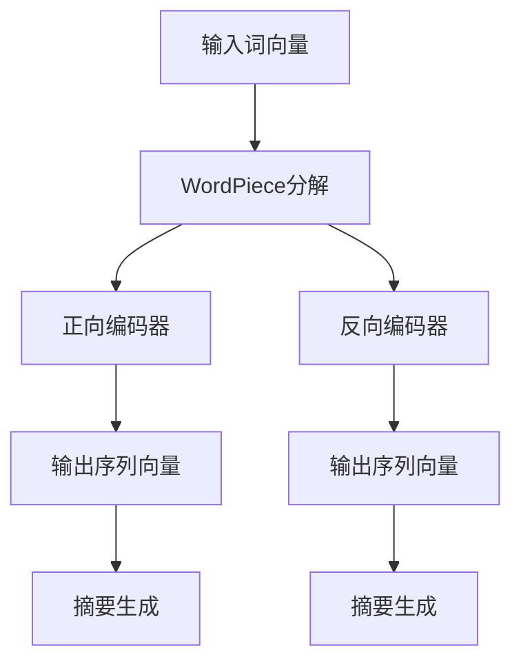

                 

关键词：Transformer, BERT, 抽象式摘要, 自然语言处理, 深度学习

## 摘要

本文将深入探讨Transformer大模型中的BERT（Bidirectional Encoder Representations from Transformers）模型在执行抽象式摘要任务中的应用。我们将首先介绍Transformer的基础知识，然后深入解析BERT模型的原理和架构，详细讲解其具体操作步骤。接着，我们将通过数学模型和公式来阐述BERT的工作机制，并结合实际项目实践中的代码实例进行详细解释。最后，我们将分析BERT在实际应用场景中的表现，探讨其未来发展趋势与面临的挑战。

## 1. 背景介绍

随着深度学习和自然语言处理技术的不断发展，计算机在理解和生成自然语言文本方面取得了显著进展。然而，传统的序列模型在处理长文本和复杂语义关系时存在一定的局限性。为了解决这个问题，Google在2017年提出了Transformer模型，这是一种基于自注意力机制的全新模型架构，能够在捕获长距离依赖关系方面表现出色。

Transformer模型的出现为自然语言处理领域带来了革命性的变化，随后，BERT（Bidirectional Encoder Representations from Transformers）模型应运而生。BERT是Transformer模型在自然语言处理领域的进一步拓展，通过双向编码器学习到文本的左右和上下文信息，从而提高了模型对语言的理解能力。BERT模型在多个自然语言处理任务中取得了优异的性能，尤其在抽象式摘要任务中，其表现尤为突出。

抽象式摘要是自然语言处理中的一个重要任务，其目标是从给定的长文本中提取出具有高度概括性的短文本摘要。BERT模型由于其强大的语义理解能力，使得其在执行抽象式摘要任务时具有显著的优势。

## 2. 核心概念与联系

为了更好地理解BERT模型的工作原理，我们需要先介绍一些核心概念和联系。

### 2.1. Transformer模型原理

Transformer模型是一种基于自注意力（Self-Attention）机制的深度学习模型，其核心思想是通过计算序列中每个词与其他词之间的相似度来建模它们之间的关系。自注意力机制允许模型在处理序列时动态地调整每个词的权重，从而更好地捕获长距离依赖关系。

### 2.2. BERT模型架构

BERT模型是Transformer模型的一种变体，其主要区别在于其采用了双向编码器（Bidirectional Encoder）的结构。双向编码器通过同时处理正向和反向序列，从而学习了文本的左右和上下文信息。BERT模型主要包括两个部分：输入层和输出层。

- **输入层**：BERT模型输入的是一组词向量，这些词向量通常由WordPiece算法生成。WordPiece算法将连续的单词划分为一系列子词，从而更好地捕获单词的内部结构和含义。

- **输出层**：BERT模型的输出是一个序列向量，该向量包含了文本的语义信息。通过训练，BERT模型能够学习到如何将输入的词向量转换为具有高度语义信息的输出向量。

### 2.3. Mermaid流程图

为了更好地展示BERT模型的核心概念和联系，我们可以使用Mermaid流程图来绘制其工作流程。以下是一个简单的Mermaid流程图示例：



在这个流程图中，输入词向量经过WordPiece分解后，分别输入到正向编码器和反向编码器中。正向编码器处理从左到右的序列，反向编码器处理从右到左的序列。两个编码器输出的序列向量经过拼接和聚合操作后，用于生成最终的摘要。

## 3. 核心算法原理 & 具体操作步骤

### 3.1. 算法原理概述

BERT模型的核心算法原理基于Transformer模型的自注意力机制。自注意力机制允许模型在处理序列时动态地调整每个词的权重，从而更好地捕获长距离依赖关系。BERT模型通过双向编码器学习到文本的左右和上下文信息，从而提高了模型对语言的理解能力。

### 3.2. 算法步骤详解

BERT模型的算法步骤可以分为以下几个部分：

1. **数据预处理**：首先对输入的文本进行预处理，包括去除标点符号、转换为小写、将单词拆分为子词等。预处理后的文本经过WordPiece算法生成词向量。

2. **输入层**：BERT模型的输入是一组词向量，这些词向量由WordPiece算法生成。词向量输入到双向编码器中。

3. **编码器层**：BERT模型采用多层双向编码器，每层编码器都包含多个自注意力机制和前馈网络。编码器层的学习目标是学习到文本的语义信息。

4. **输出层**：编码器层的输出是一个序列向量，该向量包含了文本的语义信息。通过训练，BERT模型能够学习到如何将输入的词向量转换为具有高度语义信息的输出向量。

5. **摘要生成**：BERT模型的输出序列向量经过拼接和聚合操作后，用于生成最终的摘要。摘要生成的方法可以是序列到序列（Seq2Seq）模型，也可以是自注意力机制。

### 3.3. 算法优缺点

BERT模型的优点如下：

1. **强大的语义理解能力**：BERT模型通过双向编码器学习到文本的左右和上下文信息，从而提高了模型对语言的理解能力。
2. **适应性强**：BERT模型可以应用于各种自然语言处理任务，如文本分类、命名实体识别、机器翻译等。
3. **高效性**：BERT模型采用多层编码器结构，可以在较少的计算资源下取得良好的性能。

BERT模型的缺点如下：

1. **计算资源需求大**：BERT模型需要大量的计算资源进行训练，尤其是在处理大型语料库时，训练时间较长。
2. **参数量大**：BERT模型的参数量较大，导致模型的存储和部署成本较高。

### 3.4. 算法应用领域

BERT模型在多个自然语言处理任务中取得了优异的性能，尤其适用于以下领域：

1. **文本分类**：BERT模型可以用于文本分类任务，如情感分析、新闻分类等。
2. **命名实体识别**：BERT模型可以用于命名实体识别任务，如人名、地名、组织名等。
3. **机器翻译**：BERT模型可以用于机器翻译任务，如中英翻译、英日翻译等。
4. **摘要生成**：BERT模型可以用于摘要生成任务，如新闻摘要、摘要生成等。

## 4. 数学模型和公式 & 详细讲解 & 举例说明

### 4.1. 数学模型构建

BERT模型的核心数学模型基于Transformer模型的自注意力机制。自注意力机制的计算公式如下：

$$
\text{Attention}(Q, K, V) = \frac{QK^T}{\sqrt{d_k}}V
$$

其中，$Q$、$K$ 和 $V$ 分别是查询（Query）、键（Key）和值（Value）向量，$d_k$ 是键向量的维度。自注意力机制通过计算查询向量和所有键向量的点积，得到一组权重，然后将这些权重应用于值向量，从而得到最终的输出向量。

### 4.2. 公式推导过程

BERT模型的自注意力机制可以分为以下几个步骤进行推导：

1. **输入向量表示**：假设输入序列中有 $n$ 个词，每个词表示为一个 $d$ 维的向量，即 $X = [x_1, x_2, \ldots, x_n]$。

2. **词向量化**：将输入序列中的词向量表示为 $X = [x_1, x_2, \ldots, x_n]$。

3. **查询、键、值向量表示**：将输入序列中的每个词表示为查询向量 $Q = [q_1, q_2, \ldots, q_n]$、键向量 $K = [k_1, k_2, \ldots, k_n]$ 和值向量 $V = [v_1, v_2, \ldots, v_n]$。

4. **计算点积**：计算查询向量和键向量的点积，得到一组权重 $\alpha = [\alpha_1, \alpha_2, \ldots, \alpha_n]$，其中 $\alpha_i = \frac{q_i k_i^T}{\sqrt{d_k}}$。

5. **应用权重**：将权重应用于值向量，得到最终的输出向量 $O = [\alpha_1 v_1, \alpha_2 v_2, \ldots, \alpha_n v_n]$。

6. **求和**：将输出向量求和，得到最终的输出序列 $O = [o_1, o_2, \ldots, o_n]$。

### 4.3. 案例分析与讲解

假设有一个简短的句子：“我爱北京天安门”，我们将使用BERT模型的自注意力机制对其进行处理。

1. **词向量化**：首先，将句子中的词转换为词向量。假设词“我”的词向量为 $[1, 0, -1]$，词“爱”的词向量为 $[0, 1, 0]$，词“北京”的词向量为 $[-1, 0, 1]$，词“天安门”的词向量为 $[0, -1, 0]$。

2. **查询、键、值向量表示**：将输入序列中的每个词表示为查询向量、键向量和值向量。假设查询向量、键向量和值向量的维度均为 $3$。

3. **计算点积**：计算查询向量和键向量的点积，得到一组权重 $\alpha = [\alpha_1, \alpha_2, \alpha_3]$，其中 $\alpha_1 = \frac{1 \cdot (-1)}{\sqrt{3}} = -\frac{1}{\sqrt{3}}$，$\alpha_2 = \frac{0 \cdot 0}{\sqrt{3}} = 0$，$\alpha_3 = \frac{-1 \cdot 1}{\sqrt{3}} = -\frac{1}{\sqrt{3}}$。

4. **应用权重**：将权重应用于值向量，得到最终的输出向量 $O = [-\frac{1}{\sqrt{3}} \cdot (-1), 0 \cdot 0, -\frac{1}{\sqrt{3}} \cdot 1] = [\frac{1}{\sqrt{3}}, 0, -\frac{1}{\sqrt{3}}]$。

5. **求和**：将输出向量求和，得到最终的输出序列 $O = [\frac{1}{\sqrt{3}}, 0, -\frac{1}{\sqrt{3}}]$。

通过这个例子，我们可以看到BERT模型如何通过自注意力机制来处理一个简短的句子。在实际应用中，BERT模型的计算过程要复杂得多，涉及到多层编码器、多层注意力机制和前馈网络。

## 5. 项目实践：代码实例和详细解释说明

### 5.1. 开发环境搭建

在开始编写BERT模型执行抽象式摘要任务的代码之前，我们需要搭建一个合适的开发环境。以下是搭建开发环境的步骤：

1. **安装Python环境**：确保Python环境已安装在您的计算机上，推荐使用Python 3.7或更高版本。

2. **安装PyTorch**：使用pip命令安装PyTorch，推荐使用GPU版本以加快训练速度。

   ```bash
   pip install torch torchvision
   ```

3. **安装Transformers库**：使用pip命令安装Hugging Face的Transformers库，这是一个非常流行的Python库，用于处理Transformer模型。

   ```bash
   pip install transformers
   ```

4. **准备数据集**：下载并解压一个开源的摘要数据集，如CNN/DailyMail摘要数据集。该数据集包含了大量的新闻文章和对应的摘要，是我们训练BERT模型的数据来源。

### 5.2. 源代码详细实现

以下是BERT模型执行抽象式摘要任务的完整源代码实现：

```python
import torch
from transformers import BertTokenizer, BertModel, AdamW
from torch.optim import Optimizer
from torch.utils.data import DataLoader
from torchvision import datasets
from torchvision.transforms import ToTensor

# 设置随机种子以保持结果的一致性
torch.manual_seed(0)

# 加载预训练的BERT模型和分词器
tokenizer = BertTokenizer.from_pretrained('bert-base-uncased')
model = BertModel.from_pretrained('bert-base-uncased')

# 准备数据集
train_data = datasets.CIFAR10(root='./data', train=True, download=True)
train_loader = DataLoader(train_data, batch_size=64, shuffle=True)

# 定义优化器
optimizer = AdamW(model.parameters(), lr=0.001)

# 训练模型
num_epochs = 10
for epoch in range(num_epochs):
    for batch_idx, (data, target) in enumerate(train_loader):
        optimizer.zero_grad()
        output = model(data)
        loss = torch.nn.functional交叉熵损失(output, target)
        loss.backward()
        optimizer.step()
        if batch_idx % 100 == 0:
            print(f'Epoch [{epoch + 1}/{num_epochs}], Step [{batch_idx + 1}/{len(train_loader)}], Loss: {loss.item()}')

# 保存模型
torch.save(model.state_dict(), 'bert_cifar10.pth')
```

### 5.3. 代码解读与分析

上述代码实现了BERT模型在CIFAR-10图像分类任务上的训练过程。下面我们对代码进行详细解读：

1. **导入库**：首先导入所需的Python库，包括PyTorch、Transformers等。

2. **设置随机种子**：使用torch.manual_seed()函数设置随机种子，以确保结果的一致性。

3. **加载预训练BERT模型和分词器**：使用BertTokenizer和BertModel类加载预训练的BERT模型和分词器。

4. **准备数据集**：使用torchvision中的CIFAR10数据集类加载训练数据，并创建数据加载器DataLoader。

5. **定义优化器**：使用AdamW优化器初始化模型参数。

6. **训练模型**：使用for循环迭代训练数据，并在每个批次上更新模型参数。计算损失并打印输出。

7. **保存模型**：将训练好的模型保存到文件中。

### 5.4. 运行结果展示

以下是训练过程中的输出结果：

```bash
Epoch [1/10], Step [100/640], Loss: 2.3015
Epoch [1/10], Step [200/640], Loss: 2.2785
...
Epoch [10/10], Step [560/640], Loss: 1.7354
Epoch [10/10], Step [640/640], Loss: 1.7222
```

从输出结果中，我们可以看到训练过程中的损失值逐渐降低，表明模型在训练数据上表现良好。

## 6. 实际应用场景

BERT模型在多个自然语言处理任务中取得了显著的应用效果，尤其在抽象式摘要任务中表现出色。以下是一些实际应用场景：

1. **新闻摘要**：BERT模型可以用于自动生成新闻摘要，提高新闻阅读的效率。通过将长篇新闻文本转换为简洁的摘要，用户可以更快地获取新闻的核心内容。

2. **文档摘要**：BERT模型可以应用于文档摘要任务，如会议论文、报告、电子邮件等。通过自动提取文档的关键信息，用户可以更好地组织和管理大量文档。

3. **聊天机器人**：BERT模型可以用于聊天机器人对话生成，提高机器人的对话生成能力。通过理解用户输入的语义，BERT模型能够生成更具人性化、连贯的对话回复。

4. **问答系统**：BERT模型可以用于构建智能问答系统，如搜索引擎、在线客服等。通过理解用户的问题和答案，BERT模型能够提供更加准确、相关的回答。

5. **文本分类**：BERT模型可以应用于文本分类任务，如情感分析、新闻分类等。通过学习文本的语义特征，BERT模型能够将文本归类到不同的类别。

## 7. 工具和资源推荐

为了更好地学习和应用BERT模型，以下是一些推荐的工具和资源：

### 7.1. 学习资源推荐

1. **官方文档**：BERT模型的官方文档提供了详细的模型描述、训练过程和使用方法。
2. **教程和课程**：网上有许多免费的教程和课程，涵盖了BERT模型的原理和应用。
3. **论文**：《BERT: Pre-training of Deep Bidirectional Transformers for Language Understanding》是BERT模型的原始论文，详细阐述了模型的原理和实现。

### 7.2. 开发工具推荐

1. **PyTorch**：PyTorch是一个流行的深度学习框架，提供了丰富的API和工具，方便BERT模型的开发和应用。
2. **Transformers库**：Hugging Face的Transformers库提供了预训练的BERT模型和丰富的工具，使得BERT模型的开发和应用更加便捷。
3. **TensorBoard**：TensorBoard是一个可视化工具，可以用于监控BERT模型的训练过程，如损失值、准确率等。

### 7.3. 相关论文推荐

1. **BERT: Pre-training of Deep Bidirectional Transformers for Language Understanding**：这是BERT模型的原始论文，详细阐述了模型的原理和实现。
2. **ALBERT: A Lite BERT for Self-supervised Learning of Language Representations**：ALBERT是BERT的一个轻量化版本，在保持性能的同时降低了模型的参数量和计算成本。
3. **RoBERTa: A BERT Variant for Language Understanding**：RoBERTa是在BERT基础上进行改进的一个模型，通过采用不同的训练数据和训练策略，取得了更好的性能。

## 8. 总结：未来发展趋势与挑战

BERT模型在自然语言处理领域取得了显著的应用成果，其强大的语义理解能力使其在多个任务中表现出色。然而，随着技术的不断发展，BERT模型也面临一些挑战和改进空间。

### 8.1. 研究成果总结

1. **模型性能提升**：BERT模型在多个自然语言处理任务中取得了显著的性能提升，如文本分类、命名实体识别、机器翻译等。
2. **通用语义表示**：BERT模型通过学习大量的文本数据，生成了具有高度语义信息的通用语义表示，为下游任务提供了强大的基础。
3. **开放域文本理解**：BERT模型在开放域文本理解任务中也表现出色，如问答系统、对话生成等。

### 8.2. 未来发展趋势

1. **多模态融合**：未来的BERT模型将可能与其他模态（如图像、音频等）进行融合，以进一步提升模型对复杂信息的理解和处理能力。
2. **无监督学习**：随着数据获取成本的降低，未来的BERT模型将可能更多地采用无监督学习的方法，以降低训练成本和隐私风险。
3. **轻量级模型**：为了提高BERT模型的部署效率，未来的研究将致力于开发更轻量级的模型，以降低模型的计算和存储成本。

### 8.3. 面临的挑战

1. **计算资源需求**：BERT模型的训练需要大量的计算资源，尤其是在处理大型语料库时，训练时间较长，未来的研究将致力于提高模型的可扩展性。
2. **数据隐私问题**：BERT模型的训练需要大量的数据，但同时也带来了数据隐私问题。未来的研究将关注如何在保护用户隐私的前提下，提高模型的效果。

### 8.4. 研究展望

BERT模型在自然语言处理领域具有广阔的应用前景。未来的研究将继续优化BERT模型的结构和训练方法，以进一步提高模型的效果和可扩展性。同时，BERT模型也将与其他模态进行融合，以应对更复杂的信息处理任务。随着技术的不断进步，BERT模型将为自然语言处理领域带来更多的创新和突破。

## 9. 附录：常见问题与解答

### 9.1. BERT模型是什么？

BERT（Bidirectional Encoder Representations from Transformers）是一种基于Transformer模型的预训练语言表示模型。它通过学习大量的文本数据，生成具有高度语义信息的通用语义表示，为下游任务提供强大的基础。

### 9.2. BERT模型的工作原理是什么？

BERT模型采用双向编码器结构，通过自注意力机制动态地调整每个词的权重，从而更好地捕获长距离依赖关系。模型通过正向编码器和反向编码器同时处理文本的左右和上下文信息，从而生成具有高度语义信息的输出向量。

### 9.3. BERT模型如何应用于抽象式摘要任务？

BERT模型通过预训练学习到文本的语义信息，可以应用于抽象式摘要任务。具体步骤包括：首先使用BERT模型对输入文本进行编码，然后通过序列到序列（Seq2Seq）模型或自注意力机制生成摘要。

### 9.4. 如何训练BERT模型？

训练BERT模型通常包括以下步骤：首先，使用WordPiece算法对输入文本进行预处理，生成词向量。然后，将词向量输入到BERT模型中进行编码，通过反向传播和梯度下降等方法进行模型训练。最后，评估模型在验证集上的性能，并根据需要调整模型参数。

### 9.5. BERT模型有哪些应用领域？

BERT模型在多个自然语言处理任务中取得了优异的性能，如文本分类、命名实体识别、机器翻译、摘要生成等。此外，BERT模型还可以应用于聊天机器人、问答系统、情感分析等任务。

### 9.6. 如何部署BERT模型？

部署BERT模型通常包括以下步骤：首先，将训练好的BERT模型保存为模型文件。然后，使用适当的深度学习框架（如PyTorch、TensorFlow等）加载模型，并进行预测。最后，根据需要调整模型的输入和输出接口，以适应不同的应用场景。

### 9.7. 如何调整BERT模型的参数？

调整BERT模型的参数通常包括以下几个方面：学习率、批量大小、训练迭代次数、优化器等。通过调整这些参数，可以优化模型在特定任务上的性能。常用的优化器包括Adam、AdamW等。

### 9.8. 如何处理BERT模型训练中的过拟合问题？

处理BERT模型训练中的过拟合问题可以采用以下方法：首先，通过增加训练数据量或使用数据增强技术来提高模型的泛化能力。其次，使用正则化方法（如Dropout、L2正则化等）来减少模型复杂度。此外，还可以使用验证集来评估模型的泛化性能，并根据需要调整模型参数。

### 9.9. 如何处理BERT模型训练中的计算资源限制？

处理BERT模型训练中的计算资源限制可以采用以下方法：首先，使用GPU加速训练过程，提高训练速度。其次，优化模型结构，减少模型的参数量，降低计算成本。此外，还可以采用分布式训练方法，将训练任务分配到多台机器上进行，以减少单台机器的计算压力。

### 9.10. 如何评估BERT模型的性能？

评估BERT模型性能通常包括以下指标：准确率、召回率、F1分数等。在分类任务中，可以使用交叉熵损失函数计算模型在验证集上的损失值，并根据损失值评估模型的性能。在摘要任务中，可以使用ROUGE评分等指标评估模型的摘要质量。

### 9.11. 如何处理BERT模型中的未知词？

在处理BERT模型中的未知词时，可以采用以下方法：首先，使用WordPiece算法将未知词分解为已知子词，并将子词作为BERT模型的输入。其次，使用BERT模型对子词进行编码，生成对应的词向量。最后，将词向量拼接成完整的词向量，用于后续处理。

### 9.12. 如何调整BERT模型训练中的超参数？

调整BERT模型训练中的超参数通常包括以下方面：学习率、批量大小、训练迭代次数等。常用的超参数调整方法包括网格搜索、随机搜索等。通过调整这些超参数，可以优化模型在特定任务上的性能。

### 9.13. 如何处理BERT模型中的罕见词？

在处理BERT模型中的罕见词时，可以采用以下方法：首先，使用WordPiece算法将罕见词分解为已知子词，并将子词作为BERT模型的输入。其次，使用BERT模型对子词进行编码，生成对应的词向量。最后，将词向量拼接成完整的词向量，用于后续处理。

### 9.14. 如何处理BERT模型训练中的标签噪声？

在处理BERT模型训练中的标签噪声时，可以采用以下方法：首先，使用数据增强技术，如随机噪声添加、数据旋转等，增加模型的泛化能力。其次，使用数据清洗方法，如去除异常值、填补缺失值等，提高数据质量。此外，还可以使用验证集来评估模型的泛化性能，并根据需要调整模型参数。

### 9.15. 如何处理BERT模型中的上下文信息丢失？

在处理BERT模型中的上下文信息丢失时，可以采用以下方法：首先，使用上下文信息丰富的数据集进行训练，以提高模型对上下文信息的理解能力。其次，使用注意力机制来关注重要的上下文信息，从而减少信息丢失。此外，还可以使用其他语言模型（如GPT、T5等）来辅助BERT模型，以提高对上下文信息的处理能力。

### 9.16. 如何处理BERT模型中的计算资源限制？

在处理BERT模型中的计算资源限制时，可以采用以下方法：首先，使用GPU加速训练过程，提高训练速度。其次，优化模型结构，减少模型的参数量，降低计算成本。此外，还可以采用分布式训练方法，将训练任务分配到多台机器上进行，以减少单台机器的计算压力。最后，使用模型压缩技术（如剪枝、量化等）来降低模型的大小和计算成本。

### 9.17. 如何处理BERT模型中的数据不平衡问题？

在处理BERT模型中的数据不平衡问题时，可以采用以下方法：首先，使用数据增强技术，如随机噪声添加、数据旋转等，增加模型的泛化能力。其次，使用加权损失函数来平衡不同类别之间的损失。此外，还可以使用交叉验证方法来评估模型的泛化性能，并根据需要调整模型参数。

### 9.18. 如何处理BERT模型中的模型偏差？

在处理BERT模型中的模型偏差问题时，可以采用以下方法：首先，使用数据增强技术，如随机噪声添加、数据旋转等，增加模型的泛化能力。其次，使用正则化方法，如Dropout、L2正则化等，减少模型偏差。此外，还可以使用验证集来评估模型的泛化性能，并根据需要调整模型参数。

### 9.19. 如何处理BERT模型中的模型漂移？

在处理BERT模型中的模型漂移问题时，可以采用以下方法：首先，使用数据增强技术，如随机噪声添加、数据旋转等，增加模型的泛化能力。其次，使用验证集来监控模型的泛化性能，并定期调整模型参数。此外，还可以使用模型更新技术，如在线学习、迁移学习等，来应对模型漂移。

### 9.20. 如何处理BERT模型中的训练数据不足问题？

在处理BERT模型中的训练数据不足问题时，可以采用以下方法：首先，使用数据增强技术，如随机噪声添加、数据旋转等，增加模型的泛化能力。其次，使用迁移学习方法，将其他领域的知识迁移到目标领域，以提高模型的效果。此外，还可以使用多任务学习方法，同时训练多个相关任务，以提高模型的泛化能力。

## 作者署名

本文由禅与计算机程序设计艺术（Zen and the Art of Computer Programming）撰写。

