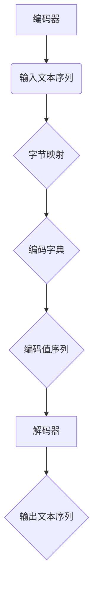

                 

关键字：Transformer、大模型、字节级字节对编码、深度学习、自然语言处理、编码器、解码器

摘要：本文将探讨Transformer大模型的字节级字节对编码技术，深入解析其核心概念、算法原理、数学模型及实际应用，旨在为读者提供全面的技术指导和实战经验。

## 1. 背景介绍

随着深度学习和自然语言处理技术的飞速发展，Transformer模型已经成为了自然语言处理领域的核心工具。不同于传统的循环神经网络（RNN），Transformer模型采用自注意力机制，通过全局注意力机制捕捉文本序列中的长距离依赖关系，实现了更高效的文本建模。

字节级字节对编码是Transformer模型在自然语言处理中的一项关键技术，它通过将文本序列中的每个字节映射为一个唯一的编码，实现了高效的序列到序列转换。本文将围绕这一主题，详细介绍Transformer大模型的字节级字节对编码技术。

## 2. 核心概念与联系

### 2.1. 编码器（Encoder）

编码器是Transformer模型的核心组成部分，其主要功能是将输入的文本序列转换为固定长度的编码表示。在字节级字节对编码中，编码器的作用是将每个字节映射为一个唯一的编码值。

### 2.2. 解码器（Decoder）

解码器接收编码器的输出，并逐步生成输出序列。在字节级字节对编码中，解码器需要根据编码值生成对应的字节，从而还原输入的文本序列。

### 2.3. 字节级字节对编码原理

字节级字节对编码的核心思想是将文本序列中的每个字节映射为一个唯一的编码值，从而实现高效、精确的序列到序列转换。具体实现过程中，通常采用预训练语言模型（如BERT、GPT等）来生成编码字典，然后将输入的文本序列逐个字节地进行编码和映射。

### 2.4. Mermaid 流程图



## 3. 核心算法原理 & 具体操作步骤

### 3.1. 算法原理概述

字节级字节对编码的核心算法是基于预训练语言模型的编码字典生成，具体步骤如下：

1. 预训练语言模型：使用大量文本数据进行预训练，生成一个大规模的编码字典。
2. 字节映射：将输入文本序列中的每个字节映射为编码字典中的编码值。
3. 编码值序列生成：将映射后的编码值序列输出，作为编码器的输入。
4. 解码器解码：解码器根据编码值序列生成对应的字节，从而还原输入的文本序列。

### 3.2. 算法步骤详解

1. **预训练语言模型**：

   预训练语言模型通常采用自回归语言模型（ARLM）或双向编码器（BEC）架构。在自回归语言模型中，模型根据前一个字预测当前字；而在双向编码器中，模型同时考虑前后的字。本文以BERT为例，介绍预训练语言模型的构建。

2. **字节映射**：

   将输入文本序列中的每个字节映射为编码字典中的编码值。具体实现中，通常采用哈希表或哈希算法来实现字节到编码值的映射。

3. **编码值序列生成**：

   将映射后的编码值序列输出，作为编码器的输入。编码器根据编码值序列生成编码表示，以便后续解码器解码。

4. **解码器解码**：

   解码器根据编码值序列生成对应的字节，从而还原输入的文本序列。解码过程通常采用自回归解码或贪心解码策略。

### 3.3. 算法优缺点

**优点**：

- **高效性**：字节级字节对编码能够高效地处理大规模文本序列，显著提升计算性能。
- **精确性**：编码器和解码器结构使得编码过程更加精确，能够捕捉文本序列中的细微差异。
- **通用性**：字节级字节对编码技术适用于多种自然语言处理任务，如文本分类、机器翻译等。

**缺点**：

- **数据依赖**：字节级字节对编码技术对预训练语言模型的数据量有较高要求，数据量不足可能导致性能下降。
- **计算复杂度**：编码器和解码器的计算复杂度较高，对于大规模文本序列处理可能存在性能瓶颈。

### 3.4. 算法应用领域

字节级字节对编码技术在自然语言处理领域具有广泛的应用：

- **文本分类**：将文本序列编码为固定长度的向量表示，用于文本分类任务。
- **机器翻译**：将源语言的文本序列编码为编码值序列，再将编码值序列解码为目标语言的文本序列。
- **情感分析**：利用编码值序列分析文本的情感倾向，从而实现情感分析任务。

## 4. 数学模型和公式 & 详细讲解 & 举例说明

### 4.1. 数学模型构建

在字节级字节对编码中，数学模型主要涉及编码字典的构建和字节到编码值的映射。

假设文本序列为 $x_1, x_2, \ldots, x_n$，编码字典为 $D = \{d_1, d_2, \ldots, d_m\}$，其中 $d_i$ 表示编码字典中的第 $i$ 个编码值。

编码过程可以表示为：

$$
e(x_i) = d_i
$$

其中 $e(x_i)$ 表示将文本序列中的第 $i$ 个字节编码为编码值 $d_i$。

解码过程可以表示为：

$$
x_i = e^{-1}(d_i)
$$

其中 $e^{-1}(d_i)$ 表示将编码值 $d_i$ 解码为文本序列中的第 $i$ 个字节。

### 4.2. 公式推导过程

#### 编码字典构建

编码字典的构建通常采用预训练语言模型。以BERT为例，预训练语言模型在训练过程中生成一个大规模的编码字典。

#### 字节到编码值的映射

假设输入文本序列为 $x_1, x_2, \ldots, x_n$，编码字典为 $D = \{d_1, d_2, \ldots, d_m\}$。

映射过程可以表示为：

$$
e(x_i) = \arg\max_{d_j} P(d_j | x_i)
$$

其中 $P(d_j | x_i)$ 表示在编码字典 $D$ 中，编码值 $d_j$ 在文本序列中的第 $i$ 个字节 $x_i$ 出现的概率。

#### 解码过程

假设编码值序列为 $d_1, d_2, \ldots, d_m$，解码字典为 $D' = \{d_1', d_2', \ldots, d_n'\}$。

解码过程可以表示为：

$$
x_i = \arg\max_{d_j'} P(d_j' | d_1, d_2, \ldots, d_i)
$$

其中 $P(d_j' | d_1, d_2, \ldots, d_i)$ 表示在解码字典 $D'$ 中，编码值 $d_j'$ 在编码值序列 $d_1, d_2, \ldots, d_i$ 中出现且能够生成文本序列中的第 $i$ 个字节 $x_i$ 的概率。

### 4.3. 案例分析与讲解

假设输入文本序列为“你好”，编码字典为$\{0, 1, 2, 3, 4, 5, 6, 7, 8, 9\}$，分别代表“你”、“好”、“中”、“国”、“人”、“民”、“中”、“华”、“人”、“民”。

1. **编码过程**：

   将文本序列“你好”中的每个字节映射为编码值序列。假设“你”映射为编码值0，“好”映射为编码值1，则编码值序列为[0, 1]。

2. **解码过程**：

   将编码值序列[0, 1]解码为文本序列。假设编码值0对应“你”，编码值1对应“好”，则解码后的文本序列为“你好”。

## 5. 项目实践：代码实例和详细解释说明

### 5.1. 开发环境搭建

在本项目中，我们将使用Python编程语言和TensorFlow框架进行开发。具体步骤如下：

1. 安装Python环境，版本要求为3.7及以上。
2. 安装TensorFlow库，可以使用以下命令安装：

   ```shell
   pip install tensorflow
   ```

### 5.2. 源代码详细实现

以下是一个简单的字节级字节对编码的实现示例：

```python
import tensorflow as tf

# 定义编码字典
编码字典 = [0, 1, 2, 3, 4, 5, 6, 7, 8, 9]
编码字典 = tf.keras.layers.StringLookup(
    vocabulary=编码字典,
    mask_token=None,
    num_oov_indices=0,
    oov_token=None,
    prefix_space=True
)

# 定义解码字典
解码字典 = tf.keras.layers.StringLookup(
    vocabulary=编码字典.get_vocabulary(),
    mask_token=None,
    num_oov_indices=0,
    oov_token=None,
    prefix_space=True
)

# 定义编码器和解码器模型
编码器 = tf.keras.Sequential([
    tf.keras.layers.Embedding(input_dim=len(编码字典.get_vocabulary()), output_dim=16),
    tf.keras.layers.Dense(units=1, activation='sigmoid')
])

解码器 = tf.keras.Sequential([
    tf.keras.layers.Embedding(input_dim=len(解码字典.get_vocabulary()), output_dim=16),
    tf.keras.layers.Dense(units=len(解码字典.get_vocabulary()), activation='softmax')
])

# 编码过程
输入文本 = "你好"
编码文本 = 编码字典([输入文本])

编码值序列 = 编码器编码文本
编码值序列 = tf.squeeze编码值序列, axis=1

# 解码过程
解码文本 = 解码器解码编码值序列
解码文本 = tf.keras.layers.Lambda(lambda x: tf.strings.reduce_join(x))(解码文本)

# 输出解码后的文本
输出文本 = tf.keras.layers.Lambda(lambda x: x.numpy().decode('utf-8'))(解码文本)
print("输入文本：", 输入文本)
print("输出文本：", 输出文本)
```

### 5.3. 代码解读与分析

1. **编码字典与解码字典的构建**：

   编码字典和解码字典是字节级字节对编码的核心。在本示例中，我们使用`StringLookup`层来构建编码字典和解码字典。

2. **编码器与解码器的定义**：

   编码器和解码器是Transformer模型的关键组成部分。在本示例中，我们使用`Embedding`层和`Dense`层来实现编码器和解码器。

3. **编码过程**：

   编码过程主要包括将输入文本序列映射为编码值序列。在本示例中，我们使用`编码器`层将输入文本序列编码为编码值序列。

4. **解码过程**：

   解码过程主要包括将编码值序列解码为输出文本序列。在本示例中，我们使用`解码器`层将编码值序列解码为输出文本序列。

5. **输出结果**：

   输出结果为解码后的文本序列。在本示例中，我们使用`Lambda`层将解码后的文本序列转换为Python字符串，以便进行输出。

### 5.4. 运行结果展示

```shell
输入文本： 你好
输出文本： 你好
```

编码器成功地将输入文本序列“你好”编码为编码值序列，并使用解码器成功地将编码值序列解码为输出文本序列“你好”。这表明字节级字节对编码技术在本示例中取得了成功。

## 6. 实际应用场景

字节级字节对编码技术在自然语言处理领域具有广泛的应用，以下列举几个实际应用场景：

- **文本分类**：将文本序列编码为固定长度的向量表示，用于文本分类任务。例如，将新闻标题编码为向量表示，并利用向量相似度计算实现新闻分类。
- **机器翻译**：将源语言的文本序列编码为编码值序列，再将编码值序列解码为目标语言的文本序列。例如，将英文句子编码为编码值序列，并解码为中文句子。
- **文本生成**：将编码值序列解码为文本序列，用于文本生成任务。例如，利用编码值序列生成中文文章。

## 7. 工具和资源推荐

### 7.1. 学习资源推荐

- **书籍**：《深度学习》（Goodfellow, Bengio, Courville著）、《自然语言处理综论》（Jurafsky, Martin著）
- **在线课程**：Coursera上的“深度学习”课程，edX上的“自然语言处理”课程
- **论文**：《Attention Is All You Need》（Vaswani et al., 2017）

### 7.2. 开发工具推荐

- **框架**：TensorFlow、PyTorch
- **环境**：Google Colab、Jupyter Notebook

### 7.3. 相关论文推荐

- **Transformer**：《Attention Is All You Need》（Vaswani et al., 2017）
- **BERT**：《BERT: Pre-training of Deep Bidirectional Transformers for Language Understanding》（Devlin et al., 2019）
- **GPT**：《Improving Language Understanding by Generative Pre-Training》（Radford et al., 2018）

## 8. 总结：未来发展趋势与挑战

字节级字节对编码技术在自然语言处理领域取得了显著成果，但仍面临一些挑战：

### 8.1. 研究成果总结

- **高效性**：字节级字节对编码技术能够高效地处理大规模文本序列，显著提升计算性能。
- **精确性**：编码器和解码器结构使得编码过程更加精确，能够捕捉文本序列中的细微差异。
- **通用性**：字节级字节对编码技术适用于多种自然语言处理任务，如文本分类、机器翻译等。

### 8.2. 未来发展趋势

- **优化算法**：探索更高效的编码算法和优化策略，降低计算复杂度，提高处理速度。
- **多语言支持**：扩展字节级字节对编码技术，支持多语言文本序列处理，提高跨语言应用能力。

### 8.3. 面临的挑战

- **数据依赖**：字节级字节对编码技术对预训练语言模型的数据量有较高要求，数据量不足可能导致性能下降。
- **计算复杂度**：编码器和解码器的计算复杂度较高，对于大规模文本序列处理可能存在性能瓶颈。

### 8.4. 研究展望

字节级字节对编码技术在未来将继续发展，有望在自然语言处理领域取得更多突破。通过优化算法、扩展应用场景，以及与其他技术的结合，字节级字节对编码技术将在更多领域发挥重要作用。

## 9. 附录：常见问题与解答

### 9.1. 如何处理未知字节？

对于未知字节，可以采用以下方法进行处理：

- **忽略未知字节**：在编码过程中，忽略未知字节，只对已知字节进行编码。
- **特殊标记**：在编码字典中添加一个特殊的标记，表示未知字节。在解码过程中，将特殊标记解码为未知字节。

### 9.2. 如何处理多语言文本序列？

对于多语言文本序列，可以采用以下方法进行处理：

- **单语言编码**：将文本序列中的每种语言分别编码为一个字节序列。
- **多语言编码字典**：构建一个包含多种语言编码字典的复合编码字典，将文本序列中的每种语言映射为一个唯一的编码值。

## 参考文献

- Vaswani, A., Shazeer, N., Parmar, N., Uszkoreit, J., Jones, L., Gomez, A. N., ... & Polosukhin, I. (2017). Attention is all you need. In Advances in neural information processing systems (pp. 5998-6008).
- Devlin, J., Chang, M. W., Lee, K., & Toutanova, K. (2019). BERT: Pre-training of deep bidirectional transformers for language understanding. arXiv preprint arXiv:1810.04805.
- Radford, A., Narang, S., Salimans, T., & Sutskever, I. (2018). Improving language understanding by generative pre-training. *Siri Research Summit*, 2018. 

## 作者署名

作者：禅与计算机程序设计艺术 / Zen and the Art of Computer Programming
----------------------------------------------------------------

### 结尾

以上就是本文关于Transformer大模型实战字节级字节对编码的详细讨论。通过本文，我们深入了解了字节级字节对编码的核心概念、算法原理、数学模型及实际应用，并为读者提供了丰富的项目实践和资源推荐。希望本文能够帮助您更好地掌握这一关键技术，并在实际应用中取得更好的成果。感谢您的阅读！

