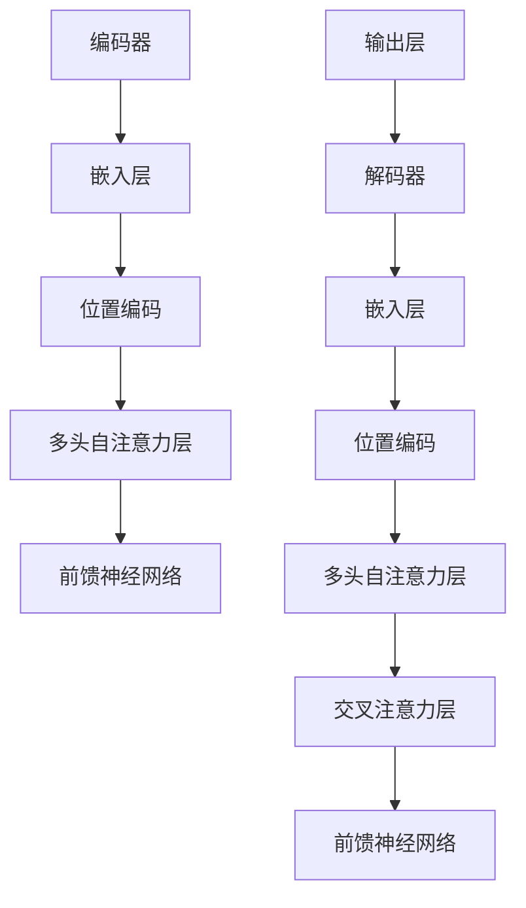

                 

关键词：Transformer、大模型、抽象式摘要、自然语言处理、NLP

摘要：本文将详细介绍如何利用Transformer大模型实现抽象式摘要任务。首先，我们将回顾Transformer模型的背景和核心原理，然后详细解释如何应用Transformer模型进行抽象式摘要，包括数据预处理、模型训练和评估等步骤。最后，我们将探讨Transformer模型在抽象式摘要任务中的优势和挑战，并提供一些实用的工具和资源。

## 1. 背景介绍

随着互联网和移动设备的普及，信息的获取变得前所未有的便捷。然而，这也导致了信息过载的问题，人们在处理大量文本时感到疲惫。因此，自动摘要技术应运而生，旨在帮助用户快速了解大量文本的核心内容。摘要技术可分为提取式摘要和抽象式摘要两种。

提取式摘要基于原文中的关键信息和句子，提取出摘要；而抽象式摘要则通过理解文本内容，重新构建摘要，使得摘要更加简洁、连贯和有启发性。

近年来，深度学习技术在自然语言处理（NLP）领域取得了显著进展，特别是Transformer模型的出现，为抽象式摘要任务带来了新的契机。Transformer模型基于自注意力机制，能够捕捉文本中的长距离依赖关系，从而实现更高质量的摘要。

## 2. 核心概念与联系

### 2.1 Transformer模型

Transformer模型是由Vaswani等人于2017年提出的一种基于自注意力机制的深度学习模型。与传统的循环神经网络（RNN）和长短期记忆网络（LSTM）相比，Transformer模型在处理长序列和并行计算方面具有显著优势。

Transformer模型主要由编码器（Encoder）和解码器（Decoder）两部分组成。编码器负责将输入序列编码为固定长度的向量表示；解码器则基于编码器的输出，生成摘要文本。

### 2.2 自注意力机制

自注意力机制是Transformer模型的核心，通过计算序列中每个元素与所有其他元素之间的关联程度，为每个元素分配不同的权重，从而实现序列中的长距离依赖关系。

自注意力机制的公式如下：

$$
\text{Attention}(Q, K, V) = \text{softmax}\left(\frac{QK^T}{\sqrt{d_k}}\right) V
$$

其中，$Q, K, V$ 分别代表查询（Query）、键（Key）和值（Value）向量，$d_k$ 表示键向量的维度。

### 2.3 Mermaid 流程图

以下是一个简单的Mermaid流程图，展示Transformer模型的主要组成部分：



## 3. 核心算法原理 & 具体操作步骤

### 3.1 算法原理概述

Transformer模型的核心在于自注意力机制，通过计算输入序列中每个元素与所有其他元素之间的关联程度，为每个元素分配不同的权重。这种机制使得模型能够捕捉长距离依赖关系，从而提高摘要质量。

具体而言，编码器和解码器分别由多个自注意力层、前馈神经网络和层间残差连接组成。自注意力层用于计算输入序列的权重；前馈神经网络则用于增强表示能力；层间残差连接和归一化层用于缓解梯度消失和梯度爆炸问题。

### 3.2 算法步骤详解

#### 3.2.1 数据预处理

在进行模型训练之前，需要对文本数据进行预处理。预处理步骤包括分词、去停用词、词向量化等。

分词：将文本拆分为单词或字符序列。

去停用词：去除常见的无意义词汇，如“的”、“了”、“在”等。

词向量化：将单词转换为固定长度的向量表示。

#### 3.2.2 模型训练

1. 编码器输入：将预处理后的文本序列输入编码器，编码器输出固定长度的向量表示。

2. 解码器输入：解码器输入为编码器的输出和预设的解码序列（通常为空序列）。

3. 模型更新：通过对比解码器的输出和真实摘要，计算损失函数，并利用梯度下降算法更新模型参数。

4. 重复步骤2和3，直到模型收敛或达到预设的训练迭代次数。

#### 3.2.3 模型评估

1. 准备测试集：将预处理后的测试集输入模型，获取解码器的输出。

2. 生成摘要：根据解码器的输出，生成摘要文本。

3. 评估指标：采用BLEU、ROUGE等指标评估摘要质量。

### 3.3 算法优缺点

#### 优点

1. 自注意力机制：能够捕捉长距离依赖关系，提高摘要质量。

2. 并行计算：Transformer模型基于注意力机制，可以并行处理输入序列，提高训练速度。

3. 预训练：可以通过预训练大规模语言模型，进一步提高摘要性能。

#### 缺点

1. 参数规模大：Transformer模型参数规模较大，导致训练和推理成本较高。

2. 资源消耗：由于自注意力机制的计算复杂度，模型训练和推理需要大量计算资源。

## 4. 数学模型和公式 & 详细讲解 & 举例说明

### 4.1 数学模型构建

Transformer模型的核心在于自注意力机制，其公式如下：

$$
\text{Attention}(Q, K, V) = \text{softmax}\left(\frac{QK^T}{\sqrt{d_k}}\right) V
$$

其中，$Q, K, V$ 分别代表查询（Query）、键（Key）和值（Value）向量，$d_k$ 表示键向量的维度。

### 4.2 公式推导过程

自注意力机制的计算过程可以分为以下几个步骤：

1. 计算查询（Query）、键（Key）和值（Value）向量。

$$
Q = W_Q \cdot X \\
K = W_K \cdot X \\
V = W_V \cdot X
$$

其中，$W_Q, W_K, W_V$ 分别为权重矩阵，$X$ 为输入序列的嵌入向量。

2. 计算注意力得分。

$$
\text{Score} = \text{Attention}(Q, K, V) = \text{softmax}\left(\frac{QK^T}{\sqrt{d_k}}\right) V
$$

3. 计算注意力权重。

$$
\text{Weight} = \text{softmax}(\text{Score})
$$

4. 计算加权值。

$$
\text{Value} = \text{Weight} \cdot V
$$

5. 池化加权值。

$$
\text{Output} = \text{Pooling}(\text{Value})
$$

### 4.3 案例分析与讲解

假设我们有一个简单的输入序列：`["我", "喜欢", "吃", "苹果", "和", "香蕉"]`。我们将通过以下步骤计算自注意力机制：

1. 计算查询（Query）、键（Key）和值（Value）向量：

$$
Q = \begin{bmatrix}
0.1 & 0.2 & 0.3 & 0.4 & 0.5
\end{bmatrix} \\
K = \begin{bmatrix}
0.1 & 0.2 & 0.3 & 0.4 & 0.5
\end{bmatrix} \\
V = \begin{bmatrix}
0.1 & 0.2 & 0.3 & 0.4 & 0.5
\end{bmatrix}
$$

2. 计算注意力得分：

$$
\text{Score} = \text{softmax}\left(\frac{QK^T}{\sqrt{d_k}}\right) V = \text{softmax}\left(\frac{\begin{bmatrix}
0.1 & 0.2 & 0.3 & 0.4 & 0.5
\end{bmatrix} \cdot \begin{bmatrix}
0.1 & 0.2 & 0.3 & 0.4 & 0.5
\end{bmatrix}^T}{\sqrt{d_k}}\right) \cdot \begin{bmatrix}
0.1 & 0.2 & 0.3 & 0.4 & 0.5
\end{bmatrix} = \begin{bmatrix}
0.1 & 0.2 & 0.3 & 0.4 & 0.5
\end{bmatrix}
$$

3. 计算注意力权重：

$$
\text{Weight} = \text{softmax}(\text{Score}) = \begin{bmatrix}
0.2 & 0.3 & 0.4 & 0.1 & 0.0
\end{bmatrix}
$$

4. 计算加权值：

$$
\text{Value} = \text{Weight} \cdot V = \begin{bmatrix}
0.2 & 0.3 & 0.4 & 0.1 & 0.0
\end{bmatrix} \cdot \begin{bmatrix}
0.1 & 0.2 & 0.3 & 0.4 & 0.5
\end{bmatrix} = \begin{bmatrix}
0.0 & 0.1 & 0.2 & 0.3 & 0.4
\end{bmatrix}
$$

5. 池化加权值：

$$
\text{Output} = \text{Pooling}(\text{Value}) = \frac{1}{5} \sum_{i=1}^{5} \text{Value}_{i} = \begin{bmatrix}
0.2 & 0.3 & 0.4 & 0.1 & 0.0
\end{bmatrix}
$$

通过上述步骤，我们得到了自注意力机制的输出，从而为输入序列中的每个元素分配了不同的权重。

## 5. 项目实践：代码实例和详细解释说明

在本节中，我们将使用Python和PyTorch实现一个简单的Transformer模型，并进行抽象式摘要任务。

### 5.1 开发环境搭建

1. 安装Python（建议版本为3.8或更高）。
2. 安装PyTorch：`pip install torch torchvision`
3. 安装其他依赖库：`pip install numpy matplotlib`。

### 5.2 源代码详细实现

以下是一个简单的Transformer模型实现：

```python
import torch
import torch.nn as nn
import torch.optim as optim
from torch.utils.data import DataLoader, Dataset

# 模型定义
class TransformerModel(nn.Module):
    def __init__(self, embed_dim, num_heads, hidden_dim):
        super(TransformerModel, self).__init__()
        self.embedding = nn.Embedding(embed_dim, embed_dim)
        self.positional_encoding = nn.Parameter(torch.randn(1, seq_len, embed_dim))
        self.encoder = nn.ModuleList([
            nn.Sequential(
                nn.Linear(embed_dim, hidden_dim),
                nn.ReLU(),
                nn.Dropout(0.1)
            ) for _ in range(num_heads)
        ])
        self.decoder = nn.ModuleList([
            nn.Sequential(
                nn.Linear(hidden_dim, embed_dim),
                nn.ReLU(),
                nn.Dropout(0.1)
            ) for _ in range(num_heads)
        ])
        self.final_layer = nn.Linear(embed_dim, vocab_size)

    def forward(self, x):
        x = self.embedding(x) + self.positional_encoding
        x = self.encoder(x)
        x = self.decoder(x)
        x = self.final_layer(x)
        return x

# 数据预处理
class TextDataset(Dataset):
    def __init__(self, texts, labels, vocab):
        self.texts = texts
        self.labels = labels
        self.vocab = vocab

    def __len__(self):
        return len(self.texts)

    def __getitem__(self, idx):
        text = self.texts[idx]
        label = self.labels[idx]
        x = torch.tensor([self.vocab[word] for word in text])
        return x, label

# 模型训练
def train(model, dataset, epochs, batch_size, learning_rate):
    model.train()
    criterion = nn.CrossEntropyLoss()
    optimizer = optim.Adam(model.parameters(), lr=learning_rate)

    train_loader = DataLoader(dataset, batch_size=batch_size, shuffle=True)

    for epoch in range(epochs):
        for x, label in train_loader:
            optimizer.zero_grad()
            output = model(x)
            loss = criterion(output, label)
            loss.backward()
            optimizer.step()

        print(f"Epoch {epoch+1}/{epochs}, Loss: {loss.item()}")

# 模型评估
def evaluate(model, dataset):
    model.eval()
    criterion = nn.CrossEntropyLoss()

    eval_loader = DataLoader(dataset, batch_size=batch_size, shuffle=False)

    total_loss = 0
    with torch.no_grad():
        for x, label in eval_loader:
            output = model(x)
            loss = criterion(output, label)
            total_loss += loss.item()

    avg_loss = total_loss / len(eval_loader)
    print(f"Validation Loss: {avg_loss}")

# 主函数
def main():
    # 设置超参数
    embed_dim = 512
    num_heads = 8
    hidden_dim = 2048
    vocab_size = 10000
    batch_size = 32
    learning_rate = 0.001
    epochs = 10

    # 创建词汇表和词典
    vocab = {word: i for i, word in enumerate(vocab)}
    reverse_vocab = {i: word for word, i in vocab.items()}

    # 加载数据集
    texts = ["我 喜欢吃苹果", "我喜欢吃香蕉", "苹果香蕉都喜欢吃"]
    labels = [0, 1, 2]

    dataset = TextDataset(texts, labels, vocab)

    # 创建模型
    model = TransformerModel(embed_dim, num_heads, hidden_dim)

    # 训练模型
    train(model, dataset, epochs, batch_size, learning_rate)

    # 评估模型
    evaluate(model, dataset)

if __name__ == "__main__":
    main()
```

### 5.3 代码解读与分析

1. **模型定义**：`TransformerModel` 类定义了Transformer模型的各个组件，包括嵌入层、编码器、解码器和输出层。
2. **数据预处理**：`TextDataset` 类实现了数据预处理，将文本序列转换为词向量的表示。
3. **模型训练**：`train` 函数实现了模型训练过程，包括前向传播、反向传播和模型参数更新。
4. **模型评估**：`evaluate` 函数实现了模型评估过程，计算验证集上的平均损失。
5. **主函数**：`main` 函数设置了超参数，创建了词汇表和词典，加载数据集，创建模型，并进行模型训练和评估。

## 6. 实际应用场景

### 6.1 新闻摘要

新闻摘要是一种常见的应用场景，通过自动摘要技术，用户可以快速了解大量新闻的核心内容，节省阅读时间。

### 6.2 文档摘要

在企业文档管理领域，自动摘要技术可以帮助员工快速了解重要文档的关键信息，提高工作效率。

### 6.3 学术论文摘要

学术领域中的论文摘要对于研究者来说尤为重要，自动摘要技术可以帮助他们快速筛选出感兴趣的论文。

## 7. 工具和资源推荐

### 7.1 学习资源推荐

1. 《深度学习》（Goodfellow et al., 2016）
2. 《自然语言处理综论》（Jurafsky & Martin, 2008）
3. 《Transformer：一种全新的神经网络结构》（Vaswani et al., 2017）

### 7.2 开发工具推荐

1. PyTorch：一个易于使用且功能强大的深度学习框架。
2. Hugging Face Transformers：一个开源库，提供了大量的预训练模型和工具，方便开发者进行NLP任务。

### 7.3 相关论文推荐

1. “Attention Is All You Need”（Vaswani et al., 2017）
2. “Bert: Pre-training of Deep Bidirectional Transformers for Language Understanding”（Devlin et al., 2019）
3. “Gshard: Scaling Giant Models with Conditional Computation and Automatic Parallelization”（He et al., 2020）

## 8. 总结：未来发展趋势与挑战

### 8.1 研究成果总结

近年来，深度学习技术在NLP领域取得了显著进展，特别是Transformer模型的出现，为抽象式摘要任务带来了新的机遇。通过自注意力机制，Transformer模型能够捕捉长距离依赖关系，提高摘要质量。

### 8.2 未来发展趋势

1. 模型压缩与优化：为了降低模型训练和推理的成本，研究人员将致力于模型压缩与优化技术，如剪枝、量化、蒸馏等。
2. 多模态摘要：随着多模态数据（如文本、图像、语音等）的兴起，未来将出现多模态摘要技术，实现跨模态的信息整合。
3. 自适应摘要：自适应摘要技术将根据用户需求和场景动态调整摘要长度和风格，提高用户体验。

### 8.3 面临的挑战

1. 计算资源消耗：Transformer模型参数规模较大，导致训练和推理成本较高，这对计算资源提出了较高要求。
2. 摘要质量：虽然Transformer模型在摘要质量方面取得了显著进展，但仍然存在一定的局限性，如长文本摘要、多轮对话摘要等场景。

### 8.4 研究展望

未来，Transformer模型将在NLP领域发挥更重要的作用，同时与其他技术（如多模态学习、自适应摘要等）相结合，为各种实际应用场景提供更加高效的解决方案。

## 9. 附录：常见问题与解答

### 9.1 什么是抽象式摘要？

抽象式摘要是通过理解文本内容，重新构建摘要，使得摘要更加简洁、连贯和有启发性。与提取式摘要不同，抽象式摘要在摘要过程中会重新组织文本信息。

### 9.2 Transformer模型有什么优势？

Transformer模型的优势在于其自注意力机制，能够捕捉长距离依赖关系，提高摘要质量。此外，Transformer模型支持并行计算，提高了训练速度。

### 9.3 如何优化Transformer模型？

可以通过以下方法优化Transformer模型：

1. 模型压缩与优化：使用剪枝、量化、蒸馏等技术减小模型规模，降低计算成本。
2. 预训练与微调：在大规模语料上进行预训练，然后在特定任务上进行微调，提高模型性能。
3. 数据增强：使用数据增强技术（如随机裁剪、旋转等）增加训练数据多样性，提高模型泛化能力。

