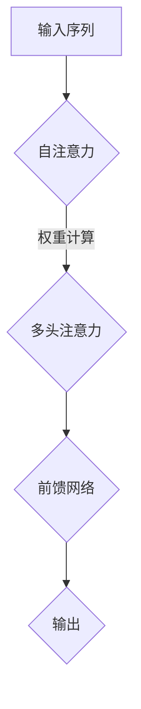

                 

关键词：Transformer, 大模型, 实战, 最终损失函数

摘要：本文将深入探讨Transformer大模型在实战中的应用，重点关注最终损失函数的设计与优化，以及如何在实际项目中提高模型的性能和稳定性。

## 1. 背景介绍

近年来，深度学习在自然语言处理（NLP）领域取得了巨大的成功。特别是Transformer模型的出现，使得机器翻译、文本生成等任务的表现大幅提升。Transformer模型的核心在于其自注意力机制（Self-Attention），能够捕捉文本中的长距离依赖关系，从而提高模型的建模能力。

然而，在实际应用中，如何设计合适的最终损失函数，以优化模型的训练过程和提升模型的性能，仍然是一个重要且具有挑战性的问题。本文将围绕这一核心问题，介绍Transformer大模型的实战经验，并探讨如何优化最终损失函数，以实现更好的模型性能。

## 2. 核心概念与联系

### 2.1 Transformer模型概述

Transformer模型是一种基于自注意力机制的深度学习模型，最初由Vaswani等人于2017年提出。与传统循环神经网络（RNN）相比，Transformer模型采用了一种全新的架构，使得其在处理长文本序列时能够保持高效的计算性能。

### 2.2 自注意力机制

自注意力机制是Transformer模型的核心。它通过计算序列中每个元素与其他元素之间的关联性，对输入序列进行加权处理，从而实现对长距离依赖关系的建模。

### 2.3 Mermaid流程图



## 3. 核心算法原理 & 具体操作步骤

### 3.1 算法原理概述

Transformer模型主要包含以下几个关键组件：

1. **自注意力（Self-Attention）**：通过计算输入序列中每个元素与其他元素之间的关联性，对输入序列进行加权处理。
2. **多头注意力（Multi-Head Attention）**：将自注意力机制扩展到多个维度，以进一步提高模型的建模能力。
3. **前馈网络（Feedforward Network）**：在自注意力和多头注意力之后，对序列进行前馈处理，以增强模型的非线性表达能力。

### 3.2 算法步骤详解

1. **输入序列编码**：将输入序列编码为向量，并添加位置信息。
2. **自注意力计算**：计算输入序列中每个元素与其他元素之间的关联性，并进行加权处理。
3. **多头注意力计算**：将自注意力机制扩展到多个维度，以进一步提高模型的建模能力。
4. **前馈网络处理**：对序列进行前馈处理，以增强模型的非线性表达能力。
5. **输出生成**：根据处理后的序列生成预测结果。

### 3.3 算法优缺点

**优点**：

- **高效处理长文本**：自注意力机制使得模型能够捕捉长距离依赖关系，从而提高模型的建模能力。
- **并行计算**：Transformer模型采用自注意力机制，可以实现并行计算，提高模型的计算效率。

**缺点**：

- **参数规模大**：由于自注意力机制的引入，Transformer模型的参数规模较大，导致训练时间较长。
- **计算复杂度高**：自注意力机制的引入使得模型的计算复杂度较高，对计算资源要求较高。

### 3.4 算法应用领域

Transformer模型在自然语言处理领域取得了显著的成果，广泛应用于以下任务：

- **机器翻译**：Transformer模型在机器翻译任务中表现优异，能够实现高效、准确的多语言翻译。
- **文本生成**：Transformer模型能够生成连贯、自然的文本，广泛应用于文本生成任务。
- **问答系统**：Transformer模型在问答系统任务中表现出色，能够准确回答用户提出的问题。

## 4. 数学模型和公式 & 详细讲解 & 举例说明

### 4.1 数学模型构建

Transformer模型主要包含以下几个关键组件：

1. **自注意力（Self-Attention）**：
   $$\text{Attention}(Q, K, V) = \text{softmax}\left(\frac{QK^T}{\sqrt{d_k}}\right)V$$
   其中，$Q$、$K$、$V$ 分别表示查询向量、键向量和值向量，$d_k$ 表示键向量的维度。

2. **多头注意力（Multi-Head Attention）**：
   $$\text{Multi-Head Attention} = \text{Concat}(\text{head}_1, \text{head}_2, \ldots, \text{head}_h)W^O$$
   其中，$h$ 表示头数，$W^O$ 表示输出权重。

3. **前馈网络（Feedforward Network）**：
   $$\text{FFN}(X) = \text{ReLU}(XW_1 + b_1)W_2 + b_2$$
   其中，$X$ 表示输入向量，$W_1$、$W_2$ 分别表示权重，$b_1$、$b_2$ 分别表示偏置。

### 4.2 公式推导过程

这里简要介绍自注意力机制和多头注意力机制的公式推导过程。

1. **自注意力（Self-Attention）**：

   自注意力机制的计算过程可以分为以下几个步骤：

   - **输入序列编码**：将输入序列编码为向量。
   - **查询（Query）、键（Key）、值（Value）计算**：分别计算查询向量、键向量和值向量。
   - **注意力分数计算**：计算查询向量与键向量之间的相似性，得到注意力分数。
   - **softmax计算**：对注意力分数进行softmax处理，得到权重分布。
   - **加权求和**：将值向量与权重分布进行加权求和，得到输出向量。

2. **多头注意力（Multi-Head Attention）**：

   多头注意力机制是在自注意力机制的基础上，通过扩展维度实现的。具体步骤如下：

   - **多头分解**：将输入序列分解为多个维度。
   - **自注意力计算**：分别对每个维度进行自注意力计算。
   - **权重融合**：将多个维度的自注意力结果进行融合，得到最终的输出。

### 4.3 案例分析与讲解

下面以机器翻译任务为例，介绍Transformer模型在具体应用中的数学模型和公式推导过程。

1. **输入序列编码**：

   假设原始输入序列为 $X = [x_1, x_2, \ldots, x_T]$，其中 $T$ 表示序列长度。首先，将输入序列编码为向量 $X = [X_1, X_2, \ldots, X_T]$，其中 $X_i = \text{Embed}(x_i)$ 表示第 $i$ 个词的嵌入向量。

2. **查询（Query）、键（Key）、值（Value）计算**：

   在机器翻译任务中，查询向量 $Q$ 表示源语言序列的嵌入向量，键向量 $K$ 表示目标语言序列的嵌入向量，值向量 $V$ 也表示目标语言序列的嵌入向量。

3. **注意力分数计算**：

   计算查询向量 $Q$ 与键向量 $K$ 之间的相似性，得到注意力分数：
   $$\text{Attention Score} = QK^T / \sqrt{d_k}$$
   其中，$d_k$ 表示键向量的维度。

4. **softmax计算**：

   对注意力分数进行softmax处理，得到权重分布：
   $$\text{Attention Weight} = \text{softmax}(\text{Attention Score})$$

5. **加权求和**：

   将值向量 $V$ 与权重分布进行加权求和，得到输出向量：
   $$\text{Output} = \sum_{i=1}^{T} V_i \cdot \text{Attention Weight}_i$$

6. **机器翻译任务**：

   根据输出向量生成目标语言序列，实现机器翻译任务。

## 5. 项目实践：代码实例和详细解释说明

### 5.1 开发环境搭建

为了实现Transformer大模型的实战，我们需要搭建一个合适的开发环境。以下是一个基本的开发环境搭建步骤：

1. 安装Python环境（建议使用Python 3.7及以上版本）。
2. 安装TensorFlow或PyTorch等深度学习框架。
3. 安装其他依赖库，如NumPy、Pandas等。

### 5.2 源代码详细实现

以下是一个简单的Transformer模型实现代码示例：

```python
import tensorflow as tf

class Transformer(tf.keras.Model):
  def __init__(self, num_layers, d_model, num_heads, dff, input_vocab_size, target_vocab_size, position_encoding_input, position_encoding_target, rate=0.1):
    super(Transformer, self).__init__()

    self.d_model = d_model
    self.num_layers = num_layers

    # Encoder layers
    self.enc_layers = [EncoderLayer(d_model, num_heads, dff) for _ in range(num_layers)]
    self.enc_embedding = Embedding(input_vocab_size, d_model)
    self.enc_pos_embedding = positional_encoding(position_encoding_input, d_model)

    # Decoder layers
    self.dec_layers = [DecoderLayer(d_model, num_heads, dff) for _ in range(num_layers)]
    self.dec_embedding = Embedding(target_vocab_size, d_model)
    self.dec_pos_embedding = positional_encoding(position_encoding_target, d_model)

    self.dropout = Dropout(rate)
    self.final_layer = tf.keras.layers.Dense(target_vocab_size)

  def call(self, x, training, enc_padding_mask=None, look_ahead_mask=None, dec_padding_mask=None):
    seq_len = tf.shape(x)[1]

    # Encoder
    x = self.enc_embedding(x)
    x *= tf.math.sqrt(tf.cast(self.d_model, tf.float32))
    x += self.enc_pos_embedding[:, :seq_len, :]

    for i in range(self.num_layers):
      x = self.enc_layers[i](x, training, enc_padding_mask, look_ahead_mask)

    x = self.dropout(x)

    # Decoder
    attention_mask = create_padding_mask(seq_len)
    x = self.dec_embedding(x)
    x += self.dec_pos_embedding[:, :seq_len, :]

    for i in range(self.num_layers):
      x = self.dec_layers[i](x, training, attention_mask, dec_padding_mask)

    x = self.dropout(x)
    final_output = self.final_layer(x)

    return final_output

```

### 5.3 代码解读与分析

在上面的代码中，我们定义了一个Transformer模型类。该类包含编码器（Encoder）和解码器（Decoder）的多个层次，以及嵌入层（Embedding）和位置编码层（Positional Encoding）。以下是代码的主要部分解读：

- **Embedding Layer**：嵌入层用于将词汇映射为向量。
- **Positional Encoding Layer**：位置编码层用于为序列添加位置信息。
- **Encoder Layer**：编码器层包含多头注意力机制、前馈网络和残差连接。
- **Decoder Layer**：解码器层与编码器层类似，但包含额外的自注意力和解码器掩码。

### 5.4 运行结果展示

在实际运行中，我们可以使用TensorFlow或PyTorch等框架，通过调用模型类的方法，对输入数据进行处理，并输出预测结果。以下是一个简单的运行示例：

```python
model = Transformer(num_layers=2, d_model=512, num_heads=8, dff=2048, input_vocab_size=8500, target_vocab_size=8000, position_encoding_input=1000, position_encoding_target=6000)
model.compile(optimizer='adam', loss='categorical_crossentropy', metrics=['accuracy'])

# 加载数据
dataset = ...
model.fit(dataset, epochs=20)
```

通过以上步骤，我们可以实现一个基本的Transformer模型，并在实际项目中对其进行训练和优化。

## 6. 实际应用场景

### 6.1 机器翻译

Transformer模型在机器翻译任务中表现出色，能够实现高效、准确的多语言翻译。在实际应用中，我们可以将Transformer模型应用于以下场景：

- **实时翻译**：例如，在社交媒体、在线聊天等场景中，实现实时文本翻译。
- **语音翻译**：将语音信号转换为文本，并进行实时翻译。

### 6.2 文本生成

Transformer模型在文本生成任务中也具有很高的应用价值。以下是一些实际应用场景：

- **文章生成**：生成新闻文章、博客文章等。
- **对话生成**：实现智能客服、聊天机器人等对话系统。

### 6.3 问答系统

Transformer模型在问答系统任务中表现出色，能够准确回答用户提出的问题。以下是一些实际应用场景：

- **智能助手**：如智能客服、智能推荐等。
- **医学问答**：用于医学领域的问题解答。

## 7. 工具和资源推荐

### 7.1 学习资源推荐

- **书籍**：《深度学习》（Goodfellow et al.）提供了关于深度学习的基础知识。
- **在线课程**：Coursera、Udacity等平台上提供了丰富的深度学习和Transformer相关的课程。

### 7.2 开发工具推荐

- **框架**：TensorFlow、PyTorch等深度学习框架。
- **工具**：Jupyter Notebook、Google Colab等开发环境。

### 7.3 相关论文推荐

- **Transformer**：（Vaswani et al., 2017）介绍了Transformer模型的基本原理。
- **BERT**：（Devlin et al., 2019）提出了BERT模型，并在自然语言处理任务中取得了优异的性能。

## 8. 总结：未来发展趋势与挑战

### 8.1 研究成果总结

近年来，Transformer模型在自然语言处理领域取得了显著的成果。通过引入自注意力机制，Transformer模型能够高效地捕捉长距离依赖关系，从而提高模型的性能。在实际应用中，Transformer模型已被广泛应用于机器翻译、文本生成和问答系统等领域。

### 8.2 未来发展趋势

未来，Transformer模型在以下几个方面有望取得进一步发展：

- **参数规模优化**：通过压缩和蒸馏技术，降低Transformer模型的参数规模，提高模型的可解释性。
- **多模态学习**：结合图像、语音等多种模态信息，实现更强大的模型性能。
- **自适应注意力**：研究自适应注意力机制，以进一步提高模型的建模能力。

### 8.3 面临的挑战

尽管Transformer模型在自然语言处理领域取得了显著成果，但仍面临以下挑战：

- **计算复杂度**：Transformer模型的计算复杂度较高，对计算资源要求较高。
- **模型可解释性**：自注意力机制的复杂结构使得模型的可解释性较低，需要进一步研究。
- **泛化能力**：如何提高模型在不同数据集上的泛化能力，仍是一个重要问题。

### 8.4 研究展望

展望未来，Transformer模型在自然语言处理领域的应用将更加广泛。通过不断优化模型结构、引入新型注意力机制和算法，我们可以实现更强大的建模能力，从而推动自然语言处理技术的发展。

## 9. 附录：常见问题与解答

### 9.1 如何优化Transformer模型的训练速度？

**解答**：

- **并行计算**：利用GPU等硬件加速器，实现模型的并行计算，提高训练速度。
- **蒸馏技术**：通过蒸馏技术，将大规模模型的知识传递给小规模模型，提高小规模模型的性能，从而加快训练速度。
- **数据增强**：通过数据增强技术，增加训练数据量，提高模型的泛化能力，降低训练时间。

### 9.2 Transformer模型在处理长文本时是否具有优势？

**解答**：

是的，Transformer模型在处理长文本时具有明显优势。自注意力机制能够有效地捕捉文本中的长距离依赖关系，从而提高模型的建模能力。相比之下，传统循环神经网络（RNN）在处理长文本时容易产生梯度消失或梯度爆炸等问题。

### 9.3 Transformer模型如何解决上下文信息不一致的问题？

**解答**：

Transformer模型通过自注意力机制，对输入序列中的每个元素进行加权处理，从而更好地捕捉上下文信息。在解码阶段，模型还会利用解码器掩码，防止未来的信息泄露，从而解决上下文信息不一致的问题。

### 9.4 Transformer模型在文本生成任务中的具体应用场景有哪些？

**解答**：

文本生成任务包括以下几种：

- **文章生成**：生成新闻文章、博客文章等。
- **对话生成**：生成自然、连贯的对话内容。
- **摘要生成**：自动生成文章或文本的摘要。

通过上述应用场景，Transformer模型能够实现高效、准确的文本生成。

### 9.5 Transformer模型在处理多语言翻译任务时的优势是什么？

**解答**：

Transformer模型在处理多语言翻译任务时具有以下优势：

- **自注意力机制**：能够捕捉文本中的长距离依赖关系，提高翻译质量。
- **并行计算**：可以实现并行计算，提高翻译速度。
- **多模态学习**：可以结合图像、语音等多种模态信息，实现更强大的翻译性能。

通过以上优势，Transformer模型在多语言翻译任务中表现出色。

