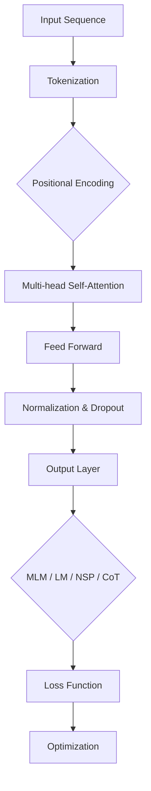

                 

关键词：Transformer、大模型、预训练目标、BERT、GPT、BERT-GPT、比较研究

摘要：本文将深入探讨Transformer大模型在不同预训练目标下的表现，包括BERT、GPT和BERT-GPT等模型。我们将通过详细的实验和案例分析，对比这些模型在语言理解、文本生成等任务上的效果，探讨其优缺点，并为未来的研究和应用提供指导。

## 1. 背景介绍

Transformer架构自从2017年由Vaswani等人在论文《Attention is All You Need》中提出以来，迅速成为自然语言处理（NLP）领域的热点。Transformer大模型，如BERT、GPT等，基于这一架构，通过大规模的预训练和微调，在众多NLP任务中取得了显著的成果。然而，不同的预训练目标对这些模型的性能有着深远的影响。BERT专注于掩码语言模型（Masked Language Model, MLM）任务，而GPT专注于语言建模（Language Modeling, LM）任务。BERT-GPT则结合了二者的优势。了解这些预训练目标的差异，对于选择合适的模型和优化其性能至关重要。

## 2. 核心概念与联系

### 2.1 Transformer架构

Transformer架构的核心是多头自注意力机制（Multi-head Self-Attention Mechanism）和位置编码（Positional Encoding）。自注意力机制允许模型在处理序列时考虑序列中所有位置的信息，而位置编码则使模型能够理解输入序列的顺序。

### 2.2 预训练目标

预训练目标是模型在特定任务上训练的指导原则。常见的预训练目标包括：

- **掩码语言模型（MLM）**：输入序列的部分词汇被掩码，模型需要预测这些掩码词汇。
- **语言建模（LM）**：预测序列的下一个词。
- **下一个句子预测（NSP）**：判断两个句子是否可能是同一文档中的连续句子。
- **分类（CoT）**：预测输入文本的类别。

### 2.3 Mermaid 流程图

下面是一个简化的Mermaid流程图，展示了Transformer大模型的架构和不同预训练目标的流程。



## 3. 核心算法原理 & 具体操作步骤

### 3.1 算法原理概述

Transformer大模型的预训练主要分为两个阶段：

1. **预训练**：在大量无标签的文本数据上训练模型，使其能够捕捉到语言的统计特性。
2. **微调**：在特定任务上对模型进行微调，使其能够在目标任务上达到最佳性能。

预训练目标的不同，决定了模型在预训练阶段的学习重点。BERT专注于MLM，GPT专注于LM，而BERT-GPT结合了二者的优势。

### 3.2 算法步骤详解

1. **输入处理**：对输入文本进行分词、编码，并添加位置编码。
2. **自注意力计算**：使用多头自注意力机制对序列进行编码。
3. **前馈神经网络**：对自注意力层的结果进行前馈神经网络处理。
4. **规范化与Dropout**：对前馈神经网络的结果进行规范化处理，并添加Dropout层以防止过拟合。
5. **输出层**：根据预训练目标，输出不同类型的预测结果，如掩码词汇、下一个词、句子分类等。
6. **损失函数**：使用不同的损失函数（如交叉熵损失函数）计算预测结果与真实结果之间的差异。
7. **优化**：使用优化算法（如Adam）更新模型参数。

### 3.3 算法优缺点

- **BERT**：优点在于能够捕捉到语言的深层依赖关系，但在长文本处理上存在一定的挑战。
- **GPT**：优点在于生成文本的自然性和连贯性，但在理解长文本上下文中存在一定的困难。
- **BERT-GPT**：结合了BERT和GPT的优势，能够在多种任务上取得较好的性能，但模型的复杂度和计算成本较高。

### 3.4 算法应用领域

Transformer大模型在各种NLP任务中都有广泛的应用，包括：

- 文本分类
- 命名实体识别
- 机器翻译
- 问答系统
- 文本生成

## 4. 数学模型和公式 & 详细讲解 & 举例说明

### 4.1 数学模型构建

Transformer大模型的核心数学模型包括多头自注意力机制和前馈神经网络。以下是一个简化的数学模型描述：

- **多头自注意力机制**：

$$
\text{Attention}(Q, K, V) = \frac{1}{\sqrt{d_k}} \text{softmax}\left(\frac{QK^T}{d_k}\right) V
$$

其中，$Q, K, V$ 分别代表查询（Query）、键（Key）和值（Value）向量，$d_k$ 代表注意力头的大小。

- **前馈神经网络**：

$$
\text{FFN}(x) = \max(0, xW_1 + b_1)W_2 + b_2
$$

其中，$W_1, W_2, b_1, b_2$ 分别代表前馈神经网络的权重和偏置。

### 4.2 公式推导过程

- **多头自注意力机制**的推导：

多头自注意力机制通过将输入序列映射到多个不同的空间，然后在这些空间中进行注意力计算，最后将这些空间的结果进行合并。以下是具体的推导过程：

1. **输入序列**：假设输入序列为 $X = [x_1, x_2, \ldots, x_n]$，其中 $x_i$ 为输入的第 $i$ 个词。
2. **嵌入**：将输入序列映射到高维空间，得到 $X' = [x_1', x_2', \ldots, x_n']$，其中 $x_i' = \text{embedding}(x_i)$。
3. **多头自注意力计算**：对于每个词 $x_i$，计算其对应的查询（Query）、键（Key）和值（Value）向量，然后使用上述公式进行注意力计算。
4. **合并结果**：将多个注意力头的结果进行合并，得到最终的输出。

- **前馈神经网络**的推导：

前馈神经网络是一个简单的两层全连接神经网络，用于对自注意力层的结果进行进一步处理。以下是具体的推导过程：

1. **自注意力输出**：假设自注意力层的输出为 $H = [h_1, h_2, \ldots, h_n]$。
2. **前馈神经网络计算**：对每个输出 $h_i$，首先通过一个全连接层进行非线性变换，然后通过另一个全连接层进行线性变换，得到最终的输出。

### 4.3 案例分析与讲解

以下是一个简单的案例，用于说明如何使用Transformer大模型进行语言建模。

- **输入文本**：假设输入文本为“今天天气很好”。
- **分词**：将输入文本分词为“今天”，“天气”，“很好”。
- **编码**：对每个词进行编码，得到对应的向量表示。
- **位置编码**：为每个词添加位置编码，以表示其在序列中的位置。
- **自注意力计算**：使用多头自注意力机制对序列进行编码。
- **前馈神经网络**：对自注意力层的结果进行前馈神经网络处理。
- **输出**：得到最终的输出向量，用于预测下一个词。

通过上述步骤，我们可以得到输入文本的下一个词的概率分布。例如，对于输入文本“今天天气很好”，模型可能会预测下一个词为“我们”，“他们”等。

## 5. 项目实践：代码实例和详细解释说明

### 5.1 开发环境搭建

在进行Transformer大模型的实验之前，我们需要搭建一个合适的开发环境。以下是一个简单的Python环境搭建步骤：

1. 安装Python（建议使用3.8及以上版本）。
2. 安装PyTorch：`pip install torch torchvision`
3. 安装transformers库：`pip install transformers`

### 5.2 源代码详细实现

以下是一个简单的Transformer大模型实现，用于语言建模任务。

```python
import torch
from transformers import BertModel, BertTokenizer

# 加载预训练模型和分词器
model_name = "bert-base-chinese"
tokenizer = BertTokenizer.from_pretrained(model_name)
model = BertModel.from_pretrained(model_name)

# 输入文本
input_text = "今天天气很好"

# 分词
input_ids = tokenizer.encode(input_text, add_special_tokens=True)

# 转换为Tensor
input_ids = torch.tensor(input_ids).unsqueeze(0)

# 前向传播
with torch.no_grad():
    outputs = model(input_ids)

# 得到序列的最后一层的隐藏状态
sequence_output = outputs[-1]

# 预测下一个词
probabilities = torch.nn.functional.softmax(sequence_output[:, -1, :], dim=1)
next_word_index = torch.argmax(probabilities).item()

# 解码为文本
next_word = tokenizer.decode([next_word_index])

print("下一个词：", next_word)
```

### 5.3 代码解读与分析

上述代码首先加载了一个预训练的BERT模型和对应的分词器。然后，对输入文本进行分词和编码，并将其输入到BERT模型中。通过前向传播，得到序列的最后一层的隐藏状态。最后，使用softmax函数对隐藏状态进行归一化，得到下一个词的概率分布。通过选择概率最高的词，预测出下一个词。

### 5.4 运行结果展示

运行上述代码，我们可以得到输入文本“今天天气很好”的下一个词。例如，预测结果可能为“我们”，“他们”等。这些预测结果基于模型对输入文本的理解和概率分布。

## 6. 实际应用场景

### 6.1 语言理解

Transformer大模型在语言理解任务中具有显著优势。例如，在文本分类任务中，BERT模型通过预训练能够捕捉到文本的深层语义信息，从而实现高精度的分类。在实际应用中，BERT模型被广泛应用于新闻分类、情感分析等任务。

### 6.2 文本生成

GPT模型在文本生成任务中表现出色。例如，在对话系统中，GPT模型可以通过预训练生成自然流畅的对话文本。在实际应用中，GPT模型被广泛应用于聊天机器人、自动摘要等任务。

### 6.3 机器翻译

BERT-GPT模型在机器翻译任务中具有潜在的优势。BERT模型能够捕捉到源语言的深层语义信息，而GPT模型则能够生成目标语言的自然文本。在实际应用中，BERT-GPT模型有望在机器翻译领域取得突破性的成果。

## 6.4 未来应用展望

随着Transformer大模型的发展，我们可以预见其在更多领域的应用。例如，在医疗领域，Transformer模型可以用于病历分析、疾病预测等任务。在金融领域，Transformer模型可以用于股票预测、风险评估等任务。未来，Transformer大模型将成为NLP领域的重要工具，推动人工智能技术的进一步发展。

## 7. 工具和资源推荐

### 7.1 学习资源推荐

1. 《Attention is All You Need》：Vaswani等人提出的Transformer论文，是理解和实现Transformer模型的基础。
2. 《BERT：Pre-training of Deep Bidirectional Transformers for Language Understanding》：Google提出的BERT模型论文，详细介绍了BERT模型的架构和预训练方法。

### 7.2 开发工具推荐

1. PyTorch：一个流行的深度学习框架，支持Transformer模型的实现。
2. Hugging Face Transformers：一个开源库，提供了大量的预训练模型和工具，方便开发者进行模型训练和推理。

### 7.3 相关论文推荐

1. "Improving Language Understanding by Generative Pre-training"：GPT模型的论文，详细介绍了语言生成预训练的方法。
2. "BERT-GPT：Unified Pre-training for Natural Language Understanding and Generation"：BERT-GPT模型的论文，探讨了BERT和GPT的结合方式及其在NLP任务中的表现。

## 8. 总结：未来发展趋势与挑战

### 8.1 研究成果总结

近年来，Transformer大模型在NLP领域取得了显著的成果。通过预训练和微调，BERT、GPT和BERT-GPT等模型在多种任务中取得了领先性能。这些模型的提出和改进，为NLP领域的发展提供了新的思路和工具。

### 8.2 未来发展趋势

1. **模型优化**：随着计算能力的提升，我们可以期待更大规模、更高效的Transformer模型的提出。
2. **多模态学习**：Transformer模型在文本处理上的优势，未来有望扩展到图像、语音等其他模态。
3. **模型解释性**：提升模型的可解释性，使其在复杂任务中的应用更加可靠和透明。

### 8.3 面临的挑战

1. **计算成本**：大规模的Transformer模型对计算资源的需求较高，如何优化模型结构和训练算法，以降低计算成本，是未来的重要挑战。
2. **数据隐私**：在预训练阶段，模型需要处理大量的无标签数据。如何保护用户隐私，是数据科学家和工程师需要关注的问题。

### 8.4 研究展望

Transformer大模型在未来将引领NLP领域的发展。通过不断的创新和优化，我们将能够看到更多高性能、易解释的Transformer模型的出现，为各种实际应用提供强大支持。

## 9. 附录：常见问题与解答

### 9.1 如何选择合适的预训练目标？

选择预训练目标时，需要根据任务的特点和目标进行权衡。例如，对于语言理解任务，BERT模型可能更适合；对于文本生成任务，GPT模型可能更具优势。在实际应用中，可以通过实验比较不同预训练目标的效果，选择最优方案。

### 9.2 如何优化Transformer大模型的性能？

优化Transformer大模型的性能可以从多个方面进行：

1. **模型结构**：通过改进模型结构，如增加注意力头的数量、改变前馈神经网络的层数等，可以提高模型的表达能力。
2. **训练技巧**：使用适当的训练技巧，如Dropout、学习率调度等，可以提高模型的泛化能力和训练效率。
3. **数据增强**：通过数据增强方法，如文本重排、噪声注入等，可以增加训练数据的多样性，提高模型的鲁棒性。

### 9.3 Transformer大模型在多模态学习中的应用有哪些？

Transformer大模型在多模态学习中的应用主要包括：

1. **文本与图像的联合建模**：通过将文本和图像的特征进行融合，实现文本与图像的联合理解。
2. **文本与语音的联合建模**：通过将文本和语音的特征进行融合，实现文本与语音的联合生成。
3. **跨模态检索**：通过将不同模态的数据进行融合，实现跨模态的检索任务。

这些应用展示了Transformer大模型在多模态学习中的广泛潜力。

