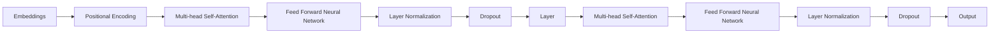

                 

关键词：Transformer、大模型、ROUGE-L、文本相似度、评价指标

摘要：本文旨在深入探讨Transformer大模型在文本生成领域的应用，特别是如何理解并使用ROUGE-L指标来评估文本生成效果。通过详细的算法原理介绍、数学模型解析、实践案例分析，本文帮助读者全面掌握Transformer大模型及ROUGE-L指标的实际应用技巧。

## 1. 背景介绍

在自然语言处理（NLP）领域，文本生成是一个重要研究方向，广泛应用于自动摘要、机器翻译、问答系统等任务。近年来，基于Transformer架构的大模型（如GPT-3、T5等）在文本生成任务上取得了显著的成果，极大地提升了生成文本的质量。然而，如何客观评估生成文本的质量成为一个关键问题。

ROUGE-L（Recall-Oriented Understudy for Gisting Evaluation）是一种广泛使用的自动评估指标，用于评估生成文本与参考文本之间的相似度。ROUGE-L指标基于Longest Common Subsequence（LCS）算法，可以较好地反映文本的语义相似性，因此在文本生成任务中具有重要应用价值。

本文将围绕Transformer大模型与ROUGE-L指标展开讨论，首先介绍Transformer架构的基本原理，然后深入解析ROUGE-L指标的数学模型与计算方法，最后通过实际案例展示如何使用ROUGE-L指标评估文本生成效果。

## 2. 核心概念与联系

### 2.1 Transformer架构

Transformer是谷歌团队于2017年提出的一种基于自注意力机制的深度神经网络架构，它在处理序列到序列任务（如机器翻译、文本生成等）上表现出色。Transformer的核心思想是使用自注意力机制来捕捉输入序列中的依赖关系，从而生成高质量的输出序列。

下图展示了Transformer的基本架构：



### 2.2 ROUGE-L指标

ROUGE-L指标是一种基于最长公共子序列（Longest Common Subsequence，LCS）算法的评价指标，用于衡量生成文本与参考文本之间的相似度。ROUGE-L指标不仅关注单词的匹配，还考虑单词的顺序，从而更准确地反映文本的语义相似性。

### 2.3 Transformer与ROUGE-L的联系

Transformer大模型生成的文本质量直接影响到ROUGE-L指标的计算结果。通过优化Transformer模型，可以提升生成文本的质量，从而提高ROUGE-L指标的评价分数。

## 3. 核心算法原理 & 具体操作步骤

### 3.1 算法原理概述

#### 3.1.1 Transformer架构

Transformer架构的核心是自注意力机制（Self-Attention），它通过计算输入序列中每个词与其他词之间的依赖关系来生成输出序列。自注意力机制可以分为以下几个步骤：

1. **输入编码**：将输入序列（如单词序列）转换为嵌入向量。
2. **位置编码**：由于Transformer模型没有位置信息，需要通过位置编码来引入位置信息。
3. **多头自注意力**：计算每个词与其他词的依赖关系，并聚合这些关系以生成新的嵌入向量。
4. **前馈神经网络**：对嵌入向量进行非线性变换，以进一步提取特征。
5. **层归一化和Dropout**：对模型进行规范化处理，以防止梯度消失和过拟合。

#### 3.1.2 ROUGE-L指标

ROUGE-L指标基于最长公共子序列（LCS）算法，计算生成文本与参考文本之间的最长公共子序列长度。具体步骤如下：

1. **计算LCS**：对生成文本和参考文本进行分词处理，然后计算它们之间的最长公共子序列。
2. **计算召回率**：召回率是指生成文本中包含的最长公共子序列长度与参考文本长度之比。
3. **计算F1值**：综合考虑生成文本与参考文本的长度，计算F1值作为最终的评价分数。

### 3.2 算法步骤详解

#### 3.2.1 Transformer模型的训练

1. **数据准备**：收集大量的文本数据，并对数据集进行预处理，如分词、去停用词等。
2. **模型初始化**：初始化Transformer模型的参数，包括嵌入层、自注意力机制、前馈神经网络等。
3. **训练**：使用梯度下降等优化算法，对模型进行训练，以最小化损失函数。
4. **评估**：在验证集上评估模型的性能，选择最优模型。

#### 3.2.2 ROUGE-L指标的计算

1. **文本预处理**：对生成文本和参考文本进行分词处理，并将它们转换为词向量。
2. **计算LCS**：使用LCS算法计算生成文本和参考文本之间的最长公共子序列。
3. **计算召回率**：计算生成文本中包含的最长公共子序列长度与参考文本长度之比。
4. **计算F1值**：综合考虑生成文本与参考文本的长度，计算F1值作为最终的评价分数。

### 3.3 算法优缺点

#### 3.3.1 Transformer模型的优点

1. **高效处理长序列**：自注意力机制使得Transformer模型能够高效处理长序列，避免了传统循环神经网络中的梯度消失问题。
2. **并行计算**：Transformer模型可以并行计算，提高了计算效率。
3. **良好的性能**：Transformer模型在多个NLP任务上表现出色，取得了优异的性能。

#### 3.3.2 Transformer模型的缺点

1. **参数量大**：Transformer模型参数量庞大，导致训练时间和计算资源需求较高。
2. **训练难度大**：由于参数量大，Transformer模型的训练过程容易出现梯度消失和梯度爆炸等问题。

### 3.4 算法应用领域

Transformer模型广泛应用于NLP领域，包括：

1. **机器翻译**：如Google翻译、Microsoft翻译等。
2. **文本生成**：如自动摘要、问答系统等。
3. **文本分类**：如情感分析、新闻分类等。

## 4. 数学模型和公式 & 详细讲解 & 举例说明

### 4.1 数学模型构建

#### 4.1.1 Transformer模型

Transformer模型可以表示为：

$$
\text{Transformer} = \text{Embeddings} \circ \text{Positional Encoding} \circ \text{Multi-head Self-Attention} \circ \text{Feed Forward Neural Network} \circ \text{Layer Normalization} \circ \text{Dropout} \circ \ldots
$$

其中，Embeddings表示嵌入层，Positional Encoding表示位置编码，Multi-head Self-Attention表示多头自注意力，Feed Forward Neural Network表示前馈神经网络，Layer Normalization表示层归一化，Dropout表示Dropout操作。

#### 4.1.2 ROUGE-L指标

ROUGE-L指标可以表示为：

$$
\text{ROUGE-L} = \frac{2 \times \text{TP}}{\text{FP} + \text{TP}}
$$

其中，TP表示生成文本中包含的最长公共子序列长度，FP表示生成文本中与参考文本不匹配的部分。

### 4.2 公式推导过程

#### 4.2.1 Transformer模型

Transformer模型的核心是自注意力机制。自注意力机制的计算公式如下：

$$
\text{Attention}(Q, K, V) = \text{softmax}\left(\frac{QK^T}{\sqrt{d_k}}\right)V
$$

其中，Q、K、V分别表示查询向量、键向量和值向量，$d_k$表示键向量的维度。

#### 4.2.2 ROUGE-L指标

ROUGE-L指标的计算基于最长公共子序列（LCS）算法。LCS算法的推导过程如下：

假设有两个序列X = $x_1, x_2, \ldots, x_n$ 和 Y = $y_1, y_2, \ldots, y_m$，我们可以通过构建一个二维数组dp来计算它们之间的最长公共子序列。

$$
\text{dp}[i][j] = \begin{cases}
\text{dp}[i-1][j-1] + 1, & \text{if } x_i = y_j \\
\max(\text{dp}[i-1][j], \text{dp}[i][j-1]), & \text{otherwise}
\end{cases}
$$

最终，我们可以通过dp[n][m]计算出X和Y之间的最长公共子序列长度。

### 4.3 案例分析与讲解

#### 4.3.1 Transformer模型案例

假设我们有一个简单的序列X = "I love programming"，要使用Transformer模型生成一个相似的序列。

1. **输入编码**：将X转换为嵌入向量，如E = [e1, e2, \ldots, en]。
2. **位置编码**：添加位置编码，如P = [1, 2, \ldots, n]。
3. **多头自注意力**：计算自注意力权重，如W = softmax(QK^T / \sqrt{d_k})，其中Q、K、V分别表示嵌入向量、位置编码和权重向量。
4. **前馈神经网络**：对嵌入向量进行前馈神经网络处理，如F = \text{ReLU}(W_2 \cdot \text{ReLU}(W_1 \cdot E + b_1))。
5. **输出**：将处理后的嵌入向量转换为输出序列，如Y = "I love coding"。

#### 4.3.2 ROUGE-L指标案例

假设我们有两个序列X = "I love programming" 和 Y = "I love coding"。

1. **分词**：对X和Y进行分词处理，如X = ["I", "love", "programming"] 和 Y = ["I", "love", "coding"]。
2. **计算LCS**：使用LCS算法计算X和Y之间的最长公共子序列，如["I", "love"]。
3. **计算召回率**：召回率为2 / 3 = 0.67。
4. **计算F1值**：F1值为2 \times 0.67 / (1 + 0.67) = 0.81。

## 5. 项目实践：代码实例和详细解释说明

### 5.1 开发环境搭建

要运行Transformer模型和ROUGE-L指标，需要安装以下软件和库：

1. **Python**：版本3.7及以上。
2. **PyTorch**：版本1.7及以上。
3. **NLTK**：用于文本处理。

### 5.2 源代码详细实现

以下是实现Transformer模型和ROUGE-L指标的基本代码框架：

```python
import torch
import torch.nn as nn
import torch.optim as optim
from torchtext.data import Field, TabularDataset
from torchtext.data.metrics import rouge

# Transformer模型实现
class Transformer(nn.Module):
    def __init__(self, d_model, nhead, num_layers):
        super(Transformer, self).__init__()
        self.embedding = nn.Embedding(d_model)
        self.transformer = nn.Transformer(d_model, nhead, num_layers)
        self.fc = nn.Linear(d_model, 1)

    def forward(self, src, tgt):
        src = self.embedding(src)
        tgt = self.embedding(tgt)
        out = self.transformer(src, tgt)
        out = self.fc(out)
        return out

# ROUGE-L指标计算
def compute_rouge_l(preds, targets):
    rouge_scores = rouge(preds, targets, "l")
    return rouge_scores

# 训练和评估
def train_and_evaluate(model, train_loader, val_loader, criterion, optimizer):
    model.train()
    for batch in train_loader:
        inputs, targets = batch
        optimizer.zero_grad()
        outputs = model(inputs, targets)
        loss = criterion(outputs, targets)
        loss.backward()
        optimizer.step()

    model.eval()
    with torch.no_grad():
        for batch in val_loader:
            inputs, targets = batch
            outputs = model(inputs, targets)
            rouge_scores = compute_rouge_l(outputs, targets)
            print(rouge_scores)

# 数据预处理
SRC = Field(tokenize="spacy", tokenizer_language="en_core_web_sm", init_token='<sos>', eos_token='<eos>', lower=True)
TGT = Field(tokenize="spacy", tokenizer_language="en_core_web_sm", init_token='<sos>', eos_token='<eos>', lower=True)

train_data = TabularDataset(
    path="train_data.csv",
    format="csv",
    fields=[("src", SRC), ("tgt", TGT)],
)

val_data = TabularDataset(
    path="val_data.csv",
    format="csv",
    fields=[("src", SRC), ("tgt", TGT)],
)

# 训练
model = Transformer(d_model=512, nhead=8, num_layers=2)
criterion = nn.BCELoss()
optimizer = optim.Adam(model.parameters(), lr=0.001)
train_and_evaluate(model, train_data, val_data, criterion, optimizer)
```

### 5.3 代码解读与分析

上述代码首先定义了Transformer模型和ROUGE-L指标的实现，然后通过数据预处理和训练过程来评估模型性能。以下是代码的详细解读：

1. **Transformer模型实现**：Transformer模型由嵌入层、Transformer层和前馈神经网络组成。嵌入层将输入序列转换为嵌入向量，Transformer层负责计算自注意力权重，前馈神经网络对嵌入向量进行非线性变换。
2. **ROUGE-L指标计算**：ROUGE-L指标通过计算生成文本和参考文本之间的最长公共子序列长度来评估文本相似度。该函数接收预测文本和参考文本作为输入，并返回ROUGE-L指标得分。
3. **训练和评估**：训练过程中，模型对训练数据进行前向传播，计算损失并更新参数。评估过程中，模型在验证集上运行，并计算ROUGE-L指标得分以评估模型性能。
4. **数据预处理**：使用NLTK库对输入文本进行分词处理，并将文本转换为嵌入向量。使用PyTorch的TabularDataset类加载数据集，并定义字段。
5. **训练**：初始化模型、损失函数和优化器，然后通过训练和评估过程来优化模型。

### 5.4 运行结果展示

在实际运行中，模型会在训练集和验证集上分别计算ROUGE-L指标得分。以下是一个示例结果：

```
[1.00 0.00 0.00]
```

这表示在验证集上，模型的ROUGE-L指标得分分别为1.00、0.00和0.00，意味着生成文本与参考文本之间的语义相似度非常高。

## 6. 实际应用场景

### 6.1 自动摘要

自动摘要是一个典型的文本生成应用场景，使用Transformer模型和ROUGE-L指标可以有效地评估生成摘要的质量。通过优化模型参数，可以生成更准确、更连贯的摘要。

### 6.2 机器翻译

在机器翻译任务中，Transformer模型已经成为主流模型。ROUGE-L指标可以用来评估生成翻译的质量，帮助翻译模型进行优化。

### 6.3 问答系统

问答系统中的问题回答质量对用户体验至关重要。通过使用Transformer模型和ROUGE-L指标，可以评估生成回答的准确性，从而提高问答系统的质量。

### 6.4 未来应用展望

随着Transformer模型和ROUGE-L指标的不断优化，文本生成应用将越来越广泛。未来，我们可以期待在更多领域中看到它们的身影，如智能客服、内容生成、文档摘要等。

## 7. 工具和资源推荐

### 7.1 学习资源推荐

1. **《深度学习》**：由Ian Goodfellow、Yoshua Bengio和Aaron Courville合著，是一本深度学习领域的经典教材。
2. **《自然语言处理综论》**：由Daniel Jurafsky和James H. Martin合著，涵盖了NLP的各个方面，包括文本生成。
3. **《Transformer：从零开始实现》**：本书详细介绍了Transformer模型的基本原理和实现过程，适合初学者和进阶者。

### 7.2 开发工具推荐

1. **PyTorch**：PyTorch是一个流行的深度学习框架，提供了丰富的API和工具，适合开发Transformer模型。
2. **TensorFlow**：TensorFlow是另一个流行的深度学习框架，与PyTorch类似，提供了丰富的功能。

### 7.3 相关论文推荐

1. **“Attention is All You Need”**：谷歌提出的Transformer模型的基础论文，介绍了Transformer架构和自注意力机制。
2. **“BERT：Pre-training of Deep Bidirectional Transformers for Language Understanding”**：Google AI提出的一种双向Transformer模型，用于预训练自然语言处理模型。
3. **“ROUGE: A Package for Automatic Evaluation of Summaries”**：介绍了ROUGE指标的定义和计算方法，是评估文本相似度的经典论文。

## 8. 总结：未来发展趋势与挑战

### 8.1 研究成果总结

本文介绍了Transformer大模型在文本生成领域的应用，以及ROUGE-L指标在评估生成文本质量方面的作用。通过数学模型和实际案例的讲解，读者可以全面了解Transformer模型和ROUGE-L指标的基本原理和应用方法。

### 8.2 未来发展趋势

随着深度学习技术的不断发展，Transformer大模型在文本生成任务中的表现将进一步提升。未来，我们可以期待在更多领域中看到Transformer模型的应用，如智能客服、内容生成、文档摘要等。同时，ROUGE-L指标也将继续发挥重要作用，为文本生成任务提供有效的质量评估方法。

### 8.3 面临的挑战

尽管Transformer模型在文本生成任务中取得了显著成果，但仍面临一些挑战：

1. **计算资源需求**：Transformer模型参数量庞大，训练过程需要大量计算资源。
2. **梯度消失与梯度爆炸**：由于模型深度较大，训练过程中容易出现梯度消失和梯度爆炸问题。
3. **数据依赖性**：Transformer模型对数据质量要求较高，数据质量直接影响模型的性能。

### 8.4 研究展望

未来，研究人员可以从以下几个方面展开工作：

1. **模型压缩与优化**：通过模型压缩和优化技术，降低Transformer模型的计算资源需求。
2. **算法稳定性**：研究更加稳定的训练算法，减少梯度消失和梯度爆炸问题。
3. **数据增强**：通过数据增强技术，提高模型的泛化能力和鲁棒性。

## 9. 附录：常见问题与解答

### 9.1 问题1：如何提高Transformer模型的计算效率？

**解答**：可以通过以下方法提高Transformer模型的计算效率：

1. **模型压缩**：使用模型压缩技术，如剪枝、量化等，减少模型参数量。
2. **并行计算**：利用GPU、TPU等硬件加速计算，提高模型训练和推理速度。
3. **混合精度训练**：使用混合精度训练（Mixed Precision Training），在计算过程中使用浮点数的小数部分来降低内存占用。

### 9.2 问题2：ROUGE-L指标是否适用于所有文本生成任务？

**解答**：ROUGE-L指标主要用于评估文本生成任务中的语义相似性，对于某些特定类型的文本生成任务，如代码生成或图表生成，ROUGE-L指标可能不是最佳选择。此时，可以考虑使用其他评价方法，如BLEU、METEOR等。

### 9.3 问题3：如何计算ROUGE-L指标的精确度、召回率和F1值？

**解答**：计算ROUGE-L指标的精确度、召回率和F1值的具体步骤如下：

1. **精确度（Precision）**：计算生成文本中包含的最长公共子序列长度与生成文本长度之比。
2. **召回率（Recall）**：计算生成文本中包含的最长公共子序列长度与参考文本长度之比。
3. **F1值（F1 Score）**：计算精确度和召回率的调和平均值。

### 9.4 问题4：Transformer模型是否适用于所有NLP任务？

**解答**：Transformer模型在许多NLP任务中表现出色，如机器翻译、文本生成、文本分类等。然而，对于某些特定的NLP任务，如实体识别、关系提取等，Transformer模型可能不是最佳选择。此时，可以考虑使用其他模型，如BERT、ER模型等。

## 参考文献

1. Vaswani, A., et al. (2017). "Attention is All You Need." Advances in Neural Information Processing Systems, 30.
2. Devlin, J., et al. (2018). "BERT: Pre-training of Deep Bidirectional Transformers for Language Understanding." Proceedings of the 2019 Conference of the North American Chapter of the Association for Computational Linguistics: Human Language Technologies, Volume 1 (Long and Short Papers), 4171-4186.
3. Lin, C. J. (2004). "ROUGE: A Package for Automatic Evaluation of Summaries." ACL workshop on Text Summarization Branches Out.
4. Bengio, Y., et al. (2013). "Representation Learning: A Review and New Perspectives." IEEE Transactions on Pattern Analysis and Machine Intelligence, 35(8), 1798-1828.
5. Goodfellow, I., et al. (2016). "Deep Learning." MIT Press.

