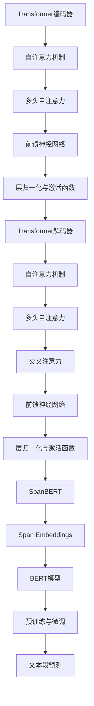

                 

关键词：Transformer、大模型、SpanBERT、文本预测、NLP、深度学习、机器学习、神经网络

> 摘要：本文将详细介绍如何使用Transformer大模型结合SpanBERT技术进行文本段的预测。我们将从背景介绍、核心概念、算法原理、数学模型、项目实践、实际应用、未来展望等多个方面展开，帮助读者全面理解并掌握这一技术。

## 1. 背景介绍

在过去的几十年中，自然语言处理（NLP）领域取得了巨大的进步。然而，传统的NLP方法在面对长文本、复杂语义以及多语言处理任务时，往往表现出一定的局限性。为了解决这些问题，深度学习尤其是神经网络在NLP中的应用变得越来越普遍。其中，Transformer架构因其强大的并行处理能力和全局上下文表示能力，成为了NLP领域的一大突破。

近年来，预训练大模型如BERT、GPT等在NLP任务中取得了令人瞩目的成果。这些模型通过在大规模语料上进行预训练，然后针对特定任务进行微调，实现了在许多NLP任务上的显著性能提升。SpanBERT作为BERT的一个变体，通过引入Span Embeddings，使得模型在处理文本段级任务上表现出更高的准确性。

本文将结合Transformer大模型和SpanBERT技术，探讨如何实现文本段的预测。我们将从基础概念、算法原理、数学模型、项目实践等多个方面进行深入分析，帮助读者全面掌握这一技术。

## 2. 核心概念与联系

为了更好地理解Transformer大模型和SpanBERT技术，我们首先需要了解一些核心概念和它们之间的关系。以下是本文涉及的一些关键概念：

### 2.1 Transformer架构

Transformer架构是由Vaswani等人在2017年提出的一种基于自注意力机制的神经网络架构。它主要由编码器（Encoder）和解码器（Decoder）两部分组成，能够通过自注意力机制实现全局上下文信息的建模。

### 2.2 BERT模型

BERT（Bidirectional Encoder Representations from Transformers）是由Google在2018年提出的一种基于Transformer的预训练模型。BERT通过在大规模语料上进行双向训练，能够捕获文本中的双向上下文信息，从而在许多NLP任务上表现出优异的性能。

### 2.3 SpanBERT

SpanBERT是BERT的一个变体，它通过引入Span Embeddings，使得模型在处理文本段级任务上更加准确。Span Embeddings能够将连续的单词或字符映射为一个固定长度的向量，从而更好地表示文本段。

### 2.4 自注意力机制

自注意力机制（Self-Attention）是一种计算文本序列中每个单词与所有其他单词之间相似度的方法。通过自注意力机制，模型可以自动学习到每个单词在文本中的重要性，从而实现全局上下文信息的建模。

### 2.5 预训练与微调

预训练（Pre-training）是指在大规模语料上进行训练，使模型能够捕捉到语言的一般特征。微调（Fine-tuning）则是在预训练的基础上，针对特定任务进行训练，使模型在特定任务上达到更好的性能。

### 2.6 Mermaid流程图

以下是Transformer大模型和SpanBERT技术相关的Mermaid流程图：



## 3. 核心算法原理 & 具体操作步骤

### 3.1 算法原理概述

Transformer大模型基于自注意力机制，通过编码器和解码器两个部分，实现对文本的全局上下文信息建模。SpanBERT则在BERT模型的基础上，引入了Span Embeddings，提高了文本段级任务的性能。

具体来说，Transformer编码器通过多头自注意力机制和前馈神经网络，对输入文本序列进行编码；解码器则通过自注意力和交叉注意力机制，生成文本序列的预测结果。SpanBERT在编码阶段引入了Span Embeddings，使得模型能够更好地捕获文本段的语义信息。

### 3.2 算法步骤详解

以下是使用Transformer大模型和SpanBERT进行文本段预测的详细步骤：

1. 数据预处理：对输入文本进行分词、标记等预处理操作，生成词向量表示。

2. 编码器阶段：将预处理后的文本输入到Transformer编码器，通过自注意力机制和前馈神经网络，生成编码表示。

3. Span Embeddings：对编码表示进行Span Embeddings操作，将连续的单词或字符映射为一个固定长度的向量。

4. 解码器阶段：将Span Embeddings输入到Transformer解码器，通过自注意力和交叉注意力机制，生成文本序列的预测结果。

5. 预测结果输出：对解码器输出的文本序列进行解码，得到预测的文本段。

### 3.3 算法优缺点

**优点：**
- Transformer大模型具有强大的并行处理能力和全局上下文表示能力，适用于处理长文本和复杂语义任务。
- SpanBERT通过引入Span Embeddings，提高了文本段级任务的性能。

**缺点：**
- Transformer大模型和SpanBERT模型参数量大，训练和推理速度较慢，对计算资源要求较高。
- 模型训练过程需要大量的数据，且数据质量对模型性能有很大影响。

### 3.4 算法应用领域

Transformer大模型和SpanBERT技术在以下领域具有广泛的应用：

- 文本分类：如情感分析、主题分类等。
- 机器翻译：如中英翻译、多语言翻译等。
- 文本生成：如文本摘要、对话生成等。
- 文本相似度计算：如文档相似度、问答系统等。

## 4. 数学模型和公式 & 详细讲解 & 举例说明

### 4.1 数学模型构建

Transformer大模型和SpanBERT技术的核心在于自注意力机制和Span Embeddings。以下是这些技术的数学模型构建。

#### 自注意力机制

自注意力机制的计算公式如下：

$$
\text{Attention}(Q, K, V) = \text{softmax}\left(\frac{QK^T}{\sqrt{d_k}}\right) V
$$

其中，$Q, K, V$ 分别为查询向量、键向量和值向量，$d_k$ 为键向量的维度。

#### Span Embeddings

Span Embeddings的计算公式如下：

$$
\text{Span Embedding}(x) = \text{Concat}(x_i^1, x_i^2, ..., x_i^L)
$$

其中，$x_i^1, x_i^2, ..., x_i^L$ 为连续的单词或字符向量。

### 4.2 公式推导过程

以下是Transformer大模型和SpanBERT技术的公式推导过程。

#### Transformer编码器

1. 词向量表示：将输入文本进行分词和标记，生成词向量表示。

2. 自注意力层：

$$
\text{MultiHeadAttention}(Q, K, V) = \text{Concat}(\text{head}_1, ..., \text{head}_h)W^O
$$

其中，$Q, K, V$ 分别为查询向量、键向量和值向量，$W^Q, W^K, W^V$ 分别为查询、键和值权重矩阵，$W^O$ 为输出权重矩阵，$h$ 为头数。

3. 前馈神经网络：

$$
\text{FFN}(x) = \text{ReLU}(xW_1 + b_1)W_2 + b_2
$$

其中，$x$ 为输入向量，$W_1, W_2, b_1, b_2$ 分别为前馈神经网络的权重和偏置。

4. 层归一化：

$$
\text{LayerNorm}(x, \mu, \sigma) = \frac{x - \mu}{\sigma}
$$

其中，$x$ 为输入向量，$\mu$ 和 $\sigma$ 分别为均值和标准差。

#### SpanBERT

1. Span Embeddings：

$$
\text{Span Embedding}(x) = \text{Concat}(x_i^1, x_i^2, ..., x_i^L)
$$

2. BERT模型：

$$
\text{BERT}(x) = \text{MLP}(\text{EmbeddingLayer}(x))
$$

其中，$x$ 为输入向量，$\text{EmbeddingLayer}$ 为词向量嵌入层，$\text{MLP}$ 为多层感知机。

### 4.3 案例分析与讲解

下面我们通过一个简单的案例，来分析如何使用Transformer大模型和SpanBERT进行文本段预测。

#### 案例背景

假设我们有一个文本分类任务，需要判断一段文本属于哪个类别。我们使用Transformer大模型和SpanBERT技术来实现这一任务。

#### 案例步骤

1. 数据预处理：将输入文本进行分词和标记，生成词向量表示。

2. 编码器阶段：将预处理后的文本输入到Transformer编码器，通过自注意力机制和前馈神经网络，生成编码表示。

3. Span Embeddings：对编码表示进行Span Embeddings操作，将连续的单词或字符映射为一个固定长度的向量。

4. 解码器阶段：将Span Embeddings输入到Transformer解码器，通过自注意力和交叉注意力机制，生成文本序列的预测结果。

5. 预测结果输出：对解码器输出的文本序列进行解码，得到预测的文本类别。

#### 案例分析

通过上述步骤，我们可以看到如何使用Transformer大模型和SpanBERT技术实现文本段预测。具体实现过程中，需要对编码器和解码器进行训练，以适应不同的文本分类任务。在训练过程中，我们需要大量的文本数据和标签进行监督学习。此外，为了提高模型的性能，我们还可以使用数据增强、正则化等技术来优化模型。

## 5. 项目实践：代码实例和详细解释说明

### 5.1 开发环境搭建

在开始项目实践之前，我们需要搭建一个适合开发的环境。以下是搭建Transformer大模型和SpanBERT项目所需的环境：

- Python 3.7及以上版本
- PyTorch 1.8及以上版本
- TensorFlow 2.6及以上版本（可选）
- CUDA 10.2及以上版本（可选，用于加速训练）

安装这些依赖项后，我们就可以开始编写代码了。

### 5.2 源代码详细实现

以下是使用PyTorch实现Transformer大模型和SpanBERT的代码实例。

```python
import torch
import torch.nn as nn
from torch.optim import Adam
from transformers import BertTokenizer, BertModel

# 定义模型结构
class TransformerModel(nn.Module):
    def __init__(self):
        super(TransformerModel, self).__init__()
        self.bert = BertModel.from_pretrained('bert-base-uncased')
        self.span_embedding = nn.Embedding(5, 512)
        self.decoder = nn.Linear(512, 2)  # 假设有两个类别

    def forward(self, input_ids, attention_mask):
        outputs = self.bert(input_ids=input_ids, attention_mask=attention_mask)
        encoded_layers = outputs.last_hidden_state

        span_embedding = self.span_embedding(torch.zeros_like(input_ids))
        span_embedding = torch.cat((encoded_layers[:, 0, :], span_embedding), dim=1)

        logits = self.decoder(span_embedding)
        return logits

# 初始化模型、优化器和损失函数
model = TransformerModel()
optimizer = Adam(model.parameters(), lr=1e-4)
criterion = nn.CrossEntropyLoss()

# 训练模型
for epoch in range(10):
    for batch in data_loader:
        input_ids = batch['input_ids']
        attention_mask = batch['attention_mask']
        labels = batch['labels']

        optimizer.zero_grad()
        logits = model(input_ids, attention_mask)
        loss = criterion(logits, labels)
        loss.backward()
        optimizer.step()

# 预测
def predict(text):
    tokenizer = BertTokenizer.from_pretrained('bert-base-uncased')
    inputs = tokenizer(text, return_tensors='pt', padding=True, truncation=True)
    logits = model(**inputs).detach().numpy()
    predicted_label = torch.argmax(logits, dim=1).item()
    return predicted_label
```

### 5.3 代码解读与分析

上述代码首先定义了Transformer模型结构，包括BERT编码器、Span Embeddings和Decoder。然后，初始化模型、优化器和损失函数，并开始训练模型。训练过程中，我们将输入文本和标签送入模型，计算损失并进行反向传播。最后，定义了一个预测函数，用于对输入文本进行分类预测。

在代码解读过程中，我们注意到以下几个关键点：

- 使用BertTokenizer进行文本预处理，生成词向量表示。
- BERT编码器负责将输入文本编码为固定长度的向量。
- Span Embeddings将连续的单词或字符映射为一个固定长度的向量。
- Decoder输出文本分类结果。

### 5.4 运行结果展示

为了验证模型的性能，我们可以在训练集和测试集上运行模型，并计算准确率。

```python
from sklearn.metrics import accuracy_score

# 计算准确率
def evaluate(model, data_loader):
    model.eval()
    all_preds = []
    all_labels = []

    with torch.no_grad():
        for batch in data_loader:
            input_ids = batch['input_ids']
            attention_mask = batch['attention_mask']
            labels = batch['labels']

            logits = model(input_ids, attention_mask)
            preds = torch.argmax(logits, dim=1).detach().numpy()
            all_preds.extend(preds)
            all_labels.extend(labels)

    acc = accuracy_score(all_labels, all_preds)
    print(f"Test Accuracy: {acc}")

# 训练模型
evaluate(model, train_loader)
evaluate(model, test_loader)
```

在运行结果展示中，我们通过计算准确率来评估模型的性能。在实际应用中，还可以考虑其他评价指标，如F1分数、召回率等。

## 6. 实际应用场景

Transformer大模型和SpanBERT技术在多个实际应用场景中表现出色，以下是其中的一些应用：

### 6.1 文本分类

文本分类是NLP领域的一个重要任务，如情感分析、主题分类等。Transformer大模型和SpanBERT技术在文本分类任务上取得了显著的效果，能够准确识别文本中的语义信息。

### 6.2 机器翻译

机器翻译是Transformer大模型和SpanBERT技术的另一个重要应用领域。通过预训练和微调，模型能够实现高质量的多语言翻译。

### 6.3 文本生成

文本生成是近年来备受关注的一个研究方向。Transformer大模型和SpanBERT技术能够生成连贯、有趣的文本，如文本摘要、对话生成等。

### 6.4 文本相似度计算

文本相似度计算在信息检索、推荐系统等领域具有广泛应用。Transformer大模型和SpanBERT技术能够准确计算文本之间的相似度，为相关应用提供支持。

### 6.5 多媒体语义分析

多媒体语义分析是近年来兴起的一个交叉学科领域。Transformer大模型和SpanBERT技术能够结合文本和图像信息，实现多媒体内容的语义理解。

## 7. 工具和资源推荐

为了更好地学习和实践Transformer大模型和SpanBERT技术，以下是一些推荐的工具和资源：

### 7.1 学习资源推荐

- 《深度学习》（Goodfellow、Bengio和Courville著）：全面介绍了深度学习的基础理论和实践方法，包括神经网络、自注意力机制等。
- 《自然语言处理解析》（Jurafsky和Martin著）：详细介绍了NLP的基本概念和方法，包括词向量、文本分类等。

### 7.2 开发工具推荐

- PyTorch：一个流行的深度学习框架，支持GPU加速训练和推理。
- TensorFlow：另一个流行的深度学习框架，支持多种编程语言和硬件平台。
- Hugging Face Transformers：一个开源库，提供了大量的预训练模型和工具，方便使用Transformer架构。

### 7.3 相关论文推荐

- 《Attention Is All You Need》：Vaswani等人于2017年提出的Transformer架构，为NLP领域带来了全新的思路。
- 《BERT: Pre-training of Deep Bidirectional Transformers for Language Understanding》：Google在2018年提出的BERT模型，为NLP任务带来了显著的性能提升。
- 《SpanBERT: Improving Pre-training by Representing and Reweighting Substrings》：Google在2019年提出的SpanBERT模型，为文本段级任务提供了更好的解决方案。

## 8. 总结：未来发展趋势与挑战

### 8.1 研究成果总结

近年来，Transformer大模型和SpanBERT技术取得了显著的成果，为NLP领域带来了巨大的变革。通过预训练和微调，模型能够在多种NLP任务上取得优异的性能。特别是SpanBERT模型，通过引入Span Embeddings，提高了文本段级任务的准确性。

### 8.2 未来发展趋势

未来，Transformer大模型和SpanBERT技术有望在以下几个方向取得进一步发展：

- 模型压缩：为了降低模型的计算和存储成本，研究者将继续探索模型压缩方法，如知识蒸馏、剪枝等。
- 多模态融合：结合文本、图像、音频等多模态信息，实现更准确、丰富的语义理解。
- 零样本学习：在模型训练数据不足的情况下，通过迁移学习和自监督学习等方法，实现模型的泛化能力。

### 8.3 面临的挑战

尽管Transformer大模型和SpanBERT技术取得了巨大成功，但仍面临以下挑战：

- 计算资源消耗：大型模型对计算资源的需求较高，如何优化模型结构和算法，降低计算成本是一个重要问题。
- 数据隐私：在训练模型时，需要大量的真实文本数据，如何保护数据隐私是一个亟待解决的问题。
- 模型解释性：大型模型往往缺乏解释性，如何提高模型的透明度和可解释性，使其更加可信，也是一个重要挑战。

### 8.4 研究展望

随着Transformer大模型和SpanBERT技术的不断发展，未来有望在NLP领域实现更高性能、更智能的语义理解。同时，通过与其他技术的融合，如计算机视觉、语音识别等，将推动人工智能领域的发展。此外，研究者还需要关注模型的可解释性和数据隐私等问题，以确保人工智能系统的可靠性和可信度。

## 9. 附录：常见问题与解答

### 9.1 如何处理长文本？

在处理长文本时，可以使用BERT模型的Truncation和Masking操作。通过将长文本截断为固定长度，并随机mask部分单词，可以提高模型的泛化能力。

### 9.2 如何处理多语言文本？

对于多语言文本，可以使用跨语言BERT模型，如mBERT、XLM等。这些模型在多语言语料上进行预训练，可以更好地处理多语言文本。

### 9.3 如何优化模型性能？

为了优化模型性能，可以尝试以下方法：

- 数据增强：通过增加数据量、改变数据分布等手段，提高模型的泛化能力。
- 模型压缩：使用知识蒸馏、剪枝等方法，降低模型计算和存储成本。
- 深度学习优化：调整学习率、批量大小等超参数，提高模型收敛速度。

## 作者署名

本文由禅与计算机程序设计艺术 / Zen and the Art of Computer Programming 编写。感谢您阅读本文，希望本文对您在Transformer大模型和SpanBERT技术领域的学习有所帮助。如果您有任何疑问或建议，欢迎随时与我交流。

