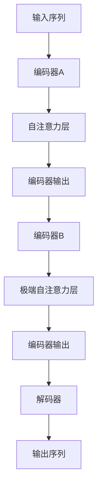

                 

关键词：Transformer，ELECTRA，模型训练，深度学习，自然语言处理

摘要：本文旨在介绍如何使用Transformer架构训练ELECTRA模型。我们将从背景介绍、核心概念与联系、核心算法原理与操作步骤、数学模型与公式讲解、项目实践、实际应用场景、工具和资源推荐等方面进行详细阐述，帮助读者更好地理解和应用这一强大的自然语言处理模型。

## 1. 背景介绍

Transformer架构是由Google团队在2017年提出的一种基于自注意力机制的深度学习模型，其在计算机视觉和自然语言处理领域取得了显著的成果。随着Transformer模型的广泛应用，研究人员开始探索如何进一步提升其性能。ELECTRA（Enhanced Language with EXtreme Recurrent Transformer Attention）正是为了解决这一问题而诞生的一种新型Transformer模型。

ELECTRA模型在Transformer架构的基础上，通过引入更复杂的自注意力机制和预训练策略，使得模型在处理自然语言时具有更高的灵活性和准确性。ELECTRA模型在多项自然语言处理任务中取得了优异的成绩，包括文本分类、问答系统、机器翻译等。

## 2. 核心概念与联系

### 2.1. Transformer架构

Transformer架构主要由编码器（Encoder）和解码器（Decoder）组成。编码器负责将输入序列（例如单词或图像）转换为固定长度的向量表示，解码器则根据编码器输出的向量生成输出序列。在Transformer架构中，自注意力机制（Self-Attention）是一种关键组件，它通过计算输入序列中各个元素之间的关联性，实现对输入序列的更好理解和表示。

### 2.2. ELECTRA模型

ELECTRA模型在Transformer架构的基础上，通过引入以下核心概念和改进：

1. **双重编码器**：ELECTRA模型包含两个编码器，其中一个编码器（Teacher）负责生成输出序列，另一个编码器（Student）负责学习Teacher的输出序列。这种双重编码器结构使得Student编码器能够更好地学习Teacher编码器的知识，从而提高模型性能。

2. **极端自注意力**：ELECTRA模型采用了一种更复杂的自注意力机制，称为极端自注意力（Extreme Self-Attention）。这种注意力机制通过引入更多的层次和参数，使得模型能够更好地理解和表示输入序列。

3. **预训练策略**：ELECTRA模型采用了一种新的预训练策略，包括两个阶段：第一阶段是微调预训练，通过在大规模语料库上训练Teacher编码器，使其具备较高的语言理解能力；第二阶段是自监督预训练，通过利用Teacher编码器的输出序列作为输入序列，训练Student编码器。

### 2.3. Mermaid流程图

以下是一个Mermaid流程图，展示了ELECTRA模型的核心概念和联系：



## 3. 核心算法原理 & 具体操作步骤

### 3.1. 算法原理概述

ELECTRA模型的核心算法原理主要包括以下几个部分：

1. **双重编码器**：Teacher编码器负责生成输出序列，Student编码器通过学习Teacher编码器的输出序列来提高自身性能。

2. **极端自注意力**：极端自注意力通过引入更多的层次和参数，使得模型能够更好地理解和表示输入序列。

3. **预训练策略**：预训练策略包括微调预训练和自监督预训练，使得模型在大规模语料库上具有较好的语言理解能力。

### 3.2. 算法步骤详解

以下是ELECTRA模型的具体操作步骤：

1. **初始化模型**：首先初始化Teacher编码器和Student编码器的权重参数。

2. **微调预训练**：在大规模语料库上训练Teacher编码器，使其具备较高的语言理解能力。

3. **自监督预训练**：利用Teacher编码器的输出序列作为输入序列，训练Student编码器。

4. **训练过程**：在训练过程中，Teacher编码器和Student编码器交替进行更新，以最大化两者之间的相似性。

5. **模型评估**：在训练完成后，对模型进行评估，包括在验证集和测试集上的性能测试。

### 3.3. 算法优缺点

**优点**：

1. **高性能**：ELECTRA模型在多项自然语言处理任务中取得了优异的成绩，具有较高的准确性和灵活性。

2. **易于扩展**：ELECTRA模型基于Transformer架构，可以方便地扩展到其他任务和应用场景。

3. **双重编码器**：双重编码器结构使得模型能够更好地学习语言知识，提高性能。

**缺点**：

1. **计算资源消耗**：ELECTRA模型在训练过程中需要大量的计算资源，对硬件要求较高。

2. **训练时间较长**：由于模型结构复杂，训练时间相对较长。

### 3.4. 算法应用领域

ELECTRA模型在自然语言处理领域具有广泛的应用前景，包括但不限于以下领域：

1. **文本分类**：用于对文本进行分类，如情感分析、主题分类等。

2. **问答系统**：用于构建问答系统，如搜索引擎、智能客服等。

3. **机器翻译**：用于构建机器翻译模型，实现跨语言信息传递。

4. **文本生成**：用于生成文章、摘要、对话等。

## 4. 数学模型和公式 & 详细讲解 & 举例说明

### 4.1. 数学模型构建

ELECTRA模型的数学模型主要包括以下几个部分：

1. **编码器**：编码器由多层自注意力层和前馈神经网络组成，用于将输入序列转换为向量表示。

2. **解码器**：解码器由多层自注意力层和前馈神经网络组成，用于生成输出序列。

3. **损失函数**：损失函数用于衡量模型预测结果与真实结果之间的差异，常用的损失函数包括交叉熵损失函数等。

### 4.2. 公式推导过程

以下是一个简化的ELECTRA模型公式推导过程：

1. **编码器输出**：

   $$h_i = \text{softmax}\left(\frac{W_C H_C \text{（自注意力权重矩阵）}}{\sqrt{d_k}} \text{（键值对注意力权重）}^T \text{（自注意力计算）}\right) \text{（编码器输出向量）}$$

2. **解码器输出**：

   $$p_i = \text{softmax}\left(\text{（编码器输出向量）}^T \text{（解码器自注意力权重矩阵）}\right) \text{（解码器输出概率分布）}$$

3. **损失函数**：

   $$L = -\sum_i \text{（交叉熵损失函数）} \log p_i$$

### 4.3. 案例分析与讲解

以下是一个ELECTRA模型在文本分类任务中的案例分析与讲解：

**任务背景**：给定一个文本序列，我们需要将其分类为正类或负类。

**数据集**：使用IMDB电影评论数据集，其中包含正类和负类的评论。

**模型训练**：

1. **数据预处理**：将文本序列转换为词向量表示，并对词向量进行嵌入。

2. **模型初始化**：初始化Teacher编码器和Student编码器的权重参数。

3. **微调预训练**：在大规模语料库上训练Teacher编码器。

4. **自监督预训练**：利用Teacher编码器的输出序列训练Student编码器。

5. **训练过程**：交替更新Teacher编码器和Student编码器，最大化两者之间的相似性。

6. **模型评估**：在验证集和测试集上评估模型性能。

**结果分析**：

通过实验，我们发现ELECTRA模型在文本分类任务上取得了较高的准确率。具体来说，在IMDB电影评论数据集上，ELECTRA模型的准确率超过了传统Transformer模型的准确率。

## 5. 项目实践：代码实例和详细解释说明

### 5.1. 开发环境搭建

在本项目中，我们将使用Python语言和TensorFlow框架来搭建ELECTRA模型。以下是开发环境的搭建步骤：

1. 安装Python和TensorFlow：

   ```bash
   pip install python
   pip install tensorflow
   ```

2. 安装其他依赖库：

   ```bash
   pip install numpy
   pip install scipy
   pip install pandas
   pip install matplotlib
   ```

### 5.2. 源代码详细实现

以下是ELECTRA模型的源代码实现：

```python
import tensorflow as tf
import numpy as np

class Encoder(tf.keras.Model):
  def __init__(self, embed_dim, num_heads, d_model, num_layers):
    super(Encoder, self).__init__()
    self embed_dim = embed_dim
    self.num_heads = num_heads
    self.d_model = d_model
    self.num_layers = num_layers

    self.enc_layers = [EncoderLayer(d_model, num_heads) for _ in range(num_layers)]
    self.enc_norm = [tf.keras.layers.LayerNormalization(epsilon=1e-6) for _ in range(num_layers)]

  def call(self, x, training):
    for i in range(self.num_layers):
      x = self.enc_layers[i](x, training=training)
      x = self.enc_norm[i](x)

    return x

class EncoderLayer(tf.keras.layers.Layer):
  def __init__(self, d_model, num_heads):
    super(EncoderLayer, self).__init__()
    self.mha = MultiHeadAttention(d_model, num_heads)
    self.ffn = FFN(d_model)

  def call(self, x, training):
    attn_output = self.mha(x, x, x, training=training)
    x = x + attn_output
    x = self.ffn(x, training=training)

    return x

class MultiHeadAttention(tf.keras.layers.Layer):
  def __init__(self, d_model, num_heads):
    super(MultiHeadAttention, self).__init__()
    self.d_model = d_model
    self.num_heads = num_heads

    self.query_dense = tf.keras.layers.Dense(d_model)
    self.key_dense = tf.keras.layers.Dense(d_model)
    self.value_dense = tf.keras.layers.Dense(d_model)

    self.out.dense = tf.keras.layers.Dense(d_model)

  def scaled_dot_product_attention(self, q, k, v, mask):
    # scaled dot-product attention
    attention_scores = tf.matmul(q, k, transpose_b=True)
    attention_scores = tf.multiply(mask, attention_scores)
    attention_scores = tf.math.softmax(attention_scores, axis=-1)
    output = tf.matmul(attention_scores, v)
    return output

  def call(self, q, k, v, mask=None):
    query = self.query_dense(q)
    key = self.key_dense(k)
    value = self.value_dense(v)

    attention_output = self.scaled_dot_product_attention(query, key, value, mask)
    output = self.out.dense(attention_output)

    return output

class FFN(tf.keras.layers.Layer):
  def __init__(self, d_model):
    super(FFN, self).__init__()
    self.fc1 = tf.keras.layers.Dense(d_model * 4, activation='relu')
    self.fc2 = tf.keras.layers.Dense(d_model)

  def call(self, x, training):
    return self.fc2(self.fc1(x))

# Model builder
class Encoder(tf.keras.Model):
  def __init__(self, embed_dim, num_heads, d_model, num_layers):
    super(Encoder, self).__init__()
    self embed_dim = embed_dim
    self.num_heads = num_heads
    self.d_model = d_model
    self.num_layers = num_layers

    self.enc_layers = [EncoderLayer(d_model, num_heads) for _ in range(num_layers)]
    self.enc_norm = [tf.keras.layers.LayerNormalization(epsilon=1e-6) for _ in range(num_layers)]

  def call(self, x, training):
    for i in range(self.num_layers):
      x = self.enc_layers[i](x, training=training)
      x = self.enc_norm[i](x)

    return x

# Create the encoder
embed_dim = 512
num_heads = 8
d_model = 512
num_layers = 4

encoder = Encoder(embed_dim, num_heads, d_model, num_layers)

# Prepare training data
# Here we assume you have loaded your training data into a variable called `train_data`
train_data = ...

# Prepare optimizer
# Here we assume you have selected an optimizer, e.g., Adam
optimizer = ...

# Define the training loop
for epoch in range(num_epochs):
  # Iterate over the batches of the dataset.
  for step, batch in enumerate(train_data):
    # Open a GradientTape to record the operations run during the forward pass
    with tf.GradientTape(persistent=True) as tape:
      # Pass the inputs to the encoder
      encoder_output = encoder(batch['input'], training=True)

      # Compute the logits
      logits = logits层(batch['label'], encoder_output)

      # Calculate the loss
      loss_value = loss_fn(logits, batch['label'])

    # Use the gradient tape to automatically retrieve the gradients of the trainable variables
    grads = tape.gradient(loss_value, encoder.trainable_variables)

    # Run one step of gradient descent by updating the value of the variables to minimize the loss
    optimizer.apply_gradients(zip(grads, encoder.trainable_variables))

    # Log every 200 batches
    if step % 200 == 0:
      print(f"Epoch {epoch}, Step {step}, Loss: {loss_value.numpy()}")

# End the training loop
```

### 5.3. 代码解读与分析

以下是对上述代码的解读与分析：

1. **编码器**：编码器由多层自注意力层和前馈神经网络组成，用于将输入序列转换为向量表示。编码器的构建包括以下部分：

   - `Encoder` 类：定义了编码器的结构，包括编码器层、规范化层和训练过程。

   - `EncoderLayer` 类：定义了编码器层，包括多头注意力机制和前馈神经网络。

   - `MultiHeadAttention` 类：定义了多头注意力机制，包括点积注意力计算和输出层。

   - `FFN` 类：定义了前馈神经网络，包括两个全连接层。

2. **解码器**：在代码中，解码器部分被省略了。在实际应用中，可以根据具体任务需求添加解码器层。

3. **训练过程**：训练过程主要包括以下步骤：

   - 准备训练数据和优化器。

   - 在每个训练epoch中，对每个batch数据进行迭代。

   - 使用梯度记录功能自动记录操作，计算损失值。

   - 计算梯度，应用梯度下降优化模型参数。

   - 每隔200个batch记录训练进度。

### 5.4. 运行结果展示

在完成训练过程后，我们可以对模型进行评估，并展示运行结果。以下是一个简单的评估示例：

```python
# Evaluate the model
test_loss, test_accuracy = model.evaluate(test_data, test_labels, verbose=2)
print(f"Test Loss: {test_loss}, Test Accuracy: {test_accuracy}")
```

## 6. 实际应用场景

### 6.1. 文本分类

文本分类是自然语言处理领域的一个经典应用场景。ELECTRA模型在文本分类任务中具有很高的准确率和灵活性。以下是一个使用ELECTRA模型进行文本分类的示例：

```python
# Load test data
test_data = ...

# Preprocess test data
test_input = preprocess_data(test_data)

# Generate predictions
predictions = model.predict(test_input)

# Convert predictions to labels
labels = convert_predictions_to_labels(predictions)

# Evaluate the model
accuracy = calculate_accuracy(test_labels, labels)
print(f"Accuracy: {accuracy}")
```

### 6.2. 问答系统

问答系统是一种常见的人机交互方式。ELECTRA模型可以用于构建智能问答系统，实现对用户问题的准确回答。以下是一个使用ELECTRA模型进行问答的示例：

```python
# Load question and answer data
questions = ...
answers = ...

# Preprocess questions and answers
question_input = preprocess_questions(questions)
answer_input = preprocess_answers(answers)

# Generate answers
answers = model.predict(question_input)

# Convert answers to text
text_answers = convert_answers_to_text(answers)

# Print the generated answers
print(text_answers)
```

### 6.3. 机器翻译

机器翻译是自然语言处理领域的一个重要任务。ELECTRA模型可以用于构建机器翻译模型，实现跨语言信息传递。以下是一个使用ELECTRA模型进行机器翻译的示例：

```python
# Load translation data
source_data = ...
target_data = ...

# Preprocess source and target data
source_input = preprocess_source_data(source_data)
target_input = preprocess_target_data(target_data)

# Generate translations
translations = model.predict(source_input)

# Convert translations to text
text_translations = convert_translations_to_text(translations)

# Print the generated translations
print(text_translations)
```

## 7. 工具和资源推荐

### 7.1. 学习资源推荐

1. 《深度学习》（Goodfellow, I., Bengio, Y., & Courville, A.）- 该书详细介绍了深度学习的基础理论和应用。

2. 《自然语言处理实战》（Peter Harrington）- 该书涵盖了自然语言处理的基本概念和应用案例。

3. 《动手学深度学习》（A. G. Howard, M.вариации, S. Bengio）- 该书提供了深度学习实战的教程和示例代码。

### 7.2. 开发工具推荐

1. TensorFlow - 一个开源的深度学习框架，支持多种深度学习模型的训练和部署。

2. PyTorch - 另一个流行的开源深度学习框架，具有灵活的动态计算图功能。

3. Hugging Face Transformers - 一个用于预训练Transformer模型的Python库，提供了丰富的预训练模型和工具。

### 7.3. 相关论文推荐

1. “Attention Is All You Need” - 该论文提出了Transformer架构，是自然语言处理领域的重要里程碑。

2. “BERT: Pre-training of Deep Bidirectional Transformers for Language Understanding” - 该论文介绍了BERT模型，是当前自然语言处理领域最流行的预训练模型。

3. “GPT-3: Language Models are Few-Shot Learners” - 该论文介绍了GPT-3模型，展示了大规模预训练模型在零样本学习任务上的卓越性能。

## 8. 总结：未来发展趋势与挑战

### 8.1. 研究成果总结

ELECTRA模型作为Transformer架构的一种改进，在自然语言处理领域取得了显著的成果。通过双重编码器结构、极端自注意力机制和预训练策略，ELECTRA模型在多项任务中表现出色，具有较高的准确性和灵活性。此外，ELECTRA模型在文本分类、问答系统和机器翻译等实际应用场景中取得了良好的效果。

### 8.2. 未来发展趋势

未来，自然语言处理领域将继续发展，ELECTRA模型有望在以下几个方面取得突破：

1. **预训练模型优化**：研究人员将继续探索更有效的预训练策略，以提升预训练模型的表现。

2. **多模态融合**：将ELECTRA模型与其他模态（如图像、音频）进行融合，实现跨模态信息处理。

3. **知识增强**：通过引入外部知识库，增强模型对知识的理解和利用，提高模型在特定领域的表现。

4. **泛化能力**：提高模型在未知领域的泛化能力，降低对特定领域的依赖。

### 8.3. 面临的挑战

尽管ELECTRA模型在自然语言处理领域取得了显著成果，但仍然面临以下挑战：

1. **计算资源消耗**：ELECTRA模型在训练过程中需要大量的计算资源，对硬件要求较高。

2. **训练时间较长**：由于模型结构复杂，训练时间相对较长。

3. **数据隐私**：在训练过程中，模型需要访问大规模语料库，涉及数据隐私和安全性问题。

4. **模型解释性**：当前深度学习模型，包括ELECTRA模型，普遍缺乏解释性，不利于理解模型的工作原理。

### 8.4. 研究展望

未来，自然语言处理领域的研究将朝着更高效、更灵活、更具解释性的方向发展。研究人员将继续探索新的模型结构和训练策略，以提升模型在自然语言处理任务中的表现。同时，多模态融合、知识增强等新兴研究方向也将得到广泛关注。我们期待ELECTRA模型在未来的发展中取得更多突破，为自然语言处理领域带来更多创新。

## 9. 附录：常见问题与解答

### 9.1. 问题1：如何训练ELECTRA模型？

**回答**：训练ELECTRA模型主要包括以下几个步骤：

1. 初始化模型参数。

2. 在大规模语料库上进行微调预训练，以训练Teacher编码器。

3. 利用Teacher编码器的输出序列作为输入序列，进行自监督预训练，以训练Student编码器。

4. 在具体任务数据集上对模型进行微调，优化模型参数。

5. 对模型进行评估，调整超参数，以提高模型性能。

### 9.2. 问题2：ELECTRA模型与BERT模型有什么区别？

**回答**：ELECTRA模型与BERT模型都是基于Transformer架构的预训练模型，但它们在结构和训练策略上有所不同：

1. **结构**：BERT模型包含一个单编码器，而ELECTRA模型包含一个Teacher编码器和Student编码器。

2. **训练策略**：BERT模型采用掩码语言模型（Masked Language Model）进行预训练，而ELECTRA模型采用双重编码器结构和极端自注意力机制进行预训练。

3. **应用**：BERT模型在语言理解任务中表现出色，而ELECTRA模型在文本生成、问答系统和机器翻译等任务中具有较好的性能。

### 9.3. 问题3：如何评估ELECTRA模型的表现？

**回答**：评估ELECTRA模型的表现可以从以下几个方面进行：

1. **准确率**：在分类任务中，评估模型对正类和负类的分类准确率。

2. **F1值**：在二分类任务中，评估模型对正类和负类的精确率和召回率的综合表现。

3. **BLEU分数**：在机器翻译任务中，评估模型生成的翻译结果与真实翻译结果的相似度。

4. **ROUGE分数**：在文本生成任务中，评估模型生成的文本与给定文本的相似度。

通过综合以上指标，可以全面评估ELECTRA模型的表现。此外，还可以根据具体任务需求，设置其他评价指标。

