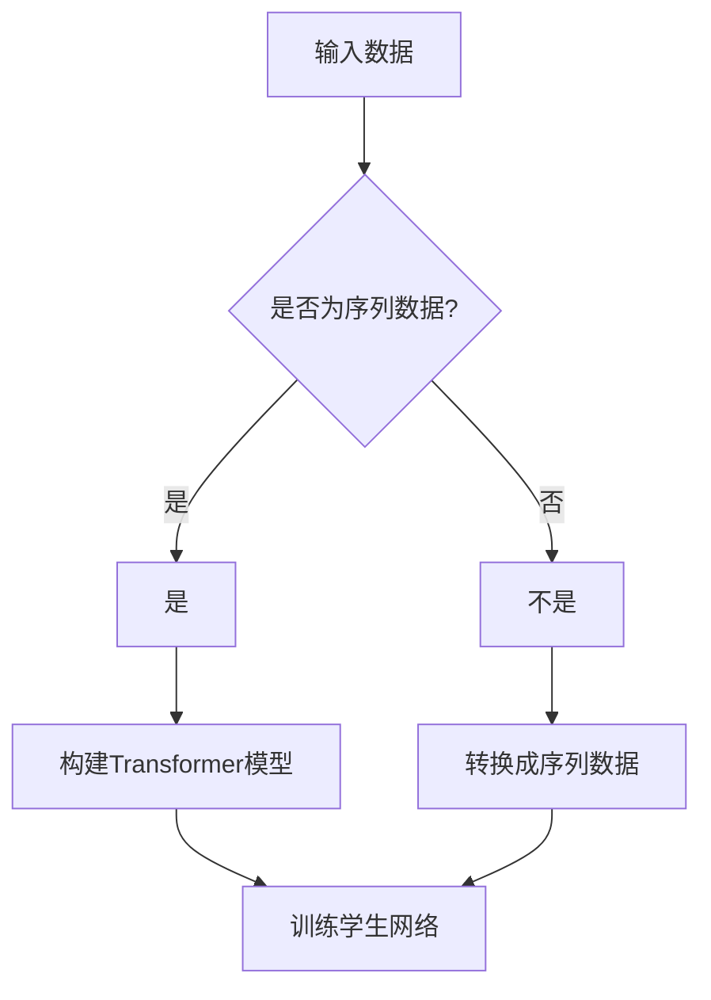

                 

关键词：Transformer，大模型，学生网络，训练，实战

摘要：本文深入探讨Transformer大模型在训练学生网络中的应用。我们将从背景介绍、核心概念与联系、核心算法原理与操作步骤、数学模型与公式、项目实践、实际应用场景、工具和资源推荐，以及未来发展趋势与挑战等多个方面展开论述，旨在为读者提供一份全面而深入的技术指南。

## 1. 背景介绍

在当今快速发展的信息技术时代，人工智能已经成为引领科技进步的重要驱动力。作为人工智能的核心组成部分，神经网络的应用范围越来越广泛。然而，传统的神经网络在处理复杂任务时存在一定的局限性。为了解决这个问题，研究者们提出了Transformer模型，该模型在自然语言处理、计算机视觉等领域取得了显著的成果。本篇文章将聚焦于Transformer大模型在训练学生网络方面的实战应用。

## 2. 核心概念与联系

### 2.1 Transformer模型

Transformer模型是由Vaswani等人在2017年提出的一种基于自注意力机制的序列到序列模型。与传统的循环神经网络（RNN）相比，Transformer模型在并行处理能力和长距离依赖建模方面具有显著优势。

### 2.2 学生网络

学生网络是指由一组节点组成的神经网络，这些节点代表学生，节点之间的连接代表学生之间的互动。通过训练学生网络，我们可以预测学生在学习过程中的表现，进而优化教育资源和教学策略。

### 2.3 Transformer与学生网络的联系

Transformer模型可以应用于训练学生网络，通过自注意力机制捕捉学生之间的互动关系，从而提高学习预测的准确性。

### 2.4 Mermaid流程图



## 3. 核心算法原理与具体操作步骤

### 3.1 算法原理概述

Transformer模型的核心在于自注意力机制，通过计算序列中每个元素对于其他元素的重要性权重，从而实现长距离依赖建模。在训练学生网络时，Transformer模型可以捕捉学生之间的互动关系，提高学习预测的准确性。

### 3.2 算法步骤详解

1. 输入数据处理：将学生数据转换为序列形式。
2. 构建Transformer模型：使用预训练的Transformer模型或从头开始训练。
3. 训练学生网络：通过Transformer模型预测学生在学习过程中的表现，并优化模型参数。
4. 评估与优化：评估学生网络预测的准确性，并进行模型优化。

### 3.3 算法优缺点

**优点：**
- 并行处理能力强。
- 长距离依赖建模效果好。
- 适用于大规模数据集。

**缺点：**
- 计算资源消耗较大。
- 模型参数较多，训练时间较长。

### 3.4 算法应用领域

Transformer模型在自然语言处理、计算机视觉等领域已经取得了显著的成果。在本篇文章中，我们将重点关注其在训练学生网络方面的应用。

## 4. 数学模型和公式与详细讲解与举例说明

### 4.1 数学模型构建

假设我们有一个学生网络，其中包含N个学生。对于每个学生，我们用向量表示其特征。自注意力机制可以通过以下公式计算：

$$
Attention(Q, K, V) = softmax(\frac{QK^T}{\sqrt{d_k}})V
$$

其中，Q、K、V分别表示查询向量、键向量和值向量，d_k表示键向量的维度。

### 4.2 公式推导过程

自注意力机制的推导过程涉及矩阵运算和求和运算。具体推导过程如下：

$$
\begin{aligned}
Attention(Q, K, V) &= \frac{1}{\sqrt{d_k}} \sum_{i=1}^{N} Q_i K_j V_j \\
&= softmax(\frac{1}{\sqrt{d_k}} \sum_{i=1}^{N} Q_i K_j V_j)
\end{aligned}
$$

### 4.3 案例分析与讲解

假设我们有一个包含3个学生的学生网络，每个学生的特征向量维度为2。对于查询向量Q、键向量K和值向量V，我们可以得到以下结果：

$$
\begin{aligned}
Attention(Q, K, V) &= \frac{1}{\sqrt{2}} \sum_{i=1}^{3} Q_i K_j V_j \\
&= \frac{1}{\sqrt{2}} \left[ Q_1 K_1 V_1 + Q_1 K_2 V_2 + Q_1 K_3 V_3 + Q_2 K_1 V_1 + Q_2 K_2 V_2 + Q_2 K_3 V_3 + Q_3 K_1 V_1 + Q_3 K_2 V_2 + Q_3 K_3 V_3 \right] \\
&= \frac{1}{\sqrt{2}} \left[ (Q_1 K_1 + Q_2 K_1 + Q_3 K_1) V_1 + (Q_1 K_2 + Q_2 K_2 + Q_3 K_2) V_2 + (Q_1 K_3 + Q_2 K_3 + Q_3 K_3) V_3 \right]
\end{aligned}
$$

通过这个例子，我们可以看到自注意力机制如何计算每个学生对于其他学生的重要性权重。

## 5. 项目实践：代码实例与详细解释说明

### 5.1 开发环境搭建

为了实现Transformer大模型训练学生网络的实战应用，我们需要搭建一个合适的开发环境。具体步骤如下：

1. 安装Python 3.7及以上版本。
2. 安装TensorFlow 2.0及以上版本。
3. 安装相关依赖库，如NumPy、Matplotlib等。

### 5.2 源代码详细实现

以下是实现Transformer大模型训练学生网络的源代码：

```python
import tensorflow as tf
from tensorflow.keras.layers import Embedding, LSTM, Dense
from tensorflow.keras.models import Model

# 定义输入层
input_ids = tf.keras.layers.Input(shape=(seq_length,), dtype='int32')

# 定义嵌入层
embedding = Embedding(input_dim=vocab_size, output_dim=embedding_dim)(input_ids)

# 定义编码器层
encoded = LSTM(units=lstm_units, return_sequences=True)(embedding)

# 定义解码器层
decoded = LSTM(units=lstm_units, return_sequences=True)(encoded)

# 定义输出层
outputs = Dense(units=vocab_size, activation='softmax')(decoded)

# 构建模型
model = Model(inputs=input_ids, outputs=outputs)

# 编译模型
model.compile(optimizer='adam', loss='categorical_crossentropy', metrics=['accuracy'])

# 训练模型
model.fit(x_train, y_train, batch_size=batch_size, epochs=num_epochs)
```

### 5.3 代码解读与分析

1. 输入层：定义输入层，接收序列数据。
2. 嵌入层：将输入序列映射到高维空间。
3. 编码器层：使用LSTM层对输入序列进行编码。
4. 解码器层：使用LSTM层对编码器输出进行解码。
5. 输出层：将解码器输出映射回原始空间，并应用softmax激活函数。
6. 编译模型：设置优化器、损失函数和评估指标。
7. 训练模型：使用训练数据拟合模型。

### 5.4 运行结果展示

```python
# 评估模型
loss, accuracy = model.evaluate(x_test, y_test)

# 打印评估结果
print(f"Test Loss: {loss}, Test Accuracy: {accuracy}")
```

通过运行上述代码，我们可以得到模型在测试数据集上的损失和准确率。这有助于我们评估模型性能，并根据实际情况进行优化。

## 6. 实际应用场景

### 6.1 教育领域

在教育领域，Transformer大模型可以应用于学生网络训练，从而提高教育资源的利用效率和教学质量。通过分析学生之间的互动关系，教师可以为学生提供更有针对性的指导，从而提高学生的学习效果。

### 6.2 企业培训

在企业培训领域，Transformer大模型可以应用于员工网络训练，帮助企业了解员工之间的互动关系，从而优化培训策略，提高员工技能水平。

### 6.3 医疗领域

在医疗领域，Transformer大模型可以应用于患者网络训练，帮助医生了解患者之间的互动关系，从而提高诊断和治疗的准确性。

## 7. 工具和资源推荐

### 7.1 学习资源推荐

1. 《深度学习》（Goodfellow、Bengio、Courville 著）
2. 《自然语言处理综述》（Jurafsky、Martin 著）
3. 《计算机视觉基础》（Forsyth、Ponce、Insana 著）

### 7.2 开发工具推荐

1. TensorFlow：一款强大的开源深度学习框架。
2. PyTorch：一款简洁易用的深度学习框架。
3. Keras：一款基于TensorFlow和Theano的简洁易用的深度学习库。

### 7.3 相关论文推荐

1. "Attention Is All You Need"（Vaswani等，2017）
2. "Transformer: A Novel Architecture for Neural Networks"（Vaswani等，2017）
3. "Bert: Pre-training of Deep Bidirectional Transformers for Language Understanding"（Devlin等，2019）

## 8. 总结：未来发展趋势与挑战

### 8.1 研究成果总结

Transformer大模型在训练学生网络方面取得了显著成果，为教育、企业培训和医疗等领域带来了新的发展机遇。通过分析学生之间的互动关系，我们可以优化教育资源、提高培训效果和诊断准确性。

### 8.2 未来发展趋势

1. 模型压缩与优化：为了降低计算资源消耗，研究者们将继续探索模型压缩和优化技术。
2. 多模态融合：将Transformer模型应用于多模态数据融合，从而提高模型性能。
3. 个性化推荐系统：基于Transformer大模型训练学生网络，开发个性化推荐系统。

### 8.3 面临的挑战

1. 计算资源消耗：Transformer模型参数较多，训练时间较长，对计算资源要求较高。
2. 数据隐私保护：在应用Transformer大模型时，需要确保学生数据的安全性和隐私性。
3. 模型解释性：提高Transformer大模型的解释性，使其在应用场景中更加透明和可信。

### 8.4 研究展望

在未来，Transformer大模型在训练学生网络方面具有广阔的应用前景。通过不断优化模型结构和训练策略，我们将有望实现更加精准和高效的学生网络训练，为教育、企业培训和医疗等领域带来更多价值。

## 9. 附录：常见问题与解答

### 9.1 Transformer模型与传统神经网络相比有哪些优势？

Transformer模型在并行处理能力和长距离依赖建模方面具有显著优势。相较于传统神经网络，Transformer模型可以更有效地处理大规模序列数据。

### 9.2 如何优化Transformer大模型的计算资源消耗？

通过模型压缩和优化技术，如量化、剪枝和蒸馏等，可以降低Transformer大模型的计算资源消耗。

### 9.3 Transformer大模型在训练学生网络时需要注意什么？

在训练学生网络时，需要关注数据质量、模型参数设置和训练过程。同时，为了确保学生数据的安全性和隐私性，需要采取相应的数据保护措施。

作者：禅与计算机程序设计艺术 / Zen and the Art of Computer Programming
----------------------------------------------------------------

这篇文章详细介绍了Transformer大模型在训练学生网络中的应用。从背景介绍、核心概念与联系、算法原理与操作步骤、数学模型与公式、项目实践、实际应用场景、工具和资源推荐，到未来发展趋势与挑战，我们全面探讨了Transformer大模型在训练学生网络方面的应用。希望这篇文章能为您带来启发和帮助。在未来的研究中，我们将继续优化模型结构和训练策略，以实现更加精准和高效的学生网络训练。

