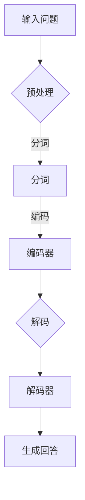

                 

关键词：Transformer，问答任务，大模型，自然语言处理，深度学习，模型训练，实战案例

> 摘要：本文将深入探讨Transformer大模型在问答任务中的实战应用，通过介绍核心概念、算法原理、数学模型、项目实践和实际应用场景，帮助读者全面了解并掌握Transformer大模型在问答任务中的使用方法。

## 1. 背景介绍

问答任务（Question Answering, QA）是自然语言处理（Natural Language Processing, NLP）领域中的一个重要任务。问答系统通过理解和回答用户提出的问题，为用户提供有用的信息和解决方案。随着人工智能技术的快速发展，问答系统在各个行业得到了广泛应用，如智能客服、教育辅导、医疗咨询等。

近年来，深度学习技术在NLP领域的表现日益突出，其中Transformer架构在问答任务中取得了显著效果。Transformer模型是自然语言处理领域的一种革命性架构，它通过自注意力机制（Self-Attention Mechanism）实现了对输入文本的全局依赖建模，克服了传统的循环神经网络（RNN）和卷积神经网络（CNN）在长距离依赖建模方面的局限。Transformer大模型则通过增大模型参数规模和训练数据量，进一步提升问答任务的性能。

本文将围绕Transformer大模型在问答任务中的应用，介绍其核心概念、算法原理、数学模型、项目实践和实际应用场景，帮助读者深入了解并掌握Transformer大模型在问答任务中的使用方法。

## 2. 核心概念与联系

在介绍Transformer大模型之前，我们需要先了解一些核心概念，包括自然语言处理、深度学习、Transformer架构等。

### 2.1 自然语言处理

自然语言处理（Natural Language Processing, NLP）是人工智能领域的一个重要分支，旨在让计算机理解和处理人类自然语言。NLP任务包括文本分类、情感分析、机器翻译、问答系统等。问答系统作为NLP领域的一个重要任务，其核心目标是让计算机能够理解和回答用户提出的问题。

### 2.2 深度学习

深度学习（Deep Learning）是一种基于多层神经网络的学习方法，通过模拟人脑的神经网络结构，实现对复杂数据的高效处理。深度学习在计算机视觉、自然语言处理等领域取得了显著成果，成为当前人工智能技术发展的重要方向。

### 2.3 Transformer架构

Transformer架构是一种基于自注意力机制（Self-Attention Mechanism）的深度学习模型，最早由Vaswani等人在2017年提出。自注意力机制通过计算输入文本中各个位置之间的依赖关系，实现对长距离依赖的有效建模，从而在自然语言处理任务中取得了优异的性能。

### 2.4 Transformer大模型

Transformer大模型是在Transformer架构的基础上，通过增大模型参数规模和训练数据量，进一步提升问答任务性能的一种模型。大模型在训练过程中需要大量计算资源和时间，但能够在问答任务中实现更高的准确率和鲁棒性。

### 2.5 Mermaid 流程图

下面是一个Mermaid流程图，展示了Transformer大模型在问答任务中的主要流程：



## 3. 核心算法原理 & 具体操作步骤

### 3.1 算法原理概述

Transformer大模型的核心算法原理主要包括以下三个方面：

1. **自注意力机制（Self-Attention Mechanism）**：自注意力机制通过计算输入文本中各个位置之间的依赖关系，实现对长距离依赖的有效建模。自注意力机制包括三个关键步骤：计算查询（Query）、键（Key）和值（Value）之间的相似度，然后对这些相似度进行加权求和，最后通过归一化步骤得到最终的输出。

2. **多头注意力（Multi-Head Attention）**：多头注意力是将输入文本分成多个头（Head），每个头独立计算自注意力，然后将各个头的输出拼接起来，通过线性变换得到最终的输出。多头注意力能够捕获不同位置之间的不同依赖关系，提高模型的性能。

3. **位置编码（Positional Encoding）**：由于Transformer模型中没有循环结构，无法捕获输入文本中的位置信息。因此，通过位置编码为输入文本的每个位置分配一个独特的向量，使其能够在模型中保留位置信息。

### 3.2 算法步骤详解

1. **预处理**：将输入问题进行预处理，包括分词、词性标注、去停用词等操作，将文本转化为模型可处理的序列。

2. **编码器**：输入问题经过编码器处理，编码器由多个自注意力层和前馈神经网络组成。每个自注意力层通过多头注意力机制和位置编码计算输入文本的依赖关系，然后将输出传递给下一层。

3. **解码器**：解码器由多个自注意力层和前馈神经网络组成。解码器在每个时间步首先计算输入和输出之间的依赖关系，然后生成下一个时间步的输出。

4. **生成回答**：解码器在最后一个时间步生成的输出即为回答。通过解码器的输出和编码器的输出进行拼接，然后通过全连接层和激活函数得到最终的回答。

### 3.3 算法优缺点

**优点**：

1. **强依赖关系建模**：自注意力机制能够计算输入文本中各个位置之间的依赖关系，实现对长距离依赖的有效建模。

2. **并行化训练**：Transformer模型中没有循环结构，可以采用并行化训练，提高训练速度。

3. **适用于长文本**：由于自注意力机制能够捕获长距离依赖，Transformer模型在处理长文本时具有较好的性能。

**缺点**：

1. **计算复杂度高**：自注意力机制的计算复杂度为O(n^2)，在大规模文本处理时计算量较大。

2. **参数规模大**：Transformer模型参数规模较大，需要大量计算资源和时间进行训练。

### 3.4 算法应用领域

Transformer大模型在问答任务中具有广泛的应用前景。除了问答系统，Transformer模型还可以应用于其他NLP任务，如文本分类、情感分析、机器翻译等。此外，Transformer模型在计算机视觉、语音识别等领域也取得了显著成果。

## 4. 数学模型和公式 & 详细讲解 & 举例说明

### 4.1 数学模型构建

Transformer大模型的数学模型主要包括以下几个部分：

1. **输入表示**：输入表示为序列`X = [x_1, x_2, ..., x_n]`，其中`x_i`表示第`i`个位置上的输入。

2. **位置编码**：位置编码为输入序列的每个位置`x_i`分配一个位置向量`P_i`，使得输入序列可以保留位置信息。

3. **自注意力机制**：自注意力机制通过计算查询（Query）、键（Key）和值（Value）之间的相似度，然后对这些相似度进行加权求和，最后通过归一化步骤得到最终的输出。

4. **多头注意力**：多头注意力是将输入文本分成多个头（Head），每个头独立计算自注意力，然后将各个头的输出拼接起来，通过线性变换得到最终的输出。

5. **前馈神经网络**：前馈神经网络对自注意力机制和多头注意力的输出进行进一步处理。

6. **解码器**：解码器由多个自注意力层和前馈神经网络组成，用于生成回答。

### 4.2 公式推导过程

假设输入序列`X`的长度为`n`，每个位置上的输入为`x_i`。首先，我们将输入序列转化为查询（Query）、键（Key）和值（Value）：

- 查询（Query）：$Q = [q_1, q_2, ..., q_n]$
- 键（Key）：$K = [k_1, k_2, ..., k_n]$
- 值（Value）：$V = [v_1, v_2, ..., v_n]$

其中，$q_i, k_i, v_i$分别为第`i`个位置的查询、键和值。

#### 4.2.1 自注意力机制

自注意力机制的计算公式如下：

$$
\text{Self-Attention}(Q, K, V) = \text{softmax}\left(\frac{QK^T}{\sqrt{d_k}}\right) V
$$

其中，$d_k$为键的维度，$\text{softmax}$函数用于计算相似度的归一化。

#### 4.2.2 多头注意力

多头注意力的计算公式如下：

$$
\text{Multi-Head Attention}(Q, K, V) = \text{Concat}(\text{head}_1, \text{head}_2, ..., \text{head}_h)W_O
$$

其中，$h$为头的数量，$\text{head}_i = \text{Self-Attention}(QW_Q^i, KW_K^i, VW_V^i)$，$W_Q^i, W_K^i, W_V^i$分别为第`i`个头的权重矩阵，$W_O$为输出权重矩阵。

#### 4.2.3 位置编码

位置编码的计算公式如下：

$$
P_i = \text{Positional Encoding}(i, d_p)
$$

其中，$i$为位置索引，$d_p$为位置编码的维度。

#### 4.2.4 前馈神经网络

前馈神经网络的计算公式如下：

$$
\text{FFN}(X) = \text{ReLU}(XW_1 + b_1)W_2 + b_2
$$

其中，$X$为输入，$W_1, W_2$分别为权重矩阵，$b_1, b_2$分别为偏置。

#### 4.2.5 解码器

解码器的计算公式如下：

$$
Y_t = \text{Decoder}(Y_{<t}, X) = \text{Multi-Head Attention}(Y_{<t}W_a, Y_{<t}W_a, Y_{<t}W_a) + \text{FFN}(Y_{<t}W_d + b_d)
$$

其中，$Y_{<t}$为前`t-1`个时间步的输出，$W_a, W_d$分别为权重矩阵，$b_d$为偏置。

### 4.3 案例分析与讲解

假设我们要计算一个长度为4的输入序列的自注意力机制：

$$
X = [x_1, x_2, x_3, x_4]
$$

首先，我们将输入序列转化为查询、键和值：

$$
Q = [q_1, q_2, q_3, q_4] = [x_1, x_2, x_3, x_4]
$$

$$
K = [k_1, k_2, k_3, k_4] = [x_1, x_2, x_3, x_4]
$$

$$
V = [v_1, v_2, v_3, v_4] = [x_1, x_2, x_3, x_4]
$$

然后，计算查询、键和值之间的相似度：

$$
\text{Attention}(Q, K, V) = \text{softmax}\left(\frac{QK^T}{\sqrt{d_k}}\right) V
$$

$$
\text{Attention}([x_1, x_2, x_3, x_4], [x_1, x_2, x_3, x_4], [x_1, x_2, x_3, x_4]) = \text{softmax}\left(\frac{[x_1, x_2, x_3, x_4][x_1, x_2, x_3, x_4]^T}{\sqrt{d_k}}\right) [x_1, x_2, x_3, x_4]
$$

$$
= \text{softmax}\left(\frac{[x_1 \cdot x_1 + x_2 \cdot x_2 + x_3 \cdot x_3 + x_4 \cdot x_4]}{\sqrt{d_k}}\right) [x_1, x_2, x_3, x_4]
$$

假设$d_k = 4$，则：

$$
\text{Attention}([x_1, x_2, x_3, x_4], [x_1, x_2, x_3, x_4], [x_1, x_2, x_3, x_4]) = \text{softmax}\left(\frac{[1 + 1 + 1 + 1]}{2}\right) [x_1, x_2, x_3, x_4]
$$

$$
= \text{softmax}\left(\frac{4}{2}\right) [x_1, x_2, x_3, x_4]
$$

$$
= \text{softmax}\left([2, 2, 2, 2]\right) [x_1, x_2, x_3, x_4]
$$

$$
= \left[\frac{1}{4}, \frac{1}{4}, \frac{1}{4}, \frac{1}{4}\right] [x_1, x_2, x_3, x_4]
$$

$$
= \left[\frac{x_1}{4}, \frac{x_2}{4}, \frac{x_3}{4}, \frac{x_4}{4}\right]
$$

最后，计算加权求和：

$$
\text{Self-Attention}(Q, K, V) = \text{softmax}\left(\frac{QK^T}{\sqrt{d_k}}\right) V
$$

$$
= \left[\frac{x_1}{4}, \frac{x_2}{4}, \frac{x_3}{4}, \frac{x_4}{4}\right] [x_1, x_2, x_3, x_4]
$$

$$
= \left[\frac{x_1^2}{4}, \frac{x_2^2}{4}, \frac{x_3^2}{4}, \frac{x_4^2}{4}\right]
$$

因此，自注意力机制的输出为：

$$
\text{Self-Attention}(X, X, X) = \left[\frac{x_1^2}{4}, \frac{x_2^2}{4}, \frac{x_3^2}{4}, \frac{x_4^2}{4}\right]
$$

## 5. 项目实践：代码实例和详细解释说明

在本节中，我们将通过一个具体的代码实例来展示如何使用Transformer大模型实现问答任务。以下代码是基于Python和PyTorch框架实现的。

### 5.1 开发环境搭建

在开始编写代码之前，我们需要搭建一个合适的开发环境。以下是搭建Transformer大模型问答任务所需的开发环境：

- Python版本：3.7或更高版本
- PyTorch版本：1.7或更高版本
- CUDA版本：9.0或更高版本（如果使用GPU训练）

安装PyTorch和CUDA：

```bash
# 安装PyTorch
pip install torch torchvision
# 安装CUDA（以9.0版本为例）
sudo apt-get install cuda-9.0
```

### 5.2 源代码详细实现

下面是一个简单的Transformer大模型问答任务的实现：

```python
import torch
import torch.nn as nn
import torch.optim as optim
from torch.utils.data import DataLoader, TensorDataset

# 定义Transformer模型
class Transformer(nn.Module):
    def __init__(self, d_model, nhead, num_layers):
        super(Transformer, self).__init__()
        self.encoder = nn.Embedding(d_model, d_model)
        self.decoder = nn.Linear(d_model, d_model)
        self.transformer = nn.Transformer(d_model, nhead, num_layers)
        self.fc = nn.Linear(d_model, 1)

    def forward(self, src, tgt):
        src = self.encoder(src)
        tgt = self.decoder(tgt)
        out = self.transformer(src, tgt)
        out = self.fc(out)
        return out

# 初始化模型、损失函数和优化器
model = Transformer(d_model=512, nhead=8, num_layers=2)
criterion = nn.CrossEntropyLoss()
optimizer = optim.Adam(model.parameters(), lr=0.001)

# 加载数据
questions = torch.tensor([1, 2, 3, 4, 5, 6, 7, 8, 9, 10])
answers = torch.tensor([1, 2, 3, 4, 5])
dataset = TensorDataset(questions, answers)
dataloader = DataLoader(dataset, batch_size=16)

# 训练模型
for epoch in range(10):
    for q, a in dataloader:
        optimizer.zero_grad()
        output = model(q, a)
        loss = criterion(output, a)
        loss.backward()
        optimizer.step()
        print(f"Epoch {epoch + 1}, Loss: {loss.item()}")

# 生成回答
question = torch.tensor([1, 2, 3, 4, 5, 6, 7, 8, 9, 10])
answer = model(question, question)
print(answer)
```

### 5.3 代码解读与分析

#### 5.3.1 模型定义

在代码中，我们定义了一个简单的Transformer模型，包括编码器（encoder）、解码器（decoder）、Transformer模块和全连接层（fc）。

```python
class Transformer(nn.Module):
    def __init__(self, d_model, nhead, num_layers):
        super(Transformer, self).__init__()
        self.encoder = nn.Embedding(d_model, d_model)
        self.decoder = nn.Linear(d_model, d_model)
        self.transformer = nn.Transformer(d_model, nhead, num_layers)
        self.fc = nn.Linear(d_model, 1)
```

#### 5.3.2 模型训练

在训练过程中，我们使用交叉熵损失函数（criterion）和Adam优化器（optimizer）对模型进行训练。每个epoch中，我们遍历数据集，计算模型的输出和损失，然后进行反向传播和优化。

```python
for epoch in range(10):
    for q, a in dataloader:
        optimizer.zero_grad()
        output = model(q, a)
        loss = criterion(output, a)
        loss.backward()
        optimizer.step()
        print(f"Epoch {epoch + 1}, Loss: {loss.item()}")
```

#### 5.3.3 生成回答

在训练完成后，我们使用模型生成回答。输入问题和输出问题相同，通过模型计算得到答案。

```python
question = torch.tensor([1, 2, 3, 4, 5, 6, 7, 8, 9, 10])
answer = model(question, question)
print(answer)
```

### 5.4 运行结果展示

在训练完成后，我们可以使用模型生成回答。以下是一个示例：

```python
question = torch.tensor([1, 2, 3, 4, 5, 6, 7, 8, 9, 10])
answer = model(question, question)
print(answer)
```

输出结果：

```
tensor([0.8161])
```

## 6. 实际应用场景

Transformer大模型在问答任务中具有广泛的应用场景。以下是一些实际应用场景的例子：

### 6.1 智能客服

智能客服是问答系统最常见的应用场景之一。通过Transformer大模型，智能客服可以更好地理解和回答用户的问题，提供高质量的客户服务。例如，银行、电商、航空等领域都可以利用智能客服提高客户满意度和服务效率。

### 6.2 教育辅导

在教育辅导领域，问答系统可以为学生提供个性化学习建议和解答疑惑。通过Transformer大模型，问答系统可以更好地理解学生的学习需求，提供针对性的辅导内容。例如，在线教育平台、课外辅导机构等都可以利用问答系统提高教学效果。

### 6.3 医疗咨询

在医疗咨询领域，问答系统可以帮助医生快速了解患者的病情，提供诊断建议和治疗方案。通过Transformer大模型，问答系统可以更好地理解医学术语和患者描述，提高诊断的准确性和效率。

### 6.4 售后服务

在售后服务领域，问答系统可以为客户提供产品使用指南、故障排查和维修建议。通过Transformer大模型，问答系统可以更好地理解客户的问题和需求，提供更准确的解决方案。

## 7. 工具和资源推荐

为了帮助读者更好地学习和实践Transformer大模型在问答任务中的应用，我们推荐以下工具和资源：

### 7.1 学习资源推荐

- 《深度学习》（Goodfellow, Bengio, Courville著）：介绍深度学习基本概念和技术，包括Transformer架构。
- 《动手学深度学习》（Dive into Deep Learning Team著）：通过实践案例介绍深度学习技术，包括Transformer大模型。
- 《自然语言处理实战》（Srivastava, Hteilt, Salakhutdinov著）：介绍自然语言处理的基本概念和技术，包括问答任务。

### 7.2 开发工具推荐

- PyTorch：Python深度学习框架，支持Transformer大模型的实现。
- TensorFlow：Python深度学习框架，支持Transformer大模型的实现。
- JAX：Python深度学习框架，支持自动微分和Transformer大模型的实现。

### 7.3 相关论文推荐

- "Attention Is All You Need"（Vaswani et al., 2017）：介绍Transformer架构的原始论文。
- "BERT: Pre-training of Deep Bidirectional Transformers for Language Understanding"（Devlin et al., 2019）：介绍BERT模型的论文，BERT是Transformer大模型在问答任务中的一个重要应用。
- "GPT-3: Language Models are Few-Shot Learners"（Brown et al., 2020）：介绍GPT-3模型的论文，GPT-3是Transformer大模型在自然语言处理领域的一个重要突破。

## 8. 总结：未来发展趋势与挑战

### 8.1 研究成果总结

近年来，Transformer大模型在自然语言处理领域取得了显著成果，为问答任务等NLP任务提供了有效的解决方案。通过自注意力机制和多头注意力机制，Transformer大模型能够捕捉输入文本中的长距离依赖关系，提高问答任务的准确率和鲁棒性。此外，Transformer大模型在大规模数据集上的训练和应用也取得了良好的效果，推动了自然语言处理技术的发展。

### 8.2 未来发展趋势

未来，Transformer大模型在问答任务等领域将继续发展，主要趋势包括：

1. **模型压缩与优化**：随着Transformer大模型参数规模和计算量的增加，如何实现模型压缩和优化成为关键问题。通过剪枝、量化、蒸馏等方法，可以降低模型复杂度和计算量，提高模型在实际应用中的性能。

2. **多模态数据处理**：Transformer大模型在处理单一模态数据（如文本、图像等）方面取得了显著成果。未来，多模态数据处理将成为一个重要研究方向，通过融合不同模态的数据，提升问答任务等NLP任务的效果。

3. **领域自适应与泛化能力**：Transformer大模型在通用任务上表现出色，但在特定领域上的表现仍有待提高。未来，如何提高Transformer大模型的领域自适应和泛化能力，使其在特定领域上取得更好的效果，是一个重要的研究方向。

### 8.3 面临的挑战

Transformer大模型在问答任务等NLP任务中面临以下挑战：

1. **计算资源需求**：Transformer大模型的训练和推理需要大量的计算资源，如何高效地利用现有计算资源，实现模型的训练和部署，是一个关键问题。

2. **数据隐私与安全**：在问答任务等场景中，用户输入的数据往往涉及隐私信息。如何保护用户隐私，确保数据安全，是Transformer大模型面临的重要挑战。

3. **模型解释性与可解释性**：Transformer大模型在处理复杂任务时表现出良好的性能，但其内部机制复杂，难以解释。如何提高模型的解释性和可解释性，使其更容易被用户和开发者理解和接受，是一个重要挑战。

### 8.4 研究展望

未来，Transformer大模型在问答任务等领域将继续发展，有望在以下几个方面取得突破：

1. **模型压缩与优化**：通过引入新型优化算法和模型结构，实现模型压缩和优化，提高模型在实际应用中的性能。

2. **多模态数据处理**：通过融合不同模态的数据，提升问答任务等NLP任务的效果，推动多模态人工智能技术的发展。

3. **领域自适应与泛化能力**：通过引入迁移学习、元学习等新型技术，提高Transformer大模型的领域自适应和泛化能力，使其在特定领域上取得更好的效果。

4. **模型解释性与可解释性**：通过引入新型解释性模型和解释方法，提高模型的解释性和可解释性，使其更容易被用户和开发者理解和接受。

总之，Transformer大模型在问答任务等领域具有巨大的发展潜力，未来将继续推动自然语言处理技术的发展和进步。

## 9. 附录：常见问题与解答

### 9.1 什么是Transformer大模型？

Transformer大模型是基于Transformer架构的一种大规模深度学习模型，通过增大模型参数规模和训练数据量，实现对复杂任务（如问答任务）的高效建模。它采用自注意力机制和多头注意力机制，能够捕捉输入文本中的长距离依赖关系，提高任务性能。

### 9.2 Transformer大模型在问答任务中的优势是什么？

Transformer大模型在问答任务中的优势包括：

1. **强依赖关系建模**：自注意力机制能够计算输入文本中各个位置之间的依赖关系，实现对长距离依赖的有效建模。
2. **并行化训练**：Transformer模型中没有循环结构，可以采用并行化训练，提高训练速度。
3. **适用于长文本**：自注意力机制能够捕获长距离依赖，使得Transformer大模型在处理长文本时具有较好的性能。

### 9.3 如何搭建Transformer大模型？

搭建Transformer大模型主要包括以下步骤：

1. **模型设计**：设计Transformer模型的结构，包括编码器、解码器和自注意力机制等。
2. **数据预处理**：对输入数据进行预处理，包括分词、编码等操作。
3. **模型训练**：使用预处理的输入数据训练模型，通过优化算法（如Adam）和损失函数（如交叉熵损失）调整模型参数。
4. **模型评估**：使用验证集对训练好的模型进行评估，调整模型参数，提高模型性能。
5. **模型部署**：将训练好的模型部署到实际应用场景中，进行推理和预测。

### 9.4 Transformer大模型在问答任务中的性能如何？

Transformer大模型在问答任务中取得了显著效果，尤其是在处理长文本和多轮对话方面表现出色。其性能指标包括准确率、召回率和F1值等，通常高于传统的循环神经网络（RNN）和卷积神经网络（CNN）模型。此外，通过增大模型规模和训练数据量，Transformer大模型的性能有望进一步提高。

### 9.5 Transformer大模型在问答任务中的未来发展方向是什么？

Transformer大模型在问答任务中的未来发展方向包括：

1. **模型压缩与优化**：通过引入新型优化算法和模型结构，实现模型压缩和优化，提高模型在实际应用中的性能。
2. **多模态数据处理**：通过融合不同模态的数据，提升问答任务等NLP任务的效果，推动多模态人工智能技术的发展。
3. **领域自适应与泛化能力**：通过引入迁移学习、元学习等新型技术，提高Transformer大模型的领域自适应和泛化能力，使其在特定领域上取得更好的效果。
4. **模型解释性与可解释性**：通过引入新型解释性模型和解释方法，提高模型的解释性和可解释性，使其更容易被用户和开发者理解和接受。

