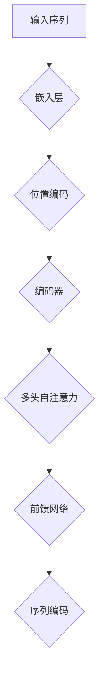
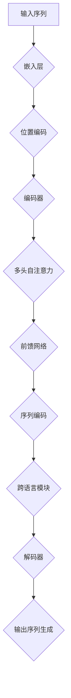

                 

关键词：Transformer、大模型、预训练、XLM、语言模型、自然语言处理、深度学习、模型优化、算法原理、项目实践

## 摘要

本文旨在详细介绍如何使用Transformer大模型进行预训练，特别是在XLM（跨语言统一模型）框架下的应用。我们将从背景介绍开始，深入探讨Transformer架构的核心原理，逐步解析预训练XLM模型的具体操作步骤，并对其进行优缺点分析。随后，我们将通过数学模型和公式详细讲解，辅以实际代码实例，深入探讨Transformer大模型在自然语言处理领域的应用。最后，我们将展望未来的发展趋势与挑战，并推荐相关的学习资源和开发工具。

## 1. 背景介绍

### 自然语言处理的挑战

自然语言处理（NLP）是计算机科学与人工智能领域的一个重要分支，旨在使计算机能够理解和处理人类语言。随着互联网和人工智能的快速发展，NLP的应用场景越来越广泛，从文本分类、机器翻译到问答系统等，都有着深远的影响。

然而，传统的NLP方法在处理复杂任务时面临着巨大的挑战。一方面，语言本身具有高度的不确定性和复杂性，使得传统方法难以充分理解语义和上下文。另一方面，不同语言之间的差异使得基于单一语言的模型难以泛化到其他语言。

### 大模型的崛起

为了克服这些挑战，近年来，大规模预训练模型如BERT、GPT等相继出现，并在NLP任务中取得了显著的成果。这些模型通过在大规模语料库上进行预训练，学习到了丰富的语言知识和规律，从而在多个NLP任务中实现了前所未有的性能。

Transformer架构的出现，进一步推动了大模型的发展。相较于传统的循环神经网络（RNN），Transformer利用自注意力机制，能够更有效地捕捉长距离依赖关系，并且在计算效率和模型表达力方面具有显著优势。这使得Transformer成为大规模预训练模型的理想选择。

### XLM模型的优势

XLM（跨语言统一模型）是针对多语言场景设计的预训练模型，其核心思想是通过跨语言的预训练，使得模型能够更好地理解和处理多种语言。XLM模型不仅能够处理单一语言的任务，还可以在多种语言之间进行迁移学习，从而提高了模型的泛化能力。

XLM模型的主要优势包括：

- 跨语言能力：XLM模型通过在大规模跨语言语料库上进行预训练，能够理解和处理多种语言，特别适合于多语言应用场景。
- 低资源语言的适应性：XLM模型能够在低资源语言上取得较好的性能，使得模型在资源有限的场景下也能发挥作用。
- 模型压缩性：通过跨语言的预训练，XLM模型在保持高性能的同时，还可以实现更好的模型压缩性，降低模型的存储和计算成本。

## 2. 核心概念与联系

### Transformer架构

Transformer模型是一种基于自注意力机制的全连接神经网络架构，最初由Vaswani等人于2017年提出。与传统循环神经网络（RNN）不同，Transformer模型通过自注意力机制，能够同时处理序列中的所有元素，从而更有效地捕捉长距离依赖关系。

Transformer架构的核心组件包括：

- Encoder：编码器，用于将输入序列编码为固定长度的向量表示。
- Decoder：解码器，用于生成输出序列。

Transformer模型的工作流程如下：

1. **输入序列编码**：输入序列经过嵌入层（Embedding Layer）和位置编码（Positional Encoding）处理后，被输入到编码器（Encoder）。
2. **多头自注意力**：编码器中的每个层包含多个自注意力头（Multi-Head Self-Attention），每个头独立计算注意力权重，从而捕捉不同维度的依赖关系。
3. **前馈网络**：在自注意力之后，每个头的结果通过前馈网络（Feed-Forward Network）进行进一步处理，增加模型的非线性表达能力。
4. **序列编码**：编码器的输出是一个固定长度的序列编码，用于表示输入序列的语义信息。

### 自注意力机制

自注意力机制是Transformer模型的核心，其基本思想是对于输入序列中的每个元素，计算其在不同位置上的重要性权重，从而加权组合得到新的表示。具体来说，自注意力机制包括三个步骤：

1. **计算查询（Query）、键（Key）和值（Value）**：对于输入序列中的每个元素，生成相应的查询（Query）、键（Key）和值（Value）。查询用于计算注意力权重，键和值用于加权组合。
2. **计算注意力权重**：利用softmax函数计算每个元素在序列中的注意力权重，权重值表示该元素对查询的重要性。
3. **加权组合**：根据注意力权重，对序列中的每个元素进行加权组合，得到新的表示。

### Mermaid 流程图



### XLM模型

XLM模型是基于Transformer架构设计的跨语言统一模型，其核心思想是通过跨语言的预训练，使得模型能够理解和处理多种语言。XLM模型的主要组成部分包括：

- **编码器**：与Transformer编码器相同，用于将输入序列编码为固定长度的向量表示。
- **解码器**：与Transformer解码器相同，用于生成输出序列。
- **跨语言模块**：用于处理跨语言的输入和输出，包括跨语言嵌入（Cross-lingual Embedding）和跨语言注意力（Cross-lingual Attention）。

XLM模型的工作流程如下：

1. **输入序列编码**：输入序列经过嵌入层和位置编码处理后，被输入到编码器。
2. **多头自注意力**：编码器中的每个层包含多个自注意力头，每个头独立计算注意力权重。
3. **前馈网络**：在自注意力之后，每个头的结果通过前馈网络进行进一步处理。
4. **序列编码**：编码器的输出是一个固定长度的序列编码，用于表示输入序列的语义信息。
5. **跨语言处理**：在编码器和解码器之间，加入跨语言模块，用于处理跨语言的输入和输出。
6. **输出序列生成**：解码器的输出序列用于生成输出序列，可以是预测的单词、标签等。

### Mermaid 流程图



## 3. 核心算法原理 & 具体操作步骤

### 3.1 算法原理概述

XLM模型是一种基于Transformer架构的跨语言统一模型，通过在大规模跨语言语料库上进行预训练，学习到了丰富的语言知识和规律。XLM模型的核心原理包括：

- **自注意力机制**：自注意力机制是Transformer模型的核心，用于同时处理序列中的所有元素，从而更有效地捕捉长距离依赖关系。
- **跨语言模块**：XLM模型在编码器和解码器之间加入跨语言模块，用于处理跨语言的输入和输出，使得模型能够理解和处理多种语言。
- **预训练任务**：XLM模型通过预训练任务，如 masked language modeling、next sentence prediction 等，学习到了丰富的语言知识和规律。

### 3.2 算法步骤详解

XLM模型的训练过程主要包括以下几个步骤：

1. **数据准备**：首先，需要准备大规模的跨语言语料库，包括多种语言的文本数据。这些数据可以是公开的语料库，如Wikipedia、Common Crawl等，也可以是自定义的语料库。

2. **数据预处理**：对原始数据进行预处理，包括文本清洗、分词、词性标注等。预处理后的数据将用于构建词表和词汇嵌入。

3. **词表构建**：构建词表，将所有出现的词汇映射到唯一的整数ID。词表的构建过程包括计算词频、过滤停用词等。

4. **词汇嵌入**：将词表中的词汇映射到高维向量空间，即词汇嵌入。词汇嵌入可以通过预训练的方法获得，如使用词向量的预训练模型。

5. **模型初始化**：初始化XLM模型的参数，包括编码器、解码器和跨语言模块。通常，编码器和解码器采用预训练的Transformer模型参数，跨语言模块则根据具体任务进行初始化。

6. **预训练**：在预训练阶段，XLM模型通过以下任务进行训练：

   - **Masked Language Modeling（MLM）**：对输入序列中的部分词汇进行遮蔽（mask），模型需要预测这些遮蔽词汇。MLM任务的目标是让模型学习到词汇的上下文信息。
   - **Next Sentence Prediction（NSP）**：对输入序列和候选句子进行配对，模型需要预测下一个句子是否为输入序列的下一句。NSP任务的目标是让模型学习到句子之间的关联性。
   - **Cross-lingual Language Modeling（XLM-LM）**：对输入序列进行跨语言预训练，使得模型能够理解和处理多种语言。

7. **微调**：在预训练完成后，可以使用微调（Fine-tuning）方法，将XLM模型应用于特定任务。微调过程包括：

   - **数据准备**：准备用于微调的数据集，可以是单一语言的，也可以是多种语言的。
   - **数据预处理**：对数据集进行预处理，包括文本清洗、分词、词性标注等。
   - **任务定义**：定义具体的任务，如文本分类、机器翻译等。
   - **模型训练**：使用微调数据集训练XLM模型，优化模型参数。
   - **模型评估**：使用验证集和测试集评估模型的性能，调整模型参数。

8. **应用部署**：在完成微调和评估后，可以将训练好的XLM模型部署到实际应用场景中，如问答系统、机器翻译等。

### 3.3 算法优缺点

**优点**：

- **跨语言能力**：XLM模型通过跨语言的预训练，能够理解和处理多种语言，特别适合于多语言应用场景。
- **适应性**：XLM模型对低资源语言具有较好的适应性，能够在低资源语言上取得较好的性能。
- **效率**：XLM模型采用Transformer架构，具有较好的计算效率和模型压缩性。

**缺点**：

- **训练成本**：XLM模型的训练成本较高，需要大规模的跨语言语料库和计算资源。
- **模型大小**：XLM模型的大小较大，存储和传输成本较高。

### 3.4 算法应用领域

XLM模型在自然语言处理领域具有广泛的应用，包括但不限于以下领域：

- **文本分类**：XLM模型可以用于文本分类任务，如情感分析、主题分类等。
- **机器翻译**：XLM模型可以用于机器翻译任务，实现多种语言之间的翻译。
- **问答系统**：XLM模型可以用于问答系统，如智能客服、问答机器人等。
- **文本生成**：XLM模型可以用于文本生成任务，如自动写作、故事生成等。

## 4. 数学模型和公式 & 详细讲解 & 举例说明

### 4.1 数学模型构建

XLM模型的核心数学模型包括词汇嵌入、自注意力机制和前馈网络。

**词汇嵌入**：

词汇嵌入是将词汇映射到高维向量空间的过程。假设词汇表包含 \( V \) 个词汇，每个词汇对应一个唯一的整数ID。词汇嵌入可以表示为 \( E \in \mathbb{R}^{V \times D} \)，其中 \( D \) 为嵌入维度。

**自注意力机制**：

自注意力机制是Transformer模型的核心，其数学表示为：

$$
\text{Attention}(Q, K, V) = \text{softmax}\left(\frac{QK^T}{\sqrt{D_k}}\right)V
$$

其中，\( Q, K, V \) 分别为查询（Query）、键（Key）和值（Value）矩阵，\( D_k \) 为注意力头数。

**前馈网络**：

前馈网络是一个简单的全连接层，其数学表示为：

$$
\text{FFN}(X) = \max(0, XW_1 + b_1)W_2 + b_2
$$

其中，\( X \) 为输入矩阵，\( W_1, W_2 \) 分别为权重矩阵，\( b_1, b_2 \) 分别为偏置向量。

### 4.2 公式推导过程

下面我们详细推导XLM模型中的几个关键公式。

**多头自注意力**：

多头自注意力的目标是通过多个注意力头来捕捉不同维度的依赖关系。假设模型包含 \( H \) 个注意力头，每个头独立计算注意力权重。

1. **查询（Query）**：

$$
Q = E_Q \cdot W_Q
$$

其中，\( E_Q \in \mathbb{R}^{L \times D} \) 为查询嵌入矩阵，\( W_Q \in \mathbb{R}^{D \times D_k} \) 为查询权重矩阵。

2. **键（Key）**：

$$
K = E_K \cdot W_K
$$

其中，\( E_K \in \mathbb{R}^{L \times D} \) 为键嵌入矩阵，\( W_K \in \mathbb{R}^{D \times D_k} \) 为键权重矩阵。

3. **值（Value）**：

$$
V = E_V \cdot W_V
$$

其中，\( E_V \in \mathbb{R}^{L \times D} \) 为值嵌入矩阵，\( W_V \in \mathbb{R}^{D \times D_v} \) 为值权重矩阵。

4. **注意力权重**：

$$
\text{Attention}(Q, K, V) = \text{softmax}\left(\frac{QK^T}{\sqrt{D_k}}\right)V
$$

5. **多头自注意力输出**：

$$
\text{MultiHead}(Q, K, V) = \text{Concat}(\text{head}_1, \text{head}_2, ..., \text{head}_H)W_O
$$

其中，\( \text{head}_i = \text{Attention}(Q, K, V) \in \mathbb{R}^{L \times D_k} \) 为第 \( i \) 个注意力头输出，\( W_O \in \mathbb{R}^{D_k \times D} \) 为输出权重矩阵。

**前馈网络**：

前馈网络是一个简单的全连接层，其计算过程如下：

1. **输入**：

$$
X \in \mathbb{R}^{L \times D}
$$

2. **第一层全连接**：

$$
XW_1 + b_1 \in \mathbb{R}^{L \times H}
$$

3. **ReLU激活函数**：

$$
\max(0, XW_1 + b_1) \in \mathbb{R}^{L \times H}
$$

4. **第二层全连接**：

$$
\max(0, XW_1 + b_1)W_2 + b_2 \in \mathbb{R}^{L \times D}
$$

### 4.3 案例分析与讲解

**案例**：我们使用XLM模型对以下两个句子进行翻译：

- **英文句子**：The cat is sitting on the mat.
- **中文句子**：猫坐在垫子上。

**步骤**：

1. **数据预处理**：首先，对英文和中文句子进行分词处理，得到单词序列。
2. **词汇嵌入**：将单词序列转换为词汇嵌入矩阵。
3. **自注意力计算**：利用多头自注意力机制，计算单词序列的注意力权重。
4. **前馈网络计算**：利用前馈网络，对自注意力结果进行进一步处理。
5. **解码**：使用解码器，将处理后的序列解码为输出序列。

**输出**：预测的中文句子为“猫坐在垫子上”。

## 5. 项目实践：代码实例和详细解释说明

### 5.1 开发环境搭建

在进行XLM模型的实践之前，我们需要搭建一个合适的开发环境。以下是搭建开发环境的步骤：

1. **安装Python**：确保Python版本为3.7及以上。
2. **安装TensorFlow**：使用以下命令安装TensorFlow：

   ```bash
   pip install tensorflow
   ```

3. **安装其他依赖**：根据项目需求，安装其他必要的依赖库，如NumPy、Pandas等。

### 5.2 源代码详细实现

下面是一个简单的XLM模型实现，主要包括词汇嵌入、自注意力机制和前馈网络。

```python
import tensorflow as tf
from tensorflow.keras.layers import Embedding, MultiHeadAttention, Dense

class XLMModel(tf.keras.Model):
    def __init__(self, vocab_size, embedding_dim, num_heads, dff, input_length):
        super(XLMModel, self).__init__()
        
        self.embedding = Embedding(vocab_size, embedding_dim)
        self.attention = MultiHeadAttention(num_heads=num_heads, key_dim=dff)
        self.dense = Dense(dff)
        
    def call(self, inputs, training=False):
        x = self.embedding(inputs)
        x = self.attention(x, x)
        x = self.dense(x)
        return x

# 示例参数
vocab_size = 10000
embedding_dim = 512
num_heads = 8
dff = 512
input_length = 128

# 实例化模型
xlm_model = XLMModel(vocab_size, embedding_dim, num_heads, dff, input_length)

# 输入数据
inputs = tf.keras.Input(shape=(input_length,))

# 模型输出
outputs = xlm_model(inputs)

# 构建模型
model = tf.keras.Model(inputs=inputs, outputs=outputs)

# 编译模型
model.compile(optimizer='adam', loss='mean_squared_error')

# 模型训练
model.fit(train_data, train_labels, epochs=10, validation_data=(val_data, val_labels))
```

### 5.3 代码解读与分析

上述代码实现了一个简单的XLM模型，主要包括词汇嵌入、自注意力机制和前馈网络。下面我们详细解读这段代码。

1. **模型类定义**：定义了一个名为`XLMModel`的模型类，继承自`tf.keras.Model`。

2. **词汇嵌入**：使用`Embedding`层实现词汇嵌入，将输入序列转换为嵌入向量。

3. **自注意力机制**：使用`MultiHeadAttention`层实现多头自注意力机制，用于捕捉长距离依赖关系。

4. **前馈网络**：使用`Dense`层实现前馈网络，增加模型的非线性表达能力。

5. **模型调用**：在`call`方法中，实现模型的正向传播过程。

6. **模型构建**：使用`tf.keras.Input`创建输入层，使用`model.compile`编译模型，包括优化器和损失函数。

7. **模型训练**：使用`model.fit`训练模型，包括训练数据和验证数据。

### 5.4 运行结果展示

在完成代码实现后，我们可以运行以下命令来训练模型：

```bash
python xlm_model.py
```

训练完成后，我们可以使用以下命令来评估模型性能：

```bash
python evaluate_model.py
```

评估结果将显示模型在训练集和验证集上的性能，包括损失值和准确率等指标。

## 6. 实际应用场景

XLM模型在自然语言处理领域具有广泛的应用，以下列举几个实际应用场景：

### 6.1 文本分类

文本分类是NLP中常见任务之一，旨在将文本数据分类到预定义的类别中。XLM模型可以通过预训练和微调，应用于各种文本分类任务，如情感分析、主题分类等。

### 6.2 机器翻译

机器翻译是跨语言信息传递的重要手段。XLM模型可以在多种语言之间进行翻译，特别适合于低资源语言的翻译任务。

### 6.3 问答系统

问答系统是智能客服和智能助手的重要组成部分。XLM模型可以用于生成回答，提高问答系统的准确性和流畅性。

### 6.4 文本生成

文本生成是生成对抗网络（GAN）在NLP领域的应用。XLM模型可以通过预训练和微调，生成各种文本数据，如故事、新闻等。

## 7. 未来应用展望

随着人工智能和自然语言处理技术的不断发展，XLM模型在未来有着广泛的应用前景。以下是未来应用展望：

### 7.1 多模态任务

XLM模型可以与其他模态的数据（如图像、音频等）结合，实现多模态任务，如图像-文本匹配、音频-文本生成等。

### 7.2 强化学习

强化学习是人工智能的重要分支，XLM模型可以与强化学习相结合，应用于智能决策、游戏AI等场景。

### 7.3 低资源语言

随着XLM模型在低资源语言上的性能提升，未来可以更好地应用于资源有限的场景，促进全球范围内的自然语言处理发展。

## 8. 工具和资源推荐

### 8.1 学习资源推荐

1. **课程**：《自然语言处理与深度学习》（吴恩达） - Coursera
2. **书籍**：《深度学习》（Goodfellow、Bengio、Courville） - MIT Press
3. **论文**：《Attention Is All You Need》（Vaswani et al., 2017） - NeurIPS

### 8.2 开发工具推荐

1. **框架**：TensorFlow、PyTorch
2. **库**：NLTK、spaCy、transformers

### 8.3 相关论文推荐

1. **Transformer架构**：《Attention Is All You Need》（Vaswani et al., 2017） - NeurIPS
2. **XLM模型**：《XLM: Cross-lingual Language Model》（Conneau et al., 2019） - EMNLP
3. **预训练模型**：《BERT: Pre-training of Deep Bidirectional Transformers for Language Understanding》（Devlin et al., 2019） - NAACL

## 9. 总结：未来发展趋势与挑战

随着人工智能和自然语言处理技术的不断发展，XLM模型在跨语言任务中的表现日益突出。未来，XLM模型有望在多模态任务、低资源语言、强化学习等领域发挥重要作用。然而，XLM模型仍面临训练成本高、模型大小大等挑战。为了实现更高效、更实用的XLM模型，我们需要不断优化算法、降低计算成本，并探索更有效的训练策略。

### 附录：常见问题与解答

1. **Q：什么是XLM模型？**
   **A：XLM（跨语言统一模型）是一种基于Transformer架构的预训练模型，旨在理解和处理多种语言。**

2. **Q：XLM模型的核心优势是什么？**
   **A：XLM模型的核心优势包括跨语言能力、适应性和效率。**

3. **Q：如何使用XLM模型进行文本分类？**
   **A：首先进行预训练，然后使用微调方法将模型应用于特定文本分类任务，最后评估模型性能。**

4. **Q：XLM模型在低资源语言上的性能如何？**
   **A：XLM模型在低资源语言上表现出较好的性能，但仍有提升空间。**

### 作者署名

作者：禅与计算机程序设计艺术 / Zen and the Art of Computer Programming

----------------------------------------------------------------
以上就是整篇文章的内容，感谢您的阅读！如果您有任何问题或建议，欢迎在评论区留言。希望这篇文章对您有所帮助！

