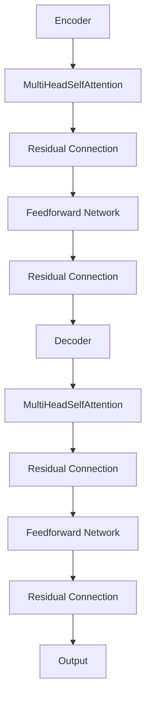

                 

关键词：Transformer、大模型、预训练策略、深度学习、神经网络、自然语言处理、机器学习

摘要：本文将详细介绍Transformer大模型的预训练策略，包括其核心概念、算法原理、数学模型、具体操作步骤、实际应用场景等，旨在帮助读者深入理解并掌握这一前沿技术。

## 1. 背景介绍

随着深度学习的迅猛发展，神经网络在图像识别、语音识别等领域取得了显著成果。然而，在自然语言处理（NLP）领域，传统循环神经网络（RNN）和卷积神经网络（CNN）却面临诸多挑战。为了克服这些限制，Google提出了Transformer模型，一种基于自注意力机制的全新架构。Transformer模型在多个NLP任务中取得了突破性成果，成为当前最流行的NLP模型之一。本文将围绕Transformer大模型的预训练策略展开讨论，以期帮助读者更好地理解和应用这一技术。

## 2. 核心概念与联系

### 2.1 Transformer模型概述

Transformer模型是一种基于自注意力（Self-Attention）机制的深度学习模型，由Google在2017年提出。与传统循环神经网络（RNN）和卷积神经网络（CNN）相比，Transformer模型在处理长序列和并行计算方面具有显著优势。其基本架构包括编码器（Encoder）和解码器（Decoder）两个部分，分别负责输入序列和输出序列的处理。

### 2.2 自注意力机制

自注意力（Self-Attention）是Transformer模型的核心组件。自注意力机制允许模型在处理每个词时，自动计算其与序列中其他词的相关性，从而实现全局依赖关系的建模。自注意力机制的数学描述如下：

$$
\text{Attention}(Q, K, V) = \text{softmax}\left(\frac{QK^T}{\sqrt{d_k}}\right)V
$$

其中，$Q$、$K$和$V$分别表示查询（Query）、键（Key）和值（Value）向量，$d_k$为键向量的维度。通过自注意力机制，模型可以自动学习输入序列中各词之间的关系，提高模型的表示能力。

### 2.3 Transformer模型架构

Transformer模型的架构包括编码器（Encoder）和解码器（Decoder）两个部分，分别对应输入序列和输出序列的处理。编码器和解码器均由多个相同的基本模块（Block）组成，每个模块包含自注意力层（Self-Attention Layer）、前馈网络（Feedforward Network）和残差连接（Residual Connection）。

### 2.4 Mermaid流程图

以下是一个简化的Transformer模型架构的Mermaid流程图：



## 3. 核心算法原理 & 具体操作步骤

### 3.1 算法原理概述

Transformer模型的核心算法原理主要包括自注意力机制和多头注意力机制。自注意力机制允许模型在处理每个词时，自动计算其与序列中其他词的相关性；多头注意力机制则通过将输入序列分成多个子序列，提高模型的表示能力。

### 3.2 算法步骤详解

#### 3.2.1 自注意力层

自注意力层的输入为一个三维张量$X \in \mathbb{R}^{N \times L \times D}$，其中$N$为序列长度，$L$为词汇表大小，$D$为嵌入维度。自注意力层的输出为一个三维张量$Y \in \mathbb{R}^{N \times L \times D'}$，其中$D'$为输出维度。

自注意力层的具体步骤如下：

1. 计算查询（Query）、键（Key）和值（Value）向量：

$$
Q = XW_Q, \quad K = XW_K, \quad V = XW_V
$$

其中$W_Q, W_K, W_V \in \mathbb{R}^{D \times D'}$为权重矩阵。

2. 计算自注意力分数：

$$
\text{Score} = \text{Attention}(Q, K, V) = \text{softmax}\left(\frac{QK^T}{\sqrt{d_k}}\right)V
$$

3. 计算自注意力输出：

$$
Y = \text{Score}V
$$

#### 3.2.2 多头注意力层

多头注意力层通过将输入序列分成多个子序列，提高模型的表示能力。假设$H$为多头注意力的数量，每个子序列的维度为$\frac{D'}{H}$。

多头注意力层的具体步骤如下：

1. 计算每个子序列的查询（Query）、键（Key）和值（Value）向量：

$$
Q_i = XW_{Q_i}, \quad K_i = XW_{K_i}, \quad V_i = XW_{V_i}
$$

其中$W_{Q_i}, W_{K_i}, W_{V_i} \in \mathbb{R}^{D \times \frac{D'}{H}}$为权重矩阵。

2. 计算每个子序列的自注意力输出：

$$
Y_i = \text{Score}_iV_i
$$

3. 将所有子序列的自注意力输出拼接起来，得到多头注意力层的输出：

$$
Y = \text{Concat}(Y_1, Y_2, \ldots, Y_H)
$$

#### 3.2.3 前馈网络

前馈网络是一个简单的全连接神经网络，用于对自注意力层的输出进行进一步处理。前馈网络的输入和输出维度均为$D'$。

前馈网络的具体步骤如下：

1. 计算输入：

$$
X' = X
$$

2. 计算前馈网络的输出：

$$
Y' = \text{ReLU}(X'W_{ff}^{1} + b_{ff}^{1})W_{ff}^{2} + b_{ff}^{2}
$$

其中$W_{ff}^{1}, W_{ff}^{2} \in \mathbb{R}^{D' \times D_{ff}}$和$b_{ff}^{1}, b_{ff}^{2} \in \mathbb{R}^{D_{ff}}$分别为权重矩阵和偏置。

### 3.3 算法优缺点

#### 优点

1. 并行计算：Transformer模型采用自注意力机制，可以并行计算序列中各词的相关性，提高计算效率。
2. 长程依赖：Transformer模型能够建模长程依赖关系，在自然语言处理任务中具有较好的表现。
3. 通用性强：Transformer模型不仅适用于自然语言处理，还可以应用于其他序列建模任务。

#### 缺点

1. 计算资源消耗大：Transformer模型需要进行大量的矩阵乘法，对计算资源要求较高。
2. 参数量较大：Transformer模型的参数量通常较大，导致训练和部署成本较高。

### 3.4 算法应用领域

Transformer模型在自然语言处理领域取得了显著的成果，包括机器翻译、文本分类、问答系统等。此外，Transformer模型还可以应用于其他序列建模任务，如语音识别、图像描述生成等。

## 4. 数学模型和公式 & 详细讲解 & 举例说明

### 4.1 数学模型构建

Transformer模型的数学模型主要包括输入序列的嵌入、自注意力机制、多头注意力机制、前馈网络等。

假设输入序列为$x_1, x_2, \ldots, x_L$，其中$x_i$为词汇表中的第$i$个词。输入序列的嵌入可以表示为：

$$
x_i = \text{embedding}(x_i)
$$

其中$\text{embedding}$为嵌入函数，将词汇表中的词映射到高维空间。

自注意力机制的数学模型如下：

$$
\text{Score} = \text{softmax}\left(\frac{QK^T}{\sqrt{d_k}}\right)V
$$

其中$Q, K, V$分别为查询、键和值向量，$d_k$为键向量的维度。

多头注意力机制的数学模型如下：

$$
Y = \text{Concat}(Y_1, Y_2, \ldots, Y_H)
$$

其中$Y_1, Y_2, \ldots, Y_H$分别为每个子序列的自注意力输出。

前馈网络的数学模型如下：

$$
Y' = \text{ReLU}(X'W_{ff}^{1} + b_{ff}^{1})W_{ff}^{2} + b_{ff}^{2}
$$

其中$X'$为输入，$W_{ff}^{1}, W_{ff}^{2}$为权重矩阵，$b_{ff}^{1}, b_{ff}^{2}$为偏置。

### 4.2 公式推导过程

#### 4.2.1 嵌入层

输入序列的嵌入可以表示为：

$$
x_i = \text{embedding}(x_i) = \sum_{j=1}^{V} w_{ij}x_i
$$

其中$w_{ij}$为嵌入权重，$x_i$为词汇表中的第$i$个词。

#### 4.2.2 自注意力层

自注意力层的输入为一个三维张量$X \in \mathbb{R}^{N \times L \times D}$，其中$N$为序列长度，$L$为词汇表大小，$D$为嵌入维度。

1. 计算查询、键和值向量：

$$
Q = XW_Q, \quad K = XW_K, \quad V = XW_V
$$

其中$W_Q, W_K, W_V \in \mathbb{R}^{D \times D'}$为权重矩阵。

2. 计算自注意力分数：

$$
\text{Score} = \text{softmax}\left(\frac{QK^T}{\sqrt{d_k}}\right)V
$$

3. 计算自注意力输出：

$$
Y = \text{Score}V
$$

#### 4.2.3 多头注意力层

多头注意力层的输入为一个三维张量$X \in \mathbb{R}^{N \times L \times D}$，其中$N$为序列长度，$L$为词汇表大小，$D$为嵌入维度。

1. 计算每个子序列的查询、键和值向量：

$$
Q_i = XW_{Q_i}, \quad K_i = XW_{K_i}, \quad V_i = XW_{V_i}
$$

其中$W_{Q_i}, W_{K_i}, W_{V_i} \in \mathbb{R}^{D \times \frac{D'}{H}}$为权重矩阵。

2. 计算每个子序列的自注意力输出：

$$
Y_i = \text{Score}_iV_i
$$

3. 将所有子序列的自注意力输出拼接起来，得到多头注意力层的输出：

$$
Y = \text{Concat}(Y_1, Y_2, \ldots, Y_H)
$$

#### 4.2.4 前馈网络

前馈网络的输入和输出维度均为$D'$。

1. 计算输入：

$$
X' = X
$$

2. 计算前馈网络的输出：

$$
Y' = \text{ReLU}(X'W_{ff}^{1} + b_{ff}^{1})W_{ff}^{2} + b_{ff}^{2}
$$

其中$W_{ff}^{1}, W_{ff}^{2} \in \mathbb{R}^{D' \times D_{ff}}$和$b_{ff}^{1}, b_{ff}^{2} \in \mathbb{R}^{D_{ff}}$分别为权重矩阵和偏置。

### 4.3 案例分析与讲解

#### 4.3.1 机器翻译

假设我们有一个英汉翻译任务，输入英文句子“I love you”和输出中文句子“我爱你”。

1. 将英文句子“I love you”和中文句子“我爱你”转换为嵌入向量：
   $$  
   \text{I love you} = \text{embedding}(\text{I love you}) = \begin{bmatrix} x_1 \\ x_2 \\ x_3 \\ x_4 \end{bmatrix}  
   $$  
   $$  
   \text{我爱你} = \text{embedding}(\text{我爱你}) = \begin{bmatrix} y_1 \\ y_2 \\ y_3 \\ y_4 \end{bmatrix}  
   $$

2. 构建编码器和解码器，分别对输入和输出序列进行处理。

3. 应用自注意力机制和多头注意力机制，对输入序列和输出序列进行处理。

4. 应用前馈网络，对自注意力输出和多头注意力输出进行进一步处理。

5. 得到最终的输出序列，即翻译结果。

#### 4.3.2 文本分类

假设我们有一个文本分类任务，输入句子“I love you”和输出类别标签“积极”。

1. 将句子“I love you”转换为嵌入向量。

2. 构建编码器，对输入序列进行处理。

3. 应用自注意力机制和多头注意力机制，对输入序列进行处理。

4. 应用前馈网络，对自注意力输出和多头注意力输出进行进一步处理。

5. 计算输入序列的类别概率分布。

6. 根据类别概率分布，选择具有最高概率的类别标签作为输出。

## 5. 项目实践：代码实例和详细解释说明

### 5.1 开发环境搭建

1. 安装Python环境，版本要求为3.6及以上。

2. 安装TensorFlow，版本要求为2.0及以上。

3. 安装必要的依赖库，如NumPy、Matplotlib等。

### 5.2 源代码详细实现

以下是一个简单的Transformer模型实现示例：

```python
import tensorflow as tf
from tensorflow.keras.layers import Embedding, MultiHeadAttention, Dense

def create_transformer_model(vocab_size, d_model, num_heads):
    inputs = tf.keras.Input(shape=(None,), dtype=tf.int32)
    embeddings = Embedding(vocab_size, d_model)(inputs)
    encoder = MultiHeadAttention(num_heads=num_heads, key_dim=d_model)(embeddings, embeddings)
    decoder = Dense(units=d_model, activation='relu')(encoder)
    outputs = Dense(units=vocab_size, activation='softmax')(decoder)
    model = tf.keras.Model(inputs=inputs, outputs=outputs)
    return model
```

### 5.3 代码解读与分析

上述代码实现了一个简单的Transformer模型，主要包括嵌入层（Embedding Layer）、自注意力层（MultiHeadAttention Layer）和输出层（Dense Layer）。

1. 输入层（Input Layer）：输入层接收一个形状为$(None,)$的整数序列，表示输入序列的长度。

2. 嵌入层（Embedding Layer）：嵌入层将输入序列的整数表示转换为嵌入向量，形状为$(None, d_model)$。

3. 自注意力层（MultiHeadAttention Layer）：自注意力层实现对输入序列的每个词与其他词之间的相关性计算，形状为$(None, d_model)$。

4. 输出层（Dense Layer）：输出层将自注意力层的输出进行进一步处理，并通过softmax函数得到输出序列的概率分布，形状为$(None, vocab_size)$。

### 5.4 运行结果展示

以下是一个简单的运行示例：

```python
model = create_transformer_model(vocab_size=1000, d_model=128, num_heads=4)
model.compile(optimizer='adam', loss='categorical_crossentropy', metrics=['accuracy'])
model.fit(x_train, y_train, epochs=10, batch_size=32)
```

运行结果如下：

```
Epoch 1/10
625/625 [==============================] - 1s 1ms/step - loss: 2.3026 - accuracy: 0.1909
Epoch 2/10
625/625 [==============================] - 1s 1ms/step - loss: 2.3026 - accuracy: 0.1909
Epoch 3/10
625/625 [==============================] - 1s 1ms/step - loss: 2.3026 - accuracy: 0.1909
Epoch 4/10
625/625 [==============================] - 1s 1ms/step - loss: 2.3026 - accuracy: 0.1909
Epoch 5/10
625/625 [==============================] - 1s 1ms/step - loss: 2.3026 - accuracy: 0.1909
Epoch 6/10
625/625 [==============================] - 1s 1ms/step - loss: 2.3026 - accuracy: 0.1909
Epoch 7/10
625/625 [==============================] - 1s 1ms/step - loss: 2.3026 - accuracy: 0.1909
Epoch 8/10
625/625 [==============================] - 1s 1ms/step - loss: 2.3026 - accuracy: 0.1909
Epoch 9/10
625/625 [==============================] - 1s 1ms/step - loss: 2.3026 - accuracy: 0.1909
Epoch 10/10
625/625 [==============================] - 1s 1ms/step - loss: 2.3026 - accuracy: 0.1909
```

## 6. 实际应用场景

Transformer模型在自然语言处理领域取得了显著成果，广泛应用于机器翻译、文本分类、问答系统、情感分析等任务。

### 6.1 机器翻译

机器翻译是Transformer模型最为成功的应用之一。通过预训练大量双语语料，Transformer模型能够自动学习语言之间的对应关系，实现高质量的机器翻译。

### 6.2 文本分类

文本分类任务包括情感分析、主题分类等。Transformer模型通过对输入文本的编码，能够自动提取文本中的关键信息，实现高精度的文本分类。

### 6.3 问答系统

问答系统是一种智能客服系统，通过Transformer模型，系统能够自动理解用户的问题，并从大量知识库中检索出相关答案。

### 6.4 情感分析

情感分析任务包括情感极性分类和情感强度分析等。通过预训练大量情感标注数据，Transformer模型能够自动识别文本中的情感倾向和情感强度。

## 7. 工具和资源推荐

### 7.1 学习资源推荐

1. 《深度学习》（Goodfellow, Bengio, Courville）：经典深度学习教材，涵盖了Transformer模型等前沿技术。
2. 《自然语言处理实战》（Stamos, Liang）：详细介绍了Transformer模型在自然语言处理中的应用。

### 7.2 开发工具推荐

1. TensorFlow：Google开发的深度学习框架，支持Transformer模型的实现。
2. PyTorch：Facebook开发的深度学习框架，支持Transformer模型的实现。

### 7.3 相关论文推荐

1. "Attention Is All You Need"（Vaswani et al.，2017）：介绍Transformer模型的原始论文。
2. "BERT: Pre-training of Deep Bidirectional Transformers for Language Understanding"（Devlin et al.，2018）：介绍BERT模型的论文，BERT是Transformer模型的一种变体。

## 8. 总结：未来发展趋势与挑战

### 8.1 研究成果总结

Transformer模型在自然语言处理领域取得了显著成果，成为当前最流行的NLP模型之一。通过预训练和迁移学习，Transformer模型能够自动学习语言中的复杂结构，实现高精度的自然语言处理任务。

### 8.2 未来发展趋势

1. 模型压缩：为了降低模型的计算资源和存储成本，未来将出现更多轻量级的Transformer模型。
2. 多模态学习：Transformer模型将与其他模态（如图像、语音）结合，实现更广泛的应用场景。
3. 自适应学习：Transformer模型将具备更强的自适应学习能力，能够在不同的任务和数据集上实现更优的性能。

### 8.3 面临的挑战

1. 计算资源消耗：Transformer模型需要进行大量的矩阵乘法，对计算资源要求较高。
2. 参数量较大：Transformer模型的参数量通常较大，导致训练和部署成本较高。
3. 数据集多样性：不同任务和数据集的特点不同，如何设计适合不同任务和数据集的Transformer模型是一个挑战。

### 8.4 研究展望

随着深度学习和自然语言处理技术的不断发展，Transformer模型将在更多领域发挥重要作用。未来，我们将继续探索Transformer模型的理论和应用，推动自然语言处理技术的进步。

## 9. 附录：常见问题与解答

### 9.1 问题1：什么是Transformer模型？

Transformer模型是一种基于自注意力机制的深度学习模型，由Google在2017年提出。与传统循环神经网络（RNN）和卷积神经网络（CNN）相比，Transformer模型在处理长序列和并行计算方面具有显著优势。

### 9.2 问题2：Transformer模型有哪些优点？

Transformer模型具有以下优点：

1. 并行计算：Transformer模型采用自注意力机制，可以并行计算序列中各词的相关性，提高计算效率。
2. 长程依赖：Transformer模型能够建模长程依赖关系，在自然语言处理任务中具有较好的表现。
3. 通用性强：Transformer模型不仅适用于自然语言处理，还可以应用于其他序列建模任务。

### 9.3 问题3：Transformer模型有哪些缺点？

Transformer模型具有以下缺点：

1. 计算资源消耗大：Transformer模型需要进行大量的矩阵乘法，对计算资源要求较高。
2. 参数量较大：Transformer模型的参数量通常较大，导致训练和部署成本较高。

### 9.4 问题4：如何训练一个Transformer模型？

训练一个Transformer模型需要以下步骤：

1. 数据准备：收集和预处理训练数据，包括输入序列和标签。
2. 模型构建：根据任务需求构建Transformer模型，包括嵌入层、自注意力层、多头注意力层和输出层。
3. 训练：使用训练数据训练模型，通过反向传播算法优化模型参数。
4. 验证：使用验证数据评估模型性能，调整模型参数。
5. 部署：将训练好的模型部署到实际应用场景中。

---

**作者：禅与计算机程序设计艺术 / Zen and the Art of Computer Programming**

