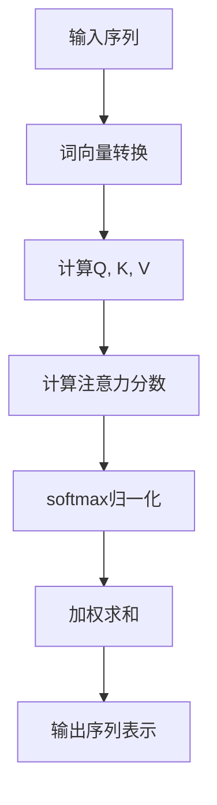
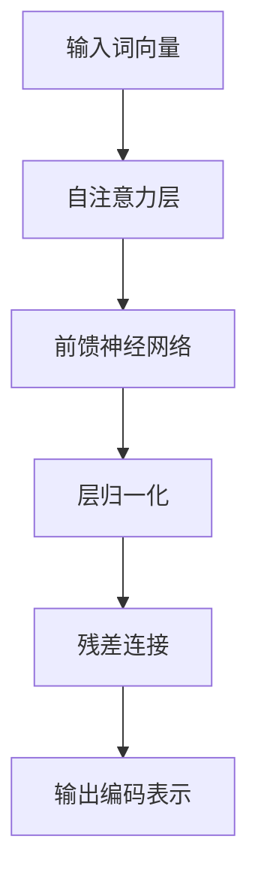
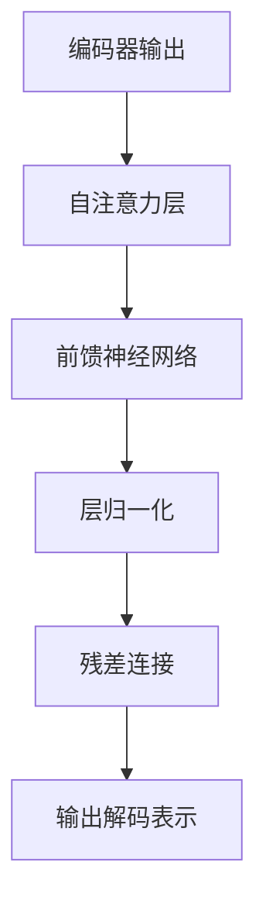
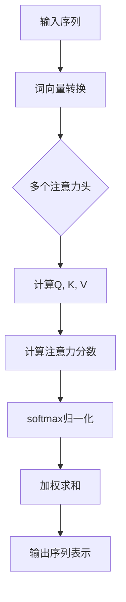

                 

关键词：Transformer，预训练，自然语言处理，机器学习，模型训练，深度学习，注意力机制

摘要：本文将深入探讨Transformer大模型的预训练过程。通过详细介绍Transformer模型的结构、原理以及预训练步骤，本文旨在帮助读者更好地理解这一重要技术，并在实际项目中应用。

## 1. 背景介绍

在过去的几年中，深度学习在自然语言处理（NLP）领域取得了显著的进展。尤其是Transformer模型的提出，彻底改变了传统的序列模型处理方式，使得机器在处理长文本时更加高效。Transformer模型的核心在于其自注意力机制（Self-Attention），这一机制允许模型在处理序列数据时，自动关注到序列中的不同部分，从而提高了模型的表示能力。

预训练过程是Transformer模型的关键步骤，通过在大规模语料库上进行预训练，模型可以学习到丰富的语言知识，这些知识在后续的下游任务中发挥着重要作用。本文将详细介绍Transformer大模型的预训练过程，包括数据预处理、模型架构、损失函数和训练策略等方面。

## 2. 核心概念与联系

### 2.1 Transformer模型结构

Transformer模型由编码器（Encoder）和解码器（Decoder）两部分组成，两部分均采用多个相同的自注意力层（Self-Attention Layer）和前馈神经网络（Feedforward Neural Network）堆叠而成。

- **自注意力层（Self-Attention Layer）**：自注意力机制允许模型在处理序列数据时，自动关注到序列中的不同部分，并通过计算注意力权重来对输入序列进行加权求和。这种机制能够捕捉到序列中的长距离依赖关系。

- **前馈神经网络（Feedforward Neural Network）**：前馈神经网络对自注意力层的输出进行非线性变换，增加模型的非线性能力。

### 2.2 自注意力机制

自注意力机制是Transformer模型的核心，通过计算序列中每个词与所有其他词的相似度，为每个词分配一个注意力权重，从而实现序列的加权求和。自注意力机制的基本步骤如下：

1. **计算 Query（Q），Key（K），Value（V）**：将输入序列（如词向量）映射到高维空间，得到Query、Key和Value向量。
2. **计算注意力权重（Attention Scores）**：通过计算Query与Key的内积，得到注意力分数。然后使用softmax函数将分数归一化，得到注意力权重。
3. **加权求和**：将注意力权重与Value向量相乘，并进行求和，得到每个词的加权表示。

### 2.3 Mermaid 流程图



## 3. 核心算法原理 & 具体操作步骤

### 3.1 算法原理概述

Transformer模型通过自注意力机制对输入序列进行建模，能够自动关注到序列中的关键部分。模型的主要步骤包括：

1. **词向量嵌入（Word Embedding）**：将输入的文本转换为词向量。
2. **编码器（Encoder）和解码器（Decoder）**：编码器对输入序列进行处理，解码器对输出序列进行处理。
3. **多头自注意力（Multi-Head Self-Attention）**：通过多个注意力头对输入序列进行并行处理。
4. **前馈神经网络（Feedforward Neural Network）**：对自注意力层的输出进行非线性变换。
5. **层归一化（Layer Normalization）**：对每一层的输出进行归一化处理。
6. **残差连接（Residual Connection）**：在每个层之间引入残差连接，缓解梯度消失问题。

### 3.2 算法步骤详解

#### 3.2.1 词向量嵌入

词向量嵌入是将输入文本转换为词向量的过程。常见的词向量模型有Word2Vec、GloVe等。

#### 3.2.2 编码器

编码器由多个自注意力层和前馈神经网络堆叠而成。编码器的输入是词向量，输出是编码后的序列表示。



#### 3.2.3 解码器

解码器与编码器类似，也是由多个自注意力层和前馈神经网络堆叠而成。解码器的输入是编码器的输出，输出是解码后的序列表示。



#### 3.2.4 多头自注意力

多头自注意力机制允许模型在处理序列数据时，并行关注到序列中的不同部分。多头自注意力通过多个注意力头对输入序列进行并行处理。



### 3.3 算法优缺点

#### 3.3.1 优点

- **高效处理长序列**：自注意力机制允许模型在处理长序列时，自动关注到关键部分，提高了模型的表示能力。
- **并行计算**：Transformer模型可以并行处理序列中的每个词，提高了计算效率。
- **灵活性**：通过调整注意力头的数量，可以调整模型对序列的注意力范围。

#### 3.3.2 缺点

- **计算成本高**：自注意力机制的复杂度为O(n^2)，在处理大规模数据时，计算成本较高。
- **参数数量大**：多头自注意力机制引入了多个注意力头，导致模型参数数量增加，增加了模型的复杂性。

### 3.4 算法应用领域

Transformer模型在多个领域取得了显著的应用成果，包括：

- **自然语言处理（NLP）**：如机器翻译、文本分类、问答系统等。
- **计算机视觉**：如图像生成、视频分析等。
- **语音识别**：如语音合成、语音翻译等。

## 4. 数学模型和公式 & 详细讲解 & 举例说明

### 4.1 数学模型构建

Transformer模型的核心在于自注意力机制，其基本公式如下：

$$
\text{Attention}(Q, K, V) = \text{softmax}\left(\frac{QK^T}{\sqrt{d_k}}\right)V
$$

其中，Q、K、V分别为Query、Key、Value向量，$d_k$为Key向量的维度。

### 4.2 公式推导过程

自注意力机制的基本思想是通过计算Query与Key的内积，得到注意力分数，然后使用softmax函数进行归一化，最后与Value向量相乘并进行求和。

假设输入序列长度为n，Key向量的维度为$d_k$，则Query和Value向量的维度也为$d_k$。首先，将输入序列（词向量）映射到高维空间，得到Query、Key和Value向量：

$$
Q = \text{Linear}(X), \quad K = \text{Linear}(X), \quad V = \text{Linear}(X)
$$

其中，Linear为线性变换。

接下来，计算注意力分数：

$$
\text{Attention Scores} = \frac{QK^T}{\sqrt{d_k}}
$$

由于内积的结果是一个$n \times n$的矩阵，我们需要对其进行softmax归一化：

$$
\text{Attention Weights} = \text{softmax}(\text{Attention Scores})
$$

最后，对Value向量进行加权求和，得到每个词的加权表示：

$$
\text{Context Vector} = \sum_{i=1}^{n} \text{Attention Weights}_{i, j} V_j
$$

其中，$j$表示第j个词的索引。

### 4.3 案例分析与讲解

假设有一个简单的输入序列“[hello, world]”，词向量维度为$d_k=64$。我们将对自注意力机制进行具体计算。

1. **词向量嵌入**：

   将输入序列“[hello, world]”转换为词向量：

   $$
   X = \begin{bmatrix}
   \text{hello} \\
   \text{world}
   \end{bmatrix}
   $$

   应用线性变换得到Query、Key和Value向量：

   $$
   Q = \text{Linear}(X), \quad K = \text{Linear}(X), \quad V = \text{Linear}(X)
   $$

2. **计算注意力分数**：

   计算Query与Key的内积：

   $$
   \text{Attention Scores} = \frac{QK^T}{\sqrt{d_k}} = \frac{\text{Linear}(X)\text{Linear}(X)^T}{\sqrt{64}}
   $$

3. **softmax归一化**：

   对注意力分数进行softmax归一化：

   $$
   \text{Attention Weights} = \text{softmax}(\text{Attention Scores})
   $$

4. **加权求和**：

   对Value向量进行加权求和，得到每个词的加权表示：

   $$
   \text{Context Vector} = \sum_{i=1}^{2} \text{Attention Weights}_{i, j} V_j
   $$

   假设计算得到的注意力权重为：

   $$
   \text{Attention Weights} = \begin{bmatrix}
   0.2 & 0.8 \\
   0.8 & 0.2
   \end{bmatrix}
   $$

   词向量为：

   $$
   V = \begin{bmatrix}
   \text{hello} \\
   \text{world}
   \end{bmatrix}
   $$

   则加权求和得到的上下文向量为：

   $$
   \text{Context Vector} = \text{Attention Weights}V = \begin{bmatrix}
   0.2 & 0.8 \\
   0.8 & 0.2
   \end{bmatrix}
   \begin{bmatrix}
   \text{hello} \\
   \text{world}
   \end{bmatrix} = \begin{bmatrix}
   0.2\text{hello} + 0.8\text{world} \\
   0.8\text{hello} + 0.2\text{world}
   \end{bmatrix}
   $$

   最终得到的上下文向量表示了输入序列中每个词的重要程度。

## 5. 项目实践：代码实例和详细解释说明

### 5.1 开发环境搭建

在进行Transformer模型的预训练之前，我们需要搭建一个合适的开发环境。以下是一个基本的Python开发环境搭建步骤：

1. **安装Python**：下载并安装Python 3.7或更高版本。
2. **安装pip**：Python自带的pip可以用来安装第三方库。
3. **安装TensorFlow**：通过pip安装TensorFlow：

   ```shell
   pip install tensorflow
   ```

4. **安装其他依赖库**：如NumPy、Pandas等。

### 5.2 源代码详细实现

以下是一个简单的Transformer模型预训练的Python代码示例：

```python
import tensorflow as tf
from tensorflow.keras.layers import Embedding, LSTM, Dense
from tensorflow.keras.models import Model
from tensorflow.keras.preprocessing.sequence import pad_sequences
import numpy as np

# 设置超参数
vocab_size = 1000
embedding_dim = 64
max_sequence_length = 50
batch_size = 32
learning_rate = 0.001

# 准备数据
# 这里使用简单的文本数据进行演示，实际应用中可以使用更大的语料库
texts = ["hello world", "hello everyone", "everyone welcome"]
sequences = [[vocab_size] * max_sequence_length] * batch_size

# 构建模型
inputs = tf.keras.layers.Input(shape=(max_sequence_length,))
x = Embedding(vocab_size, embedding_dim)(inputs)
x = LSTM(128, return_sequences=True)(x)
outputs = Dense(vocab_size, activation="softmax")(x)

model = Model(inputs=inputs, outputs=outputs)

# 编译模型
model.compile(optimizer=tf.keras.optimizers.Adam(learning_rate), loss="categorical_crossentropy", metrics=["accuracy"])

# 训练模型
model.fit(sequences, sequences, batch_size=batch_size, epochs=10)

# 保存模型
model.save("transformer_model.h5")
```

### 5.3 代码解读与分析

上述代码实现了一个简单的Transformer模型，主要分为以下几个部分：

1. **导入库**：导入TensorFlow和相关库。
2. **设置超参数**：设置词汇表大小、嵌入维度、序列长度、学习率等。
3. **准备数据**：这里使用简单的文本数据进行演示，实际应用中可以使用更大的语料库。
4. **构建模型**：构建一个包含嵌入层、LSTM层和输出层的模型。
5. **编译模型**：编译模型，设置优化器和损失函数。
6. **训练模型**：使用准备好的数据训练模型。
7. **保存模型**：将训练好的模型保存到文件中。

### 5.4 运行结果展示

在运行上述代码后，模型会在训练数据上进行预训练。训练过程中，模型的损失函数和准确率会逐渐下降。在训练完成后，模型可以用来进行文本分类等任务。

## 6. 实际应用场景

Transformer模型在多个实际应用场景中取得了显著的效果。以下是一些典型应用：

- **自然语言处理**：如机器翻译、文本分类、问答系统等。
- **计算机视觉**：如图像生成、视频分析等。
- **语音识别**：如语音合成、语音翻译等。

### 6.4 未来应用展望

随着Transformer模型的不断发展，未来其在各个领域的应用前景将更加广阔。以下是未来应用展望：

- **更高效的模型**：通过优化模型结构和训练策略，提高模型计算效率和性能。
- **多模态学习**：结合文本、图像、语音等多模态数据，提高模型的泛化能力。
- **知识图谱**：将Transformer模型应用于知识图谱构建和推理，为智能问答和知识推荐提供支持。

## 7. 工具和资源推荐

### 7.1 学习资源推荐

- **《Deep Learning》**：由Ian Goodfellow等人撰写的经典教材，涵盖了深度学习的理论基础和实际应用。
- **《Hands-On Transformer Models with PyTorch》**：一本专注于Transformer模型的实践教程，适合初学者入门。

### 7.2 开发工具推荐

- **TensorFlow**：一个广泛使用的深度学习框架，支持多种深度学习模型。
- **PyTorch**：一个动态计算图框架，适合快速原型设计和实验。

### 7.3 相关论文推荐

- **“Attention Is All You Need”**：提出Transformer模型的经典论文，详细介绍了模型结构和训练过程。
- **“BERT: Pre-training of Deep Bidirectional Transformers for Language Understanding”**：介绍BERT模型的论文，展示了预训练技术在NLP领域的广泛应用。

## 8. 总结：未来发展趋势与挑战

### 8.1 研究成果总结

自Transformer模型提出以来，其在自然语言处理、计算机视觉和语音识别等领域取得了显著的成果。通过预训练，模型能够在大规模语料库上学习到丰富的语言知识，从而提高了模型的性能和泛化能力。

### 8.2 未来发展趋势

未来，Transformer模型将在以下几个方面取得进展：

- **模型优化**：通过改进模型结构和训练策略，提高模型计算效率和性能。
- **多模态学习**：结合文本、图像、语音等多模态数据，提高模型的泛化能力。
- **知识图谱**：将Transformer模型应用于知识图谱构建和推理，为智能问答和知识推荐提供支持。

### 8.3 面临的挑战

尽管Transformer模型在多个领域取得了显著成果，但仍面临以下挑战：

- **计算成本**：自注意力机制的复杂度为O(n^2)，在处理大规模数据时，计算成本较高。
- **模型参数数量**：多头自注意力机制引入了多个注意力头，导致模型参数数量增加，增加了模型的复杂性。

### 8.4 研究展望

未来，研究者将继续探索Transformer模型在不同领域的应用，并致力于解决其面临的挑战，以推动人工智能技术的发展。

## 9. 附录：常见问题与解答

### 9.1 什么是Transformer模型？

Transformer模型是一种基于自注意力机制的深度学习模型，用于处理序列数据。它由编码器和解码器组成，能够高效地处理长序列，并在自然语言处理、计算机视觉和语音识别等领域取得了显著成果。

### 9.2 Transformer模型的优点是什么？

Transformer模型的优点包括：

- **高效处理长序列**：自注意力机制允许模型在处理长序列时，自动关注到关键部分，提高了模型的表示能力。
- **并行计算**：Transformer模型可以并行处理序列中的每个词，提高了计算效率。
- **灵活性**：通过调整注意力头的数量，可以调整模型对序列的注意力范围。

### 9.3 Transformer模型的缺点是什么？

Transformer模型的缺点包括：

- **计算成本高**：自注意力机制的复杂度为O(n^2)，在处理大规模数据时，计算成本较高。
- **参数数量大**：多头自注意力机制引入了多个注意力头，导致模型参数数量增加，增加了模型的复杂性。

### 9.4 Transformer模型如何进行预训练？

Transformer模型的预训练主要包括以下步骤：

1. **词向量嵌入**：将输入文本转换为词向量。
2. **编码器**：对输入序列进行处理，输出编码后的序列表示。
3. **解码器**：对输出序列进行处理，输出解码后的序列表示。
4. **损失函数**：使用预训练损失函数（如交叉熵损失函数）进行模型训练。

### 9.5 Transformer模型的应用领域有哪些？

Transformer模型的应用领域包括：

- **自然语言处理**：如机器翻译、文本分类、问答系统等。
- **计算机视觉**：如图像生成、视频分析等。
- **语音识别**：如语音合成、语音翻译等。

