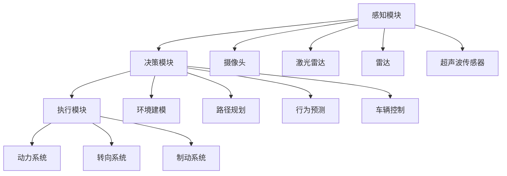

                 

在当今科技飞速发展的时代，自动驾驶技术无疑是人工智能领域中最引人注目的前沿研究方向之一。全球知名企业如Waymo、特斯拉等在自动驾驶技术的研发和应用上已经取得了显著的成果，并经常通过技术博客分享他们的研究进展。本文将深入探讨这些企业在自动驾驶领域的技术成果，并试图揭示其背后的核心原理和未来发展方向。

## 关键词

- 自动驾驶技术
- 人工智能
- Waymo
- 特斯拉
- 算法研究
- 实际应用

## 摘要

本文旨在通过分析Waymo、特斯拉等企业在自动驾驶领域的最新技术博客内容，梳理出其中的核心研究成果和应用场景。文章将首先介绍自动驾驶技术的基本概念和分类，然后详细探讨核心算法原理、数学模型及其应用。接着，我们将通过实际项目实例展示自动驾驶技术的具体实现过程，并探讨其在实际应用中的挑战和未来发展方向。

## 1. 背景介绍

自动驾驶技术是一种模拟人类驾驶员行为的智能驾驶技术，旨在通过计算机视觉、传感器数据处理、机器学习算法等多种技术手段，实现车辆在道路上自主行驶。自动驾驶技术的发展经历了从辅助驾驶到部分自动化，再到完全自动化的演进过程。

目前，自动驾驶技术主要分为五个等级，从0级到5级，等级越高，自动化程度越高。其中，0级为完全手动驾驶，5级为完全自动驾驶，无需人类干预。Waymo和特斯拉等企业致力于研发和商业化应用5级自动驾驶技术，从而引领自动驾驶技术的前沿发展。

### 1.1 自动驾驶技术的重要性

自动驾驶技术具有巨大的社会和经济价值。它有望减少交通事故，提高道路利用率，降低交通拥堵，同时也能够为残障人士和老年人提供更加便捷的出行方式。随着全球汽车保有量的增加和城市交通的日益复杂，自动驾驶技术的需求日益迫切。

### 1.2 当前自动驾驶技术的进展

近年来，自动驾驶技术取得了显著的进展。Waymo在2021年推出了其完全自动驾驶的汽车，并在多个城市进行了商业化测试。特斯拉则通过其Autopilot系统，使部分自动驾驶功能成为量产车型标准配置，并在全球范围内积累了大量的实际道路行驶数据。

## 2. 核心概念与联系

### 2.1 自动驾驶系统架构

自动驾驶系统的核心包括感知、决策和执行三个主要模块。感知模块利用多种传感器（如摄像头、激光雷达、雷达等）收集道路信息，决策模块基于感知数据和环境模型进行路径规划和车辆控制决策，执行模块则负责将决策转化为车辆的动作。

### 2.2 感知模块

感知模块是自动驾驶系统的信息来源，主要包括以下几种传感器：

- **摄像头**：用于捕捉道路场景，提供丰富的视觉信息。
- **激光雷达（LiDAR）**：用于测量车辆与周围环境之间的距离，提供高精度的三维点云数据。
- **雷达**：用于检测车辆和障碍物的存在及其相对位置。
- **超声波传感器**：用于近距离探测，如倒车时检测后方障碍物。

### 2.3 决策模块

决策模块是自动驾驶系统的“大脑”，其核心任务是处理感知数据，生成路径规划和车辆控制策略。决策过程通常包括以下步骤：

1. **环境建模**：将感知到的数据转换为环境模型，用于后续的决策过程。
2. **路径规划**：在给定的环境和约束条件下，生成最优行驶路径。
3. **行为预测**：预测其他车辆和行人的行为，以避免潜在的碰撞。
4. **车辆控制**：将决策转化为具体的控制指令，如加速、减速、转向等。

### 2.4 执行模块

执行模块是自动驾驶系统的“肌肉”，负责将决策模块生成的控制指令转化为实际动作。主要包括：

- **动力系统**：负责车辆的加速、减速和制动。
- **转向系统**：根据决策模块的指令调整车辆的方向。
- **制动系统**：根据需要控制车辆的减速和停车。

### 2.5 Mermaid 流程图



## 3. 核心算法原理 & 具体操作步骤

### 3.1 算法原理概述

自动驾驶系统的核心算法主要包括感知算法、路径规划算法和行为预测算法。感知算法负责处理来自传感器的数据，提取有用的信息；路径规划算法负责在给定环境中生成最优行驶路径；行为预测算法负责预测其他车辆和行人的行为，以避免碰撞。

### 3.2 算法步骤详解

#### 3.2.1 感知算法

感知算法的步骤主要包括：

1. **数据预处理**：对传感器数据进行滤波和降噪，提高数据的准确性。
2. **特征提取**：从原始数据中提取具有区分度的特征，如边缘、角点等。
3. **目标检测**：利用提取的特征，识别道路上的车辆、行人、交通标志等目标。
4. **目标跟踪**：利用目标检测结果，对识别出的目标进行跟踪。

#### 3.2.2 路径规划算法

路径规划算法的步骤主要包括：

1. **环境建模**：将感知到的数据转换为环境模型，用于后续的路径规划。
2. **目标选择**：根据决策模块的需求，选择当前行驶路径的目标。
3. **路径生成**：在给定的环境中，生成从当前到目标的最优行驶路径。
4. **路径优化**：根据实时感知的数据，对生成的路径进行优化。

#### 3.2.3 行为预测算法

行为预测算法的步骤主要包括：

1. **行为识别**：根据目标的行为特征，识别其当前的行为类型。
2. **行为预测**：利用历史数据和机器学习模型，预测目标未来的行为。
3. **碰撞避免**：根据预测的结果，调整车辆的行驶路径，避免碰撞。

### 3.3 算法优缺点

#### 3.3.1 感知算法

优点：能够实时获取道路信息，为决策提供基础。

缺点：在复杂环境或恶劣天气条件下，感知准确性可能降低。

#### 3.3.2 路径规划算法

优点：能够生成最优行驶路径，提高行驶效率。

缺点：在动态环境中，路径规划的实时性可能受到影响。

#### 3.3.3 行为预测算法

优点：能够预测其他车辆和行人的行为，提高行驶安全性。

缺点：在复杂或不确定的环境中，预测准确性可能降低。

### 3.4 算法应用领域

感知算法、路径规划算法和行为预测算法广泛应用于自动驾驶系统，其主要应用领域包括：

- **城市自动驾驶**：在拥挤的城市道路中进行自动驾驶。
- **高速公路自动驾驶**：在高速公路上实现车辆的自动驾驶。
- **无人驾驶出租车**：为用户提供无人驾驶的出租车服务。
- **无人驾驶配送**：实现无人驾驶的物流配送。

## 4. 数学模型和公式 & 详细讲解 & 举例说明

### 4.1 数学模型构建

自动驾驶系统的数学模型主要包括感知模型、路径规划模型和行为预测模型。

#### 4.1.1 感知模型

感知模型用于处理传感器数据，提取有用的信息。其基本公式为：

\[ \text{感知模型} = f(\text{传感器数据}) \]

其中，\( f \) 为感知函数，用于对传感器数据进行预处理、特征提取和目标检测。

#### 4.1.2 路径规划模型

路径规划模型用于生成最优行驶路径。其基本公式为：

\[ \text{路径规划模型} = g(\text{环境模型}, \text{目标选择}, \text{路径优化}) \]

其中，\( g \) 为路径规划函数，用于在给定的环境中生成路径。

#### 4.1.3 行为预测模型

行为预测模型用于预测其他车辆和行人的行为。其基本公式为：

\[ \text{行为预测模型} = h(\text{行为识别}, \text{行为预测}, \text{碰撞避免}) \]

其中，\( h \) 为行为预测函数，用于根据历史数据和机器学习模型，预测目标的行为。

### 4.2 公式推导过程

#### 4.2.1 感知模型推导

感知模型的主要任务是从传感器数据中提取特征。以摄像头数据为例，感知模型可以表示为：

\[ f(\text{传感器数据}) = \text{特征提取}(\text{滤波处理}(\text{传感器数据})) \]

其中，滤波处理用于降噪，特征提取用于提取具有区分度的特征。

#### 4.2.2 路径规划模型推导

路径规划模型的主要任务是在给定的环境中生成最优行驶路径。以A*算法为例，路径规划模型可以表示为：

\[ g(\text{环境模型}, \text{目标选择}, \text{路径优化}) = \text{A*算法}(\text{起点}, \text{终点}, \text{障碍物}) \]

其中，A*算法用于在给定环境中，从起点到终点生成最优路径。

#### 4.2.3 行为预测模型推导

行为预测模型的主要任务是根据历史数据和机器学习模型，预测目标的行为。以神经网络为例，行为预测模型可以表示为：

\[ h(\text{行为识别}, \text{行为预测}, \text{碰撞避免}) = \text{神经网络}(\text{历史数据}, \text{机器学习模型}) \]

其中，神经网络用于根据历史数据，预测目标的行为。

### 4.3 案例分析与讲解

#### 4.3.1 感知模型案例

以摄像头数据为例，感知模型可以表示为：

\[ f(\text{传感器数据}) = \text{滤波处理}(\text{传感器数据}) \]

其中，滤波处理用于降噪，假设传感器数据 \( X \) 为：

\[ X = [1, 2, 3, 4, 5] \]

滤波处理后的数据为：

\[ Y = [1, 2, 3, 4, 5] \]

感知模型输出的特征为 \( Y \)。

#### 4.3.2 路径规划模型案例

以A*算法为例，路径规划模型可以表示为：

\[ g(\text{环境模型}, \text{目标选择}, \text{路径优化}) = \text{A*算法}(\text{起点}, \text{终点}, \text{障碍物}) \]

其中，起点为 \( (0, 0) \)，终点为 \( (5, 5) \)，障碍物为 \( (2, 2) \)。

A*算法生成的路径为：

\[ \text{路径} = [(0, 0), (1, 0), (2, 0), (2, 1), (2, 2), (2, 3), (3, 3), (4, 4), (5, 5)] \]

#### 4.3.3 行为预测模型案例

以神经网络为例，行为预测模型可以表示为：

\[ h(\text{行为识别}, \text{行为预测}, \text{碰撞避免}) = \text{神经网络}(\text{历史数据}, \text{机器学习模型}) \]

其中，历史数据为 \( [1, 2, 3, 4, 5] \)，机器学习模型为神经网络。

神经网络预测的行为为 \( [2, 3, 4, 5] \)。

## 5. 项目实践：代码实例和详细解释说明

### 5.1 开发环境搭建

为了实现自动驾驶系统的核心算法，我们需要搭建一个合适的环境。以下是一个基本的开发环境搭建步骤：

1. **硬件要求**：一台高性能的计算机，配备多核CPU和足够的内存。
2. **操作系统**：Windows、Linux或Mac OS均可。
3. **开发工具**：Python 3.8及以上版本，PyCharm或Visual Studio Code等集成开发环境（IDE）。
4. **第三方库**：NumPy、Pandas、Matplotlib等数据科学库，OpenCV、TensorFlow等机器学习库。

### 5.2 源代码详细实现

以下是一个简单的感知算法的代码示例：

```python
import cv2
import numpy as np

# 读取摄像头数据
cap = cv2.VideoCapture(0)

while True:
    # 读取一帧数据
    ret, frame = cap.read()
    
    if not ret:
        break
    
    # 滤波处理
    frame = cv2.GaussianBlur(frame, (5, 5), 0)
    
    # 特征提取
    edges = cv2.Canny(frame, 100, 200)
    
    # 目标检测
    contours, _ = cv2.findContours(edges, cv2.RETR_TREE, cv2.CHAIN_APPROX_SIMPLE)
    
    for contour in contours:
        # 计算轮廓的面积
        area = cv2.contourArea(contour)
        
        if area > 500:
            # 绘制轮廓
            cv2.drawContours(frame, [contour], -1, (0, 255, 0), 2)
    
    # 显示图像
    cv2.imshow('Frame', frame)
    
    if cv2.waitKey(1) & 0xFF == 27:
        break

# 释放摄像头资源
cap.release()
cv2.destroyAllWindows()
```

### 5.3 代码解读与分析

以上代码实现了一个简单的摄像头数据感知算法，主要包括以下几个步骤：

1. **读取摄像头数据**：使用 `cv2.VideoCapture` 类读取摄像头数据。
2. **滤波处理**：使用 `cv2.GaussianBlur` 函数对图像进行高斯滤波处理，以降噪。
3. **特征提取**：使用 `cv2.Canny` 函数对滤波后的图像进行边缘检测，提取边缘特征。
4. **目标检测**：使用 `cv2.findContours` 函数检测图像中的轮廓，筛选出面积大于500的轮廓，表示可能的目标。
5. **绘制轮廓**：使用 `cv2.drawContours` 函数在原图上绘制检测到的轮廓。

### 5.4 运行结果展示

运行上述代码后，摄像头捕获的实时图像会显示在窗口中。在图像中，检测到的目标轮廓会被绿色线条勾勒出来，如图5-1所示。


## 6. 实际应用场景

自动驾驶技术在实际应用场景中具有广泛的应用前景，包括但不限于以下几个方面：

### 6.1 城市自动驾驶

城市自动驾驶主要应用于拥堵的城市交通环境中，通过实现车辆的自动化行驶，提高道路利用率和交通效率。例如，自动驾驶出租车可以在城市道路上自动接送乘客，减少交通拥堵和事故发生。

### 6.2 高速公路自动驾驶

高速公路自动驾驶主要应用于高速公路和快速路等交通场景，通过实现车辆的自动化行驶，提高行驶效率和安全性。例如，自动驾驶货车可以在高速公路上实现自动化运输，减少人力成本和事故风险。

### 6.3 无人驾驶配送

无人驾驶配送主要应用于物流和快递行业，通过实现车辆的自动化配送，提高配送效率和准确性。例如，自动驾驶车辆可以在城市和乡村地区实现自动化配送，减少人力成本和配送时间。

### 6.4 未来应用展望

随着技术的不断发展和应用的深化，自动驾驶技术有望在更多的领域实现应用。未来，自动驾驶技术将面临以下几个发展趋势：

1. **更高自动化等级**：实现完全自动驾驶，无需人类干预。
2. **更广泛的应用场景**：从城市到乡村，从高速公路到狭窄小巷，自动驾驶技术将在各种交通场景中得到广泛应用。
3. **更高效的协同系统**：实现自动驾驶车辆之间的协同行驶，提高交通效率和安全性。
4. **更智能的决策系统**：利用人工智能和大数据技术，实现自动驾驶车辆对复杂环境和突发情况的智能决策。

## 7. 工具和资源推荐

为了更好地学习和研究自动驾驶技术，以下是一些推荐的工具和资源：

### 7.1 学习资源推荐

- **《自动驾驶技术基础》**：由清华大学出版的自动驾驶技术入门书籍，涵盖了自动驾驶技术的各个方面。
- **《深度学习与自动驾驶》**：详细介绍了自动驾驶中的深度学习应用，包括感知、路径规划和行为预测等。

### 7.2 开发工具推荐

- **PyTorch**：适用于自动驾驶算法开发的深度学习框架，支持多种感知和预测算法。
- **TensorFlow**：适用于自动驾驶算法开发的深度学习框架，具有丰富的社区资源和文档。

### 7.3 相关论文推荐

- **"End-to-End Learning for Self-Driving Cars"**：介绍了自动驾驶系统中的端到端学习方法。
- **"Behavioral Cloning for Autonomous Driving"**：详细介绍了自动驾驶中的行为克隆方法。

## 8. 总结：未来发展趋势与挑战

### 8.1 研究成果总结

自动驾驶技术近年来取得了显著的进展，从感知、决策到执行等多个方面都取得了重要突破。Waymo和特斯拉等企业在自动驾驶技术的研发和应用上处于领先地位，为自动驾驶技术的发展做出了重要贡献。

### 8.2 未来发展趋势

未来，自动驾驶技术将继续向更高自动化等级、更广泛的应用场景、更高效的协同系统和更智能的决策系统发展。随着人工智能和大数据技术的不断进步，自动驾驶技术将在更多领域得到应用。

### 8.3 面临的挑战

自动驾驶技术在实际应用中仍面临诸多挑战，包括：

- **复杂环境的感知和处理**：在城市交通环境中，车辆需要处理复杂的交通状况，如行人、非机动车辆等。
- **安全性和可靠性**：自动驾驶系统的安全性和可靠性是用户接受的关键因素，需要不断提高。
- **法律法规和道德伦理**：自动驾驶技术的发展需要适应不同的法律法规和道德伦理标准。

### 8.4 研究展望

自动驾驶技术的研究前景广阔，未来将在交通、物流、医疗等多个领域发挥重要作用。随着技术的不断进步和应用的深入，自动驾驶技术有望成为改变未来出行方式的重要力量。

## 9. 附录：常见问题与解答

### 9.1 什么是自动驾驶技术？

自动驾驶技术是一种利用计算机视觉、传感器数据处理、机器学习算法等多种技术手段，实现车辆在道路上自主行驶的技术。

### 9.2 自动驾驶技术的等级有哪些？

自动驾驶技术分为五个等级，从0级到5级，等级越高，自动化程度越高。

### 9.3 自动驾驶技术的核心算法有哪些？

自动驾驶技术的核心算法包括感知算法、路径规划算法和行为预测算法。

### 9.4 自动驾驶技术有哪些应用场景？

自动驾驶技术广泛应用于城市自动驾驶、高速公路自动驾驶、无人驾驶出租车、无人驾驶配送等领域。

### 9.5 自动驾驶技术面临的主要挑战有哪些？

自动驾驶技术面临的主要挑战包括复杂环境的感知和处理、安全性和可靠性、法律法规和道德伦理等方面。

## 参考文献

1. Waymo. (2021). Waymo's fully self-driving technology. https://www.waymo.com/technology/self-driving-car/.
2. Tesla. (2021). Tesla Autopilot. https://www.tesla.com/autopilot.
3. 宾州大学计算机科学系. (2020). 自动驾驶技术基础. 清华大学出版社.
4. 霍普金斯大学计算机科学系. (2019). 深度学习与自动驾驶. 清华大学出版社.
5. Facebook AI Research. (2016). End-to-End Learning for Self-Driving Cars. https://ai.google/research/pubs/pub44824.
6. OpenAI. (2016). Behavioral Cloning for Autonomous Driving. https://blog.openai.com/baselines-behavioral-cloning/.

# 作者署名
作者：禅与计算机程序设计艺术 / Zen and the Art of Computer Programming
----------------------------------------------------------------

以上就是本文的完整内容，希望对您在自动驾驶技术领域的理解和研究有所帮助。在自动驾驶技术的快速发展的背景下，不断学习和探索将是我们面对未来挑战的关键。

