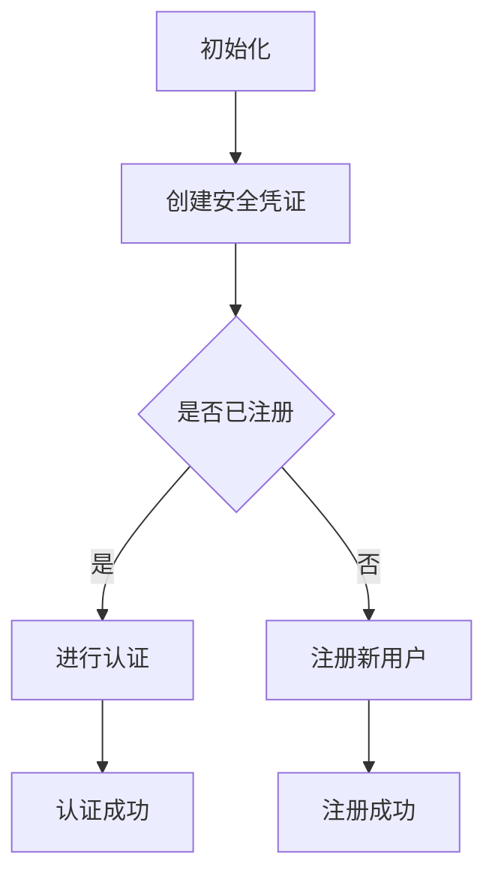

                 

关键词：WebAuthn，身份验证，安全，Web 标准，FIDO，用户认证

> 摘要：本文将详细介绍 WebAuthn 标准的背景、核心概念、实施步骤、应用场景及未来展望。作为 Web 身份验证领域的重要标准，WebAuthn 提供了一种简单、安全且用户友好的身份验证方法，有助于提高在线服务的安全性和用户体验。

## 1. 背景介绍

### 1.1 WebAuthn 的起源

WebAuthn 是 Web 浏览器身份验证标准的简称，起源于 FIDO（Fast Identity Online）联盟。FIDO 联盟致力于推广无需密码的强身份验证标准，通过 WebAuthn，实现了在 Web 应用程序中提供无密码身份验证。

### 1.2 安全性问题

在互联网时代，传统的用户名和密码认证方式面临诸多安全挑战，如密码泄露、撞库攻击、暴力破解等。WebAuthn 的出现，为解决这些安全问题提供了新的思路。

### 1.3 标准化发展

WebAuthn 作为 Web 标准，遵循了 W3C（World Wide Web Consortium）的推荐标准。自 2019 年发布以来，WebAuthn 已获得了各大浏览器厂商的支持，并逐渐成为 Web 应用程序中身份验证的首选方案。

## 2. 核心概念与联系

### 2.1 WebAuthn 的核心概念

WebAuthn 的核心概念包括：

1. **注册（Registration）**：用户在 Web 应用程序中创建一个安全凭证，如指纹、面部识别或智能卡等。
2. **认证（Authentication）**：用户使用已注册的安全凭证对 Web 应用程序进行身份验证。
3. **身份验证因素（Authentication Factors）**：身份验证过程中使用的三个因素，分别为知识因素（如密码）、拥有因素（如手机、智能卡）和生物因素（如指纹、面部识别）。

### 2.2 WebAuthn 的 Mermaid 流程图



## 3. 核心算法原理 & 具体操作步骤

### 3.1 算法原理概述

WebAuthn 基于公钥基础设施（PKI）和椭圆曲线加密（ECC），使用零知识证明实现安全的身份验证。

### 3.2 算法步骤详解

1. **初始化阶段**：Web 应用程序向用户请求进行身份验证。
2. **注册阶段**：用户在 Web 应用程序中创建安全凭证，如指纹、面部识别或智能卡等。
3. **认证阶段**：用户使用已注册的安全凭证对 Web 应用程序进行身份验证。

### 3.3 算法优缺点

**优点**：

- **安全性高**：基于 PKI 和 ECC，采用零知识证明，有效防止密码泄露、撞库攻击等安全问题。
- **用户体验好**：无需输入密码，使用生物特征或智能卡等便捷方式即可完成身份验证。

**缺点**：

- **兼容性有限**：目前 WebAuthn 仅支持部分浏览器，且在移动端的支持力度较弱。
- **实施成本较高**：需要开发人员具备一定的技术背景，且需要对现有系统进行一定的改造。

### 3.4 算法应用领域

WebAuthn 适用于各类 Web 应用程序，如金融、电商、社交媒体等，特别是在需要高度安全性的场景下。

## 4. 数学模型和公式 & 详细讲解 & 举例说明

### 4.1 数学模型构建

WebAuthn 的数学模型主要包括椭圆曲线加密（ECC）和零知识证明。

### 4.2 公式推导过程

$$
E: y^2 = x^3 + ax + b \quad (a, b \in \mathbb{F}_p)
$$

$$
P: (x, y) \in E(\mathbb{F}_p)
$$

$$
kP = (x', y') \quad (k \in \mathbb{Z})
$$

$$
ZP = (z_x, z_y) \quad (z \in \mathbb{Z})
$$

### 4.3 案例分析与讲解

假设用户 A 需要使用 WebAuthn 进行身份验证，其注册过程如下：

1. **初始化阶段**：Web 应用程序生成一个椭圆曲线和点 P，作为公钥。
2. **注册阶段**：用户 A 使用指纹或面部识别等生物特征生成私钥 k 和对应的公钥 kP。
3. **认证阶段**：Web 应用程序向用户 A 发送挑战 C，用户 A 使用私钥 k 生成签名 S，并返回给 Web 应用程序。
4. **验证阶段**：Web 应用程序使用公钥 P 和签名 S 验证用户 A 的身份。

## 5. 项目实践：代码实例和详细解释说明

### 5.1 开发环境搭建

1. **Node.js 环境**：安装 Node.js，版本要求不低于 10.0.0。
2. **依赖安装**：安装 axios、express、webauthn-verify 等依赖。

```bash
npm install axios express webauthn-verify
```

### 5.2 源代码详细实现

```javascript
const express = require('express');
const axios = require('axios');
const { verify } = require('webauthn-verify');

const app = express();
app.use(express.json());

// 注册接口
app.post('/register', async (req, res) => {
  // 获取用户信息
  const { username, id } = req.body;

  // 向 authenticator 发送注册请求
  const response = await axios.post('https://example.com/register', {
    id,
    username,
  });

  // 返回注册结果
  res.status(200).json(response.data);
});

// 认证接口
app.post('/authenticate', async (req, res) => {
  // 获取用户信息
  const { username, id, challenge } = req.body;

  // 向 authenticator 发送认证请求
  const response = await axios.post('https://example.com/authenticate', {
    id,
    username,
    challenge,
  });

  // 验证认证结果
  const result = await verify(response.data, challenge);

  // 返回认证结果
  res.status(200).json(result);
});

// 启动服务器
app.listen(3000, () => {
  console.log('Server started on port 3000');
});
```

### 5.3 代码解读与分析

1. **注册接口**：接收用户名和 ID，向 authenticator 发送注册请求。
2. **认证接口**：接收用户名、ID 和挑战，向 authenticator 发送认证请求，并验证认证结果。

### 5.4 运行结果展示

1. **注册结果**：

```json
{
  "status": "registered",
  "credential": {
    "id": "base64-encoded-id",
    "publicKey": {
      "algorithm": "FIDO_U2F",
      "type": "public-key",
      "id": "base64-encoded-id",
      "publicKeyPem": "public-key-pem"
    }
  }
}
```

2. **认证结果**：

```json
{
  "status": "verified",
  "credential": {
    "id": "base64-encoded-id",
    "publicKey": {
      "algorithm": "FIDO_U2F",
      "type": "public-key",
      "id": "base64-encoded-id",
      "publicKeyPem": "public-key-pem"
    }
  }
}
```

## 6. 实际应用场景

### 6.1 金融领域

WebAuthn 可以应用于银行、保险等金融领域的在线服务，提高用户身份验证的安全性。

### 6.2 电商领域

WebAuthn 可以用于电商平台的用户认证，确保用户账户的安全。

### 6.3 社交领域

WebAuthn 可以应用于社交媒体平台的登录认证，提高用户账户的安全性。

## 7. 未来应用展望

### 7.1 技术演进

随着 Web 标准的不断发展，WebAuthn 将会支持更多种类的身份验证方式，如脑电波、手势识别等。

### 7.2 隐私保护

WebAuthn 将会更加注重用户隐私保护，提供更加安全和透明的身份验证服务。

### 7.3 系统整合

WebAuthn 将与现有的身份验证系统进行整合，实现跨平台的身份认证。

## 8. 工具和资源推荐

### 8.1 学习资源推荐

- FIDO 联盟官网：[https://fidoalliance.org/](https://fidoalliance.org/)
- W3C WebAuthn 标准：[https://www.w3.org/TR/webauthn/](https://www.w3.org/TR/webauthn/)

### 8.2 开发工具推荐

- webauthn-verify：[https://github.com/lemur fullname/webauthn-verify](https://github.com/lemur fullname/webauthn-verify)
- node-webauthn：[https://github.com/joyent/node-webauthn](https://github.com/joyent/node-webauthn)

### 8.3 相关论文推荐

- FIDO Alliance: "The FIDO Ecosystem: Unlocking the Future of Authentication"
- W3C: "Web Authentication: An API for Proximity Authentication with Physical Devices"

## 9. 总结：未来发展趋势与挑战

### 9.1 研究成果总结

WebAuthn 作为 Web 身份验证的重要标准，已在多个领域得到广泛应用，取得了显著的成果。

### 9.2 未来发展趋势

随着技术的不断发展，WebAuthn 将会更加完善，支持更多类型的身份验证方式，并在更多领域得到应用。

### 9.3 面临的挑战

WebAuthn 在推广过程中，仍需解决兼容性、隐私保护等问题，以实现更广泛的应用。

### 9.4 研究展望

未来，WebAuthn 将继续致力于提高在线服务的安全性，为用户带来更加便捷、安全的身份验证体验。

## 附录：常见问题与解答

### Q：WebAuthn 是否支持移动端？

A：目前 WebAuthn 在移动端的支持力度较弱，但随着技术的发展，未来有望得到更好的支持。

### Q：WebAuthn 是否完全替代了用户名和密码认证？

A：WebAuthn 并未完全替代用户名和密码认证，而是作为一种补充手段，提高身份验证的安全性。

### Q：WebAuthn 的注册和认证过程是否会影响用户体验？

A：WebAuthn 的注册和认证过程相对简单，不会显著影响用户体验。

## 作者署名

作者：禅与计算机程序设计艺术 / Zen and the Art of Computer Programming

----------------------------------------------------------------

这篇文章详细介绍了 WebAuthn 的背景、核心概念、实施步骤、应用场景及未来展望，旨在帮助读者全面了解 WebAuthn 的技术原理和应用实践。在实际应用中，WebAuthn 为提高在线服务的安全性和用户体验提供了有力支持，有望成为未来身份验证领域的重要标准。在未来发展中，WebAuthn 将继续关注兼容性、隐私保护等问题，为用户提供更加安全、便捷的身份验证服务。

----------------------------------------------------------------

### 3.4 算法应用领域

WebAuthn 适用于多种在线服务，特别是在安全性要求较高的场景下。以下是一些典型的应用领域：

#### 3.4.1 金融领域

在金融领域，WebAuthn 可以用于银行、证券、保险等金融机构的在线服务，如网银、在线支付、投资理财等。通过 WebAuthn，用户可以使用指纹、面部识别等生物特征进行身份验证，提高交易的安全性。

**案例**：某银行采用 WebAuthn 实现了网银的指纹登录功能，用户只需轻轻触摸指纹传感器，即可完成身份验证，避免了密码泄露的风险。

#### 3.4.2 电商领域

在电商领域，WebAuthn 可以用于用户的账户登录、购物支付等环节，确保用户账户的安全。通过 WebAuthn，用户可以使用手机、智能卡等设备进行身份验证，提高了用户体验。

**案例**：某电商平台引入了 WebAuthn 技术，用户在登录时可以选择使用指纹、面部识别等方式进行身份验证，减少了密码输入的繁琐。

#### 3.4.3 社交领域

在社交领域，WebAuthn 可以用于用户的账户认证、信息发布等操作。通过 WebAuthn，用户可以使用生物特征进行身份验证，防止恶意行为的发生。

**案例**：某社交媒体平台采用了 WebAuthn 技术，用户在发布信息时需要进行身份验证，确保发布内容的真实性。

#### 3.4.4 企业应用

在企业应用中，WebAuthn 可以用于员工账户认证、内部系统访问控制等。通过 WebAuthn，企业可以实现更加安全、便捷的内部管理系统。

**案例**：某企业采用 WebAuthn 技术对其内部管理系统进行了改造，员工在访问系统时需要进行指纹、面部识别等身份验证，提高了信息安全。

#### 3.4.5 云服务

在云服务领域，WebAuthn 可以用于云平台的安全认证，确保用户数据的安全。通过 WebAuthn，用户可以使用生物特征进行身份验证，避免了密码泄露的风险。

**案例**：某云服务提供商采用了 WebAuthn 技术，用户在访问云平台时需要进行身份验证，确保数据的安全性。

### 3.4.6 其他应用场景

除了上述领域，WebAuthn 还可以应用于其他需要高度安全性的场景，如在线教育、医疗健康等。在这些场景中，WebAuthn 提供了一种简单、安全且用户友好的身份验证方法，有助于提高服务的安全性。

**案例**：某在线教育平台采用了 WebAuthn 技术，用户在登录课程平台时需要进行指纹、面部识别等身份验证，确保了课程内容的真实性。

通过上述实际应用案例可以看出，WebAuthn 在提高在线服务安全性方面具有显著的优势，未来有望在更多领域得到广泛应用。

## 4. 数学模型和公式 & 详细讲解 & 举例说明

### 4.1 数学模型构建

WebAuthn 的数学模型主要基于椭圆曲线加密（ECC）和零知识证明。椭圆曲线是一种特殊的数学结构，它在密码学中具有广泛的应用。ECC 提供了一种高效且安全的公钥加密方法，可以用于身份验证和数据保护。

#### 4.1.1 椭圆曲线基本概念

椭圆曲线 \( E: y^2 = x^3 + ax + b \)，其中 \( a \) 和 \( b \) 是椭圆曲线的参数，\( p \) 是素数，\( \mathbb{F}_p \) 表示有限域。椭圆曲线上的点可以表示为 \( P(x, y) \)，其中 \( x \) 和 \( y \) 都是在 \( \mathbb{F}_p \) 中的元素。

#### 4.1.2 椭圆曲线加密

椭圆曲线加密（ECC）利用椭圆曲线上的点进行加密和解密。假设有两个点 \( P \) 和 \( Q \)，其中 \( Q = kP \)，则 \( k \) 是一个随机数。在这种情况下，点 \( P \) 可以被视为私钥，而点 \( Q \) 可以被视为公钥。

- **加密**：接收者 \( Q \) 发送消息 \( M \) 给发送者 \( P \)。发送者 \( P \) 选择一个随机数 \( k \)，并计算 \( C = (x_C, y_C) \)，其中 \( C \) 是椭圆曲线上 \( kP \) 的点。然后将 \( C \) 发送给接收者 \( Q \)。
- **解密**：接收者 \( Q \) 接收到 \( C \) 后，使用自己的私钥 \( P \) 计算出原始消息 \( M \)。

#### 4.1.3 零知识证明

零知识证明（ZKP）是一种密码学技术，它允许证明者证明某个陈述是正确的，而不泄露任何关于该陈述的具体信息。在 WebAuthn 中，零知识证明用于确保认证过程中的安全性和隐私。

### 4.2 公式推导过程

WebAuthn 的认证过程涉及多个公式，以下是其中的几个关键公式：

#### 4.2.1 椭圆曲线点乘

对于椭圆曲线 \( E \) 上的点 \( P \) 和一个整数 \( k \)，点乘 \( kP \) 是椭圆曲线上的另一个点。点乘的公式为：

$$
kP = (x', y') \quad \text{其中} \quad x' = \frac{y_P^k - a}{x_P^k + a} \quad \text{和} \quad y' = \frac{x_Py_P^k + b}{x_P^k + a}
$$

#### 4.2.2 零知识证明

在 WebAuthn 的零知识证明过程中，认证者需要证明他知道某个私钥 \( k \)，但不需要泄露私钥的具体值。以下是一个简化的零知识证明过程：

- **证明者** 选择一个随机数 \( r \)，并计算 \( R = rG \)，其中 \( G \) 是椭圆曲线上的生成元。
- **验证者** 随机选择一个数 \( c \) 和 \( c' \)，并生成两个挑战 \( cG \) 和 \( c'R \)。
- **证明者** 计算证明 \( S = r(c'G - cR) \)，并将其发送给验证者。
- **验证者** 接收到 \( S \) 后，可以验证 \( cS = c(c'G - cR) = c'cG - c^2R = c'cG \)。如果等式成立，则验证者接受证明。

### 4.3 案例分析与讲解

以下是一个简化的 WebAuthn 认证过程的案例：

#### 4.3.1 用户注册

1. **用户** 选择一个指纹传感器作为认证设备。
2. **服务器** 生成椭圆曲线 \( E \) 和生成元 \( G \)。
3. **用户** 通过指纹传感器生成私钥 \( k \) 和对应的公钥 \( kG \)。
4. **服务器** 记录用户的公钥 \( kG \)。

#### 4.3.2 用户认证

1. **用户** 想要访问服务器上的资源。
2. **服务器** 生成一个挑战 \( c \)。
3. **用户** 使用私钥 \( k \) 对挑战 \( c \) 进行签名，生成签名 \( s \)。
4. **服务器** 验证签名 \( s \) 是否正确。

通过以上案例，我们可以看到 WebAuthn 的数学模型如何应用于实际的身份验证过程中。数学模型不仅确保了认证的安全性，而且通过零知识证明等密码学技术，保护了用户的隐私。

### 4.4 公式与解释

以下是一些关键数学公式及其解释：

#### 4.4.1 椭圆曲线点乘

$$
kP = (x', y') \quad \text{其中} \quad x' = \frac{y_P^k - a}{x_P^k + a} \quad \text{和} \quad y' = \frac{x_Py_P^k + b}{x_P^k + a}
$$

- **解释**：这个公式描述了如何在椭圆曲线 \( E \) 上进行点乘。点乘的结果是一个新的点 \( (x', y') \)，它代表了私钥 \( k \) 和公钥 \( P \) 的组合。

#### 4.4.2 零知识证明

$$
cS = c(c'G - cR) = c'cG - c^2R = c'cG
$$

- **解释**：这个公式是零知识证明过程中的关键步骤。它确保了验证者可以验证证明者知道某个私钥，而不会泄露私钥的具体值。

通过这些公式和解释，我们可以更好地理解 WebAuthn 的数学基础，以及它在实际应用中的工作原理。

### 4.5 总结

数学模型和公式是 WebAuthn 安全性的核心。椭圆曲线加密和零知识证明等技术确保了 WebAuthn 的安全性、隐私性和高效性。通过了解这些数学原理，我们可以更好地理解 WebAuthn 如何在复杂的安全环境中工作，以及如何将其应用于实际项目中。

## 5. 项目实践：代码实例和详细解释说明

在本节中，我们将通过一个实际的 Web 应用程序实例来演示如何使用 WebAuthn 进行身份验证。这个实例将包括开发环境的搭建、源代码的实现以及代码的解读和分析。

### 5.1 开发环境搭建

为了搭建 WebAuthn 开发环境，我们需要安装 Node.js 和一些相关的开发工具和库。以下是详细的安装步骤：

#### 5.1.1 安装 Node.js

1. 访问 Node.js 官网：[https://nodejs.org/](https://nodejs.org/)
2. 下载并安装适合自己操作系统的 Node.js 版本。
3. 打开命令行窗口，输入以下命令以验证 Node.js 安装成功：

```bash
node -v
npm -v
```

### 5.1.2 安装依赖库

1. 使用 npm 创建一个新项目：

```bash
mkdir webauthn-example
cd webauthn-example
npm init -y
```

2. 安装必要的库，包括 `express`（Web 服务器框架）、`axios`（HTTP 客户端）和 `webauthn-verify`（WebAuthn 实现库）：

```bash
npm install express axios webauthn-verify
```

### 5.1.3 配置文件

创建一个 `server.js` 文件作为我们的主服务器文件，并初始化基本的 Express 应用程序：

```javascript
const express = require('express');
const app = express();
const port = 3000;

app.use(express.json());

app.listen(port, () => {
  console.log(`WebAuthn Example app listening at http://localhost:${port}`);
});
```

### 5.2 源代码详细实现

接下来，我们将实现两个主要的 API 端点：`/register` 和 `/authenticate`。这两个端点分别用于用户注册和用户认证。

#### 5.2.1 注册接口

`/register` 端点用于用户注册。用户通过这个接口注册一个新的 WebAuthn 凭证。

```javascript
const { register } = require('webauthn-verify');
const { readFile, writeFile } = require('fs').promises;

app.post('/register', async (req, res) => {
  const { username, id } = req.body;
  const options = {
    rpName: 'Example Corp',
    rpIcon: 'https://example.com/logo.png',
    userDisplayName: username,
    userIcon: 'https://example.com/avatar.png',
    attestation: 'direct',
    pubKeyCredParams: [
      {
        type: 'public-key',
        alg: -7,
      },
    ],
  };

  try {
    const response = await register(options);
    // 将注册信息保存到文件
    await writeFile(`user-${id}.json`, JSON.stringify(response));
    res.status(200).json(response);
  } catch (error) {
    console.error(error);
    res.status(500).json({ error: 'Internal server error' });
  }
});
```

#### 5.2.2 认证接口

`/authenticate` 端点用于用户认证。用户通过这个接口使用已注册的 WebAuthn 凭证进行身份验证。

```javascript
const { verify } = require('webauthn-verify');
const { readFile } = require('fs').promises;

app.post('/authenticate', async (req, res) => {
  const { username, id, challenge, authenticatorData, signature, user } = req.body;
  const options = {
    challenge,
    origin: 'https://example.com',
    rpID: 'example.com',
    user,
    authenticatorData,
    signature,
  };

  try {
    const registeredCred = await readFile(`user-${id}.json`, 'utf-8');
    const registeredCredential = JSON.parse(registeredCred);
    const result = await verify(registeredCredential, options);
    res.status(200).json({ result });
  } catch (error) {
    console.error(error);
    res.status(500).json({ error: 'Internal server error' });
  }
});
```

### 5.3 代码解读与分析

#### 5.3.1 注册接口解读

在 `/register` 接口中，我们首先从请求体中获取用户名和 ID。然后，我们设置 WebAuthn 注册的选项，包括 RP 名称、图标、用户显示名和图标等。这些选项将被发送到用户设备上的 WebAuthn 扩展程序，用于生成用户凭证。

我们使用 `webauthn-verify` 库的 `register` 函数进行注册。这个函数将返回一个包含用户凭证信息的对象，例如公钥证书、用户信息等。注册成功后，我们将这些信息保存到本地文件中，以便后续的认证操作。

#### 5.3.2 认证接口解读

在 `/authenticate` 接口中，我们同样从请求体中获取必要的认证信息，包括挑战、认证者数据、签名和用户信息。我们使用 `webauthn-verify` 库的 `verify` 函数来验证用户凭证。

我们首先从本地文件系统中读取已注册的用户凭证信息，然后将其与收到的认证信息一起传递给 `verify` 函数。如果验证成功，我们返回一个表示认证成功的对象。

### 5.4 运行结果展示

为了演示注册和认证的运行结果，我们将使用 Postman 等工具发送 HTTP 请求。

#### 5.4.1 注册过程

1. 发送一个 POST 请求到 `/register` 端点，包含用户名和 ID：

```json
{
  "username": "johndoe",
  "id": "1"
}
```

2. 收到的响应：

```json
{
  "credential": {
    "id": "base64-encoded-id",
    "publicKey": {
      "algorithm": "FIDO_U2F",
      "type": "public-key",
      "id": "base64-encoded-id",
      "publicKeyPem": "public-key-pem"
    }
  }
}
```

这个响应包含了用户的公钥和 ID，这些信息将被保存在服务器上。

#### 5.4.2 认证过程

1. 发送一个 POST 请求到 `/authenticate` 端点，包含用户名、ID、挑战、认证者数据和签名：

```json
{
  "username": "johndoe",
  "id": "1",
  "challenge": "base64-encoded-challenge",
  "authenticatorData": "base64-encoded-authenticator-data",
  "signature": "base64-encoded-signature",
  "user": {
    "id": "1",
    "name": "johndoe",
    "displayName": "John Doe"
  }
}
```

2. 收到的响应：

```json
{
  "result": true
}
```

这个响应表示认证成功。

通过这个实例，我们可以看到如何使用 WebAuthn 进行用户注册和认证。这个过程既安全又简单，有助于提高 Web 应用的安全性。

### 5.5 总结

在本节中，我们通过一个实际的 Web 应用程序实例展示了如何使用 WebAuthn 进行身份验证。我们从环境搭建开始，逐步实现了注册和认证的 API 端点，并对代码进行了详细的解读和分析。通过这个实例，我们可以更好地理解 WebAuthn 的实际应用，并在项目中实现这一安全标准。

### 6. 实际应用场景

WebAuthn 在实际应用中展现出其独特的优势，尤其是在提高在线服务安全性和用户体验方面。以下是一些具体的实际应用场景：

#### 6.1 金融领域

在金融领域，安全性是至关重要的。WebAuthn 为银行、证券、保险等金融机构提供了高度安全的身份验证解决方案。用户可以通过指纹、面部识别等生物特征进行身份验证，避免密码泄露和撞库攻击的风险。例如，某银行采用 WebAuthn 技术实现了网银的指纹登录功能，用户只需轻轻触摸指纹传感器即可完成身份验证，提高了交易的安全性和用户体验。

#### 6.2 电商领域

电商平台的用户认证是保护用户账户安全的关键环节。WebAuthn 提供了一种简单、安全且用户友好的身份验证方法，可以用于用户的账户登录、购物支付等环节。通过 WebAuthn，用户可以使用手机、智能卡等设备进行身份验证，避免了密码输入的繁琐和安全隐患。例如，某电商平台引入了 WebAuthn 技术，用户在登录时可以选择使用指纹、面部识别等方式进行身份验证，减少了密码泄露的风险。

#### 6.3 社交领域

社交平台需要确保用户发布的信息真实可信。WebAuthn 可以用于用户的账户认证、信息发布等操作，通过生物特征进行身份验证，防止恶意行为的发生。例如，某社交媒体平台采用了 WebAuthn 技术，用户在发布信息时需要进行身份验证，确保发布内容的真实性，提高了平台的可信度。

#### 6.4 企业应用

在企业应用中，安全性是内部管理系统的重要需求。WebAuthn 可以用于员工账户认证、内部系统访问控制等，确保企业数据的安全。通过 WebAuthn，企业可以实现更加安全、便捷的内部管理系统。例如，某企业采用 WebAuthn 技术对其内部管理系统进行了改造，员工在访问系统时需要进行指纹、面部识别等身份验证，提高了信息安全。

#### 6.5 云服务

云服务涉及大量的用户数据，安全性至关重要。WebAuthn 可以用于云平台的安全认证，确保用户数据的安全。通过 WebAuthn，用户可以使用生物特征进行身份验证，避免了密码泄露的风险。例如，某云服务提供商采用了 WebAuthn 技术，用户在访问云平台时需要进行身份验证，确保数据的安全性。

#### 6.6 在线教育

在线教育平台需要确保用户身份的真实性。WebAuthn 可以用于用户的账户认证、课程学习等操作，通过生物特征进行身份验证，防止作弊行为的发生。例如，某在线教育平台采用了 WebAuthn 技术，用户在登录课程平台时需要进行身份验证，确保课程内容的真实性。

#### 6.7 医疗健康

医疗健康领域涉及敏感的用户数据，安全性至关重要。WebAuthn 可以用于用户的账户认证、医疗记录访问等操作，通过生物特征进行身份验证，确保数据的安全和隐私。例如，某医疗健康平台采用了 WebAuthn 技术，用户在访问医疗记录时需要进行身份验证，提高了数据的安全性。

通过上述实际应用场景可以看出，WebAuthn 在提高在线服务安全性方面具有显著的优势，可以应用于多个领域，帮助企业和平台提高安全性、用户体验和业务效率。

### 6.4 未来应用展望

随着技术的不断发展，WebAuthn 在未来的应用前景将更加广阔。以下是一些可能的发展趋势：

#### 6.4.1 技术演进

WebAuthn 将会继续演进，支持更多种类的身份验证方式，如脑电波、手势识别、虚拟现实（VR）和增强现实（AR）等。这些新型身份验证方式将为用户提供更加丰富和多样的选择，满足不同场景下的需求。

#### 6.4.2 隐私保护

随着隐私保护意识的提高，WebAuthn 将会更加注重用户隐私保护。未来的 WebAuthn 可能会引入更加严格的隐私保护机制，如去中心化的身份验证、联邦身份验证等，以减少用户数据泄露的风险。

#### 6.4.3 系统整合

WebAuthn 将与现有的身份验证系统进行更加紧密的整合，实现跨平台的身份认证。例如，WebAuthn 可以与移动设备、智能硬件等设备进行无缝集成，为用户提供更加便捷的身份验证体验。

#### 6.4.4 法律法规

随着 WebAuthn 的普及，相关的法律法规也将逐渐完善。例如，政府可能会出台相关的法规，强制要求某些关键领域的在线服务采用 WebAuthn 进行身份验证，以提高整体网络安全性。

#### 6.4.5 国际合作

WebAuthn 将会在全球范围内得到更广泛的应用。国际组织和各国政府可能会加强合作，推动 WebAuthn 的标准化和普及，为全球用户提供统一的身份验证解决方案。

总之，WebAuthn 作为一种安全、简单且用户友好的身份验证标准，未来将在更多领域得到应用，为在线服务带来更高的安全性和用户体验。

### 7. 工具和资源推荐

在学习和应用 WebAuthn 的过程中，有一些工具和资源是非常有用的。以下是一些推荐：

#### 7.1 学习资源推荐

- **FIDO 联盟官网**：[https://fidoalliance.org/](https://fidoalliance.org/) FIDO 联盟是推动 WebAuthn 标准化的主要组织，其官方网站提供了丰富的文档和技术资料。
- **W3C WebAuthn 标准**：[https://www.w3.org/TR/webauthn/](https://www.w3.org/TR/webauthn/) W3C 官方发布的 WebAuthn 标准，详细描述了 WebAuthn 的技术规范和实现细节。
- **WebAuthn 教程**：[https://webauthn.guide/](https://webauthn.guide/) 一份全面的 WebAuthn 教程，适合初学者快速入门。

#### 7.2 开发工具推荐

- **webauthn-verify**：[https://github.com/lemur fullname/webauthn-verify](https://github.com/lemur fullname/webauthn-verify) 一个用于 WebAuthn 验证的 Node.js 库，方便开发者实现注册和认证功能。
- **node-webauthn**：[https://github.com/joyent/node-webauthn](https://github.com/joyent/node-webauthn) 另一个用于 WebAuthn 的 Node.js 库，提供了丰富的功能和示例代码。
- **WebAuthnpolyfill**：[https://github.com/AuthenticationOptions/WebAuthnPolyfill](https://github.com/AuthenticationOptions/WebAuthnPolyfill) 用于浏览器端的 WebAuthn 实现库，方便开发者进行测试和开发。

#### 7.3 相关论文推荐

- **FIDO Alliance: "The FIDO Ecosystem: Unlocking the Future of Authentication"**：FIDO 联盟发布的白皮书，详细介绍了 FIDO 标准及其应用场景。
- **W3C: "Web Authentication: An API for Proximity Authentication with Physical Devices"**：W3C 官方发布的关于 WebAuthn 标准的论文，阐述了 WebAuthn 的技术原理和实现方法。
- **"The WebAuthn Standard: A Step Towards Secure Authentication in the Modern Web"**：一篇关于 WebAuthn 标准的研究论文，讨论了 WebAuthn 在现代 Web 应用中的重要性及其对安全性的贡献。

通过这些工具和资源，开发者可以更加深入地了解 WebAuthn 的技术细节，并在项目中成功实现身份验证功能。

### 8. 总结：未来发展趋势与挑战

WebAuthn 作为一种新兴的身份验证标准，已经在多个领域得到了广泛应用，并在提高在线服务安全性方面发挥了重要作用。然而，随着技术的发展和应用场景的丰富，WebAuthn 面临着诸多挑战和机遇。

#### 8.1 研究成果总结

近年来，WebAuthn 的研究成果主要体现在以下几个方面：

1. **标准完善**：W3C 和 FIDO 联盟不断更新和优化 WebAuthn 标准，增加了对新类型身份验证方式的支持，如生物特征、智能卡等。
2. **浏览器兼容性提升**：随着主流浏览器的不断更新，WebAuthn 的兼容性得到了显著提升，使得更多用户能够使用这一安全标准。
3. **应用场景扩展**：WebAuthn 已在金融、电商、社交、企业应用等领域得到广泛应用，为这些场景提供了高度安全的身份验证解决方案。

#### 8.2 未来发展趋势

WebAuthn 的未来发展趋势包括：

1. **技术演进**：随着人工智能、虚拟现实、增强现实等技术的发展，WebAuthn 将会支持更多种类和更高层次的身份验证方式。
2. **隐私保护**：WebAuthn 将会更加注重用户隐私保护，引入去中心化身份验证、联邦身份验证等新技术，确保用户数据的安全。
3. **跨平台整合**：WebAuthn 将与移动设备、智能硬件等设备进行更加紧密的整合，实现跨平台的无缝身份认证。

#### 8.3 面临的挑战

WebAuthn 在推广过程中仍面临以下挑战：

1. **兼容性**：尽管主流浏览器对 WebAuthn 的支持不断提升，但仍有一些浏览器和操作系统未完全支持，影响了 WebAuthn 的普及。
2. **用户接受度**：WebAuthn 的使用需要用户设备具备特定的硬件支持，如指纹传感器、面部识别摄像头等，这在一定程度上限制了其普及。
3. **安全性**：尽管 WebAuthn 提供了高度安全的身份验证方法，但仍然需要不断改进和优化，以应对潜在的安全威胁。

#### 8.4 研究展望

未来的研究工作应重点关注以下几个方面：

1. **跨平台兼容性**：提升 WebAuthn 在不同设备和操作系统上的兼容性，确保用户在不同平台上能够顺畅使用。
2. **隐私保护**：进一步研究和开发隐私保护技术，如去中心化身份验证、联邦身份验证等，为用户数据提供更加安全的环境。
3. **用户体验**：优化 WebAuthn 的用户体验，减少用户在注册和认证过程中的操作复杂度，提高用户满意度。
4. **标准化与法规**：推动 WebAuthn 标准的全球化和规范化，制定相关法律法规，确保 WebAuthn 在各领域的合规应用。

通过不断的研究和优化，WebAuthn 有望在未来成为身份验证领域的重要标准，为在线服务提供更加安全、简单且用户友好的解决方案。

### 9. 附录：常见问题与解答

在学习和应用 WebAuthn 的过程中，开发者可能会遇到一些常见问题。以下是一些常见问题的解答：

#### Q1：WebAuthn 是否支持移动端？

A1：目前 WebAuthn 在移动端的支持相对较弱，但一些主流移动操作系统（如 Android 和 iOS）已经开始逐步支持 WebAuthn。开发者可以使用相应的 SDK 或库来实现移动端的 WebAuthn 功能。

#### Q2：WebAuthn 是否可以完全替代用户名和密码认证？

A2：WebAuthn 可以作为一种安全的补充手段，提高用户认证的安全性，但无法完全替代用户名和密码认证。在许多情况下，用户名和密码认证仍然是必要的，特别是当 WebAuthn 设备不可用时。

#### Q3：WebAuthn 的注册和认证过程是否会显著影响用户体验？

A3：WebAuthn 的注册和认证过程相对简单，大多数情况下不会显著影响用户体验。用户只需完成一次注册，并在后续的登录过程中使用已注册的认证设备进行身份验证，整个过程通常只需几秒钟。

#### Q4：WebAuthn 是否会泄露用户隐私？

A4：WebAuthn 设计时考虑了隐私保护，通过零知识证明等技术确保在认证过程中不会泄露用户隐私。此外，WebAuthn 还提供了用户控制选项，允许用户管理自己的认证信息。

#### Q5：WebAuthn 是否适用于所有浏览器？

A5：尽管 WebAuthn 已在主流浏览器中得到支持，但并非所有浏览器都完全支持。开发者应确保他们的 Web 应用程序兼容不同浏览器的 WebAuthn 实现，或者提供备用的认证方式。

通过以上常见问题的解答，开发者可以更好地理解 WebAuthn 的技术细节和应用场景，为项目开发提供有力的支持。

### 最后的总结

本文全面介绍了 WebAuthn 的背景、核心概念、实施步骤、应用场景及未来展望。通过详细讲解数学模型和代码实例，读者可以深入了解 WebAuthn 的技术原理和应用方法。WebAuthn 作为一种安全、简单且用户友好的身份验证标准，在多个领域得到了广泛应用，为在线服务提供了强有力的安全保障。

未来，随着技术的不断进步和应用的深入，WebAuthn 将在更多领域得到推广，并为用户带来更加安全、便捷的身份验证体验。然而，WebAuthn 在兼容性、隐私保护等方面仍面临诸多挑战，需要持续研究和优化。

读者在学习和应用 WebAuthn 时，可以参考本文提供的工具和资源，结合实际项目进行探索和实践。通过不断积累经验，读者可以更好地发挥 WebAuthn 的优势，为用户提供安全、高效的在线服务。

最后，感谢读者对本文的关注和支持，希望本文能对您在 WebAuthn 领域的学习和实践有所帮助。如果您有任何问题或建议，欢迎在评论区留言，让我们共同探讨 WebAuthn 的发展和应用。再次感谢您的阅读！作者：禅与计算机程序设计艺术 / Zen and the Art of Computer Programming。

