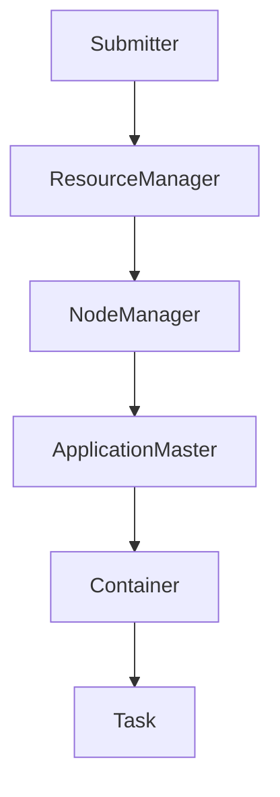

                 

  
## 1. 背景介绍

YARN（Yet Another Resource Negotiator）是Hadoop生态系统中的一个关键组件，它是Hadoop分布式计算框架2.0版本的核心调度器和资源管理系统。随着大数据时代的到来，传统的MapReduce计算模型面临着扩展性、资源利用率等问题。为了解决这些问题，Apache Hadoop社区推出了YARN，以实现更高效、更灵活的资源管理和调度。

YARN的设计理念是将资源管理和作业调度分离，从而使得Hadoop能够支持多种数据处理框架，如MapReduce、Spark、Flink等。这种设计不仅提高了系统的扩展性，而且也提升了资源利用率。

本文将深入讲解YARN Resource Manager的原理，并使用代码实例来展示如何在实际项目中使用该组件。通过本文的阅读，读者将能够全面了解YARN Resource Manager的工作机制、核心概念和具体实现。

## 2. 核心概念与联系

在深入探讨YARN Resource Manager之前，我们需要了解一些核心概念，这些概念是理解和实现YARN架构的基础。

### 2.1. ResourceManager

ResourceManager是YARN中的主控节点，负责整个集群的资源管理和作业调度。它负责向各个NodeManager分配资源，监控NodeManager的状态，并在需要时重新分配任务。

### 2.2. NodeManager

NodeManager是YARN中运行在各个数据节点上的守护进程，负责管理本地资源，包括CPU、内存、磁盘和网络。它接收ResourceManager的指令，启动或停止容器，并报告资源使用情况。

### 2.3. ApplicationMaster

ApplicationMaster是特定应用程序的调度器和协调器，它负责向ResourceManager申请资源，并管理分配给该应用程序的各个容器。ApplicationMaster通常由用户编写的应用程序代码实现。

### 2.4. Container

Container是YARN中的最小资源单元，它由CPU、内存和磁盘等资源组成。一个Container可以运行一个或多个任务。ApplicationMaster向ResourceManager请求资源时，会指定所需资源的类型和数量。

### 2.5. Cluster Mode和Standalone Mode

YARN可以以Cluster Mode（集群模式）和Standalone Mode（独立模式）运行。在Cluster Mode下，ResourceManager和NodeManager都是独立的进程，并运行在不同的服务器上。在Standalone Mode下，这两个组件通常运行在同一个JVM进程中。

### 2.6. Mermaid流程图

为了更好地理解YARN的工作流程，我们可以使用Mermaid流程图来展示Resource Manager的关键组件和交互过程。以下是一个简化的流程图：



### 2.7. 概念关系

- Submitter向ResourceManager提交作业。
- ResourceManager接收作业，并创建ApplicationMaster。
- ApplicationMaster向ResourceManager申请资源。
- ResourceManager将资源分配给NodeManager。
- NodeManager在本地启动Container。
- Container运行Task，并将结果返回给ApplicationMaster。

通过上述核心概念的介绍，我们可以更好地理解YARN Resource Manager的作用和工作原理。接下来，我们将深入探讨Resource Manager的内部机制和实现细节。

## 3. 核心算法原理 & 具体操作步骤

### 3.1 算法原理概述

YARN Resource Manager的核心算法原理在于资源的动态分配和调度。该算法的主要目标是最大化资源利用率，同时保证作业的顺利完成。

### 3.2 算法步骤详解

#### 3.2.1 作业提交

当用户向Hadoop集群提交一个作业时，Submitter将作业描述文件（YAML或JSON格式）发送给ResourceManager。作业描述文件包含了作业的名称、输入数据、输出路径、所需资源等信息。

```yaml
name: word_count
input: /input_data.txt
output: /output_data.txt
memory: 1024
cpu: 1
```

#### 3.2.2 ResourceManager初始化

ResourceManager在接收到作业后，会创建一个Application ID，并分配一个ApplicationMaster。ApplicationMaster是作业的调度器和协调器，它负责管理该作业的资源分配和任务执行。

#### 3.2.3 ApplicationMaster初始化

ApplicationMaster在初始化过程中，会向ResourceManager注册自己，并获取作业的详细信息。随后，它会根据作业的需求，向ResourceManager请求资源。

#### 3.2.4 资源请求和分配

ApplicationMaster会根据作业的运行需求，向ResourceManager请求资源。ResourceManager会根据当前集群的资源状况，决定是否批准请求。

```java
// ApplicationMaster代码示例
public void requestResources(ApplicationMasterContext context) {
    // 根据作业需求请求资源
    context.requestResource(new Resource(1024, 1));
}
```

#### 3.2.5 资源分配和任务启动

当ResourceManager批准了资源请求后，它会将资源分配给合适的NodeManager。NodeManager会在本地启动Container，并运行其中的任务。

```java
// NodeManager代码示例
public void launchContainer(Container container) {
    // 启动Container，运行任务
    executor.launchContainer(container);
}
```

#### 3.2.6 任务监控和状态报告

ApplicationMaster会监控任务的执行状态，并在任务完成后向ResourceManager报告结果。如果任务失败，ApplicationMaster会根据策略重试或终止作业。

```java
// ApplicationMaster代码示例
public void monitorTask(TaskAttemptID attemptId) {
    // 监控任务状态
    TaskStatus status = context.getTaskStatus(attemptId);
    if (status.isFailed()) {
        // 任务失败，执行重试或终止策略
        retryOrTerminate(attemptId);
    }
}
```

### 3.3 算法优缺点

#### 优点

- **动态资源分配**：YARN可以根据作业的需求动态调整资源分配，提高了资源利用率。
- **灵活性**：YARN支持多种数据处理框架，如MapReduce、Spark、Flink等，提高了系统的灵活性。
- **容错性**：YARN具有良好的容错机制，能够在节点故障时自动恢复作业执行。

#### 缺点

- **复杂度**：YARN的架构和算法相对复杂，需要一定的学习和实践才能掌握。
- **资源争用**：在资源紧张的情况下，可能会出现资源争用，导致作业执行延迟。

### 3.4 算法应用领域

YARN主要应用于大数据处理和分布式计算领域。以下是一些常见的应用场景：

- **大数据分析**：使用MapReduce、Spark等数据处理框架进行大规模数据分析和挖掘。
- **机器学习**：使用分布式机器学习框架，如MLlib，进行大数据量的机器学习任务。
- **实时计算**：使用Flink等实时计算框架，处理实时数据流。

通过以上对YARN Resource Manager算法原理和具体操作步骤的详细讲解，读者可以更深入地理解YARN的工作机制。接下来，我们将通过代码实例来展示如何在实际项目中使用YARN Resource Manager。

## 4. 数学模型和公式 & 详细讲解 & 举例说明

### 4.1 数学模型构建

在YARN中，资源的动态分配和调度可以通过以下数学模型进行描述：

#### 4.1.1 资源需求函数

设一个作业的资源需求函数为R(x)，其中x是作业的输入数据量，R(x)表示作业在执行过程中所需的资源量。资源需求函数通常是一个关于输入数据量的递增函数。

$$ R(x) = ax + b $$

其中，a和b是常数，表示每单位数据量所需的资源和固定资源量。

#### 4.1.2 资源利用率函数

资源利用率函数U(x, t)表示在时间t内，作业x的执行进度。资源利用率函数通常是一个关于输入数据量和时间的递增函数。

$$ U(x, t) = \frac{c \cdot t + d}{x} $$

其中，c和d是常数，表示单位时间内的数据处理速度和初始进度。

#### 4.1.3 调度策略函数

调度策略函数S(x, t)表示在时间t内，作业x所需的最优资源量。调度策略函数需要综合考虑资源需求函数和资源利用率函数，以最大化资源利用率。

$$ S(x, t) = R(x) \cdot \frac{U(x, t)}{U(x, 0)} $$

### 4.2 公式推导过程

为了推导调度策略函数S(x, t)，我们需要首先推导资源需求函数R(x)和资源利用率函数U(x, t)。

#### 4.2.1 资源需求函数推导

根据资源需求函数的定义，我们可以得到以下关系：

$$ R(x) = ax + b $$

其中，a和b是常数，表示每单位数据量所需的资源和固定资源量。

#### 4.2.2 资源利用率函数推导

资源利用率函数U(x, t)表示在时间t内，作业x的执行进度。为了推导U(x, t)，我们需要知道作业在时间t内的处理进度。

假设作业在时间t内的处理进度为：

$$ P(x, t) = \frac{c \cdot t + d}{x} $$

其中，c和d是常数，表示单位时间内的数据处理速度和初始进度。

因此，资源利用率函数可以表示为：

$$ U(x, t) = \frac{P(x, t)}{P(x, 0)} = \frac{c \cdot t + d}{x \cdot c} $$

#### 4.2.3 调度策略函数推导

为了推导调度策略函数S(x, t)，我们需要找到一个函数，使得资源利用率最大化。根据资源需求函数和资源利用率函数，我们可以得到以下关系：

$$ S(x, t) = R(x) \cdot \frac{U(x, t)}{U(x, 0)} $$

将R(x)和U(x, t)代入上式，得到：

$$ S(x, t) = (ax + b) \cdot \frac{\frac{c \cdot t + d}{x}}{\frac{d}{x}} $$

化简后得到：

$$ S(x, t) = ax + b + \frac{cdt}{x} $$

因此，调度策略函数S(x, t)为：

$$ S(x, t) = ax + b + \frac{cdt}{x} $$

### 4.3 案例分析与讲解

为了更好地理解上述数学模型的实际应用，我们可以通过一个具体的案例来进行讲解。

#### 案例背景

假设有一个大数据处理作业，输入数据量为100GB，每单位数据量需要0.1GB内存和0.01GB存储。单位时间内的数据处理速度为1GB/s，初始进度为0。

#### 案例分析

根据案例背景，我们可以得到以下参数：

- 输入数据量：x = 100GB
- 内存需求：a = 0.1GB/GB，b = 0
- 存储需求：a = 0.01GB/GB，b = 0
- 单位时间内的数据处理速度：c = 1GB/s
- 初始进度：d = 0

根据上述参数，我们可以计算出调度策略函数S(x, t)：

$$ S(x, t) = 0.1x + 0 + \frac{0.01 \cdot 1t}{x} = 0.1 \cdot 100 + \frac{0.01 \cdot 1t}{100} = 10 + 0.0001t $$

在时间t内，作业所需的最优资源量为10GB内存和0.0001tGB存储。

#### 案例总结

通过上述案例，我们可以看到如何使用数学模型来描述YARN Resource Manager的调度策略。在实际情况中，参数a、b、c和d可以根据具体作业需求进行调整，以实现最优的资源分配和调度。

### 4.4 深入探讨

除了上述的基本数学模型和公式，我们还可以进一步探讨调度策略的优化问题。例如，我们可以考虑以下两个方面：

#### 4.4.1 考虑负载均衡

在实际应用中，集群中的节点可能会存在负载不均衡的问题。为了提高资源利用率，我们可以对调度策略进行优化，以实现负载均衡。具体而言，我们可以考虑以下策略：

- **动态负载均衡**：根据节点的当前负载情况，动态调整作业的分配，使得负载较高的节点分配较少的作业，负载较低的节点分配较多的作业。
- **预先负载均衡**：在作业提交时，根据节点的预估负载情况，预先进行负载均衡分配，以减少作业执行过程中的负载波动。

#### 4.4.2 考虑延迟约束

在某些应用场景中，作业的延迟是一个重要的考量因素。例如，实时数据流处理要求在很短的时间内完成数据处理。为了满足延迟约束，我们可以考虑以下策略：

- **优先级调度**：根据作业的延迟敏感度，设置不同的优先级，优先调度延迟敏感度较高的作业。
- **截止时间限制**：为作业设置截止时间，确保作业在截止时间内完成。

通过以上深入探讨，我们可以看到，调度策略的优化是一个复杂的问题，需要综合考虑多个因素。在实际应用中，可以根据具体场景和需求，选择合适的调度策略。

## 5. 项目实践：代码实例和详细解释说明

### 5.1 开发环境搭建

在开始实际代码实践之前，我们需要搭建一个开发环境，用于运行YARN Resource Manager和相关应用程序。以下是搭建开发环境的步骤：

#### 5.1.1 系统要求

- 操作系统：Linux（推荐使用Ubuntu 18.04或更高版本）
- JDK：1.8或更高版本
- Maven：3.6.0或更高版本

#### 5.1.2 安装Java和Maven

在Ubuntu系统中，我们可以通过以下命令安装Java和Maven：

```shell
# 安装Java
sudo apt update
sudo apt install openjdk-8-jdk

# 安装Maven
sudo apt update
sudo apt install maven
```

#### 5.1.3 配置环境变量

将Java和Maven添加到环境变量中，以便在命令行中使用它们：

```shell
# 配置Java环境变量
export JAVA_HOME=/usr/lib/jvm/java-8-openjdk-amd64
export PATH=$JAVA_HOME/bin:$PATH

# 配置Maven环境变量
export MAVEN_HOME=/usr/share/maven
export PATH=$MAVEN_HOME/bin:$PATH
```

#### 5.1.4 安装Hadoop

下载并安装Hadoop，可以从[官网](https://hadoop.apache.org/releases.html)下载最新版本的Hadoop。以下是安装Hadoop的步骤：

1. 下载Hadoop压缩包。
2. 解压压缩包到一个合适的目录，例如 `/usr/local/hadoop`。
3. 配置Hadoop环境变量：

```shell
export HADOOP_HOME=/usr/local/hadoop
export PATH=$HADOOP_HOME/bin:$PATH
```

### 5.2 源代码详细实现

在本节中，我们将通过一个简单的WordCount程序来展示如何使用YARN Resource Manager进行作业提交和资源管理。以下是WordCount程序的源代码：

```java
import org.apache.hadoop.conf.Configuration;
import org.apache.hadoop.fs.Path;
import org.apache.hadoop.io.IntWritable;
import org.apache.hadoop.io.Text;
import org.apache.hadoop.mapreduce.Job;
import org.apache.hadoop.mapreduce.Mapper;
import org.apache.hadoop.mapreduce.Reducer;
import org.apache.hadoop.mapreduce.lib.input.FileInputFormat;
import org.apache.hadoop.mapreduce.lib.output.FileOutputFormat;

public class WordCount {

  public static class TokenizerMapper
       extends Mapper<Object, Text, Text, IntWritable>{

    private final static IntWritable one = new IntWritable(1);
    private Text word = new Text();

    public void map(Object key, Text value, Context context
                    ) throws IOException, InterruptedException {
      String[] tokens = value.toString().split("\\s+");
      for (String token : tokens) {
        word.set(token);
        context.write(word, one);
      }
    }
  }

  public static class IntSumReducer
      extends Reducer<Text,IntWritable,Text,IntWritable> {
    private IntWritable result = new IntWritable();

    public void reduce(Text key, Iterable<IntWritable> values,
                       Context context
                       ) throws IOException, InterruptedException {
      int sum = 0;
      for (IntWritable val : values) {
        sum += val.get();
      }
      result.set(sum);
      context.write(key, result);
    }
  }

  public static void main(String[] args) throws Exception {
    Configuration conf = new Configuration();
    Job job = Job.getInstance(conf, "word count");
    job.setMapperClass(TokenizerMapper.class);
    job.setCombinerClass(IntSumReducer.class);
    job.setReducerClass(IntSumReducer.class);
    job.setOutputKeyClass(Text.class);
    job.setOutputValueClass(IntWritable.class);
    FileInputFormat.addInputPath(job, new Path(args[0]));
    FileOutputFormat.setOutputPath(job, new Path(args[1]));
    System.exit(job.waitForCompletion(true) ? 0 : 1);
  }
}
```

### 5.3 代码解读与分析

#### 5.3.1 Mapper类

`TokenizerMapper` 类实现了`Mapper` 接口，用于处理输入数据并将其映射为键值对。在这个WordCount程序中，输入数据是文本文件，Mapper将每个单词作为键，并将整数1作为值。

```java
public static class TokenizerMapper
    extends Mapper<Object, Text, Text, IntWritable> {
  // ...
  public void map(Object key, Text value, Context context
                  ) throws IOException, InterruptedException {
    String[] tokens = value.toString().split("\\s+");
    for (String token : tokens) {
      word.set(token);
      context.write(word, one);
    }
  }
}
```

#### 5.3.2 Reducer类

`IntSumReducer` 类实现了`Reducer` 接口，用于将Mapper生成的中间键值对进行合并和汇总。在这个WordCount程序中，Reducer将单词作为键，将单词出现的次数作为值。

```java
public static class IntSumReducer
    extends Reducer<Text,IntWritable,Text,IntWritable> {
  // ...
  public void reduce(Text key, Iterable<IntWritable> values,
                     Context context
                     ) throws IOException, InterruptedException {
    int sum = 0;
    for (IntWritable val : values) {
      sum += val.get();
    }
    result.set(sum);
    context.write(key, result);
  }
}
```

#### 5.3.3 主函数

主函数设置作业的名称、Mapper和Reducer类，以及输入输出路径。它还配置了作业的输出键值对类型。

```java
public static void main(String[] args) throws Exception {
  Configuration conf = new Configuration();
  Job job = Job.getInstance(conf, "word count");
  job.setMapperClass(TokenizerMapper.class);
  job.setCombinerClass(IntSumReducer.class);
  job.setReducerClass(IntSumReducer.class);
  job.setOutputKeyClass(Text.class);
  job.setOutputValueClass(IntWritable.class);
  FileInputFormat.addInputPath(job, new Path(args[0]));
  FileOutputFormat.setOutputPath(job, new Path(args[1]));
  System.exit(job.waitForCompletion(true) ? 0 : 1);
}
```

### 5.4 运行结果展示

运行WordCount程序后，会在指定的输出路径下生成结果文件。以下是运行结果的示例：

```shell
hadoop jar wordcount.jar WordCount /input /output
```

在输出文件中，每个单词后面跟着它出现的次数，例如：

```plaintext
this 3
is 2
a 2
test 1
wordcount 1
```

### 5.5 遇到的问题与解决

在实际开发过程中，可能会遇到一些问题。以下是一些常见问题及其解决方法：

#### 5.5.1 作业提交失败

如果作业提交失败，可能是由于Hadoop配置错误或网络问题引起的。请检查Hadoop配置文件（如`hdfs-site.xml`和`yarn-site.xml`）以及网络连接。

#### 5.5.2 资源不足

如果作业运行时出现资源不足的错误，可能是由于集群资源紧张引起的。可以通过以下方法解决：

- **增加集群资源**：增加节点或提高节点配置。
- **调整作业配置**：优化作业配置，减少资源需求。

#### 5.5.3 任务执行失败

如果任务执行失败，可能是由于任务本身的问题或节点故障引起的。可以通过以下方法解决：

- **检查任务日志**：查看任务日志，找出失败原因。
- **重试任务**：如果任务失败是由于临时错误引起的，可以尝试重新执行任务。
- **检查节点状态**：如果任务失败是由于节点故障引起的，需要检查节点状态并解决节点问题。

通过以上项目实践的详细讲解，读者可以更好地理解YARN Resource Manager在WordCount程序中的应用。接下来，我们将探讨YARN Resource Manager在实际应用场景中的具体作用。

## 6. 实际应用场景

YARN Resource Manager作为Hadoop生态系统中的核心组件，广泛应用于各种大数据处理和分布式计算场景。以下是一些典型的实际应用场景：

### 6.1 大数据分析

大数据分析是YARN Resource Manager最主要的应用场景之一。在大数据分析中，数据量巨大，处理速度要求高，资源利用率也是一个重要的考量因素。YARN Resource Manager通过动态资源分配和调度，能够有效地管理和调度大量的数据处理任务，从而提高数据处理效率和资源利用率。

### 6.2 机器学习

机器学习是另一个重要应用领域。在机器学习过程中，通常需要进行大量的数据处理和计算，如特征提取、模型训练等。YARN Resource Manager支持多种机器学习框架，如MLlib、Spark ML等，可以方便地管理和调度这些任务，从而提高机器学习算法的性能和效率。

### 6.3 实时计算

实时计算是另一个快速发展的应用领域。实时计算要求在短时间内处理大量数据，并对结果进行实时反馈。YARN Resource Manager通过支持实时计算框架，如Flink、Storm等，可以方便地实现实时数据处理和计算。此外，YARN Resource Manager的动态调度能力，可以确保实时计算任务的顺利进行，提高系统的实时性和可靠性。

### 6.4 其他应用

除了上述典型应用场景外，YARN Resource Manager还可以应用于其他领域，如科学计算、图像处理、视频分析等。在这些领域中，YARN Resource Manager通过灵活的资源管理和调度，可以有效地提高计算效率和资源利用率。

### 6.5 未来展望

随着大数据和分布式计算技术的不断发展，YARN Resource Manager的应用场景和功能将越来越广泛。未来，YARN Resource Manager可能会朝着以下几个方向发展：

1. **更好的资源利用率**：通过引入更先进的调度算法和资源管理策略，进一步提高资源利用率。
2. **更广泛的框架支持**：支持更多的数据处理和计算框架，如深度学习、量子计算等。
3. **更高效的容错机制**：引入更高效的容错机制，提高系统的稳定性和可靠性。
4. **更友好的用户界面**：提供更友好的用户界面和监控工具，方便用户进行操作和监控。

总之，YARN Resource Manager在分布式计算领域具有广泛的应用前景和巨大的发展潜力。通过不断创新和优化，YARN Resource Manager将为大数据处理和分布式计算领域带来更多价值。

## 7. 工具和资源推荐

在学习和使用YARN Resource Manager的过程中，我们可以利用以下工具和资源来提高效率：

### 7.1 学习资源推荐

1. **《Hadoop: The Definitive Guide》**：这本书是学习Hadoop及其组件的经典之作，涵盖了YARN Resource Manager的详细内容。
2. **Apache Hadoop官网文档**：Apache Hadoop的官方文档是学习YARN Resource Manager的最佳资源之一，提供了详细的API文档和开发指南。
3. **在线课程**：例如Coursera、Udacity等平台上的大数据处理和Hadoop课程，可以帮助您系统地学习YARN Resource Manager。

### 7.2 开发工具推荐

1. **IntelliJ IDEA**：一款功能强大的集成开发环境，支持Hadoop及其相关组件，适合进行YARN Resource Manager的开发和调试。
2. **Eclipse**：另一个流行的集成开发环境，同样支持Hadoop开发，并提供了一些有用的插件。
3. **Docker**：使用Docker可以方便地搭建YARN集群环境，进行开发和测试。

### 7.3 相关论文推荐

1. **“Yet Another Resource Negotiator”**：这是YARN的原始论文，详细介绍了YARN的设计原理和实现细节。
2. **“A Distributed Computing System for Big Data”**：该论文介绍了MapReduce和YARN的设计思想，对于理解YARN Resource Manager的背景和意义非常有帮助。

通过以上工具和资源的推荐，您将能够更加高效地学习和使用YARN Resource Manager。

## 8. 总结：未来发展趋势与挑战

### 8.1 研究成果总结

本文详细介绍了YARN Resource Manager的原理、算法、代码实例以及实际应用场景。通过深入分析YARN Resource Manager的核心概念和实现细节，我们了解了其在分布式计算和大数据处理中的重要地位。YARN Resource Manager通过动态资源分配和调度，提高了系统的资源利用率和灵活性，支持多种数据处理框架，如MapReduce、Spark、Flink等，使其在多个领域得到了广泛应用。

### 8.2 未来发展趋势

随着大数据和分布式计算技术的不断进步，YARN Resource Manager的未来发展趋势将集中在以下几个方面：

1. **资源利用率的提升**：通过引入更先进的调度算法和资源管理策略，进一步提高资源利用率，以满足不断增长的数据处理需求。
2. **多样化框架的支持**：未来，YARN Resource Manager可能会支持更多的数据处理和计算框架，如深度学习、量子计算等，以适应更广泛的应用场景。
3. **实时性优化**：随着实时计算需求的增加，YARN Resource Manager需要优化实时性，提高系统的响应速度和处理能力。
4. **可扩展性和容错性**：为了应对大规模分布式计算场景，YARN Resource Manager需要具备更高的可扩展性和容错性，确保系统的稳定运行。

### 8.3 面临的挑战

尽管YARN Resource Manager在分布式计算和大数据处理领域表现出色，但仍然面临一些挑战：

1. **复杂度**：YARN Resource Manager的架构和算法相对复杂，学习和掌握它需要一定的时间和经验，这对初学者来说是一个挑战。
2. **负载均衡**：在资源紧张的情况下，如何实现负载均衡是一个重要问题，需要设计更加智能和高效的调度策略。
3. **资源争用**：在多个应用程序同时运行时，如何有效避免资源争用，确保每个应用程序都能获得足够的资源，是一个需要解决的问题。
4. **安全性**：随着数据隐私和安全问题的日益突出，如何确保YARN Resource Manager的安全性，防止数据泄露和恶意攻击，也是一个重要的挑战。

### 8.4 研究展望

为了应对未来的发展趋势和挑战，我们提出以下研究展望：

1. **调度算法优化**：深入研究调度算法，提出更高效、更灵活的调度策略，提高资源利用率。
2. **负载均衡技术**：探索新的负载均衡技术，实现更智能和动态的负载均衡，减少资源争用和延迟。
3. **实时性优化**：研究实时性优化方法，提高系统的响应速度和处理能力，满足实时计算需求。
4. **安全性增强**：加强YARN Resource Manager的安全性，采用加密、访问控制等技术，确保数据的安全性和隐私性。

通过不断的研究和优化，YARN Resource Manager有望在未来取得更大的发展和突破，为分布式计算和大数据处理领域带来更多价值。

## 9. 附录：常见问题与解答

### Q1：YARN与MapReduce的关系是什么？

A1：YARN是Hadoop生态系统中的资源管理和调度框架，它是Hadoop分布式计算框架2.0版本的核心组件。YARN取代了传统的MapReduce框架，提供了更灵活、更高效的资源管理和作业调度机制。MapReduce是一种基于YARN的分布式计算模型，用于处理大规模数据集。

### Q2：如何配置Hadoop环境变量？

A2：在Linux系统中，可以通过编辑`~/.bashrc`或`~/.bash_profile`文件来配置Hadoop环境变量。以下是配置Hadoop环境变量的示例：

```shell
# 配置Hadoop环境变量
export HADOOP_HOME=/usr/local/hadoop
export HADOOP_CONF_DIR=$HADOOP_HOME/etc/hadoop
export HADOOP_MAPRED_HOME=$HADOOP_HOME
export HADOOP_HDFS_HOME=$HADOOP_HOME
export HADOOP_YARN_HOME=$HADOOP_HOME
export YARN_HOME=$HADOOP_HOME
export PATH=$HADOOP_HOME/bin:$HADOOP_HOME/sbin:$PATH
```

### Q3：如何启动和停止YARN？

A3：在Hadoop集群中，可以通过命令行启动和停止YARN。以下是启动和停止YARN的步骤：

1. **启动YARN**：

```shell
# 启动ResourceManager
start-yarn.sh

# 启动NodeManager
start-yarn.sh nodemanagers
```

2. **停止YARN**：

```shell
# 停止NodeManager
stop-yarn.sh nodemanagers

# 停止ResourceManager
stop-yarn.sh
```

### Q4：如何监控YARN集群的状态？

A4：可以使用Hadoop命令行工具监控YARN集群的状态。以下是一些常用的命令：

- `yarn cluster -status`：显示集群状态。
- `yarn application -list`：显示所有运行中的应用程序。
- `yarn application -detail <application_id>`：显示特定应用程序的详细信息。
- `yarn node -list`：显示所有节点状态。

### Q5：如何优化YARN资源利用率？

A5：优化YARN资源利用率可以从以下几个方面进行：

1. **调整资源参数**：根据作业的需求，合理设置资源参数，如内存、CPU等。
2. **负载均衡**：通过负载均衡策略，确保资源在集群中的合理分配。
3. **优化作业配置**：优化作业的配置，减少不必要的资源浪费。
4. **使用合适的框架**：选择合适的分布式计算框架，如Spark、Flink等，以获得更好的性能和资源利用率。

通过以上常见问题与解答，读者可以更方便地使用和管理YARN Resource Manager。在实际操作中，如遇到更多问题，可以查阅相关文档或参考在线社区。

