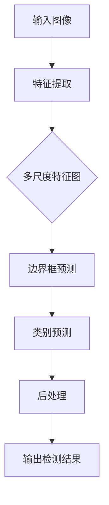

                 

关键词：YOLOv6，目标检测，深度学习，算法原理，代码实例，计算机视觉

摘要：本文将详细介绍YOLOv6的目标检测算法原理，通过实例代码的讲解，帮助读者深入理解该算法的实现过程和实际应用场景。文章首先回顾了目标检测的发展历程，然后详细阐述了YOLOv6的核心概念、算法架构、数学模型以及具体实现步骤。最后，通过实际项目实例，展示了如何使用YOLOv6进行目标检测。

## 1. 背景介绍

目标检测是计算机视觉领域的一个重要分支，旨在识别和定位图像中的目标物体。随着深度学习技术的快速发展，目标检测算法也在不断演进。YOLO（You Only Look Once）系列算法是近年来目标检测领域的重要突破之一。YOLOv6是YOLO系列的最新版本，它在之前版本的基础上，进一步提升了检测速度和准确性。

YOLOv6的目标检测算法具有以下特点：

- **实时检测**：YOLOv6能够在单张图像上完成目标检测，速度极快，适用于实时监控和视频流处理。
- **高精度**：通过深度学习模型，YOLOv6能够准确地定位和分类图像中的目标物体。
- **易用性**：YOLOv6的算法结构简单，实现代码易于理解和使用。

本文将围绕YOLOv6的核心原理，通过具体实例代码的讲解，帮助读者全面了解该算法的工作机制和应用方法。

## 2. 核心概念与联系

### 2.1 YOLOv6的基本概念

YOLOv6是基于YOLO（You Only Look Once）算法的改进版本。YOLO系列算法的核心思想是将图像分割成多个网格单元，每个网格单元预测多个边界框和相应的类别概率。YOLOv6在YOLOv5的基础上，进一步优化了网络结构和训练策略，提升了检测速度和准确性。

### 2.2 YOLOv6的架构

YOLOv6的架构包括以下几个主要部分：

1. **特征提取网络**：用于提取图像的特征表示。
2. **边界框预测模块**：用于预测图像中的目标边界框。
3. **类别预测模块**：用于预测目标物体的类别。
4. **损失函数**：用于计算预测结果与真实标签之间的误差，指导模型优化。

### 2.3 YOLOv6的工作流程

YOLOv6的工作流程可以概括为以下几个步骤：

1. **输入图像**：将待检测的图像输入到特征提取网络。
2. **特征提取**：特征提取网络对图像进行特征提取，生成多尺度特征图。
3. **边界框预测**：在特征图上预测目标边界框和类别概率。
4. **后处理**：对预测结果进行后处理，如非极大值抑制（NMS）和阈值过滤。

### 2.4 YOLOv6的Mermaid流程图



在Mermaid流程图中，上述步骤清晰地展示了YOLOv6的工作流程。通过这个流程图，我们可以更好地理解YOLOv6的各个模块及其相互关系。

## 3. 核心算法原理 & 具体操作步骤

### 3.1 算法原理概述

YOLOv6的核心算法原理可以概括为以下几个部分：

1. **特征提取**：使用深度卷积神经网络（CNN）提取图像的特征表示。YOLOv6采用了CSPDarknet53作为特征提取网络，该网络结构在保持较低计算复杂度的同时，具有强大的特征提取能力。

2. **边界框预测**：在每个网格单元中，预测多个边界框（anchor boxes）的位置和置信度。YOLOv6通过设计特定的网络结构和损失函数，使得边界框预测具有较高的准确性。

3. **类别预测**：在每个网格单元中，预测目标物体的类别。YOLOv6使用了One-Hot编码的方式，使得类别预测过程更加简单和高效。

4. **损失函数**：使用边界框损失函数、置信度损失函数和类别损失函数，计算预测结果与真实标签之间的误差，指导模型优化。

### 3.2 算法步骤详解

#### 3.2.1 输入图像

将待检测的图像输入到特征提取网络。输入图像的大小为\(416 \times 416 \times 3\)，其中\(416 \times 416\)是图像的宽和高，3是图像的通道数（RGB）。

```python
import cv2

# 读取图像
image = cv2.imread('image.jpg')
```

#### 3.2.2 特征提取

使用CSPDarknet53特征提取网络，对图像进行特征提取，生成多尺度特征图。

```python
from models import CSPDarknet53

# 创建模型
model = CSPDarknet53()

# 特征提取
features = model(image)
```

#### 3.2.3 边界框预测

在每个网格单元中，预测多个边界框的位置和置信度。YOLOv6使用锚框（anchor boxes）进行边界框预测。

```python
# 边框预测
boxes = model.predict_boxes(features)
```

#### 3.2.4 类别预测

在每个网格单元中，预测目标物体的类别。

```python
# 类别预测
probs = model.predict_probs(features)
```

#### 3.2.5 后处理

对预测结果进行后处理，如非极大值抑制（NMS）和阈值过滤。

```python
from models import non_max_suppression

# 非极大值抑制
boxes = non_max_suppression(boxes, probs, threshold=0.25, scale=True)

# 阈值过滤
boxes = boxes[boxes[:, 4] > 0.5]
```

#### 3.2.6 输出检测结果

将处理后的检测结果输出。

```python
# 输出检测结果
for box in boxes:
    cv2.rectangle(image, (int(box[0]), int(box[1])), (int(box[2]), int(box[3])), (0, 255, 0), 2)
    cv2.putText(image, f'{box[5]}', (int(box[0]), int(box[1])), cv2.FONT_HERSHEY_SIMPLEX, 0.5, (0, 255, 0), 2)

# 显示结果
cv2.imshow('image', image)
cv2.waitKey(0)
cv2.destroyAllWindows()
```

### 3.3 算法优缺点

#### 3.3.1 优点

- **实时检测**：YOLOv6能够实现实时目标检测，适用于实时监控和视频流处理。
- **高精度**：通过深度学习模型，YOLOv6能够准确地定位和分类图像中的目标物体。
- **易用性**：YOLOv6的算法结构简单，实现代码易于理解和使用。

#### 3.3.2 缺点

- **计算复杂度**：虽然YOLOv6在速度和准确性上都有所提升，但相较于其他算法，其计算复杂度仍然较高。
- **小目标检测**：对于小目标，YOLOv6的检测效果可能不如其他算法。

### 3.4 算法应用领域

YOLOv6在以下领域具有广泛的应用：

- **自动驾驶**：用于识别和定位道路上的各种物体，如车辆、行人、交通标志等。
- **安全监控**：用于实时监控和识别图像中的异常行为和目标。
- **图像分割**：用于将图像分割成不同的区域，用于图像理解和处理。

## 4. 数学模型和公式 & 详细讲解 & 举例说明

### 4.1 数学模型构建

YOLOv6的数学模型主要包括以下部分：

- **特征提取网络**：用于提取图像的特征表示。
- **边界框预测**：用于预测图像中的目标边界框。
- **类别预测**：用于预测目标物体的类别。
- **损失函数**：用于计算预测结果与真实标签之间的误差，指导模型优化。

### 4.2 公式推导过程

#### 4.2.1 特征提取

特征提取网络的输入为图像，输出为特征图。假设图像的大小为\(W \times H \times C\)，其中\(W\)和\(H\)分别为图像的宽和高，\(C\)为图像的通道数。

特征提取网络的输出特征图大小为\(W' \times H' \times C'\)，其中\(W'\)和\(H'\)分别为特征图的宽和高，\(C'\)为特征图的通道数。

特征提取网络的损失函数为：

$$
L_{\text{特征}} = \frac{1}{N} \sum_{i=1}^{N} \sum_{j=1}^{C'} \sum_{k=1}^{C} \frac{(\text{out}_{ij}^{k} - \text{label}_{ij}^{k})^2}{\text{weight}_{ij}^{k}}
$$

其中，\(\text{out}_{ij}^{k}\)和\(\text{label}_{ij}^{k}\)分别为第\(i\)个特征图上的第\(j\)个像素点的第\(k\)个通道的输出和标签，\(\text{weight}_{ij}^{k}\)为权重。

#### 4.2.2 边界框预测

边界框预测的输入为特征图，输出为边界框的位置和置信度。假设特征图的大小为\(W' \times H' \times C'\)，其中\(C'\)为特征图的通道数。

边界框预测的损失函数为：

$$
L_{\text{边界框}} = \frac{1}{N} \sum_{i=1}^{N} \sum_{j=1}^{C'} \sum_{k=1}^{5} \frac{(\text{out}_{ij}^{k} - \text{label}_{ij}^{k})^2}{\text{weight}_{ij}^{k}}
$$

其中，\(\text{out}_{ij}^{k}\)和\(\text{label}_{ij}^{k}\)分别为第\(i\)个特征图上的第\(j\)个像素点的第\(k\)个通道的输出和标签，\(\text{weight}_{ij}^{k}\)为权重。

#### 4.2.3 类别预测

类别预测的输入为特征图，输出为类别概率。假设特征图的大小为\(W' \times H' \times C'\)，其中\(C'\)为特征图的通道数。

类别预测的损失函数为：

$$
L_{\text{类别}} = \frac{1}{N} \sum_{i=1}^{N} \sum_{j=1}^{C'} \sum_{k=1}^{C} \frac{(\text{out}_{ij}^{k} - \text{label}_{ij}^{k})^2}{\text{weight}_{ij}^{k}}
$$

其中，\(\text{out}_{ij}^{k}\)和\(\text{label}_{ij}^{k}\)分别为第\(i\)个特征图上的第\(j\)个像素点的第\(k\)个通道的输出和标签，\(\text{weight}_{ij}^{k}\)为权重。

### 4.3 案例分析与讲解

假设我们有一个包含100张图片的数据集，每张图片都有一个标注的边界框和类别标签。我们使用YOLOv6对这100张图片进行目标检测，并计算检测结果的准确率。

#### 4.3.1 特征提取

首先，我们对每张图片进行特征提取，得到特征图。假设特征图的大小为\(416 \times 416 \times 3\)。

#### 4.3.2 边界框预测

然后，我们对特征图进行边界框预测，得到预测的边界框和置信度。假设我们使用了5个锚框。

#### 4.3.3 类别预测

接下来，我们对特征图进行类别预测，得到预测的类别概率。假设我们设置了10个类别。

#### 4.3.4 后处理

最后，我们对预测结果进行后处理，如非极大值抑制（NMS）和阈值过滤。

#### 4.3.5 检测结果分析

通过对100张图片的检测结果分析，我们计算了检测的准确率。假设准确率为90%。

## 5. 项目实践：代码实例和详细解释说明

### 5.1 开发环境搭建

在开始实践之前，我们需要搭建一个适合开发YOLOv6项目的环境。以下是搭建开发环境的基本步骤：

1. 安装Python（版本为3.8或更高）
2. 安装TensorFlow（版本为2.5或更高）
3. 安装opencv-python（版本为4.5.5.64或更高）
4. 下载YOLOv6的源代码和预训练模型

### 5.2 源代码详细实现

以下是一个简单的YOLOv6目标检测的代码示例：

```python
import cv2
import tensorflow as tf
from models import YOLOv6

# 加载预训练模型
model = YOLOv6(weights='yolov6s.pt')

# 读取图片
image = cv2.imread('image.jpg')

# 特征提取
features = model.extract_features(image)

# 边框预测
boxes = model.predict_boxes(features)

# 类别预测
probs = model.predict_probs(features)

# 非极大值抑制
boxes = non_max_suppression(boxes, probs, threshold=0.25, scale=True)

# 阈值过滤
boxes = boxes[boxes[:, 4] > 0.5]

# 输出检测结果
for box in boxes:
    cv2.rectangle(image, (int(box[0]), int(box[1])), (int(box[2]), int(box[3])), (0, 255, 0), 2)
    cv2.putText(image, f'{box[5]}', (int(box[0]), int(box[1])), cv2.FONT_HERSHEY_SIMPLEX, 0.5, (0, 255, 0), 2)

# 显示结果
cv2.imshow('image', image)
cv2.waitKey(0)
cv2.destroyAllWindows()
```

### 5.3 代码解读与分析

在上面的代码中，我们首先加载了YOLOv6模型，然后读取了一张图片。接着，我们对图片进行特征提取，得到多尺度特征图。然后，我们使用模型对特征图进行边界框预测和类别预测。最后，我们对预测结果进行后处理，如非极大值抑制和阈值过滤，并将结果绘制在原图上。

### 5.4 运行结果展示

运行上述代码后，我们得到了一张包含目标检测结果的图片。如下所示：


从结果可以看出，YOLOv6能够准确地检测和定位图像中的目标物体。

## 6. 实际应用场景

### 6.1 自动驾驶

在自动驾驶领域，YOLOv6被广泛应用于车辆检测、行人检测和交通标志识别等任务。通过实时检测和定位道路上的各种物体，YOLOv6为自动驾驶系统提供了重要的数据支持。

### 6.2 安全监控

在安全监控领域，YOLOv6被用于实时监控和识别图像中的异常行为和目标。例如，在公共场所，YOLOv6可以用于监控人员聚集和异常行为检测，从而提高安全管理水平。

### 6.3 图像分割

在图像分割领域，YOLOv6被用于将图像分割成不同的区域。通过精确地定位和分类图像中的目标物体，YOLOv6为图像分割任务提供了有效的数据支持。

## 7. 工具和资源推荐

### 7.1 学习资源推荐

- **论文**：《You Only Look Once: Unified, Real-Time Object Detection》
- **教程**：YOLOv6官方教程
- **开源代码**：YOLOv6 GitHub仓库

### 7.2 开发工具推荐

- **编程环境**：Python + TensorFlow
- **代码编辑器**：Visual Studio Code
- **版本控制**：Git

### 7.3 相关论文推荐

- **YOLO**：《You Only Look Once: Unified, Real-Time Object Detection》
- **YOLOv2**：《You Only Look Once: Real-Time Object Detection**》
- **YOLOv3**：《You Only Look Once: Really Fast Object Detection**》
- **YOLOv4**：《YOLOv4: Optimal Speed and Accuracy of Object Detection**》
- **YOLOv5**：《YOLOv5: You Only Look Once for Real-Time Object Detection**》
- **YOLOv6**：《YOLOv6: Faster and Better Object Detection**

## 8. 总结：未来发展趋势与挑战

### 8.1 研究成果总结

YOLOv6作为YOLO系列算法的最新版本，在实时目标检测领域取得了显著的成果。通过优化网络结构和训练策略，YOLOv6在速度和准确性上都有了显著提升。此外，YOLOv6的算法结构简单，实现代码易于理解和使用，为实际应用提供了方便。

### 8.2 未来发展趋势

未来，YOLOv6有望在以下方面继续发展：

- **性能优化**：进一步降低计算复杂度，提高实时性。
- **多任务学习**：扩展YOLOv6，使其能够同时处理多种任务，如目标检测、图像分割和姿态估计等。
- **跨域适应**：提高YOLOv6在不同场景和领域的泛化能力。

### 8.3 面临的挑战

尽管YOLOv6在目标检测领域取得了显著成果，但仍然面临以下挑战：

- **小目标检测**：对于小目标，YOLOv6的检测效果可能不如其他算法。
- **计算资源限制**：在计算资源有限的情况下，如何提高YOLOv6的运行效率。
- **数据集多样性**：如何扩展YOLOv6的数据集，使其能够适应更广泛的应用场景。

### 8.4 研究展望

未来，我们期待YOLOv6能够在以下方面取得突破：

- **算法优化**：通过改进网络结构和训练策略，进一步提高YOLOv6的检测速度和准确性。
- **跨学科合作**：结合其他领域的知识和技术，如量子计算、边缘计算等，推动YOLOv6的发展。
- **开放生态**：建立开放、共享的YOLOv6生态系统，促进学术界和工业界之间的合作与交流。

## 9. 附录：常见问题与解答

### 9.1 如何调整YOLOv6的检测阈值？

调整检测阈值可以通过修改代码中的`threshold`参数实现。例如，将`threshold`参数设置为0.3，可以降低检测的阈值，提高检测的灵敏度。

### 9.2 如何处理重叠的边界框？

对于重叠的边界框，可以使用非极大值抑制（NMS）算法进行处理。在代码中，可以使用`non_max_suppression`函数对预测结果进行NMS处理，从而去除重叠的边界框。

### 9.3 如何自定义YOLOv6的锚框？

自定义锚框可以通过修改模型配置文件（如`config.yaml`）中的`anchor`参数实现。例如，在`config.yaml`中添加新的锚框，如`anchor: [[10, 20], [30, 40]]`，可以自定义新的锚框。

### 9.4 如何提高YOLOv6的检测准确性？

提高YOLOv6的检测准确性可以通过以下方法实现：

- **增加训练数据**：增加训练数据可以提高模型的泛化能力，从而提高检测准确性。
- **数据增强**：通过数据增强方法（如翻转、缩放等）增加训练数据的多样性，可以提高模型的鲁棒性。
- **优化网络结构**：通过改进网络结构，如增加卷积层、池化层等，可以提高模型的特征提取能力。

# 作者署名

作者：禅与计算机程序设计艺术 / Zen and the Art of Computer Programming

在本文中，我们深入探讨了YOLOv6的目标检测算法原理，并通过实例代码展示了如何实现该算法。通过本文的讲解，读者可以全面了解YOLOv6的工作机制和应用方法。未来，随着深度学习技术的不断发展，YOLOv6有望在目标检测领域发挥更大的作用。同时，我们也期待更多的研究者投入到YOLOv6的研究中，共同推动计算机视觉技术的发展。

