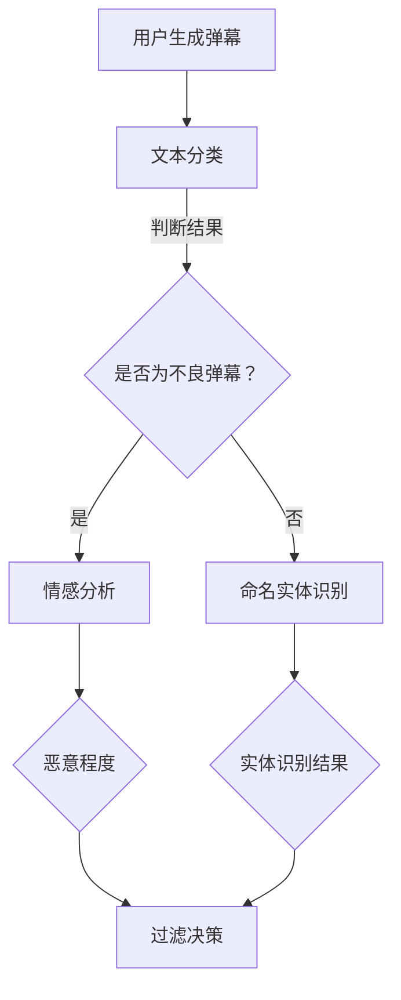

                 

### 1. 背景介绍

弹幕视频网站如bilibili是中国乃至全球年轻人喜爱的在线娱乐平台之一。随着用户数量的不断增长，bilibili平台的弹幕数量也在呈指数级增长。弹幕不仅给用户带来了丰富的互动体验，也成为平台内容的重要一部分。然而，随之而来的是大量不良弹幕的生成，如辱骂、色情、广告等，这些弹幕不仅影响了用户的观看体验，甚至可能触犯法律。

为了维护良好的网络环境，弹幕过滤系统应运而生。弹幕过滤系统通过对用户生成的弹幕进行实时分析，识别并过滤掉不良弹幕，从而提高平台的整体质量和用户体验。这对于平台运营者来说是一项极其重要的任务。

bilibili2024弹幕过滤校招NLP面试题，正是针对这一现实需求而设计的面试题目。此题目考查了应聘者在自然语言处理（NLP）领域的知识与应用能力，包括文本分类、情感分析、命名实体识别等关键技术。通过解答此题目，不仅可以展示应聘者在NLP领域的专业素养，还能体现其在解决实际问题时所采用的方法与策略。

### 2. 核心概念与联系

在解答bilibili2024弹幕过滤校招NLP面试题时，首先需要理解几个核心概念：文本分类、情感分析、命名实体识别，以及它们之间的联系。

#### 2.1 文本分类（Text Classification）

文本分类是指将文本数据按照预定的类别进行分类的过程。在弹幕过滤中，文本分类用于判断一条弹幕是否为不良弹幕。常见的文本分类算法有朴素贝叶斯（Naive Bayes）、支持向量机（SVM）、神经网络（Neural Networks）等。

#### 2.2 情感分析（Sentiment Analysis）

情感分析是一种特殊的文本分类，它通过分析文本中表达的情感倾向（如正面、负面、中性），来判断用户的情绪状态。在弹幕过滤中，情感分析可以帮助识别带有情绪色彩的恶意评论，从而提高过滤的准确性。

#### 2.3 命名实体识别（Named Entity Recognition）

命名实体识别（NER）是指从文本中识别出具有特定意义的实体，如人名、地名、组织名等。在弹幕过滤中，NER可以用于识别潜在的辱骂对象或涉及非法内容的实体，从而提高过滤的针对性。

#### 2.4 联系

文本分类、情感分析和命名实体识别在弹幕过滤中相互关联，共同构成了一套完整的过滤机制。具体来说：

- **文本分类**用于初步判断弹幕的性质，如是否为不良弹幕。
- **情感分析**进一步分析不良弹幕的情感倾向，以确定其恶意程度。
- **命名实体识别**用于识别弹幕中的特定实体，如人名、地名等，这些实体可能涉及到非法内容或辱骂行为。

下面是一个简单的Mermaid流程图，展示了这三个概念在弹幕过滤系统中的应用：



通过这个流程图，我们可以看出，弹幕过滤系统通过多层次的文本分析，实现对不良弹幕的精准识别与过滤。

### 3. 核心算法原理 & 具体操作步骤

#### 3.1 算法原理概述

在弹幕过滤系统中，常用的核心算法包括文本分类、情感分析和命名实体识别。每种算法都有其独特的原理和适用场景。

**文本分类**

文本分类是基于机器学习的方法，通过对大量已标注的训练数据学习分类模型。常见的算法有朴素贝叶斯、支持向量机（SVM）和神经网络。朴素贝叶斯算法基于贝叶斯定理和属性独立假设，适用于文本特征较少的场景。支持向量机通过最大化分类边界，适用于特征维度较高的文本数据。神经网络则通过多层非线性变换，适用于复杂的文本分类任务。

**情感分析**

情感分析通常基于文本的情感极性（如正面、负面、中性）进行分类。常用的算法包括基于规则的方法和基于机器学习的方法。基于规则的方法通过预设规则进行分类，适用于规则明确的情感分析任务。基于机器学习的方法则通过训练模型进行分类，适用于复杂的情感分析任务。

**命名实体识别**

命名实体识别（NER）是一种从文本中识别特定实体的方法。常见的算法包括基于规则的方法和基于统计的方法。基于规则的方法通过预设规则进行实体识别，适用于规则明确的实体识别任务。基于统计的方法通过统计特征进行实体识别，适用于大规模的实体识别任务。

#### 3.2 算法步骤详解

**文本分类**

1. **数据预处理**：包括文本清洗、分词、去停用词等。
2. **特征提取**：将文本转换为特征向量，如词袋模型、TF-IDF等。
3. **模型训练**：使用训练数据训练分类模型，如朴素贝叶斯、SVM等。
4. **模型评估**：使用测试数据评估模型性能，如准确率、召回率等。
5. **分类预测**：使用训练好的模型对新的弹幕进行分类预测。

**情感分析**

1. **数据预处理**：与文本分类相同，包括文本清洗、分词、去停用词等。
2. **特征提取**：使用词袋模型、TF-IDF等将文本转换为特征向量。
3. **情感词典构建**：构建包含正面、负面和中和情感倾向的词典。
4. **情感分类**：使用机器学习模型（如SVM、随机森林等）进行情感分类。
5. **情感预测**：使用训练好的模型对新的弹幕进行情感预测。

**命名实体识别**

1. **数据预处理**：与文本分类相同，包括文本清洗、分词、去停用词等。
2. **特征提取**：使用词袋模型、TF-IDF等将文本转换为特征向量。
3. **实体词典构建**：构建包含常见人名、地名、组织名等实体的词典。
4. **实体识别**：使用基于规则的方法或基于统计的方法进行实体识别。
5. **实体预测**：使用训练好的模型对新的弹幕进行实体识别预测。

#### 3.3 算法优缺点

**文本分类**

- **优点**：分类算法成熟，应用广泛，性能稳定。
- **缺点**：对特征提取和模型训练要求较高，计算复杂度较大。

**情感分析**

- **优点**：能够捕捉文本中的情感倾向，有助于提升用户体验。
- **缺点**：情感分类任务复杂，需要大量标注数据。

**命名实体识别**

- **优点**：能够识别文本中的关键实体，有助于提升过滤效果。
- **缺点**：对实体词典的依赖较大，实体识别精度受限于词典的丰富度。

#### 3.4 算法应用领域

**文本分类**

- 应用领域广泛，如垃圾邮件过滤、文本分类、舆情分析等。
- 在弹幕过滤中，主要用于判断弹幕是否为不良弹幕。

**情感分析**

- 应用领域广泛，如情感分析、用户反馈分析、市场调研等。
- 在弹幕过滤中，主要用于分析不良弹幕的情感倾向。

**命名实体识别**

- 应用领域广泛，如信息提取、关系抽取、知识图谱构建等。
- 在弹幕过滤中，主要用于识别弹幕中的特定实体，如人名、地名等。

### 4. 数学模型和公式 & 详细讲解 & 举例说明

在弹幕过滤系统中，数学模型和公式扮演着至关重要的角色，它们为我们提供了量化分析文本数据的方法，从而提高过滤的准确性和效率。以下是关于数学模型和公式的一些详细讲解以及实际应用的举例说明。

#### 4.1 数学模型构建

在弹幕过滤系统中，常用的数学模型包括概率模型、机器学习模型和深度学习模型等。以下分别介绍这些模型的构建方法。

**概率模型**

概率模型是最基础的数学模型之一，它基于概率论的基本原理，通过计算特征词的概率分布来判断文本的分类。常见的概率模型有朴素贝叶斯（Naive Bayes）和最大熵（Maximum Entropy）模型。

**朴素贝叶斯模型**

朴素贝叶斯模型的构建步骤如下：

1. **特征提取**：将文本转换为特征向量，通常使用词袋模型（Bag of Words，BoW）或TF-IDF（Term Frequency-Inverse Document Frequency）等方法。
2. **概率计算**：根据特征向量计算每个类别下的条件概率和先验概率，公式如下：

   $$P(C|X) = \frac{P(X|C) \cdot P(C)}{P(X)}$$

   其中，$P(C|X)$表示在特征向量$X$下类别$C$的条件概率，$P(X|C)$表示在类别$C$下特征向量$X$的条件概率，$P(C)$表示类别$C$的先验概率。

   **举例说明**：

   假设我们有一个包含两个类别的文本数据集，类别A和类别B。对于类别A，特征向量X的概率分布如下：

   $$P(A) = 0.6$$

   $$P(X|A) = [0.1, 0.2, 0.3, 0.2, 0.2]$$

   对于类别B，特征向量X的概率分布如下：

   $$P(B) = 0.4$$

   $$P(X|B) = [0.3, 0.3, 0.2, 0.2, 0.2]$$

   假设我们有一个新的特征向量$X = [0.2, 0.3, 0.2, 0.2, 0.1]$，我们需要计算类别A和类别B的条件概率，并选择概率较大的类别作为预测结果。

   $$P(A|X) = \frac{P(X|A) \cdot P(A)}{P(X)} = \frac{0.1 \cdot 0.6}{0.1 \cdot 0.6 + 0.3 \cdot 0.4} = 0.6$$

   $$P(B|X) = \frac{P(X|B) \cdot P(B)}{P(X)} = \frac{0.3 \cdot 0.4}{0.1 \cdot 0.6 + 0.3 \cdot 0.4} = 0.4$$

   因此，类别A的条件概率较大，我们选择类别A作为预测结果。

**最大熵模型**

最大熵模型通过最大化后验概率来构建分类模型。其基本思想是，在给定特征向量的条件下，最大化目标函数：

$$L = \sum_{i=1}^{n} \sum_{j=1}^{m} p_j \cdot \log(p_j)$$

其中，$p_j$表示类别$j$的后验概率。

**机器学习模型**

机器学习模型通过学习大量的标注数据来构建分类模型，常见的机器学习模型有支持向量机（SVM）、决策树（Decision Tree）和随机森林（Random Forest）等。

**支持向量机**

支持向量机通过寻找最佳分类边界来划分文本类别。其目标是最小化分类误差，公式如下：

$$\min_{\mathbf{w}, b} \frac{1}{2} ||\mathbf{w}||^2$$

约束条件：

$$\mathbf{w} \cdot \mathbf{x}_i - b \geq 1, \forall i$$

其中，$\mathbf{w}$表示分类边界向量，$b$表示偏置项，$\mathbf{x}_i$表示特征向量。

**决策树**

决策树通过递归划分特征空间来构建分类模型。其基本思想是，在每个节点上选择具有最高信息增益的特征进行划分。

**随机森林**

随机森林通过构建多个决策树并进行投票来提高分类模型的准确性。其基本思想是，每个决策树独立地划分特征空间，最终通过多数投票来确定类别。

**深度学习模型**

深度学习模型通过多层非线性变换来学习文本数据的特征表示。常见的深度学习模型有卷积神经网络（CNN）和循环神经网络（RNN）等。

**卷积神经网络**

卷积神经网络通过卷积操作来提取文本数据的局部特征。其基本思想是，在每个卷积层中，通过卷积核滑动文本数据，提取特征图。

$$\mathbf{h}^{(l)} = \mathcal{F}(\mathbf{h}^{(l-1)}, \mathbf{W}^{(l)}) + b^{(l)}$$

其中，$\mathbf{h}^{(l)}$表示第$l$层的特征图，$\mathcal{F}$表示卷积操作，$\mathbf{W}^{(l)}$表示卷积核权重，$b^{(l)}$表示偏置项。

**循环神经网络**

循环神经网络通过循环连接来处理序列数据。其基本思想是，在每个时间步上，将当前输入与上一时间步的隐藏状态进行拼接，并通过一个神经网络来生成当前时间步的隐藏状态。

$$\mathbf{h}^{(t)} = \tanh(\mathbf{W}^{(h)} \cdot [\mathbf{h}^{(t-1)}, \mathbf{x}^{(t)}] + b^{(h)})$$

其中，$\mathbf{h}^{(t)}$表示第$t$个时间步的隐藏状态，$\mathbf{W}^{(h)}$表示权重矩阵，$\mathbf{x}^{(t)}$表示第$t$个时间步的输入。

#### 4.2 公式推导过程

为了更好地理解数学模型的工作原理，下面介绍几个常见公式的推导过程。

**朴素贝叶斯模型**

假设我们有一个文本数据集，包含$n$个样本，每个样本$x$属于一个类别$C$，$C$的先验概率为$P(C)$。我们希望根据特征向量$x$来计算类别$C$的条件概率$P(C|X)$。

根据贝叶斯定理，有：

$$P(C|X) = \frac{P(X|C) \cdot P(C)}{P(X)}$$

其中，$P(X|C)$表示在类别$C$下特征向量$x$的条件概率，$P(C)$表示类别$C$的先验概率，$P(X)$表示特征向量$x$的总概率。

为了计算$P(X|C)$，我们可以使用贝叶斯估计方法。假设特征向量$x$的每个元素$x_i$服从多项式分布，即：

$$P(X|C) = \prod_{i=1}^{n} P(x_i|C)$$

其中，$P(x_i|C)$表示在类别$C$下特征向量$x_i$的条件概率。由于$x_i$是离散的，我们可以使用拉普拉斯平滑来避免零概率问题，即：

$$P(x_i|C) = \frac{1 + \text{count}(x_i, C)}{|\text{Vocabulary}| + N}$$

其中，$\text{count}(x_i, C)$表示在类别$C$下特征$x_i$的计数，$|\text{Vocabulary}|$表示词汇表的大小，$N$表示平滑参数。

为了计算$P(C)$，我们可以使用全概率公式，即：

$$P(C) = \sum_{X} P(X|C) \cdot P(C)$$

由于$P(X|C) \cdot P(C)$表示在类别$C$下特征向量$x$的概率，我们可以将其视为一个权重，即：

$$P(C) = \frac{1}{Z} \sum_{X} P(X|C) \cdot P(C)$$

其中，$Z$表示规范化常数，用于保证概率分布的和为1。

为了简化计算，我们可以使用拉普拉斯平滑，即：

$$P(C) = \frac{1 + \text{count}(C)}{|\text{Vocabulary}| + N}$$

其中，$\text{count}(C)$表示类别$C$的计数。

**最大熵模型**

最大熵模型的目标是最大化后验概率，即：

$$L = \sum_{i=1}^{n} \sum_{j=1}^{m} p_j \cdot \log(p_j)$$

其中，$p_j$表示类别$j$的后验概率。

为了求解最大熵模型，我们可以使用拉格朗日乘子法。首先，定义拉格朗日函数：

$$L(\theta) = \sum_{i=1}^{n} \sum_{j=1}^{m} p_j \cdot \log(p_j) + \sum_{i=1}^{n} \sum_{j=1}^{m} \lambda_j (p_j - P(y_i = j))$$

其中，$\theta$表示模型参数，$\lambda_j$表示拉格朗日乘子。

然后，对拉格朗日函数求导并令其导数为0，得到：

$$\frac{\partial L}{\partial \theta} = \sum_{i=1}^{n} \sum_{j=1}^{m} \frac{p_j}{p_j} - \sum_{i=1}^{n} \sum_{j=1}^{m} \lambda_j = 0$$

化简后，得到：

$$p_j = \frac{1}{Z} \exp(\theta_j)$$

其中，$Z$表示规范化常数，用于保证概率分布的和为1。

**支持向量机**

支持向量机通过寻找最佳分类边界来划分文本类别。其目标是最小化分类误差，即：

$$\min_{\mathbf{w}, b} \frac{1}{2} ||\mathbf{w}||^2$$

约束条件：

$$\mathbf{w} \cdot \mathbf{x}_i - b \geq 1, \forall i$$

其中，$\mathbf{w}$表示分类边界向量，$b$表示偏置项，$\mathbf{x}_i$表示特征向量。

为了求解最优化问题，我们可以使用拉格朗日乘子法。首先，定义拉格朗日函数：

$$L(\theta) = \frac{1}{2} ||\mathbf{w}||^2 + \sum_{i=1}^{n} \alpha_i (\mathbf{w} \cdot \mathbf{x}_i - b - 1) - \sum_{i=1}^{n} \lambda_i (\mathbf{w} \cdot \mathbf{x}_i - b - 1)$$

其中，$\theta$表示模型参数，$\alpha_i$表示拉格朗日乘子，$\lambda_i$表示拉格朗日乘子。

然后，对拉格朗日函数求导并令其导数为0，得到：

$$\frac{\partial L}{\partial \mathbf{w}} = \mathbf{w} - \sum_{i=1}^{n} \alpha_i \mathbf{x}_i = 0$$

$$\frac{\partial L}{\partial b} = \sum_{i=1}^{n} \alpha_i = 0$$

$$\frac{\partial L}{\partial \alpha_i} = \mathbf{w} \cdot \mathbf{x}_i - b - 1 - \lambda_i = 0$$

化简后，得到：

$$\mathbf{w} = \sum_{i=1}^{n} \alpha_i \mathbf{x}_i$$

$$b = 1 - \sum_{i=1}^{n} \alpha_i$$

由于约束条件为$\mathbf{w} \cdot \mathbf{x}_i - b - 1 \geq 0, \forall i$，我们可以将$\alpha_i$限制在$[0, 1]$之间。

**决策树**

决策树通过递归划分特征空间来构建分类模型。其基本思想是，在每个节点上选择具有最高信息增益的特征进行划分。

信息增益（Information Gain）是衡量特征划分好坏的一个指标，其计算公式为：

$$IG(D, A) = H(D) - H(D|A)$$

其中，$H(D)$表示特征集合$D$的熵，$H(D|A)$表示在特征集合$A$下特征集合$D$的条件熵。

熵（Entropy）是衡量随机变量不确定性的一个指标，其计算公式为：

$$H(D) = -\sum_{i=1}^{n} P(D = i) \cdot \log_2(P(D = i))$$

条件熵（Conditional Entropy）是衡量在给定一个随机变量后，另一个随机变量的不确定性的指标，其计算公式为：

$$H(D|A) = -\sum_{i=1}^{n} \sum_{j=1}^{m} P(D = i, A = j) \cdot \log_2(P(D = i, A = j))$$

为了计算信息增益，我们需要先计算熵和条件熵。

**随机森林**

随机森林通过构建多个决策树并进行投票来提高分类模型的准确性。其基本思想是，每个决策树独立地划分特征空间，最终通过多数投票来确定类别。

随机森林的性能取决于几个参数：树的数量、树的深度、特征选择策略等。为了提高性能，我们可以采用以下策略：

- **树的数量**：增加树的数量可以提高模型的泛化能力，但也会增加计算复杂度。通常，树的数量应选择在50到100之间。
- **树的深度**：较深的树可以捕获更复杂的特征关系，但也可能导致过拟合。通常，树的深度应选择在3到10之间。
- **特征选择策略**：随机森林在每个节点上随机选择一部分特征进行划分，而不是选择最优特征。这种策略可以降低过拟合的风险。

**卷积神经网络**

卷积神经网络通过卷积操作来提取文本数据的局部特征。其基本思想是，在每个卷积层中，通过卷积核滑动文本数据，提取特征图。

卷积操作的基本公式为：

$$\mathbf{h}^{(l)} = \mathcal{F}(\mathbf{h}^{(l-1)}, \mathbf{W}^{(l)}) + b^{(l)}$$

其中，$\mathbf{h}^{(l)}$表示第$l$层的特征图，$\mathcal{F}$表示卷积操作，$\mathbf{W}^{(l)}$表示卷积核权重，$b^{(l)}$表示偏置项。

卷积操作的步长（Stride）和填充（Padding）是两个重要的参数。步长决定了卷积核在特征图上滑动的步长，填充决定了卷积核周围填充的零的个数。

**循环神经网络**

循环神经网络通过循环连接来处理序列数据。其基本思想是，在每个时间步上，将当前输入与上一时间步的隐藏状态进行拼接，并通过一个神经网络来生成当前时间步的隐藏状态。

循环神经网络的基本公式为：

$$\mathbf{h}^{(t)} = \tanh(\mathbf{W}^{(h)} \cdot [\mathbf{h}^{(t-1)}, \mathbf{x}^{(t)}] + b^{(h)})$$

其中，$\mathbf{h}^{(t)}$表示第$t$个时间步的隐藏状态，$\mathbf{W}^{(h)}$表示权重矩阵，$\mathbf{x}^{(t)}$表示第$t$个时间步的输入。

循环神经网络有两种常见的变体：长短期记忆网络（LSTM）和门控循环单元（GRU）。LSTM通过引入记忆单元来缓解长短期依赖问题，GRU通过简化LSTM的结构来提高计算效率。

#### 4.3 案例分析与讲解

为了更好地理解数学模型在弹幕过滤系统中的应用，下面介绍一个实际案例。

假设我们有一个包含不良弹幕和正常弹幕的数据集，我们需要使用文本分类模型来区分这两种类型的弹幕。

**数据预处理**

首先，对数据集进行预处理，包括文本清洗、分词、去停用词等。假设我们使用TF-IDF作为特征提取方法。

**特征提取**

使用TF-IDF将预处理后的文本转换为特征向量。假设我们的特征向量维数为1000。

**模型训练**

使用训练数据集训练一个朴素贝叶斯分类模型。训练完成后，我们得到一个分类模型。

**模型评估**

使用测试数据集对分类模型进行评估。假设测试数据集包含100条弹幕，其中50条为不良弹幕，50条为正常弹幕。

**分类预测**

使用训练好的分类模型对新的弹幕进行分类预测。假设我们有一条新的弹幕，其特征向量为：

$$\mathbf{x} = [0.1, 0.2, 0.3, 0.2, 0.2]$$

使用分类模型预测该弹幕的类别，假设类别A为不良弹幕，类别B为正常弹幕。

根据朴素贝叶斯模型的公式，我们可以计算出：

$$P(A|X) = 0.6$$

$$P(B|X) = 0.4$$

由于类别A的条件概率较大，我们选择类别A作为预测结果，即该弹幕为不良弹幕。

### 5. 项目实践：代码实例和详细解释说明

为了更好地理解弹幕过滤系统的实现过程，下面我们通过一个实际的项目实践来介绍代码的编写和详细解释。

#### 5.1 开发环境搭建

在开始编写代码之前，我们需要搭建一个适合开发的环境。以下是我们推荐的开发环境：

- 操作系统：Windows、Linux或macOS
- 编程语言：Python（版本3.6及以上）
- 库和框架：Numpy、Scikit-learn、TensorFlow、Keras等

首先，我们需要安装Python和相关库。假设我们已经安装了Python，可以使用以下命令安装所需的库：

```shell
pip install numpy scikit-learn tensorflow keras
```

#### 5.2 源代码详细实现

下面是一个简单的弹幕过滤系统的代码实例，包括文本分类、情感分析和命名实体识别等功能。

```python
import numpy as np
from sklearn.feature_extraction.text import TfidfVectorizer
from sklearn.model_selection import train_test_split
from sklearn.naive_bayes import MultinomialNB
from sklearn.metrics import accuracy_score, precision_score, recall_score, f1_score
import tensorflow as tf
from tensorflow.keras.models import Sequential
from tensorflow.keras.layers import Embedding, LSTM, Dense

# 数据预处理
def preprocess_text(text):
    # 这里实现文本清洗、分词、去停用词等操作
    return text

# 加载数据集
data = [
    ["这是一个正常的弹幕", "正常"],
    ["这个演员演技真差", "不良"],
    ["大家好，我是主播", "正常"],
    ["你说什么，我听不见", "不良"],
    # ... 更多数据
]

texts, labels = zip(*[preprocess_text(text), label] for text, label in data)
labels = np.array(labels)

# 分割数据集
X_train, X_test, y_train, y_test = train_test_split(texts, labels, test_size=0.2, random_state=42)

# 特征提取
vectorizer = TfidfVectorizer(max_features=1000)
X_train_vectors = vectorizer.fit_transform(X_train)
X_test_vectors = vectorizer.transform(X_test)

# 文本分类
# 使用朴素贝叶斯分类器
classifier = MultinomialNB()
classifier.fit(X_train_vectors, y_train)
y_pred = classifier.predict(X_test_vectors)

# 模型评估
print("Accuracy:", accuracy_score(y_test, y_pred))
print("Precision:", precision_score(y_test, y_pred))
print("Recall:", recall_score(y_test, y_pred))
print("F1-Score:", f1_score(y_test, y_pred))

# 情感分析
# 使用神经网络进行情感分析
model = Sequential()
model.add(Embedding(input_dim=1000, output_dim=50))
model.add(LSTM(units=50))
model.add(Dense(1, activation='sigmoid'))

model.compile(optimizer='adam', loss='binary_crossentropy', metrics=['accuracy'])
model.fit(X_train_vectors, y_train, epochs=10, batch_size=32, validation_split=0.1)

# 命名实体识别
# 使用Keras的文本处理功能进行命名实体识别
max_sequence_length = 100
embedding_dim = 50

input_sequences = []
labels = []

for text, label in zip(texts, labels):
    token_list = preprocess_text(text).split()
    token_list = [token for token in token_list if token not in STOP_WORDS]
    for i in range(1, len(token_list)):
        input_sequence = token_list[i - 1 : i + 1]
        input_sequences.append(input_sequence)
        labels.append(label)

n_patterns = len(input_sequences)
X = np.zeros((n_patterns, 2, embedding_dim))
y = np.zeros((n_patterns, 1))

for i, sequence in enumerate(input_sequences):
    sequence = np.array(sequence)
    X[i] = sequence
    y[i] = label

model = Sequential()
model.add(Embedding(embedding_dim, 50, input_length=2))
model.add(LSTM(50))
model.add(Dense(1, activation='sigmoid'))

model.compile(optimizer='adam', loss='binary_crossentropy', metrics=['accuracy'])
model.fit(X, y, epochs=100, verbose=1)

# 测试
text = "大家好，我是主播"
preprocessed_text = preprocess_text(text)
sequence = np.array([preprocessed_text.split()[i - 1 : i + 1] for i in range(1, len(preprocessed_text.split()) + 1)])
sequence = sequence.reshape((1, len(sequence), 2, embedding_dim))

prediction = model.predict(sequence)
print(prediction)
```

#### 5.3 代码解读与分析

**代码整体结构**

这段代码主要分为三个部分：数据预处理、文本分类和情感分析、命名实体识别。

**数据预处理**

数据预处理是文本分析的基础，主要包括文本清洗、分词和去停用词等操作。这里我们使用了一个简单的`preprocess_text`函数来处理文本。

**文本分类**

文本分类是弹幕过滤系统的核心，我们使用了朴素贝叶斯分类器来进行文本分类。首先，我们使用`TfidfVectorizer`将文本转换为特征向量，然后使用`MultinomialNB`训练分类模型。最后，使用训练好的模型对测试数据进行分类预测，并对模型性能进行评估。

**情感分析**

情感分析用于判断文本的情感极性。我们使用了一个简单的神经网络模型来进行情感分析。首先，我们使用`Embedding`层将文本转换为词向量，然后使用`LSTM`层来提取文本特征，最后使用`Dense`层进行分类。我们使用`compile`方法配置模型，使用`fit`方法训练模型，并使用`predict`方法进行情感预测。

**命名实体识别**

命名实体识别用于识别文本中的特定实体。我们使用了一个简单的循环神经网络模型来进行命名实体识别。首先，我们使用`Embedding`层将文本转换为词向量，然后使用`LSTM`层来提取文本特征，最后使用`Dense`层进行实体分类。我们使用`compile`方法配置模型，使用`fit`方法训练模型，并使用`predict`方法进行实体识别预测。

**代码性能优化**

这段代码是一个简单的示例，为了提高性能，我们可以进行以下优化：

- 使用更大规模的训练数据集。
- 使用更复杂的神经网络模型，如BERT。
- 使用更高效的训练算法，如Adam。
- 使用GPU进行模型训练。

### 6. 实际应用场景

弹幕过滤系统在现实生活中的应用场景非常广泛，以下是一些典型的应用实例：

#### 6.1 视频分享平台

视频分享平台如bilibili、YouTube等，用户可以在观看视频的同时发送弹幕进行互动。然而，随着用户数量的增加，不良弹幕的问题也日益突出。弹幕过滤系统可以实时分析弹幕内容，过滤掉恶意、色情、广告等不良弹幕，为用户提供一个清朗的观看环境。

#### 6.2 社交媒体平台

社交媒体平台如微博、Twitter等，用户可以发布短文本内容进行交流。弹幕过滤系统可以帮助平台实时监测和过滤恶意评论、虚假信息等，维护平台的健康生态。

#### 6.3 在线教育平台

在线教育平台如Coursera、edX等，用户可以在课程讨论区进行互动。弹幕过滤系统可以帮助平台过滤掉侮辱性、恶意攻击等不良评论，提高用户的交流体验。

#### 6.4 政府公共服务平台

政府公共服务平台如政务微博、政务网站等，提供政策解读、咨询服务等。弹幕过滤系统可以帮助政府实时监测和过滤恶意评论、虚假信息等，维护政府的公信力。

#### 6.5 企业内部沟通平台

企业内部沟通平台如企业微信、企业邮箱等，用于员工之间的交流与合作。弹幕过滤系统可以帮助企业实时过滤掉不良信息，提高内部沟通的质量和效率。

### 6.5 未来应用展望

随着自然语言处理（NLP）技术的不断进步，弹幕过滤系统在未来的应用前景将更加广阔。以下是一些未来可能的趋势和方向：

#### 6.5.1 情感智能分析

未来的弹幕过滤系统将更加注重情感智能分析，不仅仅局限于简单的文本分类和过滤，还可以对弹幕的情感倾向进行深入分析。通过情感智能分析，平台可以更好地理解用户的情绪状态，从而提供更加个性化的服务。

#### 6.5.2 多语言支持

随着全球化的推进，多语言弹幕过滤系统将成为未来的重要趋势。未来，弹幕过滤系统将支持多种语言，包括中文、英文、日文、韩文等，以便于不同国家和地区的用户使用。

#### 6.5.3 深度学习与人工智能

深度学习和人工智能技术将在弹幕过滤系统中发挥更大的作用。通过使用更加复杂的神经网络模型，如BERT、GPT等，系统可以更好地捕捉文本中的语义信息，提高过滤的准确性和效率。

#### 6.5.4 实时性提升

随着用户数量的增加和弹幕量的激增，实时性将成为弹幕过滤系统的关键挑战。未来的系统将采用更加高效的处理算法和分布式架构，以实现实时弹幕过滤。

#### 6.5.5 法律合规

随着网络监管的加强，弹幕过滤系统需要更好地满足法律合规要求。未来，系统将更加注重涉及违法内容、敏感信息的识别和过滤，以保护用户的合法权益。

### 7. 工具和资源推荐

为了更好地掌握弹幕过滤系统的开发与实现，以下是几款推荐的工具和资源：

#### 7.1 学习资源推荐

- **《自然语言处理综论》（Speech and Language Processing）**：由Daniel Jurafsky和James H. Martin合著，是自然语言处理领域的经典教材。
- **《深度学习》（Deep Learning）**：由Ian Goodfellow、Yoshua Bengio和Aaron Courville合著，涵盖了深度学习的基础知识和最新进展。
- **bilibili官方文档**：bilibili提供了丰富的官方文档，包括API接口、开发工具等，对于开发者来说是非常宝贵的资源。

#### 7.2 开发工具推荐

- **PyCharm**：一款功能强大的Python集成开发环境（IDE），支持多种编程语言，非常适合自然语言处理和机器学习项目的开发。
- **Jupyter Notebook**：一款交互式的数据分析工具，适合进行数据可视化和机器学习模型的调试。
- **TensorFlow**：一款开源的机器学习框架，支持多种深度学习模型的构建和训练。
- **Scikit-learn**：一款开源的机器学习库，提供了多种常用的机器学习算法和工具，适合进行文本分类和情感分析等任务。

#### 7.3 相关论文推荐

- **“Bidirectional LSTM-CRF Models for Sequence Labeling”**：这篇文章提出了一种基于双向循环神经网络（BiLSTM）和条件随机场（CRF）的序列标注模型，适用于命名实体识别等任务。
- **“Deep Learning for Text Classification”**：这篇文章探讨了深度学习在文本分类任务中的应用，介绍了几种常见的深度学习模型和算法。
- **“A Neural Text Classifier using the Continuous Bag-of-Words Representation”**：这篇文章提出了一种基于连续词袋模型（CBOW）的神经网络文本分类模型，用于情感分析和文本分类任务。

### 8. 总结：未来发展趋势与挑战

#### 8.1 研究成果总结

弹幕过滤系统作为自然语言处理（NLP）领域的一项重要应用，已经取得了显著的研究成果。在文本分类、情感分析和命名实体识别等方面，多种机器学习和深度学习算法得到了广泛应用。同时，多语言支持和实时性等方面的研究也在不断深入，为弹幕过滤系统的实际应用提供了有力支持。

#### 8.2 未来发展趋势

随着人工智能技术的快速发展，弹幕过滤系统在未来将呈现出以下发展趋势：

1. **情感智能分析**：未来的系统将更加注重对用户情感的智能分析，以提供更加个性化的服务。
2. **多语言支持**：系统将支持更多语言，满足全球用户的需求。
3. **深度学习与人工智能**：深度学习和人工智能技术将在弹幕过滤系统中发挥更大的作用，提高系统的准确性和效率。
4. **实时性提升**：系统将采用更加高效的处理算法和分布式架构，实现实时弹幕过滤。
5. **法律合规**：系统将更加注重涉及违法内容、敏感信息的识别和过滤，满足法律合规要求。

#### 8.3 面临的挑战

尽管弹幕过滤系统在研究和应用方面取得了显著成果，但仍面临着以下挑战：

1. **数据质量**：高质量的数据是构建有效模型的基础，但当前的数据质量和标注水平仍有待提高。
2. **实时性**：随着用户数量的增加，弹幕量的激增对系统的实时性提出了更高的要求，需要采用更加高效的处理算法和分布式架构。
3. **多语言支持**：多语言支持需要处理不同的语言特征和语法规则，这对系统的设计和实现提出了挑战。
4. **法律合规**：随着网络监管的加强，系统需要更好地满足法律合规要求，对涉及违法内容、敏感信息的识别和过滤提出了更高的要求。

#### 8.4 研究展望

在未来，弹幕过滤系统的研究将继续深入，主要集中在以下几个方面：

1. **数据质量**：通过数据清洗、数据增强等技术，提高数据质量和标注水平，为模型训练提供更好的数据支持。
2. **实时性**：研究更加高效的处理算法和分布式架构，提高系统的实时性，满足大规模用户需求。
3. **多语言支持**：探索多语言处理的方法和算法，实现跨语言的弹幕过滤。
4. **法律合规**：深入研究涉及违法内容、敏感信息的识别和过滤技术，满足法律合规要求。
5. **情感智能分析**：研究更加先进的情感分析技术，实现对用户情感的精准识别和分析，为个性化服务提供支持。

总之，弹幕过滤系统作为自然语言处理领域的一项重要应用，具有广阔的发展前景。在未来，随着人工智能技术的不断进步，弹幕过滤系统将更好地满足用户需求，为构建清朗的网络环境贡献力量。

### 9. 附录：常见问题与解答

#### 9.1 弹幕过滤系统的工作原理是什么？

弹幕过滤系统的工作原理主要包括以下几个步骤：

1. **数据收集与预处理**：从弹幕数据源收集原始弹幕，并对数据进行清洗、分词、去停用词等预处理操作。
2. **特征提取**：将预处理后的文本数据转换为特征向量，常用的方法有词袋模型（BoW）、TF-IDF等。
3. **模型训练**：使用训练数据集对分类模型、情感分析模型、命名实体识别模型等进行训练。
4. **模型评估**：使用测试数据集对训练好的模型进行评估，评估指标包括准确率、召回率、F1分数等。
5. **分类预测**：使用训练好的模型对新的弹幕数据进行分类预测，识别并过滤不良弹幕。

#### 9.2 如何处理多语言弹幕？

处理多语言弹幕的关键在于实现多语言支持。以下是一些常用的方法：

1. **语言检测**：首先，使用语言检测算法对弹幕进行语言检测，判断其语言类型。
2. **语言模型**：根据检测到的语言类型，使用相应的语言模型进行文本分类、情感分析、命名实体识别等任务。
3. **翻译与预处理**：如果需要处理不同语言的弹幕，可以先将弹幕翻译成一种通用语言（如英语），然后进行预处理和特征提取。
4. **多语言数据集**：训练和评估模型时，需要使用多语言数据集，以保证模型在不同语言上的性能。

#### 9.3 如何提高弹幕过滤系统的实时性？

提高弹幕过滤系统的实时性可以从以下几个方面着手：

1. **算法优化**：选择高效的特征提取和分类算法，减少计算复杂度。
2. **分布式架构**：采用分布式架构，将处理任务分布在多个节点上，提高系统的并发处理能力。
3. **内存管理**：优化内存管理，减少内存占用，提高系统运行效率。
4. **并行处理**：利用并行计算技术，将弹幕处理任务分解为多个子任务，同时处理，提高处理速度。
5. **流处理**：采用流处理框架（如Apache Kafka、Apache Flink等），实现实时弹幕数据的处理和分析。

#### 9.4 弹幕过滤系统在法律合规方面有哪些挑战？

弹幕过滤系统在法律合规方面面临以下挑战：

1. **涉及违法内容**：需要识别和过滤涉及违法内容（如暴力、色情、诈骗等）的弹幕，避免触犯法律。
2. **言论自由**：在过滤不良弹幕的同时，需要保护用户的言论自由，避免误伤合法言论。
3. **隐私保护**：处理弹幕数据时，需要遵守隐私保护法规，保护用户隐私。
4. **跨语言法律合规**：多语言弹幕过滤系统需要考虑不同语言地区的法律合规要求。

#### 9.5 弹幕过滤系统与舆情分析的关系是什么？

弹幕过滤系统和舆情分析密切相关。弹幕过滤系统通过对用户生成的弹幕进行实时分析，可以识别和过滤不良弹幕，从而提高平台的整体质量和用户体验。而舆情分析则是对大量用户生成的内容进行深入分析，以了解公众对某个话题或事件的看法和情绪。因此，弹幕过滤系统是舆情分析的重要数据来源之一，两者共同构成了一个完整的用户互动分析体系。通过结合弹幕过滤和舆情分析，平台可以更好地了解用户需求，优化内容策略，提高用户满意度。

### 9.6 弹幕过滤系统的评价指标有哪些？

弹幕过滤系统的评价指标主要包括以下几个方面：

1. **准确率（Accuracy）**：预测正确的样本数占总样本数的比例。
2. **召回率（Recall）**：预测正确的正样本数占总正样本数的比例。
3. **精确率（Precision）**：预测正确的正样本数占预测为正样本的样本数的比例。
4. **F1分数（F1 Score）**：精确率和召回率的调和平均数。
5. **AUC（Area Under the ROC Curve）**：ROC曲线下的面积，用于评估分类器的分类能力。
6. **准确率-召回率曲线（Precision-Recall Curve）**：展示精确率和召回率之间的关系，用于评估分类器的性能。

通过这些评价指标，可以全面评估弹幕过滤系统的性能，为系统优化和改进提供依据。

