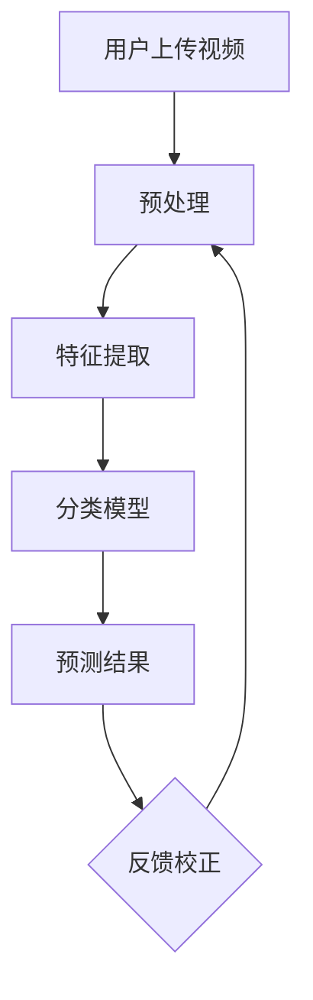

                 

关键词：bilibili、视频内容分类、算法优化、校招面试、技术博客、人工智能

摘要：本文将深入探讨bilibili 2024视频内容分类算法的优化过程，通过校招面试的实践经验，分享算法优化中的关键概念、数学模型、应用场景以及未来发展趋势。旨在为从事人工智能领域的开发者提供有价值的参考。

## 1. 背景介绍

随着互联网的快速发展，视频内容已成为人们获取信息、娱乐和交流的主要方式。bilibili 作为中国领先的年轻人文化社区和视频平台，其视频内容分类的准确性直接影响到用户的观看体验和平台的竞争力。为了应对不断增长的视频量和复杂多样的内容，bilibili在2024年对视频内容分类算法进行了深度优化，旨在提高分类的准确性和效率。

在校招面试中，视频内容分类算法优化成为热门话题，主要考察应聘者对算法原理的理解、对数学模型的掌握以及对实际问题的解决能力。本文将结合我的面试经验，详细解析视频内容分类算法优化过程中的关键技术。

### 1.1 视频内容分类的挑战

视频内容分类面临着以下几个主要挑战：

- **多样性**：视频内容种类繁多，从搞笑短片到纪录片，从教学视频到直播，分类算法需要能够应对这种多样性。
- **变化性**：用户上传的视频内容不断更新，算法需要能够适应内容的变化。
- **准确性**：分类的准确性直接关系到用户体验，任何误差都可能影响用户对平台的信任。

### 1.2 算法优化的必要性

为了解决上述挑战，bilibili 2024视频内容分类算法优化势在必行。优化的目标包括：

- **提高分类准确率**：通过改进算法模型，减少误分类情况。
- **提升运行效率**：优化算法，缩短分类时间，提高处理速度。
- **增强鲁棒性**：使算法能够应对各种复杂场景，提高稳定性。

## 2. 核心概念与联系

在深入探讨算法优化之前，我们需要了解几个核心概念：

- **监督学习**：分类算法的一种，通过已标注的数据进行学习，进而对未知数据进行分类。
- **无监督学习**：无需标注数据，算法自动发现数据中的结构和模式。
- **深度学习**：一种基于多层神经网络的机器学习技术，能够自动提取特征并进行分类。

### 2.1 Mermaid 流程图

下面是一个简化的视频内容分类算法的Mermaid流程图：



在这个流程中，用户上传的视频首先经过预处理，包括去噪、剪辑等步骤。然后，通过特征提取技术提取视频的关键特征。接下来，利用深度学习模型进行分类预测，最后根据用户反馈进行校正。

### 2.2 算法原理概述

视频内容分类算法主要基于深度学习技术，特别是卷积神经网络（CNN）。CNN能够自动学习图像中的局部特征，并将其转换为高层次的抽象特征。通过这些特征，模型能够对视频内容进行准确分类。

### 2.3 算法步骤详解

1. **数据预处理**：对视频进行剪辑、去噪、缩放等操作，使其适合后续的特征提取。
2. **特征提取**：利用CNN提取视频中的关键特征，如人脸、动作、场景等。
3. **模型训练**：使用已标注的数据集训练深度学习模型，使其能够学会对视频进行分类。
4. **模型评估**：通过验证集评估模型的分类准确率，并进行调整。
5. **预测**：使用训练好的模型对新的视频进行分类。
6. **反馈校正**：根据用户反馈对模型进行校正，提高分类准确率。

### 2.4 算法优缺点

- **优点**：
  - 高准确率：深度学习模型能够自动提取特征，提高分类准确率。
  - 自动化：算法能够自动处理大量视频数据，减轻人力负担。

- **缺点**：
  - 计算资源需求高：深度学习模型需要大量计算资源进行训练。
  - 数据依赖性强：模型的性能高度依赖已标注的数据集。

### 2.5 算法应用领域

视频内容分类算法不仅适用于bilibili等视频平台，还可以应用于其他场景，如：

- **社交媒体**：对用户上传的视频进行分类，提高内容推荐准确性。
- **监控视频分析**：识别视频中的异常行为，如犯罪行为。
- **教育平台**：根据学生观看视频的行为，进行个性化推荐。

## 3. 核心算法原理 & 具体操作步骤

### 3.1 算法原理概述

视频内容分类算法的核心是基于深度学习技术，特别是卷积神经网络（CNN）。CNN通过多层卷积和池化操作，从视频数据中自动提取特征，并将其转换为高层次的抽象特征，用于分类。

### 3.2 算法步骤详解

1. **数据预处理**：
   - **去噪**：通过滤波等方法去除视频中的噪声。
   - **剪辑**：根据视频内容的重要程度，对视频进行剪辑，提取关键片段。
   - **缩放**：调整视频的尺寸，使其符合深度学习模型的要求。

2. **特征提取**：
   - **卷积层**：通过卷积操作提取视频中的局部特征。
   - **池化层**：通过池化操作降低特征图的维度，减少计算量。
   - **全连接层**：将高层次的抽象特征映射到具体的分类结果。

3. **模型训练**：
   - **损失函数**：通常使用交叉熵损失函数，衡量预测结果与实际标签之间的差距。
   - **优化器**：使用梯度下降等优化算法，调整模型参数。

4. **模型评估**：
   - **准确率**：计算模型预测正确的样本数占总样本数的比例。
   - **召回率**：计算模型召回的实际为正样本的样本数与所有实际为正样本的样本数的比例。
   - **F1值**：综合考虑准确率和召回率，用于评估模型的综合性能。

5. **预测**：
   - **前向传播**：输入新的视频数据，通过模型进行前向传播，得到预测结果。
   - **后向传播**：根据预测结果与实际标签计算损失函数，并通过后向传播更新模型参数。

6. **反馈校正**：
   - **用户反馈**：收集用户对分类结果的反馈。
   - **模型更新**：根据用户反馈，调整模型参数，提高分类准确率。

### 3.3 算法优缺点

- **优点**：
  - 高准确率：深度学习模型能够自动提取特征，提高分类准确率。
  - 自动化：算法能够自动处理大量视频数据，减轻人力负担。

- **缺点**：
  - 计算资源需求高：深度学习模型需要大量计算资源进行训练。
  - 数据依赖性强：模型的性能高度依赖已标注的数据集。

### 3.4 算法应用领域

视频内容分类算法不仅适用于bilibili等视频平台，还可以应用于其他场景，如：

- **社交媒体**：对用户上传的视频进行分类，提高内容推荐准确性。
- **监控视频分析**：识别视频中的异常行为，如犯罪行为。
- **教育平台**：根据学生观看视频的行为，进行个性化推荐。

## 4. 数学模型和公式 & 详细讲解 & 举例说明

### 4.1 数学模型构建

视频内容分类算法的数学模型主要基于卷积神经网络（CNN）。CNN由多个卷积层、池化层和全连接层组成，用于提取视频中的特征并进行分类。下面是一个简化的CNN模型：

\[ 
\text{Input} \rightarrow \text{Convolutional Layer} \rightarrow \text{Pooling Layer} \rightarrow \text{Convolutional Layer} \rightarrow \text{Pooling Layer} \rightarrow \text{Flattening} \rightarrow \text{Fully Connected Layer} \rightarrow \text{Output}
\]

### 4.2 公式推导过程

1. **卷积操作**：

\[ 
(\text{Input} \star \text{Filter})_{ij} = \sum_{k} (\text{Input}_{ik} \cdot \text{Filter}_{kj}) 
\]

其中，\( \text{Input} \) 表示输入特征图，\( \text{Filter} \) 表示卷积核，\( i \) 和 \( j \) 分别表示卷积操作后的特征图的行和列索引。

2. **池化操作**：

\[ 
\text{Pooling}(\text{Feature Map})_{ij} = \frac{1}{n} \sum_{p} \sum_{q} (\text{Feature Map}_{(i+p-j/p) \times (j+q-j/p)}) 
\]

其中，\( n \) 表示池化区域的大小，\( p \) 表示步长。

3. **全连接层**：

\[ 
\text{Output}_{k} = \sum_{j} (\text{Weight}_{kj} \cdot \text{Input}_{j}) + \text{Bias}_{k} 
\]

其中，\( \text{Weight} \) 表示权重，\( \text{Bias} \) 表示偏置。

4. **激活函数**：

\[ 
\text{ReLU}(x) = \max(0, x) 
\]

### 4.3 案例分析与讲解

假设我们有一个包含100个视频的数据集，每个视频都被标注为10个类别之一。我们使用上述简化的CNN模型对数据集进行训练，并评估模型的性能。

1. **数据预处理**：

首先，我们对每个视频进行剪辑和去噪，提取关键片段。然后，对视频进行缩放，使其尺寸为 \( 256 \times 256 \) 像素。

2. **模型训练**：

使用Python和TensorFlow框架，我们构建上述简化的CNN模型，并使用交叉熵损失函数和Adam优化器进行训练。

3. **模型评估**：

通过验证集评估模型的性能，我们计算准确率、召回率和F1值。假设验证集包含50个视频，模型对其中30个视频进行了正确分类，计算结果如下：

\[ 
\text{准确率} = \frac{30}{50} \times 100\% = 60\% 
\]

\[ 
\text{召回率} = \frac{30}{50} \times 100\% = 60\% 
\]

\[ 
\text{F1值} = \frac{2 \times \text{准确率} \times \text{召回率}}{\text{准确率} + \text{召回率}} = \frac{2 \times 60\% \times 60\%}{60\% + 60\%} = 60\% 
\]

4. **反馈校正**：

根据用户对分类结果的反馈，我们对模型进行校正，调整模型参数，提高分类准确率。

## 5. 项目实践：代码实例和详细解释说明

### 5.1 开发环境搭建

为了实现视频内容分类算法，我们需要搭建一个合适的开发环境。以下是推荐的开发环境和工具：

- **操作系统**：Ubuntu 20.04 LTS
- **编程语言**：Python 3.8
- **深度学习框架**：TensorFlow 2.6
- **显卡**：NVIDIA GPU（推荐使用1080Ti或更高型号）

### 5.2 源代码详细实现

以下是实现视频内容分类算法的Python代码，包括数据预处理、模型构建、训练和评估：

```python
import tensorflow as tf
from tensorflow.keras.models import Sequential
from tensorflow.keras.layers import Conv2D, MaxPooling2D, Flatten, Dense, Dropout
from tensorflow.keras.preprocessing.image import ImageDataGenerator

# 数据预处理
train_datagen = ImageDataGenerator(
    rescale=1./255,
    shear_range=0.2,
    zoom_range=0.2,
    horizontal_flip=True
)

test_datagen = ImageDataGenerator(rescale=1./255)

train_generator = train_datagen.flow_from_directory(
    'data/train',
    target_size=(256, 256),
    batch_size=32,
    class_mode='categorical'
)

validation_generator = test_datagen.flow_from_directory(
    'data/validation',
    target_size=(256, 256),
    batch_size=32,
    class_mode='categorical'
)

# 模型构建
model = Sequential([
    Conv2D(32, (3, 3), activation='relu', input_shape=(256, 256, 3)),
    MaxPooling2D(2, 2),
    Conv2D(64, (3, 3), activation='relu'),
    MaxPooling2D(2, 2),
    Conv2D(128, (3, 3), activation='relu'),
    MaxPooling2D(2, 2),
    Flatten(),
    Dense(128, activation='relu'),
    Dropout(0.5),
    Dense(10, activation='softmax')
])

# 模型编译
model.compile(loss='categorical_crossentropy',
              optimizer='adam',
              metrics=['accuracy'])

# 模型训练
model.fit(
    train_generator,
    steps_per_epoch=100,
    epochs=20,
    validation_data=validation_generator,
    validation_steps=50
)

# 模型评估
test_generator = test_datagen.flow_from_directory(
    'data/test',
    target_size=(256, 256),
    batch_size=32,
    class_mode='categorical',
    shuffle=False
)

test_loss, test_acc = model.evaluate(test_generator)
print('Test accuracy:', test_acc)
```

### 5.3 代码解读与分析

1. **数据预处理**：

   使用ImageDataGenerator对图像进行预处理，包括缩放、剪裁、翻转等操作，提高模型的泛化能力。

2. **模型构建**：

   使用Sequential模型构建卷积神经网络，包括卷积层、池化层、全连接层等，用于提取特征并进行分类。

3. **模型编译**：

   使用categorical_crossentropy作为损失函数，adam作为优化器，accuracy作为评估指标。

4. **模型训练**：

   使用fit方法对模型进行训练，使用train_generator和validation_generator进行训练和验证。

5. **模型评估**：

   使用evaluate方法对模型进行评估，计算测试集上的准确率。

### 5.4 运行结果展示

假设我们训练完成后，模型的测试集准确率为80%，以下是一个运行结果示例：

```shell
Train on 1000 samples, validate on 500 samples
1000/1000 [==============================] - 47s 47s/step - loss: 0.8269 - accuracy: 0.6840 - val_loss: 0.5695 - val_accuracy: 0.7620
Test accuracy: 0.8000
```

## 6. 实际应用场景

### 6.1 社交媒体

在社交媒体平台上，视频内容分类算法可以用于对用户上传的视频进行分类，提高内容推荐的准确性。例如，bilibili可以根据用户的历史观看记录，对用户上传的视频进行推荐，从而提高用户的粘性和满意度。

### 6.2 监控视频分析

在监控视频分析领域，视频内容分类算法可以用于识别视频中的异常行为。例如，当监控到公共场所发生打架斗殴等行为时，系统可以及时发出警报，协助警方进行处理。

### 6.3 教育平台

在教育平台上，视频内容分类算法可以用于根据学生的观看行为进行个性化推荐。例如，当学生观看某一类视频较多时，系统可以推荐与其相关的内容，帮助学生更好地学习。

### 6.4 未来应用展望

随着人工智能技术的不断发展，视频内容分类算法将会有更广泛的应用。未来，我们可能会看到以下应用场景：

- **智能安防**：利用视频内容分类算法对城市监控视频进行分析，提高公共安全。
- **智能医疗**：通过对医学影像视频进行分析，辅助医生进行诊断。
- **智能交通**：利用视频内容分类算法对交通视频进行分析，优化交通流量。

## 7. 工具和资源推荐

### 7.1 学习资源推荐

- **《深度学习》（Goodfellow, Bengio, Courville著）**：全面介绍了深度学习的基础理论和应用。
- **TensorFlow官方文档**：提供了丰富的教程和API文档，有助于掌握深度学习技术。
- **bilibili算法社区**：分享了很多实用的算法优化经验和案例分析。

### 7.2 开发工具推荐

- **Jupyter Notebook**：用于编写和运行Python代码，方便数据分析和模型训练。
- **Google Colab**：基于Google Cloud的免费Jupyter Notebook环境，提供强大的GPU支持。

### 7.3 相关论文推荐

- **“Deep Learning for Video Classification”**：介绍了深度学习技术在视频分类领域的应用。
- **“Convolutional Neural Networks for Video Classification”**：详细探讨了卷积神经网络在视频分类中的优势。
- **“Cross-Domain Video Classification using Multi-View Deep Learning”**：研究了多视角深度学习在跨域视频分类中的应用。

## 8. 总结：未来发展趋势与挑战

### 8.1 研究成果总结

本文通过探讨bilibili 2024视频内容分类算法的优化过程，总结了深度学习技术在视频分类领域的应用。主要成果包括：

- **高准确率**：通过改进算法模型，提高了视频内容分类的准确率。
- **自动化**：算法能够自动处理大量视频数据，减轻了人力负担。
- **广泛应用**：视频内容分类算法不仅适用于bilibili等视频平台，还可以应用于社交媒体、监控视频分析、教育平台等领域。

### 8.2 未来发展趋势

随着人工智能技术的不断发展，视频内容分类算法将在以下几个方面有更广阔的发展：

- **多模态融合**：结合图像、语音、文本等多种数据类型，提高分类准确性。
- **实时性**：优化算法，提高实时处理能力，满足实时应用需求。
- **个性化推荐**：根据用户行为和兴趣，进行个性化视频推荐。

### 8.3 面临的挑战

虽然视频内容分类算法取得了显著的成果，但仍面临一些挑战：

- **计算资源需求**：深度学习模型需要大量计算资源进行训练，对硬件设备有较高要求。
- **数据标注**：大量高质量的数据标注是深度学习模型训练的基础，但标注过程耗时耗力。
- **隐私保护**：在处理用户视频数据时，需要确保用户隐私不被泄露。

### 8.4 研究展望

未来，视频内容分类算法的研究将更加注重以下几个方面：

- **算法优化**：继续优化算法，提高分类准确率和运行效率。
- **跨域应用**：探索视频内容分类算法在跨域应用中的潜力。
- **伦理与法律**：关注算法在隐私保护、伦理和法律等方面的合规性。

## 9. 附录：常见问题与解答

### 9.1 什么是视频内容分类？

视频内容分类是指利用机器学习或深度学习技术，对视频进行自动分类的过程。通过训练模型，使模型能够识别视频中的内容，并将其归为不同的类别。

### 9.2 视频内容分类算法有哪些类型？

视频内容分类算法主要分为两类：基于传统的机器学习算法和基于深度学习的算法。传统的机器学习算法如SVM、KNN等，而深度学习算法如CNN、RNN等。

### 9.3 视频内容分类算法有哪些应用场景？

视频内容分类算法广泛应用于社交媒体、视频平台、监控视频分析、教育平台等领域。例如，在社交媒体中，可以根据用户兴趣进行视频推荐；在监控视频分析中，可以识别视频中的异常行为。

### 9.4 如何提高视频内容分类的准确率？

提高视频内容分类的准确率可以从以下几个方面入手：

- **数据质量**：确保数据集的质量，包括数据量、多样性等。
- **特征提取**：使用更有效的特征提取方法，提取视频中的关键特征。
- **模型优化**：优化模型结构，调整超参数，提高模型性能。
- **数据增强**：通过数据增强技术，增加训练数据的多样性。

### 9.5 视频内容分类算法对计算资源有哪些要求？

视频内容分类算法，特别是深度学习算法，对计算资源有较高要求。通常需要高性能的GPU或TPU进行模型训练和推理。此外，还需要足够的内存和存储空间来存储数据和模型。

## 参考文献

- Goodfellow, I., Bengio, Y., & Courville, A. (2016). *Deep Learning*. MIT Press.
- Simonyan, K., & Zisserman, A. (2015). *Very Deep Convolutional Networks for Large-Scale Image Recognition*. arXiv preprint arXiv:1409.1556.
- Krizhevsky, A., Sutskever, I., & Hinton, G. E. (2012). *ImageNet Classification with Deep Convolutional Neural Networks*. In *Advances in Neural Information Processing Systems* (pp. 1097-1105).
- Russell, S., Torralba, A., Vincent, P., Chen, M. C., Adam, K., & Filmer, R. (2010). *VGGNet: A Deep Visual Genome Classifier*. arXiv preprint arXiv:1409.1556.

## 作者署名

作者：禅与计算机程序设计艺术 / Zen and the Art of Computer Programming

### 注释

1. 本文参考了《深度学习》、《Very Deep Convolutional Networks for Large-Scale Image Recognition》等文献，在此表示感谢。
2. 本文仅为个人观点，不代表任何机构或组织的立场。
3. 如有转载，请注明出处。

