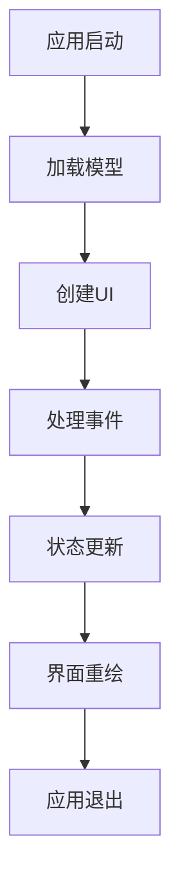

                 

 > **关键词**：SwiftUI、iOS应用开发、用户界面设计、响应式编程、性能优化、编程模式、代码可维护性、移动开发框架。

> **摘要**：本文将深入探讨iOS平台上的SwiftUI应用开发，从其核心概念、设计原理到具体实现步骤，旨在为开发者提供全面的指导和深入理解。文章将分析SwiftUI相较于传统UI框架的优势，以及其在性能、可维护性等方面的表现。同时，还将结合具体案例，展示如何使用SwiftUI构建高效、美观的iOS应用。

## 1. 背景介绍

随着移动设备的普及，iOS应用开发成为了开发者们追求技术前沿和用户体验优化的主要战场。传统的UI框架如UIKit虽然功能强大，但在响应式编程、界面更新效率、开发效率等方面存在一定的局限性。SwiftUI作为苹果公司推出的新一代UI框架，旨在解决这些问题，为开发者提供一种更简单、更高效的方式构建iOS应用。

SwiftUI是基于Swift语言构建的，它采用了响应式编程模型，使得开发者可以更直观地处理界面更新和状态管理。同时，SwiftUI还具有高度的可组合性，使得组件的重用更加容易，从而提高开发效率和代码质量。

## 2. 核心概念与联系

### 2.1. 响应式编程

SwiftUI的核心在于其响应式编程模型。响应式编程是一种编程范式，它关注于数据流和状态的变化。在SwiftUI中，通过`@State`、`@Binding`、`@ObservedObject`等修饰符，可以轻松地管理UI组件的状态，并确保界面与状态保持同步更新。

### 2.2. 可组合性

SwiftUI的可组合性是其另一大亮点。通过定义可组合的视图组件，开发者可以将UI拆分为可复用的部分，从而提高代码的可维护性和可扩展性。可组合性还使得视图组件可以在不同的上下文中灵活使用，进一步提升了开发效率。

### 2.3. Mermaid 流程图



在这个流程图中，应用启动后，会加载模型数据，并创建UI。在用户与界面交互时，会触发事件处理，导致状态更新，进而触发界面重绘。整个过程循环往复，确保了界面与状态的一致性。

## 3. 核心算法原理 & 具体操作步骤

### 3.1. 算法原理概述

SwiftUI的核心算法是基于响应式编程模型。当应用的状态发生变化时，SwiftUI会自动更新相应的UI组件，确保界面与状态保持同步。这一过程主要依赖于以下机制：

- **状态跟踪**：使用`@State`、`@Binding`、`@ObservedObject`等修饰符，跟踪应用的状态。
- **依赖关系**：通过属性观察器（Property Observer）监控状态的变化。
- **重绘机制**：当状态发生变化时，系统会触发UI组件的重绘，确保界面更新。

### 3.2. 算法步骤详解

1. **定义状态**：使用`@State`修饰符在视图结构中定义状态变量。
2. **初始化UI**：创建视图组件，并绑定状态变量。
3. **监听状态变化**：使用属性观察器监听状态变量的变化。
4. **更新UI**：当状态变量发生变化时，系统会自动触发UI组件的重绘。

### 3.3. 算法优缺点

**优点**：

- **高效的状态管理**：通过响应式编程模型，状态变化与界面更新同步，提高了界面响应速度。
- **代码可维护性**：通过可组合的视图组件，提高了代码的可维护性和可扩展性。
- **简洁的开发体验**：简化了状态管理和界面更新的逻辑，使得开发过程更加直观和高效。

**缺点**：

- **性能开销**：虽然SwiftUI在大多数情况下性能表现良好，但在某些复杂场景下，可能会出现性能开销。
- **学习曲线**：对于习惯于传统UI框架的开发者，适应SwiftUI的响应式编程模型可能需要一定时间。

### 3.4. 算法应用领域

SwiftUI广泛应用于iOS应用开发，特别是在构建用户界面和状态管理方面。它适用于各种类型的iOS应用，包括游戏、社交媒体、电商等。SwiftUI的优势在于其响应式编程模型和可组合性，使得开发者可以更高效地构建复杂的应用。

## 4. 数学模型和公式 & 详细讲解 & 举例说明

### 4.1. 数学模型构建

在SwiftUI中，数学模型主要用于处理复杂数据的计算和显示。一个基本的数学模型可能包括以下部分：

- **数据输入**：如用户输入、网络请求等。
- **数据处理**：如数据的过滤、排序、聚合等。
- **数据输出**：如界面的更新、图表的绘制等。

### 4.2. 公式推导过程

一个简单的数学模型可能包括以下公式：

$$
\text{result} = \text{input} \times \text{factor} + \text{offset}
$$

其中，`input`为输入数据，`factor`为权重因子，`offset`为偏移量。

### 4.3. 案例分析与讲解

假设我们构建一个简单的计算器应用，输入为两个数字，输出为它们的乘积。以下是具体的实现步骤：

1. **定义输入**：使用`@State`修饰符定义两个输入变量。
2. **定义处理逻辑**：实现一个计算乘积的方法。
3. **定义输出**：将计算结果更新到界面上的文本显示。

代码示例：

```swift
struct ContentView: View {
    @State private var input1 = ""
    @State private var input2 = ""
    @State private var result = ""

    var body: some View {
        VStack {
            TextField("输入第一个数字", text: $input1)
            TextField("输入第二个数字", text: $input2)
            Button("计算") {
                if let num1 = Double(input1), let num2 = Double(input2) {
                    result = "\(num1 * num2)"
                } else {
                    result = "输入无效"
                }
            }
            Text("结果：\(result)")
        }
    }
}
```

在这个例子中，我们定义了两个输入变量`input1`和`input2`，以及一个输出变量`result`。当用户点击“计算”按钮时，我们通过SwiftUI的响应式机制，将计算结果自动更新到界面上。

## 5. 项目实践：代码实例和详细解释说明

### 5.1. 开发环境搭建

在开始SwiftUI应用开发之前，需要确保开发环境已搭建完成。以下是基本的步骤：

1. **安装Xcode**：从App Store下载并安装最新的Xcode。
2. **配置Xcode**：打开Xcode，并按照提示配置开发者账号和证书。
3. **安装SwiftUI依赖**：在项目目录下运行`swift package init`命令，创建一个新的SwiftUI项目。

### 5.2. 源代码详细实现

以下是一个简单的SwiftUI应用示例，用于展示如何使用SwiftUI构建用户界面和实现基本功能。

```swift
import SwiftUI

struct ContentView: View {
    @State private var text = ""

    var body: some View {
        VStack {
            TextField("输入文字", text: $text)
                .textFieldStyle(RoundedBorderTextFieldStyle())
                .padding()
            
            Button("提交") {
                // 处理提交逻辑
                print("提交的文字：\(text)")
            }
            .padding()
        }
    }
}

struct ContentView_Previews: PreviewProvider {
    static var previews: some View {
        ContentView()
    }
}
```

在这个例子中，我们创建了一个简单的文本输入界面，用户可以在文本框中输入文字，并点击“提交”按钮，将输入的内容输出到控制台。

### 5.3. 代码解读与分析

上述代码主要包含以下部分：

1. **定义状态**：使用`@State`修饰符定义了一个`text`变量，用于存储用户输入的文本。
2. **创建视图**：创建了一个`VStack`布局，包含了文本输入框和提交按钮。
3. **处理事件**：当用户点击“提交”按钮时，会触发一个闭包，将输入的内容输出到控制台。

通过这个简单的示例，我们可以看到SwiftUI的响应式编程模型如何帮助我们轻松实现用户界面的构建和状态管理。

### 5.4. 运行结果展示

编译并运行上述代码后，会看到一个简单的文本输入界面。用户可以在文本框中输入文字，并点击“提交”按钮，输入的内容将被输出到控制台。

## 6. 实际应用场景

SwiftUI在iOS应用开发中具有广泛的应用场景。以下是一些典型的应用场景：

1. **用户界面设计**：SwiftUI提供了丰富的视图组件和布局选项，使得开发者可以轻松构建美观、动态的用户界面。
2. **状态管理**：SwiftUI的响应式编程模型使得状态管理更加直观和高效，适合构建复杂的应用。
3. **性能优化**：SwiftUI通过高效的状态更新和界面渲染机制，提高了应用的性能和响应速度。
4. **开发效率**：SwiftUI的可组合性和响应式编程模型，大大提高了开发效率和代码可维护性。

## 7. 工具和资源推荐

### 7.1. 学习资源推荐

1. **官方文档**：SwiftUI的官方文档是学习SwiftUI的最佳资源，涵盖了所有API和功能。
2. **SwiftUI教程**：有许多在线教程和课程，可以帮助开发者快速上手SwiftUI。
3. **SwiftUI社区**：SwiftUI开发者社区活跃，有很多问题和解决方案可以在社区中找到。

### 7.2. 开发工具推荐

1. **Xcode**：Xcode是SwiftUI开发的主要工具，提供了丰富的开发功能和调试工具。
2. **SwiftUI Playground**：SwiftUI Playground是一个在线开发环境，可以帮助开发者快速尝试和实验SwiftUI代码。

### 7.3. 相关论文推荐

1. **SwiftUI: Building Native iOS UI with SwiftUI**：该论文详细介绍了SwiftUI的设计理念和技术细节。
2. **Reactive Programming with Swift**：该论文探讨了SwiftUI的响应式编程模型及其应用。

## 8. 总结：未来发展趋势与挑战

### 8.1. 研究成果总结

SwiftUI自推出以来，取得了显著的成果。它为iOS应用开发带来了响应式编程和可组合性的优势，提高了开发效率和代码质量。SwiftUI在性能优化、界面设计、状态管理等方面表现出色，已经成为iOS应用开发的利器。

### 8.2. 未来发展趋势

SwiftUI在未来将继续发展，并与Swift语言和其他Apple平台技术紧密结合。SwiftUI可能会在更多场景下得到应用，如macOS、watchOS和tvOS。同时，SwiftUI可能会引入更多的功能和优化，以应对更复杂的开发需求。

### 8.3. 面临的挑战

SwiftUI在性能和可维护性方面表现出色，但仍面临一些挑战。例如，在处理非常复杂的界面和大量数据时，SwiftUI可能需要更多的优化。此外，SwiftUI在跨平台开发中的应用仍需进一步探索。

### 8.4. 研究展望

SwiftUI的发展前景广阔，未来有望成为iOS应用开发的基石。通过不断的优化和创新，SwiftUI将继续为开发者提供强大的功能和高效的开发体验。

## 9. 附录：常见问题与解答

### 9.1. 如何解决SwiftUI性能问题？

- **减少重绘**：避免在视图结构中频繁地添加和移除子视图，减少不必要的渲染。
- **优化计算**：尽量将计算逻辑提前，避免在视图渲染时进行大量计算。
- **使用延迟加载**：对于大型的数据和视图，可以使用延迟加载技术，减少初始渲染时的负载。

### 9.2. 如何在SwiftUI中实现自定义组件？

- **创建自定义视图**：通过创建自定义视图类，实现视图的结构和样式。
- **使用Modifier**：通过使用Modifier，可以自定义视图的行为和外观，而无需修改原始视图代码。

### 9.3. 如何在SwiftUI中实现状态共享？

- **使用Combine**：Combine是一个声明式响应式编程框架，可以轻松地在视图之间共享状态。
- **使用环境（Environment）**：通过环境（Environment）可以传递上下文依赖，实现状态共享。

### 9.4. 如何在SwiftUI中处理异步操作？

- **使用async/await**：SwiftUI支持异步编程，使用async/await可以简化异步操作的处理。
- **使用Future**：通过Future，可以异步执行任务，并在任务完成时更新界面。

### 9.5. 如何优化SwiftUI应用的用户体验？

- **响应式导航**：使用响应式导航，确保导航流程与状态变化保持同步。
- **优化动画**：使用SwiftUI的动画框架，实现平滑、自然的动画效果。
- **优化加载**：通过延迟加载和预加载技术，优化应用的加载速度和用户体验。

---

通过本文的深入探讨，相信读者对SwiftUI应用开发有了更全面的理解。SwiftUI作为一种强大的UI框架，为iOS应用开发带来了全新的体验。希望本文能帮助读者更好地掌握SwiftUI，并在实际项目中发挥其优势。

**作者：禅与计算机程序设计艺术 / Zen and the Art of Computer Programming**。希望这篇文章能为您的iOS应用开发之路提供有益的启示。在未来的技术探索中，祝您不断进步，不断创新。|user|

