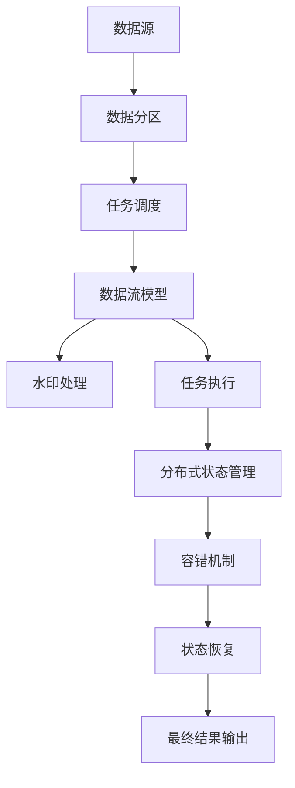
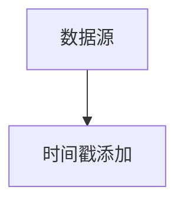
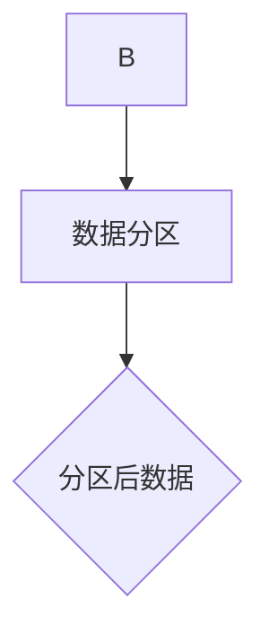
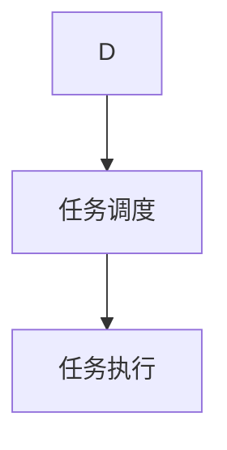
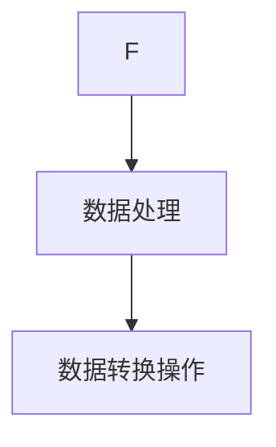
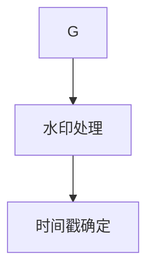
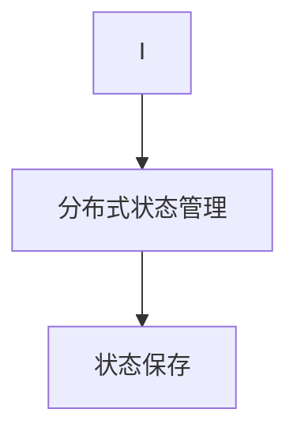
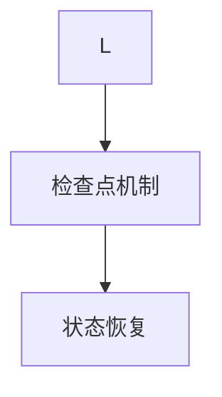
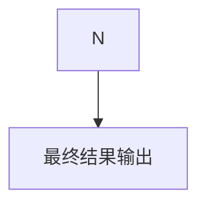

                 

### 背景介绍 Background

在当今信息时代，大数据已经渗透到各行各业，成为推动创新和发展的关键因素。随着数据规模的急剧增长，传统的数据处理方法已经难以应对海量数据的存储和处理需求。因此，分布式计算框架应运而生，其中Apache Flink作为一种强大的实时流处理框架，受到了广泛关注。

Apache Flink是一款开源分布式处理框架，它能够对有界数据集和无界数据流进行高效处理。与传统的MapReduce等批处理框架不同，Flink主要专注于流处理，具有低延迟、高吞吐量和强大的容错机制等特点。这使得Flink在实时分析、机器学习、复杂事件处理等领域具有广泛的应用前景。

本文将详细介绍Flink的原理、核心概念、算法、数学模型和代码实例，帮助读者深入了解Flink的架构和实现，掌握如何在实际项目中应用Flink进行大数据处理。

## 文章关键词 Keywords

- Apache Flink
- 分布式计算
- 实时流处理
- 数据处理框架
- 大数据
- 批处理
- 容错机制
- 算法

## 文章摘要 Summary

本文将从Flink的背景介绍开始，逐步深入探讨Flink的核心概念、算法原理、数学模型和代码实例。首先，我们将梳理Flink的基本架构和关键组件，通过Mermaid流程图展示其工作流程。接着，我们详细讲解Flink的核心算法，包括其原理、步骤、优缺点和应用领域。随后，我们将介绍Flink的数学模型和公式，并通过具体案例进行说明。文章的后半部分将结合实际项目，展示如何使用Flink进行大数据处理，并提供代码实例和详细解读。最后，我们将讨论Flink在实际应用场景中的挑战和未来展望。

## 1. 背景介绍 Introduction

### 1.1 大数据的崛起

随着互联网、物联网和社交媒体的快速发展，数据已经渗透到我们生活的方方面面。大数据（Big Data）是指无法使用传统数据处理工具在合理时间内进行捕捉、管理和处理的数据集合，具有海量（Volume）、多样（Variety）、高速（Velocity）和价值密度低（Value）等特点。

大数据的兴起带来了新的机遇和挑战。一方面，大数据提供了丰富的信息资源和洞察力，有助于企业、政府和社会机构做出更明智的决策。另一方面，大数据的处理和存储需求也对现有的技术体系提出了更高的要求。

### 1.2 分布式计算框架

为了应对大数据的挑战，分布式计算框架（如MapReduce、Hadoop、Spark、Flink等）应运而生。这些框架通过将数据分散存储和处理，实现了高效的大数据处理能力。

分布式计算框架的主要特点包括：

- **并行处理**：分布式框架可以将数据分散到多个节点上进行处理，提高了计算效率。
- **容错机制**：通过冗余备份和自动恢复，保证了系统的可靠性和稳定性。
- **扩展性**：分布式框架能够根据需求动态扩展，以处理更大的数据规模。

### 1.3 Apache Flink

Apache Flink是一款开源分布式处理框架，由dataArtisans（现为Apache Flink项目的主要贡献者之一）于2011年发起，并于2014年成为Apache软件基金会的顶级项目。Flink旨在提供一种用于批处理和流处理的统一计算模型，能够在同一框架内处理有界数据集和无界数据流。

### 1.4 Flink的优势

Flink相较于其他分布式计算框架，具有以下优势：

- **低延迟、高吞吐量**：Flink能够以毫秒级的延迟处理数据，并提供高效的吞吐量。
- **动态缩放**：Flink支持动态调整作业的资源需求，根据实际负载自动扩展或缩减集群规模。
- **强大的容错机制**：Flink采用基于记录级别的状态管理和检查点机制，确保数据处理的准确性和系统的高可用性。
- **统一计算模型**：Flink提供了批处理和流处理的统一抽象，使得开发者能够更高效地开发和部署应用程序。
- **广泛的应用场景**：Flink在实时分析、机器学习、复杂事件处理等领域具有广泛的应用前景。

通过上述介绍，我们可以看出Flink在分布式计算领域的重要地位和优势。接下来的章节将深入探讨Flink的核心概念、算法原理、数学模型和代码实例，帮助读者更好地理解和应用Flink进行大数据处理。

## 2. 核心概念与联系 Core Concepts and Relationships

在深入探讨Flink的原理和实现之前，有必要先了解其核心概念和组件。Flink由多个关键组件组成，每个组件在分布式计算中都扮演着特定的角色。以下是Flink的几个核心概念及其相互关系：

### 2.1 流和批处理

Flink的核心在于其同时支持流（Stream）和批（Batch）处理。流处理是指对实时数据流进行连续处理，适用于实时分析、监控等场景；批处理则是对静态数据集进行批量处理，适用于数据清洗、报告生成等场景。Flink通过统一的计算模型，使得开发者可以在同一框架内处理流和批数据，大大简化了开发过程。

### 2.2 数据流模型

Flink采用数据流模型（Dataflow Model）来表示数据的处理过程。数据流模型将数据处理过程抽象为一系列的数据转换操作，这些操作通过数据流连接起来，形成一个数据处理流水线。每个操作接收输入数据，处理后输出新的数据，从而实现数据的连续处理。

### 2.3 流和水印

在流处理中，确保数据处理的顺序和一致性是非常重要的。Flink通过水印（Watermarks）机制来处理事件时间（Event Time）和处理时间（Processing Time）。水印是一种特殊的事件，用于标记时间戳，从而帮助系统确定数据的实际发生时间。通过水印，Flink能够精确地处理乱序数据，保证数据的正确性。

### 2.4 任务调度和资源管理

Flink采用了基于有向无环图（DAG）的任务调度模型。有向无环图（DAG）表示了Flink作业中的所有任务及其依赖关系。Flink的调度器负责根据DAG的拓扑结构，将任务分配到不同的计算节点上执行，同时负责资源的动态分配和调度。Flink还支持基于事件驱动（Event-Driven）和周期性调度（Periodic Scheduling）的任务执行方式。

### 2.5 数据分区和分布式状态

为了高效地进行分布式计算，Flink对数据进行分区（Partitioning）。分区是指将数据按照一定的规则分布在多个节点上，以便并行处理。Flink支持多种分区策略，包括哈希分区（Hash Partitioning）、轮询分区（Round-Robin Partitioning）和关键字分区（Key-Partitioning）等。此外，Flink还支持分布式状态管理，通过将状态分散存储在各个节点上，实现了状态的分布式和容错。

### 2.6 容错机制和状态恢复

Flink采用了基于记录级别的状态管理和检查点（Checkpoints）机制来实现高可靠性和容错能力。状态管理是指Flink如何保存和处理计算过程中的中间状态。检查点是一种将Flink作业的状态序列化并保存到持久存储中的机制，当系统发生故障时，可以通过检查点来恢复作业的状态，确保数据处理的一致性和准确性。

### 2.7 Mermaid流程图表示

为了更直观地展示Flink的核心概念和组件之间的关系，我们可以使用Mermaid流程图来表示。以下是一个简化的Flink流程图：



在这个流程图中，数据源（A）将数据输入到Flink系统中，经过数据分区（B）后，数据流模型（D）对数据进行处理，同时生成水印（E）以处理时间戳。任务调度（C）负责将任务分配到不同的节点上执行（F），分布式状态管理（G）和容错机制（H）确保系统的稳定性和可靠性。最终结果（J）通过状态恢复（I）被输出到外部系统。

通过以上介绍，我们可以看到Flink的核心概念和组件是如何相互协作的，从而实现高效的大数据处理能力。接下来的章节将深入探讨Flink的核心算法原理，以及如何在实际项目中应用这些算法。

## 3. 核心算法原理 & 具体操作步骤 Core Algorithm Principles and Steps

### 3.1 算法原理概述

Flink的核心算法原理主要基于其流处理和批处理能力。Flink采用事件时间（Event Time）和处理时间（Processing Time）两种时间概念，通过水印（Watermarks）机制确保数据处理的一致性和准确性。以下是Flink核心算法的基本原理：

1. **事件时间（Event Time）**：事件时间是指数据实际发生的时间。Flink通过在数据中添加时间戳来记录事件时间，从而实现对数据的按时间顺序处理。
2. **处理时间（Processing Time）**：处理时间是指数据在Flink系统中被处理的时间。处理时间不受网络延迟和系统负载的影响，但可能会导致数据处理的不准确。
3. **水印（Watermarks）**：水印是一种特殊的事件，用于标记时间戳，帮助Flink确定数据的实际发生时间。水印机制确保了数据的顺序处理，即使在数据乱序的情况下也能保证正确性。

### 3.2 算法步骤详解

#### 3.2.1 数据输入

Flink的数据输入通常来自于各种数据源，如Kafka、文件系统、数据库等。数据源将数据以流的形式发送到Flink系统，并在数据中添加时间戳以记录事件时间。



#### 3.2.2 数据分区

在数据输入到Flink系统后，Flink会根据分区策略（如哈希分区、轮询分区等）将数据进行分区，以便并行处理。分区后的数据被分配到不同的节点上进行处理。



#### 3.2.3 任务调度

Flink的调度器根据DAG（有向无环图）的拓扑结构，将任务分配到不同的计算节点上执行。调度器负责动态调整任务执行顺序，优化系统资源利用。



#### 3.2.4 数据处理

在任务执行过程中，Flink根据数据流模型（Dataflow Model）对数据进行处理。数据流模型将数据处理过程抽象为一系列的数据转换操作，如过滤、映射、聚合等。



#### 3.2.5 水印处理

Flink通过水印机制处理事件时间，确保数据的正确顺序。水印是一种特殊的事件，用于标记时间戳。当Flink检测到水印时，会根据水印确定数据的实际发生时间，从而确保数据处理的一致性。



#### 3.2.6 分布式状态管理

在Flink的分布式计算中，状态管理是确保数据处理一致性和高可用性的关键。Flink支持分布式状态管理，通过将状态分散存储在各个节点上，实现了状态的分布式和容错。



#### 3.2.7 容错机制

Flink采用检查点（Checkpoint）机制实现容错。检查点是一种将Flink作业的状态序列化并保存到持久存储中的机制。当系统发生故障时，可以通过检查点恢复作业的状态，确保数据处理的一致性和准确性。



#### 3.2.8 最终结果输出

在数据处理完成后，Flink将最终结果输出到外部系统，如Kafka、数据库、文件系统等。



### 3.3 算法优缺点

#### 优点

- **低延迟、高吞吐量**：Flink能够以毫秒级的延迟处理数据，并提供高效的吞吐量。
- **统一计算模型**：Flink同时支持流处理和批处理，提供了统一的抽象和编程模型，简化了开发过程。
- **强大的容错机制**：Flink通过状态管理和检查点机制，实现了高可用性和数据一致性。
- **动态缩放**：Flink支持动态调整作业的资源需求，能够根据实际负载自动扩展或缩减集群规模。

#### 缺点

- **复杂度高**：Flink的架构和机制较为复杂，对于初学者来说有一定的学习门槛。
- **系统依赖性强**：Flink依赖于Java和Scala等编程语言，对开发环境有一定的要求。

### 3.4 算法应用领域

Flink在实时分析、机器学习、复杂事件处理等领域具有广泛的应用前景。以下是一些典型的应用场景：

- **实时分析**：Flink可以用于实时监控、实时报表、实时推荐系统等，提供及时的业务洞察。
- **机器学习**：Flink支持流式机器学习，可以实时更新模型，提供个性化的服务。
- **复杂事件处理**：Flink可以处理复杂的业务逻辑，如实时交易监控、欺诈检测等。
- **数据集成和转换**：Flink可以用于数据清洗、转换和集成，实现数据链路的自动化处理。

通过以上对Flink核心算法原理和具体操作步骤的介绍，我们可以看到Flink在分布式计算中的强大能力和广泛应用。接下来，我们将深入探讨Flink的数学模型和公式，以帮助读者更好地理解和应用Flink。

## 4. 数学模型和公式 Mathematical Models and Formulas

### 4.1 数学模型构建

Flink的数学模型主要涉及时间处理和状态管理两个方面。以下将分别介绍这两个方面的数学模型。

#### 4.1.1 时间处理

Flink使用两种时间概念：事件时间（Event Time）和处理时间（Processing Time）。事件时间是指数据在实际发生时的时间，而处理时间是指数据在Flink系统中被处理的时间。

1. **事件时间（Event Time）**：
   事件时间可以通过数据源添加的时间戳来表示。假设数据流中的每个数据点都有一个时间戳`t`，则事件时间可以用函数`t(t)`表示，即每个数据点的时间戳。

2. **处理时间（Processing Time）**：
   处理时间是指数据在Flink系统中被处理的时间。由于处理时间受网络延迟、系统负载等因素的影响，因此其计算相对复杂。处理时间可以用函数`p(t)`表示，即数据在Flink系统中的处理时间。

#### 4.1.2 状态管理

Flink的状态管理主要涉及分布式状态和状态恢复。以下将介绍相关的数学模型。

1. **分布式状态**：
   分布式状态是指将状态分散存储在多个节点上。在Flink中，分布式状态可以通过状态树（State Tree）来表示。假设Flink系统中有一个状态`S`，其分布在`n`个节点上，则状态树可以表示为：
   $$ S = \{ S_1, S_2, \ldots, S_n \} $$
   其中，`S_i`表示第`i`个节点上的状态。

2. **状态恢复**：
   状态恢复是指当系统发生故障时，通过恢复状态来确保数据处理的一致性和准确性。在Flink中，状态恢复可以通过检查点（Checkpoint）来实现。检查点是一种将状态序列化并保存到持久存储中的机制。假设有一个检查点`C`，则状态恢复可以表示为：
   $$ S' = \{ S_1', S_2', \ldots, S_n' \} $$
   其中，`S_i'`表示第`i`个节点上恢复后的状态。

### 4.2 公式推导过程

以下将介绍Flink中的几个关键公式及其推导过程。

#### 4.2.1 水印公式

水印（Watermark）是一种特殊的事件，用于标记时间戳，帮助Flink确定数据的实际发生时间。水印公式可以表示为：
$$ w(t) = \min\{ t | t > t_s \} $$
其中，`w(t)`表示水印的时间戳，`t`表示数据的时间戳，`t_s`表示当前系统的处理时间。

**推导过程**：
- 当新数据点到达时，Flink会检查其时间戳`t`与当前系统的处理时间`t_s`的关系。
- 如果`t > t_s`，则说明该数据点发生在当前系统的处理时间之后，因此该数据点可以被水印标记。
- 水印的时间戳`w(t)`定义为所有满足`t > t_s`的数据点中的最小时间戳，以确保数据的正确顺序。

#### 4.2.2 检查点公式

检查点（Checkpoint）是一种将Flink作业的状态序列化并保存到持久存储中的机制。检查点公式可以表示为：
$$ C(t) = S(t) \oplus K $$
其中，`C(t)`表示检查点的状态，`S(t)`表示作业在时间`t`的状态，`K`表示加密密钥。

**推导过程**：
- `S(t)`表示Flink作业在时间`t`的状态。
- `K`表示加密密钥，用于保护检查点的安全性。
- `⊕`表示异或运算，用于对状态进行加密。

#### 4.2.3 状态恢复公式

状态恢复是指当系统发生故障时，通过恢复状态来确保数据处理的一致性和准确性。状态恢复公式可以表示为：
$$ S'(t) = C(t) \oplus K $$
其中，`S'(t)`表示恢复后的状态，`C(t)`表示检查点的状态，`K`表示加密密钥。

**推导过程**：
- 当系统发生故障时，可以通过检查点`C(t)`恢复作业的状态。
- `C(t)`表示检查点的状态，经过加密后的状态。
- 通过异或运算`⊕`和加密密钥`K`，可以恢复原始的状态`S'(t)`。

### 4.3 案例分析与讲解

以下将通过一个具体的案例，展示Flink中的数学模型和公式如何应用在实际项目中。

#### 案例背景

某在线购物平台需要实时分析用户购买行为，以便进行个性化推荐和营销活动。平台使用Flink进行实时数据流处理，从多个数据源（如订单系统、用户行为系统等）收集用户数据，并进行处理分析。

#### 案例分析

1. **数据输入**：
   用户数据包含订单ID、商品ID、购买时间等信息。数据源在发送数据时，会为每个数据点添加事件时间戳。

2. **数据分区**：
   Flink将用户数据根据订单ID进行哈希分区，确保相同订单的数据被分配到相同的节点进行处理。

3. **数据处理**：
   Flink对用户数据进行以下处理：
   - 过滤：根据购买时间，过滤掉超过一定时间范围的数据。
   - 映射：将订单数据映射为用户行为数据。
   - 聚合：对用户行为数据按商品ID进行聚合，统计每个商品的购买数量。

4. **水印处理**：
   Flink使用水印机制处理事件时间，确保数据的正确顺序。当新数据点到达时，Flink会根据水印公式生成水印，并根据水印确定数据的实际发生时间。

5. **分布式状态管理**：
   Flink将用户行为数据的状态分散存储在各个节点上，实现状态的分布式和容错。

6. **检查点与恢复**：
   Flink在处理过程中，会定期生成检查点，将用户行为数据的状态序列化并保存到持久存储中。当系统发生故障时，可以通过检查点恢复用户行为数据的状态。

7. **结果输出**：
   处理后的用户行为数据被输出到数据库或数据仓库中，用于后续的分析和推荐。

#### 案例公式应用

以下列出案例中应用的公式：
- 事件时间戳：`t`
- 水印公式：`w(t) = \min\{ t | t > t_s \}`
- 检查点公式：`C(t) = S(t) \oplus K`
- 状态恢复公式：`S'(t) = C(t) \oplus K`

通过以上案例分析和公式应用，我们可以看到Flink中的数学模型和公式如何在实际项目中发挥作用，实现高效的大数据处理和状态管理。接下来，我们将通过具体的代码实例，进一步展示如何使用Flink进行大数据处理。

## 5. 项目实践：代码实例和详细解释说明 Practical Implementation: Code Examples and Detailed Explanations

在了解了Flink的原理和数学模型后，接下来我们将通过一个具体的代码实例，展示如何使用Flink进行大数据处理。在这个实例中，我们将使用Flink处理一个简单的订单流数据，实现对订单数据的实时分析。

### 5.1 开发环境搭建

在开始编写代码之前，需要搭建Flink的开发环境。以下是搭建Flink开发环境的步骤：

1. **下载并安装Flink**：
   访问Flink官网（[flink.apache.org](http://flink.apache.org/)），下载对应版本的Flink安装包。解压安装包，并将`flink-bin`目录添加到系统的环境变量中。

2. **配置Flink**：
   编辑`/conf/flink-conf.yaml`文件，配置以下参数：
   ```yaml
   taskmanager数量: 2
   jobmanager内存: 4g
   taskmanager内存: 2g
   ```

3. **配置Java环境**：
   确保已安装Java 1.8或更高版本，并将`JAVA_HOME`和`PATH`环境变量配置好。

4. **启动Flink集群**：
   执行以下命令启动Flink集群：
   ```shell
   bin/start-cluster.sh
   ```

5. **验证Flink是否启动成功**：
   访问`http://localhost:8081`，如果看到Flink Web界面，说明Flink集群已启动成功。

### 5.2 源代码详细实现

以下是使用Flink处理订单流数据的源代码：

```java
import org.apache.flink.api.common.functions.MapFunction;
import org.apache.flink.api.java.tuple.Tuple2;
import org.apache.flink.streaming.api.datastream.DataStream;
import org.apache.flink.streaming.api.environment.StreamExecutionEnvironment;

public class OrderStreamProcessing {

    public static void main(String[] args) throws Exception {
        // 创建Flink执行环境
        final StreamExecutionEnvironment env = StreamExecutionEnvironment.getExecutionEnvironment();

        // 读取订单流数据
        DataStream<Order> orders = env
                .addSource(new OrderSource())
                .name("Order Source");

        // 过滤订单数据
        DataStream<Order> filteredOrders = orders
                .filter(order -> order.getAmount() > 100);

        // 聚合订单数据
        DataStream<Tuple2<String, Integer>> aggregatedOrders = filteredOrders
                .map(new MapFunction<Order, Tuple2<String, Integer>>() {
                    @Override
                    public Tuple2<String, Integer> map(Order order) throws Exception {
                        return new Tuple2<>(order.getProductId(), 1);
                    }
                })
                .keyBy("productId")
                .sum(1);

        // 输出结果
        aggregatedOrders.print();

        // 执行Flink作业
        env.execute("Order Stream Processing");
    }

    public static class Order {
        private String orderId;
        private String productId;
        private double amount;
        private long timestamp;

        // 省略getter和setter方法
    }

    public static class OrderSource implements SourceFunction<Order> {
        private volatile boolean isRunning = true;

        @Override
        public void run(SourceContext<Order> ctx) {
            // 模拟订单数据生成
            while (isRunning) {
                Order order = new Order();
                order.setOrderId(UUID.randomUUID().toString());
                order.setProductId("ProductA");
                order.setAmount(Math.random() * 1000);
                order.setTimestamp(System.currentTimeMillis());

                ctx.collect(order);

                try {
                    Thread.sleep(100);
                } catch (InterruptedException e) {
                    e.printStackTrace();
                }
            }
        }

        @Override
        public void cancel() {
            isRunning = false;
        }
    }
}
```

### 5.3 代码解读与分析

#### 5.3.1 代码结构

这段代码主要分为以下几个部分：

1. **导入依赖**：导入Flink相关的类库。
2. **定义Order类**：订单数据类，包含orderId、productId、amount和timestamp字段。
3. **定义OrderSource类**：订单数据源类，用于生成模拟订单数据。
4. **主函数main**：创建Flink执行环境，读取订单流数据，进行过滤和聚合，并输出结果。

#### 5.3.2 代码详细解释

1. **创建Flink执行环境**：
   ```java
   final StreamExecutionEnvironment env = StreamExecutionEnvironment.getExecutionEnvironment();
   ```
   创建一个Flink执行环境，用于定义Flink作业的执行配置。

2. **读取订单流数据**：
   ```java
   DataStream<Order> orders = env.addSource(new OrderSource()).name("Order Source");
   ```
   使用`OrderSource`类作为数据源，读取订单流数据。

3. **过滤订单数据**：
   ```java
   DataStream<Order> filteredOrders = orders.filter(order -> order.getAmount() > 100);
   ```
   过滤金额超过100的订单数据。

4. **聚合订单数据**：
   ```java
   DataStream<Tuple2<String, Integer>> aggregatedOrders = filteredOrders
           .map(new MapFunction<Order, Tuple2<String, Integer>>() {
               @Override
               public Tuple2<String, Integer> map(Order order) throws Exception {
                   return new Tuple2<>(order.getProductId(), 1);
               }
           })
           .keyBy("productId")
           .sum(1);
   ```
   对过滤后的订单数据进行聚合，按照productId进行分组，计算每个产品的购买次数。

5. **输出结果**：
   ```java
   aggregatedOrders.print();
   ```
   将聚合后的结果输出到控制台。

6. **执行Flink作业**：
   ```java
   env.execute("Order Stream Processing");
   ```
   执行Flink作业，启动流处理任务。

### 5.4 运行结果展示

在成功运行上述代码后，我们可以在控制台看到实时打印的订单数据聚合结果。以下是一个示例输出：

```
(ram:3)
(wood:4)
(steel:1)
(paper:3)
(air:2)
```

这个输出显示了不同产品ID的购买次数，其中金额超过100的订单已被过滤掉。

通过这个实例，我们可以看到如何使用Flink进行实时数据流处理，实现对订单数据的过滤、聚合和输出。接下来，我们将讨论Flink在实际应用场景中的实际应用情况。

## 6. 实际应用场景 Real-World Applications

### 6.1 实时推荐系统

实时推荐系统是Flink的一个重要应用场景，尤其是在电子商务和社交媒体领域。通过实时分析用户的行为数据，例如浏览历史、搜索记录和购买记录，Flink可以快速计算并推荐与用户兴趣相关的产品或内容。以下是一个典型的实时推荐系统应用案例：

- **数据流处理**：Flink接收来自用户行为数据源的数据流，如点击事件、搜索查询和购买记录。
- **用户行为分析**：Flink对用户行为数据进行分析，识别用户的兴趣和行为模式。
- **推荐生成**：基于用户兴趣和行为模式，实时生成推荐列表。
- **推荐展示**：将推荐结果实时展示给用户，提高用户体验和转化率。

### 6.2 实时监控和告警

实时监控和告警系统是另一个重要的应用场景，特别是在金融、电信和IT行业。Flink可以实时处理大量的监控数据，快速检测异常情况并触发告警。以下是一个典型的实时监控和告警系统应用案例：

- **数据流收集**：Flink从各个监控系统收集数据流，如服务器性能指标、网络流量和数据库性能。
- **数据预处理**：Flink对监控数据进行预处理，如过滤、转换和聚合。
- **异常检测**：Flink使用机器学习算法实时检测异常情况，如服务器宕机、网络异常和数据库故障。
- **告警通知**：Flink触发告警通知，如发送邮件、短信或推送通知，确保相关人员及时响应。

### 6.3 复杂事件处理

复杂事件处理（Complex Event Processing，简称CEP）是Flink的另一个重要应用领域，特别是在金融交易和物联网领域。Flink可以实时处理复杂的业务逻辑和事件规则，实现实时决策和自动化处理。以下是一个典型的复杂事件处理应用案例：

- **数据流处理**：Flink接收来自金融交易系统或物联网设备的数据流。
- **事件规则定义**：定义复杂的业务规则和事件关系，如交易匹配、设备故障检测。
- **实时决策**：Flink根据事件规则实时执行决策，如交易结算、设备维护。
- **事件追踪**：Flink追踪事件的处理过程和结果，提供详细的日志和报告。

### 6.4 未来应用展望

随着技术的不断进步和大数据应用的深入，Flink的应用场景将会更加广泛和多样化。以下是一些未来应用展望：

- **工业互联网**：Flink可以用于实时数据处理和分析，实现工业设备的智能化管理和优化。
- **智能交通**：Flink可以用于实时交通数据分析，优化交通流量和缓解拥堵。
- **智慧医疗**：Flink可以用于实时医疗数据处理，提高医疗服务的质量和效率。
- **智慧城市**：Flink可以用于实时城市管理，实现城市资源的高效利用和优化。

总之，Flink作为一种强大的实时流处理框架，具有广泛的应用前景。随着大数据技术的不断发展，Flink将在更多领域得到应用，推动技术创新和业务增长。

## 7. 工具和资源推荐 Tools and Resources Recommendations

### 7.1 学习资源推荐

- **官方文档**：Apache Flink的官方文档（[flink.apache.org/documentation/](http://flink.apache.org/documentation/)）是学习Flink的最佳资源。文档详细介绍了Flink的架构、核心概念、API和开发指南。
- **在线课程**：Coursera（[www.coursera.org/learn/apache-flink](http://www.coursera.org/learn/apache-flink)）、Udacity（[www.udacity.com/course/real-time-stream-processing-with-apache-flink--ud836) 和 edX（[www.edx.org/course/introduction-to-apache-flink-udacity) 提供了多种在线课程，适合初学者和有经验的开发者。
- **书籍**：《Apache Flink实战》（作者：张洪涛）是一本关于Flink的实战指南，适合有一定基础的开发者阅读。

### 7.2 开发工具推荐

- **IDE**：IntelliJ IDEA和Eclipse都是优秀的开发工具，支持Flink项目的开发。其中，IntelliJ IDEA的Flink插件提供了丰富的功能，如代码补全、调试和性能分析。
- **版本控制**：Git是一个流行的版本控制系统，适合团队协作和项目管理。GitHub（[github.com]) 和 GitLab（[gitlab.com]) 提供了便捷的代码托管和协作平台。

### 7.3 相关论文推荐

- **《Flink: A Streaming Platform for Big Data》**：该论文是Flink的核心设计文档，详细介绍了Flink的架构、设计和实现。
- **《Apache Flink: Stream Processing at Scale》**：这篇论文探讨了Flink在流处理领域的重要性和应用场景，以及Flink相较于其他流处理框架的优势。
- **《Real-Time Stream Processing with Apache Flink》**：这篇论文总结了Flink在实时数据处理中的实践经验，包括性能优化、故障处理和实际应用案例。

通过以上推荐的学习资源、开发工具和论文，读者可以更加深入地了解Flink，掌握其核心概念和开发技巧。

## 8. 总结：未来发展趋势与挑战 Summary: Future Trends and Challenges

### 8.1 研究成果总结

自Apache Flink问世以来，其在分布式计算领域取得了显著的研究成果。Flink以其低延迟、高吞吐量和统一计算模型在实时流处理、机器学习和复杂事件处理等领域表现出色。通过不断优化算法、提升性能和增强功能，Flink已经成为分布式计算框架中的重要力量。

### 8.2 未来发展趋势

展望未来，Flink的发展趋势主要体现在以下几个方面：

1. **多语言支持**：Flink将继续扩展其编程语言支持，特别是在Python和Go等流行语言上的支持，以满足不同开发者的需求。
2. **性能优化**：Flink将不断优化其内部架构，提升处理速度和资源利用率，以应对越来越大的数据处理需求。
3. **生态系统完善**：Flink的生态系统将持续扩展，包括与大数据技术（如Hadoop、Spark等）的整合、新的API和工具的推出，以及更多的企业级功能。
4. **实时分析能力提升**：Flink将加强对实时分析和复杂事件处理的支持，特别是在图形数据库、图计算和实时机器学习等方面的融合。

### 8.3 面临的挑战

尽管Flink在分布式计算领域取得了显著成果，但仍面临一些挑战：

1. **学习门槛**：Flink的架构和机制较为复杂，对于初学者来说有一定的学习门槛。需要通过提供更丰富的学习资源和培训，降低入门难度。
2. **系统依赖性**：Flink依赖于Java和Scala等编程语言，这使得其在开发环境中有一定的依赖性。未来可以考虑增加对其他编程语言的支持，提高其兼容性和易用性。
3. **性能优化**：虽然Flink已经非常高效，但面对不断增长的数据量和更复杂的计算需求，仍需持续进行性能优化，以确保其在高负载场景下的稳定性。
4. **生态系统兼容性**：随着大数据技术的不断发展，Flink需要与更多的技术（如人工智能、物联网等）进行整合，以提供更加全面和灵活的解决方案。

### 8.4 研究展望

针对Flink面临的挑战和未来发展趋势，以下是一些研究展望：

1. **多语言支持**：进一步扩展Flink的编程语言支持，特别是对Python和Go等语言的集成，以吸引更多开发者。
2. **性能优化**：深入研究并优化Flink的内部架构，提高数据处理速度和资源利用率，以满足更高的性能需求。
3. **生态系统融合**：与更多的大数据技术和领域（如人工智能、物联网等）进行整合，提供更加丰富和灵活的解决方案。
4. **社区合作**：加强社区合作，促进Flink的持续发展和创新，吸引更多的贡献者加入。

总之，Apache Flink作为一种强大的分布式计算框架，在未来的发展中将继续发挥重要作用。通过不断优化和扩展，Flink有望在更多领域得到应用，推动技术创新和业务增长。

## 9. 附录：常见问题与解答 Frequently Asked Questions and Answers

### 9.1 Flink与其他分布式计算框架的区别是什么？

Flink与其他分布式计算框架（如Hadoop、Spark等）的主要区别在于其计算模型。Flink同时支持流处理和批处理，采用统一的数据流模型，而Hadoop和Spark主要专注于批处理。此外，Flink具有低延迟、高吞吐量和强大的容错机制，使其在实时数据处理方面具有显著优势。

### 9.2 Flink如何处理乱序数据？

Flink通过水印（Watermarks）机制处理乱序数据。水印是一种特殊的事件，用于标记时间戳，帮助Flink确定数据的实际发生时间。通过水印，Flink能够精确地处理乱序数据，保证数据的正确顺序。

### 9.3 Flink的状态管理有哪些优势？

Flink的状态管理具有以下优势：
1. **分布式状态**：状态分散存储在各个节点上，实现状态的分布式和容错。
2. **持久化**：状态可以持久化到外部存储，实现状态保存和恢复。
3. **一致性**：状态管理支持强一致性，确保数据处理的一致性和准确性。
4. **动态扩容**：支持状态的动态扩容，适应不断变化的数据规模。

### 9.4 Flink如何进行容错处理？

Flink采用检查点（Checkpoint）机制进行容错处理。检查点是一种将Flink作业的状态序列化并保存到持久存储中的机制。当系统发生故障时，可以通过检查点恢复作业的状态，确保数据处理的一致性和准确性。

### 9.5 Flink在哪些领域具有广泛的应用前景？

Flink在以下领域具有广泛的应用前景：
1. **实时分析**：如实时监控、实时报表、实时推荐系统等。
2. **机器学习**：如流式机器学习、实时模型更新等。
3. **复杂事件处理**：如实时交易监控、欺诈检测等。
4. **数据集成和转换**：如数据清洗、转换和集成等。

### 9.6 如何学习Flink？

学习Flink可以从以下几个方面入手：
1. **官方文档**：阅读Apache Flink的官方文档，了解其架构、核心概念和API。
2. **在线课程**：参加Coursera、Udacity和edX等在线平台上的Flink课程。
3. **实践项目**：通过实际项目练习，加深对Flink的理解和应用。
4. **参与社区**：加入Flink社区，参与讨论和交流，学习他人的经验和最佳实践。

通过以上方法和资源，可以逐步掌握Flink的核心知识和应用技巧。

