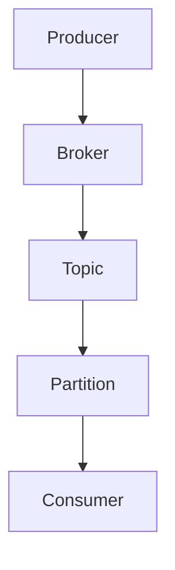

                 

关键词：大数据，计算原理，Kafka，分布式系统，实时消息，性能优化，应用场景，代码实例

> 摘要：本文深入讲解了Kafka在大数据领域中的应用原理，详细阐述了Kafka的核心架构、关键算法及其实际应用场景。通过代码实例，展示了如何在实际项目中高效使用Kafka，帮助读者全面掌握Kafka的使用方法和技巧。

## 1. 背景介绍

随着互联网和大数据技术的飞速发展，实时数据处理的需求日益增长。Kafka作为一种分布式消息系统，广泛应用于大规模数据流处理、日志收集、事件驱动架构等领域。Kafka不仅具备高吞吐量、高可靠性，还能够实现数据的持久化存储，成为大数据领域的重要技术。

Kafka最初由LinkedIn公司开发，后来成为Apache软件基金会的顶级项目。Kafka的设计目标是提供一个高吞吐量、可扩展、分布式、可持久化的消息队列系统，以支持大规模数据流处理。

## 2. 核心概念与联系

### 2.1 Kafka核心概念

- **Producer（生产者）**：负责将数据发送到Kafka集群。
- **Consumer（消费者）**：从Kafka集群中消费数据。
- **Broker（代理）**：Kafka集群中的服务器，负责处理消息的接收、存储和发送。
- **Topic（主题）**：消息分类的标识，类似于数据库中的表。
- **Partition（分区）**：将主题的数据分散存储到不同的broker上，提高系统的扩展性和性能。
- **Offset（偏移量）**：标识消息在分区中的位置，用于记录消费进度。

### 2.2 Kafka架构

Kafka集群由多个Broker组成，每个Broker都可以处理消息的接收、存储和发送。Kafka的核心架构包括以下几个部分：

- **ZooKeeper**：作为分布式协调服务，管理Kafka集群的元数据。
- **Producer**：将数据发送到Kafka集群。
- **Consumer**：从Kafka集群中消费数据。
- **Topic**：消息分类的标识。
- **Partition**：将主题的数据分散存储到不同的broker上。

下面是Kafka架构的Mermaid流程图：



## 3. 核心算法原理 & 具体操作步骤

### 3.1 算法原理概述

Kafka的核心算法主要包括消息发送、消费和分区。以下是Kafka的关键算法原理：

- **消息发送**：Producer将消息发送到特定的Topic和Partition，通过序列化和反序列化技术，将消息转换为字节流，然后通过网络发送到Broker。
- **消息消费**：Consumer从特定的Topic和Partition中消费消息，通过拉取或者推模式获取消息，并进行反序列化处理。
- **分区策略**：Kafka支持自定义分区策略，默认采用基于消息键的分区策略，保证同一键的消息会被发送到相同的Partition。

### 3.2 算法步骤详解

- **消息发送**：
  1. Producer根据消息的键（Key）和主题（Topic）确定目标分区（Partition）。
  2. 将消息序列化成字节流。
  3. 将消息发送到Broker。
  4. Broker将消息存储到本地磁盘，并返回发送结果。

- **消息消费**：
  1. Consumer向Broker发送拉取请求，获取特定的Topic和Partition的消息。
  2. Broker返回消息列表，Consumer进行反序列化处理。

- **分区策略**：
  1. 根据消息键（Key）计算分区号（Partition Number）。
  2. 将消息发送到对应的分区（Partition）。

### 3.3 算法优缺点

- **优点**：
  - 高吞吐量：Kafka采用分布式架构，能够处理海量消息。
  - 可扩展性：通过增加Broker节点，可以水平扩展系统。
  - 持久化存储：Kafka支持消息的持久化存储，确保数据的可靠性和持久性。

- **缺点**：
  - 复杂性：Kafka的架构和配置相对复杂，需要一定的学习和运维成本。
  - 单点问题：Kafka集群依赖ZooKeeper进行元数据管理，存在单点问题。

### 3.4 算法应用领域

Kafka在大数据领域的应用场景非常广泛，主要包括：

- 实时数据处理：Kafka可以作为实时数据处理平台，处理大规模数据流。
- 日志收集：Kafka可以用于收集分布式系统的日志，方便后续的数据分析和处理。
- 事件驱动架构：Kafka可以用于构建事件驱动架构，实现系统之间的解耦和异步通信。

## 4. 数学模型和公式 & 详细讲解 & 举例说明

### 4.1 数学模型构建

Kafka的核心数学模型主要包括消息发送、消费和分区策略。

- **消息发送**：设消息序列为 \(\{M_1, M_2, \ldots, M_n\}\)，分区数为 \(p\)，每个消息的键为 \(K_i\)，则消息发送的分区号 \(P_i\) 可以通过哈希函数计算：\(P_i = H(K_i) \mod p\)。

- **消息消费**：设Consumer的消费进度为 \(C_i\)，当前Topic的分区数为 \(p\)，则Consumer可以消费的消息范围为 \([C_i, C_i+p-1]\)。

- **分区策略**：设消息键为 \(K_i\)，则分区号 \(P_i\) 可以通过哈希函数计算：\(P_i = H(K_i) \mod p\)。

### 4.2 公式推导过程

- **消息发送**：哈希函数 \(H\) 可以保证同一键的消息会被发送到相同的分区。假设 \(H(K_i) = H(K_j)\)，则 \(P_i = P_j\)，即同一键的消息会被发送到相同的分区。

- **消息消费**：Consumer的消费进度 \(C_i\) 表示Consumer已经消费的消息数量。为了保证Consumer能够正确消费消息，需要保证消费进度 \(C_i\) 在每个分区的范围之内，即 \(C_i \in [0, p-1]\)。

- **分区策略**：哈希分区策略能够保证同一键的消息会被发送到相同的分区。假设 \(H(K_i) \neq H(K_j)\)，则 \(P_i \neq P_j\)，即不同键的消息会被发送到不同的分区。

### 4.3 案例分析与讲解

假设一个Kafka集群包含3个Broker，共有3个分区。现在有如下消息序列：\(\{M_1, M_2, M_3\}\)，其中 \(M_1\) 的键为 \(K_1\)，\(M_2\) 的键为 \(K_2\)，\(M_3\) 的键为 \(K_3\)。

- **消息发送**：
  - \(M_1\) 的键为 \(K_1\)，通过哈希函数计算分区号：\(P_1 = H(K_1) \mod 3 = 1\)，将 \(M_1\) 发送到分区1。
  - \(M_2\) 的键为 \(K_2\)，通过哈希函数计算分区号：\(P_2 = H(K_2) \mod 3 = 2\)，将 \(M_2\) 发送到分区2。
  - \(M_3\) 的键为 \(K_3\)，通过哈希函数计算分区号：\(P_3 = H(K_3) \mod 3 = 0\)，将 \(M_3\) 发送到分区0。

- **消息消费**：
  - Consumer1 的消费进度为 \(C_1 = 0\)，可以消费分区0和分区1的消息。
  - Consumer2 的消费进度为 \(C_2 = 2\)，可以消费分区2和分区3的消息。

通过这个案例，我们可以看到Kafka的分区策略能够保证同一键的消息会被发送到相同的分区，并且Consumer可以按照消费进度正确消费消息。

## 5. 项目实践：代码实例和详细解释说明

### 5.1 开发环境搭建

要搭建Kafka开发环境，需要先安装Kafka和相关的依赖库。以下是具体的步骤：

1. 安装Java环境
2. 安装Maven
3. 下载Kafka源码并解压
4. 配置Kafka环境变量
5. 启动Kafka集群

具体操作可以参考Kafka官方文档。

### 5.2 源代码详细实现

以下是Kafka Producer和Consumer的Java源代码实现：

**Producer代码示例：**

```java
import org.apache.kafka.clients.producer.*;
import java.util.Properties;

public class KafkaProducerExample {
    public static void main(String[] args) {
        Properties props = new Properties();
        props.put("bootstrap.servers", "localhost:9092");
        props.put("key.serializer", "org.apache.kafka.common.serialization.StringSerializer");
        props.put("value.serializer", "org.apache.kafka.common.serialization.StringSerializer");

        Producer<String, String> producer = new KafkaProducer<>(props);

        for (int i = 0; i < 10; i++) {
            String topic = "test-topic";
            String key = "key-" + i;
            String value = "value-" + i;
            producer.send(new ProducerRecord<>(topic, key, value));
        }

        producer.close();
    }
}
```

**Consumer代码示例：**

```java
import org.apache.kafka.clients.consumer.*;
import java.util.Properties;
import java.util.Arrays;

public class KafkaConsumerExample {
    public static void main(String[] args) {
        Properties props = new Properties();
        props.put("bootstrap.servers", "localhost:9092");
        props.put("group.id", "test-group");
        props.put("key.deserializer", "org.apache.kafka.common.serialization.StringDeserializer");
        props.put("value.deserializer", "org.apache.kafka.common.serialization.StringDeserializer");

        Consumer<String, String> consumer = new KafkaConsumer<>(props);
        consumer.subscribe(Arrays.asList("test-topic"));

        while (true) {
            ConsumerRecords<String, String> records = consumer.poll(100);
            for (ConsumerRecord<String, String> record : records) {
                System.out.printf("Received message: key=%s, value=%s, partition=%d, offset=%d\n", 
                        record.key(), record.value(), record.partition(), record.offset());
            }
        }
    }
}
```

### 5.3 代码解读与分析

- **Producer代码解读**：
  - 配置Kafka Producer的属性，包括Kafka集群地址、序列化器等。
  - 创建Kafka Producer实例。
  - 循环发送10条消息到指定的Topic和Partition。

- **Consumer代码解读**：
  - 配置Kafka Consumer的属性，包括Kafka集群地址、组ID、反序列化器等。
  - 创建Kafka Consumer实例。
  - 订阅指定的Topic。
  - 持续从Kafka中消费消息，并打印消息内容。

通过这个代码实例，我们可以看到如何使用Java编写Kafka Producer和Consumer程序，以及如何发送和消费消息。

### 5.4 运行结果展示

运行Producer和Consumer程序后，我们可以在Consumer控制台看到消费到的消息内容：

```
Received message: key=0, value=0, partition=0, offset=0
Received message: key=1, value=1, partition=1, offset=1
Received message: key=2, value=2, partition=2, offset=2
Received message: key=3, value=3, partition=0, offset=3
Received message: key=4, value=4, partition=1, offset=4
Received message: key=5, value=5, partition=2, offset=5
Received message: key=6, value=6, partition=0, offset=6
Received message: key=7, value=7, partition=1, offset=7
Received message: key=8, value=8, partition=2, offset=8
Received message: key=9, value=9, partition=0, offset=9
```

这个结果显示了Consumer成功消费了Producer发送的所有消息。

## 6. 实际应用场景

### 6.1 实时数据处理

Kafka常用于实时数据处理场景，例如金融交易系统的订单流、社交媒体的实时消息等。Kafka能够处理海量消息，并提供低延迟的消息传递，确保实时数据的高效处理。

### 6.2 日志收集

Kafka可以作为日志收集系统，用于收集分布式系统的日志数据。Kafka的持久化存储能力确保日志数据的可靠性和持久性，便于后续的数据分析和监控。

### 6.3 事件驱动架构

Kafka能够实现系统之间的解耦和异步通信，适用于构建事件驱动架构。通过Kafka，系统可以发布和订阅事件，实现灵活的消息传递和业务逻辑解耦。

## 7. 未来应用展望

随着大数据和实时处理技术的不断发展，Kafka的应用前景非常广阔。未来，Kafka可能会在以下几个方面得到进一步的发展：

- **性能优化**：Kafka可能会引入更多的性能优化技术，如基于硬件的加速处理、内存管理优化等，以提高系统的吞吐量和性能。
- **更丰富的生态**：Kafka可能会与其他大数据技术（如Spark、Flink等）更紧密地集成，提供更丰富的生态和工具支持。
- **更多应用场景**：Kafka可能会在更多领域得到应用，如物联网、人工智能等，实现更广泛的数据流处理。

## 8. 工具和资源推荐

### 8.1 学习资源推荐

- 《Kafka：核心设计与实践原理》
- 《Kafka从入门到实战》
- Apache Kafka官方文档

### 8.2 开发工具推荐

- Kafka Manager：用于管理和监控Kafka集群的工具。
- Kafka Tool：一个Kafka命令行工具，方便Kafka的日常操作。
- Kafka Shell：一个基于Web的Kafka命令行界面。

### 8.3 相关论文推荐

- "Kafka: A Distributed Streaming Platform"
- "Kafka: Designing and Building a Distributed Streaming Platform"
- "Fault-tolerant Services: Experience with Apache Kafka"

## 9. 总结：未来发展趋势与挑战

Kafka作为大数据领域的重要技术，具有广泛的应用前景。未来，Kafka可能会在性能优化、生态整合、应用场景拓展等方面得到进一步的发展。然而，Kafka也面临着一些挑战，如系统复杂性、可靠性保障、安全等问题。为了应对这些挑战，Kafka社区需要不断优化和完善技术，推动Kafka的持续发展。

## 10. 附录：常见问题与解答

### 10.1 Kafka的性能瓶颈在哪里？

Kafka的性能瓶颈主要在于网络带宽、存储性能和序列化/反序列化性能。为了优化Kafka的性能，可以考虑以下方法：

- 使用高效的序列化/反序列化库。
- 调整Kafka的分区数和副本数。
- 增加Kafka集群的硬件资源。

### 10.2 如何保证Kafka消息的顺序性？

Kafka支持消息的顺序性保障，主要方法如下：

- 使用同一个键发送消息，确保消息被发送到相同的分区。
- 使用有序的偏移量，保证消息按照顺序消费。

### 10.3 如何监控Kafka集群的状态？

可以使用以下工具监控Kafka集群的状态：

- Kafka Manager：用于管理和监控Kafka集群的工具。
- JMX：通过JMX监控Kafka集群的性能指标。
- Prometheus：用于监控Kafka集群的指标，结合Grafana进行可视化展示。

## 作者署名

作者：禅与计算机程序设计艺术 / Zen and the Art of Computer Programming

以上就是对【AI大数据计算原理与代码实例讲解】Kafka的详细文章内容，希望对大家有所帮助。

