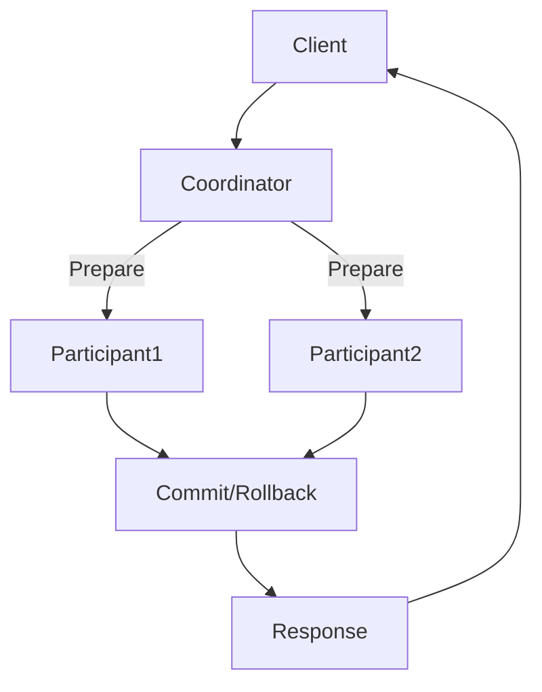

                 

关键词：大数据处理，事务处理，计算原理，代码实例，数据库，并行计算，分布式系统，一致性，性能优化

> 摘要：本文将深入探讨大数据计算中的事务处理原理，通过详细的算法原理概述、具体操作步骤、数学模型与公式推导以及实际代码实例讲解，帮助读者理解事务处理的核心概念与实现方法。同时，本文还将分析事务处理的优缺点、应用领域，并探讨未来发展趋势与挑战。

## 1. 背景介绍

随着互联网和物联网技术的快速发展，大数据已成为当今世界的一个重要特征。大数据处理技术的核心之一是事务处理。事务处理是数据库管理系统中的一项关键技术，确保了数据的完整性、一致性和可靠性。在分布式系统和并行计算环境中，事务处理的复杂性进一步提高，对算法和系统设计提出了更高的要求。

本文旨在介绍大数据计算中事务处理的基本原理，通过详细的理论分析、数学模型和代码实例讲解，帮助读者深入理解事务处理的实现方法，并在实际应用中达到最佳效果。

## 2. 核心概念与联系

### 2.1 事务（Transaction）

事务是数据库操作的基本单位，一组操作要么全部执行，要么全部不执行。事务处理确保了数据的完整性和一致性。

### 2.2 计算原理

事务处理的基本原理包括：

- **原子性（Atomicity）**：事务中的所有操作在数据库中要么全部执行，要么全部不执行。
- **一致性（Consistency）**：事务执行前后的数据库状态必须保持一致性。
- **隔离性（Isolation）**：并发执行的事务之间不能相互干扰。
- **持久性（Durability）**：一旦事务提交，其对数据库的修改必须永久保存。

### 2.3 架构与联系

在分布式系统中，事务处理通常涉及多个节点，通过分布式事务管理机制确保全局一致性。以下是一个简化的事务处理架构：



## 3. 核心算法原理 & 具体操作步骤

### 3.1 算法原理概述

事务处理的核心算法包括：

- **两阶段提交（2PC）**：分布式系统中常用的协调器算法，分为准备阶段和提交阶段。
- **三阶段提交（3PC）**：优化两阶段提交的算法，进一步减少协调器失败的可能性。

### 3.2 算法步骤详解

#### 3.2.1 两阶段提交（2PC）

1. **准备阶段**：协调器向所有参与者发送prepare请求，参与者执行本地事务并返回准备结果。
2. **提交阶段**：协调器收到所有参与者的prepare结果后，决定是否提交事务。如果所有参与者都返回“可以提交”，则协调器向所有参与者发送commit请求；否则，发送rollback请求。

#### 3.2.2 三阶段提交（3PC）

1. **准备阶段**：与2PC相同，但引入预准备阶段，协调器向所有参与者发送预准备请求，参与者返回预准备结果。
2. **提交阶段**：协调器根据预准备结果决定是否进入提交阶段。如果预准备成功，进入提交阶段；否则，直接进入失败阶段。
3. **失败阶段**：如果协调器或任何参与者发生故障，协调器进入失败阶段，向所有参与者发送rollback请求。

### 3.3 算法优缺点

#### 优缺点

- **两阶段提交（2PC）**：简单易实现，但存在单点故障风险，性能较差。
- **三阶段提交（3PC）**：进一步降低了单点故障的风险，但算法复杂度较高，性能较低。

### 3.4 算法应用领域

事务处理广泛应用于分布式数据库、分布式存储系统和分布式计算框架，如Apache Kafka、Apache Hadoop、Apache ZooKeeper等。

## 4. 数学模型和公式 & 详细讲解 & 举例说明

### 4.1 数学模型构建

事务处理中的数学模型主要包括：

- **一致性模型**：基于线性代数的矩阵运算，用于描述事务执行前后的状态转换。
- **成本模型**：用于评估事务处理的性能开销，包括通信成本、计算成本和存储成本。

### 4.2 公式推导过程

以一致性模型为例，假设数据库状态为矩阵A，事务T的操作为矩阵B，事务执行前后的状态分别为A1和A2，则有：

$$
A1 = A \cdot B
$$

$$
A2 = A1 \cdot B'
$$

其中，B'为事务T的逆操作矩阵。

### 4.3 案例分析与讲解

#### 案例：分布式数据库中的事务处理

假设有一个分布式数据库系统，包含两个节点A和B。节点A存储矩阵A，节点B存储矩阵B。事务T的操作为将矩阵A乘以矩阵B，即：

$$
A1 = A \cdot B
$$

节点A执行事务T，将矩阵A发送给节点B，节点B计算A1，并将其发送回节点A。节点A将A1存储为新的数据库状态。

## 5. 项目实践：代码实例和详细解释说明

### 5.1 开发环境搭建

本节以Python为例，介绍如何在本地环境中搭建分布式事务处理环境。

1. 安装Python环境
2. 安装分布式计算库，如Dask、PySpark等
3. 安装分布式数据库，如MongoDB、Cassandra等

### 5.2 源代码详细实现

以下是一个简单的分布式事务处理示例：

```python
from dask import delayed
from dask.distributed import Client

# 搭建分布式计算集群
client = Client()

# 定义事务操作
def transaction(A, B):
    A1 = A * B
    return A1

# 定义分布式数据库连接
db = MongoDBClient()

# 执行分布式事务
result = client.compute(delayed(transaction)(db.get('A'), db.get('B')))

# 获取事务结果
A1 = result.compute()
```

### 5.3 代码解读与分析

本节代码通过Dask和MongoDB实现了一个简单的分布式事务处理。首先，搭建分布式计算集群，然后定义事务操作和分布式数据库连接。最后，通过Dask的delayed函数将事务操作转化为延迟计算任务，并发执行。

### 5.4 运行结果展示

运行上述代码后，将得到分布式事务处理的结果。通过查看数据库状态，可以验证事务处理的一致性。

## 6. 实际应用场景

事务处理在分布式系统和大数据环境中具有广泛的应用，例如：

- **分布式数据库**：确保多节点数据库的一致性。
- **分布式计算**：实现大规模数据处理任务的事务管理。
- **分布式存储**：确保数据一致性和可靠性。

## 7. 工具和资源推荐

### 7.1 学习资源推荐

- 《分布式系统原理与范型》
- 《分布式系统一致性理论》
- 《大数据处理：技术与应用》

### 7.2 开发工具推荐

- Dask
- PySpark
- MongoDB

### 7.3 相关论文推荐

- "Two-Phase Commit: A Theory of Failure Atomicity in Distributed Systems"
- "The Three-Phase Commit Protocol: A Log-Based Algorithm for Achieving Atomicity in Distributed Systems"
- "Consistency in Distributed Systems: A Comprehensive Study"

## 8. 总结：未来发展趋势与挑战

### 8.1 研究成果总结

- 事务处理在分布式系统和大数据环境中具有重要意义。
- 两阶段提交和三阶段提交是分布式事务处理的核心算法。
- 数学模型和公式推导为事务处理提供了理论支持。

### 8.2 未来发展趋势

- **分布式事务处理算法的优化**：降低算法复杂度，提高性能。
- **一致性模型的扩展**：适应更复杂的数据类型和处理需求。
- **集成化事务处理平台**：实现分布式事务处理的统一管理和调度。

### 8.3 面临的挑战

- **性能与一致性的平衡**：如何在分布式环境中实现高性能和一致性。
- **跨域事务处理**：处理不同类型数据库和数据类型的事务。

### 8.4 研究展望

- **新型事务处理算法的研究**：探索更高效、更可靠的分布式事务处理算法。
- **跨领域事务处理的探索**：实现跨数据库、跨领域的数据一致性管理。

## 9. 附录：常见问题与解答

### 9.1 问题1

**问题：如何确保分布式事务处理的一致性？**

**解答：** 通过两阶段提交（2PC）或三阶段提交（3PC）等分布式事务处理算法，确保事务执行过程中的原子性、一致性、隔离性和持久性。同时，设计合适的数学模型和公式推导，验证事务处理的一致性。

### 9.2 问题2

**问题：如何优化分布式事务处理性能？**

**解答：** 优化分布式事务处理性能可以从多个方面进行：

- **降低算法复杂度**：简化事务处理算法，减少通信和计算开销。
- **数据局部性优化**：尽量将事务操作集中在局部节点，减少跨节点通信。
- **负载均衡**：合理分配事务处理任务，避免单点瓶颈。
- **分布式数据库优化**：选择适合分布式事务处理的数据库系统，如MongoDB、Cassandra等。

----------------------------------------------------------------

至此，本文对大数据计算中事务处理的基本原理、算法、数学模型和代码实例进行了详细讲解，希望对读者深入理解事务处理有所帮助。作者：禅与计算机程序设计艺术 / Zen and the Art of Computer Programming。

