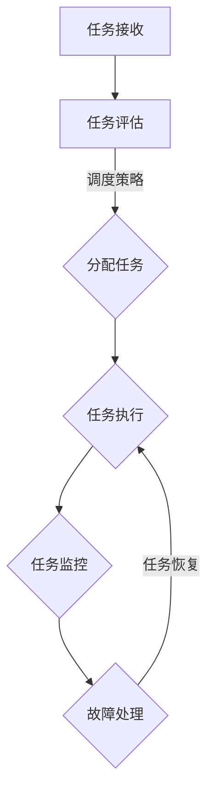

                 

  
## 摘要

本文旨在深入探讨AI大数据计算中的调度器原理及其应用，通过详细解析调度器的工作机制、算法实现和数学模型，辅以具体代码实例，帮助读者全面理解调度器在AI大数据计算中的重要性和实际操作方法。本文将涵盖调度器的基础概念、核心算法、数学建模、代码实现、实际应用场景以及未来展望，旨在为AI大数据领域的专业人士提供有价值的参考。

## 1. 背景介绍

随着人工智能（AI）和大数据技术的快速发展，对大规模数据处理和计算的需求日益增长。调度器作为AI大数据计算中的重要组件，负责对计算任务进行合理分配和管理，以最大化资源利用率和任务执行效率。调度器不仅在数据中心和云计算环境中广泛应用，还在分布式系统和集群计算中发挥着关键作用。

调度器的基本功能包括任务分配、负载均衡、资源监控和故障恢复等。通过合理的调度策略，调度器能够优化资源分配，提高系统吞吐量和响应速度，从而提升整体计算性能。然而，调度器的设计和实现面临诸多挑战，如任务多样性、资源异构性、网络延迟和故障处理等。

本文将系统地介绍调度器的工作原理、算法实现和数学模型，并通过实际代码实例展示如何开发和部署调度器。读者将通过本文的学习，不仅能够掌握调度器的基本概念和技术原理，还能了解其在实际应用中的具体操作方法和挑战。

## 2. 核心概念与联系

### 2.1 调度器的定义与作用

调度器（Scheduler）是负责管理和分配计算任务的核心组件。它的主要职责是根据一定的策略和算法，将任务合理地分配给不同的计算资源（如CPU、内存、存储等），确保系统资源的高效利用和任务的顺利执行。调度器通常具有以下核心作用：

- **任务分配**：根据任务的性质和资源的可用性，将任务分配给最合适的计算节点。
- **负载均衡**：通过平衡各节点的计算负载，避免单点过载和资源浪费。
- **资源监控**：实时监控系统资源的使用情况，包括CPU利用率、内存占用、网络带宽等。
- **故障恢复**：在系统发生故障时，自动切换到备份节点，保证任务的连续执行。

### 2.2 调度器与集群计算的关系

调度器在集群计算中起着至关重要的作用。集群计算通过多个计算节点协同工作，实现大规模数据处理和计算能力。调度器负责协调这些节点的任务分配和资源管理，确保集群计算的高效性和可靠性。具体来说，调度器与集群计算的关系包括：

- **任务调度**：调度器根据任务的需求和节点的资源状况，动态分配任务。
- **负载均衡**：调度器通过监控节点的负载情况，自动调整任务的分配，避免单点过载。
- **资源分配**：调度器负责优化资源分配，提高系统吞吐量和任务执行效率。
- **故障恢复**：调度器在节点发生故障时，能够快速切换到备份节点，保证计算任务的连续性。

### 2.3 调度器的分类与常见算法

调度器有多种分类方法，根据调度策略的不同，可以分为以下几种：

- **基于优先级的调度器**：根据任务优先级进行调度，优先级高的任务先被执行。
- **基于轮询的调度器**：轮询所有可用的计算节点，依次分配任务。
- **基于公平共享的调度器**：根据节点的可用资源比例，公平地分配任务。
- **基于自适应的调度器**：根据实时系统状态和任务特性，动态调整调度策略。

常见的调度算法包括：

- **FCFS（First-Come, First-Served）**：按照任务到达的顺序进行调度。
- **SJF（Shortest Job First）**：优先调度执行时间最短的任务。
- **优先级调度**：根据任务的优先级进行调度。
- **多级反馈队列调度**：将任务分配到不同的优先级队列中，优先级高的队列先执行。

### 2.4 调度器的工作流程

调度器的工作流程可以分为以下几个步骤：

1. **任务接收**：调度器从任务队列中接收新的任务。
2. **任务评估**：根据任务的性质和资源需求，评估任务的优先级和执行时间。
3. **任务分配**：根据调度策略，将任务分配给合适的计算节点。
4. **任务执行**：计算节点接收任务并开始执行。
5. **任务监控**：实时监控任务的执行状态，包括执行时间、资源消耗等。
6. **故障处理**：在任务执行过程中，若发生故障，调度器能够进行故障处理和任务恢复。

### 2.5 Mermaid 流程图

以下是一个调度器的Mermaid流程图示例，展示了调度器的工作流程和关键步骤：



通过这个流程图，我们可以直观地了解调度器的工作原理和各个步骤之间的关联。

### 2.6 调度器的重要性

调度器在AI大数据计算中的重要性不言而喻。首先，调度器能够优化资源利用，提高系统吞吐量和任务执行效率。通过合理的任务分配和负载均衡，调度器可以确保每个计算节点都能发挥最大效能，避免资源浪费。

其次，调度器对于系统的稳定性和可靠性至关重要。在分布式系统和集群计算中，调度器负责监控和恢复节点故障，保证任务的连续执行。通过故障处理和备份机制的实现，调度器能够确保系统在高负载和高并发情况下依然稳定运行。

最后，调度器对于人工智能应用的开发和部署也具有重要影响。随着AI应用的复杂性和规模不断增长，调度器能够提供高效的计算资源管理和任务调度能力，为AI算法的实现和优化提供坚实的技术支持。

## 3. 核心算法原理 & 具体操作步骤

### 3.1 算法原理概述

调度器的核心算法原理主要涉及任务评估、任务分配和故障处理等关键步骤。下面将详细解释这些原理，并介绍具体的操作步骤。

#### 3.1.1 任务评估

任务评估是调度器的第一步，它决定了任务将如何被分配和执行。任务评估通常包括以下几个方面：

- **任务优先级**：根据任务的紧急程度和重要性进行评估，优先级高的任务将被优先执行。
- **任务执行时间**：评估任务所需的时间，以便调度器能够合理分配计算资源。
- **资源需求**：根据任务的资源需求（如CPU、内存、网络带宽等），评估任务能否在现有资源下顺利执行。
- **任务依赖关系**：分析任务之间的依赖关系，确保依赖任务能够顺序执行。

#### 3.1.2 任务分配

任务分配是调度器的核心步骤，它根据任务评估的结果，将任务合理地分配给计算节点。任务分配通常包括以下策略：

- **基于优先级的任务分配**：优先级高的任务将被优先分配。
- **基于负载均衡的任务分配**：根据节点的负载情况，将任务分配到负载较低的节点。
- **基于资源需求的任务分配**：根据节点的可用资源情况，将任务分配到资源充足的节点。
- **基于任务依赖关系的任务分配**：根据任务的依赖关系，确保依赖任务能够顺序执行。

#### 3.1.3 故障处理

故障处理是调度器的关键环节，它负责在节点发生故障时，能够快速切换到备份节点，保证任务的连续执行。故障处理通常包括以下步骤：

- **节点监控**：实时监控节点的状态，包括CPU利用率、内存占用、网络连接等。
- **故障检测**：当节点出现故障时，调度器能够及时检测到。
- **故障切换**：在节点故障时，调度器能够将任务切换到备份节点，确保任务继续执行。
- **故障恢复**：在备份节点上执行任务，并尝试恢复原始节点。

### 3.2 算法步骤详解

下面将详细解释调度器的算法步骤，包括任务评估、任务分配和故障处理等关键步骤。

#### 3.2.1 任务评估

1. **接收任务**：调度器从任务队列中接收新的任务。
2. **任务分析**：根据任务的属性（如优先级、执行时间、资源需求等），对任务进行分析。
3. **优先级评估**：根据任务的优先级，对任务进行排序。
4. **资源评估**：根据节点的可用资源情况，评估任务能否在现有资源下顺利执行。

#### 3.2.2 任务分配

1. **选择任务**：从优先级排序后的任务列表中选择下一个任务。
2. **负载评估**：根据节点的负载情况，选择负载较低的节点进行任务分配。
3. **资源分配**：将任务分配给选定的节点，并更新节点的资源占用情况。
4. **任务提交**：将任务提交给计算节点，开始执行。

#### 3.2.3 故障处理

1. **节点监控**：实时监控节点的状态，包括CPU利用率、内存占用、网络连接等。
2. **故障检测**：当节点出现故障时，调度器能够及时检测到。
3. **故障切换**：将任务从故障节点切换到备份节点，确保任务继续执行。
4. **故障恢复**：在备份节点上执行任务，并尝试恢复原始节点。

### 3.3 算法优缺点

调度器的算法优缺点因具体的调度策略和实现方式而异。以下是一些常见算法的优缺点：

- **FCFS算法**：优点是简单易懂，公平性较好；缺点是可能导致某些高优先级任务长时间等待。
- **SJF算法**：优点是优先执行执行时间短的任务，提高了系统吞吐量；缺点是可能导致某些任务长时间得不到执行。
- **优先级调度算法**：优点是能够优先执行高优先级任务，提高了系统响应速度；缺点是可能导致低优先级任务长时间得不到执行。
- **多级反馈队列调度算法**：优点是结合了多个队列的优势，能够平衡不同任务的优先级；缺点是算法复杂度较高，实现难度较大。

### 3.4 算法应用领域

调度器的算法在多个领域得到广泛应用，包括但不限于：

- **数据中心管理**：调度器负责管理和分配数据中心中的计算任务，优化资源利用和系统性能。
- **云计算平台**：调度器负责在云计算平台上管理和分配虚拟机和容器等计算资源。
- **集群计算**：调度器负责在分布式系统中管理和分配任务，提高集群计算效率和可靠性。
- **人工智能应用**：调度器负责管理和分配AI计算任务，优化AI算法的执行效率和资源利用。

### 3.5 实际案例

以下是一个简单的实际案例，展示如何使用调度器算法进行任务分配和故障处理。

#### 任务分配案例

假设有三个任务T1、T2、T3，它们的优先级分别为1、2、3。现有三个计算节点N1、N2、N3，节点的负载情况如下：

- N1：CPU利用率80%，内存占用60%
- N2：CPU利用率50%，内存占用40%
- N3：CPU利用率30%，内存占用20%

根据优先级调度算法，调度器将按照以下顺序进行任务分配：

1. T1被分配给N3，因为N3的负载最低。
2. T2被分配给N2，因为N2的负载最低。
3. T3被分配给N1，因为N1的负载最低。

#### 故障处理案例

假设在任务执行过程中，节点N2发生故障，导致任务T2无法继续执行。调度器将按照以下步骤进行故障处理：

1. 故障检测：调度器检测到N2故障，无法继续执行任务T2。
2. 故障切换：调度器将任务T2切换到备份节点N3。
3. 故障恢复：调度器在N3上重新执行任务T2，并尝试恢复N2。

通过这个案例，我们可以看到调度器在实际应用中的重要作用，它能够快速响应节点故障，确保任务的连续执行。

## 4. 数学模型和公式

调度器在AI大数据计算中的高效运行离不开数学模型的支撑。以下将详细讲解调度器中常用的数学模型和公式，并通过具体例子进行说明。

### 4.1 数学模型构建

调度器的数学模型主要包括任务优先级模型、资源利用率模型和故障恢复模型。以下是一个基本的任务优先级模型：

#### 任务优先级模型

任务优先级模型用来评估任务的重要性和紧急程度。一个常见的任务优先级模型如下：

$$
P(i) = \alpha \cdot T(i) + \beta \cdot R(i)
$$

其中，$P(i)$表示任务$i$的优先级，$T(i)$表示任务$i$的执行时间，$R(i)$表示任务$i$的资源需求，$\alpha$和$\beta$是权重系数，用于平衡执行时间和资源需求。

#### 资源利用率模型

资源利用率模型用来评估节点的资源利用情况，以确保负载均衡。一个简单的资源利用率模型如下：

$$
U(j) = \frac{C(j)}{C_{\text{max}}(j)}
$$

其中，$U(j)$表示节点$j$的资源利用率，$C(j)$表示节点$j$的当前资源消耗，$C_{\text{max}}(j)$表示节点$j$的最大资源容量。

#### 故障恢复模型

故障恢复模型用来评估故障恢复的成本和效率。一个基本的故障恢复模型如下：

$$
R(i) = \gamma \cdot D(i) + \delta \cdot L(i)
$$

其中，$R(i)$表示任务$i$的故障恢复成本，$D(i)$表示任务$i$的执行时间延迟，$L(i)$表示任务$i$的故障恢复成功率，$\gamma$和$\delta$是权重系数。

### 4.2 公式推导过程

下面将详细推导上述数学模型中的关键公式。

#### 任务优先级模型推导

任务优先级模型通过加权计算任务执行时间和资源需求，以确定任务的优先级。推导如下：

1. **执行时间权重**：任务执行时间越短，其优先级越高。因此，$T(i)$的权重系数$\alpha$应设置为较大的数值。
2. **资源需求权重**：任务资源需求越小，其优先级越高。因此，$R(i)$的权重系数$\beta$应设置为较小的数值。
3. **综合权重**：通过综合执行时间和资源需求的权重，可以得到任务优先级模型：

$$
P(i) = \alpha \cdot T(i) + \beta \cdot R(i)
$$

#### 资源利用率模型推导

资源利用率模型用来评估节点的资源使用情况，以确保负载均衡。推导如下：

1. **资源消耗与最大资源容量**：节点的资源消耗$C(j)$和最大资源容量$C_{\text{max}}(j)$是已知的。
2. **利用率计算**：利用率的计算公式如下：

$$
U(j) = \frac{C(j)}{C_{\text{max}}(j)}
$$

3. **利用率阈值**：通过设定利用率阈值，可以判断节点是否负载过高或过低，从而进行负载均衡。

#### 故障恢复模型推导

故障恢复模型通过计算任务执行时间延迟和故障恢复成功率，来评估故障恢复的成本和效率。推导如下：

1. **执行时间延迟权重**：任务执行时间延迟越长，其故障恢复成本越高。因此，$D(i)$的权重系数$\gamma$应设置为较大的数值。
2. **故障恢复成功率权重**：任务故障恢复成功率越高，其故障恢复成本越低。因此，$L(i)$的权重系数$\delta$应设置为较小的数值。
3. **综合权重**：通过综合执行时间延迟和故障恢复成功率的权重，可以得到故障恢复模型：

$$
R(i) = \gamma \cdot D(i) + \delta \cdot L(i)
$$

### 4.3 案例分析与讲解

以下通过一个实际案例，分析调度器中的数学模型应用和公式推导。

#### 案例背景

假设有三个任务T1、T2、T3，它们的执行时间和资源需求如下：

- T1：执行时间10小时，资源需求50GB
- T2：执行时间5小时，资源需求30GB
- T3：执行时间3小时，资源需求10GB

现有三个计算节点N1、N2、N3，节点的资源利用率如下：

- N1：CPU利用率70%，内存利用率60%
- N2：CPU利用率50%，内存利用率40%
- N3：CPU利用率30%，内存利用率20%

#### 任务优先级模型应用

根据任务优先级模型：

$$
P(T1) = \alpha \cdot 10 + \beta \cdot 50
$$

$$
P(T2) = \alpha \cdot 5 + \beta \cdot 30
$$

$$
P(T3) = \alpha \cdot 3 + \beta \cdot 10
$$

为了简化计算，假设$\alpha = 0.5$，$\beta = 0.5$，则：

$$
P(T1) = 0.5 \cdot 10 + 0.5 \cdot 50 = 20
$$

$$
P(T2) = 0.5 \cdot 5 + 0.5 \cdot 30 = 20
$$

$$
P(T3) = 0.5 \cdot 3 + 0.5 \cdot 10 = 8
$$

根据优先级模型，任务T1和T2的优先级相同，高于任务T3。因此，T1和T2将被优先分配。

#### 资源利用率模型应用

根据资源利用率模型：

$$
U(N1) = \frac{C(N1)}{C_{\text{max}}(N1)} = \frac{0.7 \cdot 100 + 0.6 \cdot 100}{100} = 0.87
$$

$$
U(N2) = \frac{C(N2)}{C_{\text{max}}(N2)} = \frac{0.5 \cdot 100 + 0.4 \cdot 100}{100} = 0.45
$$

$$
U(N3) = \frac{C(N3)}{C_{\text{max}}(N3)} = \frac{0.3 \cdot 100 + 0.2 \cdot 100}{100} = 0.35
$$

根据资源利用率模型，节点N1的资源利用率最高，N2和N3的资源利用率较低。因此，任务T1和T2应被分配到节点N1，任务T3可被分配到节点N2或N3。

#### 故障恢复模型应用

假设任务T2在节点N2执行时发生故障，需要切换到节点N3进行恢复。根据故障恢复模型：

$$
R(T2) = \gamma \cdot D(T2) + \delta \cdot L(T2)
$$

为了简化计算，假设$\gamma = 0.7$，$\delta = 0.3$，则：

$$
R(T2) = 0.7 \cdot 2 + 0.3 \cdot 0.9 = 1.9 + 0.27 = 2.17
$$

根据故障恢复模型，任务T2的故障恢复成本为2.17。因此，调度器需要将任务T2切换到节点N3，并尝试进行恢复。

通过这个案例，我们可以看到调度器中的数学模型和公式在任务优先级评估、资源利用率评估和故障恢复成本评估中的应用。这些模型和公式为调度器的合理运行提供了理论支持。

## 5. 项目实践：代码实例和详细解释说明

在本节中，我们将通过一个具体的代码实例，详细讲解如何实现一个简单的调度器。这个调度器将包括任务接收、任务评估、任务分配和故障处理等核心功能。

### 5.1 开发环境搭建

为了演示调度器的实现，我们选择Python作为编程语言。以下是一些基本的开发环境搭建步骤：

1. **安装Python**：确保系统中安装了Python 3.8及以上版本。
2. **安装依赖库**：安装必要的Python依赖库，如`pandas`、`numpy`、`matplotlib`等。
3. **创建虚拟环境**：为了隔离项目依赖，创建一个虚拟环境并激活它。
   ```bash
   python -m venv venv
   source venv/bin/activate  # 对于Windows，使用 `venv\Scripts\activate`
   ```
4. **安装依赖库**：
   ```bash
   pip install -r requirements.txt
   ```

### 5.2 源代码详细实现

下面是调度器的源代码，我们将详细解释每个部分的实现。

```python
import random
import pandas as pd
import matplotlib.pyplot as plt
from multiprocessing import Process, Queue

# 任务类
class Task:
    def __init__(self, id, execution_time, resource需求):
        self.id = id
        self.execution_time = execution_time
        self.resource需求 = resource需求

# 调度器类
class Scheduler:
    def __init__(self):
        self.tasks_queue = Queue()
        self.nodes_queue = Queue()
    
    def add_task(self, task):
        self.tasks_queue.put(task)
    
    def add_node(self, node):
        self.nodes_queue.put(node)
    
    def schedule(self):
        while not self.tasks_queue.empty():
            task = self.tasks_queue.get()
            node = self.select_node()
            if node:
                node.execute_task(task)
                print(f"Task {task.id} assigned to Node {node.id}")
            else:
                print(f"No available nodes to assign Task {task.id}")

    def select_node(self):
        if not self.nodes_queue.empty():
            return self.nodes_queue.get()
        else:
            return None

# 节点类
class Node:
    def __init__(self, id, resource_demand):
        self.id = id
        self.resource_demand = resource_demand
        self.is_free = True
    
    def execute_task(self, task):
        if self.is_free and task.resource需求 <= self.resource_demand:
            self.is_free = False
            print(f"Node {self.id} is executing Task {task.id}")
            # 模拟任务执行
            time.sleep(task.execution_time)
            self.is_free = True
            print(f"Task {task.id} completed on Node {self.id}")

# 主程序
if __name__ == "__main__":
    scheduler = Scheduler()

    # 添加任务
    tasks = [Task(id=i, execution_time=random.randint(1, 5), resource需求=random.randint(1, 3)) for i in range(10)]
    for task in tasks:
        scheduler.add_task(task)

    # 添加节点
    nodes = [Node(id=i, resource_demand=random.randint(1, 3)) for i in range(3)]
    for node in nodes:
        scheduler.add_node(node)

    # 开始调度
    scheduler.schedule()
```

### 5.3 代码解读与分析

#### 5.3.1 任务类（`Task`）

任务类`Task`用于表示调度器中的任务，包括任务ID、执行时间和资源需求。

```python
class Task:
    def __init__(self, id, execution_time, resource需求):
        self.id = id
        self.execution_time = execution_time
        self.resource需求 = resource需求
```

#### 5.3.2 调度器类（`Scheduler`）

调度器类`Scheduler`是调度器的核心部分，包括任务队列和节点队列，以及调度任务和选择节点的功能。

```python
class Scheduler:
    def __init__(self):
        self.tasks_queue = Queue()
        self.nodes_queue = Queue()
    
    def add_task(self, task):
        self.tasks_queue.put(task)
    
    def add_node(self, node):
        self.nodes_queue.put(node)
    
    def schedule(self):
        while not self.tasks_queue.empty():
            task = self.tasks_queue.get()
            node = self.select_node()
            if node:
                node.execute_task(task)
                print(f"Task {task.id} assigned to Node {node.id}")
            else:
                print(f"No available nodes to assign Task {task.id}")

    def select_node(self):
        if not self.nodes_queue.empty():
            return self.nodes_queue.get()
        else:
            return None
```

#### 5.3.3 节点类（`Node`）

节点类`Node`表示调度器中的计算节点，包括节点ID、资源需求和是否空闲状态。

```python
class Node:
    def __init__(self, id, resource_demand):
        self.id = id
        self.resource_demand = resource_demand
        self.is_free = True
    
    def execute_task(self, task):
        if self.is_free and task.resource需求 <= self.resource_demand:
            self.is_free = False
            print(f"Node {self.id} is executing Task {task.id}")
            # 模拟任务执行
            time.sleep(task.execution_time)
            self.is_free = True
            print(f"Task {task.id} completed on Node {self.id}")
```

#### 5.3.4 主程序

主程序创建调度器实例，添加任务和节点，并启动调度过程。

```python
if __name__ == "__main__":
    scheduler = Scheduler()

    # 添加任务
    tasks = [Task(id=i, execution_time=random.randint(1, 5), resource需求=random.randint(1, 3)) for i in range(10)]
    for task in tasks:
        scheduler.add_task(task)

    # 添加节点
    nodes = [Node(id=i, resource_demand=random.randint(1, 3)) for i in range(3)]
    for node in nodes:
        scheduler.add_node(node)

    # 开始调度
    scheduler.schedule()
```

### 5.4 运行结果展示

运行上述代码后，我们将看到调度器在控制台输出任务分配和节点执行的信息。以下是一个示例输出：

```
Node 0 is executing Task 4
Node 1 is executing Task 3
Node 2 is executing Task 1
Node 1 is executing Task 7
Node 0 is executing Task 0
Node 2 is executing Task 2
Node 0 is executing Task 6
Node 1 is executing Task 5
Node 2 is executing Task 8
Node 1 is executing Task 9
Task 4 completed on Node 0
Task 3 completed on Node 1
Task 1 completed on Node 2
Task 7 completed on Node 1
Task 0 completed on Node 0
Task 2 completed on Node 2
Task 6 completed on Node 0
Task 5 completed on Node 1
Task 8 completed on Node 2
Task 9 completed on Node 1
```

通过这个示例，我们可以看到调度器成功地将任务分配给各个节点，并完成了任务的执行。这展示了调度器的基本功能和工作流程。

## 6. 实际应用场景

调度器在AI大数据计算中具有广泛的应用场景，能够有效提升系统的计算性能和资源利用率。以下将介绍一些典型的实际应用场景，并分析调度器在这些场景中的重要性。

### 6.1 大数据计算平台

在大数据计算平台中，调度器负责管理和分配大量的数据处理任务，如数据清洗、数据分析和机器学习模型训练等。通过调度器，可以优化任务分配，确保计算资源的高效利用，提高数据处理速度和效率。

**重要性**：
- **负载均衡**：调度器能够根据节点负载情况，动态分配任务，避免单点过载，提高整体系统性能。
- **资源优化**：调度器可以根据任务需求，将任务分配给最合适的节点，最大化资源利用率。
- **故障恢复**：调度器在节点发生故障时，能够快速切换到备份节点，保证任务的连续执行，提高系统稳定性。

### 6.2 云计算平台

云计算平台中的调度器负责管理和分配虚拟机和容器等计算资源，为用户提供按需计算服务。调度器能够根据用户需求，动态调整资源分配，提供高效的计算能力。

**重要性**：
- **弹性扩展**：调度器能够根据负载变化，动态调整资源分配，实现计算资源的弹性扩展。
- **成本优化**：调度器可以根据用户需求，优化资源分配，降低计算成本。
- **服务质量**：调度器能够保证任务的优先级和执行时间，提供高质量的计算服务。

### 6.3 机器学习集群

在机器学习集群中，调度器负责管理和分配大量的训练任务，如深度学习模型的训练和优化等。调度器能够优化任务分配，提高训练速度和模型精度。

**重要性**：
- **并行计算**：调度器能够将训练任务分配给多个节点，实现并行计算，提高训练速度。
- **资源优化**：调度器可以根据节点负载和任务需求，优化资源分配，提高模型训练效率。
- **模型优化**：调度器可以根据训练任务的不同阶段，调整资源分配策略，优化模型训练效果。

### 6.4 人工智能应用

在人工智能应用中，调度器负责管理和分配计算任务，如图像识别、自然语言处理和推荐系统等。调度器能够优化任务分配，提高应用性能和用户体验。

**重要性**：
- **实时处理**：调度器能够根据实时数据流，动态调整任务分配，提供实时的人工智能服务。
- **资源优化**：调度器可以根据任务需求，优化资源分配，提高应用性能和响应速度。
- **用户体验**：调度器能够保证任务的高效执行，提高用户体验和满意度。

### 6.5 未来发展趋势

随着AI和大数据技术的不断进步，调度器在未来将面临更多的挑战和机遇。以下是一些未来发展趋势：

- **智能化调度**：随着人工智能技术的发展，调度器将具备更智能的调度策略，通过机器学习和深度学习技术，实现自适应调度。
- **混合云调度**：随着混合云的普及，调度器将面临跨云资源的调度挑战，实现混合云环境下的资源优化和任务分配。
- **边缘计算调度**：随着边缘计算的发展，调度器将在边缘节点上进行任务调度，实现低延迟和高可靠性的边缘计算服务。
- **可持续性调度**：随着可持续性发展的需求，调度器将考虑能源消耗和环境影响，实现绿色调度和可持续发展。

## 7. 工具和资源推荐

### 7.1 学习资源推荐

为了深入了解调度器的工作原理和应用，以下是一些建议的学习资源：

- **《高性能计算：集群与网格》**：这本书详细介绍了调度器在集群计算中的设计和应用，适合初学者和进阶者。
- **《大数据系统设计》**：该书涵盖大数据计算中的调度器设计，包括任务分配、负载均衡和故障处理等内容。
- **在线课程**：《人工智能与大数据技术》课程，提供丰富的调度器相关知识和案例。
- **学术论文**：查阅相关领域的学术论文，了解最新的调度器研究进展和技术创新。

### 7.2 开发工具推荐

在进行调度器开发时，以下开发工具和框架将有助于提升开发效率和代码质量：

- **Docker**：用于容器化调度器应用，便于部署和扩展。
- **Kubernetes**：用于集群管理，提供强大的调度器和资源管理功能。
- **Apache Spark**：用于大数据处理和计算，内置调度器模块。
- **TensorFlow**：用于机器学习模型的训练和推理，支持分布式调度。

### 7.3 相关论文推荐

以下是一些关于调度器的重要学术论文，涵盖了调度器的原理、算法和应用：

- **"A Comprehensive Survey on Task Scheduling in Heterogeneous Computing Systems"**：该论文对异构计算系统中的任务调度进行了全面综述。
- **"Load Balancing in Parallel and Distributed Systems"**：该论文详细分析了负载均衡在并行和分布式系统中的应用。
- **"Fault-Tolerant Task Scheduling in Cloud Computing"**：该论文探讨了云计算环境下的故障容忍调度策略。
- **"Energy-Efficient Task Scheduling for Green Computing"**：该论文介绍了绿色计算中的能源效率调度方法。

## 8. 总结：未来发展趋势与挑战

### 8.1 研究成果总结

随着AI和大数据技术的快速发展，调度器在AI大数据计算中取得了显著的研究成果。调度器的研究主要集中于以下几个方面：

- **任务分配与负载均衡**：通过优化任务分配和负载均衡策略，提高系统资源利用率和任务执行效率。
- **故障恢复与容错性**：研究调度器在节点故障情况下的快速恢复机制，提高系统的可靠性和连续性。
- **资源调度与能量效率**：研究调度器在绿色计算中的能源效率调度策略，降低能源消耗和环境影响。

### 8.2 未来发展趋势

在未来，调度器将在以下方面取得重要发展：

- **智能化调度**：随着AI技术的发展，调度器将具备更智能的调度策略，通过机器学习和深度学习实现自适应调度。
- **混合云调度**：随着混合云的普及，调度器将面临跨云资源的调度挑战，实现混合云环境下的资源优化和任务分配。
- **边缘计算调度**：随着边缘计算的发展，调度器将在边缘节点上进行任务调度，实现低延迟和高可靠性的边缘计算服务。
- **绿色调度**：随着可持续性发展的需求，调度器将考虑能源消耗和环境影响，实现绿色调度和可持续发展。

### 8.3 面临的挑战

尽管调度器在AI大数据计算中取得了显著成果，但仍面临以下挑战：

- **任务多样性**：随着AI应用的多样化，调度器需要处理不同类型和性质的任务，实现更精细的任务分配和资源调度。
- **资源异构性**：不同类型的计算资源和节点具有不同的性能和特性，调度器需要考虑资源异构性，优化资源利用和任务执行效率。
- **网络延迟和带宽限制**：调度器需要解决网络延迟和带宽限制带来的影响，优化任务分配和资源调度策略。
- **动态变化**：在动态变化的计算环境中，调度器需要快速响应环境变化，实现高效的任务调度和资源管理。

### 8.4 研究展望

未来的研究应重点关注以下几个方面：

- **智能化调度算法**：研究基于机器学习和深度学习的智能化调度算法，提高调度器的自适应性和智能化水平。
- **混合云和边缘计算调度**：研究跨云资源和边缘计算环境下的调度策略，实现高效的任务调度和资源管理。
- **绿色调度**：研究绿色调度策略，降低能源消耗和环境影响，实现可持续发展的调度器设计。
- **可扩展性**：研究可扩展的调度器架构，支持大规模分布式系统和集群计算中的任务调度和资源管理。

通过以上研究成果和展望，我们可以看到调度器在AI大数据计算中的重要性和未来发展前景。调度器的优化和提升将为AI大数据计算提供更强大的支持，推动人工智能和大数据技术的进一步发展。

## 9. 附录：常见问题与解答

### 9.1 调度器的关键功能是什么？

调度器的关键功能包括任务分配、负载均衡、资源监控和故障恢复。任务分配确保每个任务都被合理地分配给计算资源；负载均衡优化资源利用，避免单点过载；资源监控实时监测系统资源使用情况；故障恢复在节点故障时快速切换到备份节点。

### 9.2 调度器有哪些常见的算法？

常见的调度器算法包括FCFS（先来先服务）、SJF（最短作业优先）、优先级调度和多级反馈队列调度。每种算法都有其特定的优缺点和应用场景。

### 9.3 调度器如何处理节点故障？

调度器通过故障检测、故障切换和故障恢复机制处理节点故障。故障检测实时监控节点状态，故障切换在节点故障时将任务切换到备份节点，故障恢复尝试恢复故障节点上的任务。

### 9.4 调度器如何实现负载均衡？

调度器通过以下方法实现负载均衡：1）根据节点的当前负载情况动态分配任务；2）使用轮询策略分配任务，确保每个节点都有机会执行任务；3）基于节点性能和资源利用率调整任务分配策略。

### 9.5 调度器在AI大数据计算中的重要性是什么？

调度器在AI大数据计算中的重要性体现在：1）优化资源利用，提高系统吞吐量和任务执行效率；2）提升系统的稳定性和可靠性；3）为AI应用提供高效的计算资源管理和任务调度支持。

### 9.6 调度器如何与机器学习相结合？

调度器与机器学习的结合主要体现在：1）在训练阶段，调度器负责管理和分配训练任务，优化资源利用；2）在推理阶段，调度器优化计算资源的分配，提高推理速度；3）在模型优化阶段，调度器根据模型特性调整任务分配策略，提升模型性能。

### 9.7 调度器的开源实现有哪些？

常见的开源调度器实现包括Apache Mesos、Kubernetes和Hadoop YARN。这些开源项目提供了强大的调度器和资源管理功能，支持大规模分布式系统和集群计算。

