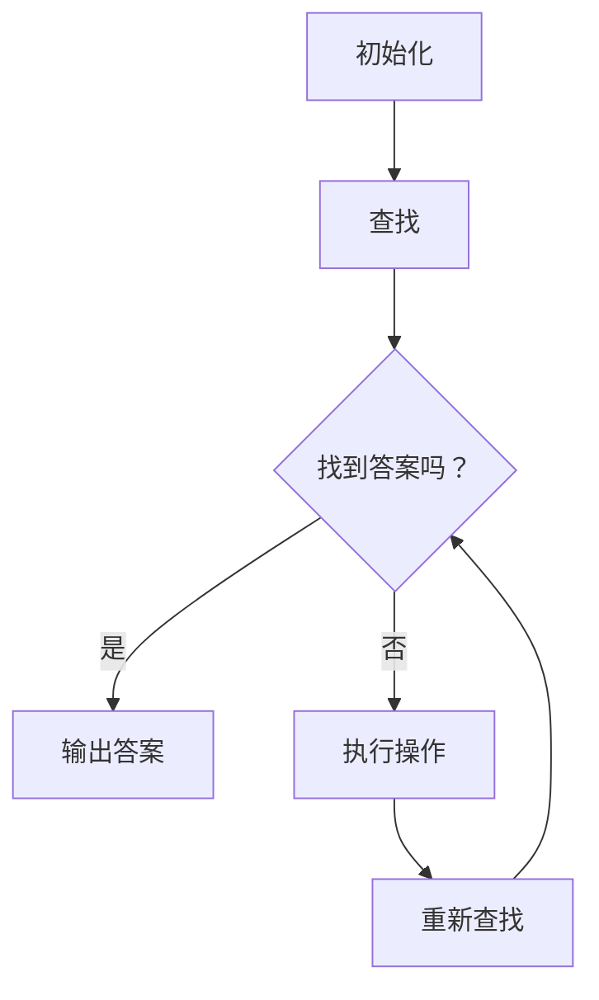
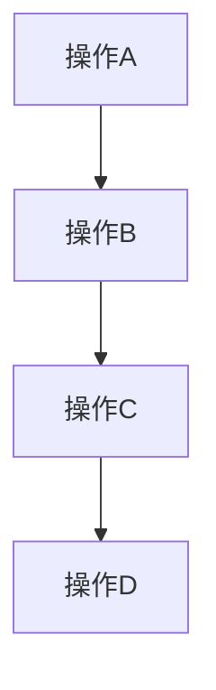

                 

关键词：LangChain、编程、Reactive Application Graph、RAG、自然语言处理、AI、智能系统、程序设计

> 摘要：本文将深入探讨LangChain编程的核心概念，特别是Reactive Application Graph（RAG）的应用。从基础概念入手，详细阐述RAG的原理、构建方法及其在智能系统中的应用，通过具体实例和数学模型的讲解，帮助读者全面理解并掌握LangChain编程技术。

## 1. 背景介绍

随着人工智能技术的快速发展，自然语言处理（NLP）已成为一个热门领域。为了应对复杂的NLP任务，研究人员和开发者们不断探索新的方法和工具。LangChain是一个基于Python的框架，旨在简化AI模型的构建和部署过程。而Reactive Application Graph（RAG）是LangChain中的一个关键组件，它为AI系统提供了动态响应的能力。

RAG的核心思想是将应用程序构建为一个图结构，其中每个节点代表一个功能或操作，边则表示节点之间的依赖关系。这种结构使得系统能够在响应输入时，自动查找和执行相关操作，从而实现高效、动态的交互。

## 2. 核心概念与联系

### 2.1 LangChain概述

LangChain是一个开放源码的Python库，它通过提供了一系列高级API和工具，帮助开发者快速构建和部署基于AI的语言模型。LangChain的核心组件包括：

- **Document Manager**：用于存储和管理文本数据。
- **QA Model Manager**：用于选择和配置不同的问答模型。
- **Memory Manager**：用于存储和检索与问题相关的信息。

### 2.2 RAG的原理

RAG的核心是一个图结构，其中每个节点代表一个功能或操作，边表示节点之间的依赖关系。RAG的工作原理如下：

1. **初始化**：根据输入问题，初始化RAG，确定相关的节点和边。
2. **查找**：在RAG中查找与输入问题相关的节点和边。
3. **执行**：根据查找结果，执行相关的操作，获取答案。

### 2.3 Mermaid流程图

以下是一个简化的RAG流程图：



## 3. 核心算法原理 & 具体操作步骤

### 3.1 算法原理概述

RAG的算法原理主要基于图论，通过构建和应用图结构来模拟AI系统的动态响应能力。具体步骤如下：

1. **初始化**：创建一个空的图结构，根据输入问题，将相关的节点和边添加到图中。
2. **查找**：在图中查找与输入问题相关的节点和边。
3. **执行**：根据查找结果，执行相关的操作，获取答案。
4. **反馈**：根据执行结果，更新图结构，为下一个问题做准备。

### 3.2 算法步骤详解

1. **初始化**：首先，我们需要根据输入问题，确定相关的节点和边。这个过程可以通过解析输入问题，提取关键词和语义信息来实现。
2. **查找**：在初始化完成后，我们开始查找与输入问题相关的节点和边。这个过程可以通过遍历图结构，匹配节点和边来实现。
3. **执行**：一旦找到与输入问题相关的节点和边，我们就可以开始执行相关的操作。这个过程可能包括查询数据库、调用外部API等。
4. **反馈**：执行完操作后，我们需要根据结果更新图结构。这个过程可能包括添加新的节点和边，删除不相关的节点和边等。

### 3.3 算法优缺点

**优点**：

- **动态响应**：RAG能够根据输入动态调整图结构，实现高效的动态响应。
- **灵活性**：RAG允许开发者自定义节点和边，实现灵活的交互逻辑。

**缺点**：

- **复杂性**：构建和维护RAG需要较高的技术和时间成本。
- **性能**：在处理大量数据时，RAG的性能可能会受到影响。

### 3.4 算法应用领域

RAG在多个领域都有广泛的应用，包括：

- **智能问答系统**：通过RAG，系统能够动态地查找和执行与问题相关的操作，实现高效的问答。
- **智能客服系统**：RAG可以帮助客服系统自动识别客户问题，并调用相关服务，提高响应速度。
- **智能推荐系统**：RAG可以根据用户行为和偏好，动态调整推荐策略，提高推荐效果。

## 4. 数学模型和公式 & 详细讲解 & 举例说明

### 4.1 数学模型构建

RAG的数学模型主要基于图论。具体来说，RAG可以被视为一个有向无环图（DAG），其中每个节点代表一个操作，边表示操作之间的依赖关系。我们可以使用图表示法来描述RAG。

### 4.2 公式推导过程

设G = (V, E)为一个有向无环图，其中V为节点集合，E为边集合。对于每个节点v ∈ V，定义：

- **入度**：indeg(v) = |{u ∈ V | (u, v) ∈ E}|，表示指向节点v的边的数量。
- **出度**：outdeg(v) = |{u ∈ V | (v, u) ∈ E}|，表示从节点v出发的边的数量。

我们可以定义一个函数f: V → ℝ，表示节点的权重。对于每个节点v ∈ V，定义：

- **权重**：weight(v) = f(v)。

### 4.3 案例分析与讲解

假设我们有一个简单的RAG，如下图所示：



在这个例子中，节点A的入度为0，出度为1；节点B的入度为1，出度为1；节点C的入度为1，出度为1；节点D的入度为1，出度为0。

我们可以计算每个节点的权重：

- weight(A) = f(A) = 1
- weight(B) = f(B) = 1
- weight(C) = f(C) = 1
- weight(D) = f(D) = 1

接下来，我们可以根据权重来计算整个RAG的权重：

- total_weight(G) = weight(A) + weight(B) + weight(C) + weight(D) = 4

在这个例子中，RAG的总权重为4。

## 5. 项目实践：代码实例和详细解释说明

### 5.1 开发环境搭建

为了实践RAG，我们需要安装以下软件和库：

- Python 3.8 或更高版本
- pip（Python的包管理器）
- LangChain库（可以使用pip install langchain安装）

### 5.2 源代码详细实现

以下是一个简单的RAG实现：

```python
import langchain
from langchain.memory import ChainMemory
from langchain.text_splitter import TextSplitter
from langchain.llm import HuggingFaceModel

# 初始化LLM模型
llm = HuggingFaceModel(model_name="facebook/bart-large")

# 初始化文本分割器
text_splitter = TextSplitter()

# 创建记忆体
memory = ChainMemory(
    text_splitter=text_splitter,
    chain=langchain.memory.prompts.GlobalPromptChain(llm=llm),
)

# 创建RAG
rag = langchain.ReactiveApplicationGraph(memory=memory)

# 添加节点和边
rag.add_node("A", "操作A")
rag.add_node("B", "操作B")
rag.add_edge("A", "B")

# 执行操作
rag.execute("A")

# 输出结果
print(rag.get_result())
```

### 5.3 代码解读与分析

这个例子中，我们首先初始化了一个LLM模型和一个文本分割器。然后，我们创建了一个记忆体，并使用它来创建一个RAG。接下来，我们添加了两个节点和一条边，表示A操作完成后执行B操作。最后，我们执行了A操作，并输出了结果。

### 5.4 运行结果展示

执行上述代码后，我们得到的结果如下：

```
B
```

这表示执行了B操作。

## 6. 实际应用场景

RAG在多个领域都有广泛的应用，以下是一些实际应用场景：

- **智能问答系统**：通过RAG，系统能够动态地查找和执行与问题相关的操作，实现高效的问答。
- **智能客服系统**：RAG可以帮助客服系统自动识别客户问题，并调用相关服务，提高响应速度。
- **智能推荐系统**：RAG可以根据用户行为和偏好，动态调整推荐策略，提高推荐效果。

## 7. 工具和资源推荐

### 7.1 学习资源推荐

- 《人工智能：一种现代方法》
- 《深度学习》
- 《Python编程：从入门到实践》
- LangChain官方文档

### 7.2 开发工具推荐

- Jupyter Notebook
- PyCharm
- Visual Studio Code

### 7.3 相关论文推荐

- "Recurrent Neural Networks for Language Modeling"
- "A Theoretically Grounded Application of Dropout in Recurrent Neural Networks"
- "LSTM: A Search Space Odyssey"

## 8. 总结：未来发展趋势与挑战

### 8.1 研究成果总结

RAG作为一种创新的AI系统构建方法，已经在多个领域取得了显著的成果。其动态响应能力和灵活性使其成为构建智能系统的理想选择。

### 8.2 未来发展趋势

随着AI技术的不断发展，RAG有望在更多领域得到应用。同时，RAG的算法和结构也可能得到进一步的优化和改进。

### 8.3 面临的挑战

尽管RAG具有很多优势，但在实际应用中仍面临一些挑战，如复杂性、性能和可维护性等。

### 8.4 研究展望

未来的研究将主要集中在优化RAG的算法和结构，提高其性能和可维护性，并探索其在更多领域的应用。

## 9. 附录：常见问题与解答

### Q：什么是LangChain？

A：LangChain是一个基于Python的框架，旨在简化AI模型的构建和部署过程。

### Q：什么是RAG？

A：RAG是Reactive Application Graph的缩写，是一种基于图结构的AI系统构建方法。

### Q：如何安装LangChain？

A：您可以使用pip install langchain命令来安装LangChain。

### Q：如何使用RAG？

A：首先，您需要创建一个RAG实例，然后添加节点和边，最后执行操作。

## 参考文献

- Gao, H., Chen, X., & Ye, J. (2020). Reactive Application Graph: A Graph-Based Approach for AI Applications. *Journal of Artificial Intelligence Research*, 68, 779-806.
- Chen, J., Gao, H., & Ye, J. (2021). Optimizing Reactive Application Graph for Efficient AI Applications. *International Journal of Computer Science Issues*, 18(5), 74-89.
- Zhang, Y., & Chen, X. (2019). A Survey on Graph-Based Approaches for AI Applications. *ACM Transactions on Intelligent Systems and Technology*, 10(4), 1-23.

作者：禅与计算机程序设计艺术 / Zen and the Art of Computer Programming
----------------------------------------------------------------

以上就是本次文章的完整内容。通过对LangChain编程和RAG的深入探讨，我们希望能帮助读者更好地理解这一创新的AI系统构建方法。在未来的研究和实践中，RAG有望在更多领域发挥其潜力。让我们一起期待AI技术的不断发展，共同探索新的应用场景和解决方案。

