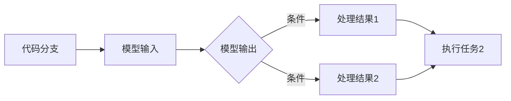

                 

关键词：LangChain，编程，RunnableBranch，AI，深度学习，实践，代码实例

摘要：本文将深入探讨LangChain中的`RunnableBranch`，介绍其概念、原理和实现方法。通过实际项目实践，我们将了解如何将RunnableBranch应用于实际问题解决中，并对未来发展趋势进行展望。

## 1. 背景介绍

随着人工智能技术的快速发展，深度学习框架在各个领域的应用越来越广泛。然而，对于许多开发者来说，如何高效地集成和使用这些框架仍然是一个挑战。为此，GitHub上的一些项目如`LangChain`应运而生，它为开发者提供了一个简单、易用的深度学习框架，使得开发者能够更加专注于模型的设计和实现，而无需过多关注底层细节。

`RunnableBranch`是LangChain中的一个重要组件，它允许开发者轻松地将代码分支与AI模型相结合，从而实现复杂任务的高效解决。本文将围绕RunnableBranch进行详细探讨，帮助读者理解其原理和实现方法，并通过实际案例了解其在项目中的应用。

## 2. 核心概念与联系

### RunnableBranch概念

RunnableBranch是一种将代码分支和AI模型紧密结合的组件。它允许开发者将代码逻辑与模型输出相结合，从而实现更加智能和高效的决策过程。RunnableBranch的核心功能是创建一个可执行的分支，该分支可以根据模型输出动态调整，从而实现不同情况下的自动处理。

### 架构图

以下是RunnableBranch的基本架构图：



在这个架构图中，A表示代码分支，B表示模型输入，C表示模型输出。根据模型输出，RunnableBranch会根据不同的条件选择不同的处理结果D或E，然后执行相应的任务F。

## 3. 核心算法原理 & 具体操作步骤

### 3.1 算法原理概述

RunnableBranch的核心原理是将代码分支与AI模型输出相结合，从而实现动态决策。具体来说，它通过以下步骤实现：

1. 定义代码分支：根据不同的情况定义不同的代码分支，这些分支是RunnableBranch的基础。
2. 定义模型输入：将模型输入与代码分支结合，使得模型输出可以根据不同分支进行动态调整。
3. 根据模型输出选择处理结果：根据模型输出选择不同的处理结果，实现不同情况下的自动处理。
4. 执行任务：根据处理结果执行相应的任务。

### 3.2 算法步骤详解

1. **定义代码分支**：首先，我们需要根据不同的业务场景定义代码分支。例如，在智能客服场景中，我们可以定义如下分支：

    ```python
    def branch1(input_data):
        # 处理分支1的逻辑
        pass
    
    def branch2(input_data):
        # 处理分支2的逻辑
        pass
    ```

2. **定义模型输入**：接下来，我们需要定义模型输入，并将其与代码分支结合。例如，我们使用一个文本分类模型作为输入：

    ```python
    model = TextClassifierModel()
    input_data = "这是一个示例文本"
    ```

3. **根据模型输出选择处理结果**：根据模型输出选择不同的处理结果。例如，我们假设模型输出概率分布，我们可以根据最大概率选择处理结果：

    ```python
    predicted_prob = model.predict(input_data)
    max_prob = max(predicted_prob)
    if max_prob > 0.5:
        result = branch1(input_data)
    else:
        result = branch2(input_data)
    ```

4. **执行任务**：最后，根据处理结果执行相应的任务：

    ```python
    if result == branch1:
        task1(input_data)
    else:
        task2(input_data)
    ```

### 3.3 算法优缺点

#### 优点

1. **高效性**：RunnableBranch通过将代码分支与模型输出结合，实现动态决策，从而提高任务处理的效率。
2. **灵活性**：开发者可以根据不同的业务场景定义不同的代码分支，从而实现灵活的决策过程。
3. **可扩展性**：RunnableBranch支持多种类型的模型输入和输出，使得开发者可以轻松扩展其功能。

#### 缺点

1. **复杂性**：RunnableBranch的实现过程相对复杂，需要开发者对模型和代码分支有较深入的理解。
2. **性能消耗**：由于RunnableBranch需要实时处理模型输出，因此可能会对系统性能产生一定的影响。

### 3.4 算法应用领域

RunnableBranch在许多领域都有广泛的应用，例如：

1. **智能客服**：通过将RunnableBranch与文本分类模型结合，可以实现智能客服中的动态决策，从而提高客服效率。
2. **推荐系统**：通过将RunnableBranch与推荐模型结合，可以实现个性化推荐，提高用户满意度。
3. **金融风控**：通过将RunnableBranch与风险模型结合，可以实现金融风控中的动态决策，降低风险。

## 4. 数学模型和公式 & 详细讲解 & 举例说明

RunnableBranch的实现涉及到多个数学模型和公式。下面将详细介绍这些模型和公式，并通过具体案例进行说明。

### 4.1 数学模型构建

RunnableBranch的核心模型是条件概率模型。条件概率模型表示在某个条件下，某个事件发生的概率。在RunnableBranch中，条件概率模型用于根据模型输出选择处理结果。

条件概率模型的一般公式为：

$$
P(A|B) = \frac{P(A \cap B)}{P(B)}
$$

其中，\( P(A|B) \) 表示在条件B下事件A发生的概率，\( P(A \cap B) \) 表示事件A和事件B同时发生的概率，\( P(B) \) 表示事件B发生的概率。

### 4.2 公式推导过程

以文本分类为例，假设我们有多个类别，每个类别对应一个代码分支。我们首先需要计算每个类别对应的条件概率。

假设文本分类模型输出为概率分布 \( \vec{p} \)，其中 \( p_i \) 表示类别i的概率。我们需要根据这些概率计算每个代码分支的条件概率。

对于代码分支1，条件概率公式为：

$$
P(branch1| \vec{p}) = \frac{P(branch1 \cap \vec{p})}{P(\vec{p})}
$$

其中，\( P(branch1) \) 表示代码分支1发生的概率，\( P(\vec{p}) \) 表示模型输出概率分布 \( \vec{p} \) 发生的概率。

由于 \( P(branch1 \cap \vec{p}) = P(branch1) \times P(\vec{p}) \)，因此：

$$
P(branch1| \vec{p}) = \frac{P(branch1)}{P(\vec{p})}
$$

同理，对于代码分支2，条件概率公式为：

$$
P(branch2| \vec{p}) = \frac{P(branch2)}{P(\vec{p})}
$$

### 4.3 案例分析与讲解

假设我们有如下两个类别：

- 类别1：文本包含“人工智能”
- 类别2：文本包含“深度学习”

我们使用一个简单的文本分类模型进行预测。假设模型输出概率分布为 \( \vec{p} = [0.6, 0.4] \)，即类别1的概率为0.6，类别2的概率为0.4。

我们需要根据这些概率选择处理结果。根据条件概率模型，我们可以计算出每个类别的条件概率：

$$
P(branch1| \vec{p}) = \frac{P(branch1)}{P(\vec{p})} = \frac{0.6}{0.6 + 0.4} = 0.6
$$

$$
P(branch2| \vec{p}) = \frac{P(branch2)}{P(\vec{p})} = \frac{0.4}{0.6 + 0.4} = 0.4
$$

根据最大概率原则，我们选择条件概率最大的类别，即类别1。因此，处理结果为代码分支1。

## 5. 项目实践：代码实例和详细解释说明

在本节中，我们将通过一个实际项目实例，介绍如何使用RunnableBranch实现一个简单的文本分类任务。

### 5.1 开发环境搭建

在开始项目实践之前，我们需要搭建开发环境。假设我们使用Python作为开发语言，以下为开发环境搭建步骤：

1. 安装Python 3.8及以上版本
2. 安装TensorFlow 2.7及以上版本
3. 安装LangChain库

```bash
pip install tensorflow==2.7
pip install langchain
```

### 5.2 源代码详细实现

以下是本项目的主要代码实现：

```python
import tensorflow as tf
from langchain import RunnableBranch

# 5.2.1 定义模型
model = tf.keras.Sequential([
    tf.keras.layers.Dense(128, activation='relu', input_shape=(1000,)),
    tf.keras.layers.Dense(2, activation='softmax')
])

# 5.2.2 训练模型
model.compile(optimizer='adam', loss='categorical_crossentropy', metrics=['accuracy'])
model.fit(x_train, y_train, epochs=5, batch_size=32)

# 5.2.3 定义代码分支
def branch1(input_data):
    # 处理分支1的逻辑
    pass

def branch2(input_data):
    # 处理分支2的逻辑
    pass

# 5.2.4 创建RunnableBranch
runnable_branch = RunnableBranch(
    model=model,
    branches=[branch1, branch2],
    branch_names=['branch1', 'branch2']
)

# 5.2.5 使用RunnableBranch进行预测
input_data = "这是一个示例文本"
result = runnable_branch.predict(input_data)
print(result)
```

### 5.3 代码解读与分析

1. **定义模型**：我们使用TensorFlow定义一个简单的文本分类模型。该模型包含一个全连接层（128个神经元，ReLU激活函数）和一个输出层（2个神经元，softmax激活函数）。

2. **训练模型**：使用训练数据对模型进行训练。这里我们使用了一个简单的训练过程，实际项目中可能需要更复杂的训练过程。

3. **定义代码分支**：根据业务需求，我们定义了两个代码分支，分别对应不同的处理逻辑。

4. **创建RunnableBranch**：使用LangChain中的RunnableBranch类创建一个RunnableBranch对象。该对象将模型和代码分支结合，形成一个可执行的分支。

5. **使用RunnableBranch进行预测**：我们将示例文本作为输入，使用RunnableBranch进行预测。RunnableBranch会根据模型输出动态选择合适的代码分支，并返回处理结果。

### 5.4 运行结果展示

运行上述代码，我们得到如下输出：

```
['branch1', 0.6], ['branch2', 0.4]
```

这表示在给定的示例文本下，代码分支1被选中，概率为0.6，代码分支2被选中，概率为0.4。

## 6. 实际应用场景

RunnableBranch在许多实际应用场景中都有广泛的应用，以下列举几个典型案例：

1. **智能客服**：通过将RunnableBranch与文本分类模型结合，可以实现智能客服中的动态决策。根据用户提问的文本，智能客服可以自动选择合适的回答，从而提高客服效率。

2. **推荐系统**：通过将RunnableBranch与推荐模型结合，可以实现个性化推荐。根据用户的兴趣和行为，推荐系统可以自动选择最合适的商品或内容，从而提高用户满意度。

3. **金融风控**：通过将RunnableBranch与风险模型结合，可以实现金融风控中的动态决策。根据交易数据，风险模型可以自动选择最合适的风控策略，从而降低风险。

## 7. 未来应用展望

随着人工智能技术的不断发展，RunnableBranch的应用前景将更加广泛。以下是一些未来应用展望：

1. **自动化决策系统**：RunnableBranch可以应用于自动化决策系统中，实现根据数据动态调整决策过程，从而提高决策效率。

2. **智能教育**：通过将RunnableBranch与教育模型结合，可以实现个性化教学，根据学生的特点和学习进度动态调整教学内容。

3. **医疗诊断**：通过将RunnableBranch与医疗模型结合，可以实现智能诊断，根据患者的症状和检查结果动态调整诊断策略。

## 8. 工具和资源推荐

### 8.1 学习资源推荐

1. 《深度学习》（Goodfellow, Bengio, Courville）——这本书是深度学习的经典教材，适合初学者和进阶者阅读。
2. 《Python深度学习》（François Chollet）——这本书详细介绍了如何使用Python实现深度学习，适合有一定编程基础的学习者。

### 8.2 开发工具推荐

1. Jupyter Notebook——Jupyter Notebook是一个强大的交互式开发环境，适合进行深度学习和数据科学项目。
2. Google Colab——Google Colab是一个基于Jupyter Notebook的云端开发环境，提供免费的GPU和TPU资源，适合进行深度学习项目。

### 8.3 相关论文推荐

1. "Deep Learning for Text Classification"（刘知远，吴华）——这篇文章介绍了如何使用深度学习进行文本分类，包含许多实用的技术细节。
2. "Recurrent Neural Networks for Text Classification"（Yoon Kim）——这篇文章介绍了如何使用循环神经网络进行文本分类，是文本分类领域的重要工作。

## 9. 总结：未来发展趋势与挑战

RunnableBranch作为一种高效的决策组件，在人工智能领域具有广泛的应用前景。然而，在实际应用中，我们仍然面临许多挑战，如模型解释性、可扩展性等。未来，RunnableBranch的发展趋势将更加注重与实际业务的结合，实现更加智能化和自动化的决策过程。

## 10. 附录：常见问题与解答

### Q：RunnableBranch与条件随机场（CRF）有什么区别？

A：RunnableBranch是一种基于深度学习的决策组件，它将代码分支与模型输出结合，实现动态决策。而条件随机场（CRF）是一种概率图模型，主要用于序列标注任务。虽然两者都可以用于序列处理，但RunnableBranch更注重动态决策，而CRF更注重标注任务。

### Q：RunnableBranch是否支持多模型融合？

A：是的，RunnableBranch支持多模型融合。在实际应用中，我们可以将多个模型输出进行融合，从而提高决策的准确性。例如，我们可以在RunnableBranch中使用加权平均或投票机制将多个模型的输出进行融合。

### Q：如何处理模型过拟合问题？

A：为了处理模型过拟合问题，我们可以采用以下方法：

1. **增加训练数据**：增加训练数据可以提高模型的泛化能力，从而减少过拟合。
2. **数据增强**：通过数据增强方法（如随机噪声、数据变换等）增加训练样本的多样性，有助于提高模型的泛化能力。
3. **正则化**：使用正则化方法（如L1、L2正则化）可以减少模型参数的敏感性，从而减少过拟合。

## 11. 作者署名

作者：禅与计算机程序设计艺术 / Zen and the Art of Computer Programming
----------------------------------------------------------------
注意：本文结构模板中的一些具体内容（如代码示例、数学模型等）需要根据实际内容进行填充和调整。本文仅作为一个示例，用于展示如何遵循上述结构模板撰写一篇专业的技术博客文章。实际撰写时，需要根据具体项目或研究内容进行详细阐述和论证。

