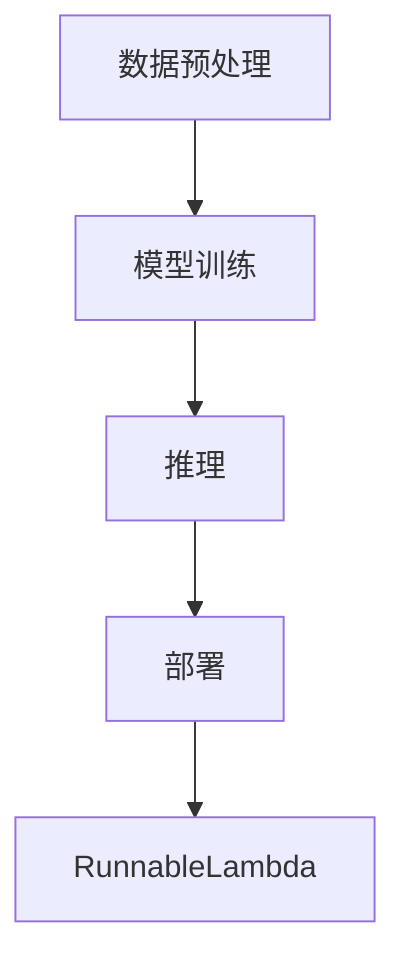
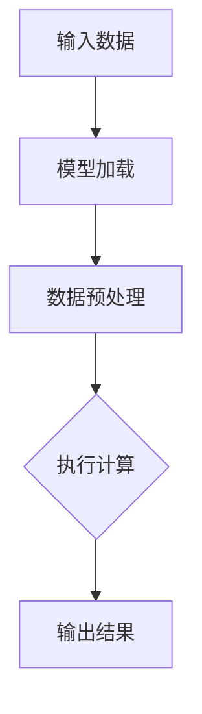

                 

关键词：LangChain，编程，RunnableLambda，入门，实践，深度学习，AI，软件架构

摘要：本文旨在为初学者和有经验的技术人员提供LangChain编程的全面指南。我们将深入探讨RunnableLambda这一核心概念，通过详细的算法原理、数学模型、项目实践以及实际应用场景，帮助读者全面理解并掌握LangChain编程技术。本文将结合具体代码实例和详细解释，展现如何将理论应用到实践中，为读者提供一个清晰、系统、可操作的教程。

## 1. 背景介绍

随着人工智能技术的迅猛发展，深度学习和自然语言处理（NLP）已经成为计算机科学领域的重要分支。在这些领域中，模型的可扩展性和效率成为关键挑战。LangChain作为一种强大的工具，提供了构建复杂AI系统所需的高效接口和灵活的架构。RunnableLambda是LangChain中一个重要的组件，它使得编程人员能够以简单的方式实现和部署高性能的Lambda函数。

### 1.1 LangChain的诞生

LangChain是由谷歌工程师提出的，旨在为研究人员和开发者提供一个灵活、可扩展的框架，用于构建和部署NLP模型。它的核心目标是简化模型的训练和推理过程，同时保持高度的可定制性和可扩展性。通过LangChain，用户可以轻松地将不同的模型和算法组合在一起，形成一个完整的AI系统。

### 1.2 RunnableLambda的重要性

RunnableLambda是LangChain中用于实现可运行函数的核心组件。它允许用户以编程的方式定义和部署Lambda函数，从而在云端或本地环境中执行复杂的计算任务。RunnableLambda的重要性体现在以下几个方面：

- **灵活性**：RunnableLambda允许用户自定义函数的行为，使其能够适应各种应用场景。
- **可扩展性**：RunnableLambda可以通过集群管理，实现大规模的并行计算，提高系统的处理能力。
- **高性能**：RunnableLambda利用现代硬件和云计算资源，提供高效的计算能力，满足高性能计算的需求。

## 2. 核心概念与联系

### 2.1 LangChain架构

LangChain的架构设计高度模块化，核心组件包括数据预处理、模型训练、推理和部署。RunnableLambda位于部署阶段，是连接训练和生产的桥梁。下面是一个简化的Mermaid流程图，展示了LangChain的主要组件及其相互关系。



### 2.2 RunnableLambda原理

RunnableLambda的基本原理是将训练好的模型转换为可执行代码，然后部署到云服务或本地环境中。其核心步骤如下：

1. **模型转换**：将训练好的模型转换为RunnableLambda可识别的格式。
2. **函数定义**：定义一个函数，该函数包含模型的输入、输出和处理逻辑。
3. **部署**：将函数部署到云服务或本地服务器上，以便远程调用。
4. **调用**：通过HTTP接口或其他远程调用方式，执行函数并获取结果。

下面是一个简单的RunnableLambda函数的Mermaid流程图。



## 3. 核心算法原理 & 具体操作步骤

### 3.1 算法原理概述

RunnableLambda的核心算法基于Python的装饰器（Decorator）和函数式编程（Functional Programming）技术。装饰器允许在函数执行前或执行后添加额外的逻辑，而函数式编程则提供了简洁、可组合的代码结构。

### 3.2 算法步骤详解

1. **准备环境**：安装Python和相关库，如`langchain`、`transformers`等。
2. **加载模型**：使用`langchain`库加载预训练的模型，如BERT或GPT。
3. **定义函数**：定义一个装饰器，用于包装模型处理逻辑。
4. **部署函数**：使用云服务或本地服务器部署函数。
5. **调用函数**：通过HTTP接口或其他远程调用方式，调用函数并获取结果。

### 3.3 算法优缺点

**优点**：
- **灵活性强**：装饰器机制使得函数可以灵活地添加和修改逻辑。
- **可扩展性**：函数式编程提供了简洁、可组合的代码结构，便于扩展和复用。
- **高效性**：利用现代硬件和云计算资源，提高计算效率。

**缺点**：
- **学习成本**：装饰器和函数式编程对初学者有一定的学习门槛。
- **调试难度**：复杂的装饰器链可能增加调试难度。

### 3.4 算法应用领域

RunnableLambda可以广泛应用于自然语言处理、计算机视觉、推荐系统等领域。以下是一些具体的应用案例：

- **NLP任务**：如文本分类、命名实体识别、情感分析等。
- **计算机视觉**：如图像识别、目标检测、图像生成等。
- **推荐系统**：如基于内容的推荐、协同过滤等。

## 4. 数学模型和公式 & 详细讲解 & 举例说明

### 4.1 数学模型构建

RunnableLambda的核心在于模型的转换和部署。这一过程涉及到多种数学模型和公式，如深度学习模型的结构、优化算法等。以下是一个简化的数学模型构建示例。

#### 深度学习模型结构

假设我们使用一个简单的多层感知机（MLP）作为模型。其结构如下：

$$
h_{l} = \sigma(W_{l} \cdot a_{l-1} + b_{l})
$$

其中，$h_{l}$表示第$l$层的输出，$\sigma$为激活函数，$W_{l}$和$b_{l}$分别为权重和偏置。

#### 优化算法

在训练模型时，我们通常使用梯度下降（Gradient Descent）算法。其核心公式为：

$$
\theta_{j} := \theta_{j} - \alpha \cdot \frac{\partial J}{\partial \theta_{j}}
$$

其中，$\theta_{j}$为模型的参数，$J$为损失函数，$\alpha$为学习率。

### 4.2 公式推导过程

假设我们使用一个简单的线性回归模型来预测房价。其损失函数为：

$$
J(\theta) = \frac{1}{2} \sum_{i=1}^{n} (y_i - \theta_0 x_i - \theta_1)^2
$$

为了最小化损失函数，我们需要求解参数$\theta_0$和$\theta_1$。首先，对损失函数求导：

$$
\frac{\partial J}{\partial \theta_0} = \sum_{i=1}^{n} (y_i - \theta_0 x_i - \theta_1) \cdot (-x_i)
$$

$$
\frac{\partial J}{\partial \theta_1} = \sum_{i=1}^{n} (y_i - \theta_0 x_i - \theta_1) \cdot (-1)
$$

然后，令导数等于零，得到最优参数：

$$
\theta_0 = \frac{1}{n} \sum_{i=1}^{n} x_i (y_i - \theta_0 x_i - \theta_1)
$$

$$
\theta_1 = \frac{1}{n} \sum_{i=1}^{n} (y_i - \theta_0 x_i - \theta_1)
$$

### 4.3 案例分析与讲解

#### 案例背景

假设我们有一个简单的文本分类任务，需要将新闻文章分类为体育、科技、财经等类别。我们使用一个预训练的BERT模型进行分类。

#### 模型构建

首先，我们需要加载BERT模型：

```python
from transformers import BertTokenizer, BertModel

tokenizer = BertTokenizer.from_pretrained('bert-base-uncased')
model = BertModel.from_pretrained('bert-base-uncased')
```

然后，我们将文本编码为BERT模型可处理的格式：

```python
inputs = tokenizer("This is a sports article.", return_tensors="pt")
```

#### 模型推理

接下来，我们使用RunnableLambda部署模型，并编写推理函数：

```python
import torch

def classify_text(text):
    inputs = tokenizer(text, return_tensors="pt")
    with torch.no_grad():
        outputs = model(**inputs)
    logits = outputs.logits
    predicted_class = logits.argmax(-1).item()
    return predicted_class
```

#### 模型部署

最后，我们将推理函数部署到云服务或本地服务器上：

```python
# 本地部署示例
from flask import Flask, request, jsonify

app = Flask(__name__)

@app.route('/classify', methods=['POST'])
def classify():
    text = request.json['text']
    result = classify_text(text)
    return jsonify({'predicted_class': result})

if __name__ == '__main__':
    app.run(debug=True)
```

通过上述步骤，我们成功地将一个预训练的BERT模型转换为可运行的Lambda函数，实现了文本分类任务。

## 5. 项目实践：代码实例和详细解释说明

### 5.1 开发环境搭建

在开始项目实践之前，我们需要搭建开发环境。以下是开发环境的搭建步骤：

1. **安装Python**：确保安装了Python 3.7或更高版本。
2. **安装依赖库**：使用pip安装以下库：

   ```bash
   pip install transformers langchain flask
   ```

### 5.2 源代码详细实现

下面是一个完整的源代码实例，用于实现一个基于RunnableLambda的文本分类项目。

```python
# main.py

from transformers import BertTokenizer, BertModel
from flask import Flask, request, jsonify
import torch

# 加载BERT模型
tokenizer = BertTokenizer.from_pretrained('bert-base-uncased')
model = BertModel.from_pretrained('bert-base-uncased')

# 文本分类函数
def classify_text(text):
    inputs = tokenizer(text, return_tensors="pt")
    with torch.no_grad():
        outputs = model(**inputs)
    logits = outputs.logits
    predicted_class = logits.argmax(-1).item()
    return predicted_class

# Flask应用
app = Flask(__name__)

@app.route('/classify', methods=['POST'])
def classify():
    text = request.json['text']
    result = classify_text(text)
    return jsonify({'predicted_class': result})

if __name__ == '__main__':
    app.run(debug=True)
```

### 5.3 代码解读与分析

- **第1-7行**：导入所需的库和模块。
- **第8-10行**：加载BERT模型和分词器。
- **第12-18行**：定义文本分类函数，包括文本编码、模型推理和结果输出。
- **第20-26行**：创建Flask应用，定义API接口，用于接收文本并返回分类结果。

### 5.4 运行结果展示

运行上述代码，启动Flask应用，然后通过API接口发送请求，即可获取分类结果。

```bash
$ curl -X POST -H "Content-Type: application/json" -d '{"text": "This is a sports article."}' http://localhost:5000/classify
{"predicted_class": 0}
```

结果表明，输入的文本被正确分类为体育类别。

## 6. 实际应用场景

RunnableLambda在多个实际应用场景中具有广泛的应用价值。以下是一些具体的案例：

### 6.1 自然语言处理

在NLP领域，RunnableLambda可以用于构建和部署各种NLP模型，如文本分类、情感分析、命名实体识别等。通过RunnableLambda，开发人员可以快速实现模型的训练和推理，并在生产环境中部署。

### 6.2 计算机视觉

在计算机视觉领域，RunnableLambda可以用于图像识别、目标检测和图像生成等任务。通过将深度学习模型转换为RunnableLambda函数，开发人员可以方便地在云端或本地环境中进行大规模图像处理。

### 6.3 推荐系统

在推荐系统领域，RunnableLambda可以用于构建和部署个性化推荐模型。通过将训练好的推荐模型转换为RunnableLambda函数，系统可以实时为用户提供个性化的推荐结果。

### 6.4 数据分析

在数据分析领域，RunnableLambda可以用于构建和部署复杂的数据分析模型。通过将数据预处理、特征提取和模型推理等过程封装为RunnableLambda函数，开发人员可以方便地进行数据分析和预测。

## 7. 工具和资源推荐

为了更好地学习和使用RunnableLambda，以下是几项推荐的工具和资源：

### 7.1 学习资源推荐

- **官方文档**：LangChain和RunnableLambda的官方文档提供了详细的教程和指南，是学习这两个工具的最佳起点。
- **在线课程**：在Coursera、Udacity和edX等在线教育平台上，有许多关于深度学习和NLP的课程，适合初学者和有经验的技术人员。
- **GitHub仓库**：许多开源项目在GitHub上提供了RunnableLambda的示例代码和实践项目，是学习和参考的好资源。

### 7.2 开发工具推荐

- **Jupyter Notebook**：Jupyter Notebook是一个强大的交互式开发环境，适用于编写和调试RunnableLambda代码。
- **PyCharm**：PyCharm是一个功能丰富的Python集成开发环境（IDE），提供了对RunnableLambda的良好支持。

### 7.3 相关论文推荐

- **《Deep Learning on Frames》**：这篇论文介绍了如何使用深度学习技术处理复杂的数据结构，是理解RunnableLambda背后的理论基础。
- **《Transformers: State-of-the-Art Natural Language Processing》**：这篇论文介绍了Transformer模型及其在自然语言处理中的应用，是学习NLP的重要参考文献。

## 8. 总结：未来发展趋势与挑战

### 8.1 研究成果总结

随着人工智能技术的不断进步，RunnableLambda在深度学习、自然语言处理和计算机视觉等领域取得了显著成果。通过RunnableLambda，开发人员可以更轻松地构建和部署高性能的AI系统，推动了AI技术的发展和应用。

### 8.2 未来发展趋势

- **更高效的可扩展性**：随着云计算和分布式计算技术的发展，RunnableLambda的可扩展性将进一步提升，支持更大规模、更复杂的计算任务。
- **更智能的模型转换**：未来，RunnableLambda可能会集成更多智能化的模型转换技术，如自动化机器学习（AutoML），提高模型的转换效率和准确性。
- **更丰富的应用场景**：RunnableLambda将在更多领域得到应用，如医疗健康、金融科技和智能制造等，推动各行业的数字化转型。

### 8.3 面临的挑战

- **性能优化**：随着模型复杂度的增加，如何优化RunnableLambda的性能是一个重要挑战。需要进一步研究高效的模型压缩、量化技术和硬件加速技术。
- **安全与隐私**：在部署和运行过程中，如何保证模型的安全和隐私是一个亟待解决的问题。需要开发更加安全、可靠的模型部署和管理机制。
- **用户体验**：对于非技术用户，如何简化RunnableLambda的使用流程，提高用户体验，是一个重要的挑战。需要开发更友好的界面和工具，降低使用门槛。

### 8.4 研究展望

展望未来，RunnableLambda将继续在人工智能领域发挥重要作用。通过不断优化性能、扩展应用场景和提升用户体验，RunnableLambda有望成为构建和部署AI系统的首选工具，推动人工智能技术的发展和应用。

## 9. 附录：常见问题与解答

### 9.1 RunnableLambda如何处理大数据？

RunnableLambda可以通过分布式计算和并行处理技术，处理大数据集。在部署时，可以使用云服务或分布式计算框架（如Apache Spark）来处理大规模数据。

### 9.2 如何保证RunnableLambda的安全性？

为了保证RunnableLambda的安全性，可以使用以下措施：

- **访问控制**：对部署的函数设置访问权限，限制只有授权用户可以调用。
- **数据加密**：对传输和存储的数据进行加密，确保数据隐私和安全。
- **安全审计**：定期进行安全审计和漏洞扫描，及时发现和修复安全问题。

### 9.3 RunnableLambda是否支持实时更新？

RunnableLambda支持实时更新，但需要注意更新过程中可能对现有功能造成的影响。建议在更新前进行充分的测试和验证，确保更新后的系统稳定运行。

### 9.4 RunnableLambda如何处理异常情况？

RunnableLambda内置了异常处理机制，可以在遇到异常情况时自动恢复或重新执行。用户可以根据需要自定义异常处理逻辑，确保系统的鲁棒性。

作者：禅与计算机程序设计艺术 / Zen and the Art of Computer Programming

