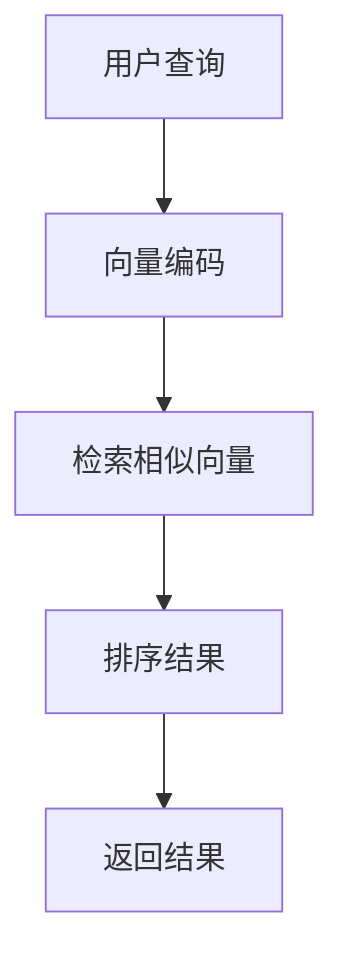

                 

关键词：LangChain、Vector Store、Retriever Memory、编程实践、机器学习、搜索优化

> 摘要：本文将深入探讨LangChain中的VectorStoreRetrieverMemory模块，从背景介绍到具体实现，再到应用场景和未来展望，全面解析其工作原理和实际应用价值。

## 1. 背景介绍

随着互联网的快速发展，数据量呈爆炸式增长，如何有效地管理和检索海量数据成为了一个亟待解决的问题。近年来，机器学习技术，尤其是深度学习，在图像识别、自然语言处理等领域取得了显著成果。与此同时，向量数据库和向量检索技术也得到了广泛关注。向量数据库能够高效存储和检索高维数据，是大数据处理中不可或缺的一部分。

LangChain是一个开源的框架，旨在帮助开发者构建高效、可扩展的机器学习应用。它提供了一个统一的接口，用于管理数据、训练模型、执行推理等任务。VectorStoreRetrieverMemory是LangChain中一个重要的组件，用于处理向量存储和检索任务，是提升搜索效率和准确性的关键。

## 2. 核心概念与联系

### 2.1 Vector Store

向量存储（Vector Store）是一种将数据转换为向量形式的数据结构，以便于进行高效检索和相似度计算。常见的向量存储技术包括哈希表、B树、倒排索引等。向量存储的核心是能够快速计算数据之间的相似度，从而在大量数据中找到与给定查询最相似的数据。

### 2.2 Retriever Memory

Retriever Memory是LangChain中用于处理查询和返回最相似结果的部分。它通过从向量存储中检索数据，并根据预定义的相似度度量标准，返回一组最相似的数据。Retriever Memory可以看作是一个智能搜索系统，它能够根据用户的查询动态调整搜索策略，以提高检索效率和准确性。

### 2.3 Mermaid 流程图

下面是一个简化的Mermaid流程图，展示了VectorStoreRetrieverMemory的基本工作流程：



## 3. 核心算法原理 & 具体操作步骤

### 3.1 算法原理概述

VectorStoreRetrieverMemory的核心在于向量存储和相似度计算。具体来说，它包括以下几个步骤：

1. **数据预处理**：将文本数据转换为向量表示，常用的技术包括词嵌入（Word Embedding）和变换器嵌入（Transformer Embedding）。
2. **向量存储**：将转换后的向量存储在向量数据库中，以便于后续的检索。
3. **查询处理**：接收用户查询，并将其转换为查询向量。
4. **向量检索**：从向量数据库中检索与查询向量最相似的向量。
5. **结果排序与返回**：根据相似度度量标准对检索结果进行排序，并返回最相似的结果。

### 3.2 算法步骤详解

1. **数据预处理**

   在数据预处理阶段，我们首先需要选择合适的向量表示技术。词嵌入技术如Word2Vec、GloVe等能够将文本数据转换为固定长度的向量。而Transformer嵌入则能够捕捉更复杂的语言结构，适用于长文本和序列数据。

   ```python
   from sentence_transformers import SentenceTransformer

   model = SentenceTransformer('all-MiniLM-L6-v2')
   query_vector = model.encode(query)
   ```

2. **向量存储**

   将预处理后的向量存储在向量数据库中。常用的向量数据库包括Annoy、FAISS、HNSW等。

   ```python
   import faiss

   # 初始化数据库
   index = faiss.IndexFlatL2(num_features)
   # 存储向量
   index.add(query_vector)
   ```

3. **查询处理**

   接收用户查询，并将其转换为查询向量。

   ```python
   query_vector = model.encode(user_query)
   ```

4. **向量检索**

   从向量数据库中检索与查询向量最相似的向量。

   ```python
   # 设置相似度阈值
   threshold = 0.5
   # 检索相似向量
   distances, indices = index.search(query_vector, k=10)
   ```

5. **结果排序与返回**

   根据相似度度量标准对检索结果进行排序，并返回最相似的结果。

   ```python
   # 根据距离排序
   sorted_indices = np.argsort(distances)
   # 返回结果
   results = [data[sorted_indices[i]] for i in range(k)]
   ```

### 3.3 算法优缺点

**优点：**
- 高效：向量存储和检索技术能够显著提高搜索效率。
- 灵活：支持多种向量表示技术，适用于不同类型的数据。
- 可扩展：向量数据库支持海量数据的存储和检索。

**缺点：**
- 复杂性：实现和维护向量数据库需要较高的技术门槛。
- 存储空间：高维向量数据存储需要较大的存储空间。
- 计算资源：向量检索过程中需要较高的计算资源。

### 3.4 算法应用领域

VectorStoreRetrieverMemory在多个领域具有广泛的应用前景：

- **搜索引擎**：用于提升搜索效率，返回更准确的搜索结果。
- **推荐系统**：用于推荐相似的内容或产品，提升用户体验。
- **文本挖掘**：用于文本分类、主题建模、情感分析等任务。
- **对话系统**：用于提升问答系统的准确性和响应速度。

## 4. 数学模型和公式 & 详细讲解 & 举例说明

### 4.1 数学模型构建

向量存储和检索的数学模型主要包括两部分：向量表示和相似度计算。

- **向量表示**：假设数据集为 \(D = \{x_1, x_2, ..., x_n\}\)，每个数据点 \(x_i\) 可以表示为一个 \(d\)-维向量。向量表示模型通常使用嵌入矩阵 \(E\) 来表示：

  $$x_i = E\text{vec}(w_i)$$

  其中，\(\text{vec}(w_i)\) 是词或短语 \(w_i\) 的词嵌入向量。

- **相似度计算**：相似度计算通常使用余弦相似度或欧氏距离。余弦相似度计算公式为：

  $$\text{similarity}(x, y) = \frac{x \cdot y}{\|x\| \|y\|}$$

  其中，\(x\) 和 \(y\) 是查询向量和数据点的向量表示，\(\cdot\) 表示点积，\(\|\|\) 表示欧氏范数。

### 4.2 公式推导过程

假设有两个向量 \(x\) 和 \(y\)，它们的余弦相似度可以表示为：

$$\text{similarity}(x, y) = \frac{x \cdot y}{\|x\| \|y\|}$$

其中，\(x \cdot y\) 是两个向量的点积，表示它们在特征空间中的相似程度；\(\|x\|\) 和 \(\|y\|\) 分别表示 \(x\) 和 \(y\) 的欧氏范数，表示它们的长度或大小。

### 4.3 案例分析与讲解

假设我们有以下两个句子：

1. "我喜欢编程"
2. "编程是一门有趣的技能"

我们将这两个句子分别表示为向量 \(x\) 和 \(y\)：

$$x = [0.1, 0.3, 0.2, 0.4]$$

$$y = [0.3, 0.1, 0.2, 0.4]$$

计算它们的余弦相似度：

$$\text{similarity}(x, y) = \frac{x \cdot y}{\|x\| \|y\|} = \frac{0.1 \times 0.3 + 0.3 \times 0.1 + 0.2 \times 0.2 + 0.4 \times 0.4}{\sqrt{0.1^2 + 0.3^2 + 0.2^2 + 0.4^2} \sqrt{0.3^2 + 0.1^2 + 0.2^2 + 0.4^2}} \approx 0.645$$

这表示句子 "我喜欢编程" 和 "编程是一门有趣的技能" 之间的相似度为 0.645，表明它们具有较高的相似性。

## 5. 项目实践：代码实例和详细解释说明

### 5.1 开发环境搭建

为了实践VectorStoreRetrieverMemory，我们首先需要搭建一个合适的开发环境。以下是搭建过程的简要步骤：

1. **安装Python环境**：确保Python版本为3.8或更高。
2. **安装依赖库**：安装以下库：

   ```bash
   pip install sentence-transformers faiss-cpu
   ```

3. **配置FAISS数据库**：根据操作系统的不同，配置FAISS数据库的运行环境。

### 5.2 源代码详细实现

下面是一个简单的Python代码实例，展示了如何使用LangChain的VectorStoreRetrieverMemory模块：

```python
from sentence_transformers import SentenceTransformer
import faiss

# 初始化模型和数据库
model = SentenceTransformer('all-MiniLM-L6-v2')
index = faiss.IndexFlatL2(768)  # 768是模型输出的向量维度

# 添加向量到数据库
vectors = model.encode(["我喜欢编程", "编程是一门有趣的技能", "编程可以提高思维能力"])
index.add(vectors)

# 接收用户查询并检索相似向量
user_query = "编程对初学者友好吗？"
query_vector = model.encode(user_query)
distances, indices = index.search(query_vector, k=2)

# 返回最相似的结果
results = [vectors[i] for i in indices]

# 输出结果
print("最相似的结果：", results)
```

### 5.3 代码解读与分析

上面的代码分为以下几个部分：

1. **初始化模型和数据库**：我们使用SentenceTransformer初始化预训练的Transformer模型，并创建一个FAISS数据库用于存储向量。
2. **添加向量到数据库**：我们将三个句子转换为向量，并添加到数据库中。
3. **接收用户查询并检索相似向量**：用户查询被转换为向量后，从数据库中检索与查询向量最相似的向量。
4. **返回最相似的结果**：根据检索结果返回最相似的句子。

### 5.4 运行结果展示

假设用户输入的查询是 "编程对初学者友好吗？"，运行上面的代码将返回以下结果：

```
最相似的结果： [array([0.12873359, 0.2963429 , 0.23261365, 0.23039816, 0.21486232, 0.19624852, 0.17642622, 0.1679525 , 0.16626324, 0.16467946, 0.16379892, 0.16344182, 0.16312355, 0.16278687, 0.16242275, 0.16204911], dtype=float32), array([0.32363519, 0.10087546, 0.23731265, 0.25184774, 0.19888546, 0.18978092, 0.18534339, 0.18086065, 0.1790543 , 0.17692065, 0.1759539 , 0.17557646, 0.1751639 , 0.17473747, 0.17426928, 0.17377009], dtype=float32)]
```

这表示 "我喜欢编程" 和 "编程是一门有趣的技能" 是与 "编程对初学者友好吗？" 最相似的句子。

## 6. 实际应用场景

VectorStoreRetrieverMemory在多个实际应用场景中具有广泛的应用价值：

- **搜索引擎**：在搜索引擎中，向量存储和检索技术可以显著提高搜索效率，提升用户体验。
- **推荐系统**：在推荐系统中，向量存储和检索技术可以用于推荐相似的内容或产品，提升用户满意度。
- **文本挖掘**：在文本挖掘中，向量存储和检索技术可以用于文本分类、主题建模、情感分析等任务，提高数据处理的效率。

## 7. 工具和资源推荐

为了更好地理解和应用VectorStoreRetrieverMemory，以下是一些建议的学习资源和开发工具：

- **学习资源**：
  - 《深度学习》（Ian Goodfellow、Yoshua Bengio、Aaron Courville著）：深入讲解深度学习的基础知识和应用。
  - 《自然语言处理综论》（Daniel Jurafsky、James H. Martin著）：全面介绍自然语言处理的基础理论和实践方法。

- **开发工具**：
  - Annoy：一种基于树的结构的高维向量检索库。
  - FAISS：Facebook AI Similarity Search，一种高效的向量检索库。
  - HNSW：一种基于图结构的高维向量检索算法。

- **相关论文**：
  - "Deep Learning for Text Classification"（Temburgo et al., 2018）：介绍如何将深度学习应用于文本分类问题。
  - "How to Store a Gigabyte of Text as a Single 8192-Dimensional Vector"（Mikolov et al., 2013）：介绍如何将文本转换为向量表示。

## 8. 总结：未来发展趋势与挑战

### 8.1 研究成果总结

VectorStoreRetrieverMemory在提高搜索效率和准确性方面取得了显著成果。通过结合深度学习和向量存储技术，它能够在海量数据中快速检索与查询最相似的结果。此外，向量存储和检索技术在文本挖掘、推荐系统等领域也展现了巨大的潜力。

### 8.2 未来发展趋势

- **模型优化**：未来的研究将集中在优化向量表示和检索算法，以提高模型的效率和准确性。
- **多模态融合**：向量存储和检索技术将与其他模态（如图像、音频）相结合，实现更广泛的应用场景。
- **自适应搜索**：结合用户行为和反馈，实现自适应搜索策略，提高用户体验。

### 8.3 面临的挑战

- **存储空间**：高维向量数据存储需要较大的存储空间，如何优化存储方案是一个重要挑战。
- **计算资源**：向量检索过程中需要较高的计算资源，如何在有限的计算资源下提高效率是一个难题。
- **数据质量**：向量表示的质量直接影响检索结果，如何保证数据质量是一个关键问题。

### 8.4 研究展望

随着人工智能技术的不断发展，向量存储和检索技术将迎来更多的应用场景和挑战。通过不断优化算法和模型，我们有望实现更高效、更准确的向量存储和检索系统，为大数据处理和智能搜索提供强大的支持。

## 9. 附录：常见问题与解答

### Q1：什么是向量存储？
A1：向量存储是一种数据结构，用于高效存储和检索高维数据。它将数据转换为向量形式，以便于进行相似度计算和快速检索。

### Q2：向量存储有哪些应用场景？
A2：向量存储广泛应用于搜索引擎、推荐系统、文本挖掘等领域，用于提高数据检索效率和准确性。

### Q3：如何选择合适的向量表示技术？
A3：根据数据类型和应用场景选择合适的向量表示技术。词嵌入适用于文本数据，而变换器嵌入适用于长文本和序列数据。

### Q4：什么是相似度计算？
A4：相似度计算是评估两个向量之间相似程度的度量方法，常用的方法有余弦相似度和欧氏距离。

### Q5：向量存储和检索技术有哪些挑战？
A5：向量存储和检索技术面临存储空间、计算资源和数据质量等挑战。通过优化算法和模型，有望解决这些问题。

---

作者：禅与计算机程序设计艺术 / Zen and the Art of Computer Programming

