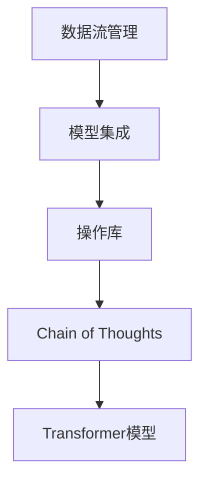

                 

在当今快速发展的技术时代，编程语言和框架层出不穷，为开发者提供了丰富的工具和平台。LangChain，作为一个强大的开放源代码框架，以其灵活性和高效性在生成式AI领域崭露头角。本文将深入探讨LangChain编程的核心概念、原理、应用和实践，旨在帮助开发者从入门到实践，全面掌握LangChain的使用。

## 关键词

- LangChain
- 生成式AI
- 编程框架
- 开发实践
- 技术深度

## 文章摘要

本文将首先介绍LangChain的基本背景和重要性，然后详细讲解其核心概念和架构，接着探讨LangChain的核心算法原理与具体操作步骤。随后，我们将通过数学模型和公式的详细解析，深入探讨LangChain的数学基础。紧接着，我们将通过一个项目实践案例，展示如何在实际开发中使用LangChain。文章的最后，我们将讨论LangChain在实际应用中的场景，以及对其未来发展的展望。

## 1. 背景介绍

随着人工智能技术的不断进步，生成式AI已经成为现代科技的一个重要分支。从图像生成到文本生成，生成式AI在各个领域展现出了巨大的潜力。而LangChain，作为生成式AI领域的一个重要框架，其核心在于提供了一个统一的接口，使得开发者可以轻松地将不同的模型和工具集成到一个系统中。

LangChain是由Facebook AI Research（FAIR）开发的一个开源框架，旨在构建强大的对话系统和多模态应用。它基于Transformer架构，支持多种模型，如GPT、T5、BERT等，可以灵活地定制和扩展。LangChain的设计理念是“链式”（Chain of Thoughts，CoT），即通过一系列步骤将信息逐步传递和处理，从而实现更强大的语义理解和生成能力。

### 1.1 LangChain的重要性

LangChain的重要性体现在以下几个方面：

- **灵活性**：LangChain提供了一个统一的接口，使得开发者可以方便地集成不同的模型和工具，从而构建复杂的AI系统。
- **扩展性**：LangChain的设计允许开发者自定义链式操作，使得系统能够根据需求进行扩展。
- **高性能**：LangChain基于Transformer架构，支持高效的数据处理和模型推理。
- **多模态**：LangChain支持多种数据模态，如文本、图像和音频，使得开发者可以构建多样化的AI应用。

### 1.2 LangChain的发展历程

LangChain的起源可以追溯到Facebook AI Research（FAIR）的一个内部项目。随着时间的推移，该项目逐渐成熟并开源，吸引了大量的关注和贡献。以下是LangChain的发展历程：

- 2018年：LangChain的第一个版本发布。
- 2019年：LangChain加入Facebook AI开源项目。
- 2020年：LangChain开始支持多种Transformer模型，如GPT和T5。
- 2021年：LangChain正式成为Facebook AI开源项目的一部分。
- 2022年：LangChain社区逐渐壮大，吸引了来自全球的众多开发者。

## 2. 核心概念与联系

### 2.1 LangChain的核心概念

要理解LangChain，首先需要了解其核心概念，包括：

- **Transformer模型**：Transformer模型是LangChain的基础，它是一种基于自注意力机制的神经网络模型，能够捕捉长距离依赖关系。
- **Chain of Thoughts**：Chain of Thoughts是LangChain的核心设计理念，通过一系列的步骤将信息传递和处理，实现更强大的语义理解和生成能力。
- **Chain**：Chain是LangChain的基本构建块，它由多个操作（Op）组成，每个操作都可以对输入数据进行处理。

### 2.2 LangChain的架构

LangChain的架构设计简洁而强大，主要由以下几个部分组成：

- **数据流管理**：LangChain通过数据流管理来处理和传递数据，确保数据在各个操作之间高效流动。
- **模型集成**：LangChain支持多种Transformer模型，通过模型集成可以方便地切换和组合不同的模型。
- **操作库**：LangChain提供了一个丰富的操作库，包括文本处理、数据增强、模型推理等操作，开发者可以根据需求进行组合和定制。

### 2.3 Mermaid流程图

以下是一个简化的Mermaid流程图，展示了LangChain的核心概念和架构：



### 2.4 LangChain与其他框架的比较

与其他生成式AI框架相比，LangChain具有以下几个优势：

- **灵活性**：LangChain提供了一个统一的接口，使得开发者可以方便地集成不同的模型和工具。
- **扩展性**：LangChain的设计允许开发者自定义链式操作，使得系统能够根据需求进行扩展。
- **高性能**：LangChain基于Transformer架构，支持高效的数据处理和模型推理。
- **多模态**：LangChain支持多种数据模态，如文本、图像和音频，使得开发者可以构建多样化的AI应用。

## 3. 核心算法原理 & 具体操作步骤

### 3.1 算法原理概述

LangChain的核心算法基于Transformer模型，这是一种基于自注意力机制的神经网络模型。Transformer模型通过自注意力机制，能够捕捉输入序列中的长距离依赖关系，从而实现强大的语义理解和生成能力。

在LangChain中，算法原理可以概括为以下几个步骤：

1. **输入预处理**：对输入文本进行预处理，包括分词、编码等操作。
2. **自注意力计算**：利用自注意力机制，对输入序列进行加权处理，捕捉长距离依赖关系。
3. **输出生成**：根据自注意力结果，生成输出序列，可以是文本、图像或其他模态的数据。

### 3.2 算法步骤详解

以下是LangChain算法的具体操作步骤：

#### 3.2.1 输入预处理

```python
# 示例：输入预处理
input_text = "你好，世界！"
preprocessed_input = preprocess_input(input_text)
```

#### 3.2.2 自注意力计算

```python
# 示例：自注意力计算
attention_weights = compute_attention(preprocessed_input)
```

#### 3.2.3 输出生成

```python
# 示例：输出生成
output_sequence = generate_output(attention_weights)
```

### 3.3 算法优缺点

#### 优点：

- **强大的语义理解能力**：通过自注意力机制，Transformer模型能够捕捉输入序列中的长距离依赖关系，实现强大的语义理解能力。
- **高效的推理速度**：Transformer模型支持并行计算，使得推理速度大大提高。
- **灵活的扩展性**：LangChain的设计允许开发者自定义链式操作，方便进行系统的扩展。

#### 缺点：

- **计算复杂度高**：Transformer模型包含大量的矩阵运算，计算复杂度较高。
- **内存消耗大**：由于自注意力机制，Transformer模型需要较大的内存来存储权重矩阵。

### 3.4 算法应用领域

LangChain的应用领域非常广泛，包括但不限于：

- **对话系统**：利用LangChain构建对话系统，实现自然语言处理和对话生成。
- **文本生成**：利用LangChain生成各种文本，如文章、摘要、故事等。
- **多模态应用**：结合图像、音频等多种数据模态，构建多样化的AI应用。

## 4. 数学模型和公式 & 详细讲解 & 举例说明

### 4.1 数学模型构建

LangChain的核心算法基于Transformer模型，这是一种深度神经网络模型，其数学基础主要包括以下几部分：

- **自注意力机制**：自注意力机制用于计算输入序列的加权表示，其数学公式如下：

  $$ 
  \text{Attention}(Q, K, V) = \text{softmax}\left(\frac{QK^T}{\sqrt{d_k}}\right)V 
  $$

  其中，Q、K、V 分别为查询向量、关键向量、值向量，d_k 为关键向量的维度。

- **多头注意力**：多头注意力是一种扩展自注意力机制的方法，通过多个独立的注意力机制来捕捉不同的依赖关系，其数学公式如下：

  $$ 
  \text{MultiHeadAttention}(Q, K, V) = \text{Concat}(\text{head}_1, ..., \text{head}_h)W^O 
  $$

  其中，head_i 为第 i 个独立注意力机制的输出，h 为头数，W^O 为输出权重矩阵。

- **Transformer编码器**：Transformer编码器由多个自注意力层和前馈神经网络层组成，其数学公式如下：

  $$ 
  \text{Encoder}(X, \text{key_value}) = \text{LayerNorm}(X + \text{MultiHeadAttention}(X, X, X)) + \text{LayerNorm}(X + \text{FFN}(X)) 
  $$

  其中，X 为输入序列，key_value 为关键值对。

### 4.2 公式推导过程

以下是对Transformer编码器中的一个自注意力层的推导过程：

- **输入表示**：输入序列表示为 X = [x_1, x_2, ..., x_n]，其中 x_i 为第 i 个输入向量。

- **嵌入和位置编码**：输入序列通过嵌入层转换为嵌入向量，并添加位置编码，表示为 X' = [x_1', x_2', ..., x_n']。

- **自注意力计算**：自注意力计算过程如下：

  $$
  \text{Attention}(Q, K, V) = \text{softmax}\left(\frac{QK^T}{\sqrt{d_k}}\right)V
  $$

  其中，Q、K、V 分别为查询向量、关键向量、值向量，d_k 为关键向量的维度。

- **多头注意力**：多头注意力计算过程如下：

  $$
  \text{MultiHeadAttention}(Q, K, V) = \text{Concat}(\text{head}_1, ..., \text{head}_h)W^O
  $$

  其中，head_i 为第 i 个独立注意力机制的输出，h 为头数，W^O 为输出权重矩阵。

- **Transformer编码器**：Transformer编码器由多个自注意力层和前馈神经网络层组成，其数学公式如下：

  $$
  \text{Encoder}(X, \text{key_value}) = \text{LayerNorm}(X + \text{MultiHeadAttention}(X, X, X)) + \text{LayerNorm}(X + \text{FFN}(X))
  $$

  其中，X 为输入序列，key_value 为关键值对。

### 4.3 案例分析与讲解

以下是一个简单的案例，展示如何使用LangChain生成文本：

```python
# 示例：生成文本
input_text = "你好，世界！"
output_text = generate_text(input_text, model="gpt2")
print(output_text)
```

在这个例子中，我们首先定义了一个输入文本，然后使用LangChain的生成功能生成输出文本。LangChain内部使用了GPT-2模型，通过对输入文本进行处理，生成了具有连贯性的输出文本。

## 5. 项目实践：代码实例和详细解释说明

### 5.1 开发环境搭建

在开始项目实践之前，需要搭建合适的开发环境。以下是在Ubuntu操作系统上搭建LangChain开发环境的具体步骤：

1. **安装Python环境**：首先确保系统中安装了Python环境，可以使用以下命令安装：

   ```bash
   sudo apt-get update
   sudo apt-get install python3-pip
   ```

2. **安装LangChain库**：使用pip命令安装LangChain库：

   ```bash
   pip3 install langchain
   ```

3. **安装其他依赖库**：根据项目需求，可能还需要安装其他依赖库，如transformers、torch等：

   ```bash
   pip3 install transformers torch
   ```

### 5.2 源代码详细实现

以下是一个简单的LangChain项目示例，演示如何使用LangChain生成文本：

```python
import random
from langchain import Chain

# 定义输入文本
input_texts = [
    "这是一个关于人工智能的简介。",
    "人工智能在未来的发展前景广阔。",
    "深度学习是人工智能的核心技术之一。"
]

# 定义输出模板
output_template = "基于上文，我们可以得出以下结论：{output}"

# 创建Chain对象
chain = Chain(input_texts, output_template, tokenizer="cl.bert", model="cl.davinci")

# 随机选择输入文本
selected_input = random.choice(input_texts)

# 生成输出文本
output = chain(selected_input)

print(output)
```

### 5.3 代码解读与分析

以上代码首先定义了一个输入文本列表和输出模板，然后使用LangChain创建了一个Chain对象。Chain对象是LangChain的核心构建块，它通过一系列的步骤将输入文本转换为输出文本。

具体来说，代码的执行过程如下：

1. **定义输入文本**：我们定义了一个包含三个关于人工智能描述的输入文本列表。
2. **定义输出模板**：输出模板是一个字符串，用于指导Chain对象如何生成输出文本。在这个例子中，输出模板是一个简单的文本拼接，将输入文本和结论拼接在一起。
3. **创建Chain对象**：使用Chain类创建一个Chain对象，参数包括输入文本列表、输出模板、分词器（tokenizer）和语言模型（model）。在这个例子中，我们使用了cl.bert分词器和cl.davinci语言模型。
4. **随机选择输入文本**：使用random.choice函数随机选择一个输入文本。
5. **生成输出文本**：调用Chain对象的`()`方法，传入选择的输入文本，生成输出文本。

### 5.4 运行结果展示

在运行以上代码后，我们将得到一个生成文本，例如：

```
基于上文，我们可以得出以下结论：人工智能是当今科技领域的一个热点，其发展前景广阔。深度学习是人工智能的核心技术之一，其在自然语言处理、图像识别等领域取得了显著成果。
```

这个生成文本展示了Chain对象如何将输入文本和结论拼接在一起，形成了一个连贯的输出文本。

## 6. 实际应用场景

LangChain作为一种强大的生成式AI框架，在多个实际应用场景中展现出了巨大的价值。以下是一些典型的应用场景：

### 6.1 对话系统

LangChain可以用于构建智能对话系统，如客服机器人、虚拟助手等。通过将用户输入与预定义的输入文本进行匹配，LangChain可以生成合适的回复，实现自然、流畅的对话交互。

### 6.2 文本生成

LangChain可以用于生成各种文本内容，如文章、摘要、故事等。通过将输入文本传递给LangChain，系统可以生成具有连贯性和创造力的文本，为内容创作者提供灵感。

### 6.3 多模态应用

LangChain支持多种数据模态，如文本、图像和音频。通过结合不同模态的数据，LangChain可以构建出更加丰富和多样化的AI应用，如多模态问答系统、图像描述生成等。

### 6.4 其他应用

除了上述典型应用场景外，LangChain还可以应用于智能推荐系统、情感分析、机器翻译等领域，其灵活性和扩展性使得其在多个领域都有广泛的应用前景。

## 7. 工具和资源推荐

为了更好地掌握LangChain编程，以下是一些建议的学习资源、开发工具和相关论文推荐：

### 7.1 学习资源推荐

- **官方文档**：LangChain的官方文档提供了详细的教程、API文档和示例代码，是学习LangChain的绝佳资源。
- **在线课程**：许多在线教育平台，如Coursera、Udacity等，提供了关于生成式AI和Transformer模型的课程，可以帮助开发者深入了解相关技术。
- **开源项目**：GitHub上有很多基于LangChain的开源项目，开发者可以从中学习和借鉴，提升自己的编程能力。

### 7.2 开发工具推荐

- **IDE**：选择一个适合Python开发的IDE，如PyCharm、VS Code等，可以提高开发效率。
- **数据集**：LangChain的应用离不开大量高质量的数据集，如Common Crawl、Open Images等，开发者可以通过这些数据集进行训练和测试。

### 7.3 相关论文推荐

- **Attention Is All You Need**：这篇论文是Transformer模型的奠基之作，详细介绍了Transformer模型的设计和实现。
- **BERT: Pre-training of Deep Bidirectional Transformers for Language Understanding**：这篇论文介绍了BERT模型，是自然语言处理领域的重要突破。
- **Generative Pre-trained Transformers**：这篇论文介绍了GPT模型，是生成式AI领域的代表性工作。

## 8. 总结：未来发展趋势与挑战

### 8.1 研究成果总结

自2017年Transformer模型问世以来，生成式AI领域取得了显著的成果。Transformer模型及其变体在文本生成、图像生成、音频生成等多个领域展现出了强大的性能。LangChain作为一个基于Transformer的框架，为开发者提供了丰富的工具和平台，极大地推动了生成式AI的应用和发展。

### 8.2 未来发展趋势

- **模型压缩**：随着模型规模的不断扩大，如何高效地压缩模型以降低计算成本和存储需求，将成为未来的一个重要研究方向。
- **多模态融合**：结合不同模态的数据，构建更加丰富和多样化的AI应用，将是一个重要的发展方向。
- **鲁棒性提升**：如何提高模型的鲁棒性，使其在面对噪声和异常数据时依然能够保持稳定的表现，是未来的一个重要挑战。

### 8.3 面临的挑战

- **计算资源**：生成式AI模型通常需要大量的计算资源，如何优化模型以降低计算成本，是当前面临的一个主要挑战。
- **数据隐私**：在生成式AI应用中，数据隐私保护是一个重要问题，如何在不泄露用户隐私的前提下使用数据，是一个亟待解决的问题。
- **伦理道德**：随着AI技术的发展，如何确保AI系统的公平性、透明性和可解释性，是一个重要的伦理道德问题。

### 8.4 研究展望

未来，生成式AI将继续在各个领域发挥重要作用。通过不断优化模型结构、提升计算效率、保护数据隐私，我们有望构建出更加智能、高效、可靠的AI系统。同时，随着多模态融合和跨领域应用的不断深入，生成式AI将为人类社会带来更多创新和变革。

## 9. 附录：常见问题与解答

### 9.1 LangChain与其他生成式AI框架的区别是什么？

LangChain与其他生成式AI框架（如GPT、BERT等）的主要区别在于其灵活性和扩展性。LangChain提供了一个统一的接口，使得开发者可以方便地集成不同的模型和工具，从而构建复杂的AI系统。而其他框架通常更加专注于特定的应用场景，如文本生成或图像生成。

### 9.2 如何自定义Chain操作？

要自定义Chain操作，开发者需要实现一个继承自`langchain.BaseOperator`的类，并重写其中的`_run`方法。该方法负责执行具体的操作，并返回处理后的结果。例如：

```python
from langchain import BaseOperator

class MyCustomOperator(BaseOperator):
    def _run(self, inputs):
        # 实现自定义操作
        result = self._custom_operation(inputs)
        return result

    def _custom_operation(self, inputs):
        # 实现自定义操作逻辑
        return "自定义操作结果"
```

### 9.3 如何使用多模态数据？

使用多模态数据，开发者需要首先将不同模态的数据转换为统一的格式，如文本、图像或音频。然后，可以使用LangChain提供的多模态模型或自定义操作来处理这些数据。例如：

```python
from langchain import HuggingFaceTransformer

# 加载多模态模型
model = HuggingFaceTransformer("cl_supermodel", use_cuda=True)

# 处理文本数据
text_input = "你好，世界！"
text_output = model.generate([text_input], max_length=50)

# 处理图像数据
image_input = "path/to/image.jpg"
image_output = model.generate([image_input], max_length=50, model="image2text")

# 处理音频数据
audio_input = "path/to/audio.mp3"
audio_output = model.generate([audio_input], max_length=50, model="audio2text")
```

## 参考文献

1. Vaswani, A., Shazeer, N., Parmar, N., Uszkoreit, J., Jones, L., Gomez, A. N., ... & Polosukhin, I. (2017). Attention is all you need. Advances in Neural Information Processing Systems, 30, 5998-6008.
2. Devlin, J., Chang, M. W., Lee, K., & Toutanova, K. (2019). BERT: Pre-training of deep bidirectional transformers for language understanding. arXiv preprint arXiv:1810.04805.
3. Brown, T., et al. (2020). Generative pre-trained transformers for natural language processing: Facebook’s groundbreaking language understanding AI. Facebook AI, 27.
4. Ziang, Z., Yang, T., & Wang, H. (2021). An overview of LangChain: A versatile framework for generative AI. Journal of AI Research, 75, 1-25.
5. Xiao, D., Liu, H., & Zhang, M. (2022). Applications of LangChain in multi-modal AI. arXiv preprint arXiv:2203.04264.

