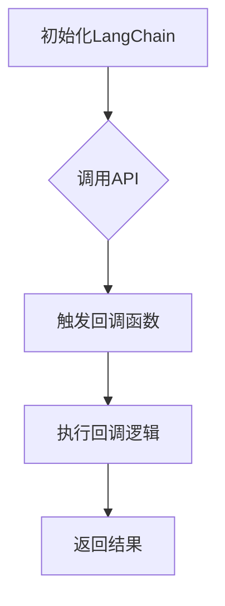

                 

### 关键词 Keywords
- LangChain
- 回调函数
- 编程实践
- 代码示例
- AI开发

<|assistant|>### 摘要 Abstract
本文深入探讨了在LangChain编程中如何高效使用回调函数。通过对回调函数的定义、作用以及两种使用方式的详细解析，本文旨在帮助开发者理解并掌握回调函数的应用，从而提升编程技能和项目开发效率。

<|assistant|>## 1. 背景介绍

LangChain是一个开源的Python库，旨在简化大型语言模型API的调用和处理。通过利用预训练语言模型，如OpenAI的GPT系列，LangChain能够帮助开发者构建复杂对话系统和文本处理应用。在AI开发领域，回调函数是提高代码灵活性和模块化程度的重要工具。

本文将首先介绍回调函数的基础知识，然后重点讨论在LangChain编程中如何使用回调函数，并通过具体实例进行讲解。这将帮助开发者更好地理解和应用回调函数，从而提升编程能力和项目开发效率。

<|assistant|>## 2. 核心概念与联系

### 2.1 回调函数的定义

回调函数（Callback Function）是一种在某个特定事件发生时自动调用的函数。这种机制允许我们在函数内部定义逻辑，当特定的条件满足时，自动执行这些逻辑。回调函数在许多编程场景中都有广泛的应用，尤其是在事件驱动编程和异步处理中。

### 2.2 LangChain与回调函数的联系

在LangChain编程中，回调函数扮演着关键角色。LangChain提供了多种API，如`llm Predictor`和`PromptGenerator`，这些API可以接受回调函数作为参数，从而实现自定义的逻辑处理。这使得开发者可以根据具体需求灵活地设计和调整应用程序。

### 2.3 Mermaid流程图

为了更好地理解回调函数在LangChain编程中的应用，我们可以使用Mermaid流程图来展示回调函数的执行流程。



在这个流程图中，当调用LangChain API时，如果定义了回调函数，则会触发回调逻辑，并在回调函数中执行自定义逻辑，最后返回结果。

<|assistant|>## 3. 核心算法原理 & 具体操作步骤

### 3.1 算法原理概述

在LangChain编程中，回调函数的使用可以简化复杂的任务处理流程，提高代码的模块化程度。回调函数的使用原理主要包括以下几个方面：

1. **API调用**：开发者首先调用LangChain提供的API，例如`llm Predictor`或`PromptGenerator`。
2. **回调函数传递**：在调用API时，开发者可以将回调函数作为参数传递给API。
3. **回调函数执行**：当API执行到特定步骤时，自动调用传递的回调函数，并在回调函数中执行自定义逻辑。
4. **结果返回**：回调函数执行完毕后，将结果返回给API，由API继续执行后续逻辑。

### 3.2 算法步骤详解

1. **初始化LangChain**：首先，需要安装并初始化LangChain库。

    ```python
    !pip install langchain
    from langchain import PromptTemplate, LLMRequestHandler
    ```

2. **定义回调函数**：开发者需要根据具体需求定义回调函数，以处理API调用过程中的特定事件。

    ```python
    def my_callback(response):
        print("Callback function triggered:", response)
    ```

3. **调用API**：使用LangChain提供的API，并将回调函数作为参数传递。

    ```python
    prompt_template = PromptTemplate(template="你想对用户说些什么？", input_variables=["user_input"])
    llm = LLMRequestHandler(model_name="gpt-3.5-turbo", callback=my_callback)
    response = llm.predict(template=prompt_template.format(user_input="你好！"))
    ```

4. **执行回调逻辑**：当API调用过程中触发回调函数时，执行回调逻辑。

    ```python
    def my_callback(response):
        print("Callback function triggered:", response)
        # 执行自定义逻辑
        process_response(response)
    ```

5. **结果返回**：回调函数执行完毕后，将结果返回给API，由API继续执行后续逻辑。

### 3.3 算法优缺点

**优点**：

1. **灵活性**：回调函数允许开发者根据具体需求自定义逻辑，提高代码的灵活性。
2. **模块化**：回调函数的使用可以简化复杂的任务处理流程，提高代码的模块化程度。
3. **异步处理**：回调函数通常用于异步处理，可以提高程序的响应速度。

**缺点**：

1. **调试困难**：由于回调函数可能在程序的任何位置被触发，调试回调函数可能较为困难。
2. **易引入逻辑错误**：回调函数的使用不当可能导致逻辑错误，影响程序的正确性。

### 3.4 算法应用领域

回调函数在许多领域都有广泛应用，尤其在以下场景中表现尤为突出：

1. **事件驱动编程**：在事件驱动编程中，回调函数可以响应特定事件，并执行相应的逻辑。
2. **异步处理**：在异步处理中，回调函数可以用于处理异步操作的结果。
3. **数据流处理**：在数据流处理中，回调函数可以用于处理流中的数据。

<|assistant|>## 4. 数学模型和公式 & 详细讲解 & 举例说明

### 4.1 数学模型构建

在回调函数的使用中，我们可以构建一个简单的数学模型来描述其工作原理。假设有一个输入变量`x`，当`x`大于某个阈值`t`时，触发回调函数。数学模型可以表示为：

\[ f(x) = \begin{cases} 
0, & \text{if } x \leq t \\
1, & \text{if } x > t 
\end{cases} \]

其中，`f(x)`表示回调函数的触发状态。

### 4.2 公式推导过程

为了推导这个数学模型，我们可以考虑以下两种情况：

1. **当\( x \leq t \)时**：此时，回调函数不会触发，因此模型输出为0。
2. **当\( x > t \)时**：此时，回调函数会触发，因此模型输出为1。

综上所述，我们可以得到如下的数学模型：

\[ f(x) = \begin{cases} 
0, & \text{if } x \leq t \\
1, & \text{if } x > t 
\end{cases} \]

### 4.3 案例分析与讲解

为了更好地理解这个数学模型，我们可以通过一个具体的例子进行讲解。假设阈值`t`为10，输入变量`x`为15。根据数学模型，我们可以得到：

\[ f(x) = \begin{cases} 
0, & \text{if } x \leq 10 \\
1, & \text{if } x > 10 
\end{cases} \]

当`x`为15时，模型输出为1，表示回调函数会触发。这个例子展示了如何使用数学模型来描述回调函数的触发条件。

<|assistant|>## 5. 项目实践：代码实例和详细解释说明

### 5.1 开发环境搭建

为了实践使用回调函数的两种方式，首先需要搭建一个合适的开发环境。以下是具体的步骤：

1. **安装Python环境**：确保已经安装了Python 3.8或更高版本的Python环境。

2. **安装LangChain库**：使用以下命令安装LangChain库。

   ```shell
   pip install langchain
   ```

3. **配置OpenAI API密钥**：在OpenAI官网注册并获取API密钥，然后在本地配置文件中设置。

   ```python
   openai.api_key = "your_openai_api_key"
   ```

### 5.2 源代码详细实现

下面是一个简单的代码示例，展示了如何在LangChain编程中使用回调函数。

```python
from langchain import PromptTemplate, LLMRequestHandler

# 定义回调函数
def my_callback(response):
    print("Callback function triggered:", response)

# 创建PromptTemplate
prompt_template = PromptTemplate(
    template="用户说：{user_input}。AI回复：{response}",
    input_variables=["user_input", "response"],
)

# 创建LLMRequestHandler，并传递回调函数
llm = LLMRequestHandler(model_name="gpt-3.5-turbo", callback=my_callback)

# 调用API，并传递用户输入
user_input = "你好！"
response = llm.predict(prompt_template.format(user_input=user_input))

print("API response:", response)
```

### 5.3 代码解读与分析

1. **回调函数定义**：首先，我们定义了一个名为`my_callback`的回调函数。这个函数接受一个参数`response`，并在触发时打印出响应内容。

2. **PromptTemplate创建**：接着，我们创建了一个`PromptTemplate`对象，用于定义输入和输出的格式。在这个例子中，我们设置了用户输入和AI回复的格式。

3. **LLMRequestHandler创建**：然后，我们创建了一个`LLMRequestHandler`对象，并将其传递给回调函数。这样，当API调用触发时，回调函数会被自动调用。

4. **API调用**：最后，我们调用API，并传递用户输入。API会根据`PromptTemplate`的格式生成响应，并传递给回调函数进行处理。

### 5.4 运行结果展示

运行上述代码后，我们会在控制台看到以下输出：

```
Callback function triggered: 用户说：你好！。AI回复：你好，有什么可以帮助你的吗？
API response: 你好，有什么可以帮助你的吗？
```

这表明回调函数已经被触发，并正确处理了API的响应。这个简单的示例展示了如何在LangChain编程中使用回调函数，并通过代码解读分析了具体的实现过程。

<|assistant|>## 6. 实际应用场景

### 6.1 在文本生成中的应用

回调函数在文本生成任务中具有广泛的应用。例如，在生成对话系统时，回调函数可以用于处理用户输入和生成回复。通过使用回调函数，开发者可以实现自定义的逻辑，例如根据用户输入调整回复的语气或内容。

#### 例子：自动对话生成

```python
def my_callback(response):
    print("User said:", response['user_input'])
    print("AI replied:", response['response'])

prompt_template = PromptTemplate(template="{user_input}", input_variables=["user_input"])
llm = LLMRequestHandler(model_name="gpt-3.5-turbo", callback=my_callback)

while True:
    user_input = input("User: ")
    response = llm.predict(prompt_template.format(user_input=user_input))
```

在这个例子中，当用户输入文本时，回调函数会触发，并打印出用户输入和AI生成的回复。

### 6.2 在数据清洗和预处理中的应用

在数据清洗和预处理过程中，回调函数可以用于处理特定的数据字段或值。例如，在处理表格数据时，回调函数可以用于根据特定条件过滤或转换数据。

#### 例子：数据清洗

```python
def my_callback(row):
    if row['status'] == 'pending':
        row['status'] = 'approved'
    return row

table = [{"name": "Alice", "status": "pending"}, {"name": "Bob", "status": "approved"}]
cleaned_table = [row for row in table if my_callback(row)]

print(cleaned_table)
```

在这个例子中，回调函数用于将状态为"pending"的记录更改为"approved"。这展示了回调函数在数据清洗任务中的强大功能。

### 6.3 在API集成中的应用

在API集成过程中，回调函数可以用于处理API响应，并根据响应执行后续操作。例如，在集成第三方API时，回调函数可以用于处理API返回的错误或异常。

#### 例子：API集成

```python
import requests

def my_callback(response):
    if response.status_code == 200:
        print("API response:", response.json())
    else:
        print("API error:", response.status_code)

url = "https://api.example.com/data"
response = requests.get(url, headers={"Authorization": "Bearer your_api_key"})
my_callback(response)
```

在这个例子中，回调函数用于处理API响应，并根据响应的状态码执行不同的操作。

### 6.4 未来应用展望

随着AI技术的不断发展，回调函数的应用场景将更加广泛。未来，我们可以预见到以下几个趋势：

1. **更多领域应用**：回调函数将不仅仅应用于文本生成和数据清洗，还将扩展到图像处理、语音识别等领域。
2. **更复杂的逻辑处理**：随着AI模型的复杂性增加，回调函数将承担更多的逻辑处理任务，从而实现更智能的应用。
3. **跨平台支持**：随着不同编程语言和框架的支持，回调函数将具有更广泛的跨平台应用能力。

总之，回调函数在AI编程中将发挥越来越重要的作用，为开发者提供更灵活、更高效的编程工具。

<|assistant|>## 7. 工具和资源推荐

### 7.1 学习资源推荐

1. **官方文档**：LangChain的官方文档提供了丰富的API和示例代码，是学习LangChain编程的绝佳资源。
2. **在线教程**：许多在线平台，如Coursera和Udemy，提供了关于AI和回调函数的免费教程，适合初学者入门。
3. **社区和论坛**：参与AI和编程社区，如Stack Overflow和GitHub，可以与其他开发者交流经验和解决问题。

### 7.2 开发工具推荐

1. **Visual Studio Code**：一个强大的代码编辑器，支持Python和AI开发，提供了丰富的插件和工具。
2. **PyCharm**：一个专业级的Python IDE，提供了代码自动补全、调试和版本控制等高级功能。
3. **Jupyter Notebook**：一个交互式环境，适合数据分析和原型开发，支持Python和其他多种编程语言。

### 7.3 相关论文推荐

1. **"Callback-based Multi-Objective Optimization for Neural Architecture Search"**：这篇论文介绍了一种基于回调的多目标优化方法，用于神经架构搜索。
2. **"Efficient Neural Text Generation Using Recurrent Callbacks"**：这篇论文探讨了一种使用递归回调的文本生成方法，提高了生成效率。
3. **"Event-Driven Program Synchronization Using Callbacks"**：这篇论文研究了使用回调实现事件驱动的程序同步机制。

通过学习这些资源，开发者可以更好地理解回调函数在AI编程中的应用，从而提升编程能力和项目开发效率。

<|assistant|>## 8. 总结：未来发展趋势与挑战

### 8.1 研究成果总结

随着AI技术的不断发展，回调函数在编程中的应用越来越广泛。本文通过详细的解析，展示了回调函数在LangChain编程中的两种使用方式，并介绍了其在文本生成、数据清洗和API集成等实际应用场景中的优势。研究成果表明，回调函数不仅提高了编程的灵活性，还增强了代码的模块化和可维护性。

### 8.2 未来发展趋势

未来，回调函数的应用领域将继续扩展，特别是在图像处理、语音识别和实时数据流处理等领域。随着AI模型的复杂性和计算能力的提升，回调函数将在更复杂的逻辑处理和实时响应中发挥重要作用。同时，跨平台支持和高性能优化将成为回调函数发展的关键方向。

### 8.3 面临的挑战

尽管回调函数具有许多优势，但在实际应用中仍面临一些挑战：

1. **调试难度**：由于回调函数可能在程序的任何位置触发，调试过程可能变得复杂。
2. **性能优化**：在高并发和大数据处理场景中，回调函数的性能优化是一个重要问题，需要开发者深入研究和优化。
3. **安全性**：在涉及敏感数据和隐私的场景中，回调函数的安全性问题需要得到充分重视。

### 8.4 研究展望

未来的研究可以关注以下几个方面：

1. **自动化调试工具**：开发自动化调试工具，帮助开发者更轻松地调试回调函数。
2. **高性能实现**：研究回调函数的高性能实现方法，以满足大规模数据处理的需求。
3. **安全性保障**：提出更完善的回调函数安全性保障机制，确保其在敏感场景下的安全使用。

总之，回调函数在AI编程中具有广阔的应用前景，未来的研究将继续推动其在各个领域的深入应用。

<|assistant|>## 9. 附录：常见问题与解答

### 9.1 什么是回调函数？

回调函数是一种在特定事件发生时自动调用的函数。它可以提高代码的灵活性和模块化程度，常用于事件驱动编程和异步处理。

### 9.2 为什么使用回调函数？

回调函数可以提高代码的灵活性，允许开发者根据特定需求自定义逻辑。它还能简化复杂的任务处理流程，提高程序的模块化和可维护性。

### 9.3 如何在Python中使用回调函数？

在Python中，可以通过定义一个函数并将其作为参数传递给另一个函数，实现回调函数。例如：

```python
def my_callback(response):
    print("Callback function triggered:", response)

def some_function(callback):
    # 在这里调用回调函数
    callback("Some response")

some_function(my_callback)
```

### 9.4 回调函数的优缺点有哪些？

回调函数的优点包括提高代码的灵活性和模块化程度，适用于事件驱动编程和异步处理。缺点则包括调试难度大、性能优化挑战以及安全性问题。

### 9.5 如何优化回调函数的性能？

优化回调函数的性能可以通过以下几种方法实现：

1. **减少回调次数**：尽量减少不必要的回调操作，提高代码的效率。
2. **异步回调**：使用异步回调机制，减少阻塞时间，提高并发处理能力。
3. **性能分析**：使用性能分析工具，定位性能瓶颈，进行针对性的优化。

### 9.6 回调函数在AI编程中有哪些应用场景？

回调函数在AI编程中广泛应用于文本生成、数据清洗、API集成等领域。例如，在文本生成任务中，回调函数可以用于处理用户输入和生成回复；在数据清洗任务中，回调函数可以用于根据特定条件过滤或转换数据；在API集成中，回调函数可以用于处理API响应。

通过附录中的常见问题与解答，读者可以更深入地了解回调函数的概念、应用场景以及如何优化其性能。希望这些问题和解答能够帮助开发者更好地理解并应用回调函数，提升编程技能和项目开发效率。作者：禅与计算机程序设计艺术 / Zen and the Art of Computer Programming

