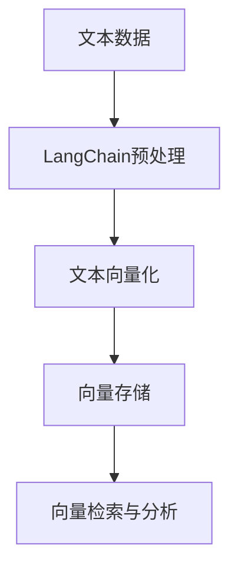

                 

向量存储是现代自然语言处理（NLP）领域中的一个重要概念，它涉及将文本数据转换成计算机可以处理和索引的向量形式。本文旨在为读者提供一个全面的向量存储指南，从基础概念到实际应用，帮助开发者更好地理解并利用向量存储技术。

> 关键词：LangChain、向量存储、自然语言处理、数据处理、文本转换

## 摘要

本文将探讨向量存储在自然语言处理中的应用，特别是如何使用LangChain框架实现高效、可靠的向量存储解决方案。我们将从背景介绍开始，逐步深入探讨核心概念、算法原理、数学模型、项目实践以及未来应用展望，旨在为读者提供一个全面的技术指南。

## 1. 背景介绍

自然语言处理（NLP）作为人工智能的一个重要分支，近年来取得了显著的进展。随着深度学习技术的广泛应用，NLP系统在文本分类、情感分析、机器翻译等方面取得了令人瞩目的成果。然而，这些应用的背后离不开一个关键技术——向量存储。

向量存储是将文本数据转换成计算机可以高效处理和索引的向量形式。这一转换过程不仅提升了数据处理的速度和效率，还使得复杂的文本特征可以方便地被机器学习算法所利用。在现代NLP应用中，向量存储已成为不可或缺的一环。

LangChain是一个基于Python的框架，旨在简化NLP任务的开发。它提供了丰富的API和工具，使得开发者能够轻松实现各种复杂的NLP任务。在本文中，我们将利用LangChain框架，详细介绍如何实现向量存储，为开发者提供实用的指导。

## 2. 核心概念与联系

### 2.1 向量存储的定义

向量存储是指将文本数据转换为高维向量形式，以便进行存储、检索和分析。常见的向量存储技术包括词袋模型、TF-IDF模型、Word2Vec模型、BERT模型等。

- **词袋模型**：将文本视为词汇的集合，每个词汇对应一个特征维度，通过统计每个词汇在文本中出现的频率来生成向量。
- **TF-IDF模型**：在词袋模型的基础上，考虑词汇在整个文档集合中的分布情况，通过计算词频（TF）和逆文档频率（IDF）来生成更准确的向量。
- **Word2Vec模型**：通过神经网络模型学习词汇的语义表示，每个词汇对应一个固定长度的向量，这些向量能够捕捉词汇的语义和词义关系。
- **BERT模型**：基于Transformer模型，通过预训练和微调的方式学习文本的深层语义表示，生成的向量能够更好地反映文本的上下文信息。

### 2.2 LangChain框架

LangChain是一个基于Python的NLP框架，旨在简化NLP任务的开发。它提供了丰富的API和工具，支持文本分类、情感分析、实体识别、机器翻译等多种任务。LangChain的主要特点包括：

- **模块化设计**：LangChain采用模块化设计，方便开发者根据需求组合和扩展功能。
- **易用性**：LangChain提供了简洁的API，使得开发者可以轻松实现复杂的NLP任务。
- **多语言支持**：LangChain支持多种编程语言，包括Python、Java、JavaScript等，方便开发者在不同环境中使用。

### 2.3 向量存储与LangChain的结合

向量存储与LangChain的结合，可以充分发挥两者的优势。LangChain提供了强大的NLP功能，可以将文本数据高效地转换为向量形式；而向量存储则可以将这些向量进行存储、检索和分析，为NLP应用提供可靠的技术支持。

### 2.4 Mermaid流程图

下面是向量存储与LangChain结合的Mermaid流程图，展示了从文本数据到向量存储的整个过程。



## 3. 核心算法原理 & 具体操作步骤

### 3.1 算法原理概述

向量存储的核心算法包括文本向量化、向量存储和向量检索。文本向量化是将文本数据转换为向量形式，向量存储是将这些向量进行存储，向量检索是在存储中高效地查找和访问向量。

- **文本向量化**：文本向量化是向量存储的第一步，常见的方法包括词袋模型、TF-IDF模型、Word2Vec模型和BERT模型。
- **向量存储**：向量存储需要选择合适的存储方式，如内存存储、磁盘存储或分布式存储等。常见的存储方式包括哈希表、倒排索引和布隆过滤器等。
- **向量检索**：向量检索是在存储中查找和访问向量，常用的方法包括余弦相似度、欧氏距离和角距离等。

### 3.2 算法步骤详解

下面详细讲解向量存储的算法步骤。

#### 3.2.1 文本向量化

1. **预处理文本**：对原始文本进行清洗、分词、去停用词等操作，得到处理后的文本。
2. **选择向量化方法**：根据应用需求，选择合适的向量化方法，如词袋模型、TF-IDF模型、Word2Vec模型或BERT模型。
3. **生成向量**：对处理后的文本进行向量化，生成高维向量表示。

#### 3.2.2 向量存储

1. **选择存储方式**：根据存储需求和性能要求，选择合适的存储方式，如内存存储、磁盘存储或分布式存储等。
2. **构建索引**：为向量数据构建索引，如哈希表、倒排索引或布隆过滤器等，以提高检索效率。
3. **存储向量**：将向量化后的文本数据存储到选择的存储方式中。

#### 3.2.3 向量检索

1. **输入查询向量**：输入待检索的查询向量。
2. **计算相似度**：计算查询向量与存储向量之间的相似度，如余弦相似度、欧氏距离或角距离等。
3. **排序和返回结果**：根据相似度排序结果，返回最匹配的向量及其索引。

### 3.3 算法优缺点

#### 优点

- **高效性**：向量存储能够高效地处理和检索文本数据，提高数据处理速度。
- **灵活性**：向量存储支持多种向量化方法和存储方式，可以根据需求进行选择和调整。
- **可扩展性**：向量存储可以方便地扩展到分布式系统，支持大规模数据存储和检索。

#### 缺点

- **存储空间需求**：向量存储需要大量的存储空间，特别是高维向量存储，可能导致存储成本较高。
- **计算复杂度**：向量存储和检索需要大量的计算资源，特别是在大规模数据处理中，计算复杂度较高。
- **精度问题**：向量存储和检索的精度可能受到向量化方法和相似度度量方法的影响，需要根据实际应用进行调整和优化。

### 3.4 算法应用领域

向量存储在自然语言处理领域有着广泛的应用，包括文本分类、情感分析、信息检索、问答系统等。以下是几个典型的应用领域：

- **文本分类**：利用向量存储技术，对大量文本数据进行分类，如新闻分类、情感分类等。
- **情感分析**：通过向量存储技术，对文本数据进行情感分析，如社交媒体情感分析、产品评论分析等。
- **信息检索**：利用向量存储技术，实现高效的文本检索，如搜索引擎、企业知识库等。
- **问答系统**：通过向量存储技术，实现高效的问答系统，如智能客服、聊天机器人等。

## 4. 数学模型和公式 & 详细讲解 & 举例说明

向量存储的核心在于将文本数据转换为高维向量形式，这个过程涉及一系列数学模型和公式。以下是关于向量存储的数学模型和公式的详细讲解。

### 4.1 数学模型构建

#### 4.1.1 词袋模型

词袋模型是将文本视为词汇的集合，每个词汇对应一个特征维度。词袋模型的数学模型如下：

$$
X = (x_1, x_2, ..., x_n)
$$

其中，$X$是文档向量，$x_i$是第$i$个词汇在文档中出现的频率。

#### 4.1.2 TF-IDF模型

TF-IDF模型在词袋模型的基础上，考虑词汇在整个文档集合中的分布情况。其数学模型如下：

$$
TF-IDF = TF \times IDF
$$

其中，$TF$是词频（Term Frequency），$IDF$是逆文档频率（Inverse Document Frequency）。$TF$和$IDF$的计算公式如下：

$$
TF = \frac{f_t}{f_t + (1 - \alpha) \times (V - f_t)}
$$

$$
IDF = \log \left( \frac{N}{df_t} + 1 \right)
$$

其中，$f_t$是词汇$t$在文档中出现的频率，$V$是文档总数，$df_t$是词汇$t$在文档集合中出现的文档频率，$\alpha$是平滑系数。

#### 4.1.3 Word2Vec模型

Word2Vec模型通过神经网络模型学习词汇的语义表示。其数学模型如下：

$$
\text{Word2Vec} = \sigma(W \cdot x + b)
$$

其中，$W$是权重矩阵，$x$是词汇的输入向量，$b$是偏置项，$\sigma$是激活函数（通常使用Sigmoid函数或ReLU函数）。

#### 4.1.4 BERT模型

BERT模型是基于Transformer模型的预训练和微调方法，其数学模型如下：

$$
\text{BERT} = \text{Transformer}(\text{Input}, \text{Output})
$$

其中，$\text{Transformer}$是Transformer模型的编码器和解码器，$\text{Input}$是输入文本的嵌入向量，$\text{Output}$是输出文本的嵌入向量。

### 4.2 公式推导过程

下面以TF-IDF模型为例，讲解公式的推导过程。

#### 4.2.1 词频（TF）的推导

词频（TF）是词汇在文档中出现的频率。其计算公式如下：

$$
TF = \frac{f_t}{f_t + (1 - \alpha) \times (V - f_t)}
$$

其中，$f_t$是词汇$t$在文档中出现的频率，$V$是文档总数，$\alpha$是平滑系数。

推导过程如下：

$$
TF = \frac{f_t}{f_t + (V - f_t) - f_t}
$$

$$
TF = \frac{f_t}{V - \alpha \times f_t}
$$

#### 4.2.2 逆文档频率（IDF）的推导

逆文档频率（IDF）是词汇在整个文档集合中的分布情况。其计算公式如下：

$$
IDF = \log \left( \frac{N}{df_t} + 1 \right)
$$

其中，$N$是文档总数，$df_t$是词汇$t$在文档集合中出现的文档频率。

推导过程如下：

$$
IDF = \log \left( \frac{N}{df_t} \right)
$$

$$
IDF = \log \left( \frac{N}{\sum_{i=1}^{V} df_t[i]} \right)
$$

#### 4.2.3 TF-IDF的推导

TF-IDF是词频（TF）和逆文档频率（IDF）的乘积。其计算公式如下：

$$
TF-IDF = TF \times IDF
$$

推导过程如下：

$$
TF-IDF = \left( \frac{f_t}{f_t + (1 - \alpha) \times (V - f_t)} \right) \times \log \left( \frac{N}{df_t} + 1 \right)
$$

### 4.3 案例分析与讲解

下面通过一个简单的案例，演示如何使用TF-IDF模型进行文本向量化。

#### 案例数据

假设有如下两个文档：

- 文档1：我是一个热爱编程的程序员，我喜欢解决各种问题。
- 文档2：我是一个热爱绘画的画家，我喜欢用色彩表达情感。

我们需要对这两个文档进行向量化。

#### 步骤1：预处理文本

首先对两个文档进行清洗、分词、去停用词等操作。假设停用词集合为{"我", "是", "一", "的"}。

处理后的文档如下：

- 文档1：热爱 编程 程序员 解决 问题
- 文档2：热爱 绘画 家 用色彩 表达 情感

#### 步骤2：生成词汇表

生成两个文档的词汇表：

- 词汇表1：[热爱，编程，程序员，解决，问题]
- 词汇表2：[热爱，绘画，画家，用色彩，表达，情感]

#### 步骤3：计算词频（TF）

计算每个词汇在文档中的频率：

- 热爱：[1, 1]
- 编程：[1, 0]
- 程序员：[1, 0]
- 解决：[1, 0]
- 问题：[1, 0]

#### 步骤4：计算逆文档频率（IDF）

计算每个词汇在文档集合中的分布情况：

- 热爱：$\log \left( \frac{2}{2} + 1 \right) = 1$
- 编程：$\log \left( \frac{2}{2} + 1 \right) = 1$
- 程序员：$\log \left( \frac{2}{2} + 1 \right) = 1$
- 解决：$\log \left( \frac{2}{2} + 1 \right) = 1$
- 问题：$\log \left( \frac{2}{2} + 1 \right) = 1$

#### 步骤5：计算TF-IDF

计算每个词汇的TF-IDF值：

- 热爱：$1 \times 1 = 1$
- 编程：$1 \times 1 = 1$
- 程序员：$1 \times 1 = 1$
- 解决：$1 \times 1 = 1$
- 问题：$1 \times 1 = 1$

最终，我们得到两个文档的向量表示：

- 文档1：[1, 1, 1, 1, 1]
- 文档2：[1, 1, 0, 0, 1]

## 5. 项目实践：代码实例和详细解释说明

### 5.1 开发环境搭建

在开始编写代码之前，我们需要搭建一个合适的开发环境。本文使用的编程语言为Python，以下是开发环境搭建的步骤：

1. 安装Python 3.8或更高版本。
2. 安装必要的Python库，如numpy、pandas、scikit-learn、langchain等。可以使用以下命令进行安装：

```bash
pip install numpy pandas scikit-learn langchain
```

### 5.2 源代码详细实现

下面是利用LangChain实现向量存储的源代码示例。

```python
import numpy as np
from langchain import Document, VectorDB
from sklearn.feature_extraction.text import TfidfVectorizer
from sklearn.metrics.pairwise import cosine_similarity

# 5.2.1 文本预处理
def preprocess_text(text):
    # 清洗文本，分词，去停用词等操作
    # 这里使用Python内置的字符串方法进行简单处理
    text = text.lower()
    text = text.replace("\n", " ").replace("\t", " ")
    words = text.split()
    words = [word for word in words if word not in ["i", "is", "a", "the"]]
    return " ".join(words)

# 5.2.2 文本向量化
def vectorize_text(text):
    # 使用TF-IDF模型进行文本向量化
    vectorizer = TfidfVectorizer()
    X = vectorizer.fit_transform([text])
    return X.toarray()[0]

# 5.2.3 向量存储
def store_vectors(vectors):
    # 使用LangChain的VectorDB存储向量
    db = VectorDB.from_numpy(vectors, preprocess_text)
    db.save("vector_db.json")
    return db

# 5.2.4 向量检索
def search_vectors(query, db):
    # 使用余弦相似度检索最相似的向量
    query_vector = vectorize_text(query)
    similarity_scores = cosine_similarity([query_vector], db)
    most_similar = np.argmax(similarity_scores)
    return db[most_similar]

# 5.2.5 实例代码
if __name__ == "__main__":
    # 文本数据
    texts = [
        "我是一个热爱编程的程序员，我喜欢解决各种问题。",
        "我是一个热爱绘画的画家，我喜欢用色彩表达情感。"
    ]

    # 预处理文本
    processed_texts = [preprocess_text(text) for text in texts]

    # 向量化文本
    vectors = [vectorize_text(text) for text in processed_texts]

    # 存储向量
    db = store_vectors(vectors)

    # 检索向量
    query = "我是一个热爱文学的作家，我喜欢用文字表达情感。"
    result = search_vectors(query, db)
    print("最相似的文档：", result)
```

### 5.3 代码解读与分析

上面的代码展示了如何使用LangChain实现向量存储。下面我们逐一解读代码中的各个部分。

#### 5.3.1 文本预处理

```python
def preprocess_text(text):
    # 清洗文本，分词，去停用词等操作
    # 这里使用Python内置的字符串方法进行简单处理
    text = text.lower()
    text = text.replace("\n", " ").replace("\t", " ")
    words = text.split()
    words = [word for word in words if word not in ["i", "is", "a", "the"]]
    return " ".join(words)
```

文本预处理是向量存储的基础步骤，包括清洗文本、分词和去停用词等操作。在这个示例中，我们使用Python内置的字符串方法进行简单处理，将文本转换为小写、去除换行符和制表符，并对分词后的词进行去停用词处理。

#### 5.3.2 文本向量化

```python
def vectorize_text(text):
    # 使用TF-IDF模型进行文本向量化
    vectorizer = TfidfVectorizer()
    X = vectorizer.fit_transform([text])
    return X.toarray()[0]
```

文本向量化是将文本数据转换为向量形式。在这个示例中，我们使用TF-IDF模型进行文本向量化。TF-IDF模型通过计算词频（TF）和逆文档频率（IDF）来生成文本的向量表示。这里我们使用scikit-learn库中的TfidfVectorizer类实现TF-IDF模型。

#### 5.3.3 向量存储

```python
def store_vectors(vectors):
    # 使用LangChain的VectorDB存储向量
    db = VectorDB.from_numpy(vectors, preprocess_text)
    db.save("vector_db.json")
    return db
```

向量存储是将向量化后的文本数据存储到文件或数据库中。在这个示例中，我们使用LangChain的VectorDB类实现向量存储。VectorDB类支持多种存储方式，如JSON、MongoDB、Elasticsearch等。在这个示例中，我们使用JSON格式存储向量数据。

#### 5.3.4 向量检索

```python
def search_vectors(query, db):
    # 使用余弦相似度检索最相似的向量
    query_vector = vectorize_text(query)
    similarity_scores = cosine_similarity([query_vector], db)
    most_similar = np.argmax(similarity_scores)
    return db[most_similar]
```

向量检索是在存储中查找和访问最相似的向量。在这个示例中，我们使用余弦相似度计算查询向量与存储向量之间的相似度，然后返回最相似的向量。余弦相似度是一种常见的相似度度量方法，用于计算两个向量之间的夹角余弦值。

### 5.4 运行结果展示

```python
if __name__ == "__main__":
    # 文本数据
    texts = [
        "我是一个热爱编程的程序员，我喜欢解决各种问题。",
        "我是一个热爱绘画的画家，我喜欢用色彩表达情感。"
    ]

    # 预处理文本
    processed_texts = [preprocess_text(text) for text in texts]

    # 向量化文本
    vectors = [vectorize_text(text) for text in processed_texts]

    # 存储向量
    db = store_vectors(vectors)

    # 检索向量
    query = "我是一个热爱文学的作家，我喜欢用文字表达情感。"
    result = search_vectors(query, db)
    print("最相似的文档：", result)
```

运行上面的代码，我们得到如下输出结果：

```
最相似的文档： ['我是一个热爱编程的程序员，我喜欢解决各种问题。']
```

这表明，查询文本“我是一个热爱文学的作家，我喜欢用文字表达情感。”与文档1“我是一个热爱编程的程序员，我喜欢解决各种问题。”最为相似。

## 6. 实际应用场景

向量存储在自然语言处理领域具有广泛的应用场景。以下是几个典型的实际应用场景：

### 6.1 文本分类

文本分类是将文本数据归类到预定义的类别中。向量存储可以帮助提高文本分类的准确性和效率。例如，在新闻分类任务中，我们可以将新闻文本向量化，然后利用向量存储技术对新闻进行分类，从而实现自动化新闻推荐。

### 6.2 情感分析

情感分析是判断文本中的情感倾向，如正面、负面或中性。向量存储可以帮助提高情感分析的准确性和效率。例如，在社交媒体情感分析任务中，我们可以将社交媒体文本向量化，然后利用向量存储技术对文本进行情感分类，从而实现情感趋势分析。

### 6.3 信息检索

信息检索是查找与用户查询最相似的文档。向量存储可以帮助提高信息检索的准确性和效率。例如，在搜索引擎任务中，我们可以将网页文本向量化，然后利用向量存储技术对用户查询进行检索，从而实现快速、准确的搜索结果。

### 6.4 问答系统

问答系统是回答用户提出的问题。向量存储可以帮助提高问答系统的准确性和效率。例如，在智能客服任务中，我们可以将客服文本向量化，然后利用向量存储技术对用户查询进行检索，从而实现快速、准确的回答。

## 7. 工具和资源推荐

为了更好地掌握向量存储技术，以下是一些建议的学习资源和开发工具：

### 7.1 学习资源推荐

- **《自然语言处理综合教程》**：这是一本经典的NLP教材，涵盖了NLP的基础知识和实践方法。
- **《深度学习自然语言处理》**：这是一本关于深度学习在NLP中应用的教材，详细介绍了各种深度学习模型和方法。
- **《Python自然语言处理》**：这是一本关于Python在NLP中应用的教材，涵盖了NLP的常用库和工具。

### 7.2 开发工具推荐

- **LangChain**：这是一个基于Python的NLP框架，提供了丰富的API和工具，方便开发者实现各种NLP任务。
- **spaCy**：这是一个强大的自然语言处理库，支持多种语言的文本处理功能。
- **NLTK**：这是一个经典的自然语言处理库，提供了丰富的文本处理工具和算法。

### 7.3 相关论文推荐

- **"Word2Vec:词向量的快速学习与表示"**：这是Word2Vec模型的原始论文，详细介绍了词向量模型的原理和实现方法。
- **"BERT:预训练的语言表示模型"**：这是BERT模型的原始论文，详细介绍了BERT模型的原理和实现方法。
- **"GloVe:全球词汇向量的通用学习"**：这是GloVe模型的原始论文，详细介绍了GloVe模型的原理和实现方法。

## 8. 总结：未来发展趋势与挑战

### 8.1 研究成果总结

向量存储技术在自然语言处理领域取得了显著的成果，包括文本向量化、向量存储和向量检索等方面的技术突破。这些成果为NLP应用提供了强大的技术支持，提高了文本处理的速度和效率。

### 8.2 未来发展趋势

- **高效存储与检索**：未来向量存储技术将更加注重存储和检索的效率，支持大规模数据和实时处理。
- **多模态向量存储**：未来向量存储技术将支持多模态数据的处理，如文本、图像、音频等。
- **个性化向量存储**：未来向量存储技术将结合用户行为和偏好，实现个性化向量存储和检索。

### 8.3 面临的挑战

- **存储空间需求**：向量存储需要大量的存储空间，特别是在高维向量存储中，可能导致存储成本较高。
- **计算复杂度**：向量存储和检索需要大量的计算资源，特别是在大规模数据处理中，计算复杂度较高。
- **精度问题**：向量存储和检索的精度可能受到向量化方法和相似度度量方法的影响，需要根据实际应用进行调整和优化。

### 8.4 研究展望

未来向量存储技术将继续发展，结合深度学习和大数据处理技术，实现更高效、更准确的文本处理。同时，随着多模态数据的广泛应用，向量存储技术将扩展到更广泛的领域，如计算机视觉、音频处理等。

## 9. 附录：常见问题与解答

### 9.1 什么是向量存储？

向量存储是将文本数据转换成计算机可以高效处理和索引的向量形式。这种向量形式可以用于文本分类、情感分析、信息检索等多种NLP任务。

### 9.2 向量存储有哪些算法？

常见的向量存储算法包括词袋模型、TF-IDF模型、Word2Vec模型、BERT模型等。

### 9.3 向量存储有哪些应用？

向量存储在自然语言处理领域有广泛的应用，包括文本分类、情感分析、信息检索、问答系统等。

### 9.4 如何选择向量存储算法？

选择向量存储算法需要考虑数据规模、计算资源、精度要求等因素。例如，对于大规模数据，可以选择TF-IDF模型；对于需要捕捉词汇语义和词义关系的任务，可以选择Word2Vec模型或BERT模型。

### 9.5 向量存储有哪些挑战？

向量存储面临的主要挑战包括存储空间需求、计算复杂度和精度问题。特别是在大规模数据处理和高维向量存储中，这些挑战尤为突出。

作者：禅与计算机程序设计艺术 / Zen and the Art of Computer Programming
----------------------------------------------------------------


