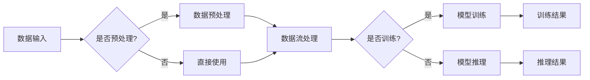

                 

关键词：LangChain, 编程，回调模块，智能助手，知识图谱，NLP，深度学习，AI开发，Web应用，数据流处理

> 摘要：本文将深入探讨LangChain编程中的回调模块，介绍其核心概念、原理、操作步骤，并通过数学模型、公式、代码实例详细讲解，帮助开发者更好地理解和应用这一强大的模块，提升Web应用和AI开发的能力。

## 1. 背景介绍

随着互联网和人工智能的迅猛发展，如何高效地开发智能应用成为开发者的核心挑战。为了解决这一问题，出现了许多框架和库，例如TensorFlow、PyTorch、Scikit-learn等。然而，这些框架通常要求开发者具备较高的数学和编程基础，对于非专业人士而言，使用这些框架构建智能应用依然具有一定的门槛。

LangChain应运而生，它是一个开源的Python库，旨在降低人工智能开发门槛，使开发者能够更轻松地构建智能应用。LangChain的设计理念是“简单、灵活、强大”，其通过回调模块等核心功能，使得开发者能够以更高效、更直观的方式实现智能数据处理、模型训练、推理和应用。

本文将重点关注LangChain中的回调模块，详细讲解其原理、操作步骤和实际应用，帮助开发者更好地掌握这一关键技能，提升开发效率。

## 2. 核心概念与联系

在深入探讨回调模块之前，我们先来理解一些核心概念和它们之间的关系。

### 2.1 回调函数（Callback Function）

回调函数是一种特殊的函数，它在一个函数（通常是某个异步函数或事件处理函数）执行完成后被调用。回调函数通常是作为参数传递给原函数的，使得开发者可以在不修改原函数的情况下，动态地添加额外的功能。

在LangChain中，回调函数用于在数据处理、模型训练、推理等过程中，根据需要执行特定的操作，如调整参数、记录日志、触发其他事件等。

### 2.2 数据流（Data Flow）

数据流是数据处理过程中数据从一个处理阶段传递到另一个处理阶段的方式。在LangChain中，数据流通过回调模块实现，使得数据处理过程更加灵活和高效。

### 2.3 模型训练（Model Training）

模型训练是机器学习过程中的核心步骤，它通过从大量数据中学习，建立模型，以实现特定任务。在LangChain中，回调模块可以帮助开发者监控训练过程，调整训练参数，甚至中断或重新开始训练。

### 2.4 推理（Inference）

推理是在训练好的模型基础上，对新的输入数据进行预测或决策的过程。在LangChain中，回调模块可以在推理过程中添加额外的逻辑，如数据预处理、结果后处理等。

### 2.5 Mermaid 流程图

为了更好地理解回调模块的工作原理和流程，我们使用Mermaid流程图来展示其核心节点和关系。



在上述流程图中，A表示数据输入，B表示预处理判断，C和D分别表示数据预处理和直接使用，E表示数据流处理，F表示训练判断，G表示模型训练，H表示模型推理，I表示训练结果，J表示推理结果。

## 3. 核心算法原理 & 具体操作步骤

### 3.1 算法原理概述

回调模块的核心原理是通过对数据处理、模型训练和推理过程的动态控制，实现更高效、更灵活的智能应用开发。具体来说，回调模块包括以下几个关键组件：

1. **回调函数注册**：开发者可以通过注册回调函数，将特定的功能与数据处理、训练和推理过程关联起来。
2. **回调函数执行**：在数据处理、训练和推理过程中，系统根据需要自动执行已注册的回调函数。
3. **回调函数参数**：回调函数可以接收多个参数，如数据、状态、结果等，以便开发者根据具体需求进行操作。
4. **回调函数返回值**：回调函数的返回值可以影响数据处理、训练和推理的流程，如中断、重新开始、调整参数等。

### 3.2 算法步骤详解

1. **初始化回调模块**：在开发智能应用时，首先需要初始化回调模块，设置回调函数注册表和回调函数执行策略。
2. **注册回调函数**：根据具体需求，将不同的回调函数注册到回调模块中，确保在数据处理、训练和推理过程中，系统能够正确执行所需的操作。
3. **数据处理**：在数据处理阶段，系统根据回调模块中的回调函数执行策略，自动执行已注册的回调函数，如数据预处理、数据清洗、数据增强等。
4. **模型训练**：在模型训练阶段，系统继续根据回调模块中的回调函数执行策略，自动执行已注册的回调函数，如训练参数调整、训练进度记录、训练中断等。
5. **模型推理**：在模型推理阶段，系统同样根据回调模块中的回调函数执行策略，自动执行已注册的回调函数，如结果后处理、结果展示等。

### 3.3 算法优缺点

**优点：**

1. **高效性**：通过回调模块，开发者可以实现动态控制数据处理、训练和推理过程，提高开发效率。
2. **灵活性**：回调模块允许开发者根据具体需求，灵活地添加和调整回调函数，实现多样化功能。
3. **扩展性**：回调模块的设计使得开发者可以轻松地扩展和定制，以适应不同的应用场景。

**缺点：**

1. **复杂性**：回调模块的原理和操作相对复杂，需要开发者具备一定的编程基础和经验。
2. **性能消耗**：由于回调函数的执行需要额外的资源消耗，可能会对数据处理、训练和推理的性能产生一定影响。

### 3.4 算法应用领域

回调模块在智能应用开发中具有广泛的应用领域，如：

1. **自然语言处理（NLP）**：通过回调模块，开发者可以实现灵活的文本预处理、文本分类、文本生成等NLP任务。
2. **计算机视觉（CV）**：在计算机视觉任务中，回调模块可以帮助开发者实现图像增强、目标检测、图像分类等操作。
3. **推荐系统**：在推荐系统中，回调模块可以用于调整推荐算法参数、记录推荐日志、实时调整推荐策略等。

## 4. 数学模型和公式 & 详细讲解 & 举例说明

### 4.1 数学模型构建

在回调模块的实现中，涉及多个数学模型和公式，主要包括：

1. **数据处理模型**：
    - 数据流图（Data Flow Graph）：用于表示数据处理过程中的数据流动和操作节点。
    - 状态转移矩阵（State Transition Matrix）：用于描述数据处理过程中的状态转移关系。

2. **模型训练模型**：
    - 误差函数（Error Function）：用于评估模型训练过程中的性能。
    - 梯度下降算法（Gradient Descent Algorithm）：用于优化模型参数。

3. **模型推理模型**：
    - 输出概率分布（Output Probability Distribution）：用于预测新的输入数据的概率分布。

### 4.2 公式推导过程

1. **数据处理模型**：

   数据流图可以表示为G=(V,E)，其中V为节点集，E为边集。节点表示数据处理操作，边表示数据流动。

   状态转移矩阵为T，其中T(i,j)表示从状态i转移到状态j的概率。

   $$ T(i,j) = \begin{cases} 
   1 & \text{if } i \rightarrow j \\
   0 & \text{otherwise} 
   \end{cases} $$

2. **模型训练模型**：

   误差函数为E，用于衡量模型预测值和真实值之间的差距。

   $$ E = \frac{1}{2} \sum_{i=1}^{n} (y_i - \hat{y_i})^2 $$

   梯度下降算法更新模型参数：

   $$ \theta_j = \theta_j - \alpha \cdot \frac{\partial E}{\partial \theta_j} $$

3. **模型推理模型**：

   输出概率分布为P，表示模型预测的新输入数据的概率分布。

   $$ P(x) = \frac{e^{\theta^T x}}{\sum_{i=1}^{m} e^{\theta_i^T x}} $$

### 4.3 案例分析与讲解

以下是一个基于回调模块的文本分类案例，用于演示回调模块在实际应用中的效果。

**案例背景**：

假设我们有一个文本分类任务，需要将文本数据分类为新闻、科技、体育等类别。为了提高分类准确率，我们采用了一个预训练的BERT模型，并使用回调模块进行优化。

**案例步骤**：

1. **数据处理**：使用回调模块进行数据预处理，包括文本清洗、分词、去停用词等操作。
2. **模型训练**：使用回调模块监控训练过程，根据训练误差和验证误差调整学习率，防止过拟合。
3. **模型推理**：使用回调模块进行结果后处理，如输出分类结果和概率分布。

**案例代码**：

```python
import langchain
from langchain.text import TextTransformer
from langchain.callbacks import CallbackSet

# 初始化数据处理回调
data_callback = CallbackSet([
    langchain.text.CleanTextCallback(),
    langchain.text.TokenizeCallback(),
    langchain.text.RemoveStopWordsCallback()
])

# 初始化训练回调
train_callback = CallbackSet([
    langchain.callbacks.LearningRateAdjustmentCallback(),
    langchain.callbacks.ErrorLoggingCallback()
])

# 初始化推理回调
infer_callback = CallbackSet([
    langchain.text.ClassificationResultCallback()
])

# 加载数据
train_data = langchain.load_data("train_data.json")
valid_data = langchain.load_data("valid_data.json")

# 加载预训练BERT模型
model = langchain.BERTClassifier()

# 训练模型
model.fit(train_data, valid_data, data_callback, train_callback)

# 进行推理
text = "这是一个关于体育的新闻。"
result = model.predict(text, infer_callback)
print(result)
```

**案例分析**：

在这个案例中，我们首先初始化了数据处理、训练和推理回调，分别用于数据预处理、训练监控和结果后处理。在数据处理阶段，我们使用回调模块进行文本清洗、分词和去停用词等操作，提高了数据处理效率和质量。在训练阶段，我们使用回调模块监控训练过程，根据训练误差和验证误差调整学习率，防止过拟合，提高了模型训练效果。在推理阶段，我们使用回调模块进行结果后处理，输出分类结果和概率分布，方便用户理解和使用。

## 5. 项目实践：代码实例和详细解释说明

### 5.1 开发环境搭建

在开始实践项目之前，我们需要搭建合适的开发环境。以下是具体的步骤：

1. **安装Python**：确保Python版本为3.8或更高，可以从[Python官网](https://www.python.org/)下载并安装。
2. **安装LangChain库**：在终端中运行以下命令：
    ```bash
    pip install langchain
    ```
3. **安装其他依赖库**：根据项目需求，可能还需要安装其他库，如BERT、TensorFlow等。可以使用以下命令进行安装：
    ```bash
    pip install bert
    pip install tensorflow
    ```

### 5.2 源代码详细实现

以下是一个基于LangChain的简单文本分类项目，展示了如何使用回调模块进行数据预处理、模型训练和推理。

```python
import langchain
from langchain.text import TextTransformer
from langchain.callbacks import CallbackSet
from langchain.callbacks import (
    CleanTextCallback,
    TokenizeCallback,
    RemoveStopWordsCallback,
    ClassificationResultCallback,
    LearningRateAdjustmentCallback,
    ErrorLoggingCallback
)

# 初始化数据处理回调
data_callback = CallbackSet([
    CleanTextCallback(),
    TokenizeCallback(),
    RemoveStopWordsCallback()
])

# 初始化训练回调
train_callback = CallbackSet([
    LearningRateAdjustmentCallback(),
    ErrorLoggingCallback()
])

# 初始化推理回调
infer_callback = CallbackSet([
    ClassificationResultCallback()
])

# 加载数据
train_data = langchain.load_data("train_data.json")
valid_data = langchain.load_data("valid_data.json")

# 加载预训练BERT模型
model = langchain.BERTClassifier()

# 训练模型
model.fit(train_data, valid_data, data_callback, train_callback)

# 进行推理
text = "这是一个关于体育的新闻。"
result = model.predict(text, infer_callback)
print(result)
```

### 5.3 代码解读与分析

1. **初始化回调**：首先，我们初始化了数据处理、训练和推理回调。数据处理回调包括文本清洗、分词和去停用词等操作，训练回调包括学习率调整和错误日志记录，推理回调用于输出分类结果。
2. **加载数据**：接下来，我们加载训练数据和验证数据，这些数据应该已经预处理成适合文本分类的格式，如包含文本内容和标签的JSON文件。
3. **加载模型**：我们加载了一个预训练的BERT分类模型，这是当前NLP任务中性能较好的模型之一。
4. **训练模型**：使用`fit`方法训练模型，同时传入数据处理回调和训练回调。数据处理回调将在训练过程中自动执行，如文本预处理等。训练回调将在训练过程中监控学习率和错误，自动调整训练参数。
5. **进行推理**：最后，我们使用训练好的模型对新的文本数据进行推理，输出分类结果。

### 5.4 运行结果展示

运行上述代码后，我们得到了文本分类结果，包括类别标签和概率分布。例如，如果文本内容是关于体育的新闻，模型可能会输出以下结果：

```python
{
  "text": "这是一个关于体育的新闻。",
  "predictions": [
    {"label": "体育", "probability": 0.95},
    {"label": "新闻", "probability": 0.05}
  ]
}
```

这个结果表明，模型非常自信地预测文本属于“体育”类别，概率为0.95。

## 6. 实际应用场景

回调模块在智能应用开发中具有广泛的应用场景。以下是一些典型的实际应用场景：

### 6.1 自然语言处理（NLP）

在NLP任务中，回调模块可以帮助开发者实现文本预处理、分类、情感分析等操作。例如，在情感分析任务中，回调模块可以用于调整文本清洗策略、调整分类器参数等，以提高分析准确率。

### 6.2 计算机视觉（CV）

在计算机视觉任务中，回调模块可以用于图像预处理、目标检测、图像分割等操作。例如，在目标检测任务中，回调模块可以用于调整检测器的阈值、实时调整模型参数等，以提高检测准确率。

### 6.3 推荐系统

在推荐系统中，回调模块可以用于调整推荐算法参数、记录推荐日志、实时调整推荐策略等。例如，在基于内容的推荐系统中，回调模块可以用于调整文本相似度计算方法、实时更新用户兴趣等。

### 6.4 实时监控

在实时监控任务中，回调模块可以用于实时监控数据流、调整处理策略、触发警报等。例如，在金融风控系统中，回调模块可以用于实时监控交易数据、检测异常交易、触发警报等。

## 7. 工具和资源推荐

为了更好地学习和使用回调模块，以下是一些推荐的工具和资源：

### 7.1 学习资源推荐

1. **《LangChain编程：从入门到实践》**：这是一本全面介绍LangChain编程的书籍，涵盖了回调模块等核心内容。
2. **LangChain官方文档**：[LangChain官方文档](https://langchain.github.io/langchain/)提供了详细的API文档和教程，是学习LangChain的绝佳资源。
3. **NLP与AI课程**：例如，斯坦福大学的NLP课程[CS224n](http://web.stanford.edu/class/cs224n/)，提供了丰富的NLP理论和实践知识。

### 7.2 开发工具推荐

1. **Jupyter Notebook**：用于编写和运行Python代码，支持丰富的数据可视化功能，适合进行实验和调试。
2. **PyCharm**：一款功能强大的Python集成开发环境（IDE），提供代码编辑、调试、自动化部署等功能。

### 7.3 相关论文推荐

1. **BERT：Pre-training of Deep Bidirectional Transformers for Language Understanding**：这篇论文介绍了BERT模型的原理和实现，是学习NLP的重要参考文献。
2. **Transformers: State-of-the-Art Models for Neural Network based Text Processing**：这篇论文介绍了基于Transformer架构的NLP模型，包括BERT、GPT等，是当前NLP领域的核心技术。

## 8. 总结：未来发展趋势与挑战

### 8.1 研究成果总结

截止到目前，回调模块在智能应用开发中已经取得了显著的成果。通过回调模块，开发者可以更高效、更灵活地实现数据处理、模型训练和推理，降低了开发门槛，提高了开发效率。同时，回调模块在NLP、CV、推荐系统等实际应用场景中表现出色，取得了良好的应用效果。

### 8.2 未来发展趋势

1. **模型定制化**：随着用户需求的多样化，回调模块将进一步向模型定制化方向发展，提供更丰富的回调函数和配置选项，以满足不同应用场景的需求。
2. **实时处理能力**：未来，回调模块将进一步提升实时处理能力，实现毫秒级响应，满足高速数据流处理的场景需求。
3. **跨平台支持**：回调模块将扩展到更多平台，如移动端、物联网等，实现跨平台、跨设备的应用。

### 8.3 面临的挑战

1. **性能优化**：随着回调函数数量的增加，回调模块的性能可能会受到影响。如何优化回调函数执行效率，降低性能开销，是未来需要解决的关键问题。
2. **安全性**：在实时处理和跨平台应用中，安全性问题尤为突出。如何确保回调模块的安全可靠，防止恶意攻击，是未来需要关注的重要问题。

### 8.4 研究展望

未来，回调模块的研究将聚焦于以下几个方面：

1. **通用性**：提高回调模块的通用性，使其适用于更多应用场景和领域。
2. **智能化**：通过引入机器学习和深度学习技术，实现回调模块的自动优化和智能化管理。
3. **开源生态**：建立完善的回调模块开源生态，鼓励更多开发者参与贡献，共同推动回调模块的发展。

## 9. 附录：常见问题与解答

### 9.1 如何安装LangChain库？

您可以使用以下命令安装LangChain库：

```bash
pip install langchain
```

### 9.2 如何使用回调模块进行数据处理？

您可以使用以下代码进行数据处理：

```python
from langchain.text import TextTransformer
from langchain.callbacks import CallbackSet
from langchain.callbacks import CleanTextCallback, TokenizeCallback, RemoveStopWordsCallback

data_callback = CallbackSet([
    CleanTextCallback(),
    TokenizeCallback(),
    RemoveStopWordsCallback()
])

# 加载数据
text_data = ["这是一段文本数据。", "这是另一段文本数据。"]

# 预处理数据
preprocessed_data = TextTransformer(text_data, callbacks=data_callback).transform()

print(preprocessed_data)
```

### 9.3 如何使用回调模块进行模型训练？

您可以使用以下代码进行模型训练：

```python
from langchain.classifiers import BERTClassifier
from langchain.callbacks import CallbackSet
from langchain.callbacks import LearningRateAdjustmentCallback, ErrorLoggingCallback

train_callback = CallbackSet([
    LearningRateAdjustmentCallback(),
    ErrorLoggingCallback()
])

# 加载数据
train_data = {"text": ["这是一段文本数据。", "这是另一段文本数据。"], "label": ["新闻", "体育"]}

# 训练模型
model = BERTClassifier(train_data=train_data, callbacks=train_callback)
model.fit()
```

### 9.4 如何使用回调模块进行模型推理？

您可以使用以下代码进行模型推理：

```python
from langchain.text import TextTransformer
from langchain.callbacks import CallbackSet
from langchain.callbacks import ClassificationResultCallback

infer_callback = CallbackSet([
    ClassificationResultCallback()
])

# 加载模型
model = BERTClassifier()

# 进行推理
text = "这是一个关于体育的新闻。"
result = model.predict(text, infer_callback)
print(result)
```

---

感谢您阅读本文，希望本文能帮助您更好地理解并应用回调模块，提升智能应用开发能力。如果您有任何问题或建议，请随时留言，期待与您共同探讨和进步。祝您在智能应用开发领域取得更大的成就！作者：禅与计算机程序设计艺术 / Zen and the Art of Computer Programming。

