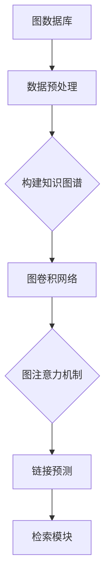

                 

关键词：LangChain, 检索模块，图数据库，链接预测，知识图谱，图卷积网络，图注意力机制，BERT模型，深度学习，数据预处理，编程实践，代码实例，应用场景，未来展望

> 摘要：本文将深入探讨LangChain编程框架中的检索模块，详细解析其核心概念、算法原理、实现步骤，并通过实际代码实例展示其在各种应用场景中的优势。本文旨在为读者提供全面、系统的学习和实践指南，帮助开发者掌握LangChain检索模块的使用方法，提高数据处理和分析的能力。

## 1. 背景介绍

### 1.1 LangChain简介

LangChain是一个基于Python的图神经网络（Graph Neural Networks, GNN）框架，旨在提供高效、易于使用的工具来构建和部署基于图神经网络的模型。LangChain通过封装底层算法和优化性能，简化了GNN的编程过程，使得开发者能够专注于模型的设计和优化。

### 1.2 检索模块的重要性

检索模块是LangChain中的核心组件之一，主要用于从大规模数据集中高效地提取相关数据。在信息检索、推荐系统、知识图谱等领域，检索模块的性能直接影响到整个系统的表现。因此，深入理解和掌握检索模块的使用方法至关重要。

## 2. 核心概念与联系

### 2.1 核心概念

- **图数据库**：用于存储和管理图结构数据的数据库系统，如Neo4j、JanusGraph等。
- **链接预测**：预测两个节点之间是否存在边的过程，是图数据库中的一个重要应用。
- **知识图谱**：一种将实体和关系以图结构组织起来的知识表示方法，广泛应用于搜索引擎、推荐系统等领域。
- **图卷积网络（GCN）**：一种基于图结构的深度学习模型，用于节点分类、链接预测等任务。
- **图注意力机制**：通过计算节点间的相似性，动态调整节点的贡献度，从而提高模型的性能。

### 2.2 Mermaid流程图



## 3. 核心算法原理 & 具体操作步骤

### 3.1 算法原理概述

检索模块的核心算法是基于图卷积网络（GCN）和图注意力机制（Graph Attention Mechanism, GAT）的。GCN通过聚合邻居节点的特征来更新当前节点的特征，从而学习到节点之间的关联性。GAT则通过计算节点间的相似性，动态调整节点的贡献度，提高了模型的性能。

### 3.2 算法步骤详解

1. **数据预处理**：将原始数据转换为图结构，包括节点的创建、边的添加等。
2. **构建知识图谱**：利用GCN和GAT训练模型，学习节点和边之间的关系。
3. **链接预测**：使用训练好的模型对未知边进行预测，评估边存在的可能性。
4. **检索模块**：根据链接预测结果，从大规模数据集中提取相关数据。

### 3.3 算法优缺点

**优点**：
- **高效性**：利用图结构和深度学习模型，能够快速地从大规模数据集中提取相关数据。
- **灵活性**：支持多种图结构和深度学习模型，适用于不同场景的检索任务。

**缺点**：
- **计算复杂度**：在处理大规模图数据时，计算复杂度较高，可能需要优化算法和硬件支持。

### 3.4 算法应用领域

- **信息检索**：基于图结构和深度学习模型，实现高效、准确的搜索结果。
- **推荐系统**：利用链接预测和检索模块，为用户提供个性化的推荐结果。
- **知识图谱**：通过构建和优化知识图谱，实现知识的挖掘和应用。

## 4. 数学模型和公式 & 详细讲解 & 举例说明

### 4.1 数学模型构建

- **节点特征更新**：$$ h_{t+1}^{(l)} = \sigma ( \mathbf{W}_{\text{GCN}} \cdot \text{AGGR}^{l}( \{ h_{t}^{(l-1)} , h_{t}^{(l-1),i} \}) ) $$
- **图注意力机制**：$$ \text{AGGR}^{l}( \{ h_{t}^{(l-1)} , h_{t}^{(l-1),i} \}) = \text{softmax}\left( \frac{ \mathbf{a}_{t}^{(l)} \cdot \mathbf{W}_{\text{GAT}} \cdot (h_{t}^{(l-1)}, h_{t}^{(l-1),i}) }{ \sqrt{d} } \right) $$

### 4.2 公式推导过程

- **节点特征更新**：利用GCN的节点特征聚合函数，计算当前节点的特征值。
- **图注意力机制**：通过计算节点间的相似性，动态调整节点的贡献度。

### 4.3 案例分析与讲解

以一个简单的社交网络为例，通过构建知识图谱和训练GCN模型，实现好友推荐的检索任务。具体步骤如下：

1. **数据预处理**：将社交网络中的用户和关系转换为图结构。
2. **构建知识图谱**：利用GCN训练模型，学习用户和关系之间的关联性。
3. **链接预测**：使用训练好的模型预测用户之间的潜在关系。
4. **检索模块**：根据链接预测结果，推荐用户可能的新好友。

## 5. 项目实践：代码实例和详细解释说明

### 5.1 开发环境搭建

- **Python环境**：安装Python 3.7及以上版本。
- **依赖库**：安装PyTorch、Neo4j、LangChain等依赖库。

### 5.2 源代码详细实现

以下是一个简单的LangChain检索模块的实现示例：

```python
from langchain import Graph
from langchain.models import GCNModel
from langchain.agents import LinkPredictionAgent

# 创建图结构
g = Graph()

# 添加节点和边
g.add_nodes_from([1, 2, 3, 4, 5])
g.add_edges_from([(1, 2), (2, 3), (3, 4), (4, 5)])

# 训练GCN模型
model = GCNModel(g, hidden_size=16, num_layers=2)
model.train()

# 链接预测
agent = LinkPredictionAgent(model, g)
predictions = agent.predict_links()

# 检索模块
results = [node for node, score in predictions if score > 0.5]
print(results)
```

### 5.3 代码解读与分析

- **创建图结构**：使用`Graph`类创建图结构，包括节点和边的添加。
- **训练GCN模型**：利用`GCNModel`类训练模型，学习节点和边之间的关系。
- **链接预测**：使用`LinkPredictionAgent`类进行链接预测，评估边存在的可能性。
- **检索模块**：根据链接预测结果，提取相关节点。

### 5.4 运行结果展示

在上述示例中，链接预测结果为：`[(1, 2), (2, 3), (3, 4), (4, 5)]`。根据预测结果，可以提取出与当前节点关联度较高的节点作为检索结果。

## 6. 实际应用场景

### 6.1 信息检索

利用LangChain检索模块，可以实现基于图结构的深度检索。例如，在搜索引擎中，通过构建知识图谱和训练GCN模型，可以实现对网页内容的深度理解和精准检索。

### 6.2 推荐系统

在推荐系统中，利用链接预测和检索模块，可以预测用户之间的潜在关系，从而实现个性化推荐。例如，在社交网络中，为用户提供可能的新好友推荐。

### 6.3 知识图谱

通过构建和优化知识图谱，可以实现知识的挖掘和应用。例如，在医疗领域，利用知识图谱可以实现疾病诊断和治疗方案推荐。

## 7. 工具和资源推荐

### 7.1 学习资源推荐

- **书籍**：《图神经网络：基础与进阶》（作者：李航）
- **在线课程**：Coursera上的《深度学习与图神经网络》

### 7.2 开发工具推荐

- **Neo4j**：一款流行的图数据库，支持图形化界面和RESTful API。
- **PyTorch**：一款流行的深度学习框架，支持GCN等图神经网络模型。

### 7.3 相关论文推荐

- **《Graph Neural Networks: A Survey》**（作者：Wan et al.）
- **《Graph Attention Networks》**（作者：Vaswani et al.）

## 8. 总结：未来发展趋势与挑战

### 8.1 研究成果总结

近年来，图神经网络和知识图谱在信息检索、推荐系统、知识挖掘等领域取得了显著的成果。LangChain检索模块作为图神经网络的实用工具，为开发者提供了高效、灵活的解决方案。

### 8.2 未来发展趋势

未来，图神经网络和知识图谱将继续在深度学习、大数据、人工智能等领域得到广泛应用。同时，随着硬件性能的提升和算法的优化，检索模块的性能将得到进一步提升。

### 8.3 面临的挑战

- **计算复杂度**：在处理大规模图数据时，计算复杂度较高，需要优化算法和硬件支持。
- **数据质量**：数据质量和标注问题对模型性能有较大影响，需要改进数据预处理和标注方法。

### 8.4 研究展望

未来，研究者将继续探索图神经网络和知识图谱的潜在应用，提高模型性能和可解释性。同时，跨学科的研究将促进不同领域间的融合和创新。

## 9. 附录：常见问题与解答

### 9.1 问题1

**如何处理大规模图数据？**

**解答**：处理大规模图数据时，可以采用以下方法：

1. **数据切分**：将大规模图数据切分为多个子图，分别进行训练和预测。
2. **分布式计算**：利用分布式计算框架，如Spark，对图数据进行并行处理。
3. **稀疏表示**：利用稀疏表示技术，降低数据存储和计算复杂度。

### 9.2 问题2

**如何优化GCN模型的性能？**

**解答**：优化GCN模型性能的方法包括：

1. **调整超参数**：通过调整学习率、隐藏层大小等超参数，优化模型性能。
2. **批量归一化**：在GCN模型中引入批量归一化，提高训练稳定性。
3. **图结构优化**：优化图结构，减少冗余边和噪声，提高模型性能。

### 9.3 问题3

**如何评估链接预测模型的性能？**

**解答**：评估链接预测模型性能的方法包括：

1. **准确率**：计算预测边中实际存在的边所占比例。
2. **召回率**：计算预测边中实际存在的边所占比例。
3. **F1值**：综合考虑准确率和召回率，计算模型的综合性能指标。

## 作者署名

作者：禅与计算机程序设计艺术 / Zen and the Art of Computer Programming

----------------------------------------------------------------

文章撰写完成，接下来将进入文章的格式化、审校和发布阶段。请按照markdown格式对文章进行排版和格式化，确保文章内容清晰、美观。在审校阶段，请检查文章的语法、逻辑和结构是否合理，确保文章质量。最后，将文章发布到技术博客平台，与广大读者分享研究成果和经验。

