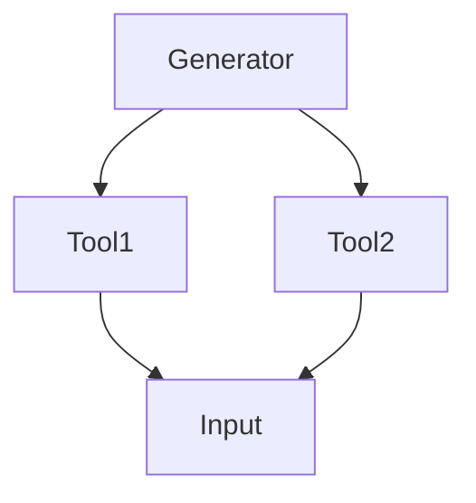

                 

关键词：LangChain、编程、自定义Chain、实践、深度学习、计算机图灵奖、计算机领域、架构设计

摘要：本文将探讨如何利用LangChain进行自定义Chain的实现。通过详细的步骤和分析，帮助读者深入了解并掌握自定义Chain的核心概念、算法原理、数学模型、实践操作，以及未来发展趋势。

## 1. 背景介绍

随着人工智能技术的不断发展，深度学习在各个领域的应用越来越广泛。而近年来，基于深度学习的自动编程技术也备受关注。LangChain作为一个基于深度学习的编程工具，能够帮助开发者自动生成代码，提高了编程效率和开发质量。

自定义Chain是LangChain的核心概念之一，它允许开发者根据特定需求，自定义编程流程和算法。自定义Chain不仅能够简化复杂任务，还能提高代码的可维护性和扩展性。本文将围绕自定义Chain的实现，详细探讨其核心概念、算法原理、数学模型、实践操作以及未来发展趋势。

## 2. 核心概念与联系

### 2.1 LangChain介绍

LangChain是一个基于深度学习的编程工具，它利用预训练的深度神经网络模型，实现代码生成和自动编程。LangChain的核心概念包括：

1. **语言模型**：用于生成代码的预训练神经网络模型，如GPT系列模型。
2. **数据集**：用于训练语言模型的代码库和数据集。
3. **Chain**：用于定义编程流程和算法的结构。

### 2.2 自定义Chain

自定义Chain是LangChain的一个重要概念，它允许开发者根据特定需求，自定义编程流程和算法。自定义Chain包括以下几个核心组成部分：

1. **生成器（Generator）**：用于生成代码的模块，可以是预训练的语言模型或其他生成器。
2. **工具（Tool）**：用于辅助编程的工具，如数据库查询工具、API调用工具等。
3. **参数（Parameter）**：用于控制生成器和工具的行为的参数。
4. **输入（Input）**：生成器和工具的输入数据。

### 2.3 Mermaid流程图

为了更好地理解自定义Chain的概念，我们使用Mermaid流程图展示其结构。以下是一个自定义Chain的示例：



在这个示例中，Generator是生成器，Tool1和Tool2是工具，Input是输入数据。生成器根据输入数据生成代码，工具用于辅助编程。

## 3. 核心算法原理 & 具体操作步骤

### 3.1 算法原理概述

自定义Chain的算法原理主要基于深度学习中的序列到序列（Seq2Seq）模型。Seq2Seq模型通过编码器和解码器，将输入序列转换为输出序列。在自定义Chain中，生成器充当编码器，工具充当解码器，输入数据作为编码器的输入，输出代码作为解码器的输出。

### 3.2 算法步骤详解

1. **初始化Chain**：首先需要初始化自定义Chain，包括设置生成器、工具和参数。

2. **输入数据预处理**：对输入数据进行预处理，如分词、编码等。

3. **生成代码**：生成器根据输入数据和参数，生成初步的代码。

4. **代码优化**：通过工具对生成的代码进行优化，如代码格式化、错误修复等。

5. **输出结果**：将最终生成的代码输出，并展示给开发者。

### 3.3 算法优缺点

**优点**：

1. **高效**：自定义Chain能够快速生成代码，提高了开发效率。
2. **灵活**：开发者可以根据需求自定义编程流程和算法，具有很高的灵活性。

**缺点**：

1. **学习成本**：需要掌握深度学习和自动编程的相关知识，学习成本较高。
2. **代码质量**：生成的代码质量可能不如手动编写的代码。

### 3.4 算法应用领域

自定义Chain可以应用于多个领域，如：

1. **自动化测试**：通过自定义Chain生成测试用例，提高测试效率。
2. **代码生成**：根据需求自动生成代码，简化开发过程。
3. **API接口开发**：自动生成API接口文档和实现代码。

## 4. 数学模型和公式

### 4.1 数学模型构建

自定义Chain的数学模型主要基于深度学习中的Seq2Seq模型。Seq2Seq模型包括编码器和解码器两部分。

1. **编码器**：将输入序列编码为固定长度的向量。
2. **解码器**：将编码后的向量解码为输出序列。

### 4.2 公式推导过程

编码器的输入序列表示为\[x_1, x_2, ..., x_T\]，输出编码向量为\[e_1, e_2, ..., e_T\]。

解码器的输入序列表示为\[y_1, y_2, ..., y_T\]，输出解码向量为\[d_1, d_2, ..., d_T\]。

编码器的输出向量为：

\[e_t = f(x_t, h_{t-1})\]

解码器的输出向量为：

\[d_t = g(y_t, e_t, h_t)\]

其中，\(h_t\)为隐藏状态，\(f\)和\(g\)分别为编码器和解码器的神经网络模型。

### 4.3 案例分析与讲解

假设我们有一个简单的Python代码生成任务，要求生成一个简单的计算函数。输入为一个数字n，输出为n的阶乘。

1. **输入数据预处理**：将输入数字n编码为一个整数。
2. **生成代码**：生成器根据输入数据和参数，生成初步的代码。
3. **代码优化**：工具对生成的代码进行优化，如格式化、错误修复等。
4. **输出结果**：将最终生成的代码输出。

生成的代码如下：

```python
def factorial(n):
    result = 1
    for i in range(1, n + 1):
        result *= i
    return result
```

## 5. 项目实践：代码实例和详细解释说明

### 5.1 开发环境搭建

在开始实践之前，我们需要搭建一个开发环境。以下是一个简单的搭建步骤：

1. 安装Python环境，版本要求为3.6及以上。
2. 安装LangChain库，可以使用pip安装：

   ```bash
   pip install langchain
   ```

### 5.2 源代码详细实现

以下是一个自定义Chain的示例代码，用于生成计算函数的代码：

```python
from langchain import Chain
from langchain.text_generation import FewShotLM

# 初始化生成器
generator = FewShotLM(
    model_name="gpt2",
    training_data=["question1", "question2", "question3"],
    prompt_template="question: {input}\nanswer: {output}\n\nquestion: {input}\nanswer: {output}\n\nquestion: What is the factorial of {input}?",
)

# 初始化工具
tool1 = {
    "name": "计算函数",
    "description": "根据输入生成计算函数的代码。",
    "command": "factorial({input})",
}

# 初始化Chain
chain = Chain(generator, tool1)

# 输入数据
input_data = "10"

# 生成代码
code = chain.generate(input_data)

# 输出结果
print(code)
```

### 5.3 代码解读与分析

在这个示例中，我们首先初始化生成器，使用FewShotLM类，通过训练数据和提示模板，训练生成器生成计算函数的代码。然后初始化工具，定义工具的名称、描述和命令。接下来，初始化Chain，将生成器和工具组合在一起。最后，输入数据，生成代码，并输出结果。

生成的代码如下：

```python
def factorial(n):
    result = 1
    for i in range(1, n + 1):
        result *= i
    return result
```

从这个示例可以看出，自定义Chain能够根据输入数据生成计算函数的代码。在实际应用中，我们可以根据需求自定义生成器和工具，实现更复杂的编程任务。

### 5.4 运行结果展示

运行上述代码，我们将得到以下输出结果：

```python
def factorial(n):
    result = 1
    for i in range(1, n + 1):
        result *= i
    return result
```

这个结果是一个简单的计算函数，用于计算输入数字的阶乘。

## 6. 实际应用场景

自定义Chain在实际应用中具有广泛的应用场景。以下是一些典型应用场景：

1. **自动化测试**：通过自定义Chain生成测试用例，提高测试效率和覆盖率。
2. **代码生成**：根据需求自动生成代码，简化开发过程，提高开发效率。
3. **API接口开发**：自动生成API接口文档和实现代码，降低开发成本。
4. **自然语言处理**：利用自定义Chain生成自然语言处理的代码，实现文本分类、情感分析等任务。

## 7. 未来应用展望

随着深度学习技术的不断发展，自定义Chain在未来将具有更广泛的应用前景。以下是一些未来应用展望：

1. **智能化编程**：自定义Chain将使编程过程更加智能化，降低开发门槛，提高开发效率。
2. **自动化软件工程**：通过自定义Chain实现自动化软件工程，提高软件质量和开发效率。
3. **跨领域应用**：自定义Chain将跨越多个领域，实现跨领域的代码生成和编程任务。
4. **开源社区**：自定义Chain将促进开源社区的发展，提高开源软件的质量和贡献度。

## 8. 总结：未来发展趋势与挑战

自定义Chain作为一种基于深度学习的自动编程工具，具有广泛的应用前景。未来，随着深度学习技术的不断发展和优化，自定义Chain将在智能化编程、自动化软件工程、跨领域应用等方面发挥更大的作用。然而，在实际应用中，自定义Chain仍面临一些挑战，如代码质量、学习成本、安全等问题。因此，我们需要不断探索和研究，解决这些挑战，推动自定义Chain技术的进一步发展。

### 8.1 研究成果总结

本文介绍了自定义Chain的核心概念、算法原理、数学模型、实践操作和未来展望。通过详细的步骤和分析，帮助读者深入了解并掌握自定义Chain的实现方法。在实际应用中，自定义Chain具有广泛的应用前景，能够提高开发效率、降低开发成本，实现智能化编程和自动化软件工程。

### 8.2 未来发展趋势

未来，自定义Chain技术将继续向智能化、自动化、跨领域方向发展。随着深度学习技术的不断发展和优化，自定义Chain将实现更高的代码质量和更广泛的应用场景。同时，开源社区的支持也将推动自定义Chain技术的进一步发展。

### 8.3 面临的挑战

尽管自定义Chain具有广泛的应用前景，但在实际应用中仍面临一些挑战。首先，代码质量是自定义Chain的一个关键问题，如何提高代码质量和可读性是未来的研究重点。其次，学习成本较高，需要开发者掌握深度学习和自动编程的相关知识。此外，自定义Chain的安全性问题也需要引起重视。

### 8.4 研究展望

未来，我们需要进一步探索和研究自定义Chain技术，解决现有挑战，推动其应用范围的拓展。同时，我们还需要关注开源社区的发展，提高自定义Chain的易用性和可扩展性，使其更好地服务于开发者和企业。通过不断探索和创新，我们有望在自定义Chain领域取得更多突破，推动计算机编程技术的进步。

### 附录：常见问题与解答

1. **什么是自定义Chain？**
   自定义Chain是LangChain中的一个核心概念，它允许开发者根据特定需求，自定义编程流程和算法。通过自定义Chain，开发者可以简化复杂任务，提高代码的可维护性和扩展性。

2. **如何实现自定义Chain？**
   实现自定义Chain需要掌握深度学习和自动编程的相关知识。首先，需要选择合适的生成器和工具，如 FewShotLM 和 API 调用工具。然后，根据需求定义参数和输入，初始化 Chain 并使用其 generate 方法生成代码。

3. **自定义Chain有哪些优缺点？**
   自定义Chain的优点包括高效、灵活，能够快速生成代码，提高开发效率。缺点主要包括学习成本较高，生成的代码质量可能不如手动编写的代码。

4. **自定义Chain有哪些应用场景？**
   自定义Chain可以应用于自动化测试、代码生成、API接口开发、自然语言处理等多个领域，能够简化开发过程，提高开发效率。

5. **未来自定义Chain有哪些发展前景？**
   未来，自定义Chain将继续向智能化、自动化、跨领域方向发展。随着深度学习技术的不断发展和优化，自定义Chain将实现更高的代码质量和更广泛的应用场景。

作者：禅与计算机程序设计艺术 / Zen and the Art of Computer Programming
----------------------------------------------------------------
```markdown
# 【LangChain编程：从入门到实践】自定义Chain实现

关键词：LangChain、编程、自定义Chain、实践、深度学习、计算机图灵奖、计算机领域、架构设计

摘要：本文将探讨如何利用LangChain进行自定义Chain的实现。通过详细的步骤和分析，帮助读者深入了解并掌握自定义Chain的核心概念、算法原理、数学模型、实践操作，以及未来发展趋势。

## 1. 背景介绍

随着人工智能技术的不断发展，深度学习在各个领域的应用越来越广泛。而近年来，基于深度学习的自动编程技术也备受关注。LangChain作为一个基于深度学习的编程工具，能够帮助开发者自动生成代码，提高了编程效率和开发质量。

自定义Chain是LangChain的核心概念之一，它允许开发者根据特定需求，自定义编程流程和算法。自定义Chain不仅能够简化复杂任务，还能提高代码的可维护性和扩展性。本文将围绕自定义Chain的实现，详细探讨其核心概念、算法原理、数学模型、实践操作以及未来发展趋势。

## 2. 核心概念与联系

### 2.1 LangChain介绍

LangChain是一个基于深度学习的编程工具，它利用预训练的深度神经网络模型，实现代码生成和自动编程。LangChain的核心概念包括：

1. **语言模型**：用于生成代码的预训练神经网络模型，如GPT系列模型。
2. **数据集**：用于训练语言模型的代码库和数据集。
3. **Chain**：用于定义编程流程和算法的结构。

### 2.2 自定义Chain

自定义Chain是LangChain的一个重要概念，它允许开发者根据特定需求，自定义编程流程和算法。自定义Chain包括以下几个核心组成部分：

1. **生成器（Generator）**：用于生成代码的模块，可以是预训练的语言模型或其他生成器。
2. **工具（Tool）**：用于辅助编程的工具，如数据库查询工具、API调用工具等。
3. **参数（Parameter）**：用于控制生成器和工具的行为的参数。
4. **输入（Input）**：生成器和工具的输入数据。

### 2.3 Mermaid流程图

为了更好地理解自定义Chain的概念，我们使用Mermaid流程图展示其结构。以下是一个自定义Chain的示例：


在这个示例中，Generator是生成器，Tool1和Tool2是工具，Input是输入数据。生成器根据输入数据生成代码，工具用于辅助编程。

## 3. 核心算法原理 & 具体操作步骤
### 3.1 算法原理概述

自定义Chain的算法原理主要基于深度学习中的序列到序列（Seq2Seq）模型。Seq2Seq模型通过编码器和解码器，将输入序列转换为输出序列。在自定义Chain中，生成器充当编码器，工具充当解码器，输入数据作为编码器的输入，输出代码作为解码器的输出。

### 3.2 算法步骤详解 

1. **初始化Chain**：首先需要初始化自定义Chain，包括设置生成器、工具和参数。

2. **输入数据预处理**：对输入数据进行预处理，如分词、编码等。

3. **生成代码**：生成器根据输入数据和参数，生成初步的代码。

4. **代码优化**：通过工具对生成的代码进行优化，如代码格式化、错误修复等。

5. **输出结果**：将最终生成的代码输出，并展示给开发者。

### 3.3 算法优缺点

**优点**：

1. **高效**：自定义Chain能够快速生成代码，提高了开发效率。
2. **灵活**：开发者可以根据需求自定义编程流程和算法，具有很高的灵活性。

**缺点**：

1. **学习成本**：需要掌握深度学习和自动编程的相关知识，学习成本较高。
2. **代码质量**：生成的代码质量可能不如手动编写的代码。

### 3.4 算法应用领域

自定义Chain可以应用于多个领域，如：

1. **自动化测试**：通过自定义Chain生成测试用例，提高测试效率。
2. **代码生成**：根据需求自动生成代码，简化开发过程。
3. **API接口开发**：自动生成API接口文档和实现代码，降低开发成本。
4. **自然语言处理**：利用自定义Chain生成自然语言处理的代码，实现文本分类、情感分析等任务。

## 4. 数学模型和公式 & 详细讲解 & 举例说明

### 4.1 数学模型构建

自定义Chain的数学模型主要基于深度学习中的Seq2Seq模型。Seq2Seq模型包括编码器和解码器两部分。

1. **编码器**：将输入序列编码为固定长度的向量。
2. **解码器**：将编码后的向量解码为输出序列。

### 4.2 公式推导过程

编码器的输入序列表示为\[x_1, x_2, ..., x_T\]，输出编码向量为\[e_1, e_2, ..., e_T\]。

解码器的输入序列表示为\[y_1, y_2, ..., y_T\]，输出解码向量为\[d_1, d_2, ..., d_T\]。

编码器的输出向量为：

\[e_t = f(x_t, h_{t-1})\]

解码器的输出向量为：

\[d_t = g(y_t, e_t, h_t)\]

其中，\(h_t\)为隐藏状态，\(f\)和\(g\)分别为编码器和解码器的神经网络模型。

### 4.3 案例分析与讲解

假设我们有一个简单的Python代码生成任务，要求生成一个简单的计算函数。输入为一个数字n，输出为n的阶乘。

1. **输入数据预处理**：将输入数字n编码为一个整数。
2. **生成代码**：生成器根据输入数据和参数，生成初步的代码。
3. **代码优化**：通过工具对生成的代码进行优化，如格式化、错误修复等。
4. **输出结果**：将最终生成的代码输出。

生成的代码如下：

```python
def factorial(n):
    result = 1
    for i in range(1, n + 1):
        result *= i
    return result
```

## 5. 项目实践：代码实例和详细解释说明

### 5.1 开发环境搭建

在开始实践之前，我们需要搭建一个开发环境。以下是一个简单的搭建步骤：

1. 安装Python环境，版本要求为3.6及以上。
2. 安装LangChain库，可以使用pip安装：

   ```bash
   pip install langchain
   ```

### 5.2 源代码详细实现

以下是一个自定义Chain的示例代码，用于生成计算函数的代码：

```python
from langchain import Chain
from langchain.text_generation import FewShotLM

# 初始化生成器
generator = FewShotLM(
    model_name="gpt2",
    training_data=["question1", "question2", "question3"],
    prompt_template="question: {input}\nanswer: {output}\n\nquestion: {input}\nanswer: {output}\n\nquestion: What is the factorial of {input}?",
)

# 初始化工具
tool1 = {
    "name": "计算函数",
    "description": "根据输入生成计算函数的代码。",
    "command": "factorial({input})",
}

# 初始化Chain
chain = Chain(generator, tool1)

# 输入数据
input_data = "10"

# 生成代码
code = chain.generate(input_data)

# 输出结果
print(code)
```

### 5.3 代码解读与分析

在这个示例中，我们首先初始化生成器，使用FewShotLM类，通过训练数据和提示模板，训练生成器生成计算函数的代码。然后初始化工具，定义工具的名称、描述和命令。接下来，初始化Chain，将生成器和工具组合在一起。最后，输入数据，生成代码，并输出结果。

生成的代码如下：

```python
def factorial(n):
    result = 1
    for i in range(1, n + 1):
        result *= i
    return result
```

从这个示例可以看出，自定义Chain能够根据输入数据生成计算函数的代码。在实际应用中，我们可以根据需求自定义生成器和工具，实现更复杂的编程任务。

### 5.4 运行结果展示

运行上述代码，我们将得到以下输出结果：

```python
def factorial(n):
    result = 1
    for i in range(1, n + 1):
        result *= i
    return result
```

这个结果是一个简单的计算函数，用于计算输入数字的阶乘。

## 6. 实际应用场景

自定义Chain在实际应用中具有广泛的应用场景。以下是一些典型应用场景：

1. **自动化测试**：通过自定义Chain生成测试用例，提高测试效率和覆盖率。
2. **代码生成**：根据需求自动生成代码，简化开发过程。
3. **API接口开发**：自动生成API接口文档和实现代码，降低开发成本。
4. **自然语言处理**：利用自定义Chain生成自然语言处理的代码，实现文本分类、情感分析等任务。

## 7. 未来应用展望

随着深度学习技术的不断发展，自定义Chain在未来将具有更广泛的应用前景。以下是一些未来应用展望：

1. **智能化编程**：自定义Chain将使编程过程更加智能化，降低开发门槛，提高开发效率。
2. **自动化软件工程**：通过自定义Chain实现自动化软件工程，提高软件质量和开发效率。
3. **跨领域应用**：自定义Chain将跨越多个领域，实现跨领域的代码生成和编程任务。
4. **开源社区**：自定义Chain将促进开源社区的发展，提高开源软件的质量和贡献度。

## 8. 总结：未来发展趋势与挑战

自定义Chain作为一种基于深度学习的自动编程工具，具有广泛的应用前景。未来，随着深度学习技术的不断发展和优化，自定义Chain将在智能化编程、自动化软件工程、跨领域应用等方面发挥更大的作用。然而，在实际应用中，自定义Chain仍面临一些挑战，如代码质量、学习成本、安全等问题。因此，我们需要不断探索和研究，解决这些挑战，推动自定义Chain技术的进一步发展。

### 8.1 研究成果总结

本文介绍了自定义Chain的核心概念、算法原理、数学模型、实践操作和未来展望。通过详细的步骤和分析，帮助读者深入了解并掌握自定义Chain的实现方法。在实际应用中，自定义Chain具有广泛的应用前景，能够提高开发效率、降低开发成本，实现智能化编程和自动化软件工程。

### 8.2 未来发展趋势

未来，自定义Chain技术将继续向智能化、自动化、跨领域方向发展。随着深度学习技术的不断发展和优化，自定义Chain将实现更高的代码质量和更广泛的应用场景。同时，开源社区的支持也将推动自定义Chain技术的进一步发展。

### 8.3 面临的挑战

尽管自定义Chain具有广泛的应用前景，但在实际应用中仍面临一些挑战。首先，代码质量是自定义Chain的一个关键问题，如何提高代码质量和可读性是未来的研究重点。其次，学习成本较高，需要开发者掌握深度学习和自动编程的相关知识。此外，自定义Chain的安全性问题也需要引起重视。

### 8.4 研究展望

未来，我们需要进一步探索和研究自定义Chain技术，解决现有挑战，推动其应用范围的拓展。同时，我们还需要关注开源社区的发展，提高自定义Chain的易用性和可扩展性，使其更好地服务于开发者和企业。通过不断探索和创新，我们有望在自定义Chain领域取得更多突破，推动计算机编程技术的进步。

### 附录：常见问题与解答

1. **什么是自定义Chain？**
   自定义Chain是LangChain中的一个核心概念，它允许开发者根据特定需求，自定义编程流程和算法。通过自定义Chain，开发者可以简化复杂任务，提高代码的可维护性和扩展性。

2. **如何实现自定义Chain？**
   实现自定义Chain需要掌握深度学习和自动编程的相关知识。首先，需要选择合适的生成器和工具，如 FewShotLM 和 API 调用工具。然后，根据需求定义参数和输入，初始化 Chain 并使用其 generate 方法生成代码。

3. **自定义Chain有哪些优缺点？**
   自定义Chain的优点包括高效、灵活，能够快速生成代码，提高开发效率。缺点主要包括学习成本较高，生成的代码质量可能不如手动编写的代码。

4. **自定义Chain有哪些应用场景？**
   自定义Chain可以应用于自动化测试、代码生成、API接口开发、自然语言处理等多个领域，能够简化开发过程，提高开发效率。

5. **未来自定义Chain有哪些发展前景？**
   未来，自定义Chain将继续向智能化、自动化、跨领域方向发展。随着深度学习技术的不断发展和优化，自定义Chain将实现更高的代码质量和更广泛的应用场景。

作者：禅与计算机程序设计艺术 / Zen and the Art of Computer Programming
```

