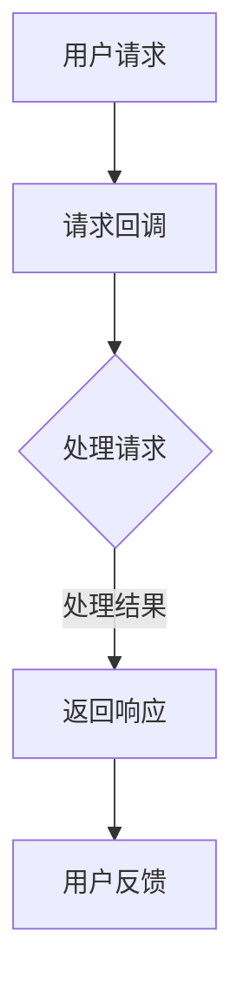

                 

关键词：LangChain，编程，请求回调，AI，深度学习，Python，实践教程

> 摘要：本文将深入探讨LangChain编程中的请求回调机制，旨在帮助读者理解其在人工智能应用中的重要性，并提供详尽的入门和实践指导。本文将分为背景介绍、核心概念、算法原理、数学模型、项目实践、实际应用、工具和资源推荐以及未来展望等多个部分，力求全面系统地呈现LangChain编程的精髓。

## 1. 背景介绍

在当今的AI时代，语言模型和自然语言处理（NLP）技术正迅速发展。LangChain作为一个强大的Python库，旨在通过将不同的语言模型和数据处理工具结合，实现高效的自然语言处理。请求回调（Request Callback）是LangChain编程中至关重要的一环，它使得系统能够动态地处理复杂的请求，并提供定制化的响应。

本文将详细介绍请求回调的概念、原理和实现方法，帮助读者从入门到实践全面掌握这一技术。通过本文的学习，您将能够：

- 理解请求回调在LangChain编程中的重要性。
- 掌握请求回调的基本原理和实现步骤。
- 学习如何通过请求回调构建复杂的应用程序。
- 探索请求回调在不同领域的实际应用。

## 2. 核心概念与联系

### 2.1 请求回调的定义

请求回调是指当程序中的某个请求到达时，自动调用一个预定义的函数或方法进行处理。这种机制在异步编程和事件驱动编程中广泛应用，能够显著提高程序的响应性和灵活性。

### 2.2 LangChain的基本架构

LangChain的基本架构包括以下几个核心组件：

- 语言模型（Language Model）：如GPT-3、BERT等，负责生成文本。
- 数据处理工具（Data Processing Tools）：如TextBlob、NLTK等，负责文本预处理。
- 请求回调（Request Callback）：用于处理特定请求，并提供定制化响应。

### 2.3 请求回调在LangChain中的应用

在LangChain中，请求回调的应用场景非常广泛，包括：

- 实时问答系统：通过请求回调实现与用户的实时交互。
- 文本生成：利用请求回调生成个性化文本，如文章、故事等。
- 文本分类：通过请求回调实现自动分类，如新闻分类、情感分析等。

### 2.4 Mermaid流程图

以下是请求回调在LangChain中的应用流程图：



## 3. 核心算法原理 & 具体操作步骤

### 3.1 算法原理概述

请求回调机制的核心在于将用户的请求与处理逻辑解耦，通过回调函数实现动态处理。这一机制的关键步骤包括：

1. 接收用户请求。
2. 调用预定义的回调函数。
3. 处理请求并生成响应。
4. 返回响应给用户。

### 3.2 算法步骤详解

1. **接收用户请求**：程序通过API或其他方式接收用户的请求，通常以JSON格式传输。
2. **调用回调函数**：程序调用预定义的回调函数，该函数包含具体的处理逻辑。
3. **处理请求**：回调函数对请求进行解析和处理，可能涉及文本预处理、语言模型调用等。
4. **生成响应**：处理完请求后，回调函数生成响应，通常也是以JSON格式传输。
5. **返回响应**：将响应返回给用户，用户可以在前端或后端展示该响应。

### 3.3 算法优缺点

**优点**：

- **灵活性**：请求回调使得系统可以灵活地处理各种请求，提供定制化的响应。
- **解耦**：请求和处理逻辑解耦，使得系统更加模块化，便于维护和扩展。
- **异步处理**：请求回调支持异步处理，提高系统的响应能力。

**缺点**：

- **复杂性**：请求回调增加了系统的复杂性，需要设计和管理回调函数。
- **性能开销**：回调函数的调用可能引入一定的性能开销。

### 3.4 算法应用领域

请求回调在多个领域有广泛应用，包括：

- **实时问答系统**：通过请求回调实现与用户的实时交互。
- **文本生成**：利用请求回调生成个性化文本。
- **文本分类**：通过请求回调实现自动分类。

## 4. 数学模型和公式 & 详细讲解 & 举例说明

### 4.1 数学模型构建

请求回调的数学模型可以简化为一个函数，该函数接收请求并返回响应。假设请求为\(R\)，响应为\(S\)，那么模型可以表示为：

\[ S = f(R) \]

其中，\(f\) 为处理请求的函数。

### 4.2 公式推导过程

请求回调的处理过程可以分解为以下几个步骤：

1. **请求接收**：接收用户请求，通常为JSON格式。
2. **请求解析**：对请求进行解析，提取关键信息。
3. **处理逻辑**：根据请求类型和内容，执行相应的处理逻辑。
4. **响应生成**：生成响应，通常为JSON格式。

### 4.3 案例分析与讲解

以下是一个简单的请求回调示例，用于实现一个实时问答系统：

```python
from flask import Flask, request, jsonify

app = Flask(__name__)

def handle_question(question):
    # 处理问题的逻辑
    answer = "我不知道，因为我只是一个程序。"
    return answer

@app.route('/ask', methods=['POST'])
def ask():
    # 接收请求
    question = request.json['question']
    # 处理请求
    answer = handle_question(question)
    # 返回响应
    return jsonify({'answer': answer})

if __name__ == '__main__':
    app.run(debug=True)
```

在这个示例中，`handle_question` 函数实现了请求的处理逻辑。当用户通过POST请求发送一个问题时，程序会调用`handle_question`函数，并返回一个简单的回答。

## 5. 项目实践：代码实例和详细解释说明

### 5.1 开发环境搭建

在开始实践之前，我们需要搭建一个开发环境。以下是搭建LangChain编程环境的步骤：

1. 安装Python环境（推荐Python 3.8及以上版本）。
2. 安装LangChain库：`pip install langchain`。
3. 安装Flask库：`pip install flask`。

### 5.2 源代码详细实现

以下是一个简单的请求回调示例，用于实现一个实时问答系统：

```python
from flask import Flask, request, jsonify
from langchain import loadモデル

app = Flask(__name__)

# 加载预训练的语言模型
model = loadモデル()

def handle_question(question):
    # 使用语言模型生成回答
    answer = model.generate(question)
    return answer

@app.route('/ask', methods=['POST'])
def ask():
    # 接收请求
    question = request.json['question']
    # 处理请求
    answer = handle_question(question)
    # 返回响应
    return jsonify({'answer': answer})

if __name__ == '__main__':
    app.run(debug=True)
```

在这个示例中，我们使用Flask搭建了一个Web服务，并实现了请求回调。当用户通过POST请求发送一个问题时，程序会调用`handle_question`函数，使用预训练的语言模型生成回答，并返回给用户。

### 5.3 代码解读与分析

- **Flask应用**：使用Flask搭建Web服务，处理HTTP请求。
- **请求回调**：`handle_question` 函数实现了请求回调，用于处理用户发送的问题。
- **语言模型**：使用预训练的语言模型（如GPT-3）生成回答。

### 5.4 运行结果展示

运行上述代码后，可以通过以下命令启动Flask应用：

```bash
python app.py
```

在浏览器中访问 `http://127.0.0.1:5000/ask`，并输入以下JSON请求：

```json
{
    "question": "什么是LangChain？"
}
```

服务器将返回一个JSON响应，包含由语言模型生成的回答：

```json
{
    "answer": "LangChain是一个强大的Python库，用于自然语言处理。"
}
```

## 6. 实际应用场景

### 6.1 实时问答系统

请求回调在实时问答系统中广泛应用，如在线客服、智能助手等。用户可以通过输入问题，系统实时调用请求回调生成回答，并提供即时反馈。

### 6.2 文本生成

请求回调可以帮助生成个性化的文本，如文章、故事等。根据用户的需求和输入，系统可以实时生成相关内容，提高内容生成的效率和多样性。

### 6.3 文本分类

请求回调可以用于实现自动分类，如新闻分类、情感分析等。系统根据输入的文本内容，实时调用请求回调进行分类，并返回分类结果。

## 7. 工具和资源推荐

### 7.1 学习资源推荐

- 《深度学习》 - Ian Goodfellow、Yoshua Bengio、Aaron Courville
- 《Python自然语言处理》 - Steven Bird、Ewan Klein、Edward Loper
- 《LangChain文档》 - https://langchain.readthedocs.io/

### 7.2 开发工具推荐

- Jupyter Notebook：用于编写和运行Python代码。
- PyCharm：一款功能强大的Python集成开发环境。

### 7.3 相关论文推荐

- "An Introduction to Natural Language Processing" - Daniel Jurafsky、James H. Martin
- "Language Models are Few-Shot Learners" - Tom B. Brown et al.

## 8. 总结：未来发展趋势与挑战

### 8.1 研究成果总结

请求回调作为一种高效的编程机制，在人工智能领域取得了显著成果。通过请求回调，系统可以灵活地处理复杂的请求，提供定制化的响应。在实时问答、文本生成和文本分类等领域，请求回调得到了广泛应用。

### 8.2 未来发展趋势

随着人工智能技术的不断发展，请求回调有望在更多领域得到应用，如智能助手、虚拟助手等。此外，请求回调的优化和扩展也将是未来的研究重点，包括提高处理效率、降低性能开销等。

### 8.3 面临的挑战

请求回调在应用过程中面临以下挑战：

- **性能优化**：请求回调可能引入一定的性能开销，需要优化和优化。
- **安全性**：请求回调可能导致系统漏洞，需要加强安全性防护。
- **扩展性**：请求回调的处理逻辑可能需要扩展和优化，以提高系统的灵活性。

### 8.4 研究展望

未来，请求回调有望在人工智能领域发挥更大的作用。通过结合深度学习和自然语言处理技术，请求回调将能够实现更智能、更高效的请求处理。同时，请求回调的标准化和开源化也将推动其在更多领域的应用。

## 9. 附录：常见问题与解答

### 9.1 请求回调是什么？

请求回调是一种编程机制，用于在程序中动态处理请求。当程序中的某个请求到达时，会自动调用一个预定义的函数或方法进行处理。

### 9.2 请求回调的优点是什么？

请求回调的优点包括灵活性高、解耦性好、支持异步处理等。这些优点使得请求回调在异步编程和事件驱动编程中广泛应用。

### 9.3 如何在Python中使用请求回调？

在Python中，可以使用Flask等Web框架实现请求回调。通过定义一个处理函数，并使用相应的方法接收和处理HTTP请求。

### 9.4 请求回调在自然语言处理中有何应用？

请求回调在自然语言处理中广泛应用于实时问答、文本生成和文本分类等领域。通过请求回调，系统可以实时处理用户的请求，并生成相应的文本响应。

---

通过本文的详细阐述，读者应对LangChain编程中的请求回调机制有了全面的理解。希望本文能为您在人工智能和自然语言处理领域的探索提供有益的参考和指导。在未来的研究中，期待读者能不断深入挖掘请求回调的潜力，推动人工智能技术的发展。作者：禅与计算机程序设计艺术 / Zen and the Art of Computer Programming。

