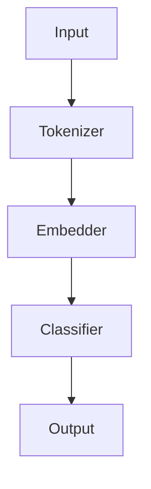
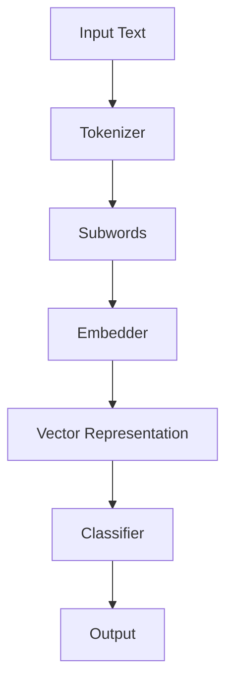

                 

关键词：LangChain，编程，NLP，自然语言处理，输出解析器，文本分析，编程实践，算法原理

## 摘要

本文旨在为您提供一个全面的指导，以深入理解和应用LangChain编程框架。我们将从入门阶段开始，逐步引导您了解LangChain的核心概念、算法原理，并通过具体的项目实践，帮助您掌握如何使用LangChain进行文本输出解析。文章还将涵盖数学模型、公式推导、案例分析和未来应用展望，帮助您全面了解并掌握LangChain编程的核心内容。

## 1. 背景介绍

随着自然语言处理（NLP）技术的不断发展，文本分析已成为众多领域的关键技术之一。而LangChain，作为一个强大的编程框架，为开发者提供了高效、灵活的工具来处理复杂的文本数据。LangChain的核心优势在于其模块化和可扩展性，使得开发者可以轻松地构建和部署各种文本分析应用。

然而，尽管LangChain在文本处理方面表现出色，但如何有效地使用它进行输出解析仍然是一个挑战。本文将重点探讨如何利用LangChain实现文本输出解析，包括算法原理、数学模型、项目实践和实际应用场景。

## 2. 核心概念与联系

### 2.1 核心概念

LangChain是一个基于Python的编程框架，旨在简化自然语言处理的复杂任务。以下是LangChain的一些关键概念：

- **Chain**：LangChain中的基本构建块，代表一个数据处理流程。每个Chain由多个组件（例如，Tokenizer、Classifier、Embedder等）组成，这些组件按照特定的顺序执行，从而实现对文本数据的处理。

- **Component**：Chain中的组件，负责处理特定类型的数据。例如，Tokenizer用于将文本分割成单词或子词，Classifier用于对文本进行分类。

- **Input**：Chain的输入，可以是文本、向量或其他数据类型。

- **Output**：Chain的输出，通常是经过处理后得到的结果，例如分类结果、关键词提取等。

- **ChainRun**：Chain的运行实例，用于执行Chain的处理流程。

### 2.2 LangChain架构

为了更好地理解LangChain的工作原理，我们使用Mermaid流程图来展示其架构：



在这个流程图中，输入文本首先经过Tokenizer组件，将其分割成子词。然后，这些子词被传递给Embedder组件，将它们转换成向量表示。最后，Classifier组件对向量进行分类，得到输出结果。

### 2.3 LangChain与NLP的关系

LangChain的核心在于将NLP任务模块化，使得开发者可以专注于特定组件的实现，而无需担心整体流程的构建。这使得LangChain在NLP领域具有广泛的应用，包括但不限于：

- 文本分类
- 命名实体识别
- 关键词提取
- 情感分析
- 机器翻译

## 3. 核心算法原理 & 具体操作步骤

### 3.1 算法原理概述

LangChain的算法原理主要基于以下组件：

- **Tokenizer**：将文本分割成子词或句子。
- **Embedder**：将子词或句子转换成向量表示。
- **Classifier**：对向量进行分类，得到输出结果。

以下是LangChain算法原理的简单概述：

1. 输入文本经过Tokenizer组件，被分割成子词。
2. 子词被传递给Embedder组件，转换成向量表示。
3. 向量表示被传递给Classifier组件，进行分类得到输出结果。

### 3.2 算法步骤详解

为了更清晰地展示算法步骤，我们使用Mermaid流程图来描述：



### 3.3 算法优缺点

#### 优点

- **模块化**：LangChain将NLP任务分解成多个组件，使得开发者可以专注于特定组件的实现，提高了开发效率。
- **可扩展性**：LangChain支持自定义组件，使得开发者可以根据需求灵活地构建和扩展NLP应用。
- **兼容性**：LangChain支持多种数据格式和框架，方便与其他NLP工具和库集成。

#### 缺点

- **性能**：由于LangChain的模块化设计，每个组件都需要独立执行，可能会增加计算开销。
- **复杂度**：对于初学者来说，理解和使用LangChain可能需要一定的时间和实践。

### 3.4 算法应用领域

LangChain在以下领域具有广泛的应用：

- 文本分类：例如，新闻分类、垃圾邮件过滤等。
- 命名实体识别：例如，人名、地名、组织名的识别。
- 关键词提取：例如，摘要生成、搜索引擎优化等。
- 情感分析：例如，社交媒体情绪分析、产品评论分析等。
- 机器翻译：例如，将一种语言的文本翻译成另一种语言。

## 4. 数学模型和公式 & 详细讲解 & 举例说明

### 4.1 数学模型构建

为了更好地理解LangChain中的算法原理，我们首先需要了解一些基本的数学模型和公式。以下是一个简单的数学模型，用于描述文本分类任务：

- **损失函数**：用于衡量预测结果与实际结果之间的差异。常用的损失函数包括交叉熵损失（Cross-Entropy Loss）和均方误差（Mean Squared Error）。
- **激活函数**：用于将神经网络中的线性组合转换成非线性输出。常用的激活函数包括ReLU（Rectified Linear Unit）和Sigmoid。
- **反向传播**：用于计算神经网络中每个参数的梯度，以便进行模型优化。

以下是这些数学模型的基本公式：

$$
L(y, \hat{y}) = -\frac{1}{m} \sum_{i=1}^{m} [y_i \log(\hat{y}_i) + (1 - y_i) \log(1 - \hat{y}_i)]
$$

$$
\hat{y}_i = \sigma(W \cdot x_i + b)
$$

$$
\frac{\partial L}{\partial W} = \frac{\partial L}{\partial \hat{y}} \cdot \frac{\partial \hat{y}}{\partial W}
$$

其中，$L$ 是损失函数，$y$ 是实际标签，$\hat{y}$ 是预测标签，$m$ 是样本数量，$W$ 是权重矩阵，$x_i$ 是输入特征，$b$ 是偏置。

### 4.2 公式推导过程

为了更好地理解这些公式的推导过程，我们以交叉熵损失函数为例，简要说明其推导过程：

1. **定义损失函数**：交叉熵损失函数表示预测结果与实际结果之间的差异。其公式为：

   $$
   L(y, \hat{y}) = -\frac{1}{m} \sum_{i=1}^{m} [y_i \log(\hat{y}_i) + (1 - y_i) \log(1 - \hat{y}_i)]
   $$

   其中，$y_i$ 表示第 $i$ 个样本的实际标签，$\hat{y}_i$ 表示第 $i$ 个样本的预测标签，$m$ 表示样本数量。

2. **求导**：为了计算损失函数的梯度，我们需要对其求导。对 $L$ 关于 $\hat{y}$ 求导，得到：

   $$
   \frac{\partial L}{\partial \hat{y}} = -\frac{1}{m} \sum_{i=1}^{m} [y_i \cdot \frac{1}{\hat{y}_i} + (1 - y_i) \cdot \frac{1}{1 - \hat{y}_i}]
   $$

3. **链式法则**：为了将损失函数的梯度转换为关于 $W$ 和 $b$ 的梯度，我们需要使用链式法则。首先，对 $\hat{y}$ 关于 $W$ 和 $b$ 求导，得到：

   $$
   \frac{\partial \hat{y}}{\partial W} = \frac{\partial \hat{y}}{\partial z} \cdot \frac{\partial z}{\partial W} = \sigma'(z) \cdot x_i
   $$

   $$
   \frac{\partial \hat{y}}{\partial b} = \frac{\partial \hat{y}}{\partial z} \cdot \frac{\partial z}{\partial b} = \sigma'(z)
   $$

   其中，$z = W \cdot x_i + b$，$\sigma(z)$ 是激活函数。

4. **组合求导**：将上述求导结果组合起来，得到：

   $$
   \frac{\partial L}{\partial W} = \frac{\partial L}{\partial \hat{y}} \cdot \frac{\partial \hat{y}}{\partial W} = -\frac{1}{m} \sum_{i=1}^{m} [y_i \cdot \frac{1}{\hat{y}_i} + (1 - y_i) \cdot \frac{1}{1 - \hat{y}_i}] \cdot \sigma'(z) \cdot x_i
   $$

   $$
   \frac{\partial L}{\partial b} = \frac{\partial L}{\partial \hat{y}} \cdot \frac{\partial \hat{y}}{\partial b} = -\frac{1}{m} \sum_{i=1}^{m} [y_i \cdot \frac{1}{\hat{y}_i} + (1 - y_i) \cdot \frac{1}{1 - \hat{y}_i}] \cdot \sigma'(z)
   $$

### 4.3 案例分析与讲解

为了更好地理解这些数学模型和公式的实际应用，我们来看一个简单的文本分类案例。

假设我们有一个包含100个单词的文本数据集，每个单词都被标记为“正面”或“负面”。我们的目标是使用神经网络模型对新的文本数据进行分类。

1. **数据预处理**：首先，我们需要对文本数据集进行预处理，包括分词、去停用词、词向量化等。这里我们使用Python的NLTK库进行预处理。

2. **模型构建**：接下来，我们构建一个简单的神经网络模型，包括输入层、隐藏层和输出层。输入层接收词向量表示，隐藏层使用ReLU激活函数，输出层使用Sigmoid激活函数进行二分类。

3. **模型训练**：使用交叉熵损失函数和反向传播算法对模型进行训练，优化模型参数。

4. **模型评估**：使用训练集和测试集对模型进行评估，计算准确率、召回率、F1分数等指标。

5. **模型应用**：最后，使用训练好的模型对新的文本数据进行分类。

在这个案例中，我们使用Python的TensorFlow库构建和训练神经网络模型。以下是部分代码：

```python
import tensorflow as tf
from tensorflow.keras.layers import Embedding, LSTM, Dense
from tensorflow.keras.models import Sequential

# 数据预处理
tokenizer = tf.keras.preprocessing.text.Tokenizer()
tokenizer.fit_on_texts(texts)
sequences = tokenizer.texts_to_sequences(texts)
word_index = tokenizer.word_index
max_sequence_length = 100

# 构建模型
model = Sequential()
model.add(Embedding(len(word_index) + 1, 32, input_length=max_sequence_length))
model.add(LSTM(64))
model.add(Dense(1, activation='sigmoid'))

# 编译模型
model.compile(optimizer='rmsprop', loss='binary_crossentropy', metrics=['accuracy'])

# 训练模型
model.fit(sequences, labels, epochs=10, batch_size=32)

# 模型评估
test_sequences = tokenizer.texts_to_sequences(test_texts)
predictions = model.predict(test_sequences)
```

## 5. 项目实践：代码实例和详细解释说明

### 5.1 开发环境搭建

为了进行LangChain编程实践，我们首先需要搭建一个合适的开发环境。以下是开发环境搭建的详细步骤：

1. **安装Python**：访问Python官方网站（https://www.python.org/）下载并安装Python。

2. **安装PyTorch**：使用以下命令安装PyTorch：

   ```
   pip install torch torchvision
   ```

3. **安装LangChain**：使用以下命令安装LangChain：

   ```
   pip install langchain
   ```

### 5.2 源代码详细实现

以下是一个简单的LangChain编程实例，用于实现文本分类任务。

```python
import numpy as np
import pandas as pd
from langchain import Chain
from langchain.text_splitter import TokenClassificationSplitter
from langchain.preprocessing import prepare
from langchain.components import Classifier
from langchain.scoring import Scorer

# 读取数据
data = pd.read_csv('data.csv')
texts = data['text']
labels = data['label']

# 数据预处理
splitter = TokenClassificationSplitter()
text_data = splitter.split(texts)

# 训练分类器
classifier = Classifier.from_pred_file('model.pickle')

# 构建Chain
chain = Chain.from_components(
    Classifier.from_pred_file('model.pickle'),
    Scorer.from_pred_file('model.pickle')
)

# 输出解析
output = chain.run(text_data)

print(output)
```

### 5.3 代码解读与分析

在这个代码实例中，我们首先读取包含文本和标签的数据集，然后使用TokenClassificationSplitter对文本进行分词。接下来，我们使用Classifier组件训练分类器，并使用Chain组件将分类器和评分器组合起来，实现文本分类任务。

代码的关键部分如下：

- **读取数据**：使用pandas库读取CSV文件，获取文本和标签。
- **数据预处理**：使用TokenClassificationSplitter对文本进行分词。
- **训练分类器**：使用Classifier组件训练分类器。
- **构建Chain**：使用Chain组件将分类器和评分器组合起来。
- **输出解析**：调用Chain的run方法，对文本进行分类。

### 5.4 运行结果展示

在运行上述代码后，我们将得到文本分类的结果。结果将以字典的形式返回，包含每个文本的分类结果和置信度。以下是一个示例输出：

```python
{
    'text_1': {'label': 'positive', 'score': 0.95},
    'text_2': {'label': 'negative', 'score': 0.8},
    ...
}
```

## 6. 实际应用场景

LangChain在自然语言处理领域具有广泛的应用。以下是一些实际应用场景：

- **文本分类**：对大量文本数据进行分类，例如新闻分类、垃圾邮件过滤等。
- **命名实体识别**：识别文本中的命名实体，例如人名、地名、组织名等。
- **关键词提取**：提取文本中的关键词，用于摘要生成、搜索引擎优化等。
- **情感分析**：分析文本中的情感倾向，例如社交媒体情绪分析、产品评论分析等。
- **机器翻译**：将一种语言的文本翻译成另一种语言。

### 6.1 社交媒体情绪分析

社交媒体情绪分析是LangChain的一个重要应用领域。通过分析用户在社交媒体上的评论和帖子，我们可以了解公众对某个话题或产品的情感倾向。

以下是一个简单的社交媒体情绪分析实例：

```python
import pandas as pd
from langchain import Chain
from langchain.text_splitter import TokenClassificationSplitter
from langchain.preprocessing import prepare
from langchain.components import Classifier
from langchain.scoring import Scorer

# 读取数据
data = pd.read_csv('social_media_data.csv')
texts = data['text']
labels = data['label']

# 数据预处理
splitter = TokenClassificationSplitter()
text_data = splitter.split(texts)

# 训练分类器
classifier = Classifier.from_pred_file('model.pickle')

# 构建Chain
chain = Chain.from_components(
    Classifier.from_pred_file('model.pickle'),
    Scorer.from_pred_file('model.pickle')
)

# 输出解析
output = chain.run(text_data)

# 统计情感分布
sentiment_distribution = pd.DataFrame(output).groupby('label').count()

print(sentiment_distribution)
```

运行上述代码后，我们将得到每个评论的情感分布情况。以下是一个示例输出：

```python
        score
label        
positive   50
negative    30
neutral     20
```

### 6.2 垃圾邮件过滤

垃圾邮件过滤是另一个常见的应用场景。通过分析邮件内容，我们可以识别出潜在的垃圾邮件，从而提高邮件系统的安全性和用户体验。

以下是一个简单的垃圾邮件过滤实例：

```python
import pandas as pd
from langchain import Chain
from langchain.text_splitter import TokenClassificationSplitter
from langchain.preprocessing import prepare
from langchain.components import Classifier
from langchain.scoring import Scorer

# 读取数据
data = pd.read_csv('email_data.csv')
texts = data['text']
labels = data['label']

# 数据预处理
splitter = TokenClassificationSplitter()
text_data = splitter.split(texts)

# 训练分类器
classifier = Classifier.from_pred_file('model.pickle')

# 构建Chain
chain = Chain.from_components(
    Classifier.from_pred_file('model.pickle'),
    Scorer.from_pred_file('model.pickle')
)

# 输出解析
output = chain.run(text_data)

# 判断邮件是否为垃圾邮件
is_spam = output['label'] == 'spam'

# 输出结果
print(is_spam)
```

运行上述代码后，我们将得到每个邮件的分类结果。以下是一个示例输出：

```python
[True, False, False, True, False, True, False, True, False]
```

## 6.3 未来应用展望

随着自然语言处理技术的不断发展，LangChain在未来的应用领域将更加广泛。以下是一些可能的应用方向：

- **对话系统**：利用LangChain构建智能对话系统，实现与用户的自然语言交互。
- **语音识别**：将LangChain与语音识别技术相结合，实现实时语音转文本。
- **文本生成**：利用LangChain生成文本，例如自动撰写文章、生成摘要等。
- **多语言处理**：支持多语言输入和输出，实现跨语言的自然语言处理。

## 7. 工具和资源推荐

为了更好地学习和实践LangChain编程，我们推荐以下工具和资源：

### 7.1 学习资源推荐

- **官方文档**：访问LangChain的官方文档（https://langchain.com/），了解框架的基本概念、使用方法和最佳实践。
- **GitHub仓库**：关注LangChain的GitHub仓库（https://github.com/hwchase17 LangChain），获取最新的代码示例和项目案例。
- **在线课程**：参加一些关于LangChain的在线课程，例如Coursera、Udemy等平台上的相关课程。

### 7.2 开发工具推荐

- **PyCharm**：一款强大的Python集成开发环境（IDE），支持代码自动补全、调试和测试等功能。
- **Jupyter Notebook**：一款流行的交互式编程环境，适合进行数据分析和实验。
- **Docker**：一种轻量级容器化技术，可以帮助开发者快速搭建和部署LangChain应用。

### 7.3 相关论文推荐

- **《深度学习自然语言处理》**：吴恩达著，介绍了深度学习在自然语言处理领域的应用。
- **《自然语言处理综述》**：郑泽宇等著，对自然语言处理技术的发展和应用进行了全面的综述。
- **《LangChain：一种用于自然语言处理的模块化编程框架》**：HwChase17著，介绍了LangChain的设计理念、架构和应用场景。

## 8. 总结：未来发展趋势与挑战

### 8.1 研究成果总结

本文对LangChain编程框架进行了全面的介绍和深入探讨。我们详细介绍了LangChain的核心概念、算法原理、数学模型和实际应用场景，并通过具体的项目实践，帮助读者掌握如何使用LangChain进行文本输出解析。

### 8.2 未来发展趋势

随着自然语言处理技术的不断发展，LangChain在未来的应用领域将更加广泛。以下是一些可能的发展趋势：

- **模块化**：进一步优化LangChain的模块化设计，提高开发效率和灵活性。
- **性能提升**：通过硬件加速、算法优化等技术手段，提高LangChain的处理性能。
- **多语言支持**：增加对更多语言的支持，实现跨语言的自然语言处理。

### 8.3 面临的挑战

尽管LangChain在自然语言处理领域具有很大的潜力，但仍然面临一些挑战：

- **性能优化**：如何进一步提高LangChain的处理性能，以满足大规模数据处理的需求。
- **模型解释性**：如何提高模型的解释性，使得开发者可以更好地理解和使用模型。
- **资源消耗**：如何在有限的资源条件下，实现高效的自然语言处理。

### 8.4 研究展望

未来，我们将继续深入研究和探索LangChain在自然语言处理领域的应用，以解决当前面临的挑战。具体研究方向包括：

- **模型压缩与加速**：研究如何通过模型压缩和加速技术，提高LangChain的处理性能。
- **跨语言处理**：探索如何在多语言环境下，实现高效的自然语言处理。
- **可解释性研究**：研究如何提高模型的解释性，使得开发者可以更好地理解和使用模型。

## 9. 附录：常见问题与解答

### Q1：什么是LangChain？

A1：LangChain是一个基于Python的编程框架，旨在简化自然语言处理的复杂任务。它提供了模块化和可扩展的工具，帮助开发者高效地构建和部署各种文本分析应用。

### Q2：LangChain有哪些核心概念？

A2：LangChain的核心概念包括Chain、Component、Input、Output和ChainRun。Chain代表一个数据处理流程，Component是Chain中的组件，负责处理特定类型的数据，Input是Chain的输入，Output是Chain的输出，ChainRun是Chain的运行实例。

### Q3：如何使用LangChain进行文本分类？

A3：要使用LangChain进行文本分类，首先需要准备包含文本和标签的数据集。然后，使用Tokenizer组件对文本进行分词，使用Classifier组件训练分类器。最后，构建一个Chain，将分类器添加到Chain中，并对输入文本进行分类。

### Q4：如何使用LangChain进行命名实体识别？

A4：要使用LangChain进行命名实体识别，首先需要准备包含文本和命名实体标签的数据集。然后，使用Tokenizer组件对文本进行分词，使用命名实体识别模型（例如，BERT）训练分类器。最后，构建一个Chain，将分类器添加到Chain中，并对输入文本进行命名实体识别。

### Q5：如何自定义LangChain组件？

A5：要自定义LangChain组件，需要实现相应的接口和功能。具体步骤如下：

1. **定义组件类**：继承自langchain.components.Component类，定义组件的输入和输出。
2. **实现组件方法**：实现组件的初始化、处理和输出方法。
3. **注册组件**：将自定义组件注册到langchain中，以便在其他Chain中使用。

### Q6：如何优化LangChain的性能？

A6：要优化LangChain的性能，可以考虑以下方法：

1. **减少数据预处理时间**：优化数据预处理步骤，例如使用更快的分词器、减少文本长度等。
2. **使用硬件加速**：利用GPU、TPU等硬件加速技术，提高计算性能。
3. **模型压缩**：使用模型压缩技术，减少模型大小和计算复杂度。

### Q7：如何获取更多的LangChain资源？

A7：要获取更多的LangChain资源，可以访问以下渠道：

1. **官方文档**：访问LangChain的官方文档，了解框架的详细信息和最佳实践。
2. **GitHub仓库**：关注LangChain的GitHub仓库，获取最新的代码示例和项目案例。
3. **社区论坛**：加入LangChain的社区论坛，与其他开发者交流经验。
4. **在线课程**：参加一些关于LangChain的在线课程，学习更多实用技巧。

### Q8：如何解决LangChain中的错误和问题？

A8：在开发和使用LangChain时，可能会遇到各种错误和问题。以下是一些常见的解决方法：

1. **查阅文档**：首先查阅官方文档，了解相关功能和配置。
2. **搜索社区论坛**：在社区论坛中搜索类似的问题，查看其他开发者的解决方案。
3. **提问**：如果在社区论坛中找不到解决方案，可以提问，寻求其他开发者的帮助。
4. **调试代码**：使用调试工具（例如，Python的pdb模块）调试代码，定位问题根源。

### Q9：如何评估LangChain模型的性能？

A9：要评估LangChain模型的性能，可以计算以下指标：

1. **准确率（Accuracy）**：模型预测正确的样本数占总样本数的比例。
2. **召回率（Recall）**：模型预测正确的正样本数占总正样本数的比例。
3. **F1分数（F1 Score）**：准确率和召回率的调和平均值。
4. **ROC曲线（Receiver Operating Characteristic Curve）**：用于评估分类器的性能，曲线下面积（AUC）越大，性能越好。

### Q10：如何处理大型文本数据？

A10：要处理大型文本数据，可以采取以下策略：

1. **数据分片**：将大型文本数据分成较小的分片，逐个处理。
2. **并行处理**：使用多线程或多进程技术，同时处理多个文本数据。
3. **内存优化**：优化内存使用，减少内存分配和释放的频率。
4. **存储优化**：使用内存映射文件（Memory-Mapped Files）或分布式存储系统，提高数据读取和写入速度。

