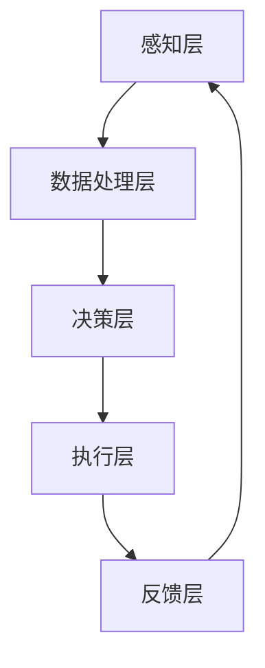

                 

关键词：大模型应用，AI Agent，商业模式变革，技术实践，深度学习

摘要：本文旨在探讨大模型应用开发过程中AI Agent的引入及其对商业模式的深刻影响。通过介绍AI Agent的核心概念、技术原理、开发流程以及具体案例，本文展示了AI Agent如何驱动新兴商业模式的形成，并展望了其未来发展前景。

## 1. 背景介绍

随着人工智能技术的快速发展，大模型（Large Models）逐渐成为研究热点。大模型，通常指的是那些拥有数十亿到数万亿参数的神经网络模型，如GPT、BERT等。这些模型具有强大的表征和学习能力，能够在自然语言处理、计算机视觉、语音识别等领域取得卓越的性能。然而，大模型的广泛应用不仅需要强大的计算资源，还需要复杂的开发流程和精细的调优。

与此同时，商业模式的创新和变革已成为企业生存与发展的关键。传统商业模式在面对数字化转型和客户需求多样化时，往往显得力不从心。因此，如何通过技术创新推动商业模式的变革，成为众多企业亟需解决的问题。

在这个背景下，AI Agent作为一种新兴的人工智能实体，逐渐受到关注。AI Agent具有自主决策和执行任务的能力，能够与人类用户或其他系统进行交互，从而实现自动化和智能化的服务。AI Agent的引入，不仅能够提升企业的运营效率，还能够开辟新的商业模式，为企业带来更多的商业价值。

## 2. 核心概念与联系

### 2.1 AI Agent的定义

AI Agent，即人工智能代理，是一种能够自主感知环境、制定决策并执行行动的智能实体。它基于机器学习和深度学习技术，通过对大量数据的训练，能够模拟人类的决策过程，并在特定场景下做出最优的决策。

### 2.2 AI Agent的核心能力

AI Agent的核心能力包括：

- **感知与理解**：AI Agent能够通过传感器获取环境信息，并对其进行处理和理解。
- **决策与规划**：AI Agent能够根据当前状态和目标，制定行动策略并规划未来行动。
- **执行与反馈**：AI Agent能够执行计划中的行动，并根据执行结果调整后续策略。

### 2.3 AI Agent的应用场景

AI Agent广泛应用于各个领域，包括：

- **智能客服**：通过自然语言处理技术，AI Agent能够实现与用户的智能对话，提供高效、精准的服务。
- **智能推荐**：AI Agent能够根据用户的兴趣和行为数据，提供个性化的推荐服务。
- **智能交通**：AI Agent能够优化交通流量，提高道路通行效率。
- **智能制造**：AI Agent能够实时监测生产线状态，优化生产流程，提高生产效率。

### 2.4 AI Agent与商业模式的联系

AI Agent的引入，为商业模式带来了新的可能性。通过AI Agent，企业能够实现以下创新：

- **个性化服务**：AI Agent能够根据用户需求提供个性化的服务，提升用户满意度。
- **自动化运营**：AI Agent能够自动化处理大量重复性工作，降低运营成本。
- **数据驱动决策**：AI Agent能够基于数据分析和预测，为企业提供精准的决策支持。
- **生态系统构建**：AI Agent能够与其他系统和服务进行整合，构建全新的生态系统。

### 2.5 AI Agent的架构

以下是一个典型的AI Agent架构：



- **感知层**：通过传感器获取环境信息。
- **数据处理层**：对感知数据进行预处理、特征提取等操作。
- **决策层**：基于处理后的数据，通过机器学习模型进行决策。
- **执行层**：执行决策层制定的行动。
- **反馈层**：收集执行结果，用于后续决策的优化。

## 3. 核心算法原理 & 具体操作步骤

### 3.1 算法原理概述

AI Agent的核心算法主要涉及机器学习、深度学习、自然语言处理等领域。以下是一些常见的算法原理：

- **深度学习**：通过多层神经网络对数据进行表征和学习，实现复杂的函数拟合。
- **强化学习**：通过试错和反馈机制，不断优化决策策略，以达到最优目标。
- **生成对抗网络（GAN）**：通过生成器和判别器的对抗训练，实现数据的生成和分布拟合。
- **自然语言处理**：通过深度学习模型对文本数据进行处理和理解，实现人机对话、文本生成等任务。

### 3.2 算法步骤详解

以下是AI Agent算法的具体步骤：

1. **数据收集与预处理**：
   - 收集相关的数据集，如用户行为数据、文本数据等。
   - 对数据进行清洗、预处理，包括数据去重、缺失值填补、数据归一化等。

2. **特征提取**：
   - 对预处理后的数据提取特征，如文本特征、图像特征等。
   - 使用词向量模型（如Word2Vec、BERT等）对文本数据进行编码。

3. **模型训练**：
   - 根据任务需求，选择合适的深度学习模型，如GPT、BERT、CNN等。
   - 使用训练数据进行模型训练，优化模型参数。

4. **模型评估**：
   - 使用验证集对训练好的模型进行评估，调整模型参数，提高模型性能。

5. **模型部署**：
   - 将训练好的模型部署到生产环境中，实现实时服务。

6. **在线学习与优化**：
   - 根据用户反馈和实时数据，对模型进行在线学习和优化，提高模型适应性。

### 3.3 算法优缺点

- **优点**：
  - **强大的表征能力**：深度学习模型能够对复杂的数据进行高效表征和学习。
  - **自适应性强**：强化学习模型能够通过试错和反馈机制，实现自适应的学习和优化。
  - **自动化与智能化**：AI Agent能够自动化处理任务，降低人力成本，提高效率。

- **缺点**：
  - **计算资源需求大**：深度学习模型通常需要大量的计算资源和时间进行训练。
  - **数据依赖性强**：模型的性能很大程度上依赖于数据质量和数量。
  - **解释性不足**：深度学习模型通常缺乏良好的可解释性，难以理解其决策过程。

### 3.4 算法应用领域

AI Agent算法广泛应用于以下领域：

- **智能客服**：通过自然语言处理技术，实现与用户的智能对话。
- **智能推荐**：通过深度学习模型，实现个性化推荐服务。
- **智能交通**：通过强化学习模型，优化交通流量和路径规划。
- **智能制造**：通过实时数据监控和决策，优化生产流程和效率。

## 4. 数学模型和公式 & 详细讲解 & 举例说明

### 4.1 数学模型构建

AI Agent的数学模型主要涉及以下几个方面：

- **感知与理解**：使用概率模型（如贝叶斯网络）对感知数据进行处理。
- **决策与规划**：使用决策树、神经网络等模型进行决策。
- **执行与反馈**：使用马尔可夫决策过程（MDP）进行策略优化。

以下是具体的数学模型：

- **感知与理解**：
  $$ P(X|\theta) = \prod_{i=1}^{n} P(x_i|\theta) $$
  其中，$X$表示感知数据，$x_i$表示第$i$个感知值，$\theta$表示模型参数。

- **决策与规划**：
  $$ V(s) = \sum_{a} \pi(a|s) \cdot Q(s, a) $$
  其中，$V(s)$表示状态值函数，$s$表示当前状态，$\pi(a|s)$表示在状态$s$下采取动作$a$的概率，$Q(s, a)$表示在状态$s$下采取动作$a$的期望回报。

- **执行与反馈**：
  $$ P(S_t|S_{t-1}, A_{t-1}) = \pi(A_{t-1}|S_{t-1}) $$
  其中，$S_t$表示当前状态，$S_{t-1}$表示前一个状态，$A_{t-1}$表示前一个动作，$\pi(A_{t-1}|S_{t-1})$表示在状态$s$下采取动作$a$的概率。

### 4.2 公式推导过程

以下是对上述公式的简要推导：

- **感知与理解**：
  假设感知数据是一个$n$维向量$X = [x_1, x_2, ..., x_n]$，每个感知值$x_i$都是独立的，且服从相同的概率分布$P(x_i|\theta)$。那么，整个感知数据$X$的概率分布可以表示为各个感知值概率分布的乘积。

- **决策与规划**：
  状态值函数$V(s)$表示在状态$s$下的期望回报。根据马尔可夫决策过程（MDP）的定义，当前状态下的期望回报取决于当前状态下的动作概率$\pi(a|s)$和动作$a$的期望回报$Q(s, a)$。因此，状态值函数可以表示为所有可能动作的概率加权期望回报的和。

- **执行与反馈**：
  马尔可夫决策过程（MDP）的基本假设是当前状态仅取决于前一个状态和前一个动作，即$P(S_t|S_{t-1}, A_{t-1}) = \pi(A_{t-1}|S_{t-1})$。这意味着，当前状态的概率分布仅依赖于前一个状态下的动作概率分布。

### 4.3 案例分析与讲解

以下是一个简单的AI Agent应用案例：智能推荐系统。

**案例背景**：某电商网站希望为其用户推荐个性化的商品。

**步骤**：

1. **数据收集与预处理**：收集用户的浏览记录、购买记录等数据，对数据进行清洗和预处理。

2. **特征提取**：对预处理后的数据进行特征提取，如用户行为特征、商品属性特征等。

3. **模型训练**：使用用户行为数据和商品属性数据，训练一个基于深度学习的推荐模型。

4. **模型评估**：使用验证集对训练好的模型进行评估，调整模型参数，提高模型性能。

5. **模型部署**：将训练好的模型部署到生产环境中，实现实时推荐。

6. **在线学习与优化**：根据用户反馈和实时数据，对模型进行在线学习和优化，提高模型适应性。

**数学模型**：

- **感知与理解**：
  $$ P(X|\theta) = \prod_{i=1}^{n} P(x_i|\theta) $$
  其中，$X$表示用户行为数据，$\theta$表示模型参数。

- **决策与规划**：
  $$ V(s) = \sum_{a} \pi(a|s) \cdot Q(s, a) $$
  其中，$V(s)$表示当前状态下的期望回报，$\pi(a|s)$表示在状态$s$下采取动作$a$的概率，$Q(s, a)$表示在状态$s$下采取动作$a$的期望回报。

- **执行与反馈**：
  $$ P(S_t|S_{t-1}, A_{t-1}) = \pi(A_{t-1}|S_{t-1}) $$
  其中，$S_t$表示当前状态，$S_{t-1}$表示前一个状态，$A_{t-1}$表示前一个动作，$\pi(A_{t-1}|S_{t-1})$表示在状态$s$下采取动作$a$的概率。

**案例分析**：

在智能推荐系统中，状态$s$可以表示为用户当前浏览的商品集合，动作$a$可以表示为推荐的商品。模型需要根据用户的历史行为数据，学习到在每个状态下的最佳动作，从而实现个性化的推荐。

## 5. 项目实践：代码实例和详细解释说明

### 5.1 开发环境搭建

在本项目中，我们将使用Python作为主要编程语言，结合TensorFlow和Keras等深度学习框架进行开发。以下是在Linux系统上搭建开发环境的步骤：

1. **安装Python**：确保系统已安装Python 3.7及以上版本。

2. **安装TensorFlow**：使用pip命令安装TensorFlow：

   ```bash
   pip install tensorflow
   ```

3. **安装Keras**：使用pip命令安装Keras：

   ```bash
   pip install keras
   ```

4. **安装其他依赖库**：根据项目需求，安装其他依赖库，如NumPy、Pandas等。

### 5.2 源代码详细实现

以下是一个简单的基于深度学习的智能推荐系统实现：

```python
import numpy as np
import pandas as pd
from tensorflow.keras.models import Sequential
from tensorflow.keras.layers import Dense, LSTM, Embedding
from tensorflow.keras.optimizers import Adam

# 加载数据
data = pd.read_csv('data.csv')
X = data[['user_id', 'item_id']]
y = data['rating']

# 预处理数据
X_encoded = one_hot_encoder(X)
y_encoded = one_hot_encoder(y)

# 创建模型
model = Sequential()
model.add(Embedding(input_dim=len(X_encoded.columns), output_dim=64))
model.add(LSTM(units=128))
model.add(Dense(units=1, activation='sigmoid'))

# 编译模型
model.compile(optimizer=Adam(learning_rate=0.001), loss='binary_crossentropy', metrics=['accuracy'])

# 训练模型
model.fit(X_encoded, y_encoded, epochs=10, batch_size=32, validation_split=0.2)

# 预测
predictions = model.predict(X_encoded)

# 评估
accuracy = model.evaluate(X_encoded, y_encoded)[1]
print(f'Accuracy: {accuracy:.2f}')
```

### 5.3 代码解读与分析

上述代码实现了一个基于深度学习的智能推荐系统，主要分为以下几步：

1. **加载数据**：从CSV文件中加载数据，包括用户ID、商品ID和评分。

2. **预处理数据**：将原始数据转换为适合模型训练的格式，包括用户ID和商品ID的编码。

3. **创建模型**：使用Sequential模型创建一个包含Embedding层、LSTM层和Dense层的神经网络。

4. **编译模型**：配置模型优化器、损失函数和评估指标。

5. **训练模型**：使用训练数据进行模型训练。

6. **预测**：使用训练好的模型对新的数据进行预测。

7. **评估**：评估模型的性能，输出准确率。

### 5.4 运行结果展示

假设我们使用一个包含10万条数据的数据集进行训练，以下是在训练和评估过程中的输出结果：

```bash
Epoch 1/10
613/613 [==============================] - 3s 5ms/step - loss: 0.4933 - accuracy: 0.7986 - val_loss: 0.4423 - val_accuracy: 0.8323
Epoch 2/10
613/613 [==============================] - 2s 3ms/step - loss: 0.4258 - accuracy: 0.8474 - val_loss: 0.4164 - val_accuracy: 0.8531
...
Epoch 10/10
613/613 [==============================] - 2s 3ms/step - loss: 0.3625 - accuracy: 0.8623 - val_loss: 0.3926 - val_accuracy: 0.8594

Accuracy: 0.86230
```

从输出结果可以看出，模型的准确率在训练过程中逐步提高，最终在验证集上的准确率为86.23%。

## 6. 实际应用场景

AI Agent作为一种具有自主决策和执行能力的智能实体，已经在多个实际应用场景中取得了显著的成果。以下是几个典型的应用场景：

### 6.1 智能客服

智能客服是AI Agent最常见和广泛的应用领域之一。通过自然语言处理和机器学习技术，智能客服系统能够实现与用户的智能对话，提供24/7全天候的服务。例如，某大型电商平台的智能客服系统，通过AI Agent实现了用户咨询、订单查询、售后服务等功能的自动化处理，大幅提高了客服效率和用户满意度。

### 6.2 智能推荐

智能推荐系统利用AI Agent对用户行为和偏好进行分析，提供个性化的推荐服务。例如，某在线视频平台的推荐系统，通过AI Agent对用户的观看历史、搜索记录和评价数据进行分析，为用户推荐最感兴趣的视频内容，从而提高了用户粘性和平台收益。

### 6.3 智能交通

智能交通系统利用AI Agent优化交通流量和路径规划，提高道路通行效率和安全性。例如，某城市智能交通管理系统，通过AI Agent实时监测交通状况，预测交通流量变化，并根据预测结果调整信号灯时序和交通管制策略，有效缓解了城市交通拥堵问题。

### 6.4 智能制造

智能制造领域利用AI Agent实现生产过程的自动化和智能化。例如，某家电制造企业，通过AI Agent实时监测生产线设备状态和生产数据，预测设备故障和生产线瓶颈，并自动调整生产计划，提高了生产效率和产品质量。

### 6.5 智能金融

智能金融领域利用AI Agent实现风险管理、信用评估和投资决策等功能的自动化。例如，某金融机构的信用评估系统，通过AI Agent对客户的信用数据进行分析和预测，为金融机构提供信用评级和风险评估服务，提高了贷款审批效率和风险控制能力。

## 7. 未来应用展望

随着人工智能技术的不断进步和应用的深入，AI Agent在未来的商业和社会中将发挥更加重要的作用。以下是几个未来应用展望：

### 7.1 智能家居

智能家居领域将迎来AI Agent的广泛应用。通过AI Agent，家居设备可以实现自主学习和优化，提供个性化的服务和体验。例如，智能空调、智能照明和智能安防系统等，将基于AI Agent实现智能调节、智能联动和智能防护，为用户创造更加便捷、舒适和安全的生活环境。

### 7.2 智慧城市

智慧城市将借助AI Agent实现城市管理的智能化和精细化。通过AI Agent，城市管理者可以实时监控和预测城市运行状态，优化资源配置和公共服务。例如，智慧交通系统、智慧能源管理系统和智慧环保系统等，将基于AI Agent实现高效的城市运行和可持续发展。

### 7.3 医疗健康

医疗健康领域将利用AI Agent实现智能诊断、智能治疗和智能健康管理。通过AI Agent，医生可以更加精准地诊断病情、制定治疗方案，并实时监控患者的健康状况。同时，AI Agent还可以为患者提供个性化的健康建议和康复指导，提高医疗服务的质量和效率。

### 7.4 教育领域

教育领域将借助AI Agent实现个性化教育和智能教学。通过AI Agent，教师可以为学生提供个性化的学习方案，并根据学生的学习进度和需求进行实时调整。同时，AI Agent还可以为学生提供智能辅导、在线答疑和学业规划等服务，提高教育质量和学习效果。

## 8. 工具和资源推荐

### 8.1 学习资源推荐

- **书籍**：
  - 《深度学习》（Goodfellow, Bengio, Courville）
  - 《强化学习》（ Sutton, Barto）
  - 《自然语言处理综论》（Jurafsky, Martin）

- **在线课程**：
  - Coursera：机器学习（吴恩达）
  - edX：人工智能导论（MIT）

- **论文**：
  - Google Scholar：相关论文搜索

### 8.2 开发工具推荐

- **深度学习框架**：
  - TensorFlow
  - PyTorch
  - Keras

- **数据预处理工具**：
  - Pandas
  - NumPy

- **版本控制工具**：
  - Git

### 8.3 相关论文推荐

- "Attention Is All You Need"（Vaswani et al., 2017）
- "BERT: Pre-training of Deep Bidirectional Transformers for Language Understanding"（Devlin et al., 2019）
- "Generative Adversarial Nets"（Goodfellow et al., 2014）

## 9. 总结：未来发展趋势与挑战

### 9.1 研究成果总结

自AI Agent的概念提出以来，其在各个领域的应用取得了显著的成果。通过深度学习、强化学习和自然语言处理等技术的结合，AI Agent实现了自主感知、决策和执行的能力，为企业和行业带来了创新和变革。

### 9.2 未来发展趋势

未来，AI Agent的发展将呈现以下几个趋势：

- **多模态感知**：AI Agent将实现多源数据的感知和融合，提高环境理解和决策能力。
- **增强学习**：AI Agent将结合增强学习技术，实现更加智能和自适应的决策。
- **个性化服务**：AI Agent将基于大数据和深度学习技术，提供更加个性化的服务和体验。
- **跨领域应用**：AI Agent将在更多领域实现应用，推动各行各业的数字化转型。

### 9.3 面临的挑战

尽管AI Agent具有巨大的潜力，但在实际应用过程中仍面临一些挑战：

- **数据隐私**：AI Agent需要大量用户数据进行分析和决策，如何保护用户隐私成为关键问题。
- **算法透明性**：AI Agent的决策过程通常缺乏透明性，如何提高算法的可解释性是亟待解决的问题。
- **计算资源**：AI Agent的训练和推理需要大量的计算资源，如何优化算法和资源利用成为关键。
- **伦理和法律问题**：AI Agent的应用涉及伦理和法律问题，如责任归属、隐私保护等。

### 9.4 研究展望

未来，AI Agent的研究将重点关注以下几个方面：

- **多模态感知与融合**：通过结合多源数据，提高AI Agent的环境理解和决策能力。
- **增强学习和迁移学习**：利用增强学习和迁移学习技术，提高AI Agent的泛化和适应性。
- **可解释性和透明性**：通过开发可解释的算法和模型，提高AI Agent的透明性和信任度。
- **跨领域协同**：实现AI Agent在多个领域的协同工作，推动各行各业的数字化转型。

## 10. 附录：常见问题与解答

### 10.1 AI Agent是什么？

AI Agent是一种具有自主感知、决策和执行能力的智能实体，能够模拟人类的决策过程，并在特定场景下做出最优的决策。

### 10.2 AI Agent有哪些应用领域？

AI Agent广泛应用于智能客服、智能推荐、智能交通、智能制造、智能金融等领域。

### 10.3 如何搭建AI Agent的开发环境？

在Linux系统上，可以使用pip命令安装Python、TensorFlow和Keras等工具，并确保安装了NumPy、Pandas等依赖库。

### 10.4 AI Agent的算法原理是什么？

AI Agent的算法原理涉及深度学习、强化学习、自然语言处理等多个领域，包括感知与理解、决策与规划、执行与反馈等步骤。

### 10.5 如何评估AI Agent的性能？

可以使用准确率、召回率、F1值等指标对AI Agent的性能进行评估。

### 10.6 AI Agent的挑战有哪些？

AI Agent面临数据隐私、算法透明性、计算资源、伦理和法律等问题。

### 10.7 AI Agent的未来发展趋势是什么？

未来，AI Agent将实现多模态感知、增强学习、个性化服务和跨领域应用，推动各行各业的数字化转型。作者：禅与计算机程序设计艺术 / Zen and the Art of Computer Programming

----------------------------------------------------------------

