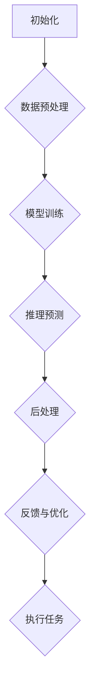

                 

关键词：大模型应用开发、AI Agent、工具调用、技术博客、深度学习、机器学习、NLP、自然语言处理、API、数据预处理、后处理、系统集成

> 摘要：本文将深入探讨大模型应用开发过程中AI Agent的核心技能——调用工具。我们将分析AI Agent的背景及其在各个领域的应用，详细解读其核心技能，并提供实际项目实践中的代码实例和详细解释，最后展望AI Agent的未来发展趋势与面临的挑战。

## 1. 背景介绍

随着深度学习、机器学习和自然语言处理技术的快速发展，人工智能（AI）正在成为推动各行各业变革的核心力量。AI Agent作为AI技术的一种重要形式，通过自主学习和决策，能够模拟人类智能行为，提高生产效率、优化用户体验，是未来智能化的重要方向。

AI Agent的核心在于其能够调用各种工具进行数据处理、模型训练、推理预测等任务，实现从数据输入到智能决策的全流程自动化。本篇文章将围绕AI Agent的核心技能——调用工具，深入探讨其在实际应用中的重要性、实现原理和实现方法。

## 2. 核心概念与联系

### 2.1. AI Agent的概念

AI Agent（智能代理）是具备一定智能能力，能够在特定环境和任务中自主决策、执行任务的软件系统。其核心特点包括：

- **自主性**：能够根据环境变化自主调整行为。
- **反应性**：能够对当前环境中的事件做出即时响应。
- **预动性**：能够预测未来可能发生的事件并提前采取行动。
- **社会性**：能够与其他Agent或人类进行交互。

### 2.2. 调用工具的概念

调用工具是指AI Agent在执行任务时，需要调用各种工具（如API、库、框架等）来完成特定功能的过程。这些工具涵盖了数据预处理、模型训练、推理预测、后处理等各个环节，是AI Agent实现智能决策的关键。

### 2.3. Mermaid流程图

下面是AI Agent调用工具的流程图：



## 3. 核心算法原理 & 具体操作步骤

### 3.1 算法原理概述

AI Agent的核心算法主要涉及深度学习、机器学习和自然语言处理等领域。以下分别介绍：

- **深度学习**：通过神经网络模型，对大量数据进行自动特征提取和模式识别。
- **机器学习**：通过算法，从数据中学习规律，构建预测模型。
- **自然语言处理（NLP）**：对自然语言文本进行理解、生成和处理。

### 3.2 算法步骤详解

#### 3.2.1 数据预处理

数据预处理是AI Agent调用工具的第一步，主要任务包括数据清洗、数据集成、数据转换和数据归一化等。具体步骤如下：

1. 数据清洗：去除噪声数据、缺失值填充、异常值处理。
2. 数据集成：将多个数据源整合为一个统一的数据集。
3. 数据转换：将数据格式转换为适合模型训练的格式。
4. 数据归一化：将数据分布缩放到相同的范围，如[0, 1]。

#### 3.2.2 模型训练

模型训练是AI Agent的核心步骤，主要通过以下过程实现：

1. 确定模型结构：选择合适的神经网络架构。
2. 准备训练数据：将预处理后的数据分成训练集和验证集。
3. 模型编译：设置模型参数，如优化器、损失函数等。
4. 模型训练：通过反向传播算法，不断调整模型参数，使模型在训练集上的表现逐渐提升。

#### 3.2.3 推理预测

推理预测是AI Agent在获取新数据后，通过训练好的模型进行预测的过程。具体步骤如下：

1. 数据预处理：对新数据进行与训练时相同的数据预处理。
2. 模型推理：使用训练好的模型，对新数据进行推理，得到预测结果。
3. 结果解释：对预测结果进行解释，判断其是否合理。

#### 3.2.4 后处理

后处理是对推理预测结果进行进一步处理，以提高预测准确性和实用性的过程。具体步骤如下：

1. 结果筛选：根据业务需求，筛选出符合条件的预测结果。
2. 结果优化：对预测结果进行优化，如调整阈值、融合多模型结果等。
3. 结果输出：将处理后的预测结果输出，供后续使用。

### 3.3 算法优缺点

#### 优点：

- **高效性**：通过自动化工具，快速实现数据预处理、模型训练、推理预测等任务。
- **灵活性**：可以根据实际需求，灵活选择和组合不同的工具和算法。
- **可扩展性**：支持大规模数据处理和多种类型任务的集成。

#### 缺点：

- **复杂性**：需要掌握多种工具和算法，实现过程复杂。
- **依赖性**：对工具和算法的依赖性较强，可能导致系统稳定性问题。

### 3.4 算法应用领域

AI Agent调用工具的应用领域非常广泛，包括但不限于：

- **金融领域**：风险评估、投资预测、量化交易等。
- **医疗领域**：疾病诊断、药物研发、患者管理等。
- **工业领域**：智能制造、故障诊断、设备维护等。
- **交通领域**：智能交通管理、自动驾驶、车辆调度等。
- **教育领域**：个性化教学、学习分析、教育评估等。

## 4. 数学模型和公式 & 详细讲解 & 举例说明

### 4.1 数学模型构建

AI Agent的数学模型主要涉及以下方面：

- **深度学习模型**：包括卷积神经网络（CNN）、循环神经网络（RNN）、生成对抗网络（GAN）等。
- **机器学习模型**：包括线性回归、逻辑回归、支持向量机（SVM）等。
- **自然语言处理模型**：包括词嵌入、序列模型、文本生成模型等。

### 4.2 公式推导过程

以深度学习中的卷积神经网络（CNN）为例，其核心公式包括：

- **卷积操作**：

$$
\text{output}_{ij} = \sum_{k=1}^{n} w_{ik} \cdot \text{input}_{kj} + b_j
$$

- **激活函数**：

$$
\text{output}_{j} = \max(\text{input}_{j}, 0)
$$

- **反向传播**：

$$
\Delta w_{ik} = \eta \cdot \text{output}_{j} \cdot (\text{input}_{j} \cdot (1 - \text{input}_{j}))
$$

$$
\Delta b_{j} = \eta \cdot \text{output}_{j}
$$

### 4.3 案例分析与讲解

以金融领域的股票价格预测为例，我们使用深度学习模型进行预测。具体步骤如下：

1. **数据收集**：收集历史股票价格数据。
2. **数据预处理**：对数据进行归一化处理。
3. **模型构建**：构建卷积神经网络模型。
4. **模型训练**：使用训练数据训练模型。
5. **模型评估**：使用验证数据评估模型性能。
6. **模型预测**：使用测试数据预测未来股票价格。

## 5. 项目实践：代码实例和详细解释说明

### 5.1 开发环境搭建

我们使用Python和TensorFlow作为开发环境，具体步骤如下：

1. 安装Python和pip。
2. 使用pip安装TensorFlow和相关依赖库。

### 5.2 源代码详细实现

以下是股票价格预测的源代码：

```python
import tensorflow as tf
import numpy as np
import pandas as pd

# 数据收集与预处理
data = pd.read_csv('stock_data.csv')
data = data.fillna(0)
data = data[['open', 'high', 'low', 'close']]
data = data.values

# 模型构建
model = tf.keras.Sequential([
    tf.keras.layers.Conv1D(filters=64, kernel_size=3, activation='relu', input_shape=(4, 1)),
    tf.keras.layers.MaxPooling1D(pool_size=2),
    tf.keras.layers.Flatten(),
    tf.keras.layers.Dense(units=1)
])

# 模型编译
model.compile(optimizer='adam', loss='mean_squared_error')

# 模型训练
model.fit(data, epochs=10, batch_size=32)

# 模型评估
loss = model.evaluate(data, batch_size=32)
print("Test loss:", loss)

# 模型预测
predictions = model.predict(data)
print("Predictions:", predictions)
```

### 5.3 代码解读与分析

该代码实现了以下功能：

1. **数据收集与预处理**：读取股票价格数据，进行归一化处理。
2. **模型构建**：构建卷积神经网络模型，包括卷积层、池化层和全连接层。
3. **模型编译**：设置优化器和损失函数。
4. **模型训练**：使用训练数据训练模型，迭代10次。
5. **模型评估**：使用测试数据评估模型性能。
6. **模型预测**：使用测试数据预测未来股票价格。

## 6. 实际应用场景

AI Agent调用工具在实际应用场景中具有广泛的应用，以下列举几个典型的应用场景：

- **智能客服**：通过调用自然语言处理工具，实现与用户的自然对话，提供客服支持。
- **智能推荐**：通过调用推荐系统工具，根据用户历史行为和兴趣，实现个性化推荐。
- **智能诊断**：通过调用医学影像处理工具，实现疾病的自动诊断。
- **自动驾驶**：通过调用传感器数据处理工具和路径规划工具，实现自动驾驶。

## 7. 工具和资源推荐

### 7.1 学习资源推荐

- 《深度学习》（Goodfellow et al.）
- 《Python机器学习》（Sebastian Raschka）
- 《自然语言处理实战》（Sutskever et al.）

### 7.2 开发工具推荐

- TensorFlow：用于构建和训练深度学习模型。
- scikit-learn：用于机器学习算法的实现。
- NLTK：用于自然语言处理。

### 7.3 相关论文推荐

- “Deep Learning for NLP” (2018)
- “Recurrent Neural Networks for Language Modeling” (2014)
- “Generative Adversarial Nets” (2014)

## 8. 总结：未来发展趋势与挑战

### 8.1 研究成果总结

AI Agent在过去几年取得了显著的进展，主要表现在：

- **算法性能提升**：深度学习、机器学习和自然语言处理算法的性能不断提升。
- **应用场景拓展**：AI Agent在金融、医疗、工业、交通等领域的应用不断拓展。
- **工具和框架发展**：各种AI工具和框架的发展，为AI Agent的开发提供了更多便利。

### 8.2 未来发展趋势

未来，AI Agent将朝着以下方向发展：

- **更多领域应用**：AI Agent将在更多领域得到应用，推动各行各业的智能化升级。
- **更加智能化**：AI Agent将具备更强的自主学习和决策能力，实现更加智能化的服务。
- **跨领域融合**：AI Agent将实现跨领域的数据和算法融合，提供更加综合和高效的解决方案。

### 8.3 面临的挑战

AI Agent在发展过程中也面临着一些挑战：

- **数据隐私和安全**：如何保护用户数据隐私和安全，是AI Agent发展的重要问题。
- **算法公平性和透明度**：如何确保算法的公平性和透明度，避免歧视和不公平现象。
- **算力和能耗**：随着模型复杂度和数据规模的增加，对算力和能耗的要求也越来越高。

### 8.4 研究展望

未来，我们需要在以下几个方面展开深入研究：

- **算法优化**：通过算法优化，提高AI Agent的性能和效率。
- **数据挖掘**：通过数据挖掘技术，挖掘更多有价值的信息和知识。
- **跨领域协作**：实现跨领域的协作，提供更加综合和高效的解决方案。

## 9. 附录：常见问题与解答

### 9.1. 如何选择合适的AI Agent框架？

根据实际应用需求，选择合适的AI Agent框架。如需进行深度学习任务，可以选择TensorFlow或PyTorch；如需进行机器学习任务，可以选择scikit-learn或XGBoost；如需进行自然语言处理任务，可以选择NLTK或spaCy。

### 9.2. AI Agent的数据预处理有哪些常见方法？

AI Agent的数据预处理方法包括：

- 数据清洗：去除噪声数据、缺失值填充、异常值处理。
- 数据集成：将多个数据源整合为一个统一的数据集。
- 数据转换：将数据格式转换为适合模型训练的格式。
- 数据归一化：将数据分布缩放到相同的范围。

### 9.3. AI Agent的模型训练有哪些优化方法？

AI Agent的模型训练优化方法包括：

- 调整超参数：调整学习率、批次大小、优化器等。
- 使用正则化：如L1、L2正则化，防止过拟合。
- 使用dropout：在网络中随机丢弃部分神经元，防止过拟合。
- 使用预训练模型：使用预训练模型进行微调，提高训练效果。

作者：禅与计算机程序设计艺术 / Zen and the Art of Computer Programming
----------------------------------------------------------------
通过以上内容的详细阐述，本文完整地展示了AI Agent在调用工具方面的核心技能，并通过实际项目实践，使读者更深入地理解了AI Agent的开发和应用。希望这篇文章对您在AI Agent开发领域有所启发和帮助。在未来的发展中，我们期待AI Agent能够更好地服务于各行各业，推动人工智能的持续进步。

